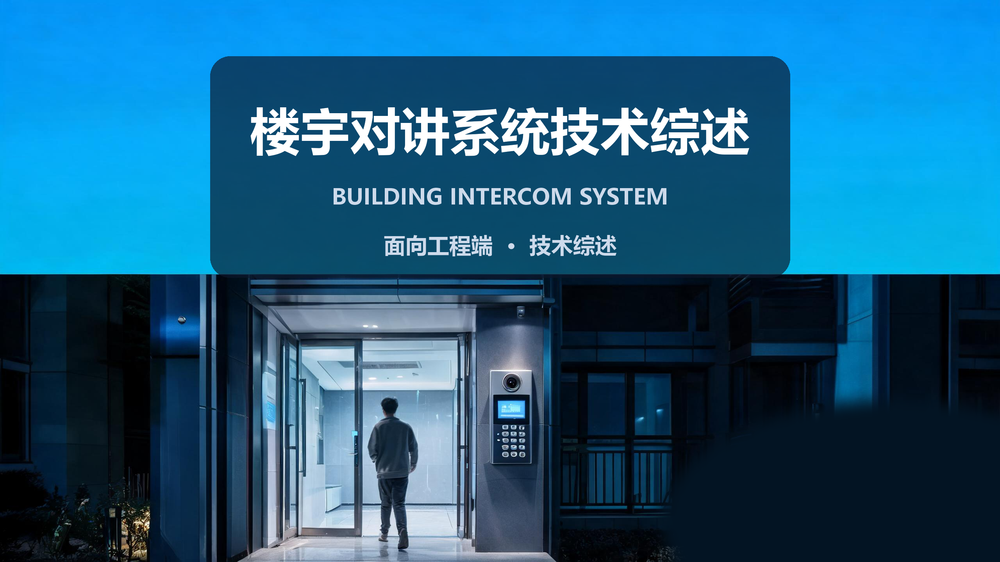
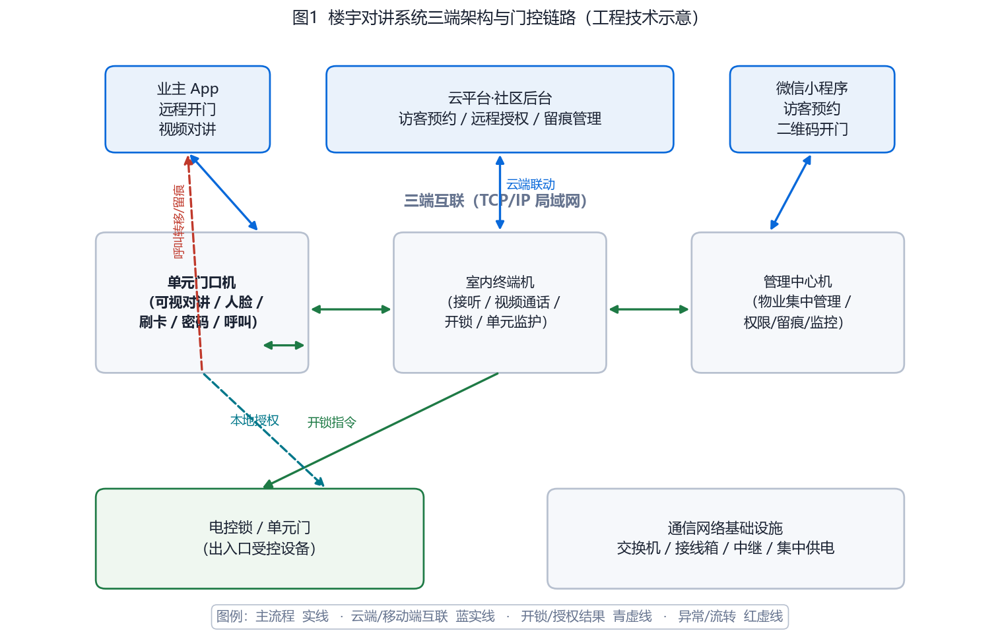
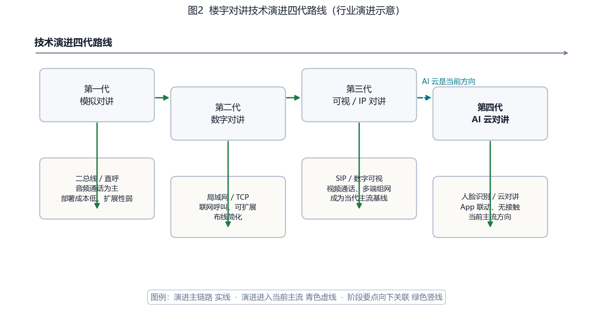
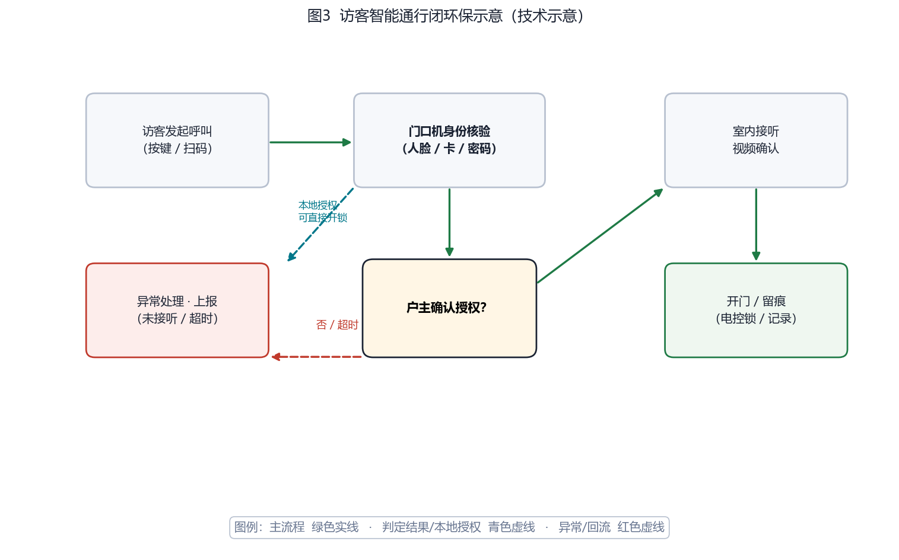
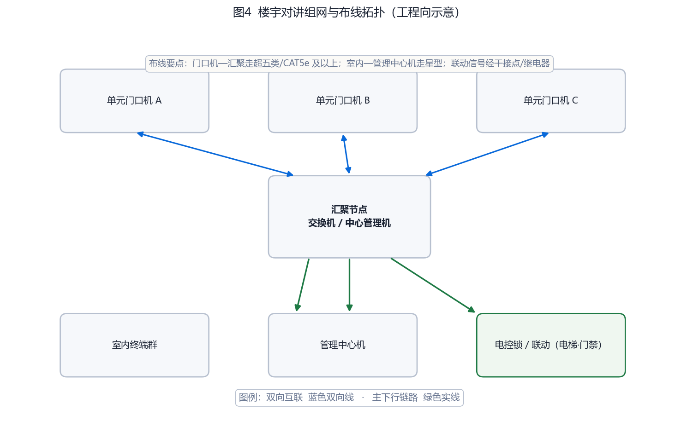

# 楼宇对讲系统技术综述 · 面向工程端

> 
> 

---

## 〇、一句话定位

**楼宇对讲系统是"单元入口到户内的最后一米身份核验与远程交互终端"：把门口访客、户内终端、物业中心连成一条可视、可控、可留痕的通行与通讯链路。**

它的价值主张不是"能说话"这么简单——现代楼宇对讲已经从"听得见"演进到"看得见、认得准、开得了门、留得下证据"。对工程人员而言，它是一门"综合布线 + 网络组网 + 身份识别 + 平台联动"的集成课：选型、布线、供电、联动的每一环都决定交付质量。

---

## 一、产品设计方案：三端架构与形态

### 1.1 系统形态全景

一套完整的楼宇对讲系统由**三端一云**构成：

| 端 | 形态 | 承担职责 |
| --- | --- | --- |
| 单元门口机 | 楼栋单元入口，墙上壁挂设备 | 访客身份核验（人脸/卡/密码/扫码）、呼叫、采集、开锁 |
| 室内终端机 | 住户户内，壁挂或桌面 | 接听呼叫、双向视频通话、开锁、监护单元门口 |
| 管理中心机 | 物业/安保中心 | 集中管理、权限配置、访客记录、监视与广播 |
| 云平台 / 移动端 | 业主 App、微信小程序 | 远程开门、访客预约、二维码开门、留痕查询 |

图1给出三端架构与门控链路。


**图1 楼宇对讲系统三端架构与门控链路（工程技术示意图）**

### 1.2 工程约束与设计要点

工程端设计楼宇对讲，核心是三件事：**怎么布线、怎么供电、怎么联动**。

- **布线选型**：数字/IP 对讲优先超五类（CAT5e）及以上网线；门口机到汇聚节点段承载音视频流，需稳定千兆或百兆以太网，传输距离受 100 米以太网物理限制，超距单元需加中继或光纤转换。
- **供电设计**：集中供电或总线供电（具体见 2.2），需核算总负载与余量，避免末端压降导致开锁继电器误动作。
- **联动边界**：与电梯联动、门禁、监控的联动多经干接点/继电器电气隔离，防止强电干扰弱电系统。

---

## 二、核心参数与选型【工程向专用】

### 2.1 选型公式与关键指标

选型先用公式把"需求"转成"参数"，再谈品牌与价格。工程端最重要的三个核算：

**① 电锁开锁负载核算**

```
总开锁电流 = Σ(各路电锁额定电流)
集中供电容量 ≥ 总开锁电流 × 1.4（余量）× 同时系数
```
> 电锁（电磁锁/电控锁/阴极锁）额定电流各型号差异大，以 150 mA–400 mA 量级为工程基准估算。**余量系数建议 ≥1.3–1.5**，供电线路有压降时按最长线路复核末端电压是否满足锁的吸合电压下限。

**② 视频码流与存储核算（联网可视对讲回放留痕）**

```
单路码流(Mbps) = 分辨率像素 × 帧率 × 压缩系数
回放存储(GB/天/路) = 单路码流 × 3600 × 24 / 8 / 1000
```
> 示例（工程基准）：720p 3Mbps、7 天 × 4 路，约需 `3×3600×24/8/1000×7×4 ≈ 91 GB`。人流量大的单元门口留痕建议 7 天起，涉保区域按项目要求延长至 30 天。

**③ 带载单元核算**

```
一台汇聚/中控可管理门口机与室内机的数量受通道与供电共同限制
超载表现：呼叫无响应、视频卡顿、开锁延迟
```
> 设计时统计**每个单元的门数与户数**，按"一门口一室内"或"一门口多室内"配比核算中控通道，预留 20–30% 扩展余量。

### 2.2 三端部件参数表（字段 + 工程关注点）

| 部件 | 关键参数 | 工程关注点 |
| --- | --- | --- |
| 单元门口机 | 识别方式（人脸/卡/密码/扫码）、摄像头分辨率（≥720p 建议 1080p）、补光、防拆、防尘防水（IP 等级） | 户外安装必须选具备补光与一定 IP 防护；人脸识别考虑低照度场景与活体防伪 |
| 室内终端机 | 屏幕尺寸、视频通话清晰度、开锁输出（干接点/继电器）、供电方式 | 开锁输出需匹配电锁类型；确认是否为独立供电，避免与门口机串线 |
| 管理中心机 | 通道数、权限管理、访客记录、远程监视、广播 | 关注能否对接物业平台与第三方（短信/工单） |
| 汇聚/交换设备 | 端口数、供电能力、管理能力 | 单点故障考量——核心汇聚建议双机或冗余链路 |
| 云平台/App | 并发、远程开门时延、二维码时效、留痕存储 | 云对讲依赖网络，评估断网降级方案（本地授权仍可开门） |

### 2.3 工程对接踩坑点

1. **跨品牌不兼容**：门口机与室内机、管理中心机尽量同品牌同协议（SIP 兼容性也需验证），不同品牌混接先用 DEMO 验证注册与呼叫。
2. **POE 供电不足**：多路门口机走 POE 时核算交换机总 POE 预算，避免超载导致设备间歇掉线。
3. **人脸识别环境差异**：户外逆光/强光/低照度导致误识，选带宽动态、补光、算法支持活体检测的设备。
4. **联动回环**：开锁信号与电梯/门禁联动若共用干接点，注意触点电流与消弧，防继电器粘连。
5. **网络依赖边界**：云对讲功能断网失效，务必保留本地授权开门能力作为降级路径（图3 中的青色虚线路径）。

---

## 三、技术原理：从模拟总线到 AI 云

理解楼宇对讲，先看它的技术演进脉络（图2）。

### 3.1 四代演进

| 代际 | 技术特征 | 部署/扩展 |
| --- | --- | --- |
| 第一代 | 模拟对讲，二总线/直呼，音频通话 | 成本低、扩展性弱 |
| 第二代 | 数字对讲，局域网/TCP，联网呼叫 | 布线简化、可扩展 |
| 第三代 | 可视/IP 对讲，SIP/数字可视、多端组网 | 当代主流基线 |
| 第四代 | AI 云对讲，人脸识别、App 联动、无接触 | 当前主流方向 |

演进驱动力是"数字化 → 可视化 → 智能化/云化"三条线叠加：传输介质从二总线走向 TCP/IP 再到云平台；交互从纯音频走向视频通话再到无接触 AI；部署从本地走向局域网多端组网再到云化弹性扩展。第三代（SIP/IP 可视）是当前交付的主流技术基线，第四代（AI 云）是新增需求的热点方向。


**图2 楼宇对讲技术演进四代路线（行业演进示意）**

### 3.2 当前技术链路：身份核验到门控

现代系统的核心技术在于"识别 + 解算 + 门控"三段链路，图3给出访客通行闭环。


**图3 访客智能通行闭环保示意（技术示意）**

- **识别**：门口机做人脸（边缘端比对）/IC 卡/密码/扫码核验。人脸识别近年准确率显著提升——据行业资料，识别精度已从早期约 85% 量级提升到 2022 年 99% 以上量级（FAR 控制在极低水平）；此处为行业演进实况引用，具体数值取决于算法与场景。
- **解算**：菱形判定节点"户主确认授权？"。访客呼叫→室内接听→视频确认→授权，形成"谁授权、谁负责"的责任闭环。
- **门控**：授权后向电控锁下发开锁/留痕指令。**关键工程设计是"核验可直接放行"的降级路径**——即使是本地授权（人脸/卡通过即开门），也在图3中以青色虚线给出，确保断网时基础通行不瘫痪。

### 3.3 网络安全与隐私

楼宇对讲同时是"门禁"与"监控"交汇点，安全要求高：

- 界面数据加密、通信信道鉴权，防门口机被伪装接入、防开锁指令被截获重放。
- 人脸等生物特征属敏感个人信息，采集需遵循最小必要原则；存储加密、不越权留存。涉《个人信息保护法》与生物特征识别相关标准（如活体防伪、数据加密强度、隐私保护机制的专项检测）已成行业趋势。

---

## 四、产品功能与差异化

### 4.1 核心能力清单

| 能力 | 说明 | 工程落点 |
| --- | --- | --- |
| 可视呼叫 | 访客呼叫、双向视频通话 | 音视质量与码流核算 |
| 多模态识别 | 人脸/IC 卡/密码/二维码 | 识别方式的权限分级 |
| 远程开门 | App/小程序远程授权、二维码开门 | 云对讲联网 + 断网降级 |
| 管理中心集中管理 | 权限、访客留痕、监视、广播 | 对接物业平台 |
| 留痕与审计 | 抓拍/时间戳/授权方式记录 | 存储核算、合规留存 |

### 4.2 差异化与增强能力

- **断网可用的设计**：这是被低估的差异点。纯云对讲断网即失效；而"本地授权 + 云端增强"的分层设计，让系统在故障下仍守得住单元门。
- **联动放大**：与门禁、监控、电梯、智能家居联动，把"单元门"变成"社区-楼栋-家庭"三级节点的协同入口（详见第 6 节行业趋势）。
- **无接触体验**：刷脸/无感通行、访客预约动态二维码，改善通行体验并减少人员接触，契合当前社区需求。

---

## 五、实际案例与设计方案【工程向】

### 案例 A：新建高层住宅小区（200 户 / 4 单元）

**需求**：新建商品住宅精装交付，采用数字可视对讲，兼顾物业管理与访客预约，人脸识别为主、卡为辅。

**方案设计**：
- 三端：每单元 1 台门口机（人脸+刷卡+密码+呼叫）、每户 1 台室内终端、物业 1 台管理中心机；门口机经交换机汇聚入局，室内机星型回管理中心。
- 云联动：微信小程序访客预约生成临时二维码；业主 App 远程开门、接听转移。

**配置核算**：
- 电锁开锁负载：按 4 单元各 1 把电锁，单把 300 mA 基准，集中供电容量 `4×0.3×1.4 ≈ 1.68 A`，选 2 A 以上供电模块留余量。
- 留痕存储：4 门口机 1080p 约 4 Mbps，保存 7 天：`4×4×3600×24/8/1000×7 ≈ 120 GB`，配 128 GB 或项目按需延长。

**交付价值**：实现无接触通行、访客预约留痕、物业统一管理；人脸识别为主、卡为辅的权限分级兼顾安全与便利。

### 案例 B：既有老旧小区改造（存量升级）

**需求**：原模拟对讲设备老化、无法联网、无留痕，改造为联网可视对讲并对接智慧社区。

**方案设计**：
- 保留建筑结构不变，替换门口机为 IP 可视对讲机，室内机按需同步更换；借老旧小区改造带动安防升级（行业口径：存量小区安防升级被列为改造配套项之一，政策性需求明显）。
- 汇聚节点与物业中心改造，对接智慧社区平台；联动门禁与监控。

**配置核算**：
- 组网拓扑按图4星型/汇聚设计；超 100 米的门口机经中继或光纤，核算新增线缆与供电。
- 因既有线缆可能不满足 CAT5e，先做线材检测再决定是否重新布线。

**交付价值**：低破坏完成全楼联网改造，补齐留痕与远程开门；借政策窗口降低改造成本。


**图4 楼宇对讲组网与布线拓扑（工程向示意）**

### 工程落地核算检查清单

- [ ] 单元数 × 门数 × 户数统计完整，中控通道与供电余量已核算
- [ ] 电锁类型与开锁负载匹配，供电容量 ≥1.3–1.5 倍余量
- [ ] 视频码流与留痕存储满足项目留存周期
- [ ] 布线线缆规格（≥CAT5e）与 100 米传输限制复核，超距已设中继/光纤
- [ ] 跨品牌设备协议（SIP）先验证再落地
- [ ] POE 供电预算充足；联动信号经干接点/继电器隔离
- [ ] 云对讲断网时本地授权开门路径已保留并可验证
- [ ] 人脸等生物特征采集遵循最小必要原则并加密存留

---

## 六、市场背景与竞争格局

### 6.1 市场与需求驱动

楼宇对讲正处于"存量升级 + 新建智能化"双轮驱动阶段。**需审慎看待市场数字**：行业规模数据多来自商业研究机构，因统计口径（是否含门禁、电梯联动、全屋智能）差异，多家机构给出的绝对数值从一百多亿到三百多亿不等——引用时须带口径，不宜直接并列比较。可以做定性判断：

- **需求增长**：联网/可视对讲增速普遍高于传统模拟对讲，反映从"通讯工具"向"社区交互中枢"的升级。
- **驱动因素**：老旧小区改造安防配套、新建住宅精装与全屋智能政策（如部分地区要求新建住宅配置楼宇对讲等基本智能产品）、物业对访客预约/远程开门/留痕管理的需求。
- **集中度提升**：行业新增企业数量近年趋缓，存量品牌格局趋于集中，且有明确的地产供应链采购偏好。

**数据口径说明**：以上市场规模量为定性判断+引用商业研究口径；上市公司财务（见下文）来自公开财报，可信度更高。

### 6.2 竞争格局

**房建供应链 TOP10（2025，中国房地产业协会 / 易居中国 / 中房优采）**——注意这是"品牌偏好/工程采购"排名，非全市场口径份额：

| 梯队 | 代表厂商 | 定位/特征 |
| --- | --- | --- |
| 头部国产 | 狄耐克（上市公司） | 楼宇对讲为核心，融合 TCP/IP、4G/5G、SIP、云通信、人脸识别；2025 年报楼宇对讲收入占比过半 |
| 头部国产 | 立林科技 | 地产配套沉淀深、覆盖大量家庭用户与智能化小区，被引为百强地产常见供应商口径 |
| 第二梯队 | 麦驰、冠林、米立、慧锐通等 | 区域或细分市场各有侧重，中端性价比厂商（如慧锐通）具成本与海外拓展优势 |
| 安防巨头 | 海康威视、大华股份 | 依托"视频 + 门禁 + AI"协同，以集成方案切入楼宇对讲 |
| 外资高端 | 霍尼韦尔、松下、博世 | 主攻高端别墅、酒店、政府机关、甲级写字楼，品牌与高端项目口碑占优 |

**格局判断**：国产头部厂商在房地产配套与大众市场占据主导，外资集中于高端细分；安防巨头借协同生态向上渗透，行业呈"头部集中 + 生态化竞争"方向。

---

## 七、商业模式与趋势

### 7.1 交付形态与盈利模式

- **硬件销售**：门口机、室内机、管理中心机、公共设备仍是传统主要收入来源。
- **系统项目**：面向地产商、物业、政府项目的集成、安装调试、维保服务。
- **软件/平台服务**：行业趋势是软件与服务收入占比上升——研究机构预计软件与服务收入占比有望超过硬件，成为楼宇对讲厂商新的盈利重心（此为商业研究口径的趋势判断）。云平台、App、SaaS 社区服务是支撑点。
- **智能家居/智慧社区联动**：把对讲机做成"社区大脑—楼栋入口—家庭中枢"生态的接入节点，放大单点价值。

### 7.2 趋势路线

1. **无接触 AI 对讲**：刷脸/无感通行、访客预约二维码，减少接触并提升安全与效率。
2. **全屋智能联动**：对讲与门禁、监控、电梯、智能家居深度融合，从"门房设备"变"社区入口节点"。
3. **云化与 SaaS**：重硬件向"硬件 + 平台服务"转变，软件与服务收入占比提升。
4. **隐私合规强化**：人脸等生物特征识别伴随更多的活体防伪、数据加密、隐私保护专项要求，倒逼厂商技术投入。

### 7.3 对工程端的启示

选型不再只看"能不能通话"，而要看"断网能否守住门、识别能否多模态应对环境、联动能否接得进物业与智慧社区、隐私合规是否过关、软件平台能否持续迭代"。把系统当作"可持续运营的社区入口节点"来设计，比按"单台设备"来采购更稳妥。

