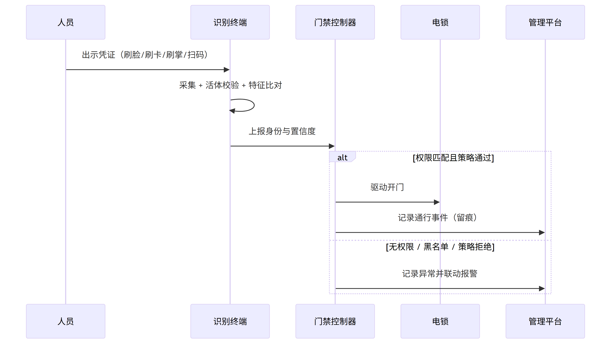
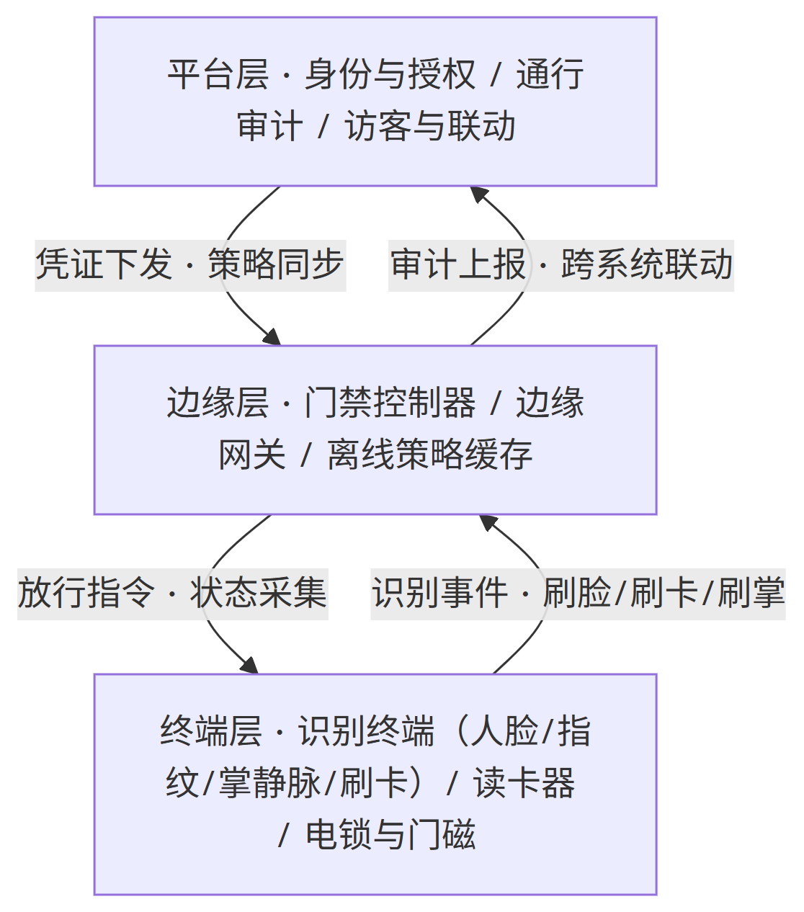
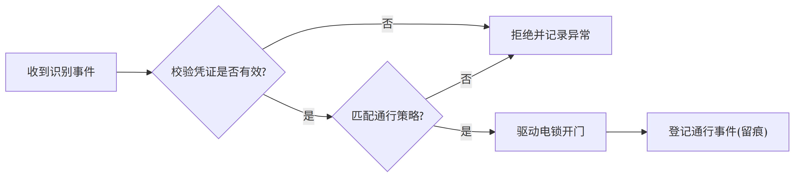
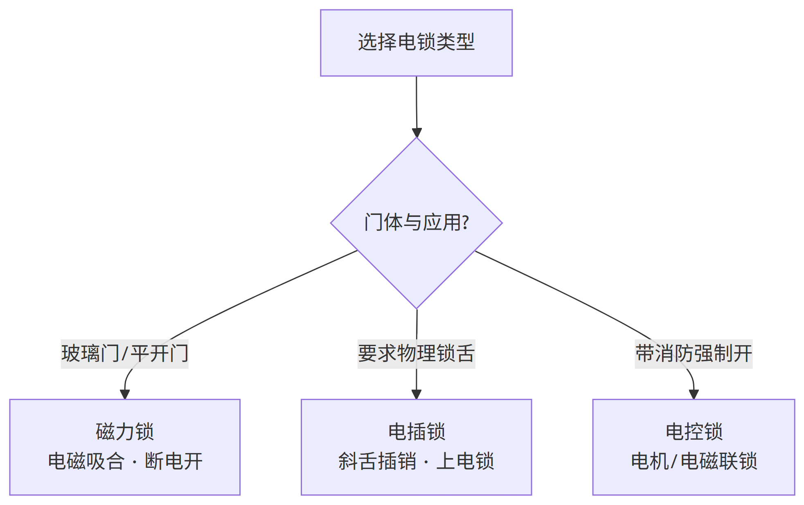
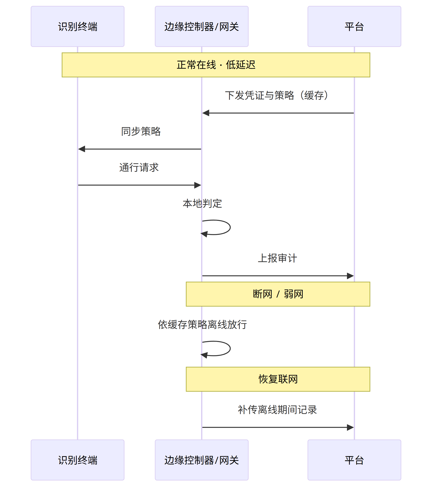
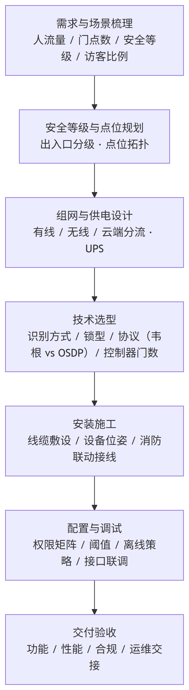
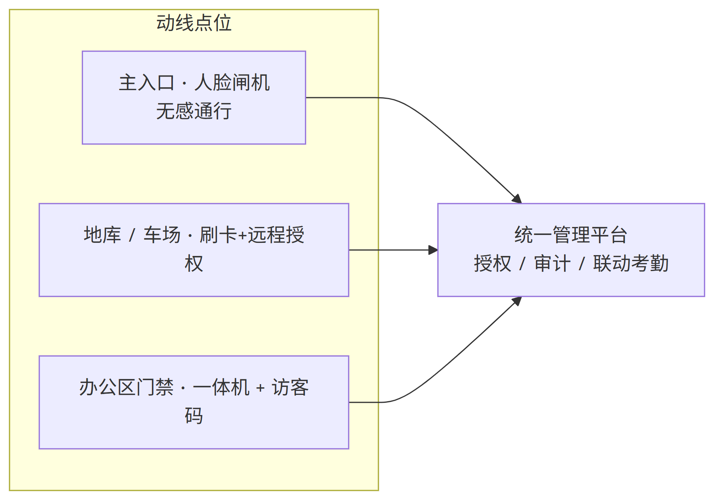

# 门禁设备（泛门禁系统）技术分析

> 本报告**聚焦产品系统本身**：系统架构、技术路径与原理、核心功能、方案设计与落地案例。
> 不含市场规模、行业增速与多厂商横向对比。读者对象：安防 / 智能硬件从业者、方案集成商、实施工程师。

---

## 一、系统总览：门禁在管一个"信任闭环"

一句话定位：**门禁系统是以身份凭证为入口、以授权策略为中枢、串联感知识别—决策控制—执行输出—通信留痕的出入口控制基础设施**。

门禁早已不是"开门"这一个动作。一次通行，背后是一条完整的信任闭环：

按物理位置，这套闭环部署在三层上：

技术原理部分，就沿着这条链路的四个环节逐层拆开：**感知识别层先"说清你是谁"，决策控制层再"决定让不让你进"，执行输出层最后"做出开门的动作"，通信组网层保证信息可靠地传到该去的地方**。

---

## 二、技术原理：一趟通行是怎么走通的

### 2.1 感知识别层：先"说清楚你是谁"

识别层负责把"人"转成一个可判定的凭证身份。凭证可分为物凭证与生物特征两大类，各自的物理原理决定了安全性与体验。

#### 物凭证：卡片与钥匙

IC 卡 / 钥匙式凭证本质是**射频识别（RFID）或近场通信（NFC）**。卡内嵌一枚线圈芯片，读卡器发射射频场，芯片感应取电并把卡内存储的 ID（如 Mifare 卡的块结构数据）调制回传。其优势是体系成熟、识别快（<100ms）；先天短板是**凭证可复制**——早期卡号未加密时极易被克隆，这也是门禁安全攻击的第一个重灾区。

#### 生物特征凭证：指纹、人脸、掌/指静脉

| 方式 | 物理原理 | 优势 | 主要局限 / 风险 |
| --- | --- | --- | --- |
| 指纹 | 电容/光学传感器读取指尖脊谷纹路，比对特征点 | 单机成本低、体验成熟 | 受汗渍、磨损影响；属"复制性"特征 |
| 人脸 2D | 普通摄像头提取五官关键点与纹理比对 | 无感、成本低 | 受光照/遮挡影响；对照片/屏幕攻击敏感 |
| 人脸 3D / 红外 | 结构光或红外成像重建三维深度，抗平面照片欺骗 | 无感且抗攻击强 | 设备成本高；需合理打光与安装位姿 |
| 掌静脉 / 指静脉 | 近红外光照射手部，血红蛋白吸收成像出静脉纹理 | **体内特征**、依赖血流、自带活体、全人群适配 | 成本较高；识别过程需正常手掌放置 |
| 多模态融合 | 组合上述多种证据交叉验证 | 降低误识、冗余性强 | 成本与部署复杂度上升 |

三条容易被低估的判断，决定识别层的真实段位：

- **活体检测**：区分真人面与照片/视频/面具，靠红外深度与随机动作挑战实现。没有活体校验的人脸方案，本质上只是一台"照片比对照相机"。
- **FAR 与 FRR 是跷跷板**：FAR（认错人，如放陌生人进来）与 FRR（不让对的人进来，如堵住老人指纹、戴眼镜员工）此消彼长。现场要针对真实人群调阈值，而不是沿用出厂默认值。
- **静脉的"体内特征"价值**：掌静脉不是拍一张皮，而是读皮下血流纹理，天生抗克隆与破解，在生物特征合规收紧的背景下成为差异化出口。

#### 其他凭证：扫码、蓝牙 / 手机 NFC、临时码

用于访客、无卡场景与远程开门。它们把"在场持有凭证"简化为"携带手机即可"，但必须与到期回收机制配合，否则权限容易失控。

### 2.2 决策控制层："让不让他进"凭什么说了算

识别层只给出"这个人是谁、置信度多高"；**真正做"放行与否"决定的是门禁控制器**。其逻辑非常简单清晰：

授权的核心是一个**"人—门—时段"三维权限矩阵**：谁、在什么时间段、能过哪几道门。通行策略则在此之上叠加业务规则：

- **常开 / 常闭 / 单向 / 双向**：按场所属性设置。消防通道应默认常闭并在紧急时时强制开门放大。
- **黑名单与白名单**：异常人员命中即拒绝并联动。
- **防尾随 / 防返传**：检测一人一闸或权限折返使用，硬防"蹭门"与"过卡回收"。
- **双人授权（黄金区）**：高安全区要求两人同时到场（或不少于 n 人）才放行。
- **消防 / 应急联动**：探测到火灾信号时**强制断电开门**，把逃生通道从"安全死角"变回生命通道——这是合规红线，接法必须符合规范。

一个常被忽视但决定现场可用性的机制是**离线决策**。云平台把凭证与策略缓存到边缘，断网或弱网时仍由本地控制器判定放行，恢复联网后再补传审计记录。离线策略的缓存时长是"可用性"与"安全"之间的权衡：缓存太长泄露的窗口变大，太短则弱网环境频繁卡人。

### 2.3 执行输出层：最后那一下"咔嗒"

决策通过后，动作由机电执行机构完成——**电锁**。三种主流电锁的机械原理不同，适用对象也不同：

| 锁型 | 工作原理 | 适用 | 注意事项 |
| --- | --- | --- | --- |
| 磁力锁 | 通电电磁吸合，断电即开 | 玻璃门、平开门，逃生优先 | 断电即开，需评估断电安全场景 |
| 电插锁 | 斜舌/插销机械闭锁，上电锁定 | 需要实际锁舌的门体 | 需电源与门磁配合做状态反馈 |
| 电控锁 | 电机/电磁联动锁体 | 常闭高安全门 | 联线较多，需专业接线 |

与电锁配套的是**门磁**（监测门开闭状态）与**出门按钮 / 无线出门开关**。它们完成安全闭环：开门 → 门磁检测到位 → 若超时未关则报警，防止"开后不关"与挟持溜门。

### 2.4 通信组网层：信息怎么可靠地传

链路是门禁交付里最容易被低估、却最影响安全与运维的一环。信息流向两段：读卡器 → 控制器（识别链路）、控制器 → 平台（组网上行）。

- **识别链路：韦根 vs OSDP**
  - **韦根（Wiegand）**：重量级存量协议，明文单向，把卡号并行送出即结束。速度标识过时、可截获克隆、距离受限，且读卡器无法向控制器回询自身状态。
  - **OSDP**：加密、双向、支持总线轮询，能回询读卡器健康状态并安全下发密钥，是健壮性意义上的升级路径。

- **组网上行：RS-485 / 以太网 / 无线 / 云网关**：按点位规模、布线成本、是否需要云管理选择。工程上遵循"信号线与强电分离、屏蔽接地"的原则，避免干扰误放行。

云-边-端三类状态的流转，是最能解释"门禁凭什么在弱网也得可靠"的图景：

### 2.5 端到端可验收指标

技术讲解最后应落在"可量化、可验收"的指标上，而非抽象形容词：

| 指标 | 参考基准 | 意义 |
| --- | --- | --- |
| 端到端识别响应 | < 300ms | 判定通行体验与吞吐 |
| 离线续用时长 | 视策略缓存配置（如 1–72h） | 弱网现场的可用性 |
| FAR / FRR | 按现场人群调优 | 放错人 vs 卡对人的平衡 |
| 断电续航 | UPS 覆盖时长 | 供电保障与逃生兜底 |
| 并发点位规模 | 控制器与平台承载 | 是否满足整体规划 |

---

## 三、核心功能清单

- **多凭证兼容**：卡、二维码、蓝牙/手机 NFC、人脸、指纹、掌静脉并行，按场景配置非唯一验证。
- **通行策略引擎**：常开/常闭/时段/单双向/黑名单/防尾随/双人授权。
- **访客与临时权限**：远程授权、临时码、到期自动回收。
- **离线与双模式**：断网续用 + 恢复后补传。
- **联动报警**：异常事件实时推送，联动视频抓拍、声光报警、消防与梯控。
- **全局审计**：通行记录留痕、导出、"人—门—时间—凭证"关联回溯。

---

## 四、方案设计与落地：从图纸到交付

本节面向集成商与实施工程师，以现实案例讲解"怎么把系统装进一栋真实的建筑"。核心是一个主流程，再加三个贴近生活的案例。

### 4.0 通用设计流程

无论多复杂的门禁，落地都遵循同一条主流程：

### 案例 A · 写字楼无感通行（高客流 + 复杂访客）

**场景痛点**：早晚高峰闸机排队长；访客登记靠前台登记本，效率低、留痕差；考勤与门禁数据割裂。

**方案设计**：按动线分四个点位——主入口人脸闸机做无感通行、地库/车场采用刷卡 + 远程授权、各楼层办公区布门禁一体机并接访客临时码、所有数据汇入统一平台联动考勤。

**选型要点**：主入口用人脸闸机（选带活体检测的 3D/红外款，避免照片破解）；访客权限走临时二维码，到期自动回收；识别链路优先 OSDP 保障安全可运维。

**安装要点**：闸机人脸终端按 1.5±0.2m 高度、正对通行方向安装并调整打光，避免逆光与侧脸；信号线与强电分离、屏蔽接地；访客通道预留无障碍位置。

**配置调试**：先在后台建"权限矩阵"（谁 × 哪个门 × 时段）再批量下发；把考勤作为联动开关，实现"刷脸即考勤、考勤即进出"。人脸阈值按真实员工群体现场调优，避免眼镜/妆容误拒。

**验收**：实测端到端响应 <300ms，断网环境下闸机仍按缓存策略放行；导出审计核对"门—人—时间"闭环。

### 案例 B · 老旧社区改造 + 电动车入梯管控

**场景痛点**：小区门禁老化、外来人员进出难管；电动车随意进电梯造成楼道安全隐患与火灾风险。

**方案设计**：在模式上加两道防线——单元门口刷脸/刷卡门禁识别常住与访客；电梯内增加防电动车识别，识别到电动车即阻止电梯下行并联动提示。

**选型要点**：社区场景优先掌静脉或人脸（非唯一验证），兼顾老人指纹难、儿童身高差，且符合人脸识别的合规红线；电动车识别用摄像头 + 本地推理，减少误报与隐私采集。

**安装要点**：楼道门上门磁需与门体匹配；电动车识别摄像头装在电梯轿厢顶部，兼顾多种车型与反动物；注意设备供电与楼道环境的耐久（防潮、防尘）。

**验收**：验证常住者可信通道（人脸/静脉）放行、访客需授权、防电动车告警联动电梯广播与物业看板三件事同时成立。

### 案例 C · 数据中心高安全区（双人授权 + 应急联动）

**场景痛点**：机房属高等级防护区，单人进入有越权与安全风险；火灾时又必须保证快速逃生。

**方案设计**：机密区与机柜区部署高安全门禁，开启**双人授权**（需两人同时在场才放行）；门禁与消防系统强联动——探测到火警即触发**强制断电开门**；同时接入视频复核。

**选型要点**：识别选多因子（如卡 + 掌静脉/人脸融合）提高置信度；控制器支持双人授权逻辑与消防直连输入；执行机构选带物理锁舌的电插锁，兼顾闭锁强度与火警强制开启。

**安装要点**：消防联动接线必须走合规接法（信号隔离、独立回路），逃生门不得做成"安全死角"；门磁与开门超时报警联动，防挟持溜门。

**验收**：实测双人授权放行与单人被拒；模拟火警验证 3 秒内强制开门；门超时未关触发平台告警与视频联动。

### 4.1 门禁零配件速查：电锁、读卡器与配套件

开门这个动作，最后落在一颗颗看得见的零配件上。下面把现场最常打交道的几类摆出来，每个都讲清三件事：**它负责什么、线怎么接、装在哪种门合适**。现场返工十有八九不是方案问题，而是三个低级错误：**断电方向选反、门磁没回读、信号线贴着强电走**。

| 零配件 | 功能用途 | 接线要求 | 典型场景 / 关键点 |
| --- | --- | --- | --- |
| 阴极锁（电击锁，Electric Strike） | 装在门框锁舌槽内的"电击板"，通电解开机械锁舌，让带把手/锁体的门能被推开；本身不锁门，靠配合的机械锁舌完成闭锁 | 12VDC（部分 24VDC），工作电流约 180–350mA；接门禁控制器继电器（可切换 NO/NC）；必须与机械锁体和门把手配合 | 木门、小铁门的单扇或固定扇；锁口要对准机械锁锁舌、门缝 ≤4mm；逃生通道选"断电开"型，并与机械锁舌确认互不干扰 |
| 阳极锁（电磁锁 / 磁力锁，Maglock） | 门扇上的吸附板与门框上的电磁模块通电吸合成一体，把门"压住"；断电即失去吸力自动开门 | 需**独立锁电源**给电锁供电；电源串联进控制回路，接继电器 **NO**（通电锁门、断电开门）；必须配门磁回读 | 玻璃门、防盗门、无框玻璃门；外露免挖孔、稳定返修低；无机械舌，状态只能靠门磁回读；本身就是"断电开"，天然适配逃生 |
| 电插锁（Electric Bolt Lock） | 锁舌（含斜舌）由电机/电磁驱动插进锁孔，把门真正闩上 | 12VDC 供电；有"断电开/断电关"两种，按逃生方向选；接继电器并配门磁回读关门状态 | 有框/无框玻璃门、木门；隐藏式、需挖锁孔，外观好、防撬；常闭高安全门选断电关，逃生门选断电开 |
| 灵性锁（电机锁 / 自动重锁） | 电机驱动锁体，配合闭门器**关门到位即自动上锁**，无需每次都刷卡即自动闭锁，兼顾便利与安全 | 常规四线：V+ / V- 接 12V 电源；NO 接门禁继电器常开（断电开门）；COM 接继电器公共端；接门磁确认关到位后再重锁 | 老旧小区、智慧社区单元门，追求"随手关门自动锁死"的室内门；配闭门器使用；布线注意信号线与强电分离 |
| 读卡器 / 识别终端 | 采集凭证（卡 / 二维码 / 指纹 / 人脸）并上报控制器，是"信任闭环"的入口 | 韦根两线（DATA0/DATA1）或 OSDP 总线接控制器；由控制器供电；信号线用屏蔽线并与强电分离 | 室内外按防护等级选型；识别链路优先 OSDP（加密双向、可回读健康状态）；安装位姿与打光决定识别率 |
| 出门按钮 / 无线出门开关 | 内部人员按一下直接开门，跳过识别流程 | 两线并到继电器（常开/常闭按锁型），或无线信号对接；消防常闭门需串安全回路 | 常规内部门；高安全区不放裸按钮，改"双按钮"或"刷卡 + 按钮" |
| 门磁 | 实时回读门开 / 关状态，支撑"开门超时未关告警"与挟持判定 | 传感器两线接控制器门磁输入；磁体与干簧管对位安装 | 一切"有没有锁上"的答案都靠它；装歪即误报；逃生门必须接回读 |
| 门禁控制器 / 门禁电源 | 判定放行，并为到锁点位供电 | 控制器为读卡器、门磁供电；电锁单独走锁电源并接在继电器之后；12V / 24V 分路 | 电锁属大电流，避免与控制器共用一个电源；逃生场景用 UPS 兜底断电 |

**接线第一条：断电方向决定了停电时门是开还是锁。** 安防现场最隐蔽的坑，就是电锁型号与消防逻辑对不上。

| 零配件 | 通电 | 断电 | 逃生合规建议 |
| --- | --- | --- | --- |
| 阳极锁（磁力锁） | 吸合（锁） | 开 | 本身就是断电开，直接可用 |
| 阴极锁 | 解开 | 闭（锁） | 逃生场景选"断电开"型，并与机械锁配合 |
| 电插锁 | 锁（上电锁） | 视型号而定 | 逃生门选断电开，常闭高安全门选断电关 |
| 灵性锁 | 解开 | 开（NO 接法） | 配合闭门器与门磁，实现断电即放行 |

这与 2.2 节"消防 / 应急联动强制断电开门"是同一套逻辑：**选型和接法必须和断电设计保持一致，逃生门绝不能因断电方向选反而变成"安全死角"**。

### 4.2 通用交付验收清单

| 维度 | 验收项 | 参考标准 |
| --- | --- | --- |
| 功能 | 多凭证、访客、离线、联动逐项过功能验收单 | 对照需求文档逐条核销 |
| 性能 | 端到端响应、识别准确率、断网续用时长实测 | 响应 <300ms；断网实测续用 |
| 合规 | 生物特征采集告示、非唯一验证、留痕审计 | 《个人信息保护法》《人脸识别办法》 |
| 运维 | 培训交接、工单流程、权限回收机制 | 交付文档与培训签到 |

---

## 五、应用场景速览

一套能力映射多个场景，本质是同一份"信任闭环"在不同场所的复刻：

- **办公 / 园区**：无感通行 + 访客管理 + 考勤一体化（案例 A）。
- **住宅 / 社区**：常住与访客通道分离 + 电动车入梯管控（案例 B）。
- **高安全场所**：双人授权、多因子认证、消防应急联动（案例 C）。
- **教育 / 医疗**：重点区域分级授权，私密空间不装人脸、合规适配。
- **连锁 / 无人零售**：多网点统一平台 + 云端巡检。

---

## 六、结语：评价一套门禁，看三条

沿本篇的脉络收敛，判断一套门禁系统是否靠谱，不看它堆了多少参数，而看三件事：

1. **信任闭环是否完整**：识别 → 决策 → 执行 → 留痕四个环节是否闭环、能否审计回溯。
2. **断网与合规是否兜底**：弱网能续用、生物特征采集合规，这两条决定现场真实可用与可验收。
3. **能否变成可运营的数据资产**：能否与考勤、视频、消防、梯控联动，把空间运营起来。

把这三个问题答清楚，比任何一张参数表都能更快说明"这套系统到底行不行"。