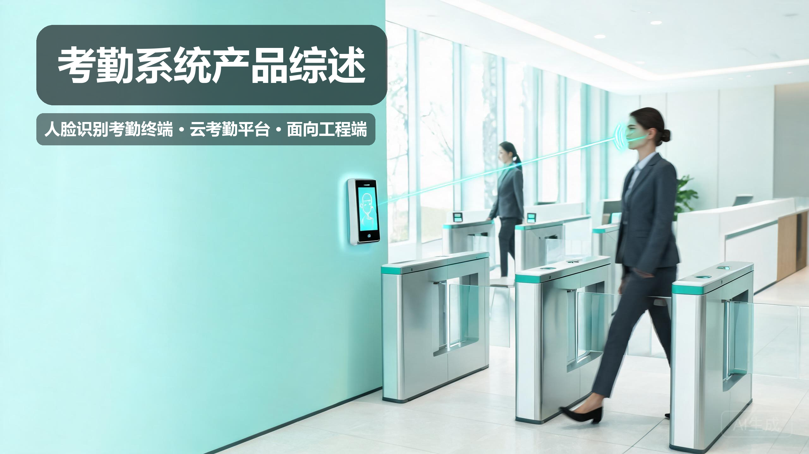
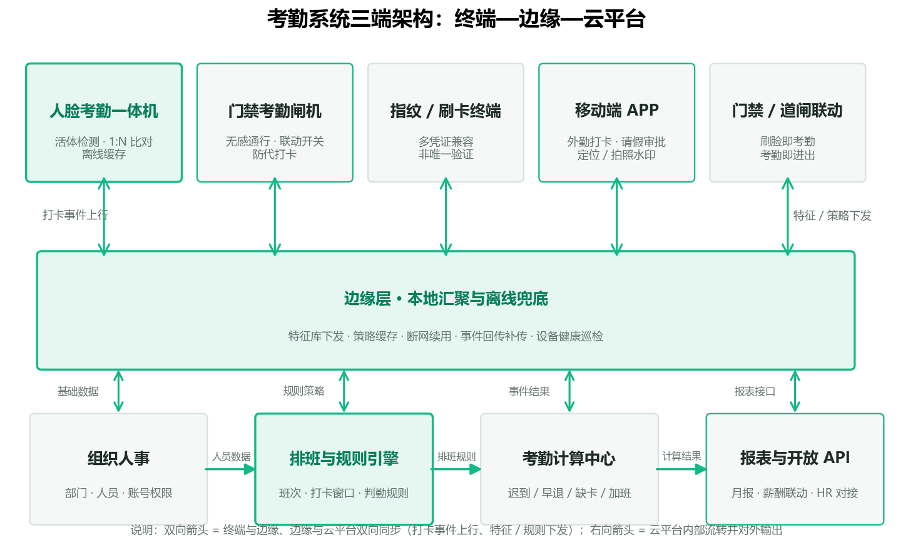
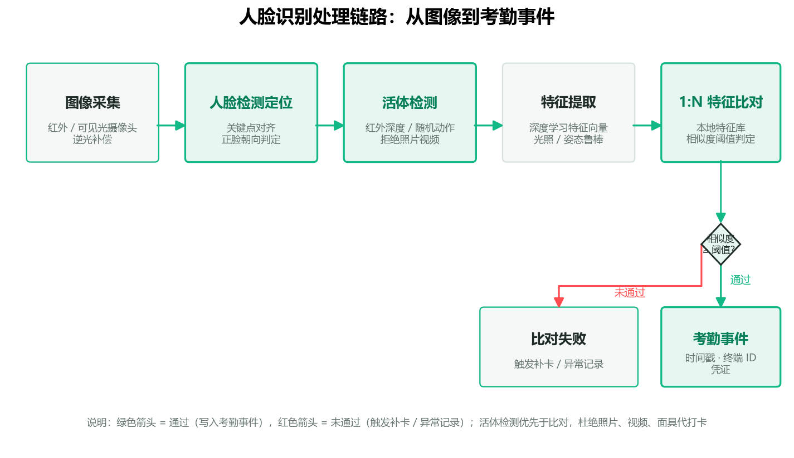
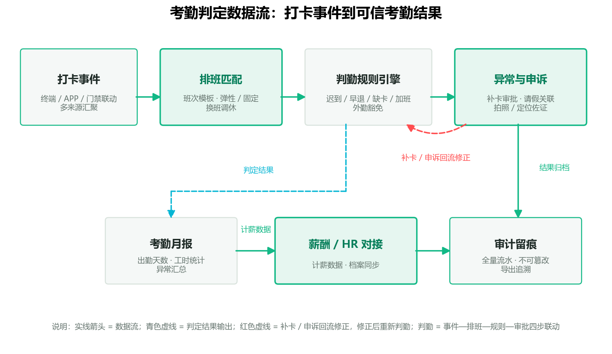
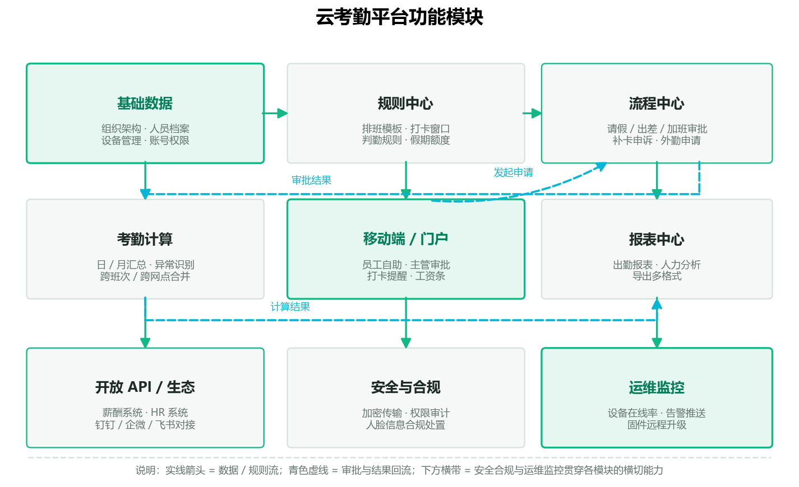

# 考勤系统产品综述

---

## 〇、一句话定位

**考勤系统是把"人的身份"与"考勤行为"精确绑定、把每一次打卡变成可信考勤数据的一体化识人—判勤—成据系统**。

考勤早已不是"一台打卡机记上下班时间"。一次正常打卡，背后是一条完整的链路：**终端识人（身份可信）→ 规则判勤（行为可信）→ 平台成据（数据可信）**。人脸识别终端负责"说清你是谁、是真人还是照片"，云考勤平台负责"这次打卡算不算数、记到谁头上"，两者合起来才构成可信考勤。

---

## 一、产品设计方案

### 1.1 系统架构：终端—边缘—云平台三端

一套完整的人脸识别考勤系统按职责分为三层：

- **终端层（识人）**：人脸考勤一体机、门禁考勤闸机、指纹/刷卡终端、移动端 APP。终端就近完成活体检测与 1:N 比对，把"人"转成一条带时间戳的打卡事件。
- **边缘层（兜底）**：本地汇聚网关，负责特征库下发、策略缓存与断网续用。弱网或断网时仍由边缘按缓存策略判勤，恢复联网后补传事件——这是考勤系统与普通打卡机最大的分水岭。
- **云平台层（成据）**：组织人事、排班与规则引擎、考勤计算中心、报表与开放 API。规则集中计算，结果与 HR / 薪酬系统对接。

### 1.2 主要产品形态与适用场景

| 形态 | 适用场景 | 关键能力 | 工程要点 |
| --- | --- | --- | --- |
| **人脸考勤一体机** | 中小办公、门店、厂区 | 活体检测、本地 1:N 比对、离线缓存 | 单机即用，安装位姿与打光决定识别率 |
| **门禁考勤闸机** | 高客流写字楼、园区主入口 | 无感通行、联动开关、防代打卡 | 与门禁控制器联动，一人一闸防尾随 |
| **指纹 / 刷卡终端** | 无生物识别合规要求的场所 | 多凭证兼容、非唯一验证 | 与 IC 卡 / 二维码并行，降低单一凭证风险 |
| **移动端 APP** | 外勤、连锁门店、工地 | 定位 / 拍照水印、请假审批 | 需与终端打卡数据合并判勤 |

### 1.3 设计要点与差异化卖点

- **身份可信**：活体检测优先于比对，拒绝照片、视频、面具代打卡。
- **行为可信**：打卡事件带终端 ID、时间戳、水印佐证，支持审计追溯。
- **数据可信**：判勤规则集中计算，结果可回流修正（补卡、申诉），避免终端各自为政。
- **离线兜底**：断网续用 + 恢复补传，弱网现场不丢考勤。
- **开放对接**：以 API 融入薪酬、HR、钉钉/企微/飞书生态。

### 1.4 设计中的工程约束

工程上先定"考什么勤"再选设备：**固定班、弹性班、还是外勤为主**，决定终端选型与平台规则配置。人脸终端安装高度约 1.5±0.2m、正对通行方向，避开逆光与侧脸；生物特征采集须按《个人信息保护法》做告知同意，优先非唯一验证。

---

## 二、核心参数与选型【工程端】

### 2.1 选型公式与关键指标

工程端选型第一落点是"先算再选"：先定**人流密度、通行速度、并发规模**，再匹配终端容量与网络带宽。

| 指标 | 工程通用基准 | 含义与工程关注点 |
| --- | --- | --- |
| 识别距离 | 30cm–1.5m（近距离）/ 1.5–3m（远距离闸机） | 决定安装位姿；远距离款对补光要求更高 |
| 识别速度 | 单次比对 < 300ms（端到端） | 高客流闸机吞吐的关键，< 1s 为通行体验底线 |
| 人脸库容量 | 1 万–5 万张（本地） | 与人员规模匹配；超大园区可分层下发特征 |
| FAR / FRR | 按现场人群调优 | 认错人 vs 卡对真人的跷跷板，需现场实测调阈值 |
| 活体检测 | 红外深度 / 3D 结构光 / 随机动作 | 无活体校验的人脸方案等于"照片比对机" |
| 离线续用时长 | 策略缓存 1–72h | 弱网现场可用性；缓存越长泄露窗口越大 |
| 防护等级 | 室内 IP41 / 户外 IP65 | 户外终端防尘防水、宽温 |

### 2.2 部件参数表

| 部件 | 关键参数 | 工程关注点 |
| --- | --- | --- |
| 摄像头 | 可见光 + 红外双摄；1080P 起 | 双摄支撑活体检测；逆光场景需宽动态 |
| 补光灯 | 红外补光 850nm / 940nm | 暗光与逆光补光；避免直射人眼不适 |
| 算法芯片 | 端侧 NPU 算力 | 决定本地 1:N 容量与识别帧率；弱网依赖本地算力 |
| 存储 | 本地人脸库 + 事件缓存 | 断网时缓存打卡记录，容量按 3–7 天事件估算 |
| 显示屏 | 触控屏 4.3"–8" | 交互、异常提示、考勤确认 |
| 接口 | 韦根 / OSDP / RS-485 / 以太网 | 与门禁控制器、闸机对接；优先 OSDP 加密双向 |
| 电源 | 12V DC；UPS 兜底 | 断电续勤；逃生场景与门禁联动断电开门 |

### 2.3 工程对接踩坑点

- **逆光与侧脸**：终端装错位置导致识别率骤降，安装位姿与打光要先于调试确认。
- **口罩 / 眼镜 / 发型变化**：人脸方案需评估半遮挡识别能力；高安全场景用多模态（人脸 + 卡）兜底。
- **网络带宽与延迟**：多人并发拍照上行占用带宽，特征与照片宜边缘缓存、异步上传。
- **生物特征合规**：采集告知、非唯一验证、留痕审计三条红线，验收前逐项核销。
- **与 HR 系统的时间口径**：考勤班次、节假日、调休模板需与 HR 侧对齐，否则月报对不上账。

---

## 三、技术原理

### 3.1 人脸识别链路：从图像到考勤事件

一次刷脸考勤，终端内部走完五步：

1. **图像采集**：可见光 + 红外双摄取图，宽动态补偿逆光。
2. **人脸检测定位**：检测人脸框、关键点对齐，判断正脸朝向。
3. **活体检测**：利用红外深度或随机动作挑战，区分真人脸与照片 / 视频 / 面具——这是防代打卡的第一道闸。
4. **特征提取**：深度学习模型把面部编码为特征向量，对光照、姿态变化鲁棒。
5. **1:N 特征比对**：与本地特征库比对，相似度超阈值即判定身份，写入带时间戳的打卡事件。

### 3.2 考勤判定机制：从事件到结果

判勤不是简单记时，而是"事件—排班—规则—审批"四步联动：

- **排班匹配**：固定班 / 弹性班 / 自由班，按班次模板匹配打卡事件。
- **判勤规则**：迟到 / 早退 / 缺卡 / 加班 / 外勤豁免，规则集中计算。
- **异常与申诉**：缺卡触发补卡审批，请假 / 出差关联核销，拍照定位佐证。
- **结果回流**：月报可回流修正，全量流水留痕不可篡改。

### 3.3 数据链路与安全

打卡事件从终端到平台走加密通道（TLS）；人脸特征与照片分离存储，人脸信息按合规要求处置与限权访问；平台侧权限审计，导出留痕可追溯。

### 3.4 云考勤平台模块

平台按"数据—规则—流程—计算—应用—生态"分层组织：

---

## 四、产品功能与差异化

- **多凭证打卡**：人脸、指纹、IC 卡、二维码、手机 NFC 并行，按场景非唯一验证。
- **活体防代打卡**：红外深度 / 随机动作活体检测，拒绝照片视频。
- **排班与规则引擎**：固定 / 弹性 / 自由班，跨班次、跨网点合并计算。
- **流程中心**：请假、出差、加班、外勤审批，补卡申诉。
- **移动端 / 门户**：员工自助、主管审批、打卡提醒、工资条。
- **报表与审计**：出勤月报、人力分析、全量流水导出。
- **开放生态**：薪酬 / HR 系统 API、钉钉 / 企微 / 飞书对接。
- **联动能力**：与门禁、道闸联动——刷脸即考勤、考勤即进出。

---

## 五、应用场景（痛点 → 方案 → 价值）

- **办公园区**：早晚高峰闸机排队、考勤与门禁数据割裂 → 人脸闸机无感通行 + 门禁考勤联动 → 通勤效率与考勤可信度双提升。
- **工厂产线**：多班次倒班、代打卡频发 → 活体防代打卡 + 班次规则引擎 → 考勤数据可信，排班对账清晰。
- **连锁门店**：多网点分散、规则难统一 → 云平台集中配置 + 移动端打卡 → 总部统一管理，人事核算提效。
- **建筑工地**：实名制与工资结算挂钩 → 人脸考勤 + 考勤数据对接劳务结算 → 实名到岗，减少劳资纠纷。
- **外勤团队**：人员不在固定场所 → 定位 / 拍照水印移动打卡 → 外勤行为可追溯。

---

## 六、实际案例与设计方案

### 案例 A · 写字楼无感考勤（高客流 + 门禁联动）

**需求**：500 人写字楼，早晚高峰闸机排队，考勤与门禁数据割裂，访客登记靠前台。
**方案设计**：主入口人脸闸机无感通行；各楼层办公区布人脸考勤一体机；访客走临时二维码授权；全部数据汇入云平台联动考勤与门禁。
**配置核算**：主入口 4 通道闸机（远距离人脸 3m 款 + 活体检测），人脸库按全员 500 张下发，边缘网关缓存 72h 离线策略，平台开通排班与补卡审批流。
**交付价值**：端到端识别 < 300ms，断网闸机仍按缓存放行；刷脸即考勤、考勤即进出，访客留痕可查。

### 案例 B · 工厂产线多班次考勤（防代打卡 + 倒班）

**需求**：1200 人工厂三班倒，代打卡频发，班次对账困难。
**方案设计**：车间入口布人脸考勤一体机（活体检测防代打卡）；平台配置三班次规则与跨零点班次合并；异常缺卡自动触发补卡审批。
**配置核算**：车间入口 8 台终端，人脸库 1200 张本地下发；离线缓存 24h 覆盖倒班时段；月报对接薪酬系统。
**交付价值**：代打卡基本杜绝，班次对账由人工 2 天压缩到实时；考勤数据直接计薪。

### 案例 C · 连锁门店分布式考勤（多网点统一管理）

**需求**：30 家门店分布多城，考勤规则不一，人事核算费时。
**方案设计**：每家门店布人脸考勤一体机 + 移动端外勤打卡；总部云平台统一排班模板与审批流；多网点报表自动合并。
**配置核算**：30 台终端 + 云平台订阅，区域分级账号权限；开放 API 对接总部 HR 系统。
**交付价值**：总部 1 人管理 30 店考勤，月报自动合并；新店开张仅需接入终端 + 下发模板。

### 工程落地核算检查清单

| 维度 | 验收项 | 参考标准 |
| --- | --- | --- |
| 功能 | 多凭证、活体、排班、审批、离线逐项过功能验收单 | 对照需求文档逐条核销 |
| 性能 | 端到端识别、断网续用、并发吞吐实测 | 识别 < 300ms；断网实测续用 |
| 合规 | 生物特征采集告示、非唯一验证、留痕审计 | 《个人信息保护法》及人脸识别相关规定 |
| 运维 | 培训交接、设备在线率、权限回收机制 | 交付文档与培训签到 |

---

## 七、市场背景与竞争格局

**需求侧驱动**：企业数字化升级、灵活用工与多地办公普及、监管对生物特征采集与劳务实名制的规范，共同推高了对"可信考勤"的需求。人脸识别考勤从替代打卡机，走向与门禁、薪酬、HR 系统一体化。

**供给侧格局**（定性判断，不列具体份额）：
- **综合安防厂商**（如海康、大华系）：人脸门禁考勤一体机 + 平台，强在硬件与安防生态。
- **专业考勤 / 生物识别厂商**（如中控智慧系）：考勤终端与软件成熟，渠道广。
- **互联网协同平台**（钉钉 / 企微 / 飞书内嵌考勤）：强在协同与免费基础功能，弱在硬终端。
- **AI 算法厂商**：算法能力强，落地需依赖终端与集成渠道。

**核心壁垒**：活体检测与离线续用的工程打磨、判勤规则的业务深度、以及终端 + 平台 + 薪酬联动的整链交付能力，比单点算法更难复制。

---

## 八、商业模式与趋势

**交付形态**：硬件终端销售 + 云平台订阅 / 私有化部署；项目制集成（含门禁联动、HR 对接）。

**盈利模式**：终端毛利 + 平台年费 + 实施服务；平台增值（人力分析、智能排班）带来 ARPU 提升。

**趋势判断**：
- **无感考勤**：从主动打卡走向无感通行即考勤，体验与可信度同步提升。
- **深度融合**：考勤不再是孤立模块，而是组织人事、薪酬、用工分析的入口数据。
- **合规与隐私**：生物特征采集的合规约束将淘汰无活体、无留痕的低端方案。
- **AI 化**：智能排班、异常用工分析成为平台差异化新战场。

---

## 结语：评价一套考勤系统，看三条

1. **链路是否闭环**：识人 → 判勤 → 成据三个环节是否闭环、能否审计回溯。
2. **离线与合规是否兜底**：弱网能续用、生物特征采集合规，决定现场真实可用与可验收。
3. **能否变成可运营的人力数据资产**：能否与门禁、薪酬、HR 联动，把考勤数据用起来。

