# 道闸系统技术分析

> 一句话定位：道闸是一根闸杆即一道车辆闸门的机电一体化通行控制终端，负责"放行 / 拦截"这一最基础也最关键的动作。

## 1. 开篇：从一次车辆通行说起

傍晚的商业综合体地下停车场入口，一辆车缓缓驶近。车牌识别相机的补光灯亮起，道闸闸杆在约 1.5 秒内平稳抬起，车辆无感通过；雷达确认车身完全越过后，闸杆才从容落下。整个过程不到 4 秒。

这套"识别—抬杆—放行—落杆"的动作，拆开来看涉及感知、决策、执行、通信四个技术层面。为什么有的道闸十年运行稳定，有的却三天两头砸车、烧电机、误抬杆？答案不在闸杆粗细，而在每一层是否选对、调对、装对。本文沿四层结构拆解一台道闸的技术原理，再用三个真实场景说明如何把选型与施工做对。

## 2. 系统架构：四层分解

道闸不是一台"会抬杆的电机"，而是一条完整的通行控制链路。按信号走向可拆为四层：

| 层级 | 职责 | 典型部件 |
| --- | --- | --- |
| 感知层 | 判断"有没有车、是什么车、车到没到位" | 地感线圈 + 车辆检测器、微波雷达、红外对射、车牌识别相机 |
| 决策层 | 综合信号判定"放行还是拦截" | 主控板、防砸逻辑、识别结果与平台指令 |
| 执行层 | 把指令变成"抬杆 / 落杆"的机械动作 | 电机、蜗轮蜗杆减速机构、平衡机构、闸杆、限位开关 |
| 通信层 | 与收费系统、云平台、远程运维对话 | 485 / TCP-IP 接口、干接点、韦根、CAN |

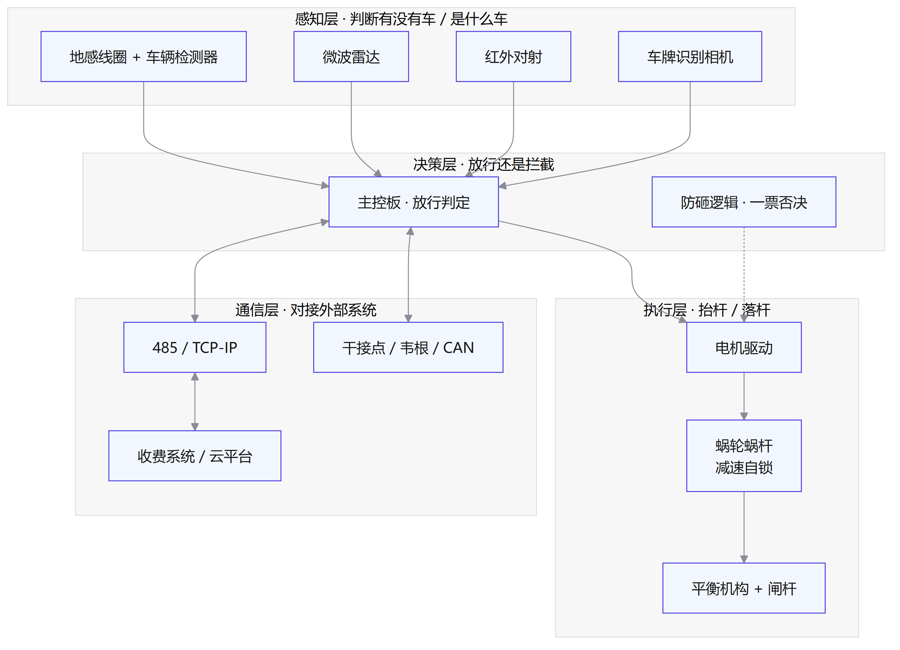

图 2-1 道闸系统四层架构：感知信号汇聚到决策层，决策结果驱动执行层，通信层负责对外对接，防砸逻辑对执行层具有一票否决的干预权。

四层不是简单的上下级关系：感知层与决策层是"数据上送"，决策层与执行层是"指令下发"，而防砸逻辑横跨决策与执行——只要防砸信号存在，落杆指令立即被否决。理解这条否决链路，就理解了道闸安全性的本质。

第 2 章讲的是道闸这台设备"内部"的四层；把镜头拉远，道闸还同时挂在"出入口管控系统"里——停车收费、门禁、视频监控、消防联动、云平台都是它的邻居。这一章从系统视角看道闸：它在一套更大的架构中扮演什么角色、如何与其他系统对话。

## 3. 出入口管控系统架构

### 3.1 从"一台设备"到"一套系统"

单机时代，出入口就是"一根杆 + 一个遥控器"，管住车靠人。系统时代，出入口是"识别 — 计费 — 放行 — 复核 — 运维"一整条链路的执行点，道闸只是链路末端的执行终端。判断一个出入口工程是"装设备"还是"建系统"，看三点：识别结果是否自动驱动放行、通行记录是否汇总到平台、故障是否能远程诊断。

一套完整的出入口管控系统按"端—边—管—云—用"分为五层：

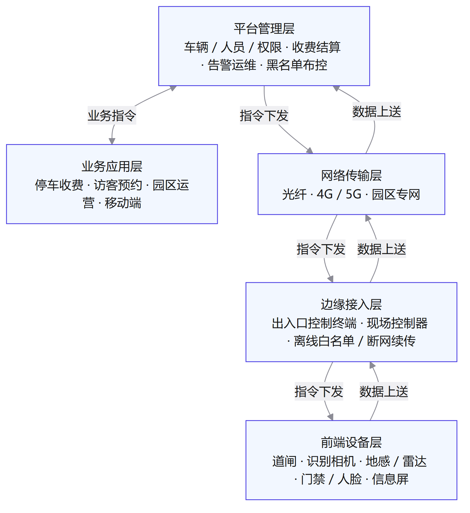

图 3-1 出入口管控系统分层架构：前端设备负责感知与执行，边缘接入层做现场决策，网络传输层承上启下，平台层统一管理，应用层面向用户；数据上送与指令下发构成两条对向链路。

### 3.2 五层架构详解

| 层级 | 职责 | 典型组件 |
| --- | --- | --- |
| 前端设备层 | 感知与执行：看见车、拦住车 | 道闸、识别相机、地感 / 雷达 / 红外、门禁 / 人脸终端、信息屏 |
| 边缘接入层 | 现场决策：本地放行判定、离线兜底 | 出入口控制终端、现场控制器、网络录像机、离线白名单 |
| 网络传输层 | 承上启下：设备上云的数据通道 | 光纤 / 网线、4G / 5G、园区专网 |
| 平台管理层 | 统一中枢：全局管理与结算 | 车辆 / 人员 / 权限管理、收费结算、告警运维、黑名单布控 |
| 业务应用层 | 面向用户与运营 | 停车收费系统、访客预约系统、园区运营、移动端 App / 小程序 |

理解五层架构，关键是抓住两条对向链路：

- **数据上送**：感知结果（车牌、防砸状态、通行记录）自下而上汇聚，最终沉淀为平台数据与运营报表。
- **指令下发**：放行决策自上而下传递：应用层发起业务指令（如缴费成功），平台层转化为控制指令，经网络到达边缘层，最终驱动道闸抬杆。

两条链路在边缘接入层交汇——这是系统设计的分水岭：边缘层"自治能力"越强，系统对上云、对网络的依赖越低，越能扛住断网等极端场景。

### 3.3 系统设计核心机制

**边缘自治与断网续传**。出入口最怕的是"网断了，车也进不了"。成熟系统把白名单、收费规则下发到边缘层离线执行：断网时本地照常比对放行、本地录像暂存，网络恢复后通行记录自动续传。衡量一个出入口系统的健壮性，先看它的断网表现。

**接入标准化**。系统对接的各类设备来自不同厂商，靠标准化协议统一：视频设备走 ONVIF / GB28181，门禁道闸走 485 / 韦根 / CAN，设备状态上报走 MQTT / HTTP。协议不统一，后期每加一台设备都是一次定制开发。

**安全机制分两层**。物理安全：防冲撞闸杆、防尾随门禁、机箱防拆报警；信息安全：控制指令加密、平台账号权限分级、通行数据防篡改与合规留存。出入口涉及车辆与人员数据，信息安全的权重正在快速上升。

### 3.4 联动关系与优先级

道闸的价值一半在单机性能，一半在联动能力：

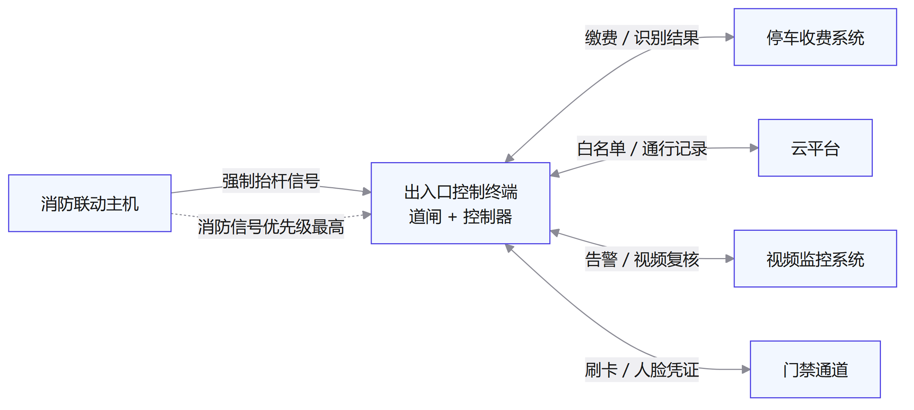

图 3-2 出入口管控系统联动拓扑：出入口控制终端与收费、消防、云平台、监控、门禁五类系统对接；消防信号以最高优先级单向驱动强制抬杆。

| 联动对象 | 联动内容 | 方向 |
| --- | --- | --- |
| 停车收费系统 | 缴费成功 → 放行；入场记录 → 计费依据 | 双向 |
| 消防联动主机 | 消防信号 → 强制抬杆，保障生命通道 | 消防 → 道闸（单向、最高优先级） |
| 云平台 | 白名单下发、通行记录上报、远程开闸 | 双向 |
| 视频监控系统 | 告警联动抓拍复核、过车视频关联 | 双向 |
| 门禁通道 | 刷卡 / 人脸凭证 → 联动放行 | 双向 |

联动优先级必须显式设计：**消防信号 > 应急手动 > 平台远程 > 自动识别**。消防信号是安全底线，任何状态下必须最高优先执行；自动识别结果优先级最低，随时可被人为指令覆盖。优先级不明确的系统，在真正出状况时必然乱套。

### 3.5 系统落地设计要点

- **供电与冗余**：道闸、控制器、网络设备统一 UPS 供电，关键车道双回路；断电时保持通行能力与数据不丢。
- **车道拓扑**：按流量设计一进一出 / 多进多出 / 潮汐车道；对向车道物理隔离，避免误识别与对冲。
- **协议与选型一致**：同项目设备尽量收敛到同协议族（如统一 GB28181 视频 + 485 门禁），降低联调成本。
- **端到端联调**：验收不止验单机，要验"识别 → 计费 → 放行 → 记录上云 → 报表生成"全链路；断网演练与消防联动测试必须列入验收项。

## 4. 技术原理

把一台道闸拆开看，它是"一条看得见的机械臂"（执行层）加上"一套看不见的决策大脑"（决策层），外围再配"眼睛"（感知层）和"嘴"（通信层）。判断一台道闸靠不靠谱，要看四层各自的工作机制，以及它们之间怎么配合。

### 4.1 感知层：如何"看见"车辆

感知层回答两个问题：车在哪里（检测），车是谁（识别）。

#### 4.1.1 地感线圈：埋在地下的"金属探测器"

地感线圈的原理并不玄。环形线圈埋在路面下，与检测器内部的电容一起构成 LC 振荡回路。车辆是金属导体，开进线圈磁场时会产生涡流，涡流反过来削弱线圈的等效电感 L。谐振频率 f = 1/(2π√LC)，L 变小频率就升高——检测器捕捉到这个频率跳变，判定"有车"。

理解这个机制，就能解释地感的几个"脾气"：

- 它只能"看见"金属车体：行人、自行车不改变电感，压过线圈也检测不到，这正是它防不住行人钻杆的原因。
- 灵敏度靠工程参数调：埋深越浅、匝数越多、频率档位越高越灵敏，但误报也随之增加。埋深 40–50 毫米、4–6 匝是常见起点。
- 出入口前后各埋一个线圈（双线圈），靠两个线圈触发的先后顺序，可以判断行车方向、估算车速，这是车型分类与抓拍触发的基础。

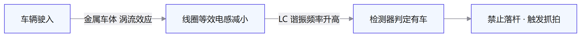

图 4-1 地感线圈检测原理：金属车体改变线圈电感，LC 谐振频率随之跳变，检测器据此判定有车。

#### 4.1.2 微波雷达：会"听声辨位"的守卫

雷达的原理和蝙蝠的回声定位同源：发射电磁波，遇到运动目标反射回来，回波频率会发生偏移，偏移量 Δf = 2v/λ 正比于目标速度 v。这叫多普勒效应——救护车驶近时警笛声变尖、驶离时变沉，是同一个物理现象。

更进一步的 FMCW（调频连续波）雷达发射频率线性变化的信号，回波与发射波混频后得到一个差频，差频大小直接对应目标距离。所以现代雷达不仅能判断"杆下有东西在动"，还能说出"东西在哪个位置、离得多远"，这为落杆前的"净空确认"提供了依据。

雷达的局限在于：静止不动的目标测不出速度，需要配合算法判断；金属雨棚、铁质围栏等强反射体会形成固定杂波，工程上通过设置检测防区把杂波排除在判定区之外。

#### 4.1.3 车牌识别：从"拍到字"到"认出字"

车牌识别主流方案是两阶段深度学习：第一步是车牌检测，用目标检测网络（YOLO 一类）在画面里定位车牌矩形框；第二步是字符识别，用序列识别网络把车牌区域"读"成一串字符，再经 CTC 解码输出车牌号。相比传统的"边缘 + 颜色定位 → 字符分割 → 逐字符 OCR"，深度学习方法对倾斜、污损、光照变化的容忍度高得多。

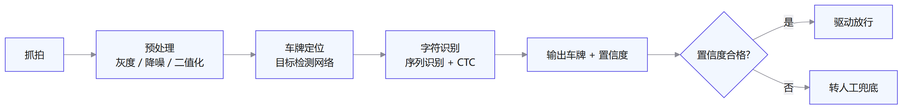

图 4-2 车牌识别流程：检测与识别两阶段处理，识别结果带置信度，低置信度转人工兜底。

真正决定识别率上限的，往往不在算法而在触发方式：**视频触发**靠相机持续分析画面中出现的车尾 / 车头，无需埋线，但触发时机不稳定，抓拍瞬间车牌可能还在画面边缘或处于倾斜状态；**线圈触发**由地感给出同步信号，抓拍瞬间车辆已停在最佳识别位置，识别更稳。工程上还有三个高频翻车点：逆光与夜间补光不足、相机俯角过大导致字符变形、车牌污损或车膜反光。验收应在实际光照条件下进行，而不是在展厅里测。

#### 4.1.4 其他检测手段

红外对射、视频检测、地磁按"检测对象 + 环境"匹配即可：

| 技术 | 原理 | 特点 | 典型应用 |
| --- | --- | --- | --- |
| 红外对射 | 光束遮挡检测 | 成本低；大雨、灰尘、鸟群易误报 | 防砸、限高辅助 |
| 视频检测 | 图像识别车辆轮廓 | 无需埋线；光照变化影响稳定性 | 无线圈场景、一体化识别道闸 |
| 地磁 | 检测地球磁场扰动 | 免布线；地下金属干扰敏感 | 存量车道改造 |

### 4.2 决策层：控制逻辑

决策层的核心是主控板里跑着的状态机。道闸不是"想开就开、想关就关"，而是严格按状态流转：

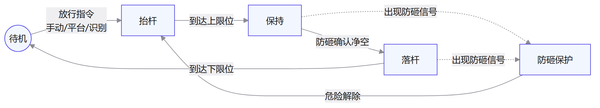

图 4-3 控制状态机：待机 → 抬杆 → 保持 → 落杆四态流转；任何状态出现防砸信号即切入防砸保护态，危险解除后重新抬杆。

这套状态机有两个值得注意的设计：

- **放行优先级**：遥控 / 按钮手动放行 > 平台远程指令 > 识别结果（白名单或缴费成功）。现场人员的直接操作永远优先于自动判定，避免"识别出错车不抬杆"的僵局。
- **防砸一票否决**：防砸信号不参与优先级排队，而是状态机的最高中断——只要防砸信号存在，落杆指令立即被否决，转入防砸保护态。这像电梯门的防夹逻辑：关门途中遇到阻力马上反向开门，而不是"再等等"。

工程细节同样决定可靠性：机械开关和传感器信号都带毛刺，主控板要做**信号去抖**（几十到几百毫秒的去抖窗口），否则一次震动就可能误触发一次开闸；**限位开关**（磁感应或光电式）负责告诉状态机"抬到位了 / 落到位了"，它的可靠性直接决定状态机是否乱跳。多数"道闸抽风"类故障，都出在这些边界条件上。

### 4.3 执行层：如何"抬得起、落得稳"

执行层是道闸的"机械底子"，四个部件决定它的寿命与手感。

#### 4.3.1 电机：动力源怎么选

| 类型 | 启停特性 | 力矩控制 | 维护 | 典型定位 |
| --- | --- | --- | --- | --- |
| 交流异步电机 | 冲击大，靠限位开关硬停 | 不可控 | 需定期保养 | 传统机型、低价市场 |
| 直流无刷电机 | 缓起缓停、可调速 | 力矩可调 | 免维护 | 主流快慢速道闸 |
| 伺服电机 | 位置 / 速度全程闭环 | 精确可控 | 免维护 | 高端高速道闸 |

交流异步电机直接工频供电，启停像"一脚油门踩到底"，全靠限位开关硬停，冲击大、寿命短。**直流无刷电机**是当前主流：转子位置靠霍尔传感器感知，电子换相代替了电刷；速度靠 PWM（脉宽调制）控制，缓起缓停就是 PWM 占空比像斜坡一样渐变，类似电动窗帘的软起停。更重要的是它自带**堵转检测**：落杆过程中电机电流突增，说明杆子撞上了东西，主控板据此触发"遇阻反弹"——这是防砸体系里最后一道机械级保险的物理基础。

#### 4.3.2 蜗轮蜗杆：为什么断电也"锁得住"

蜗轮蜗杆减速机构是道闸最核心的传动结构，承担两件事：增扭和自锁。

**增扭**靠传动比：蜗杆是主动件，头数 Z1 通常只有 1–4；蜗轮是从动件，齿数 Z2 动辄几十。传动比 i = Z2/Z1 可达 30–60 倍——电机的小扭矩被放大成足以撬动几米长闸杆的大扭矩。代价是速度成比例变慢，但闸杆本来就不需要多快。

**自锁**是蜗轮蜗杆最妙的地方。蜗杆的螺旋升角 λ 设计得很小（一般 3–6°），当外力试图从蜗轮一侧反向驱动蜗杆时，作用力沿螺旋面的切向分量小于摩擦力，蜗轮"推不动"蜗杆，反向传动被锁死。闸杆端的任何外力（重力、人为推杆、风力）都无法把转动回传到电机，电机一停，闸杆就被机械锁定在当前位置。这正是断电时闸杆不坠落的原因：自锁负责"锁住"，平衡机构负责"托住"，二者缺一不可。

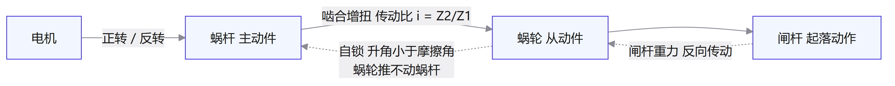

图 4-4 蜗轮蜗杆传动与自锁：电机驱动蜗杆带动蜗轮增扭；反向传动路径被自锁封死，闸杆外力无法回传电机。

自锁不是免费的：自锁蜗轮副的传动效率通常不到 50%，能量损耗转化为热，所以道闸机箱需要散热设计、蜗轮副需要定期润滑。这也是高速道闸与便宜道闸在结构上拉开差距的地方——为了降本，有的产品用尼龙蜗轮、减小蜗杆升角，换来的是发热、磨损和寿命缩短。

#### 4.3.3 平衡机构与闸杆：像跷跷板一样"处处平衡"

闸杆绕转轴转动，重力产生的力矩随角度变化：水平时最大，竖直时为零。如果全靠电机硬扛这个力矩，电机将长期满负荷工作，寿命大打折扣。平衡机构的作用就是让弹簧力矩去抵消闸杆重力矩，像跷跷板两端配平，让闸杆在任意角度都"近乎失重"。

三种方案各有取舍：弹簧平衡结构简单、成本低，但长期疲劳后弹力衰减，需定期调整预紧力；气弹簧（气压杆）力矩曲线接近恒定、寿命长；配重平衡最稳定但体积大、惯性大，不适合高速起落。平衡调校质量直接体现在电机负载与闸杆是否"发飘"上——验收时听电机声音、看闸杆有无抖动即可判断。

闸杆类型按场景匹配：直杆最常用、长度可达 6 米；曲臂杆（折臂）用于净空受限的地下车库；栅栏杆杆体密度高，用于人车混行、防行人电动车穿行；广告杆（灯箱杆）兼顾商业展示，但杆体重，对平衡与电机要求更高。

### 4.4 通信层：如何与系统对话

通信层决定道闸是"孤立的电机"还是"系统里的一个终端"。各接口的工作机制：

| 接口 | 工作机制 | 特点 | 适用 |
| --- | --- | --- | --- |
| 485 / 232 串口 | 485 用 A/B 两线差分电压表示 0/1，抗共模干扰 | 半双工、总线可挂多台、最长约 1200 米 | 对接收费系统、控制台 |
| TCP-IP | 局域网长连接，心跳保活 | 上云、远程管理 | 一体化识别道闸、云平台 |
| 干接点 | 继电器无源触点，通断电平联动 | 电气隔离、响应快 | 与消防、门禁硬联动 |
| 韦根 | 26 / 34 位格式，读卡器标准接口 | 短距传输 | 刷卡 + 道闸组合 |
| CAN | 差分信号 + 多主仲裁 | 抗干扰强、实时性好 | 多道闸组网、工业场景 |

485 接口值得多说一句：它是"半双工对讲机"——同一时刻只能一方说话，两线电压差的正负表示 0 和 1，天然抗共模干扰，适合工业现场的长线传输；但总线两端必须各接一个 120 欧终端电阻，否则长线反射会让信号错乱，这是现场"时通时断"类故障的头号原因。

集成商常见的误区是把道闸只当"一个继电器控制的电机"。实际对接中，识别结果、收费结果、防砸状态、故障上报都要走通信层；只接干接点虽然"能抬杆"，却会丢掉全部状态信息，后期运维寸步难行。

### 4.5 核心难点：防砸技术的演进

防砸是道闸的"命门"——落杆砸到车或人，即构成安全事件。防砸技术历经四代演进，每一代都在补前一代的盲区：

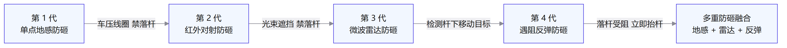

图 4-5 道闸防砸技术演进：从单点地感起步，逐步叠加红外、雷达与遇阻反弹，最终收敛为多重防砸融合。

| 防砸手段 | 响应机制 | 盲区 / 局限 |
| --- | --- | --- |
| 地感线圈 | 电感变化，车压线圈禁落杆 | 只能测金属车体，仅覆盖线圈区域，行人无法感知 |
| 红外对射 | 光束遮挡禁落杆 | 大雨、灰尘、鸟群易误报 |
| 微波雷达 | 检测杆下移动目标 | 静止目标需算法配合，强反射物需设防区 |
| 遇阻反弹 | 电机电流突增 / 编码器检测受阻，立即抬杆 | 已有物理接触，靠抬杆补救 |

理解每一代的盲区，才能理解为什么当代方案一定是"融合"而不是"单挑"：

- **地感**保障"落杆时机"——车没走完，杆不落。但它只认金属，而且只在线圈正上方有效。
- **雷达**补"全程覆盖"——从抬杆到落杆，杆下区域始终有人盯着，行人、非机动车也纳入检测。但它对静止物体不敏感。
- **遇阻反弹**是"机械级兜底"——前两道都失效，杆子已经碰到东西，靠电机电流突增或编码器反向信号立即抬杆，避免硬砸造成伤害。

当代主流方案把三种机制串成一条时序链：落杆前，雷达确认杆下净空；落杆中，地感与雷达实时监控；万一还是碰上，遇阻反弹立即抬杆补救。三者响应机制不同、盲区互补，这正是"贵的道闸为什么不砸车"的技术答案。

## 5. 产品功能与用途

道闸的功能不止"抬杆落杆"，而是围绕通行控制、安全防护、联动集成、运维管理四类能力展开，每一类都对应明确的现场用途。

### 5.1 通行控制功能

- 自动 / 手动抬杆：识别结果、刷卡、遥控、按钮、平台指令均可触发放行，手动指令优先级最高（见 4.2）。
- 快慢速可调：快档约 1.5–2 秒用于高流量出入口，慢档 3–6 秒用于普通车道，同一台设备可切换。
- 白名单 / 缴费放行：月卡车辆秒过，临停车辆缴费后放行，无牌车走人工兜底。
- 用途：把放行决策从"人按遥控"变为"系统判定"，压缩单车道通行时间。

### 5.2 安全防护功能

- 多重防砸：地感 + 雷达 + 遇阻反弹协同，任一环节失效仍有兜底（见 4.5）。
- 防撞脱杆：车辆撞击时闸杆自动脱开，保护电机与减速机构，降低维修成本。
- 断电保护：蜗轮蜗杆自锁防止闸杆坠落，手摇开闸与后备电池保障断电放行（见 8 章）。
- 用途：把安全底线内置到机械与逻辑层，砸车、撞杆事故可防可控。

### 5.3 联动集成功能

- 识别 / 收费联动：识别结果直接驱动放行决策，收费完成自动抬杆。
- 消防 / 门禁联动：消防信号强制抬杆保障生命通道，门禁信号控制专用通道。
- 云平台联动：远程开闸、远程查看状态与日志。
- 用途：道闸从独立设备升级为通行管理系统的一个执行终端（见 4.4）。

### 5.4 运维管理功能

- 故障自诊断上报：电机过载、限位异常、防砸故障自动上报。
- 通行计数与日志：按车牌、时段统计车流，导出通行记录。
- 用途：从"坏了才知道"变为预知性维护，降低现场运维人力。

功能与用途对照：

| 功能 | 用途 | 对应章节 |
| --- | --- | --- |
| 自动 / 手动抬杆 | 放行决策系统化，压缩通行时间 | 4.2 |
| 快慢速可调 | 匹配不同车流强度 | 4.3 |
| 多重防砸 | 杜绝落杆砸车砸人 | 4.5 |
| 防撞脱杆 | 保护设备本体，降低维修成本 | 4.3 |
| 断电保护 | 断电不断通行能力 | 4.3 / 8 |
| 识别 / 收费 / 消防联动 | 融入通行管理系统 | 4.4 |
| 远程运维 | 预知性维护，降人力 | 4.4 |

## 6. 应用场景

道闸的用途边界由"需要管住车辆通行的地方"定义。按需求特征归为九类场景，配置重心各不相同：

| 场景 | 需求特征 | 典型配置 | 关键价值 |
| --- | --- | --- | --- |
| 商业停车场 | 高峰大流量、快进快出 | 高速道闸 + 车牌识别 + 雷达防砸 | 通行效率 |
| 住宅小区 | 人车混行、物业统一管理 | 栅栏道闸 + 人形检测 + 门禁分流 | 安全与管理 |
| 园区 / 写字楼 | 访客与月卡并存 | 识别道闸 + 访客系统联动 | 通行秩序 |
| 物流园 / 港口 | 重载、高频、环境恶劣 | 加强闸杆 + 双车道 + 重载地感 | 可靠性 |
| 高速 / 收费站 | 连续快速通行 | 高速道闸 + 线圈触发 + 防砸兜底 | 吞吐量 |
| 医院 / 学校 | 应急通道、高峰集中 | 应急联动 + 快慢速切换 | 应急响应 |
| 景区 / 文体场馆 | 大客流短时聚集 | 多车道 + 预收费联动 | 疏流能力 |
| 工地 / 厂区 | 内部车辆 + 环境恶劣 | 简易道闸 + 遥控 / 刷卡 | 低成本管控 |
| 机场 / 火车站 | 严格管控 + 应急疏散 | 双回路供电 + 消防联动 | 高可靠 |

其中商业停车场、老旧小区、物流园区三类场景在第 7 章给出完整的设计动线；其余场景按 7.1 的选型链路套用即可，差异只在参数与传感组合。

## 7. 方案设计与落地案例

### 7.1 选型设计方法论

正确的选型顺序不是"先选道闸"，而是"先定场景"：车流量决定速度档位与闸杆数量 → 车道类型决定杆型与杆长 → 防砸需求决定传感组合 → 联动系统决定接口（识别 / 收费 / 消防）→ 供电与通信决定线缆与部署。跳步选型的结果，往往是把设备装上了，再回头补传感器、改线缆。

### 7.2 案例一：商业综合体停车场——快进快出

痛点：高峰期 8 个车道全开仍排队十余分钟，人工收费是瓶颈，闸杆起落速度拖慢整体节拍。

方案：车牌识别 + 高速道闸（约 1.5 秒起落）+ 雷达防砸；入口视频触发免取卡，出口缴费后识别放行；月卡用户白名单秒过；无牌车与污损车牌走人工兜底通道，不阻塞主线。

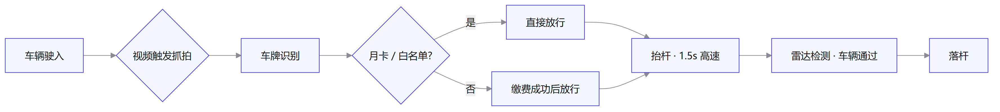

图 7-1 案例一通行流程：识别与缴费并行处理，抬杆与放行衔接，雷达确认后落杆。

价值量化：单车道通行时间从 12 秒压到 4 秒以内；识别率在夜间补光条件下达到 99% 以上；高峰期排队长度缩短到原来的三分之一以内。

### 7.3 案例二：老旧小区 + 电动自行车管理

痛点：出入口人车混行，行人、电动车常从闸杆下穿行，机动车道被堵；机动车误撞电动车风险高，物业管理两头难。

方案：机动车道安装栅栏道闸，配合人形检测联动——检测到杆下有人或车即保持抬杆等待，净空后才落杆；闸杆侧边设电动车专用通道，加装人脸 / 刷卡门禁分流。

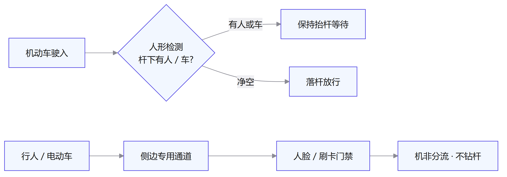

图 7-2 案例二通行流程：机动车通道以人形检测联动控制落杆时机，行人电动车走独立通道，实现机非分流。

价值：机动车通行不再被穿行者打断；电动车不再钻杆，碰撞风险显著下降；管理上从"人车混行"变为"机非分流"。

### 7.4 案例三：物流园区重载高流量

痛点：货车每日进出数百台次，闸杆频繁起落易疲劳断裂；重车压坏地感线圈；雨雪、扬尘环境对设备侵蚀严重。

方案：加强型直杆 + 双车道一进一出配置互不干扰 + 重载地感（加强线圈配宽频检测器）；雷达防砸应对货车长车身；控制箱加装温控与防尘处理。

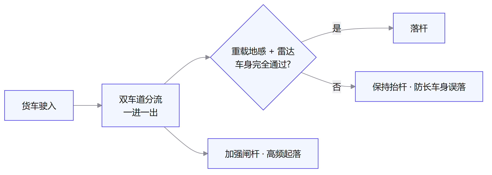

图 7-3 案例三通行流程：双车道分流降低单杆负荷，地感 + 雷达共同确认货车车身完全通过后才落杆。

价值：闸杆疲劳断裂率下降，故障处理频率降低；货车长车身也能完整检测，不再出现误落杆砸尾厢。

### 7.5 施工与交付要点

- **地感线圈**：切割深度 40–50 毫米、4–6 匝、引线双绞；远离强电电缆，避免感应串扰；路面沉降部位先加固再埋线。
- **基础浇筑**：道闸机箱基础混凝土养护到位再装杆，否则闸杆晃动、限位漂移。
- **接地防雷**：控制箱、机箱、信号线屏蔽层统一接地；室外设备加装防雷器。
- **强弱电分离**：电源线与信号线分管敷设，间距不小于 300 毫米，避免干扰。
- **调试清单**：起落时间、限位位置、防砸联动、遥控 / 按钮 / 平台三路控制、断电报警、后备电池切换。

## 8. 零配件速查

| 配件 | 功能 | 选型要点 | 典型场景 |
| --- | --- | --- | --- |
| 电机 | 提供起落动力 | 交流 / 直流无刷；力矩与寿命 | 全机型核心 |
| 蜗轮蜗杆减速机 | 增扭 + 自锁 | 传动比、蜗轮材质（铜 / 尼龙） | 标准道闸 |
| 闸杆 | 物理拦截 | 长度、材质（铝合金 / 加强型）、杆型 | 按车道选择 |
| 地感线圈 | 车辆检测 | 匝数、埋深、与检测器匹配 | 落杆计数 |
| 车辆检测器 | 线圈信号处理 | 灵敏度、频率可调 | 防砸联动 |
| 限位开关 | 起落到位检测 | 磁感应 / 机械式；可靠性优先 | 行程控制 |
| 遥控器 | 手动控制 | 编码方式、防复制 | 现场 / 物业开闸 |
| 主控板 | 逻辑控制 | 接口数量、防砸输入、协议支持 | 全机型 |

断电应急配置对照表：

| 场景 | 方案 | 说明 |
| --- | --- | --- |
| 断电需要放行 | 手摇开闸 | 机械手动抬杆，最可靠 |
| 断电自动放行 | 后备电池 / 自动抬杆 | 依赖电源，需定期维护电池 |
| 断电锁杆 | 保持现状 | 蜗轮蜗杆自锁，防止闸杆坠落 |

## 9. 验收与运维

交付验收清单：

- 功能项：起落时间达标（快慢速档位）、限位准确、防砸三路联动全部触发、遥控 / 按钮 / 平台三路控制生效、断电报警正常、后备电池切换正常。
- 安全项：漏电保护器动作、接地电阻合格、防雷器安装、防砸响应时间达标、急停与手动放行可用。

常见故障排查表：

| 故障现象 | 排查方向 |
| --- | --- |
| 抬杆无力 / 抖动 | 平衡机构弹力衰减、电压不足、电机故障 |
| 落杆不落 / 乱落 | 限位开关漂移、防砸信号误触发（查线圈与雷达干扰） |
| 防砸失灵 | 检测器灵敏度、线圈损坏、雷达盲区 |
| 识别失败率高 | 触发方式、补光、相机角度、车牌污损 |
| 通信中断 | 线缆压接、485 终端电阻、IP 地址冲突 |

## 10. 技术演进趋势

四个方向值得关注：**直流无刷化**普及，免维护且起落更平稳；**雷达防砸**取代红外成为标配，误报率更低；**识别与道闸一体化**减少现场对接，开箱即用；**云端远程运维**实现故障自诊断与远程开闸。指向同一个目标：道闸从"会抬杆的电机"演进为"免维护、快通行"的通行终端。
