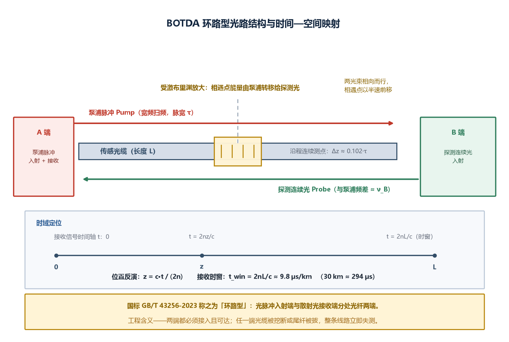
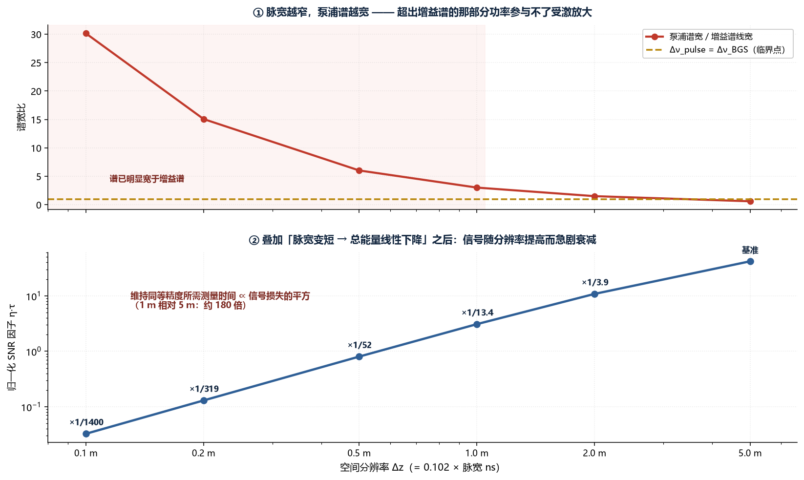
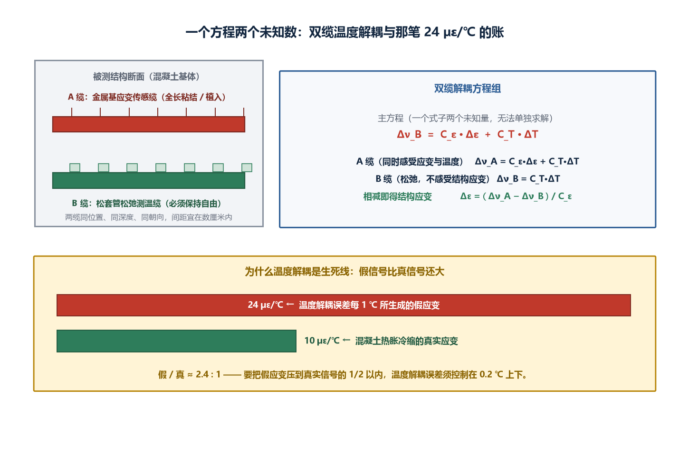
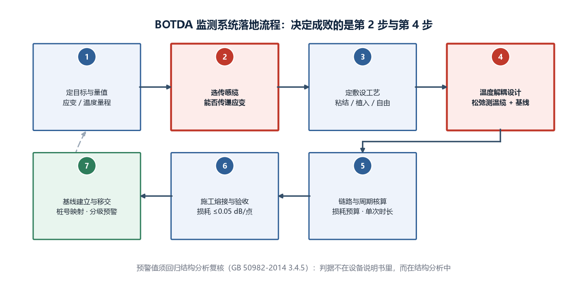

# 分布式光纤应变传感（BOTDA）产品综述：把一根光缆变成上万个测点的传感神经

> **面向读者**：长输管道、桥梁、隧道、综合管廊、堤防边坡等基础设施的监测系统集成商、业主方技术口、测绘与检测单位，以及要做选型与施工验收的工程岗。
> **数据口径**：标注「工程基准」的数值来自公开标准条款（GB/T 43256-2023、T/CECS 940-2021 等）、ITU-T 光纤规范或材料手册；标注「工程估算」的为可复算的推算示例，只用于说明数量级与权衡方向，**不构成任何厂商的承诺指标**。文中物理常数均取 1550 nm 普通单模石英光纤（G.652）室温条件下的典型值。

*封面为概念示意图，非真实设备照片。*

---

## 〇、一句话定位

**分布式光纤应变传感（BOTDA）是把一根几十公里长的光缆，变成一条沿程连续、以米为单位采样、每一米都是一个「应变 + 温度」测点的传感神经——它不需要任何一个离散的传感探头，光缆本身就是传感器。**

这句话里藏着这门技术最反直觉的一点：**你买的不是一台仪器，而是一整套「长度 × 空间分辨率」的测量容量。** 一台解调仪接 30 km 光缆、按 1 m 空间分辨率，就是 3 万个连续测点；同样的预算，接 3 km 光缆可以换到 0.1 m 分辨率。所以选型时真正要分配的稀缺资源不是「精度」这两个字，而是**总测点数、单次测量时长、以及两者之间的兑换率**。

**先把六个数字摆在这里，后面每一笔账都会回到它们：**

1. **$\nu_{B0}\approx 10.8\sim 11.2\ \mathrm{GHz}$**——1550 nm 普通单模石英光纤在室温松弛态下的布里渊频移基准值。整篇测量的本质，就是在这个十一吉赫量级的绝对位置上，分辨出兆赫级的漂移。
2. **$C_\varepsilon\approx 0.05\ \mathrm{MHz/\mu\varepsilon}$**——应变系数：应变每变化 $100\ \mu\varepsilon$，布里渊频移变化约 5 MHz（不同文献给出 4.5~5 MHz，取 0.05 MHz/µε 便于手算）。
3. **$C_T\approx 1.2\ \mathrm{MHz}/^\circ\mathrm{C}$**——温度系数：温度每升高 1 ℃，布里渊频移增加约 1.2 MHz（部分文献给 1.0~1.1 MHz/℃）。
4. **$1\ \mathrm{MHz} / 10.8\ \mathrm{GHz}\approx 9.3\times10^{-5}$**——想拿到 $\pm 20\ \mu\varepsilon$ 的应变精度，就要在 10.8 GHz 上分辨出 1 MHz，也就是**万分之一的相对精度**。
5. **$24\ \mu\varepsilon/^\circ\mathrm{C}$**——温度补偿做不好时，每 1 ℃ 的解耦误差会伪装成 24 µε 的假应变。而**混凝土自身热胀冷缩只有约 10 µε/℃**。这是本篇最重要的一条工程结论，见 3.4 节。
6. **$\tau[\mathrm{ns}]\approx 9.8\cdot \Delta z[\mathrm{m}]$**——泵浦脉宽与空间分辨率的换算：**1 m 空间分辨率约等于 10 ns 脉宽**。所有「分辨率与精度不可兼得」的矛盾，都从这条线开始。

> **为什么把第 5 条抬到和第 1 条并列的位置？** 因为在真实项目里，导致「BOTDA 数据看不懂、业主不信」的原因里，**温度解耦做错远多于设备精度不够**。一次错误的温度补偿，产生的是比被测信号本身还大的假应变——而它不会报错，只会安静地生成一张看起来很像回事的曲线图。

---

## 一、产品设计方案

### 1.1 架构：国标把世界分成「单端型」和「环路型」

GB/T 43256-2023《分布式光纤应变测试系统参数测试方法》给了一套非常干净的术语，工程上应该直接照着用：

| 国标术语 | 定义（依据 GB/T 43256-2023） | 对应技术 | 工程含义 |
|---|---|---|---|
| **单端型** | 光脉冲的入射端与散射光的接收端位于光纤**同一端** | BOTDR（自发布里渊散射） | 只需一端接入，**光缆中间断也能测到断点之前** |
| **环路型** | 光脉冲的入射端与散射光的接收端位于光纤**不同端** | BOTDA（受激布里渊散射） | 两端都必须可达，任一端断开则全线失效 |

这个区分比「自发散射 vs 受激散射」的说法实用得多——它直接决定了**施工方案**：选 BOTDA，就意味着你要在被测结构的两端都留出熔接与维护通道，并且最好把传感光缆做成物理冗余的环，或者至少在同一沟槽里多放一芯备缆。

*图 1：BOTDA 采用双端结构（国标定义的「环路型」），泵浦脉冲与探测连续光分别从光纤两端入射，在光纤内部相向而行；两国光的频差落在某处布里渊增益谱内时，该处即发生受激布里渊放大。*

**第一段：光源与频率受控。** 系统需要两路光——一路连续光（探测光 probe），一路脉冲光（泵浦 pump），两者的频率差必须能被锁定并在 $\nu_{B0}$ 附近按亚兆赫步进而精确扫描。光源的频率稳定性与扫描线性度直接决定了应变精度的天花板：如果激光器自己在一分钟内漂了 1 MHz，那么 $C_\varepsilon$ 标定得再准也没意义。

**第二段：双向光路与偏振管理。** 受激布里渊散射是偏振相关的——泵浦与探测偏振态正交时，增益几乎归零。而沿光纤随机变化的双折射会让偏振态随位置漂移。因此实际系统必须做偏振分集接收或偏振扰码（scrambling），否则沿程会出现位置随机、时有时无的「增益盲点」，表现为图上莫名其妙的噪声尖峰。这是工程现场最容易被误判为「光缆敷设质量差」的一类现象。

**第三段：受激放大与拍频接收。** 当泵浦与探测的频差落在某点的布里渊增益谱内，泵浦通过电致伸缩激发声波，声波进而把泵浦能量散射转移到探测光上，这就是受激布里渊放大。携带这一增益信息的探测光从接收端出射，经光电转换变为电信号。

**第四段：时间定位与时域采样。** 泵浦脉冲走完全程所需的时间决定了接收时窗：

$$t_\mathrm{win} = \frac{2nL}{c}$$

取群折射率 $n=1.468$、光速 $c=3.0\times10^{8}\ \mathrm{m/s}$，得到 **$t_\mathrm{win}\approx 9.8\ \mu\mathrm{s/km}$**。30 km 光缆的单次采集时窗约 **294 µs**，50 km 约 **489 µs**。

> **那个系数 2 是怎么来的？** 泵浦向右走、探测向左走，二者的「相遇点」以两者相对速度的一半向前移动，所以接收 Probe 的时间轴要乘 $2nL/c$ 而不是 $nL/c$。这与 OTDR 里的往返系数是同一个 2，起因不同但数值一致——记住了它，后面算分辨率就不会错。

**第五段：逐频合成布里渊谱。** 固定一个频差只得到一条「位置—增益」曲线。要拿到频移，必须在一段频率范围内逐点扫描（典型 100~300 步），把上百条曲线堆成一个「位置 × 频差」的二维矩阵，再对每一列做洛伦兹拟合，峰的位置就是 $\nu_B$。

**第六段：物理量反演与解耦。** 拿到 $\nu_B(z)$ 后用主方程反演：

$$\Delta\nu_B = C_\varepsilon\,\Delta\varepsilon + C_T\,\Delta T$$

**注意这一步只有一个方程、两个未知数。** 怎么处理，是整套工程方案的分水岭，见 3.4 节。

**第七段：标定、可视化与分级预警。** 把米级的连续采样点归并到一个个「监测断面」上，按 GB 50982-2014 的思路结合结构分析结果设定不同级别的预警值，最终输出带时间戳的空间分布曲线、断面报表与超限工单。

### 1.2 形态谱系：三个正交维度

**维度一：散射机理与光路拓扑**

| 路线 | 散射类型 | 光路（国标术语） | 空间分辨率 | 应变精度典型 | 测量距离 | 单端可达 |
|---|---|---|---|---|---|---|
| BOTDR | 自发 Brillouin | 单端型 | 1~5 m | ±20~±50 µε | 30~50 km 级 | 可 |
| **BOTDA** | **受激 Brillouin** | **环路型** | **0.1~2 m** | **±2~±20 µε** | **30~80 km 级** | **不可** |
| OFDR | 瑞利相关 | 单端型 | 1~10 mm | ±1 µε 级 | 数十米~百米级 | 可 |
| FBG（准分布式） | 光栅反射 | 单端/级联 | 离散点 | ±1~±5 µε | 单通道 20~40 km | 可 |

> 关键认知：**OFDR 的毫米级分辨率看着诱人，但它的量程通常只有几十米到百米。** 它和 BOTDA 不是替代关系，而是「构件/实验室」对「线路/现场」的分工。写方案时把 OFDR 的指标拿去撑一个 5 km 隧道的方案，是最常见也最致命的错误。

**维度二：传感光缆——比解调仪更重要的那个变量**

| 缆型 | 结构特征 | 能否传应变 | 适用 |
|---|---|---|---|
| 普通松套管通信光缆 | 光纤在松套管内有 0.1%~0.3% 余长 | **几乎不能** | 只能测温，不能测应变 |
| 紧套应变传感缆 | 光纤紧包被覆，无余长 | 良 | 表面粘贴、夹持式 |
| 金属基索式应变缆 | 光纤封装于钢丝/钢绞线内 | 优 | 混凝土浇筑植入、焊接到钢结构 |
| 定点/定长封装缆 | 分段锚固，段间自由 | 段平均 | 大变形、滑坡、沉降 |
| 复合传感光缆 | 同缆多芯：应变芯+温度芯+通信芯 | 优 | 长线路标准做法 |

> **踩坑提醒**：把一根普通室外通信光缆直接粘在混凝土表面充当「应变传感器」，是行业里反复发生的低级错误。松套管里那点余长意味着——结构要先把这段松弛量拉直，力才传得到光纤上。短期看是「测值偏小」，长期看是「完全没有线性可循」。

**维度三：光开关与通道复用。** 一台解调仪通过 1×N 光开关轮巡多条光缆。轮巡是有代价的：**总测量周期 = 通道数 × 单通道测量时长**。16 个通道、每通道 2 分钟，一圈就是 32 分钟——这个数字必须写进方案，因为它直接决定了预警的时效性。

### 1.3 九道设计关

把一套 BOTDA 监测系统从图纸做到可以交付业主验收，要依次跨过九道关。**每一道关都能独立地废掉整个项目，而它们之间几乎不能互相补偿。**

1. **路线关**：在该场景，BOTDA 是不是正确答案？还是要 OFDR、FBG 或干脆用全站仪/GNSS。
2. **传感缆关**：这根缆能不能把结构的应变传到光纤上？传递函数是否已标定？
3. **敷设关**：粘结、夹持、植入还是自由铺设？正交/~形敷设能否同时覆盖纵横向？
4. **温度解耦关**：是否布设了真正意义上的松弛测温缆？两缆是否同位置同环境？
5. **定位基准关**：光纤里程能否与结构桩号（K12+300 之类）建立可靠的点到点映射？
6. **链路预算关**：端到端光损耗是否在设备动态范围以内，并留有老化余量？
7. **周期关**：测量时间间隔是否满足预警时效性要求？
8. **数据治理关**：每天几亿个字节的数据怎么存、怎么取基线、怎么做温差修正与趋势外推。
9. **运维关**：光缆断了怎么接、接完怎么重新标定，以及设备的长期漂移如何与真实形变区分。

> 现场经验的硬话：**第 2、4、5 关解决掉了八个残次项目里的七个。** 大量「BOTDA 数据没法用」的抱怨，究其根源既不是解调仪不行，也不是算法落后，而是光缆选错了、温度没解耦、位置和桩号对不上。

---

## 二、核心参数与选型

### 2.1 参数速查表

| 参数 | 典型值 / 要求 | 来源与说明 |
|---|---|---|
| 布里渊频移基准值（1550 nm） | $\nu_{B0}\approx 10.8\sim 11.2\ \mathrm{GHz}$ | 工程基准，随光纤型号/掺杂浮动 |
| 应变系数 $C_\varepsilon$ | $\approx 0.05\ \mathrm{MHz/\mu\varepsilon}$ | 工程基准（4.5~5 MHz / 100 µε） |
| 温度系数 $C_T$ | $\approx 1.2\ \mathrm{MHz}/^\circ\mathrm{C}$ | 工程基准（部分文献 1.0~1.1） |
| 布里渊增益谱自然线宽 | 约 25~40 MHz | 工程基准，对应声子寿命约 8~13 ns |
| 空间分辨率 | 0.1~5 m 可选档 | 产品分档；受 2.2 节权衡约束 |
| 采样分辨率 | 常取空间分辨率的 1/10 ~ 1/2 | GB/T 43256-2023 定义为相邻采样点距离 |
| 应变测试精度 | ±2~±50 µε（与分辨率、距离强相关） | 工程估算，见 2.2 节 |
| 应变测试重复性 | 同分辨率下优于精度的短期波动量 | GB/T 43256-2023 有测试方法 |
| 温度测量精度 | ±0.3~±1.0 ℃ | 工程基准，取决于缆型与平均次数 |
| 测量距离（单通道） | 30~80 km | 工程基准 |
| 单次全谱测量时长 | 1~5 分钟（典型） | 工程估算，见 2.3 节 |
| 应变/温度量程 | $\pm$（1 万~3 万）µε；$-40\sim +85\ \mathrm{^\circ C}$ | 工程基准，按缆与设备分档 |
| 工作波长 | 1550 nm 波段为主，部分 1310 nm | 工程基准 |
| 光纤衰减（G.652，1550 nm） | 规范上限 0.25 dB/km，典型 0.19~0.22 | ITU-T G.652，工程基准 |
| 单熔接点损耗 | 合格 ≤ 0.05 dB | 工程基准 |
| 活动连接器损耗 | ≤ 0.3 dB/个 | 工程基准 |
| 标准测试环境温度 | 23 ℃ ± 5 ℃，过程波动 < ±2 ℃ | **GB/T 43256-2023 明示条件** |
| 标准测试湿度/气压 | 20%~70% RH；86~106 kPa | **GB/T 43256-2023 明示条件** |
| 动态范围（国标定义） | **最大可测光纤长度 / 空间分辨率** | **GB/T 43256-2023 定义（无量纲比）** |
| 激光安全 | 须设警示标志，**禁止直视光纤末端** | **GB/T 43256-2023 安全防护要求** |
| 多通道轮巡 | 1×N 光开关，N = 4/8/16 | 工程基准 |

> **关于「动态范围」这个词要特别小心。** GB/T 43256-2023 把它定义为**最大可测光纤长度与空间分辨率的比值**，是一个无量纲的数，不是常见的 dB。看到某家标「动态范围 25 dB」，那是 OTDR 的习惯用法；看到「= 50 000」，那是国标定义。看规格书时先确认说的是哪一种，否则差出十万八千里。

### 2.2 第一笔账：空间分辨率与应变精度是一对孪生指标，不能各自最优

这是 BOTDA 选型里最重要、也最少被写清楚的一笔账。它分三步算。

**第一步：脉宽决定空间分辨率。**

$$\Delta z = \frac{v_g \tau}{2} = \frac{c\,\tau}{2n}$$

代入 $n=1.468$：

$$\Delta z\,[\mathrm{m}] \approx 0.102 \cdot \tau\,[\mathrm{ns}] \qquad\Longleftrightarrow\qquad \tau\,[\mathrm{ns}] \approx 9.8\cdot \Delta z\,[\mathrm{m}]$$

于是：**10 ns 脉宽 ↔ 1.02 m 分辨率**，20 ns ↔ 2.04 m，50 ns ↔ 5.10 m，2 ns ↔ 0.20 m。这条线非常好记，现场估算够用。

**第二步：脉宽反过来决定泵浦光的频谱宽度。**

窄脉冲不只是「短」，它在频域上也变「胖」。矩形脉冲的主瓣 −3 dB 带宽约为 $\Delta\nu_{\mathrm{pulse}}\approx 0.886/\tau$，而布里渊增益谱（BGS）自身的自然线宽只有约 30 MHz（对应 1/π 声子寿命约 10.6 ns）。**当泵浦谱比 BGS 还宽时，超出的那部分功率无法有效参与受激放大——能量被摊到了增益谱听不见的频率上。**

用一个简化的谐波叠加模型估算「参与受激放大的有效比例」$\eta$（**演示模型，仅示方向**）：

$$\eta \approx \frac{1}{\sqrt{1+\left(\Delta\nu_{\mathrm{pulse}}/\Delta\nu_{\mathrm{BGS}}\right)^2}},\qquad \Delta\nu_{\mathrm{BGS}}=30\ \mathrm{MHz}$$

**第三步：把两步相乘，得到真正决定 SNR 的量 $\eta\cdot\tau$。**

| 脉宽 $\tau$ | 空间分辨率 $\Delta z$ | 泵浦谱宽 $\Delta\nu_\mathrm{pulse}$ | 有效比例 $\eta$ | 归一化 SNR 因子 $\eta\tau$ | 相对 50 ns 档的损失 |
|---|---|---|---|---|---|
| 50 ns | 5.1 m | 17.7 MHz | 0.86 | 43.1 | 1.0×（基准） |
| 20 ns | 2.0 m | 44.3 MHz | 0.56 | 11.2 | **−3.9×** |
| 10 ns | 1.0 m | 88.6 MHz | 0.32 | 3.21 | **−13.4×** |
| 5 ns | 0.51 m | 177 MHz | 0.17 | 0.84 | **−52×** |
| 2 ns | 0.20 m | 443 MHz | 0.068 | 0.135 | **−319×** |

**这张表就是所有厂商规格书里那条隐含曲线的来源。** 不同脉冲宽度下信号的衰减趋势如下图所示。

*图 2：脉宽直接决定空间分辨率，又反过来通过频谱展宽决定有效增益占比。三者构成的约束关系，是 BOTDA 选型里所有取舍的物理根因。* 为什么同一个厂的设备会写成「5 m 分辨率时 ±10 µε；1 m 分辨率时 ±30 µε；0.5 m 时 ±80 µε」？不是它在偷换档次，而是物理上一旦把脉宽压到 10 ns 以下，**可用的泵浦能量同时遭受两重削减**：谱遍宽导致有效增益占比下降（$\eta$ 掉），脉宽变短导致总入射能量线性下降（$\tau$ 掉）。这是双杀，不是单杀。

**推论（可以直接写进方案的话）**：把分辨率从 5 m 提到 1 m，信号大约掉 13 倍；要维持同样的应变精度，平均次数需增加 $13.4^2\approx 180$ 倍，也就是**单次测量时间从 1 分钟变成 3 小时**。这不是危言耸听，它解释了为什么绝大多数在线监测系统跑在 1~2 m 分辨率，而把「毫米级/厘米级」需求让给 OFDR 或 FBG。

> **缓和因素（要说公道话）**：工程上并不真的按 $\eta\cdot\tau$ 硬扛。差分脉冲对（DPP-BOTDA）、预泵浦（PPP-BOTDA）、脉冲编码（Simplex/互补格雷码）等技术可以在不无限缩小脉宽的前提下提升有效分辨率——代价换成系统复杂度、算法稳健性与额外的测量时间。换句话说：**分辨率、精度、测量时间三者构成的三角形面积近似恒定**，所谓的技术进步是把这个三角形拉变形，而不是把它变小。

### 2.3 第二笔账：单次测量时长是被「距离 × 频点 × 平均次数」三项乘出来的

BOTDA 必须逐频扫描，这一条决定了它天然慢。完整测量时长：

$$T = N_\mathrm{freq}\times N_\mathrm{avg}\times \frac{2nL}{c}$$

取 $N_\mathrm{freq}=200$（频差扫描步数，步长 1 MHz 覆盖约 200 MHz 谱窗）、$N_\mathrm{avg}=1024$（平均次数）：

| 传感距离 $L$ | 单次时窗 $2nL/c$ | $T$（200 步 × 1024 次平均） |
|---|---|---|
| 10 km | 98 µs | **20 s** |
| 30 km | 294 µs | **60 s** |
| 50 km | 489 µs | **100 s ≈ 1.7 分钟** |
| 80 km | 783 µs | **160 s ≈ 2.7 分钟** |

这与厂商常宣传的「单次测量 1~5 分钟」量级吻合，交叉验证了这组参数的合理性。

**由此得到四条工程结论：**

1. **测量时间与距离线性正相关**，不存在「远了就快」的办法。想把 80 km 线路压到 30 秒，只能砍平均次数或缩小扫描窗。
2. **BOTDA 测不了振动**。它输出的是准静态的应变/温度场，典型响应在秒到分钟级。要看振型、要有 kHz 级波形，那是 Φ-OTDR/DAS 的活儿——二者是互补，不是竞争。
3. **多通道轮巡会线性放大周期**：16 通道 × 每通道 100 s ≈ **27 分钟一圈**。配置在于业主 Incidents 的时效性要求不匹配时，宁可减少通道数或分段主机。
4. **分区比堆参数更有效**：与其在 $N_\mathrm{avg}$ 上硬加倍数，不如先按风险等级把线路分段——高风险段单独高频测、低风险段低频巡。同样的总时长，预警能力可能提高一个数量级。

### 2.4 第三笔账：所有精度目标最终都归结为「能在 10.8 GHz 上分辨多少 MHz」

这是一个非常有用的统一视角。把常见的精度目标全部换算到频移分辨率：

| 目标量 | 换算式 | 所需频移分辨率 | 相对 10.8 GHz |
|---|---|---|---|
| 应变 ±20 µε | $20\times0.05 = 1.0$ MHz | **±1.0 MHz** | $9.3\times10^{-5}$（约万分之一） |
| 应变 ±10 µε | $10\times0.05 = 0.5$ MHz | ±0.5 MHz | $4.6\times10^{-5}$ |
| 应变 ±2 µε | $2\times0.05 = 0.1$ MHz | ±0.1 MHz | $9.3\times10^{-6}$（约十万分之一） |
| 温度 ±1.0 ℃ | $1.0\times1.2 = 1.2$ MHz | ±1.2 MHz | $1.1\times10^{-4}$ |
| 温度 ±0.5 ℃ | $0.5\times1.2 = 0.6$ MHz | ±0.6 MHz | $5.6\times10^{-5}$ |

**这张表说明两件事：**

- 第一，**±2 µε 和 ±0.5 ℃ 属于同一量级的难度**——它们都要求把频移测到 0.1~0.6 MHz，也就是说整套系统的光源、扫描、拟合链路要在十万分之几的水平上稳定。这正是 BOTDA 与 OFDR、FBG 之间拉开成本差距的物理原因。
- 第二，**±20 µε 和 ±1 ℃ 也几乎等价**（1.0 MHz 对 1.2 MHz）。所以一个同时承诺「±20 µε 应变 + ±0.3 ℃ 温度」的规格是需要追问的：后者（0.36 MHz）比前者还难 3 倍，通常只在实验室条件下成立。

### 2.5 第四笔账：链路预算，以及「环路型」的运维代价

按 ITU-T G.652，1550 nm 衰减规范上限 0.25 dB/km，工程上按 **0.22 dB/km** 估算偏保守稳妥。以 30 km 线路为例：

| 项目 | 数量 | 单位损耗 | 小计 |
|---|---|---|---|
| 光纤本体 | 30 km | 0.22 dB/km | 6.60 dB |
| 熔接点 | 15 个 | 0.03 dB | 0.45 dB |
| 活动连接器 / 法兰 | 4 个 | 0.30 dB | 1.20 dB |
| 施工与老化余量 | — | — | **+3.00 dB 预留** |
| **合计** | | | **≤ 11.25 dB**（含余量） |

**但是这里有一个常被忽略的、不以 dB 计量的代价：环路型拓扑的单点失效。** BOTDA 的泵浦和探测必须从两端各自注入，**任一端的光缆被拉断、被施工挖断、甚至只是尾纤被拔了，整条线路立即归零**——这不是「某段数据变差」的局部事件，而是全线中断。缓解手段只有三类，应当在方案阶段就写明：

1. **物理环回**：把传感光缆在末端 U 型折返，让 A、B 两端都回到同一个机柜。代价是需要的光缆长度翻倍，且末端要具备熔接与盘留条件。
2. **冗余芯备用**：同一沟槽或同一防护管内多敷设 1~2 芯同规格传感缆，故障时端子跳接。这是最划算的做法。
3. **降级路线**：确有「断一根还能测」的硬需求时，重新审 BOTDR（单端型）或混合方案。

<!--PART2-->
### 2.6 第五笔账：一天会产生多少数据，比多数人想象的大

分布式传感的一个副作用是**数据量的乘数效应**：长度 × 采样密度 × 时间 × 通道数，四项相乘。

按每个采样点存储「位置 + 应变 + 温度」三字段、各 4 字节浮点数，即 12 B/点估算：

$$D_\mathrm{per} = \frac{L}{\Delta s}\times 12\ \mathrm{B}$$

取 $\Delta s=0.1\ \mathrm{m}$（采样分辨率）、$L=30\ \mathrm{km}$：

| 项目 | 计算 | 结果 |
|---|---|---|
| 采样点数/次 | $30\,000/0.1$ | **30 万点** |
| 单次数据量 | $3.0\times10^{5}\times12\ \mathrm{B}$ | **3.6 MB** |
| 每日（10 分钟一次） | 144 次 | **518 MB/天** |
| 每年 | × 365 | **约 189 GB/年** |
| 8 通道轮巡 | × 8 | **约 1.5 TB/年** |

**三条由此而来的工程结论：**

1. **不要按「存原始数据」的思路设计平台。** 30 万点里真正进报表的断面通常只有几百个，正确做法是「边缘侧做断面归并 + 全量原始数据降频归档」。
2. **基线比单点值重要。** 189 GB 一年的价值不在某一天的绝对读数，而在能抠出「同温度条件下的年际漂移」。平台设计必须把温况对齐、季节基线、差分视图做成一等公民。
3. **采样密度不宜盲目追高。** 采样分辨率优于空间分辨率（例如 1 m 分辨率配 0.1 m 采样）在数学上不增加信息量，只增加存储量——它只是把拟合曲线画得更光滑。合理的做法是采样间隔取空间分辨率的 1/2 ~ 1/10 即可。

---

## 三、技术原理

### 3.1 物理基础：光纤里有一列跑动的声波

布里渊散射是光与介质中声学声子相互作用产生的非弹性散射。介质中的自发热运动形成周期性的密度起伏，等效于一个以声速 $V_a$ 传播的「声场光栅」；入射光在这个运动光栅上发生布拉格衍射，因多普勒效应而带上与声速相关的频移。**由于光纤中的布里渊散射主要为后向散射，频移量满足：**

$$\nu_B = \frac{2n V_a}{\lambda_p}$$

其中 $n$ 为有效折射率，$V_a$ 为声速，$\lambda_p$ 为泵浦波长。**这个式子的三个变量，每一个都是温度和应变的函数**——这就是整门技术的全部奥秘所在。

代入典型值 $n=1.468$、$V_a=5945\ \mathrm{m/s}$、$\lambda_p=1550\ \mathrm{nm}$：

$$\nu_{B0}=\frac{2\times1.468\times5945}{1.55\times10^{-6}}\approx 1.126\times10^{10}\ \mathrm{Hz}=11.26\ \mathrm{GHz}$$

与文献常引用的 10.8~11.2 GHz 数量级一致。差异来自不同光纤型号的实际折射率与声速取值，这也是**为什么每一批传感缆都必须重新标定 $C_\varepsilon$、$C_T$、$\nu_{B0}$**——它们不是普适常数，是材料参数。

### 3.2 为什么它同时敏感于应变和温度：一条自洽的推导链

光纤中的声速由杨氏模量 $E$、泊松比 $k$、密度 $\rho$ 决定：

$$V_a=\sqrt{\frac{(1-k)E}{(1+k)(1-2k)\rho}}$$

而 $n$、$E$、$k$、$\rho$ 又都是 $\varepsilon$ 与 $T$ 的函数。**应变通过弹光效应改变折射率、通过改变原子间作用势改变 $E$ 与 $k$；温度通过热光效应改变折射率、通过热膨胀改变 $\rho$，并通过自由能改变 $E$ 与 $k$。**

在 $\varepsilon=0$、$T=T_0$ 附近做泰勒展开并舍去高阶项，取室温下石英光纤的典型参数（$\Delta n=-0.22$、$\Delta k=1.49$、$\Delta E=2.88$、$\Delta\rho=0.33$），可得两条经典近似式：

$$\nu_B(T_0,\varepsilon)\approx \nu_B(T_0,0)\left(1+4.48\,\Delta\varepsilon\right)$$

$$\nu_B(T,0)\approx \nu_B(T_0,0)\left[1+1.18\times10^{-4}\,\Delta T\right]$$

**把这两个系数直接换算成工程上用的灵敏度单位（取 $\nu_{B0}=11.26\ \mathrm{GHz}$）：**

- 应变项：$11.26\times10^{9}\times4.48\times10^{-6}\approx 50\,445\ \mathrm{Hz/\mu\varepsilon}\approx \mathbf{0.050\ \mathrm{MHz/\mu\varepsilon}}$
- 温度项：$11.26\times10^{9}\times1.18\times10^{-4}\approx 1.33\times10^{6}\ \mathrm{Hz}/^\circ\mathrm{C}\approx \mathbf{1.33\ \mathrm{MHz}/^\circ\mathrm{C}}$

对比第 〇 节给出的文献取值（$C_\varepsilon\approx 0.05\ \mathrm{MHz/\mu\varepsilon}$、$C_T\approx 1.0\sim1.2\ \mathrm{MHz}/^\circ\mathrm{C}$）：**应变项吻合得非常好；温度项算出 1.33 略高于常见引用的 1.2**——若把基准频移取为文献中另一种常见的 10.2 GHz 左右，同样算式给出 $1.20\ \mathrm{MHz}/^\circ\mathrm{C}$。也就是说，**文献报出的 1.0~1.2 MHz/℃ 正好落在由基准频移取值差异造成的区间内，整条推导链是自洽的。**

> 这段推导值得记住的理由：**它说明了这两个系数不是「测出来的经验值」，而是从材料参数推出的理论量。** 所以当一批光缆的实测系数偏离 0.05 / 1.2 太多时，第一反应不应该是「设备不准」，而应该是「这根缆里的光纤可能不是我以为的那一型」。

### 3.3 BOTDA 与 BOTDR：受激放大带来的量级差

| 对比项 | BOTDR（单端型） | BOTDA（环路型） |
|---|---|---|
| 散射机制 | 自发布里渊散射 | **受激**布里渊散射 |
| 信号强度 | 极弱，需大量平均 | 强 1~2 个数量级 |
| 单次测量时长 | 更久 | 相对短 |
| 典型空间分辨率 | 1~5 m | 0.1~2 m |
| 典型应变精度 | ±20~±50 µε | ±2~±20 µε |
| 光路要求 | **一端即可** | **必须两端** |
| 断纤后表现 | 仍可测到断点前 | 全线失效 |
| 系统成本 | 较低 | 较高 |

**为什么受激散射能强这么多？** 自发散射里，热运动产生的声子是随机、微弱、相位无关的；而 BOTDA 里，泵浦光自身的电场通过电致伸缩**主动激发出一束相干的强声波**，再由这束声波把泵浦能量高效转移到探测光上。换句话说，BOTDA 不是「听」光纤里的自发噪声，而是「主动驱动」光纤并测量它的响应——这是信噪比拉开量级的根本原因。

### 3.4 交叉敏感：一个方程两个未知数，以及那笔 24 µε/℃ 的账

主方程只有一个，未知量却有两个：

$$\Delta\nu_B = C_\varepsilon\,\Delta\varepsilon + C_T\,\Delta T$$

**不引入额外信息，这个方程无解。** 工程上的标准解法是**双缆法**：在同一位置、同一环境并行敷设两根光缆——

- **A 缆（应变缆）**：与结构可靠粘结或植入，同时感受 $\Delta\varepsilon$ 与 $\Delta T$；
- **B 缆（松弛测温缆）**：置于松套管内保持自由态，只感受 $\Delta T$，不感受结构应变。

若两缆温度场一致（$\Delta T_A=\Delta T_B=\Delta T$），则：

$$\Delta\varepsilon = \frac{\Delta\nu_{B,A}-\Delta\nu_{B,B}}{C_\varepsilon}$$

看起来干净利落。**但请算一下温度补偿失准的后果。** 设温度解耦误差为 $\Delta T_\mathrm{err}$，它被误当成应变读出的假应变为：

$$\Delta\varepsilon_\mathrm{false} = \frac{C_T\,\Delta T_\mathrm{err}}{C_\varepsilon} = \frac{1.2}{0.05}\,\Delta T_\mathrm{err} = \mathbf{24\ \mu\varepsilon\ /{}^\circ C}$$

*图 3：一个方程两个未知数，必须靠「松弛测温缆」提供第二个方程。温度解耦每错 1 ℃，就会凭空生成 24 µε 的假应变。*

**再算第二笔：结构自身的真实热应变有多大？** 混凝土线膨胀系数约 $10\times10^{-6}/^\circ\mathrm{C}$，即温度变化 1 ℃ 产生的真实应变约 **10 µε/℃**。

**把这两笔并排放：**

| 量 | 数值 | 含义 |
|---|---|---|
| 假应变（温度解耦误差） | **24 µε/℃** | 每错 1 ℃ 凭空产生 |
| 真应变（混凝土热胀冷缩） | **10 µε/℃** | 我们要测的真实信号 |
| 假/真 比 | **2.4 : 1** | **假信号比真信号还大** |

**这是本篇最重要的一条结论**：若温度场的解耦误差达到 1 ℃，你生成的假应变（24 µε）已经是被测结构真实热应变（10 µε）的 2.4 倍。要让假应变压到真实信号的 1/2 以下（即 ≤ 5 µε），温度解耦误差必须控制在：

$$\Delta T_\mathrm{err}\le \frac{5\times0.05}{1.2}\approx \mathbf{0.2\ ^\circ C}$$

**反过来看正向要求**：如果项目只要求 ±20 µε 的应变精度，允许的温度误差是 $20\times0.05/1.2\approx0.83\ ^\circ\mathrm{C}$。这与 2.4 节表格里「±20 µε ↔ ±1.0 MHz」「±0.83 ℃ ↔ ±1.0 MHz」是同一件事的两种说法——**它们是同一个精度门槛**。

> **工程落地清单（这五条比设备参数重要）**：
> 1. 测温缆必须**真的自由**——松套管内不得注胶、不得被夹具压死、过伸缩缝要有缓冲环。被卡住的测温缆会感受结构应变，立刻引入 24 µε/℃ 量级的误差。
> 2. 两缆必须**同位置、同深度、同朝向**，间距建议在若干厘米内；若一处走顶面一处走侧面，太阳日照会让两缆温差轻易超过 2 ℃。
> 3. 长线路上温度场本就不均匀，**建议分段设置温度基准点**，不要假设全线路同源。
> 4. 首年应建立**四季基线**，用实测温度场反演温度-应变耦合关系，而不是只靠一个固定的 $C_T$。
> 5. 若项目不关心绝对应变、只关心变化量，可改用**时间差分**思路：固定季节、固定时段（例如每天凌晨温场稳定时）取数，把温度项当共模抑制掉。这是降低成本的有效折中。

### 3.5 空间平均效应：把「裂缝宽度」和「应变阈值」连起来

分布式传感测到的是**空间分辨率窗口 $\Delta z$ 内的平均应变**，而不是某一点的应变。这个区别至关重要。

设想结构出现一条张开量 $w$ 的裂缝，光纤跨越该裂缝且不发生滑移。窗口内的平均应变为：

$$\varepsilon_\mathrm{avg}=\frac{w}{\Delta z}$$

**这个简单式子把两个看似无关的工程参数直接挂钩：**

| 裂缝张开量 $w$ | 窗口 $\Delta z=1\ \mathrm{m}$ | 窗口 $\Delta z=0.5\ \mathrm{m}$ | 窗口 $\Delta z=0.2\ \mathrm{m}$ |
|---|---|---|---|
| 0.5 mm | 500 µε | 1000 µε | 2500 µε |
| 0.2 mm | **200 µε** | 400 µε | 1000 µε |
| 0.1 mm | **100 µε** | 200 µε | 500 µε |
| 0.05 mm | 50 µε | 100 µε | **250 µε** |

**怎么读这张表：**

- 在 1 m 空间分辨率下，要可靠检出 **0.1 mm 级**的裂缝张开，等效信号只有 100 µε。若设备在该分辨率下的精度是 ±30 µε，信噪比约 3:1——勉强可辨，但不足以报警。
- 同样 0.05 mm 的微裂缝，在 1 m 窗口下只有 50 µε，会被噪声淹没；**把窗口缩到 0.2 m 则升到 250 µε**，立刻可测。但按 2.2 节的账，0.2 m 的代价是信号掉约 300 倍——所以**「提高分辨率」并不是免费的**。
- 反过来说明了一个常被误解的事实：**BOTDA 不直接测裂缝宽度，它测的是窗口内的平均应变。** 只有当裂缝两侧出现明显相对位移时，才会在曲线上表现为一个应变峰。把 BOTDA 当成裂缝测宽仪来用，是典型的期望错位。

关于预警值本身：**GB 50982-2014 第 3.4.5 条要求，使用期间的监测预警应根据结构性能并结合长期数据积累，提出与结构安全性、适用性、耐久性相应的限值要求和不同的预警值，且预警值应满足国家现行相关结构设计标准的要求。** 也就是说——**预警值是从结构分析里来的，不是从设备说明书里来的。** 部分城市老旧建筑监测实践中会给出应变分级阈值（蓝 100 / 黄 200 / 橙 300 / 红 400 µε 一类的量级），可以作为讨论起点，但任何具体项目都必须由设计单位结合有限元结果与现行设计规范重新确定。

---

## 四、产品功能与差异化

### 4.1 能力清单

| 能力 | 说明 | 落到用户身上的收益 |
|---|---|---|
| 连续分布式应变 | 沿光缆每 $\Delta z$ 一个点，无盲区 | **不会因为「没布点」而漏掉破坏位置** |
| 同步分布式温度 | 同一根缆同时给温度场 | 一套系统两个物理量，省一趟敷设 |
| 长距离单通道 | 30~80 km 一根缆搞定 | 长输管线、超长隧洞的经济性来源 |
| 无源、抗电磁 | 传感端完全无电 | 易燃易爆、强电磁环境的唯一解 |
| 耐腐蚀、长寿命 | 石英玻璃本质惰性 | 与结构同寿命，适合埋入式长期监测 |
| 绝对量测量 | 输出的是绝对频移，不需要每次归零 | 长期趋势可比，不像部分电测存在零点漂移困惑 |
| 事件定位 | 靠时域定位，精度由采样分辨率决定 | 可直接给出桩号级的破坏位置 |
| 多通道轮巡 | 光开关复用 | 一台主机覆盖多条线路，摊薄成本 |

### 4.2 横向对比：什么时候不该用 BOTDA

| 技术 | 空间尺度 | 精度 | 量程 | 动态响应 | 最适合的场合 |
|---|---|---|---|---|---|
| **BOTDA** | 0.1~2 m | ±2~±20 µε | **30~80 km** | 秒~分钟级 | **长线路、大范围、准静态** |
| BOTDR | 1~5 m | ±20~±50 µε | 30~50 km | 分钟级 | 单端可达、精度要求不高的长线路 |
| OFDR | **1~10 mm** | ±1 µε 级 | 数十米~百米 | 秒级 | 构件试验、关键节点细部 |
| FBG | 离散点 | ±1~±5 µε | 20~40 km/通道 | **kHz 级** | 关键点高精度、需动态响应 |
| DAS / Φ-OTDR | 1~10 m | 相位/振动 | 40~70 km | **kHz 级** | 振动、入侵、第三方破坏报警 |
| 振弦式/应变片 | 点式 | ±1~±5 µε | — | 低频 | 传统土建监测、成本敏感、点位少 |

**三句话选型判据：**

1. **长度 > 1 km 且要看沿程连续分布 → BOTDA/BOTDR。** 点数一多，点式方案的成本和线缆量立刻失控。
2. **要 mm 级分辨率或 kHz 级动态 → 不要 BOTDA**，转 OFDR 或 FBG/DAS。
3. **两端不可达、中途可能断缆 → 不要 BOTDA**，转单端型的 BOTDR 或 DAS。

### 4.3 三条差异化判断

**第一，BOTDA 卖的不是传感器，是「覆盖率」。** 点式方案永远要回答「布在哪里」，而分布式方案把这个问题变成了「以什么步长采样」。在破坏位置不可预知的场景（第三方挖掘、滑坡、不均匀沉降），这个差别是决定性的。

**第二，真正的成本大头在光缆敷设，不在设备。** 一条 30 km 线路的传感光缆、沟槽、熔接、防护与验收成本，往往超过解调仪本身。**所以降本的正确方向是「优化敷设方案」，而不是「压低设备配置」。** 把设备档次降一档省下的钱，远不够弥补一次因信噪比不足而返工敷设的损失。

**第三，它与 DAS 是互补而非替代。** BOTDA 给准静态的应变/温度场（慢、准、绝对量），DAS 给动态的振动/声波场（快、相对量、事件型）。大型管线项目上「同缆双技术」正成为主流：**用 DAS 做实时入侵报警，用 BOTDA 做周期性形变与温度普查**——一根光缆、两套解调。

<!--PART3-->
---

## 五、应用场景

无论落在哪个场景，一套 BOTDA 系统的落地都遵循同一条主线。T/CECS 940-2021 的技术内容正是按这条主线组织的（总则、基本规定、系统方案设计、光缆施工与验收、系统集成与调试、系统运维），下图给出可执行的版本：

*图 4：七个阶段里，真正决定项目成败的是第 2 步（传感缆选型）与第 4 步（温度解耦设计）——它们不写在设备参数表里，却决定了数据能不能用。*

### 5.1 长输油气管道：第三方破坏、土体移动与泄漏降温

| 痛点 | 方案 | 价值 |
|---|---|---|
| 高后果区第三方施工（挖掘机、顶管）不可预知 | 沿管顶/管侧同沟敷设传感光缆，DAS 实时报警 + BOTDA 周期普查 | 破坏位置从「事后开挖查找」变为「分钟级定位到 10 m」 |
| 滑坡、采空区、不均匀沉降造成管体受拉 | 轴向应变沿程连续监测，识别拉伸集中段 | 在内检测周期之间提供连续的力学状态证据 |
| 小口径/低压管道无法通球内检测 | 无需内检测器的替代性完整性手段 | 填补 GB 32167-2015 完整性评价的数据空白 |
| 泄漏点定位难 | 泄漏介质节流降温 → 分布式温度异常 | 渗漏定位精度到米级 |

**必须讲清楚的一条边界**：沿管道轴向敷设的 BOTDA **主要响应轴向变形与温度，对内压引起的环向膨胀不敏感**。以 $\phi 1016\times14.6\ \mathrm{mm}$、设计压力 10 MPa 的钢管为例（工程估算）：环向应力 $\sigma_h=pD/(2t)\approx348\ \mathrm{MPa}$，对应环向应变约 $348/2.06\times10^{5}\approx1690\ \mu\varepsilon$；而埋地管道受土壤摩擦约束，轴向应变远小于此。**所以 BOTDA 在管道上的定位是「岩土—管道相互作用监测」，不是「内压/壁厚监测」。** 把它写进方案时若承诺测内压，是严重的专业错误。

### 5.2 桥梁与隧道：应变场、裂缝与温度梯度

- **混凝土箱梁/主梁**：纵向粘贴应变缆 + 松弛测温缆，监测运营期应变重分布、裂缝开展与温度梯度效应。
- **钢箱梁**：监测疲劳应力与钢结构温度（GB 50982-2014 第 7.3.7 条把疲劳应力与钢构温度并列为疲劳监测参数）。
- **隧道/管廊**：沿拱顶纵向敷设，监测收敛变形、沉降、变形缝张开，并兼作火灾温度探测。
- **斜拉桥/悬索桥索力**：BOTDA 不直接测索力，但可沿主缆/索体表面敷设监测沿程应变分布与温度场均匀性。

依据 GB 50982-2014，使用期间的监测预警**应结合长期数据积累提出不同的预警值**，且预警值应满足现行结构设计标准；应变监测测点应结合结构受力特点布置。特大桥宜进行实时监测。

### 5.3 堤防、边坡与地质灾害

- **土石坝/堤防渗流**：渗流水与库水温存在温差，渗漏通道在温度场上表现为异常带——这是 BOTDA/DTS 温度通道的经典用法。
- **滑坡与崩塌**：采用**定点锚固式传感缆**（分段锚固、段间自由），把局部位移放大为可测应变，用于滑坡体深部位移监测。
- **地面沉降与采空区**：结合 T/CECS 622-2019《基桩分布式光纤测试规程》的思路，可用于桩身与地基协同变形测试。

### 5.4 能源与工业

- **高压电缆/母线**：分布式测温做载流量动态评估（DTS 更常见，BOTDA 可同缆兼得）。
- **储罐与压力容器**：GB/T 33213-2025 覆盖的特种设备应力监测范畴。
- **PCCP 管（预应力钢筒混凝土管）**：GB/T 41057-2021 已就分布式光纤声监测给出专门技术要求。

---

## 六、实际案例与设计方案

> 以下三个案例为**工程估算示例**，参数取值用于说明核算方法与权衡方向，不代表任何具体项目或厂商的实际指标。

### 6.1 案例一：长输天然气管道第三方破坏与泄漏监测

**需求**：某输气管道区段 48 km，穿越高后果区，需建立连续性力学与温度监测。按 GB 32167-2015，高后果区识别周期最长不超过 18 个月，且需对高后果区管道开展风险评价。

**方案设计**：

- 沿管顶同沟敷设 **1 芯金属基索式应变传感缆**（与土体耦合）+ **1 芯松套管松弛测温缆**；
- 另在沿线光缆中**复用 1 芯做 DAS**，构成「实时报警 + 周期普查」双技术；
- 传感光缆在两端阀室引至机柜，形成环路型接入；**同沟增加 1 芯备缆**。

**配置核算**：

| 项目 | 计算 | 结果 |
|---|---|---|
| 空间分辨率选择 | 目标检出 0.1 m 级扰动，取 $\Delta z=1\ \mathrm{m}$ → $\tau\approx9.8\ \mathrm{ns}$ | 10 ns 档 |
| 单次时窗 | $9.8\ \mu\mathrm{s/km}\times48\ \mathrm{km}$ | **470 µs** |
| 单次测量时长 | $200\times1024\times470\ \mu\mathrm{s}$ | **96 s ≈ 1.6 分钟** |
| 双通道轮巡 | 应变缆 + 测温缆 | **≈ 3.2 分钟/轮** |
| 光纤损耗 | $48\times0.22=10.56$ dB | — |
| 熔接损耗 | 24 点 × 0.03 dB | 0.72 dB |
| 连接器 | 4 个 × 0.30 dB | 1.20 dB |
| **合计（含 3 dB 余量）** | | **≈ 15.5 dB** |
| 桩号对齐 | 每 500 m 设一个敲击标定基准点 | 定位误差 ≤ 1 m |

**三段判别逻辑**：

1. **第三方破坏**：挖掘机作业引起管顶土体扰动，1 m 窗口内局部应变可达 $100\sim500\ \mu\varepsilon$（工程估算），叠加 DAS 的振动事件，可做到分钟级报警。
2. **泄漏降温**：天然气经节流（焦耳—汤姆逊效应）膨胀降温，泄漏点周边土壤可出现 $2\sim10\ ^\circ\mathrm{C}$ 的温降（工程估算），在 ±0.5 ℃ 的测温精度下明确可辨。
3. **土体移动**：滑坡段表现为沿程数十米范围内的持续应变累积，靠**趋势项**而非瞬时值判别。

**交付价值**：把高后果区的风险评价从「周期性人工巡检 + 定期内检测」升级为「连续在线 + 事件驱动」，使 GB 32167-2015 要求的风险评价具备连续的实测数据支撑。

### 6.2 案例二：大跨连续梁桥的应变与裂缝监测

**需求**：某三跨预应力混凝土连续箱梁，跨径布置 70+120+70 m，运营期需监测梁体应变重分布、底板裂缝开展与温度梯度效应。GB 50982-2014 要求应变监测应根据使用期间结构应变变化幅值设置预警值。

**方案设计**：在箱梁底板与腹板沿桥纵向各敷设一条金属基应变传感缆，紧邻并行敷设一条松弛测温缆；全桥在中跨跨中做 U 型环回，两端引至同一桥头机柜。

**配置核算**：

| 项目 | 计算 | 结果 |
|---|---|---|
| 传感总长 | 260 m 主梁 × 2 条 + 引线 | **≈ 0.8 km** |
| 单次时窗 | $9.8\ \mu\mathrm{s/km}\times0.8$ | **7.8 µs** |
| 单次测量时长 | $200\times1024\times7.8\ \mu\mathrm{s}$ | **≈ 1.6 s** |
| 可实现采样周期 | 含数据落盘与拟合 | **1~5 分钟/次（准实时）** |
| 空间分辨率 | 1 m 档 | 裂缝 0.1 mm → 100 µε |
| 混凝土开裂应变 | 极限拉伸应变约 $100\sim150\ \mu\varepsilon$ | 阈值参考起点 |

**这里有一条值得单独拎出来的账——温度梯度有多致命：**

箱梁在日照下顶底板温差可达 $10\sim20\ ^\circ\mathrm{C}$（工程估算）。若不做温度补偿，按 3.4 节的换算：

$$\Delta\varepsilon_\mathrm{false}=24\ \mu\varepsilon/^\circ\mathrm{C}\times15\ ^\circ\mathrm{C}\approx \mathbf{360\ \mu\varepsilon}$$

**而混凝土的开裂应变只有 100~150 µε。** 也就是说：**温度补偿失准造成的假应变，是你要捕捉的真实开裂信号的 2~3 倍。** 这不是精度问题，是信号有没有意义的问题。因此该场景下的硬性要求是：

- 必须使用**同位置并行敷设的松弛测温缆**；
- 温度解耦误差控制在 **0.2 ℃** 以内（对应 ≤ 5 µε 假应变）；
- 建立**四季温度—应变基线**，用冬夏两季数据反演真实的温度耦合系数，而不是沿用书本值。

**交付价值**：把「定期人工巡检看裂缝」升级为「连续应变场 + 温度解耦 + 分级预警」，并可反哺有限元模型修正——GB 50982-2014 第 3.4.4 条明确，重要结构使用期间监测宜进行结构分析模型修正。

### 6.3 案例三：城市地下综合管廊的变形缝、沉降与火灾

**需求**：某综合管廊单舱段长 6.2 km，需同时监测变形缝张开、纵向不均匀沉降与舱内温度异常。T/CECS 940-2021《分布式布里渊光纤监测技术规程》明确适用于城市综合管廊等工程结构的分布式布里渊光纤监测，其技术内容覆盖系统方案设计、光缆施工与验收、系统集成与调试、系统运维。

**方案设计**：沿舱顶纵向敷设应变传感缆，每个变形缝处做 **U 型跨接**（放大张开量信号）；并行敷设松弛测温缆兼作火灾温度探测。

**配置核算之一：变形缝跨接标距怎么定**

设变形缝设计最大张开量 $\Delta_{\max}=20\ \mathrm{mm}$，应变缆允许工作应变 $\varepsilon_\mathrm{allow}=10\,000\ \mu\varepsilon=1\%$，则跨接标距必须满足：

$$L_s \ge \frac{\Delta_{\max}}{\varepsilon_\mathrm{allow}} = \frac{20\ \mathrm{mm}}{0.01} = 2000\ \mathrm{mm} = \mathbf{2.0\ m}$$

按 GB 50982-2014 的思路，传感器量程宜使被测量处在整个量程的 80%~90% 之间，因此工程上取 **$L_s=2.5\ \mathrm{m}$**，使设计最大张开量落在允许应变的 80% 左右，留有余量。

> **这条算式看似简单，却是最常被做错的一处**：直接把传感缆平铺跨过变形缝而不做跨接松弛段，缝一张开就在几个厘米的标距上产生百分级应变，**要么光纤被拉断，要么读数直接溢出量程**。变形缝必须专门设计跨接标距。

**配置核算之二：不均匀沉降能测到多少**

把差异沉降简化为跨度 $L$ 内的圆弧，矢高为 $\delta$，则曲率半径 $R\approx L^2/(8\delta)$，结构截面高度 $H$ 处的表面应变：

$$\varepsilon = \frac{H/2}{R} = \frac{4H\delta}{L^{2}}$$

取 $H=3.0\ \mathrm{m}$、$L=20\ \mathrm{m}$（工程估算）：

| 差异沉降 $\delta$ | 曲率半径 $R$ | 顶板表面应变 $\varepsilon$ |
|---|---|---|
| 20 mm | 2 500 m | **600 µε** |
| 10 mm | 5 000 m | 300 µε |
| 5 mm | 10 000 m | **150 µε** |
| 1 mm | 50 000 m | 30 µε |

若设备在该分辨率下的应变精度为 ±30 µε，则**在 20 m 标距内可分辨约 1 mm 级的差异沉降**。这个数字对管廊运维（差异沉降预警通常在数毫米到十余毫米量级）是够用的。

**配置核算三：火灾温度**

松弛测温缆测温精度 ±0.5 ℃，空间分辨率 1 m，火灾预警阈值通常按 $60\sim70\ ^\circ\mathrm{C}$ 设定（工程基准），可定位到 1 m 以内——**一套光缆同时干成了变形、沉降、火灾三件事**，这正是综合管廊场景选择分布式布里渊方案的核心经济理由。

---

## 七、市场背景与竞争格局

### 7.1 标准体系已经成型，这是行业走向成熟的标志

| 标准 | 状态 | 对本领域的意义 |
|---|---|---|
| **GB/T 43256-2023** 分布式光纤应变测试系统参数测试方法 | 2023-11-27 发布，**2024-06-01 实施**；TC487 归口，中科院主管 | **第一次统一了 BOTDR/BOTDA/OFDR 的参数测试方法**（工作波长、测距准确度、空间分辨率、应变测试精度、动态范围、应变测试重复性、采样分辨率）。此前各厂自报指标、口径不一 |
| **T/CECS 940-2021** 分布式布里渊光纤监测技术规程 | 2021-10-01 发布，2021-11-08 实施；哈工大负责技术解释 | 覆盖总则、术语、基本规定、**系统方案设计、光缆施工与验收、系统集成与调试、系统运维**；适用桥梁、道路、隧道、城市综合管廊、轨道交通 |
| **GB/T 33213-2025** 设备结构健康监测 基于光纤传感技术的应力监测方法 | 2025-05-30 发布，**2025-12-01 实施**，替代 GB/T 33213-2016；SAC/SWG 22 归口 | 覆盖光纤光栅、法布里—珀罗、全分布式三种技术，面向特种设备与钢结构 |
| **IEC 61757-1-2:2023**（BS EN IEC 61757-1-2:2023）光纤传感器—应变测量—基于布里渊散射的分布式传感 | 现行 | 国际标准就位，为国产设备出口提供统一口径 |
| **T/CECS 622-2019** 基桩分布式光纤测试规程 | 现行 | 基桩方向的专业化延伸 |
| **GB/T 41057-2021** 预应力钢筒混凝土管分布式光纤声监测技术要求 | 现行 | 细分场景（PCCP 断丝声监测） |

> **一个容易被忽略的信号**：GB/T 43256-2023 的编制说明里明确提到，国内分布式光纤应变测试「测试方法不统一，影响了技术的发展」，且**尚缺外文版，影响产品出口**。这句话的反面是：标准落地之后，招投标与验收终于有了共同的度量衡——**对认真做产品的厂商是利好，对靠参数模糊取胜的厂商是出清。**

### 7.2 竞争维度：不是比参数，是比「全链条」

| 竞争维度 | 说明 |
|---|---|
| 解调仪性能 | 空间分辨率 / 精度 / 距离 / 测量时长的四角取舍，见 2.2、2.3 节 |
| **传感光缆与敷设工艺** | 往往决定项目成败，却最容易被轻视为「辅材」 |
| **温度解耦与标定能力** | 3.4 节那笔 24 µε/℃ 的账，考验的是方案能力而非仪器 |
| 桩号映射与数据平台 | 从「米级曲线」到「K12+300 处超限」的最后一公里 |
| 标准与检测资质 | GB/T 43256-2023 之后，第三方检测报告会成为硬门槛 |
| 多技术融合 | BOTDA + DAS + 测温同缆，成为大型项目标准配置 |

### 7.3 三个正在发生的结构性变化

1. **从「卖设备」转向「卖监测结论」。** 业主采购的越来越不是一台解调仪，而是「可出具的月度/季度结构状态报告」。这使得**数据分析与结构解释能力**的权重快速上升。
2. **同缆多技术成为主流。** 一根光缆同时承载 BOTDA 应变、DAS 振动、DTS 温度，摊薄了敷设这个最大成本项。
3. **单端型技术持续追赶。** BOTDA 的「两端可达」始终是运维痛点（见 2.5 节），随着 BOTDR 与单端 BOTDA 方案的性能提升，环路型的固有弱点正在被侵蚀。

---

## 八、商业模式与趋势

### 8.1 三类商业模式

| 模式 | 收入形态 | 能力要求 | 典型客户 |
|---|---|---|---|
| 设备销售与集成 | 一次性 | 硬件 + 敷设施工 | 集成商、检测单位 |
| 监测服务订阅 | 年度/月度 | 数据平台 + 分析报告 + 值班响应 | 业主方、运营公司 |
| 检测与诊断咨询 | 按项目 | 结构分析 + 标准解释 + 检测资质 | 政府监管、大型业主 |

**这三类模式的毛利结构差异极大**：设备销售是一次性收入、易比价；监测服务是可复购的现金流，但要求持续的人力与平台投入；诊断咨询毛利最高，却依赖结构工程与标准的复合能力。**从长期看，第二条路是护城河所在——因为语料、基线和历史曲线一旦积累起来，替换成本极高。**

### 8.2 趋势判断

1. **标准驱动验收规范化。** GB/T 43256-2023 实施后，「空间分辨率 × 应变精度」的联合指标会成为招标文件的标配写法，那种只报一个最好数字的报价格式将失效。
2. **长距离 + 高分辨率仍是主要技术张力。** 2.2 节推导的 $\eta\tau$ 权衡是物理约束，脉冲编码、差分脉冲对、预泵浦等技术会继续把这条曲线往外推，但**推不动它的形状**。
3. **温度解耦的自动化。** 双缆法目前仍是主流，但基于四季基线 + 数据驱动的温度场反演正在成为降低敷设成本的路径。
4. **AI 参与异常识别。** 米级采样 × 长线路 × 多年数据是天然的大数据场景，基线自动建立、异常段自动圈定、误报自动过滤是明确方向。
5. **与结构模型的双向耦合。** 监测数据修正有限元模型，模型再反过来指导预警值设定——GB 50982-2014 已把「结构分析模型修正」写入条文，这个闭环会从科研走向工程标配。

---

## 附录 A：选型与核算清单

发布方案前逐项打勾：

- [ ] 确认是「长线路 + 准静态」场景，排除 OFDR / FBG / DAS 更合适的可能
- [ ] 确认两端均可布设与维护（环路型硬约束），或已改用单端型方案
- [ ] 传感光缆型号确认：能否传递应变（禁止用普通松套管通信光缆测应变）
- [ ] 空间分辨率档位已按 2.2 节算出对应脉宽与 SNR 代价
- [ ] 已按 2.3 节算出单次测量时长，并检查多通道轮巡后的总周期是否满足时效性
- [ ] 已按 2.5 节做链路预算，且含 ≥3 dB 余量
- [ ] 已规划松弛测温缆，**并写明防止其被卡死的构造措施**
- [ ] 温度解耦误差目标已量化（建议 ≤0.2 ℃，见 3.4 节）
- [ ] 变形缝/节点已设计跨接标距（见 6.3 节）
- [ ] 光纤里程与结构桩号的映射方案与基准点密度已确定
- [ ] 预警值已由设计单位依据结构分析与现行规范确定（**不是抄设备说明书**）
- [ ] 断缆后的应急方案（备缆 / 环回 / 降级）已写入运维手册
- [ ] 若引用 GB/T 43256-2023 的测试数据，测试环境满足 23 ℃±5 ℃、20%~70% RH、86~106 kPa、过程温变 <±2 ℃
- [ ] 激光安全措施与警示标志已设置（禁止直视光纤末端及光输出接口）

## 附录 B：术语表

| 术语 | 释义 |
|---|---|
| BOTDA | 布里渊光时域分析，基于**受激**布里渊散射，环路型 |
| BOTDR | 布里渊光时域反射，基于**自发**布里渊散射，单端型 |
| 布里渊频移 $\nu_B$ | 布里渊散射光相对入射光的频率移动量 |
| 初始布里渊频移 $\nu_{B0}$ | 光纤未受应变时的布里渊频移 |
| 应变系数 $C_\varepsilon$ | 布里渊频移变化量与光纤应变变化量的比值 |
| 空间分辨率 | 能够分辨的两个相邻事件点之间的最小距离 |
| 采样分辨率 | 相邻两个采样点之间的距离 |
| 动态范围（GB/T 43256-2023） | 满足应变测试精度条件下，**最大可测光纤长度与空间分辨率的比值** |
| 应变测试精度 | 测量应变值与其实应变值的一致程度 |
| 应变测试重复性 | 重复性条件下连续多次测量结果之间的一致程度 |
| 单端型 / 环路型 | 光脉冲入射端与散射光接收端位于同一端 / 不同端 |
| $\mu\varepsilon$（微应变） | $10^{-6}$ 的相对变形量 |
| OFDR | 光频域反射，瑞利相关型，毫米级分辨率、短量程 |
| DAS / Φ-OTDR | 相位敏感光时域反射，输出振动/声波，kHz 级 |

## 附录 C：标准与依据索引

| 编号 | 名称 | 用途 |
|---|---|---|
| GB/T 43256-2023 | 分布式光纤应变测试系统参数测试方法 | 术语、测试条件、参数测试方法的统一口径 |
| T/CECS 940-2021 | 分布式布里渊光纤监测技术规程 | 方案设计、光缆施工与验收、调试与运维 |
| GB/T 33213-2025 | 设备结构健康监测 基于光纤传感技术的应力监测方法 | 特种设备与钢结构的应力监测方法 |
| GB 50982-2014 | 建筑与桥梁结构监测技术规范 | 监测项目、预警值设定、模型修正 |
| GB 32167-2015 | 油气输送管道完整性管理规范 | 高后果区识别、完整性评价周期 |
| IEC 61757-1-2:2023 | 光纤传感器—应变测量—基于布里渊散射的分布式传感 | 国际标准对标 |
| JT/T 1037-2022 | 公路桥梁结构监测技术规范 | 公路桥梁监测专项 |
| T/CECS 622-2019 | 基桩分布式光纤测试规程 | 基桩方向 |
| GB/T 41057-2021 | 预应力钢筒混凝土管分布式光纤声监测技术要求 | PCCP 细分场景 |
| CECS 333:2012 | 结构健康监测系统设计标准 | 监测系统设计 |
| ITU-T G.652 | 单模光纤特性 | 1550 nm 衰减系数取值 |

---

*本文所有标注「工程估算」的数值均为可复算的推算示例，用于说明数量级与权衡方向；标准条款内容以现行有效版本为准。*

