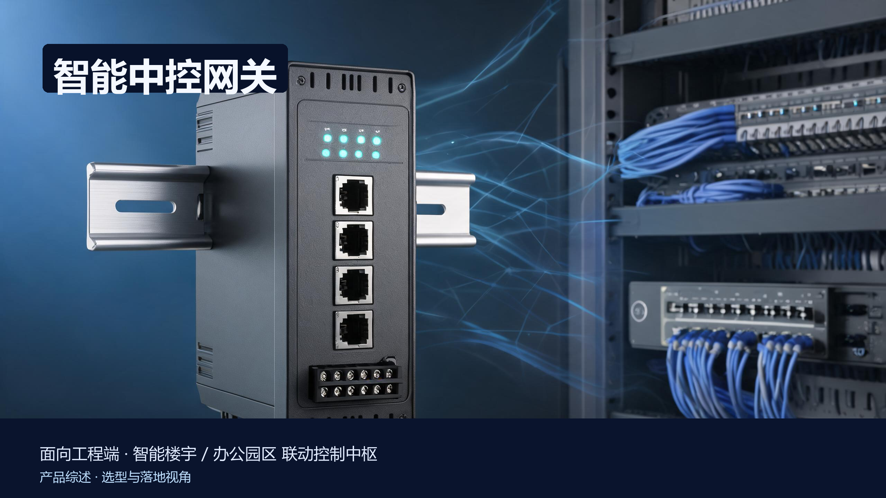
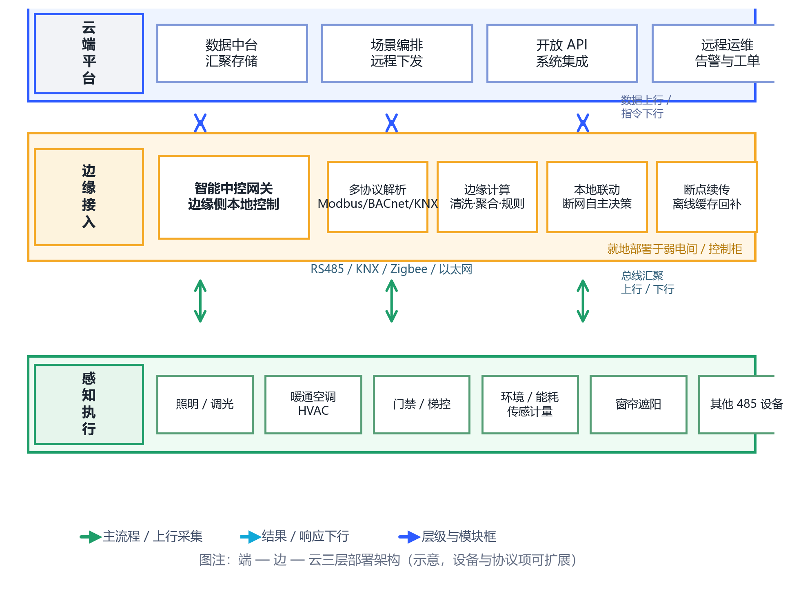
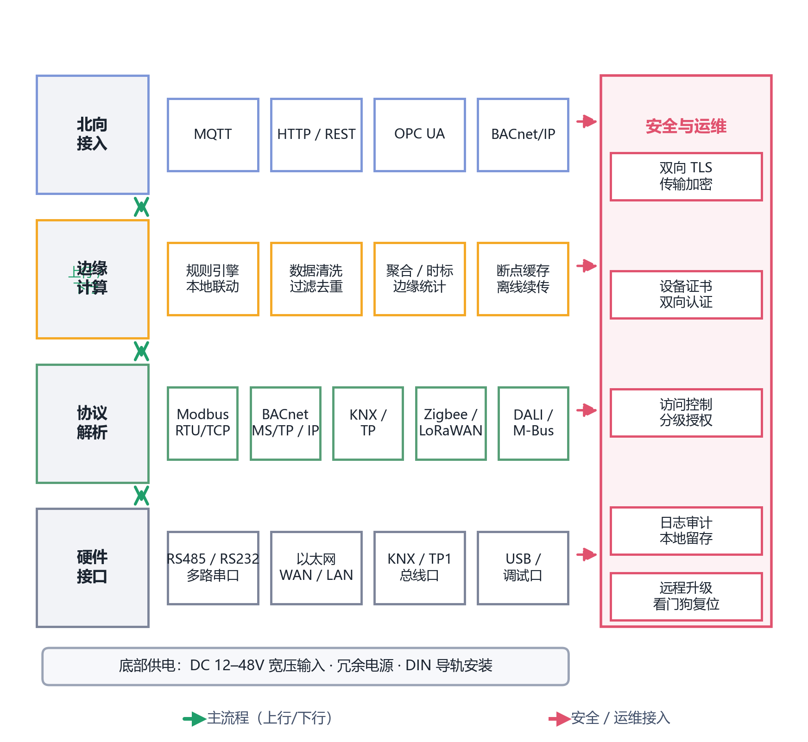
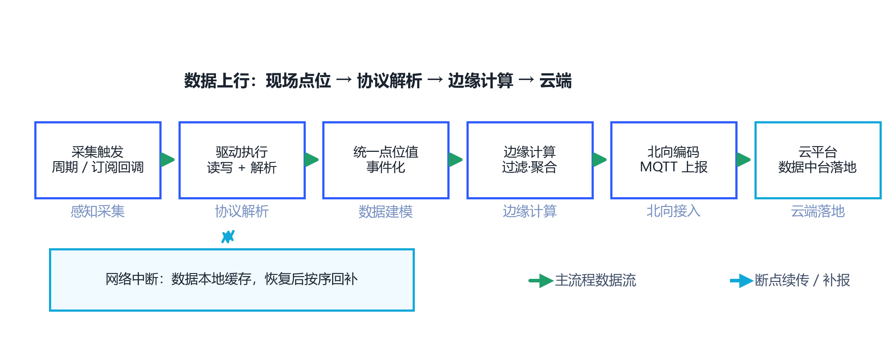
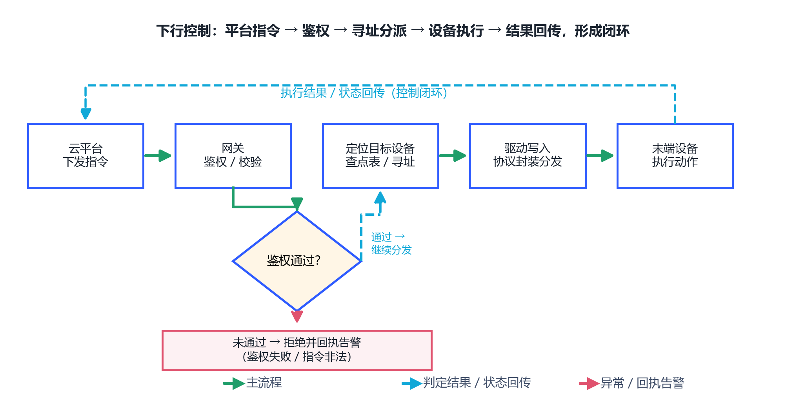

# 智能中控网关产品综述

> 面向工程端 · 选型与落地视角

---

## 〇、一句话定位

**智能中控网关是部署在楼宇 / 园区弱电间里的"一进一出"枢纽**：南向接入照明、暖通、门禁、能耗等各说各话的子系统和设备（Modbus、BACnet、KNX、Zigbee 等异构协议），北向以统一的 MQTT / HTTP / OPC UA 对接云平台，并在本地完成协议转换、边缘计算与断网自主联动。对工程端而言，它把"多套子系统各配一台网关、各自走专网对接平台"的方案，收敛为"一台网关统一接入、一个对象模型统一管理"的交付形态。

本文面向**工程 / 实施端**，覆盖产品设计方案、核心参数与选型、技术原理、应用场景、落地案例与核算清单。除标注了来源的行业基准外，参数均按**行业通用基准 / 工程估算**给出，用于方案评估，不作为某一具体型号的宣称指标。

---

## 一、产品设计方案

### 1.1 端—边—云三层部署形态

智能中控网关交付的不是单台设备，而是"设备感知执行层 → 边缘接入层 → 云平台层"的三层系统。现场末端设备（照明回路、风机盘管、门禁控制器、温湿度传感器、电表水表等）经由 RS485、KNX、Zigbee 、以太网等总线连到网关；网关汇聚后向云上行数据、接收下行指令；云平台负责数据中台、场景编排、远程运维与开放 API。

工程实施要点：

- **部署位置**就近放在弱电间 / 控制柜，走一条主网即可上云，末端设备不必直接上公网，暴露面更小。
- **本地依然是"活"的**：断外网时网关仍能按本地点表和规则完成联动控制，不依赖云端在线。
- **协议项可扩展**：不同项目接入的子系统不同，网关通过插件化驱动适配，协议种类、点位数可裁剪。

### 1.2 网关自身形态与接口

机箱通常采用 **DIN 导轨安装、12–48V 宽压供电**的工业形态，利于进弱电柜；正面提供以太网口、多路 RS485 / RS232 串口，部分机型带 KNX/TP1 专用总线口、USB 调试口及数字量输入输出。工程上关心的关键接口见第 2.2 节。

### 1.3 内部模块划分

从下往上四层清晰分工：**硬件接口层**（物理口）→ **协议解析层**（驱动适配 + 点表映射，把异构南向协议统一成对象模型）→ **边缘计算层**（清洗、聚合、规则引擎、本地联动、断点续传缓存）→ **北向接入层**（MQTT / HTTP / OPC UA / BACnet-IP 上行）。右侧 **安全与运维**贯穿全程：双向 TLS、设备证书认证、分级授权、日志审计与远程升级看门狗。

---

## 二、核心参数与选型

> 工程端第一步不是选型号，而是**先算清楚容量与边界**，再对照 2.2 参数表挑选机型。

### 2.1 选型思路与关键指标

选型围绕四个指标展开，优先把"够不够装、扛不扛得住"算清楚：

| 关键指标 | 工程含义 | 评估口径 |
| --- | --- | --- |
| **点位容量** | 网关能统一建模的数据点总数（AI/AO/DI/DO/累加量等） | 按项目所有子系统点位汇总，留 30% 余量 |
| **协议种类** | 支持哪些南向协议及各自驱动成熟度 | 核对本项目实际用到的协议，而非只求多 |
| **设备数 / 总线负载** | 单串口挂接设备上限、总线波特率上限 | 参考每条 485 总线 32–128 节点的通用上限，长缆加终端电阻 |
| **边缘算力** | 规则引擎并发、本地联动的时延与稳定性 | 联动频次高的场景优先选更充裕的算力与内存 |
| **可靠性** | 断网续传、看门狗、供电冗余、宽温 | 关键项目关注双冗余电源与 -20℃~70℃ 宽温 |

### 2.2 部件参数表（工程关注点）

下表为**行业通用基准范围**，供方案评估，具体以厂商选型规格书为准。

| 部件/指标 | 典型范围（工程基准） | 工程关注点 |
| --- | --- | --- |
| 以太网 | 1× WAN + 1× LAN，10/100Mbps | 主上行走有线，隔离管理网与业务网 |
| 串口 | 2~8 路 RS485 / RS232，600bps~115.2kbps | RS485 常用 9600/19200，注意 A/B 与终端电阻 |
| KNX/TP1 | 可选专用总线口 | 直连 KNX TP 总线无需额外协议转换 [1] |
| 无线（可选） | Zigbee / LoRaWAN 等子网接入 | 复核各无线子网自身设备容量上限 |
| 供电 | DC 12–48V 宽压，可双冗余 | 配 UPS / 双回路，掉电不丢配置 |
| 工作温度 | 工业级 -20℃~70℃ | 弱电间通风差时按上限留裕度 |
| 数据点容量 | 数百至两万个点位不等 [2] | 中小项目数百点，大型园区可上万点 |
| 内存/存储 | 数百 MB~数 GB 级 | 大点位 + 本地规则时选更大的量级 |

### 2.3 工程对接踩坑点

- **点表先行**：先把各子系统点位罗列成统一 excel 点表（点位名、寄存器地址、类型、单位、读写），再让网关按点表映射，可省大量联调时间。
- **485 总线不是无限挂**：串口驱动能力有限，单总线节点数过多会拖慢轮询，超限就分多串口或多网关。
- **协议差异在"语义"而不只在"格式"**：Modbus 是寄存器读写，BACnet 是对象属性，KNX 是组地址，跨协议联动的关键是把它们归一成统一的"设备对象+点位"模型，而非仅做报文中转 [3]。
- **安全别后补**：上行走 MQTT/TLS、设备证书双向认证应在方案阶段定好，避免上线后再改造。
- **断网续传真要测**：项目验收时要实测拔网线→数据缓存→恢复补报的过程，确认缓存不丢、顺序不回错。

---

## 三、技术原理

### 3.1 上行：从点位到云端

上行数据流是一条完整链路：周期采集或订阅回调触发 → 驱动执行读写并解析 → 归一到统一点位值 / 事件 → 边缘计算层做过滤、去重、聚合与打时标 → 北向编码（MQTT/HTTP）发送 → 云平台汇入数据中台。

工程上应重点理解两个机制：

- **边缘计算分担上行**：在网关端先做清洗 / 聚合，只把有价值的明细或统计上报，可明显降低云侧算力与带宽压力 [4]。
- **断点续传保真**：网络中断时数据落在本地缓存，恢复后按序回补，避免数据断层；这是工程验收的硬指标。

### 3.2 下行：平台指令到设备动作

下行是控制闭环：云平台下发指令 → 网关做鉴权 / 校验 / 限流 → 定位目标设备（查点表、寻址）→ 驱动写入并协议封装分发 → 末端设备执行 → 执行结果沿原路回传，形成一个完整闭环。

其中**鉴权判定**是安全边界：鉴权失败或指令非法，直接拒绝并回执告警，不让恶意指令触达末端设备；鉴权通过与目标可达性校验后，才将控制拆解为对应协议的写入动作。

### 3.3 安全架构

北向使用 **MQTT over TLS**、`CONNECT` 客户端证书双向认证，云端侧校验设备身份；南向设备默认隔离在局域网内，通过本地点表只开放必要的读写对象；本地保留日志审计，支持远程升级与看门狗复位，形成"传输加密 + 身份认证 + 权限控制 + 审计"的纵深。

---

## 四、应用场景

下列场景均遵循同一套路：**设备多、协议杂、要联动 → 用一台中控网关统一接入与本地联动**。

### 4.1 智慧楼宇 / 商用办公
- **痛点**：照明、暖通、窗帘、门禁各自成套，联动靠楼控软件逐套做接口，实施慢、耦合高。
- **方案**：一台网关把 KNX 灯光、BACnet/Modbus 空调、RS485 网关门禁等统一接入，本地规则做"人来灯亮、离人空调降载、靠窗遮阳联动"。
- **价值**：一套对象模型、一个平台账号即可统一调试与运维。

### 4.2 园区 / 厂区能源与能耗
- **痛点**：电表、水表、冷热量计协议杂乱，能耗数据采集全靠多台采集器拼装。
- **方案**：Modbus / M-Bus 集中器协议统一归一，边缘做日/时聚合后上报能耗平台。
- **价值**：口径统一、采集链路短，断网缓存保证计量不丢数。

### 4.3 酒店 / 公寓全屋智能
- **痛点**：客控、灯光、窗帘、门禁多品牌混装，跨品牌联动难。
- **方案**：网关做协议互转与场景脚本，"欢迎模式""睡眠模式"一套配置多处下发。
- **价值**：业主侧统一控制入口（App / 语音 / 面板），运维侧减少现场接线复杂度。

### 4.4 连锁门店 / 小微场景
- **痛点**：门店点多、IT 投入少，难以逐店配专网专平台。
- **方案**：本地轻量化的单网关方案，云平台远程统一下发策略与看店。
- **价值**：低成本、快速复制，网络波动时门店本地照常运行。

---

## 五、实际案例与设计方案

> 以下为按工程端四段式（需求 → 方案设计 → 配置核算 → 交付价值）整理的**演示性案例**，规模与点位为工程估算，用于展示落地方法而非真实项目数据。

### 案例 A：中型商业办公楼宇照明与空调联动

- **需求**：3 万㎡ 办公楼，12 层，照明与空调分区联动，要求断网时楼内联动不受影响。
- **方案设计**：1 台中控网关部署于弱电间；照明走 KNX，空调末端走 Modbus/BACnet，温湿度传感走 RS485；上行 MQTT/TLS 对接能耗平台。
- **配置核算**：照明点位约 800 点，空调末端约 300 点，环境传感约 120 点，合计约 **1 200 点**；以单网关数千点容量看，留足余量。KNX 与 485 总线各独立走线，避免总线负载过高。
- **交付价值**：一套对象模型统一调试；断网时本地规则继续执行"离人降栽"；后续新增子系统只需在网关侧加驱动，不必动上层平台。

### 案例 B：老旧楼宇改造接入

- **需求**：既有楼宇各子系统已建但各自为政，改造期不能大面积重做布线。
- **方案设计**：网关经由既有 RS485 总线与 KNX 网关接入存量设备，北向用 OPC UA 对接既有楼控，避免替换末端。
- **配置核算**：接入存量点位约 600 点，通过串口分组到 3 路 485，控制单总线负载在安全范围。
- **交付价值**：用"协议转换 + 对象归一"补齐异构，复用存量设备完成统一纳管，改造成本显著低于替换。

### 案例 C：园区能耗计量与断网保真

- **需求**：园区分电表、水表、冷热量计约 2 千点，要求计量不丢、上报口径一致。
- **方案设计**：网关接 Modbus/M-Bus 集中器，边缘做日/时聚合，网络中断时本地缓存并按序补报。
- **配置核算**：分多条 485 总线挂表，按轮询周期校核单总线在周期内的可读点位上限。
- **交付价值**：断网续传保证计量完整性，统一口径减少对账差异。

### 工程落地核算检查清单

- [ ] 点位表已按设备对象 + 点位（类型 / 单位 / 读写）统一，容量留 30% 余量
- [ ] 已核算单总线节点数与轮询周期，超限已拆串口 / 加网关
- [ ] 上行安全（MQTT/TLS、设备证书双向认证）已列入方案
- [ ] 断网续传与恢复补报已纳入验收测试项
- [ ] 供电冗余与工作温度按现场条件确认
- [ ] 本地规则 / 场景脚本与云端编排的边界已划分清楚

---

## 六、市场背景与竞争格局

### 6.1 为什么现在做

楼宇 / 园区的末端设备协议长期碎片化——有的系统用 Modbus、有的用 BACnet、有的用 KNX、有的走 Zigbee，彼此语言不同，过去要靠多台专用网关和大量胶水代码才能互操作 [5]。随着节能与运营精细化要求上升，业主希望"一套平台管所有子系统"，这就把**"统一接入的中控网关"**推到了交付的核心位置。边缘计算成熟后，网关不再只是数据透传，还能就地算、本地联，进一步降低了云侧与带宽成本 [4]。

> 证据口径说明：本段不引用未经核实的具体市场规模数字；行业趋势描述引自公开资料。

### 6.2 竞争格局

市中控网关的玩家大致分三类：

| 类型 | 特点 | 典型定位 |
| --- | --- | --- |
| **综合型边缘网关厂商** | 协议全、工业形态成熟、算力强 | 楼宇 / 园区大项目，偏协议标准化 [1][2] |
| **智能家居 / 全屋智能厂商** | 形态轻、App/语音体验好 | 酒店公寓、全屋智能，偏生态 [6] |
| **楼控 / 弱电集成商方案** | 与既有楼控平台深度绑定 | 改造项目复用存量系统 |

差异化主要落在三点：**南向协议覆盖广度与驱动成熟度**、**本地联动的算力与稳定性**、**北向开放接口（MQTT / OPC UA / REST）的标准化程度**。工程选型应优先核对驱动成熟度与开放接口，而非单纯比协议数量。

---

## 七、商业模式与趋势

### 7.1 交付与盈利

- **硬件 + 实施**：一次性设备销售 + 点位施工，是当前主要收入。
- **协议 / 驱动订阅**：某些机型对扩展协议库、高级规则按年授权，形成可持续收入。
- **平台 / SaaS 增值**：网关绑定云平台后，远程运维、数据托管、节能策略可按订阅计费。

### 7.2 演进方向

- **算力上移、联动本地化**：网关本地规则越来越强，离线自治能力成为标配。
- **开放与标准化**：向 MQTT/OPC UA/Webhook 等开放接口收敛，降低被锁定的风险。
- **AI 与节能融合**：边缘侧引入节能策略、异常诊断，从"互联"走向"智能运维"。
- **安全纵深**：设备证书、链路加密、可信启动持续强化，满足能源 / 园区等合规要求。

---

## 参考与来源

> 仅列出本文引用过的公开来源；未标注具体市场数字，避免臆造。

[1] RabbitMilesight —— Building IoT Gateway（EG71），智能建筑多协议网关产品页：支持 BACnet、Modbus、KNX、M-Bus、LoRaWAN 统一接入。
[2] Robustel LG5120 —— 面向智能建筑的边缘网关：支持 KNX TP 与 KNXnet/IP 直连、本地自动化逻辑与联动。
[3] Wevolver —— IoT Gateway Architecture：协议翻译、数据汇聚与本地决策是网关核心能力。
[4] 多协议边缘计算网关研究与设计（《组合机床与自动化加工技术》）：协议转换成因、南向异构统一转换上行。
[5] RabbitMilesight EG71 Review —— 楼宇子系统各自"方言"、单网关跨协议接入的价值。
[6] 涂鸦智能 —— 智能网关中控解决方案：跨品牌互联、语音 / 屏幕 / App 多控制方式。

> 备注：图片 1–4 为按行业实践绘制的结构 / 流程示意；图片 5 与封面为概念示意图（AI 生成，无文字水印）。