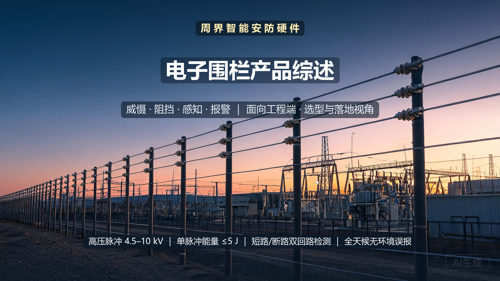
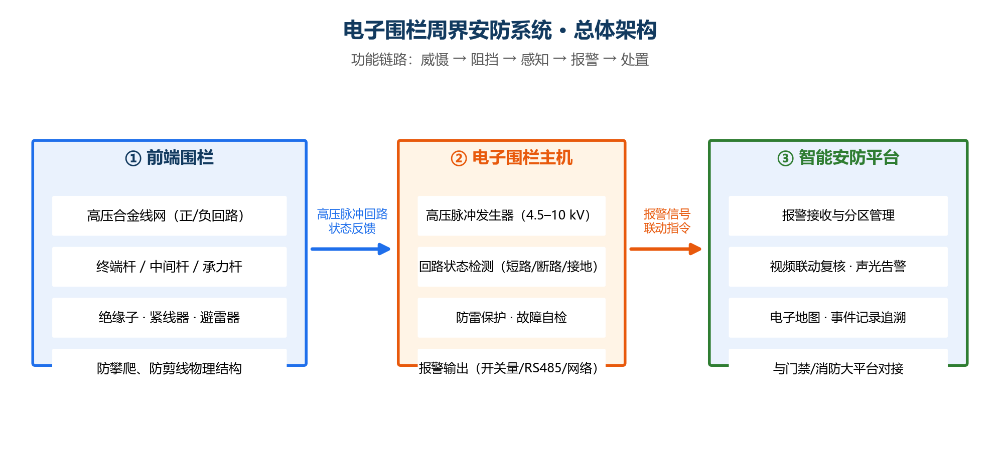
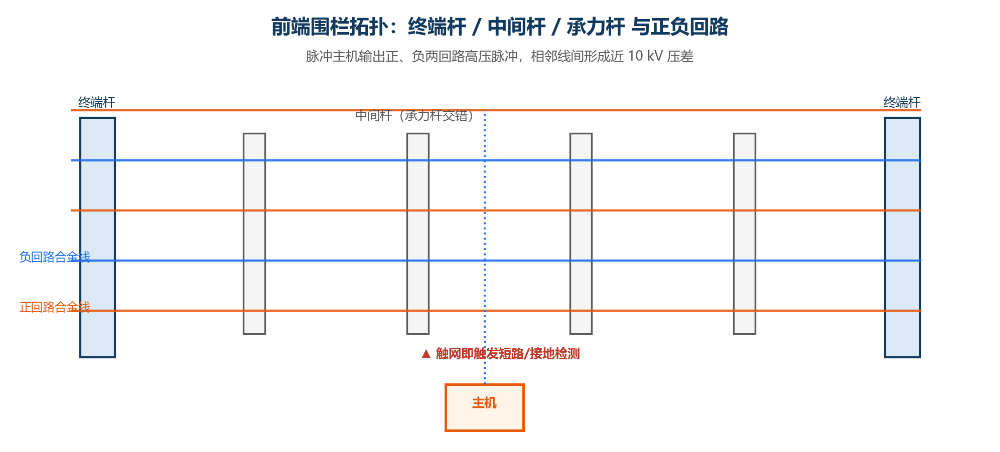
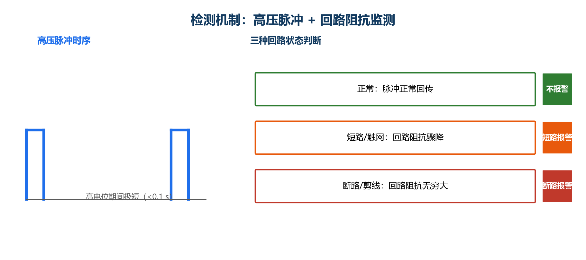

# 电子围栏产品综述：一段高压脉冲，筑起主动周界警戒线

>  **产品**：电子围栏周界安防系统 ｜ **日期**：2026 年 9 月 28 日 ｜ **面向**：工程 / 选型与落地视角

电子围栏用高压脉冲把"威慑、阻挡、感知、报警"串成一条链，正在把周界安防从"被动的围墙 + 摄像机"推向"主动的带电警戒线"。本文从技术原理、核心参数与选型、系统架构、落地案例、竞争格局到商业模式，拆解这类智能硬件为什么值得投入、又该如何正确落地。

**一句话结论：** 电子围栏不是简单加高围墙，而是用受国标约束的高压脉冲，让"触碰即报警、破坏即感知"成为一条连续的全天候警戒线——相比纯视频方案具备主动阻挡与实时感知，相比误报频繁的旧式对射方案具备更好的环境适应性。

> 封面图：黄昏时分变电站与工业园区的电子围栏周界，隐喻高压脉冲构成的主动警戒线。概念示意图。

---

## 1 产品设计与系统架构

电子围栏的价值，来自"前端被动阻挡、主机主动感知、平台统一处置"的三端协同。

> 系统总体架构：前端围栏（感知层）→ 电子围栏主机（处理层）→ 智能安防平台（应用层）。

### 1.1 前端围栏

前端是物理载体，由立柱、绝缘子、合金导线按一定层数架设成网，常见 4 至 8 线。它承担两件事：**物理威慑与阻挡**（带电金属网难以攀爬、剪线必留痕迹），以及**把扰动转化为可检测的电学变化**。

### 1.2 电子围栏主机

主机是整个系统的"大脑"，负责把低压电能升压成高压脉冲送入围栏，同时实时监测回路的电压、电流与阻抗变化。一台主机可管理多个防区，防区即告警的最小定位单位——分得越细，处置越精准。

### 1.3 智能安防平台

平台接收主机的报警信号，结合电子地图分区定位告警点，联动视频复核、声光告警，并把事件与门禁、消防等系统打通，实现闭环处置。

> 前端围栏拓扑示意：六条合金线按正、负回路交替供电，脉冲主机引出两条回路，任一断线或触网短路都可被主机感知。

## 2 核心参数与选型

对工程实施而言，参数决定"这套方案能不能在你的现场稳定工作"。下表以**国家标准 GB/T 7946-2015《脉冲电子围栏及其安装和安全运行》**为安全与性能基准之一。

### 2.1 关键参数表（主机级）

| 参数 | 常见口径 | 工程含义与关注点 |
| --- | --- | --- |
| **脉冲电压峰值** | 高压模式 4.5 kV～10 kV | 电压越高威慑力越强，但需配套足够绝缘与警示；低压模式用于局部低污染环境。 |
| **脉冲电流峰值** | ≤ 10 A | 峰值电流受国标限制，避免造成直接伤害。 |
| **脉冲宽度（持续时间）** | ≤ 0.1 s，且超过 300 mA 的持续时间 ≤ 1.5 ms | 高能量仅在一个极短时间窗口内出现，这是"有力威慑、非致命"的关键。 |
| **脉冲间隔时间** | 1 s～1.5 s | 决定电击频率与综合能耗，也影响人触网后的可摆脱性。 |
| **脉冲输出电量** | ≤ 2.5 mC | 单脉冲携带总电荷，工程上约束能量大小。 |
| **脉冲输出能量** | ≤ 5.0 J | 单脉冲总能量上限，是安全设计的核心红线。 |

> 上述电压/电流/宽度/间隔/电量/能量 6 项为 GB/T 7946-2015 对脉冲电子围栏主机的基本参数要求。

### 2.2 前端部件选型

| 部件 | 常见规格 | 工程关注点 |
| --- | --- | --- |
| **合金导线** | 20# 铝镁合金，约 500 m/卷，拉伸强度高、抗氧化 | 线径与强度决定抗剪线与耐腐蚀能力；转角、弧线段要单独核算。 |
| **承力杆 / 支撑杆** | 金属材质，受力杆直径 ≥ 30 mm，壁厚 ≥ 3 mm | 张力式围栏对杆件机械强度要求更高，选材决定长期稳固。 |
| **张力模块** | 张力测量范围约 1 N～500 N，报警响应时间 ≤ 5 s | 张力式对不同安装倾角、温度漂移更敏感，需现场标定。 |
| **防雷与绝缘** | 避雷器、绝缘子按点位配置 | 雷击多发区必须配避雷器，绝缘间距不足会导致误报。 |

### 2.3 选型与核算公式（工程起点）

- **防区划分**：防区数 = 围墙总长 ÷ 单防区长度。
  - 脉冲式电子围栏：单防区覆盖距离较长（行业通用基准约 100 m～200 m）。
  - 张力式电子围栏：常规直线围墙每防区不超过约 40 m，弧线或转角处每防区不超过约 30 m（行业通用基准）。
- **线材用量**：合金线总长 ≈ 围墙周长 × 线数 ×（1 + 转角/分段/损耗余量）。
- **主机选型**：依据防区总数、单防区线数、报警输出方式（开关量 / RS485 / TCP/IP）与供电条件，确定主机型号与台数。

### 2.4 工程对接踩坑点

- **防雷与接地**：需要独立可靠的接地体，并与避雷器联动；接地不良会引入地电位抬升引发误报或损坏主机。
- **绝缘间距**：合金线与立柱、墙体、绿化、电力线的距离要符合绝缘要求，植被紧贴导线会因湿度改变阻抗而误报。
- **防区颗粒度**：防区划得越粗，单次告警的搜索范围越大；划分要贴合现场处置路径与巡逻分区。
- **与视频联动时延**：报警联动摄像机需确认走线延时的可达性，避免"收到告警、枪机转不到位"。

---

## 3 技术原理：为什么可信赖

说服工程读者相信"它靠谱"，比堆砌功能更重要。电子围栏的技术根基是三件事：高压脉冲的产生、非致死的安全边界、以及回路阻抗的实时判别。

### 3.1 高压脉冲怎么来

主机先存储低压电能，再通过升压与换流电路，在短时间内释放出高压脉冲。实际部署常采用**正负双回路**：主机分别输出正、负高压脉冲，使相邻导线之间形成接近 10 kV 的电位差——入侵者无法借助单根线"接地"来规避电击，任何两根线之间都有可感知的高压。

### 3.2 为什么"有力又安全"

关键在能量窗口。国标把单脉冲能量、电量、电流宽度都限定在狭窄范围（见 2.1 节）——触网瞬间虽受强烈电击刺激，但总能量不足以对人体造成持续电流通路伤害，是典型的"高电压、低能量、极短时间"的乏力脉冲。工程上这一设计让电子围栏能够全天候带电运行而无需担心安全合规。

### 3.3 怎么知道有人破坏：回路阻抗三态判别

主机持续向围栏回路发送脉冲，并监测回路状态。

> 检测机制示意：正常回传不报警；触网短路 → 短路报警；剪线断路 → 断路报警。

- **正常**：脉冲沿回路正常回传，主机不动作。
- **短路（触网）**：如人体触碰围栏，人体电阻（约 1 kΩ～10 kΩ）会显著拉低回路阻抗，主机判为短路告警。
- **断路（剪线）**：导线被剪断，回路阻抗趋近无穷大，主机判为断路告警。

一次触碰或破坏会直接触发"告警已上报"，无需人工盯屏。

### 3.4 技术演进脉络

电子围栏经历了**脉冲式 → 张力式 → 智能联动**的三代演进。脉冲式靠高压电流感知；张力式改用物理张力变化来探测攀爬与剪线，环境误报更低；第三代在感知之外叠加视频复核与 AI 识别，让"告警"升级为"告警 + 处置建议"。

---

## 4 功能与差异化

功能是原理翻译给用户的价值语言。电子围栏的能力可归为四层。

### 4.1 核心能力

- **主动威慑**：高压带电的外观与警示牌，在入侵前就降低作案意愿。
- **物理阻挡**：无法借力的金属线网，直接提高翻越难度与时间成本。
- **即时感知**：短路 / 断路 / 接地三类异常秒级上报，定位到防区。
- **报警联动**：声光告警 + 平台弹窗 + 视频复核 + 门禁/消防对接，形成处置闭环。

### 4.2 差异化卖点（与常见周界方案对比）

| 维度 | 脉冲电子围栏 | 张力式电子围栏 | 红外/微波对射 |
| --- | --- | --- | --- |
| **主动阻挡** | 有（带电） | 有（机械） | 无 |
| **环境误报** | 中（阴雨/植被需优化） | 低（无电击依赖） | 高（雨雾/落叶易误报） |
| **感知距离/防区** | 单防区较长 | 单防区较短（40 m 级） | 视距有限 |
| **本质差异** | 带电威慑 + 破坏感知 | 高可靠机械感知，适合敏感场所 | 廉价但可靠性依赖环境 |

### 4.3 增强能力

成熟部署后，系统可叠加**视频联动复核**与**误报率持续优化**：前者用图像二次确认、降低无效出警成本，后者通过部署期数据迭代阈值与识别模型，让告警质量随运行天数上升。

---

## 5 实际案例与设计方案

工程价值最终要在项目的配置核算里兑现。以下两个案例按"需求 → 方案 → 配置核算 → 交付价值"展开。

### 5.1 案例一：工业园区周界改造

- **需求**：某 800 m 周长的仓储物流园区，原为"围墙 + 红外对射"，落叶与鸟兽常触发误报，值班处置成本高。
- **方案设计**：改用 6 线脉冲电子围栏，按单防区约 100 m 划分为 8 个防区；每个防区独立接入主机，联动园区高位枪机与声光报警器。
- **配置核算**（演示估算）：合金线约 800 m × 6 线再计入转角与损耗余量 ≈ 5 400 m；配 20# 合金线 11 卷（500 m/卷）即为安全边界；主机按 8 防区选型，配套避雷器 8 套。
- **交付价值**：误报由"每天数次"降至"几乎为零"，告警定位精度从"整圈周界"细化到"100 m 段"，出警时间明显缩短。

### 5.2 案例二：变电站周界防护

- **需求**：变电站属雷击高发、禁止火花区域，需要既能防雷、又能与电网生产大区安全隔离的周界方案。
- **方案设计**：采用张力式电子围栏（无带电脉冲，规避火花风险），直线段每防区约 40 m；沿围墙全程铺设张力钢丝，联动周界摄像机与门禁。
- **配置核算**（演示估算）：周长 600 m → 张力式约 15 个防区；每防区配张力控制器与独立计量模块，分段多点接地；结合围墙高度决定钢丝层数。
- **交付价值**：满足禁区无火花要求，雷电耐受性好，攀爬即报、剪线即感，与生产系统物理/逻辑隔离。

### 5.3 工程落地核算检查清单

- [ ] 围墙/边界全长已实测，含转角与弧线折减
- [ ] 防区划分匹配巡逻路线与值班分区
- [ ] 脉冲式是否满足现场电压等级 / 张力式是否规避火花需求
- [ ] 防雷器、接地体、绝缘间距已纳入设计与会审
- [ ] 合金线、杆件、绝缘子的数量已按损耗余量核算
- [ ] 报警接口与视频 / 门禁 / 平台联动的协议与时延已确认
- [ ] 警示牌数量与布置符合规范与舆情要求

---

## 6 市场背景与竞争格局

### 6.1 背景与痛点

安防行业正从"事后取证"转向"事前感知"。围墙加视频的被动组合只能"记录已发生的事"，无法在入侵早期形成正向威慑与即时感知；红外对射等旧方案又受雨雾与植被干扰，误报频发。电子围栏恰好命中"主动阻挡 + 实时感知 + 全天候"这组工程诉求，因此在园区、能源、输变电、仓储等场景快速普及。市场规模的定量数据以行业公开报告为准，本文不作无来源的推断。

### 6.2 竞争格局矩阵

| 维度 | 电子围栏 | 张力围栏 | 振动光纤 |
| --- | --- | --- | --- |
| **阻挡能力** | 强（带电/机械） | 较强（机械） | 弱（只感知） |
| **感知精度** | 防区级 | 防区级（细分） | 米级定位 |
| **环境适应** | 中-好 | 好 | 极好（无源） |
| **宜用场景** | 园区/厂区/住宅 | 变电站/无火花禁区 | 超大尺度管线/远距离边界 |

三者并非简单替代，而是按"是否需要带电阻挡、感知精度要求、防区尺度"做不同取舍。

### 6.3 核心壁垒

竞争壁垒主要落在**安全合规设计、检测稳定性与工程化交付能力**三项。能否在胶着天气下不误报、是否满足国标与消防禁区要求、能否在复杂地形按期交付，决定了方案能否真正落地——这比参数堆砌更难被后来者复制。

---

## 7 商业模式与趋势

### 7.1 交付与盈利形态

电子围栏通常以**整套方案交付 + 长期运维**经营：一次的杆件、合金线与主机硬件构成主体，平台与联动软件承载告警管理，再以长期值守、巡检与算法标定的运维订阅形成持续收入。硬件、软件、服务三层递进，让厂商从一次性买卖走向生命周期经营。

| 收入来源 | 说明 |
| --- | --- |
| **硬件** | 前端杆件/合金线、电子围栏主机、防雷与联动设备 |
| **平台软件** | 电子地图、告警管理、视频联动平台的使用授权 |
| **运维订阅** | 值守巡检、阈值标定、AI 识别迭代的持续性服务费 |

### 7.2 未来路线图

- **AI 识别降误报**：用视觉与波形模型二次判别"触碰/破坏/自然扰动"，进一步压低无效报警。
- **多传感融合**：电子围栏 + 振动光纤 + 视频复核组合判断，兼顾带电阻挡与超尺度感知。
- **从报警走向决策**：在识别之外提供处置建议与应急联动，让系统从"告警器"升级为"安防决策中枢"。

> **写在最后：** 电子围栏的价值，在于它把"带电的高压脉冲"变成一条同时具备**威慑、阻挡、感知、报警**能力的主动警戒线。对工程而言，它解决的是"如何让围墙自己开口说话"这一长期难题——这让它成为园区与工业边界安防中难以替代的方案底座。

---

## 参考资料

1. 《脉冲电子围栏及其安装和安全运行》GB/T 7946-2015。规定了脉冲电子围栏主机的电压、电流、脉冲宽度、脉冲间隔、电量与能量等基本参数。 相关公开标准见 [国家标准全文公开系统检索页](https://openstd.samr.gov.cn/bzgk/gb/) 。
2. 电子围栏工作原理（高压脉冲、短路/断路检测）与产品资料。行业公开技术资料，供原理背景参考。
3. 张力式电子围栏配置与防区划分原则。行业通用基准，具体数值以厂商实测与工程现场为准。
4. 合金导线（20# 铝镁合金）产品规格。行业通用基准，具体以供应商供货参数为准。