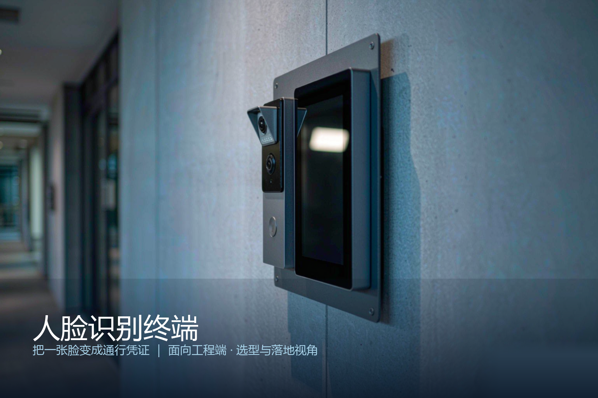
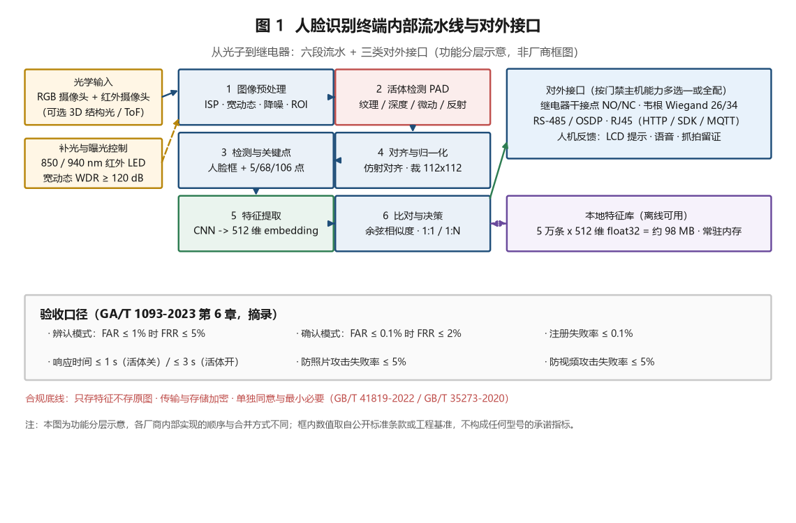
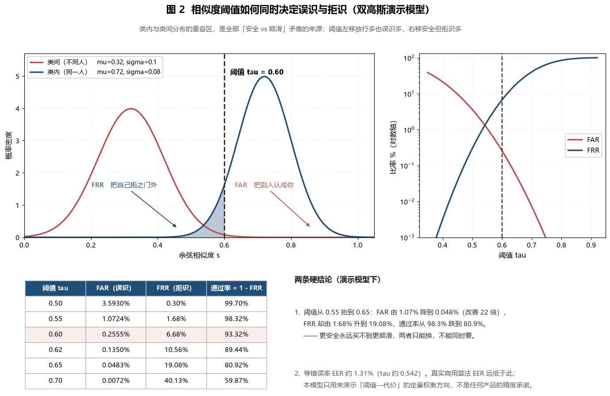
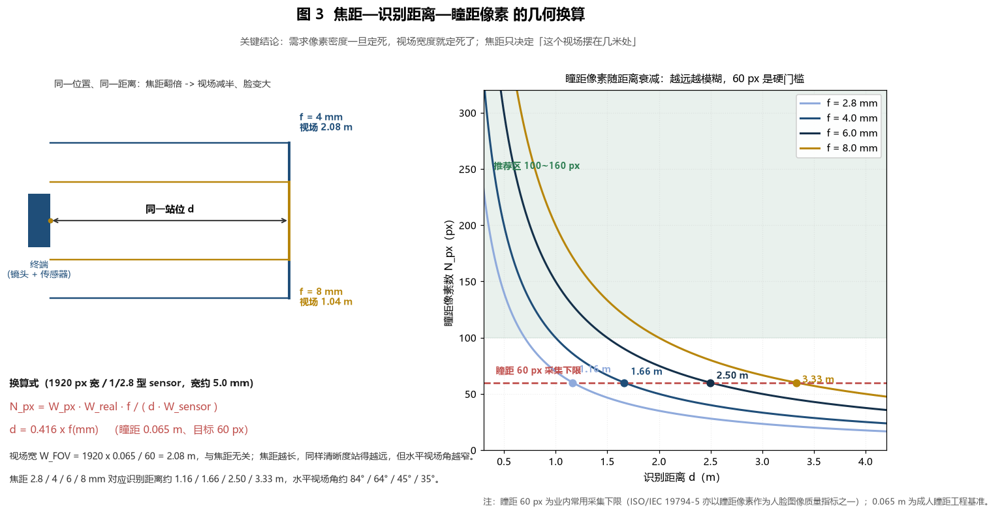
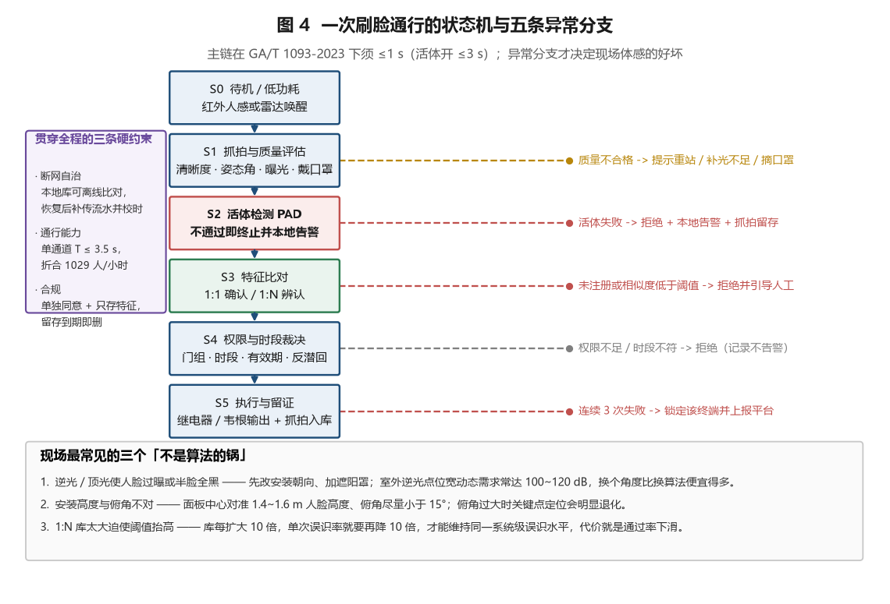

# 人脸识别终端产品综述：把一张脸变成通行凭证

> **面向读者**：弱电/安防集成商、门禁与楼宇对讲工程岗、园区/写字楼/校园/工地运营方，以及要做选型与验收的甲方技术口。
> **数据口径**：标注「工程基准」的数值来自公开标准条款或行业通行做法；标注「工程估算」的数值为可复算的推算示例，只用于说明数量级与权衡方向，不构成任何厂商的承诺指标。文中算法参数均为演示取值，不代表任何真实产品的精度水平。

*封面为概念示意图，非真实项目照片。*

---

## 〇、一句话定位

**人脸识别终端是把一张人脸变成通行凭证的边缘智能设备：它在本地完成采集、活体判别、特征比对与权限裁决，最后只用一根线（继电器或韦根）告诉门锁「开」或「不开」。**

这句话看似简单，但它把这门生意里最难的三件事压进了一个不到 1 秒的动作里：

| 要回答的问题 | 技术手段 | 判错的后果 | 度量口径 |
|---|---|---|---|
| 这张脸是活人吗 | 活体检测（纹理 / 深度 / 微动 / 反射特性） | 被照片或手机屏骗开 | 防假体呈现攻击失败率 |
| 这张脸是谁 | 特征提取 + 1:1 确认或 1:N 辨认 | 认错人 → 陌生人进门 | FAR（误识率） |
| 放不放他进 | 阈值裁决 + 门组/时段/有效期 | 认对了却不开门 → 堵在闸机前 | FRR（拒识率） |

这三件事构成一个死结：**活体做得越严、阈值定得越高，「安全」就越好，「顺滑」就越差。** 全篇的技术分析，本质上都是在算这笔交换的汇率。

**六个数字先放在这里，后面每一笔账都会回到它们：**

1. **1 s / 3 s**——GA/T 1093-2023 要求：关闭呈现攻击检测时，人脸识别响应时间不大于 1 s；开启检测时不大于 3 s。
2. **FAR ≤ 1% 时 FRR ≤ 5%**——GA/T 1093-2023 对人脸**辨认模式**（1:N）的性能底线。
3. **FAR ≤ 0.1% 时 FRR ≤ 2%**——同标准对**确认模式**（1:1）的性能底线。注意两者差了整整一个数量级，这不是笔误，而是 1:N 与 1:1 的本质区别。
4. **0.1%**——注册失败率上限。注册这一步做不好，后面所有指标都是空谈。
5. **5% / 5% / 10%**——防照片攻击失败率、防视频攻击失败率各不大于 5%；若系统需满足 GB/T 37078-2018 中安全等级 4，还需仿真人脸面具攻击失败率不大于 10%。
6. **60 px**——瞳距像素数。这是整套光学选型的地基：脸在画面里小于这个尺度，算法再强也无从下手。

> **为什么把 60 px 抬到和国标并列的位置？** 因为在真实项目里，导致「识别率不达标」的原因里，安装与光学因素往往多于算法因素。第 2.4 节会用一个换算式说明：**镜头焦距决定的是「站多远」，而不是「脸多大」——脸多大是被像素密度要求锁死的。**

---

## 一、产品设计方案

### 1.1 架构：六段流水 + 三类对外接口

一台人脸识别终端，无论形态是壁挂面板、闸机立柱还是门禁一体机，内部都可以拆成同一条流水线：

*图 1：功能分层示意。各厂商内部实现的顺序与模块合并方式不同，此处只表达逻辑分工。*

**第一段：图像预处理。** 传感器出来的原始 Bayer 数据先经 ISP 做宽动态合成、降噪与白平衡，再把人脸可能出现的区域（ROI）裁出来交给后面。这一段的关键词是「宽动态」——第 2.7 节会说明为什么它常常是室外项目的生死线。

**第二段：活体检测（PAD，Presentation Attack Detection）。** 这一步决定「眼前是三维的活人脸，还是一张二维的纸/屏」。它必须在特征比对之前完成，否则一旦拿假体比中了库里的模板，门就开了。不同技术路线的抗攻击能力差异极大，见 3.4 节。

**第三段：检测与关键点定位。** 找出人脸框，并定位 5 点（双眼中心、鼻尖、两嘴角）或 68/106 个关键点，同时估计姿态角 yaw/pitch/roll。姿态角是质量闸门：偏转过大的人脸，即使识别出来置信度也不可靠，不如提示用户正对镜头重来。

**第四段：对齐与归一化。** 用关键点做仿射变换，把任意角度、任意尺度的人脸「摆正」到标准姿态，裁成固定尺寸（常见 112×112），再做光照归一化。这一步的价值在于：**让同一个人的不同照片，在进入网络之前先长得尽量像。**

**第五段：特征提取。** 卷积网络把 112×112×3 的像素阵列压成一个 128 / 256 / 512 维的向量（embedding），并做 L2 归一化，使所有特征都落在单位超球面上。此后「像不像」这个定性问题，就变成了两个单位向量之间的夹角这个定量问题。

**第六段：比对与决策。** 计算余弦相似度 $s = \cos\theta$，与阈值（第 2.2 节）比较；若通过，再叠加门组、时段、有效期、反潜回等业务规则，最后由继电器干接点、韦根或 RS-485/OSDP 输出控制信号。

**对外接口是这份设计里最容易被低估的一环。** 一台算法再好的终端，如果只能吐出继电器信号而不能把「谁在几点几分进了哪扇门」传回平台，在需要审计的场景里就是半个残废。接口清单通常包括：继电器干接点（NO/NC）、韦根 Wiegand 26/34、RS-485 / OSDP、RJ45 以太网（HTTP / SDK / MQTT）、USB 或 TF 卡本地导出。

### 1.2 形态谱系：三个正交维度

选型时不要问「哪款终端好」，而要先把三个维度定下来，型号自然就收敛了。

**维度一：识别模式**

| 模式 | 逻辑 | 典型场景 | 性能口径 |
|---|---|---|---|
| 1:1 确认 | 先有身份（卡、工号、身份证），再验证脸是不是这个人 | 人证核验、双因子门禁 | FAR ≤ 0.1% 时 FRR ≤ 2% |
| 1:N 辨认 | 没有身份声明，直接在库里找「你是谁」 | 无感通行、闸机、梯控 | FAR ≤ 1% 时 FRR ≤ 5% |
| M:N 比对 | 一群人对一群库，做群体筛查 | 布控、预警 | 属视频结构化范畴，另论 |

**维度二：活体技术路线**——RGB 单目，或近红外双目，或 3D 结构光/ToF。这一维直接决定防攻击上限与成本，3.4 节详述。

**维度三：载体与安装形态**

| 形态 | 特点 | 常见场景 |
|---|---|---|
| 壁挂面板机 | 8 寸/5 寸屏，PoE 供电，安装高度 1.4~1.6 m | 办公区门禁、梯控外呼 |
| 闸机嵌入面板 | 无外壳，仅面板和镜头模组，宽度 ≤ 20 cm | 写字楼大堂、地铁、场馆 |
| 门禁一体机 | 集成读卡器、密码键盘，可脱离平台独立运行 | 中小项目、单元门 |
| 立柱/桌面终端 | 带支架，可调俯仰，多用于人证核验台 | 政务窗口、酒店、医保 |
| 户外防护型 | IP65+ 防护罩、加热玻璃、红外补光加强 | 社区大门、工地出入口 |

### 1.3 九道设计关

把一台终端从图纸做到现场可用，要依次跨过九道关。**每一道关都能独立地毁掉项目体验，而它们之间几乎不能互相补偿。**

1. **识别关**：在目标库规模下，FAR/FRR 是否落在标准与业主要求的交集里。
2. **活体关**：面对照片、视频、面具的失败率是否达标，且**开关可控**（GA/T 1093-2023 明确要求防假体呈现攻击检测功能可控制开启与关闭）。
3. **光学关**：瞳距像素、识别距离区间、视场角、俯角是否匹配现场站位。
4. **光照关**：逆光、侧光、顶光、夜间暗光下的动态范围与补光是否够用。
5. **通行关**：单通道每小时能过多少人，与峰值人流是否匹配。
6. **自治关**：断网时能否继续放行、恢复后能否补传与校时。
7. **合规关**：单独同意、最小必要、只存特征、留存期限、加密与审计。
8. **供电关**：PoE 功率预算是否足够，户外加热型是否必须本地供电。
9. **运维关**：模板下发效率、固件批量升级、故障终端定位、误拒工单处理。

> 现场经验的硬话：**第 3、4 关解决的是 80% 的「识别率不达标」投诉。** 很多项目换了三批设备，最后是加了个遮阳罩、把终端从玻璃幕墙正对面挪到侧墙才解决。

---

## 二、核心参数与选型

### 2.1 参数速查表

下表中的「工程基准」值来自公开标准条款或行业通行做法；标「工程估算」者为示例推算值。

| 参数 | 典型值 / 要求 | 来源与说明 |
|---|---|---|
| 响应时间（活体关） | ≤ 1 s | GA/T 1093-2023 6.8.1，工程基准 |
| 响应时间（活体开） | ≤ 3 s | GA/T 1093-2023 6.8.2，工程基准 |
| 辨认模式性能 | FAR ≤ 1% 时 FRR ≤ 5% | GA/T 1093-2023 6.7a，工程基准 |
| 确认模式性能 | FAR ≤ 0.1% 时 FRR ≤ 2% | GA/T 1093-2023 6.7b，工程基准 |
| 注册失败率 | ≤ 0.1% | GA/T 1093-2023 6.6，工程基准 |
| 防照片攻击失败率 | ≤ 5% | GA/T 1093-2023 6.4.1a，工程基准 |
| 防视频攻击失败率 | ≤ 5% | GA/T 1093-2023 6.4.1b，工程基准 |
| 防仿真面具失败率 | ≤ 10%（安全等级 4 场景） | GA/T 1093-2023 6.4.2，引用 GB/T 37078-2018 |
| 本地模板容量 | 5 000 ~ 100 000 条 | 工程基准，随产品档次分档 |
| 特征维度 | 128 / 256 / 512 维 float32 | 工程基准 |
| 摄像头分辨率 | 200 万像素（1920×1080）起 | 工程基准 |
| 宽动态范围 | 室内 ≥ 105 dB；室外 ≥ 120 dB | 工程估算，依 2.7 节反推 |
| 红外补光波长 | 850 nm（有微红暴）/ 940 nm（无红暴） | 工程基准 |
| 补光有效距离 | 0.5 ~ 2.5 m | 工程基准 |
| 识别距离 | 0.3 ~ 2.0 m（4 mm 镜头档） | 工程估算，见 2.4 节 |
| 瞳距像素下限 | ≥ 60 px | 工程基准，参见 ISO/IEC 19794-5 的人脸图像质量思路 |
| 人脸库 ≥ 10 000 时的单次误识率 | ≤ 1×10⁻⁶ | 工程估算，见 2.3 节 |
| 防护等级 | 室内 IP52；室外 IP65 起 | 工程基准 |
| 工作温度 | -20 ~ +60 ℃（带加热玻璃可到 -30 ℃） | 工程基准 |
| 供电 | PoE 802.3af（12.95 W 可用）/ at（25.5 W 可用） | 工程基准 |
| 整机功耗 | 8 ~ 15 W；户外加热型 25 W+ | 工程估算 |
| 输出接口 | 继电器 / 韦根 26 或 34 / RS-485 / OSDP | 工程基准 |
| 屏幕尺寸 | 5 寸 / 7 寸 / 8 寸 | 工程基准 |
| 人脸抓拍留存 | 现场照 + 特征 + 时间戳 | GA/T 1093-2023 6.5 思路 |
| 事件记录留存期 | 30 天 ~ 1 年（按合规要求定） | 工程基准 |
| 模板下发 | 支持批量增量下发与校验 | 工程基准 |
| 断网自治 | 本地库离线比对 + 流水缓存 + 恢复补传 | 工程基准 |
| 加密要求 | 传输 TLS，特征存储加密，密码模块可参考 GM/T 0028 | 工程基准 |
| 安装高度 | 面板中心 1.4 ~ 1.6 m | 工程基准 |
| 俯角 | 建议 ≤ 15° | 工程估算 |
| 接入协议 | 支持 GB/T 28181 或平台私有 SDK | 工程基准 |

### 2.2 第一笔账：阈值决定的是「汇率」，不是「精度」

行业里最常被混淆的一件事：**FAR 和 FRR 不是两个独立指标，而是同一条阈值线上的两个投影。** 调高阈值，FAR 降、FRR 升；调低阈值，反之。不存在「同时优化两者」的旋钮。

为了让这笔账可以定量地算，我们用两个高斯分布来近似描述相似度的统计行为（**演示取值，不是任何产品的真实精度**）：

- 类内分布（同一个人的两次抓拍）：均值 $\mu_1 = 0.72$，标准差 $\sigma_1 = 0.08$
- 类间分布（不同人之间）：均值 $\mu_0 = 0.32$，标准差 $\sigma_0 = 0.10$

给定阈值 $\tau$，误识率与拒识率分别是两条尾概率：

$$\mathrm{FAR}(\tau) = Q\!\left(\frac{\tau - \mu_0}{\sigma_0}\right), \qquad \mathrm{FRR}(\tau) = \Phi\!\left(\frac{\tau - \mu_1}{\sigma_1}\right)$$

其中 $\Phi$ 是标准正态分布函数，$Q = 1 - \Phi$。

*图 2：类内与类间分布的重叠区，是全部「安全 vs 顺滑」矛盾的几何来源。*

把数字代进去，得到这张表：

| 阈值 $\tau$ | FAR（误识） | FRR（拒识） | 通过率 = 1 − FRR |
|---|---|---|---|
| 0.50 | 3.5930% | 0.30% | 99.70% |
| 0.55 | 1.0724% | 1.68% | 98.32% |
| **0.60** | **0.2555%** | **6.68%** | **93.32%** |
| 0.62 | 0.1350% | 10.56% | 89.44% |
| 0.65 | 0.0483% | 19.08% | 80.92% |
| 0.70 | 0.0072% | 40.13% | 59.87% |

**两条可以直接拿去跟业主讲的结论：**

**结论一：安全是拿顺滑换来的，汇率还很不划算。** 阈值从 0.55 抬到 0.65，FAR 从 1.07% 改善到 0.048%（安全提升约 22 倍），代价是 FRR 从 1.68% 恶化到 19.08%（通过率从 98.3% 掉到 80.9%）。**换句话说，想让误识少 22 倍，要让 5 个人里多 1 个进不去门。** 这笔交换是否值得，取决于场景：枪弹库、金库值；写字楼闸机不值。

**结论二：等错误率（EER）是这条曲线的「最优点」，但它不是工程最优。** 本模型下两条曲线交点出现在 $\tau \approx 0.542$，EER ≈ 1.31%。EER 常被用来横向比较算法，但工程上极少真的取 EER 点：因为**误识的代价和拒识的代价从来不对称**——放一个陌生人进机房，和让一位员工多刷一次脸，完全不是一个量级的事故。选阈值时必须把两者折算成钱或风险，再决定往哪边偏。

**现场验收小技巧：** 不要问厂商「你的准确率是多少」，要问「在我这个库规模下，FAR 压到 X 时的 FRR 是多少」。前一个问题的答案一定是 99.x%，后一个问题的答案才有信息量。

### 2.3 第二笔账：1:N 的误识率是「攒」出来的

这是本篇最重要的一笔账，也是被误解最广的一个点。

FAR 是**单次比对**的误识率。但 1:N 辨认意味着：把待识别的这张脸，与库里 N 条模板**逐一比对 N 次**。任何一次比中，系统就认了。于是系统级误识率不是 FAR，而是「至少有一次误判」的概率：

$$P_{\text{sys}} = 1 - (1 - p)^N \approx N \cdot p \quad (\text{当 } p \ll 1/N)$$

把数字代进去（**工程估算**）：

| 库规模 N | p = 10⁻³ | p = 10⁻⁴ | p = 10⁻⁵ | p = 10⁻⁶ |
|---|---|---|---|---|
| 500 | 39.36% | 4.88% | 0.499% | 0.050% |
| 1 000 | 63.23% | 9.52% | 0.995% | 0.100% |
| 3 000 | 95.03% | 25.92% | 2.955% | 0.300% |
| 10 000 | ≈100% | 63.21% | 9.516% | 0.995% |
| 50 000 | ≈100% | 99.33% | 39.35% | 4.877% |

**这张表解释了三件行业现象：**

**现象一：为什么国标的辨认模式门槛比确认模式松一个数量级？** 不是标准制定者偷懒，而是因为 FAR ≤ 1%（辨认）与 FAR ≤ 0.1%（确认）描述的是两种完全不同的任务——确认模式下 N 恒等于 1，不存在累积。

**现象二：为什么大库的「无感通行」在真实项目里总是不如演示时好用？** 因为要维持系统级误识率 ≤ 1%，单次误识率必须满足：

$$p \le \frac{0.01}{N}$$

| 库规模 | 为控制系统级误识 ≤ 1%，单次误识率需 ≤ |
|---|---|
| 1 000 人 | 10⁻⁵ |
| 3 000 人 | 3.3×10⁻⁶ |
| 10 000 人 | 10⁻⁶ |
| 50 000 人 | 2×10⁻⁷ |

**库每扩大 10 倍，单次误识率必须再降 10 倍。** 而按 2.2 节的汇率，压低误识率的唯一手段是抬高阈值——**抬高阈值的代价就是通过率下降**。这就是「1 万人库的无感通行体验明显差于 500 人库」的数学根源，跟算法好坏关系不大。

**现象三：为什么大场景更该用「卡 + 人脸」而不是纯人脸？** 因为双因子把 1:N 退化成 1:1。刷一张卡，库里只剩 1 条候选，系统级误识率瞬间从 $Np$ 降到 $p$。**卡负责「你是谁」，脸负责「卡是不是你的」——两道关各司其职，两边都不需要被逼到极限。** 这也是为什么 GA/T 1093-2023 把确认模式的 FRR 门槛定得比辨认模式更宽（2% vs 5%……注意是反向的：确认模式 FAR 要求更严、FRR 反而更宽），因为它默认了双因子场景下用户可接受多刷一次。

**推论（工程上极其实用）**：当 1:N 库超过约 5 000 人时，与其花预算升级算法与算力，不如考虑**用高频人群做「常用小库 + 人脸」，用低频人群做「卡 + 人脸」**。用人流结构换库规模，往往比用算力换精度便宜得多。

### 2.4 第三笔账：镜头几何——焦距决定「站多远」，不决定「脸多大」

像素密度要求一旦定死，视场宽度就被锁死了。推导如下：

设传感器水平像素数为 $W_{px}$，传感器物理宽度 $W_{sensor}$，镜头焦距 $f$，识别距离 $d$，人脸上一段真实宽度 $W_{real}$ 在画面中占据 $N_{px}$ 个像素。由成像几何：

$$\frac{N_{px}}{W_{px}} = \frac{W_{real}}{W_{FOV}}, \qquad W_{FOV} = \frac{d \cdot W_{sensor}}{f}$$

合并即得：

$$N_{px} = \frac{W_{px} \cdot W_{real} \cdot f}{d \cdot W_{sensor}} \quad \Longrightarrow \quad d = \frac{W_{px} \cdot W_{real} \cdot f}{N_{px} \cdot W_{sensor}}$$

以 1920 px 宽、1/2.8 型传感器（宽约 5.0 mm）、瞳距 $W_{real} = 0.065$ m、目标 $N_{px} = 60$ px 代入：

$$d = \frac{1920 \times 0.065}{60 \times 0.005} \times f = 416 \times f \;\Rightarrow\; d(\text{m}) = 0.416 \times f(\text{mm})$$

*图 3：左为同一距离下两种焦距的视场对比；右为瞳距像素随距离的衰减曲线与 60 px 门槛。*

| 焦距 $f$ | 瞳距 60 px 对应距离 | 瞳距 90 px 对应距离 | 该距离处的水平视场宽 | 水平视场角 | 近端下限 |
|---|---|---|---|---|---|
| 2.8 mm | 1.16 m | 0.78 m | 2.08 m | ≈84° | 0.33 m |
| 4.0 mm | 1.66 m | 1.11 m | 2.08 m | ≈64° | 0.47 m |
| 6.0 mm | 2.50 m | 1.66 m | 2.08 m | ≈45° | 0.70 m |
| 8.0 mm | 3.33 m | 2.22 m | 2.08 m | ≈35° | 0.94 m |

**请注意第三列——所有焦距的视场宽都是 2.08 m。** 这不是巧合，而是上面那个公式的必然结果：$W_{FOV} = W_{px} \cdot W_{real} / N_{px}$ 里根本没有 $f$。**「在这个清晰度下我能看到多宽」是由像素密度要求单独决定的；焦距唯一的作用是把这块 2.08 m 宽的视场放到不同的距离上去。**

这条结论的工程含义非常直接：

- **不要用「换长焦」来「看得更远」而期望脸更大。** 换长焦的结果是脸在画面里大小不变、但视场变窄——人稍微站偏一点就出画了，现场的体感反而更差。
- **想要更远的识别距离，真正需要提高的是传感器像素数或降低对瞳距像素的要求**，而不是单纯拉焦距。像素从 200 万提到 500 万，同样的瞳距像素要求下识别距离可以拉长 1.6 倍左右。
- **视场角与识别距离是绑死的。** 8 mm 镜头在 3.33 m 处的视场只有 2.08 m 宽、水平角仅 35°——通道宽 2.5 m 的场景，站在中间的人能识别，站边上的人直接出画。

**近端下限**也有讲究：人脸高度约 0.23 m，若要求它不超过画面高度的 70%（留出上下的姿态与光照余量），则 4 mm 镜头的近端约 0.47 m。近于这个距离，脸会被裁掉一部分，算法拿到的是「半张脸」。所以标称「0.3 m 起识」的产品，往往在这个距离上要求用户把脸贴到屏幕前，实际体验并不好。工程上更稳妥的用法是**把站位引导到 d 的 0.7~1.0 倍之间**。

**验收动作建议：** 拿一把 5 m 卷尺，在地上按 0.5 m 一格划出站位线，让身高 1.55 m、1.70 m、1.85 m 的三位同事分别站在各条线上刷脸，记录成功/失败。**十分钟的实测胜过一页纸的算法指标。**

### 2.5 第四笔账：运动模糊——快门时间被行走速度锁死

人在自然行走时头部前移速度约 $v \approx 1.2$ m/s。若曝光时间为 $t_{exp}$，成像期间的位移是：

$$\delta = v \cdot t_{exp}$$

| 曝光时间 | 行走造成的位移 | 占脸宽（150 mm）比例 |
|---|---|---|
| 1/100 s | 12.0 mm | 8.0% |
| 1/250 s | 4.8 mm | 3.2% |
| 1/500 s | 2.4 mm | 1.6% |
| 1/1000 s | 1.2 mm | 0.8% |

工程经验上，位移超过脸宽的 2%~3% 就会明显拖累关键点定位与特征提取。也就是说，**眨眼级的 1/100 s 快门是不够的，需要 1/500 s 甚至更快。**

而快门越快，进光量越少，图像越暗——噪声上来，识别率还是要掉。**这里就是补光真正的作用点：** 补光不是为了「照亮」，而是为了在高速快门下仍能获得足够信噪比。红外补光尤其如此，因为它同时服务于活体检测（近红外下的反射特性与可见光下不同，是区分真实皮肤与纸张/屏幕的重要线索）。

**这条推导在现场的用法：** 如果用户反馈「白天好、傍晚开始识别变慢」或者「走得快就认不出，站定就行」，八成不是算法问题，而是曝光策略保守。此时应检查低照度下的快门自动下限设置，以及红外补光是否真的在工作（很多产品的补光受温控限制，机身发烫时会自动降功率）。

### 2.6 第五笔账：通行能力与通道数

一次通行的总耗时由四段构成：**走近站位（可并行，不计入串行链）、识别时间、闸门动作时间、人通过时间**。串行部分：

$$T = t_{\text{识别}} + t_{\text{开闸}} + t_{\text{通过}} + t_{\text{安全间隔}}$$

参考量级（**工程估算**）：识别 0.5~1.0 s（活体关）或 1.0~2.5 s（活体开），摆闸开合 0.5~0.8 s，人通过 1.0~1.5 s，安全间隔 0.3~0.5 s。合并后 $T$ 大致落在 2.5~4.0 s。

$$C = \frac{3600}{T} \;(\text{人/小时/通道})$$

| $T$ | 单通道通行能力 |
|---|---|
| 2.0 s | 1 800 人/h |
| 2.5 s | 1 440 人/h |
| 3.0 s | 1 200 人/h |
| 3.5 s | 1 029 人/h |
| 4.0 s | 900 人/h |

**通道数不能按小时均值算，必须按峰值算。** 一个 3 000 人的写字楼，早高峰 1 小时内到达约 60%（1 800 人），其中最挤的 15 分钟集中了约 35%：

$$N_{\text{peak15}} = 1800 \times 0.35 = 630 \text{ 人} \;\Rightarrow\; \frac{630 \times 4}{1029} \approx 2.45 \text{ 通道}$$

按 $T = 3.5$ s 取 **3 条识别通道 + 1 条常开无障碍通道**是稳妥配置。为什么一定要留常开通道？因为总有一部分人（访客、推车、抱小孩、行李、临时工）无法或不愿刷脸，这些人如果挤在识别通道里反复失败，会把整条队列拖垮——**一条常开通道的价值，往往大于第四条识别通道。**

### 2.7 第六笔账：逆光与动态范围

室外和临窗点位的核心矛盾是照度比。设画面中最亮处照度 $L_{max}$、最暗处照度 $L_{min}$，动态范围需求：

$$DR(\text{dB}) = 20 \log_{10}\!\frac{L_{max}}{L_{min}}$$

| 照度比 | 动态范围需求 |
|---|---|
| 100 : 1 | 40 dB |
| 1 000 : 1 | 60 dB |
| 10 000 : 1 | 80 dB |
| 100 000 : 1 | 100 dB |
| 1 000 000 : 1 | 120 dB |

室内通常 60~80 dB 就够（例如背景窗外的天空与人脸阴影）。但**室外逆光、玻璃幕墙反射、地下车库出口**这几类点位，亮部与暗部之比很容易到 10⁴~10⁵，也就是 **100 dB 左右**；如果画面里同时有太阳直射的白车顶和背光的人脸，120 dB 都不嫌多。这就是为什么参数表里把室外宽动态定在 ≥ 120 dB。

**但更该记住的是：改变安装位置比买更好的宽动态便宜得多。** 三条优先级排序：

1. **换朝向**——把终端从「背对窗户」改成「侧对窗户」，让主光源从侧面来而不是从人脸背后打过来。这一步常常直接把 100 dB 的需求降到 70 dB。
2. **加遮阳罩 / 调整俯角**——把顶光挡掉，避免眉骨阴影遮住眼睛区域（眼睛是活体与关键点最依赖的区域）。
3. **才轮到提升宽动态与补光功率**。

**补光的平方反比定律** $E \propto 1/d^2$ 也常被忽略：

| 距离 | 相对照度（以 1 m 为 1.00） |
|---|---|
| 0.5 m | 4.00 |
| 1.0 m | 1.00 |
| 1.5 m | 0.44 |
| 2.0 m | 0.25 |
| 3.0 m | 0.11 |

**从 1 m 到 2 m，照度降到四分之一（−6 dB）。** 这解释了一个常见现象：同一台设备在 1 m 处识别得很稳，装到 2.5 m 就时好时坏——不是算法不行，是补光在 2.5 m 处只剩不到 1/6 的照度，而识别距离是被镜头和像素密度允许的（4 mm 镜头能到 1.66 m，6 mm 能到 2.5 m），两者不匹配就会露馅。**选型时要把「光学识别距离」和「补光有效距离」两个参数取交集，而不是只看大的那个。**

### 2.8 第七笔账：本地库的存储与算力

特征库的规模其实小得令人意外：

$$M = N \times \dim \times 4 \text{ B}$$

| 特征维度 | N = 1 000 | N = 10 000 | N = 100 000 |
|---|---|---|---|
| 128 维 | 0.5 MB / 0.3 MFLOP | 4.9 MB / 2.6 MFLOP | 48.8 MB / 25.6 MFLOP |
| 256 维 | 1.0 MB / 0.5 MFLOP | 9.8 MB / 5.1 MFLOP | 97.7 MB / 51.2 MFLOP |
| 512 维 | 2.0 MB / 1.0 MFLOP | 19.5 MB / 10.2 MFLOP | 195.3 MB / 102.4 MFLOP |

对 512 维、10 万条的库，暴力比对的计算量约 $1.02 \times 10^8$ 次浮点运算；在 1 TOPS 级别的 NPU 上，理论耗时只有 **0.1 ms**。**结论：库里 10 万人的比对算力压力，在今天的边缘芯片上基本可以忽略。真正的瓶颈从来不是算力，而是精度（2.3 节的系统级误识累积）与内存带宽。**

这带来两条实用判断：

- **不要为「10 万人库」加钱买高端芯片**，除非同时要求库容量、精度与响应时间三项同时达标。多数项目里，升级换来的收益远小于调优安装与阈值。
- **特征全内存常驻是可行的**：10 万条 512 维仅约 195 MB，主流边缘 SoC 的 1~2 GB 内存完全放得下。**这一点对断网自治极其重要**——只要特征在本地内存里，断网时识别照常。

**事件记录的存储则完全不同量级。** 若每条抓拍含缩略图约 5 KB、特征约 2 KB，1 万人每人每天 30 条：

$$10000 \times 30 \times 365 \times 7\ \text{KB} \approx 0.71\ \text{TB/年}$$

若每人每天 100 条（高流量通道），则约 **2.38 TB/年**。这是终端本地存不下的，必须落平台侧存储，并配合留存期限策略做定期清理——这既是成本问题，也是合规问题。

### 2.9 第八笔账：供电与功耗

| PoE 标准 | 端口供电 | 受电端可用 |
|---|---|---|
| 802.3af | 15.4 W | ≈12.95 W |
| 802.3at | 30 W | ≈25.5 W |

一典型壁挂终端的功耗拆解（**工程估算**）：SoC + NPU 约 8 W，屏幕背光约 3 W，红外补光约 3 W，继电器/驱动约 1 W，合计约 15 W——**已经超过 af 的可用功率，必须上 at。**

若为户外型，加上加热玻璃（防结霜/凝露）约 12 W，总功耗可到 27 W，**超出 at 的 25.5 W 上限，只能本地 12 V/24 V 供电。**

**这条约束必须在点位设计阶段就确认**，否则会出现「装修完成才发现要拉电源线」的返工。同理，一个 af 交换机的总功率预算也要提前算：16 口 af 交换机通常总预算约 120~150 W，接 8 台 15 W 的终端就已经吃满。

### 2.10 十二条踩坑清单

1. **拿「识别率 99.x%」当验收依据**——必须落到「本库规模下 FAR=X 时 FRR=Y」。
2. **1:N 库超过 5 000 人不做双因子改造**——系统级误识率按 $N p$ 累积，早晚出事。
3. **用换长焦的方式追求更远识别距离**——脸大小不变、视场反而变窄。
4. **终端正对玻璃幕墙或背对窗户**——逆光使暗部细节丢失，先换朝向。
5. **补光有效距离小于光学识别距离**——远距离光照不足，识别时好时坏。
6. **安装高度随手定 1.6 m**——身高 1.55~1.85 m 的人群混行时，偏高或偏低都会让部分人需要抬头/低头。
7. **俯角超过 15°**——关键点定位退化，戴口罩时更明显。
8. **只算小时均值人流**——按峰值 15 分钟算通道数，并留一条常开通道。
9. **没考虑断网**——本地特征库是断网自治的前提，务必要求「特征常驻本地」。
10. **PoE 功率预算不足**——af 带不动带屏与补光的整机。
11. **留存期限不设**——抓拍与特征无期限囤积，直接踩合规红线。
12. **验收只测晴天上午**——至少覆盖逆光时段与夜间各测一轮。

---

## 三、技术原理

### 3.1 为什么人脸可以当凭证，又为什么它最麻烦

生物特征之所以能做身份凭证，靠三条性质：**唯一性**（不同个体可区分）、**持久性**（随时间稳定）、**可采集性**（能低成本获取）。人脸还有一个别的生物特征不具备的优势：**它的采集是非接触、非配合的**——用户什么也不用做，走过去就行。

但优势的反面就是它的全部麻烦：

| 特性 | 好处 | 代价 |
|---|---|---|
| 非接触采集 | 体验最好 | 成像条件不可控：光照、角度、距离、遮挡全部开放 |
| 非配合 | 无感通行 | 无法要求用户「摆正」，只能靠质量闸门筛选 |
| 公开可获取 | 无需注册流程 | 照片、视频、面具都是可用攻击样本，必须靠活体补足 |
| 类内差异大 | — | 同一个人不同角度/表情/年龄的差异，可能大于两个人之间的差异 |

**最后一条是理解人脸识别难点的钥匙。** 系统要学的是一个映射：把同一个人的所有照片映射到超球面上彼此靠近的点，同时把不同人映射到彼此远离的点。这个「近」与「远」的边界，就是 2.2 节里那个阈值。

### 3.2 从像素到向量：特征提取的演进

人脸识别算法大致经历了三代：

**第一代（2000 年代）：手工特征。** 用 Haar 类特征做人脸检测，用 LBP、HOG 或 Gabor 描述纹理，再做 PCA（Eigenfaces）或 LDA（Fisherfaces）降维。这类方法对光照和姿态极其敏感，跨库性能差。

**第二代（2014—2015）：深度分类网络转向度量学习。** DeepFace 用深度网络做人脸验证，把问题从「分类」转成「度量」；DeepID 系列验证了深度特征的可分性；FaceNet 引入 Triplet Loss，直接优化「同类近、异类远」的目标，并首创把特征归一化到单位超球面后用欧氏距离度量的范式。

**第三代（2017 至今）：角度间隔损失。** 研究者发现，仅仅要求「分对」是不够的，还要要求「分得开」。于是出现了 SphereFace（乘性角度间隔）、CosFace（加性余弦间隔）、**ArcFace（加性角度间隔）**等一系列损失函数：它们在超球面上给每个类别的决策边界加一个间隔 $m$，强迫同类样本更加聚拢、异类样本更加分离。

以 ArcFace 为例，其核心是把 logit 改写为 $\cos(\theta_{y_i} + m)$——**在角度空间里给正确类别「挪远一点」**，不改变任何推理期结构，训练结束后推理仍是普通的余弦相似度。这类方法之所以有效，是因为它直接优化了 2.2 节里两个高斯分布的重叠区宽度。

**推理期结构则异常简单**：一张对齐后的人脸图过一遍网络，得到一个向量，再做 L2 归一化。**训练复杂、推理简单**——这也是为什么人脸识别能高效地在边缘设备上跑。

### 3.3 相似度度量：余弦还是欧氏

特征做了 L2 归一化之后，两个向量的欧氏距离与余弦相似度是一一对应的：

$$\|a - b\|^2 = 2 - 2\cos(a, b)$$

所以「距离小于某个值」与「相似度大于某个值」完全等价，两者只是用不同的刻度讲同一件事。行业里更习惯用**余弦相似度**，因为它的取值范围固定在 $[-1, 1]$，阈值在不同模型之间更容易交流。

需要警惕的是：**不同算法之间的相似度阈值不可比。** A 模型阈值 0.62 与 B 模型阈值 0.55 谁更严，完全无法从数字本身判断。跨越不同模型比较时，唯一可靠的方式是把各自的 FAR/FRR 曲线在同一测试集上画出来对照。

### 3.4 活体检测：五种路线与七类攻击

**先看攻击面。** GB/T 41987-2022《公共安全 人脸识别应用 防假体呈现攻击测试方法》把攻击样本分成几类，覆盖了从易到难的完整谱系：

| 攻击类型 | 制作难度 | 说明 |
|---|---|---|
| 人脸完整照片 | 极低 | 打印或翻拍整张照片 |
| 人脸抠洞照片 | 低 | 眼睛部位挖洞，可配合眼球运动 |
| 人脸去背景照片 | 低 | 只保留人脸区域，规避背景检测 |
| 人脸电子照片 | 低 | 手机或平板屏幕显示静态图 |
| 人脸视频 | 中 | 屏幕播放含眨眼、转头动作的视频 |
| 仿真人脸面具 | 中高 | 硅胶/树脂面具 |
| 仿真人脸头模 | 高 | 立体头模，可带眼球与表情机构 |

**再看防御路线：**

| 路线 | 原理 | 抗照片/屏 | 抗面具/头模 | 成本 | 备注 |
|---|---|---|---|---|---|
| RGB 单目（纹理+微动） | 屏幕摩尔纹、纸张纹理、微表情、rPPG 血流 | 中 | 差 | 最低 | 受光照影响大，最容易被打穿 |
| 近红外双目 | 850/940 nm 下皮肤反射特性与纸/屏差异明显；双目得深度 | 强 | 中 | 中 | 主流方案；940 nm 无红暴但量子效率低 |
| 3D 结构光 | 投射散斑/编码光重建三维面形 | 强 | 强 | 高 | 强光下散斑退化，室外表现下降 |
| ToF | 测量光飞行时间得深度图 | 强 | 强 | 高 | 距离分辨率与功耗需权衡 |
| 微动 + 多光谱融合 | 多种线索交叉验证 | 强 | 强 | 高 | 计算量大，需 NPU 支持 |

**工程上最重要的一条纪律：活体检测必须可开关，且开关状态必须记录。** GA/T 1093-2023 明确了「具有假体呈现攻击检测功能，并能控制开启和关闭」的要求，原因有两层：

- **性能层**：活体开启后响应时间上限从 1 s 放宽到 3 s，说明活体是实打实吃时间的。高流量时段临时关闭活体，是很多系统提升通行速度的应急手段。
- **责任层**：当发生安全事件时，能证明「那次通行时活体是开着的」本身就是证据链的一部分。

**还有一个常被忽视的点：活体检测的失败率指标是按「攻击种类」分别考核的**（照片 5%、视频 5%、面具 10%）。这意味着「防得住照片」不代表「防得住屏幕视频」——**验收时要按类别抽查攻击样本，不能只测一种。**

### 3.5 注册质量：被低估的第一道关

GA/T 1093-2023 把注册失败率定在 ≤ 0.1%，这是一个很硬的要求。注册失败通常不是因为算法差，而是因为**注册照质量差**：

- **分辨率不足**——注册照里瞳距太小，提取出的特征本身就模糊。
- **只有单张照**——不同姿态下的脸差异可能很大，单模板的覆盖能力弱。
- **光照极端**——过曝或欠曝区域的纹理信息已经丢失，无法恢复。
- **化妆/眼镜/口罩遮挡**——是否允许戴镜注册、注册时是否需要摘口罩，都要有明确规则。
- **质量门槛没有硬性拦截**——系统「照单全收」，把低质量样本塞进库里，此后每次比对都在为这个坏模板买单。

**最佳实践**：注册时要求 2~3 张不同姿态的清晰照，全部通过质量门槛后生成特征模板；对质量存疑的样本宁可要求重拍，也不要勉强入库。**一个坏模板污染的不是一条记录，而是整个库的误识率。**

### 3.6 一次刷脸通行的状态机

把前面所有讨论串起来，一次通行的完整状态机如下：

*图 4：主链六步，五条异常分支。异常分支的处理方式，往往比主链更能决定现场评价。*

主链的每一步都要卡住一个质量门槛：S1 卡质量（清晰度、姿态角、曝光、遮挡），S2 卡活体，S3 卡相似度，S4 卡业务规则。**从工程上看，把门槛前移总是更划算**——在 S1 就把低质量样本拦掉，比让它在 S3 产生一次「相似度不够」的记录要省资源，用户体验也更好（快速失败 + 明确提示 > 长时间等待后失败）。

### 3.7 演进脉络

| 阶段 | 时间 | 关键变化 | 遗留问题 |
|---|---|---|---|
| 手工特征期 | 2000 年代 | Haar 检测 + LBP/HOG + PCA/LDA | 光照姿态敏感，跨库差 |
| 深度学习起步 | 2014—2015 | 深度网络 + Triplet Loss + 超球面度量 | 需要大规模训练集 |
| 间隔损失期 | 2017—2020 | ArcFace 等间隔损失，精度大幅提升 | 「精度」定义混乱，跨库不可比 |
| 活体与合规期 | 2020—2023 | 防假体标准成型，数据安全要求收紧 | 攻击手段与防御同步升级 |
| 多模态与大模型期 | 2023 至今 | 人脸 + 掌静脉 + 语音 + 行为融合；大模型提升低质量样本识别 | 算力需求上移，边缘成本压力 |

**贯穿始终的一条规律：每一次攻防升级，最后都落到「多一种维度」上。** 二维照片攻击 → 加近红外维度；近红外也能被特定材料绕过 → 加深度维度；深度也能被高仿真面具逼近 → 加多光谱或微动维度。**这就是为什么单靠 RGB 单目的方案在安全场景里迟早要被替换。**

### 3.8 适用边界与合规底线

人脸信息属于**敏感个人信息**。这一句定性决定了整套合规动作：

| 环节 | 要求 | 依据思路 |
|---|---|---|
| 收集 | 单独同意，不得以「不刷脸就不给进门」强迫 | 个人信息保护法；GB/T 41819-2022 |
| 告知 | 明示处理目的、方式、种类、保存期限 | 同上 |
| 存储 | 优先只存特征模板，不存原始人脸图；加密存储 | GB/T 41819-2022 |
| 传输 | 加密通道；批量下发时校验完整性 | 同上 |
| 使用 | 最小必要，不得超范围使用；访问留日志 | GB/T 35273-2020 |
| 删除 | 留存期限到期即删；用户注销即删 | 同上 |
| 境外 | 原则上境内存储，跨境需合规评估 | 同上 |
| 密码 | 密码模块可参考 GM/T 0028 相应安全等级 | GM/T 0028 |

**必须提供替代路径。** 只要涉及公共场所的强制刷脸，就应当保留其他核验方式（卡、二维码、人工）。这既是合规要求，也是现场运营的常识——**总有一部分人因为记不住、不愿录、临时变样而必须走人工通道。**

---

## 四、产品功能与差异化

### 4.1 功能矩阵

按通行的时间轴拆，一台终端的功能可以分为三段：

| 阶段 | 功能 | 工程价值 |
|---|---|---|
| 通行前 | 人员注册/批量导入、模板下发与增量同步、分组与门组配置、有效期与时段、反潜回设置 | 决定系统可维护性；批量下发效率决定大项目的开通速度 |
| 通行中 | 活体检测、识别、比对裁决、屏幕与语音提示、多凭证兜底（卡/码/密码）、防拆报警 | 决定体验与安全 |
| 通行后 | 抓拍留证、事件入库、断网缓存与补传、开门记录上报、统计与热力图 | 决定可追溯性与运营价值 |

**其中最容易被压价、却最影响长期成本的三项**：模板批量下发、断网自治、固件批量升级。它们不体现在验收当天的指标里，但会在项目上线后的半年内持续消耗运维人力。

### 4.2 差异化的四个轴

市场上同类产品外观趋同，真正的差异集中在四个轴上：

**轴一：硬件。** 传感器尺寸与像素数、是否近红外双目、是否带深度、补光方案与波长、屏幕亮度（户外需 ≥ 800 nit）、防护等级与加热玻璃、芯片 NPU 算力。这一轴大多是可验证的硬参数，采购最容易比对。

**轴二：算法。** 核心是「库规模—精度—速度」的三元取舍。**任何宣称三项全优的说法都要打折听**：在同样的算力下，这是物理上互相挤压的三角，正因如此才有 2.3 节那张系统级误识率的表。

**轴三：平台。** 模板下发、人员同步、批量开通、审计日志、与现有门禁/梯控平台的对接能力。这一轴决定的是「100 个点位时要不要 3 个人全职运维」。

**轴四：生态。** 协议支持广度——韦根、OSDP、GB/T 28181、私有 SDK、第三方平台对接案例。**协议支持广度常常比识别率多零点几个百分点更决定项目能不能验收。**

### 4.3 与相邻技术对比

| 技术 | 唯一性 | 采集体验 | 防伪难度 | 成本 | 适合度 |
|---|---|---|---|---|---|
| 人脸 | 中 | 最好（无感） | 高（需活体） | 中 | 高流量无感通行；配合双因子用于中高安全 |
| 指纹 | 高 | 中（需接触） | 中 | 低 | 中低流量、低预算；接触式在疫情后接受度下降 |
| 卡片（IC/CPU） | 低（可转借） | 最好 | 低（可复制/代刷） | 最低 | 通用门禁；与生物特征组合最划算 |
| 二维码 | 低（可转发） | 好 | 低 | 低 | 访客、临时通行 |
| 指静脉/掌静脉 | 高 | 好（非接触掌静脉） | 高 | 高 | 高安全场景，成本敏感度低 |
| 虹膜 | 最高 | 差（需对准） | 最高 | 最高 | 极高安全场景，如枪弹库、金库 |
| 声纹 | 中 | 好 | 中 | 低 | 电话核验；独立门禁用得少 |

**选型的通用结论：单因子人脸的定位是「高流量、中安全」的通行凭证；中高安全场景应当用「卡 + 人脸」或「人脸 + 掌静脉」的双因子组合，而不是把人脸单因子的阈值硬推到极限。**

---

## 五、应用场景

### 5.1 写字楼大堂闸机

**痛点**：早高峰人流量大且集中，员工对排队极度敏感；前台/保安需要分辨访客；物业要能导出考勤与门禁记录。

**方案**：3~4 条闸机通道，走 1:N 无感通行；库规模控制在楼内常驻人员（数千人量级）；访客走二维码 + 人脸 1:1 或人工登记；保留 1 条常开无障碍通道。

**价值**：单通道 1 000~1 500 人/h 的通行能力足以消化早高峰；无接触体验优于刷卡；考勤与门禁数据同源，省掉一套系统。

**关键约束**：大堂逆光点位必须优先解决（2.7 节）；库规模若超过 5 000 人需考虑双因子（2.3 节）。

### 5.2 工地实名制通道

**痛点**：劳务人员流动大、流动快；政策要求实名制与考勤留痕；现场环境恶劣（粉尘、雨天、强光），工人常戴口罩、安全帽。

**方案**：户外防护型终端（IP65、宽动态、加热玻璃），配合闸机或三辊闸；注册环节严格把关质量，一次性采集 3 张照；考勤数据实时上报；对安全帽/反光衣的遮挡给出明确的识别策略（是否要求摘帽、是否允许带头盔注册）。

**价值**：把纸质签到换成人脸留痕，考勤争议大幅减少；数据可直接对接实名制平台。

**关键约束**：粉尘对镜头的影响（需定期清洁计划）；户外宽动态需求高（2.7 节）；工人更替频繁，注册吞吐能力（每人 30 秒 vs 5 分钟）直接影响开通工期。

### 5.3 校园与宿舍

**痛点**：学生数量大（数千至上万），进出频次高；家长与学校对安全高度敏感；宿舍有晚归管理需求；预算通常受限。

**方案**：宿舍楼栋门禁用人脸 + 校园卡双因子（既降库规模又降成本）；教学楼/图书馆可用纯人脸；与请假系统联动，实现晚归提醒。

**价值**：减少代刷现象；异常进出可追溯；与学生管理系统打通后，考勤自动化。

**关键约束**：学生隐私敏感度高，必须落实单独同意与替代通道；库规模大，务必用双因子把 1:N 退化为 1:1（2.3 节）。

### 5.4 社区单元门

**痛点**：住户与访客混行；旧对讲系统只有语音，开门靠手动；物业需要降低值守成本。

**方案**：单元门口机集成人脸 + 刷卡 + 二维码，与户内对讲联动；访客呼叫业主，业主远程开门并可授权临时人脸（有效期数小时）。

**价值**：住户刷脸进门，访客呼叫授权，物业值守压力下降。

**关键约束**：老小区网络条件差，**离线自治能力是刚需**（本地特征库 + 流水缓存 + 恢复补传）；户外点位需考虑雨天与逆光。

### 5.5 高安全与合规特殊场景

| 场景 | 特殊要求 | 建议组合 |
|---|---|---|
| 人证核验（政务/酒店/医保） | 1:1 确认模式，需与证件芯片信息比对 | 人脸 + 证件读取，FAR ≤ 0.1% 时 FRR ≤ 2% |
| 枪弹库/金库 | 双人双锁 + 双因子 | 人脸 + 指纹/密码，活体必须开启 |
| 医院手术室/药房 | 记录到人、可追溯 | 人脸 + 卡，抓拍与操作日志同步 |
| 数据中心机房 | 高安全 + 审计 | 人脸 + 卡 + 掌静脉，多因子串联 |

---

## 六、实际案例

> 以下三个案例的现场条件、库规模与配置均为工程示例，用于演示核算方法，不代表任何真实项目的实际数据。

### 案例一：3 000 人写字楼大堂，早高峰不排队

**需求**：某写字楼常驻员工 3 000 人，另有日均 200 名访客。业主要求早高峰「无感通行、不排队」，并保留访客登记通道。大堂朝东，上午阳光直射入口。

**方案设计**

1. **通道数核算**（按 2.6 节方法）

   早高峰 1 小时到达率约 60%，最挤 15 分钟占其中 35%：

   $$N_{\text{peak15}} = 3000 \times 0.6 \times 0.35 = 630 \text{ 人}$$

   取 $T = 3.5$ s（活体开启，含开闸与通行），单通道能力 $3600 / 3.5 = 1029$ 人/h：

   $$\frac{630 \times 4}{1029} \approx 2.45 \;\Longrightarrow\; \text{取 3 条识别通道}$$

   再加 1 条常开无障碍通道供访客、推车与临时人员使用。

2. **库规模与阈值决策**

   库规模 3 000 人。按 2.3 节，若要求系统级误识率 ≤ 1%，单次误识率需 ≤ $0.01 / 3000 = 3.3 \times 10^{-6}$。

   对照 2.2 节的汇率表，这意味着阈值需要落在偏高的位置（演示模型中对应 $\tau \approx 0.69$ 附近），FRR 会升到 35% 上下——**这个通过率对一个每天要过 3 000 人的大堂是不可接受的。**

   **决策：不做纯 1:N，改为「员工卡 + 人脸 1:1」为主、「高频人群小库 1:N」为辅。**

   - 员工持卡 + 刷脸：1:1 确认，单次误识率 $10^{-6}$ 量级即可满足，FRR 可控制在 2% 以内。
   - 对每天进出的 800 名高频员工（含前台、行政、保安），额外配置 1:N 快速通道，库规模仅 800 人，单次误识率门槛降到 $0.01/800 = 1.25\times10^{-5}$，通过率可以保持在 95% 以上。

   **用人流结构换库规模**，而不是用算法硬扛——这正是 2.3 节推论的实际用法。

3. **逆光处理**

   大堂朝东，上午阳光直射。按 2.7 节优先级：

   - 首先调整终端朝向，把 3 台识别终端从「正对大门」改到「侧向 30°~45°」，让主光源从侧面来；
   - 加装遮阳罩；
   - 终端宽动态选型 ≥ 120 dB，红外补光有效距离 ≥ 1.5 m。

4. **供电核算**

   3 台壁挂终端 + 1 台闸机面板机，带屏 + 补光，单台约 15 W → 需 PoE 802.3at；确认接入交换机总功率预算 ≥ 60 W。

**配置清单**

| 项目 | 数量 | 说明 |
|---|---|---|
| 闸机通道 | 3 条 | 摆闸，配人脸面板机 |
| 常开无障碍通道 | 1 条 | 供访客与特殊人群 |
| 大堂壁挂终端 | 2 台 | 侧向安装，宽动态 ≥ 120 dB |
| 员工卡 | 3 000 张 | 与人脸 1:1 组合 |
| 高频人群快速通道 | 1 条 | 800 人小库 1:N |
| PoE 802.3at 交换机 | 1 台 | 端口功率预算 ≥ 120 W |

**交付价值**：早高峰峰值通行能力 3 通道约 3 000 人/h，实测余量充足；访客走独立通道不干扰主流量；1:N 库规模被压到 800 人，通过率与安全性同时达标。

**这个案例最值得复制的不是设备清单，而是那个决策动作**：当 1:N 的库规模让阈值必须推到通过率崩掉的位置时，**改架构比改算法便宜**。

---

### 案例二：2 万人施工园区实名制，为什么必须用卡+脸

**需求**：某大型施工园区，高峰期在册劳务人员 2 万人，日均实际出勤 1.2 万人。要求实名制考勤、防止代打卡、数据实时上报。现场有雨、有粉尘、夏季强光。

**方案设计**

1. **先算纯 1:N 的代价**

   库规模 $N = 20000$。若要求系统级误识率 ≤ 1%：

   $$p \le \frac{0.01}{20000} = 5 \times 10^{-7}$$

   按 2.3 节的表，20 000 人的库要把单次误识率压到 $5\times10^{-7}$，阈值必须推到极高位置。用 2.2 节的模型外推，FRR 会超过 60%——**意味着每 5 个工人里有 3 个刷不开，现场会直接瘫痪。**

   反过来，如果为了通过率把单次误识率放到 $10^{-5}$，系统级误识率变成：

   $$1 - (1 - 10^{-5})^{20000} = 1 - e^{-0.2} \approx 18.1\%$$

   **即每 100 次比对，约 18 次会认错人。** 在考勤场景里，这意味着「张三刷脸打卡，系统记成了李四」——不仅考核数据污染，还可能引发劳务纠纷。

   **这就是「大库纯人脸」在数学上不成立的地方。**

2. **改造：双因子把 N 压回 1**

   方案改为**安全帽贴 IC 卡 + 人脸 1:1 确认**：

   - 工人戴帽进闸，先读卡（确定身份，$N=1$），再拍脸确认「这张脸是不是持卡人」。
   - 确认模式的性能口径是 FAR ≤ 0.1% 时 FRR ≤ 2%（GA/T 1093-2023 6.7b），**通过率可以做到 98% 以上**。
   - 代打卡被彻底堵死：代刷一张卡，脸对不上就不放行。

   库规模从 20 000 降到 1（每次比对），系统级误识率从 18% 降到单次水平——**这不是渐进改善，是量级变化。**

3. **环境适配**

   - 终端选户外防护型（IP65 起）、宽动态 ≥ 120 dB、加热玻璃（冬季防霜）。
   - 补光有效距离需覆盖 0.8~2.0 m 的实际站位（按 2.4 节选 4 mm 镜头，识别距离约 1.66 m，与补光匹配）。
   - 粉尘环境下安排每周镜头清洁。
   - 网络不稳，要求终端本地缓存流水，恢复后补传并校时。

4. **注册吞吐**

   2 万人注册是纯粹的工程问题。按每人 90 秒（采集 3 张照 + 质量校验 + 录卡）计算：

   $$20000 \times 1.5\ \text{min} / 60 = 500\ \text{工时}$$

   若设 4 个注册工位、每天 8 小时，需约 **16 天**。这个数字必须提前排进工期——**很多项目在开通当天才发现注册根本不是「顺便做一下」的事。**

   **优化手段**：分批次、按班组注册；引入移动注册终端（在现场分散采集）；对已有实名制照片的工人走批量导入 + 现场抽验补拍。

**配置清单**

| 项目 | 数量 | 说明 |
|---|---|---|
| 户外人脸终端 | 8 台 | IP65、宽动态 ≥ 120 dB、PoE at 或本地供电 |
| IC 卡（安全帽贴） | 20 000 张 | 与人脸 1:1 绑定 |
| 三辊闸通道 | 8 条 | 与终端联动 |
| 注册工位 | 4 个 | 含移动注册终端 2 台 |
| 本地缓存 + 补传 | 全站点 | 断网自治 |

**交付价值**：通过率从「纯 1:N 理论上不可行」变为 98% 以上；代打卡归零；考勤数据可直接对接实名制平台。

**这个案例的教训值得单独写一行**：**当库规模到万级时，「能不能用纯人脸」不是产品选型问题，而是概率问题。** 先用 $N p$ 算一遍，再决定架构。

---

### 案例三：1 800 户社区单元门，断网也要能进

**需求**：某老旧社区改造，42 个单元门，1 800 户居民约 4 500 人。原有对讲系统仅支持语音，开门靠手动。网络条件差（部分单元无有线网络），物业希望降低值守成本，同时必须满足人脸信息合规要求。

**方案设计**

1. **库规模与模式选择**

   每个单元门只服务本单元住户，单门库规模约 110 人（$4500 / 42$）。

   $$p \le \frac{0.01}{110} = 9.1 \times 10^{-5}$$

   对照 2.2 节的汇率表，这个门槛相当宽松（演示模型中 $\tau \approx 0.55$ 附近即可），**FRR 可控制在 2% 以内，通过率 98% 以上。** 单元门是「天然小库」场景，1:N 在这里是成立的。

   **这与案例二形成鲜明对照：同样是社区/园区场景，库规模差 180 倍，架构选择完全不同。** 选型时第一件事永远是问「单库多少人」。

2. **断网自治（本案例的核心）**

   部分单元无有线网络。要求：

   - **本地特征库常驻内存**：110 人 × 512 维 × 4 B ≈ 0.22 MB，完全不是问题（2.8 节）。
   - **离线比对本地完成**：断网时刷脸照常放行。
   - **流水本地缓存**：开门记录写入本地，容量按每人每天 10 条、保留 30 天估算：
     $$4500 \times 10 \times 30 \times 7\ \text{KB} \approx 9.5\ \text{MB}$$
     极为宽裕，可直接用 TF 卡。
   - **恢复后补传 + 校时**：重新联网后自动上传缓存流水，并用 NTP 校准时间戳（否则补传记录的时序会乱）。
   - **4G 备份链路**：无有线网络的单元配 4G 模块，保证模板下发与流水上报。

3. **合规落地**

   - 采集前弹出单独同意，明确告知用途、保存期限、删除方式。
   - **只存特征，不存原始人脸图**；特征加密存储。
   - 提供替代通道：保留刷卡与室内机远程开门两条路径。**老小区尤其不能强制刷脸——老年住户、租户、临时住户的接受度差异很大。**
   - 住户搬离或注销时立即删除特征；留存期限到期自动清理。

4. **访客逻辑**

   访客在单元门口机呼叫住户 → 住户室内机接听并远程开门 → 住户可授权一次性通行。

**配置清单**

| 项目 | 数量 | 说明 |
|---|---|---|
| 单元门口机（人脸+刷卡+对讲） | 42 台 | IP65，宽动态 |
| 室内机 | 1 800 台 | 与门口机联动 |
| 4G 模块 | 12 套 | 用于无有线网络的单元 |
| 特征库 | 本地常驻 | 每门约 110 人 × 512 维 |
| 流水缓存 | TF 卡 | 30 天滚动 |

**交付价值**：42 个单元门全部实现刷脸进门；断网时功能不降级；物业值守人力下降；人脸数据处理链路全程可审计。

**这个案例的方法论价值**：它和案例二证明了同一件事的两面——**「人脸识别好不好用」这个问题本身没有答案，答案只存在于「单库多少人」这个前提里。**

---

## 七、市场背景与竞争格局

### 7.1 需求侧：无接触通行从「加分项」变成「必备项」

推动人脸识别终端普及的力量有四个层次：

1. **体验升级**。刷卡要掏卡、按指纹要接触、输密码要记，只有人脸是「走过去就行」。在高流量场景下，这个差异会直接转化为排队长度。
2. **管理刚需**。考勤、门禁、访客、梯控、消费一卡通，本质上都需要「确认到人」。人脸把这几件事的数据源统一了。
3. **合规驱动**。实名制、留痕、可审计要求在多个行业落地，纸质签到与传统门禁已经无法满足。
4. **成本下降**。近红外双目模组与边缘 SoC 的成熟，使终端整机成本在数年内大幅下降，人脸从「高端选项」变成「标配选项」。

### 7.2 供给侧：三层结构

| 层级 | 参与者 | 关键能力 | 议价能力 |
|---|---|---|---|
| 芯片与模组 | SoC/NPU 厂商、近红外模组厂 | 算力、功耗、成本 | 强（技术壁垒） |
| 算法 | 头部算法公司与自研整机厂 | 精度、活体能力、训练数据 | 中强（但对整机厂议价力在下降） |
| 整机与解决方案 | 安防厂商、门禁厂商、平台商 | 渠道、集成能力、平台生态 | 中（价格战激烈） |

**趋势很清楚：算法的相对价值在下降，平台与生态的相对价值在上升。** 原因就是 2.3 节那张表——当纯人脸方案的性能上限被库规模锁死之后，能拉开差距的不再是「再多识别对几个人」，而是「能不能把 1:N 变成 1:1」「能不能断网可用」「能不能一次下发 1 万个点位的模板」。

### 7.3 价格带与能力带的对应关系

不要用价格直接推断能力，但价格带与能力带确实存在相关性（**工程经验，非精确对照**）：

| 价格带 | 典型配置 | 能力边界 | 适用场景 |
|---|---|---|---|
| 低 | RGB 单目 + 小屏 + 本地小库 | 活体能力弱，库规模 ≤ 1 000 | 小办公室、单元门（低安全） |
| 中 | 近红外双目 + PoE + 库 ≤ 1 万 | 主流能力，1:N 在千级库可用 | 写字楼、校园、工地 |
| 高 | 近红外双目/结构光 + 高算力 + 大库 + 平台 | 库万级以上 + 强活体 | 高安全、大园区、人证核验 |

**选型时最贵的错误是「低配用于高安全场景」和「高配用于小库场景」。** 前者是安全事故的种子，后者是预算浪费——一个 110 人的单元门，用 RGB 单目 + 严格阈值的组合完全够用，不需要上结构光。

### 7.4 选型避坑五问

1. **单库多少人？** 决定架构，决定一切。
2. **活体开关是否可控？开关状态是否可查？** 决定安全责任链。
3. **断网时能不能活？恢复后能不能补传与校时？** 决定长期口碑。
4. **模板批量下发的效率如何？10 000 个点位要多久？** 决定运维成本。
5. **检测报告是否覆盖了每一类攻击（照片/视频/面具）？** 决定指标的真实性。

---

## 八、商业模式与趋势

### 8.1 商业模式：从卖盒子到卖能力

| 模式 | 收入结构 | 适用客户 | 风险 |
|---|---|---|---|
| 纯硬件销售 | 一次性设备款 | 中小项目、渠道商 | 价格战，毛利持续下滑 |
| 硬件 + 软件授权 | 设备款 + 按点位/按库授权 | 中型项目 | 授权模式复杂，客户易困惑 |
| 硬件 + 平台年费 | 设备款 + 平台订阅 | 大型园区、连锁 | 客户粘性高，续费率是关键指标 |
| 算法/模组授权 | 按台或按年授权费 | 整机厂 OEM | 依赖上游算法方 |
| 运营服务 | 按通行量或按人头计费 | 园区运营、共享门禁 | 需要较强的运营能力 |

**趋势判断：硬件的价格会继续下行，长期利润在平台与服务。** 原因在于 2.8 节算过的那笔账——本地比对的算力成本已经低到可以忽略，这意味着「识别」这件事本身正在变成标准化能力，差异只能来自平台、合规支持与运维效率。

### 8.2 技术趋势

**趋势一：多模态融合。** 单一人脸的抗攻击上限已经被验证有天花板。人脸 + 掌静脉、人脸 + 指纹、人脸 + 行为特征的组合，会先从高安全场景开始渗透。

**趋势二：大模型带来的低质量样本能力提升。** 真实场景里的人脸往往是有遮挡、有角度、有运动模糊的。大模型在特征提取上对低质量样本的鲁棒性优势，可能比在标准测试集上多零点几个百分点的准确率更有意义——**因为它解决的是「现场到底能不能用」。**

**趋势三：隐私计算与本地化。** 特征不出设备、只在本地比对的架构会更受欢迎；联邦学习式的模板更新、模板不可逆变换等技术会逐步进入产品。

**趋势四：合规要求的持续收紧。** 人脸数据处理的合规要求只会更细、更严。「默认不采集、按需采集、采集必告知、到期必删除」会成为产品设计的默认前提，而不是事后补丁。

### 8.3 ROI 视角

对采购方而言，人脸识别终端的 ROI 有三块：

- **人力替代**：门岗值守从 2 人/班降到 1 人/班，或完全无人值守。这是最直接、最容易算的一块。
- **效率收益**：通行时间缩短带来的员工时间节省（早高峰排队 5 分钟 × 3 000 人 × 250 工作日，量级可观）。
- **风险规避**：代打卡、冒用卡、外来人员尾随带来的损失与责任，这一块最难算但往往最大。

**但必须把运维成本算进去**：注册与更替、镜头清洁、固件升级、误拒工单处理、合规审计。很多项目在采购阶段只算了设备款与人力节省，上线后才发现运维成本吃掉了大半收益。

---

## 附录 A：选型与验收核算清单

**一、需求澄清**

- [ ] 单库规模是多少（1:N 时的库人数，这是第一顺位问题）
- [ ] 选择识别模式：1:1 确认 / 1:N 辨认 / 双因子
- [ ] 峰值人流（不是日均）与最挤 15 分钟人数
- [ ] 是否需要访客通道、是否需要常开无障碍通道
- [ ] 现场光照条件（是否逆光、是否临窗、是否室外）
- [ ] 网络条件（是否所有点位都有线网；断网时是否必须可用）
- [ ] 合规要求（单独同意的落地方式、留存期限、替代通道）

**二、核算**

- [ ] 通行能力：$T = t_{识别} + t_{开闸} + t_{通过} + t_{间隔}$，$C = 3600/T$
- [ ] 通道数：峰值 15 分钟人流量 ÷ 单通道能力，向上取整，再 +1 条常开通道
- [ ] 光学：由瞳距像素要求与站位距离反推焦距（2.4 节）
- [ ] 补光：确认补光有效距离 ≥ 实际站位距离
- [ ] 动态范围：按现场照度比估算需求 dB（2.7 节）
- [ ] 库规模与误识：$p \le 0.01 / N$，与算法实际可达能力对照（2.3 节）
- [ ] 供电：单台功耗 × 数量 ≤ 交换机 PoE 总预算
- [ ] 存储：$N \times 日抓拍数 \times 365 \times 7\ \text{KB}$（2.8 节）

**三、验收动作**

- [ ] 按 0.5 m 一格划站位线，三种身高分别实测
- [ ] 逆光时段与夜间各测一轮
- [ ] 按攻击类别分别抽查（照片、屏幕视频、面具）
- [ ] 断开网络，验证离线识别与流水补传
- [ ] 批量下发 100 条模板，计时并校验一致性

## 附录 B：术语表

| 术语 | 含义 |
|---|---|
| FAR | False Acceptance Rate，误识率，把非授权人认成授权人的比率 |
| FRR | False Rejection Rate，拒识率，把授权人拒之门外的比率 |
| EER | Equal Error Rate，等错误率，FAR = FRR 时对应的值 |
| PAD | Presentation Attack Detection，呈现攻击检测，即活体检测 |
| APCER / BPCER | 攻击呈现分类错误率 / 非攻击呈现分类错误率，ISO/IEC 30107-3 体系下的活体评价指标 |
| 1:1 确认 | 有身份声明下的验证 |
| 1:N 辨认 | 无身份声明下的搜索 |
| embedding | 特征向量，文中指 L2 归一化后的 128/256/512 维向量 |
| 瞳距像素 | 两眼瞳孔在图像中的像素间距，衡量人脸图像质量的核心尺度 |
| WDR | Wide Dynamic Range，宽动态范围 |
| OSDP | Open Supervised Device Protocol，门禁设备通信协议 |

## 附录 C：标准与依据索引

| 标准号 | 名称 | 本文引用点 |
|---|---|---|
| GA/T 1093-2023 | 安全防范 人脸识别应用 出入口控制人脸识别技术要求（代替 GA/T 1093-2013） | 响应时间、辨认/确认模式性能、注册失败率、防假体失败率、活体开关要求 |
| GA/T 1093-2013 | 出入口控制人脸识别系统技术要求（已废止） | 历史版本对照 |
| GB/T 41987-2022 | 公共安全 人脸识别应用 防假体呈现攻击测试方法 | 七类攻击样本与测试方法 |
| GB/T 41772-2022 | 信息技术 生物特征识别 人脸识别系统技术要求 | 系统级技术要求 |
| GB/T 37078-2018 | 出入口控制系统技术要求（安全等级） | 安全等级 4 对应防面具攻击要求 |
| GB/T 41819-2022 | 信息安全技术 人脸识别数据安全要求 | 收集/存储/使用/删除的合规要求 |
| GB/T 35273-2020 | 信息安全技术 个人信息安全规范 | 最小必要、访问控制 |
| GB/T 41786-2022 | 公共安全 生物特征识别 术语 | 术语定义 |
| GB/T 38671-2020 | 信息安全技术 远程人脸识别系统技术要求 | GA/T 1093-2023 的引用标准之一 |
| GB/T 28181 | 公共安全视频监控联网系统信息传输、交换、控制技术要求 | 平台联网 |
| ISO/IEC 19794-5 | 生物特征数据交换格式 第 5 部分：人脸图像数据 | 人脸图像质量的瞳距像素思路 |
| ISO/IEC 30107-3 | 生物特征呈现攻击检测 第 3 部分：测试与报告 | 活体检测评价体系 |
| GM/T 0028 | 密码模块安全技术要求 | 密码模块安全等级参考 |
| —— | 中华人民共和国个人信息保护法 | 敏感个人信息、单独同意、删除权 |

---

**写在最后。** 这篇文章里最反直觉、也最值得记住的一句话是：**人脸识别终端的能力上限，绝大多数时候不是被算法决定的，而是被「库规模」和「安装条件」决定的。**

库规模决定了你必须把阈值推到哪，安装条件决定了算法能拿到多好的输入。两者一旦定下来，算法能腾挪的空间就很有限了。所以真正的工程判断力，体现在**在选型阶段就把这两个变量锁住**：先问「单库多少人」，再去看现场的光照与站位，最后才轮到比较产品参数。

顺序错了，后面所有的参数对比都是在为一次已经注定的失败做铺垫。
