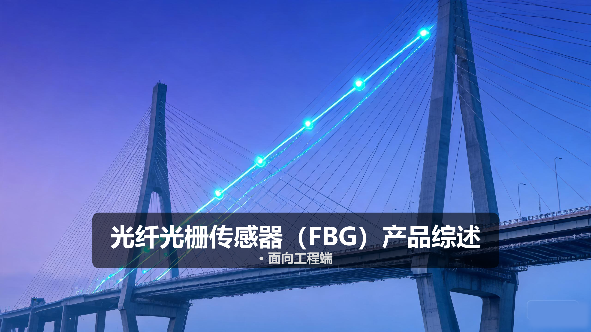
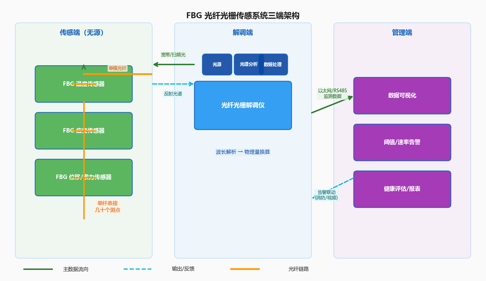
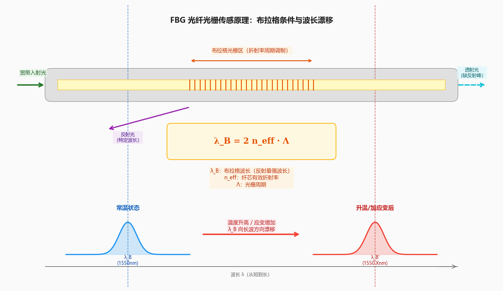
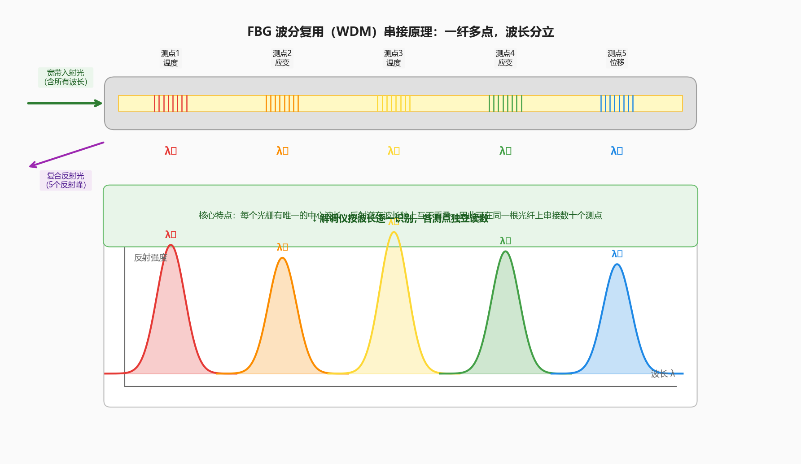

# 光纤光栅传感器（FBG）产品综述

> **产品**：光纤光栅传感器（FBG, Fiber Bragg Grating） ｜ **日期**：2026 年 10 月 ｜ **角度**：面向工程端 · 选型与落地视角

光纤光栅传感器把温度、应变、位移等物理量编码进光的波长里——一根光纤上串接几十个甚至上百个光栅测点，每个光栅都有自己的「光学指纹波长」，物理量变化时波长同步漂移，解调仪读出波长就得到了各点的测量值。这篇文章从产品设计方案、核心参数与选型、技术原理、应用场景、实际案例到市场与竞争，完整拆解 FBG 传感系统为什么值得投入，以及工程上怎么选、怎么布、怎么验收。

**一句话结论：** FBG 不是「一根光纤测一个点」，而是「一根光纤串起几十个高精度测点」——每个光栅都是一只独立的准数字传感器，波长编码天然抗干扰、可串联复用、长期稳定性好，是桥梁、隧道、电力、管道等场景下结构健康监测与关键点位测温的高精度底座。

> 文章封面：FBG 传感光栅串沿桥梁结构布设，解调仪实时读取各点波长变化，隐喻「一串光栅、多点精测」。示意图。

---

## 〇 一句话定位

**光纤光栅传感器 = 光纤上刻写的周期性折射率调制（光栅）→ 物理量引起波长漂移 → 解调仪读取波长并换算为测量值的准分布式传感系统**，输出的是「一串离散测点的高精度物理量」，而不是沿线连续分布。

系统由三端构成，各自独立承担物理感知、信号解调与智能呈现，又紧密协作：

- **FBG 传感光栅串**：沿被测对象布设的光纤上刻写一系列布拉格光栅，每个光栅对应一个测点，全程无源、可串接复用。
- **光纤光栅解调仪**：向光纤发射宽带或扫频光，接收反射光谱并解析各光栅的波长，实时换算为温度/应变/位移等物理量。
- **结构监测平台**：呈现各测点的实时数据与历史曲线，按阈值与变化速率告警，联动视频或其他子系统。

相比在每个点位布放一只电学传感器并拉电缆，FBG 的价值在于把「点测」从「每点一根线」变成「一串点一根光纤」——几十个测点共享一根光纤、一套解调设备，全程无源免供电，在强电磁、易燃易爆、远距离等场景下优势显著。

---

## 一、产品设计方案

### 1.1 系统架构：三端结构

工程选型时通常先定「测点数量和分布」，再据此反推光栅串接方案、解调仪通道数与监测平台能力。

| 层 | 角色 | 典型设备 | 一句话职责 |
| --- | --- | --- | --- |
| 传感端 | 各测点物理量感知 | FBG 温度传感器 / 应变传感器 / 位移传感器 | 无源、高精度、可串接 |
| 解调端 | 把光波长变成物理量 | 光纤光栅解调仪（静态/动态） | 发射光、测波长、算物理量 |
| 管理端 | 呈现与处置 | 结构健康监测平台 | 数据呈现、阈值告警、趋势分析 |

*图：FBG 三端架构——传感光栅串沿被测对象布设，解调仪读取各光栅波长，监测平台呈现与告警。*

### 1.2 主要产品形态

FBG 传感器按测量参量与封装形态分类，选型先确定测什么、装在哪：

| 类别 | 测量参量 | 典型封装 | 典型场景 |
| --- | --- | --- | --- |
| FBG 温度传感器 | 温度 | 不锈钢管封装 / 陶瓷封装 | 电缆接头、开关柜、变压器测温 |
| FBG 应变传感器 | 表面应变 / 内部应变 | 表面粘贴式 / 埋入式 | 桥梁、建筑、隧道结构应变 |
| FBG 位移传感器 | 位移 / 沉降 | 悬臂梁式 / 拉杆式 | 边坡、隧道、地基沉降 |
| FBG 压力传感器 | 压力 / 液位 | 膜片式 / 波纹管式 | 管道压力、油罐液位 |
| FBG 加速度传感器 | 振动 / 加速度 | 悬臂梁质量块式 | 结构振动、地震监测 |
| 准分布式串 | 多测点同参量 | 串接式光缆 / 测斜链 | 长距离结构多点监测 |

工程端最常见的是温度型与应变型，两者也经常组合使用——应变传感器配温度传感器做温度补偿，消除温度对应变测量的交叉敏感。

### 1.3 设计要点与差异化卖点

- **波长编码，天然抗扰**：测量信息编码在光波长上，不受光纤损耗起伏、光源功率波动的影响，长距离传输也不损失精度。
- **波分复用，一纤多点**：每个光栅有不同的中心波长（如 1525–1565 nm 范围内按间隔分配），一根光纤上可串接数十到上百个测点。
- **全光无源，本征安全**：传感端不含任何电子元器件，无需供电，适用于防爆、强电磁、高电压等恶劣环境。
- **长期稳定性好**：光纤光栅的材料特性稳定，在合理使用条件下寿命可达 20 年以上，适合长期结构健康监测。
- **精度与分辨率高**：温度分辨率可达 0.1°C 以下，应变分辨率可达 1 微应变（με）量级，远高于多数电学传感器。

### 1.4 设计中的工程约束

- **串接数量受带宽限制**：单通道可用波长窗口（如 C 波段 40 nm）除以单光栅占用带宽（如 1 nm 加保护间隔）决定最大串接数，典型 20–80 点/通道。
- **链路损耗预算**：每个光栅有插入损耗（约 0.1–0.3 dB/个），加上熔接损耗（约 0.1 dB/点）与光纤损耗（约 0.2 dB/km），总损耗须在解调仪动态范围内。
- **温度交叉敏感**：FBG 对应变和温度都敏感，纯应变测量必须配温度补偿光栅，否则温漂会显著影响应变读数。
- **安装工艺要求高**：应变传感器的粘贴/焊接质量直接影响测量精度与长期可靠性，对施工工艺有明确规范。

---

## 二、核心参数与选型

工程端选型的第一落点是「先算再选」：先回答测什么、多少个测点、布在哪里、精度要求多高，再匹配传感器类型、解调仪通道数与波长资源。下面给出快捷口径与参数对照（数值为工程通用区间示例、行业通用基准）。

**选型核算速记**

- 所需通道数 × 单通道最大光栅数 ≥ 测点总数 ×（1 + ≥15% 余量）
- 单通道光栅数 ≈ 可用波长带宽 /（单光栅 3dB 带宽 + 保护间隔），例如 40 nm / (0.5 nm + 0.5 nm) ≈ 40 个
- 总链路损耗 ≤ 解调仪接收动态范围（典型 20–40 dB），留 3–5 dB 余量
- 应变测量必须配置温度补偿光栅，补偿比至少 1:10（每 10 只应变光栅配 1 只温度补偿光栅）

### 2.1 选型关键指标

| 指标 | 工程含义 | 典型区间 / 基准 |
| --- | --- | --- |
| 中心波长 | 光栅的布拉格波长（即「光学指纹」） | 1525–1565 nm（C 波段最常用） |
| 反射率 | 光栅对中心波长的反射强度 | 30%–90%，串接多选低反射率（<50%）避免多次反射 |
| 3dB 带宽 | 反射谱的半高全宽，决定波长分辨率 | 0.1–0.5 nm |
| 温度灵敏度 | 每度温度变化引起的波长漂移 | ~10 pm/°C（裸光纤），封装后依封装材料 |
| 应变灵敏度 | 每微应变引起的波长漂移 | ~1.2 pm/με（裸光纤 1550 nm 波段） |
| 测量精度 | 与真值的偏差 | 温度 ±0.1–±0.5°C；应变 ±1–±5 με |
| 分辨率 | 可分辨的最小变化量 | 温度 0.01–0.1°C；应变 0.1–1 με |
| 采样频率 | 每秒采集次数 | 静态 1–10 Hz；动态可达 kHz 级 |
| 单通道光栅数 | 一根光纤上最多串接的光栅数 | 20–80 个（依波长窗口与带宽） |
| 通道数 | 解调仪可接光纤路数 | 1 / 2 / 4 / 8 / 16 |

> 说明：以上区间综合多家厂商公开资料（长飞、武汉理工光科、聚华光等）与行业通用基准汇总，具体数值以厂商规格书与现场标定为准。

### 2.2 解调仪参数

| 参数项 | 说明 | 工程关注点 |
| --- | --- | --- |
| 波长范围 | 可解调的波长窗口 | C 波段（1525–1565 nm）最主流 |
| 波长精度 | 波长测量的绝对准确度 | ±1–±5 pm（直接决定物理量精度） |
| 波长分辨率 | 可分辨的最小波长变化 | 0.1–1 pm |
| 扫描频率 | 每秒全波段扫描次数 | 1 Hz–数 kHz，动静态差异大 |
| 通道数 | 可接入光纤路数 | 多通道可并行采集，摊薄单测点成本 |
| 动态范围 | 可处理的反射光强范围 | 20–40 dB，决定最大串接数与距离 |
| 接口 | 数据输出方式 | 以太网 / RS485 / USB，支持 Modbus、MQTT 等 |
| 供电 | 工作电压与功耗 | DC 12V / 24V，功耗 5–30 W |
| 工作温度 | 解调仪环境温度范围 | -10~50°C（室内型），-40~70°C（工业型） |

### 2.3 工程对接踩坑点

| 坑点 | 现象 | 规避方法 |
| --- | --- | --- |
| 熔接损耗过大 | 部分光栅信号弱、甚至测不到 | 严格执行熔接工艺规范，每点熔接损耗控制在 0.1 dB 以内 |
| 温度交叉敏感 | 应变读数随环境温度漂移 | 必须配置温度补偿光栅，使用差分算法扣除温度影响 |
| 安装引入残余应力 | 初始波长偏差大、零点漂移 | 严格按工艺安装，安装后做初始波长标定 |
| 波长资源冲突 | 不同光栅波长重叠，无法区分 | 规划波长分配表，相邻光栅波长间隔留足余量（≥ 2 倍 3dB 带宽） |
| 光纤弯曲损耗 | 小半径弯曲导致信号衰减 | 弯曲半径不小于 30 mm（铠装光缆可放宽） |
| 长期蠕变与老化 | 粘贴式传感器几年后数据漂移 | 选高温固化胶或焊接方式，关键结构优先选焊接式传感器 |

---

## 三、技术原理

### 3.1 光纤光栅基础：布拉格条件

光纤光栅的核心是一段光纤的纤芯折射率被周期性调制——用紫外激光通过相位掩模或逐点写入的方式，在纤芯中「刻」出一段折射率高低交替的周期结构。这段结构就像一面「只反射特定波长的镜子」。

布拉格条件描述了反射波长与光栅周期的关系：

**λ_B = 2n_eff · Λ**

其中：
- λ_B 是布拉格波长（即反射最强的波长）
- n_eff 是纤芯的有效折射率
- Λ 是光栅周期

当温度或应变变化时，光栅周期 Λ 和有效折射率 n_eff 都会随之变化，导致布拉格波长 λ_B 漂移——这就是 FBG 能感知物理量的根本原因。

*图：FBG 光栅结构与布拉格反射——宽带光入射后，只有布拉格波长被反射回来；温度/应变变化时，反射波长同步漂移。*

### 3.2 温度与应变感知机制

FBG 对温度和应变都敏感，这是它的优势也是它的挑战——两种物理量都会引起波长漂移，需要通过封装设计或补偿方案来区分。

**温度引起波长漂移的原因：**
1. 热膨胀效应：温度升高使光栅周期 Λ 变大
2. 热光效应：温度升高使纤芯折射率 n_eff 变大

两者叠加，裸光纤的温度灵敏度约为 10 pm/°C（1550 nm 波段）。通过不同的封装材料（如不锈钢、陶瓷、有机材料）可以放大或调节温度灵敏度。

**应变引起波长漂移的原因：**
1. 弹光效应：轴向应变改变纤芯折射率 n_eff
2. 几何效应：应变使光栅周期 Λ 伸长

裸光纤的应变灵敏度约为 1.2 pm/με（1550 nm 波段）。通过特殊的增敏结构（如基体放大、杠杆结构）可以将应变灵敏度提高数倍到数十倍。

### 3.3 波分复用与串接原理

一根光纤上为什么能串接几十个 FBG 传感器？答案是**波分复用（WDM）**。

每个光栅被设计成不同的中心波长（如 1530 nm、1532 nm、1534 nm……），它们的反射谱在波长轴上互不重叠。解调仪向光纤发射宽带光，每个光栅反射自己的中心波长，返回的复合光谱中包含了所有光栅的波长信息。通过光谱分析，就能逐一读出每个光栅的当前波长，也就得到了对应测点的物理量。

*图：FBG 波分复用原理——多个不同中心波长的光栅串接在同一根光纤上，反射光谱在波长轴上分立，解调仪逐一识别。*

### 3.4 解调技术路线

读取 FBG 波长的方法有多种，各有优劣，选型时需根据精度、速度、成本综合考量：

| 解调方案 | 原理 | 精度 | 速度 | 成本 | 适用场景 |
| --- | --- | --- | --- | --- | --- |
| 光谱仪法 | 用光栅光谱仪直接测反射谱 | 高 | 慢 | 高 | 实验室标定、高精度测量 |
| 扫描激光器法 | 窄线宽激光器逐波长扫描，找反射峰值 | 很高 | 中 | 高 | 高精度静态监测 |
| 可调谐滤波器法 | 用 F-P 滤波器扫频，检测反射峰值 | 中高 | 中 | 中 | 工业级通用方案 |
| 边缘滤波法 | 用线性滤波器把波长变化转为光强变化 | 中 | 快 | 低 | 动态测量、低成本方案 |
| 阵列波导光栅法 | AWG 多通道并行解调 | 中 | 快 | 中 | 多通道高速动态监测 |

工程应用中，可调谐滤波器法（F-P 解调）是性价比最高的主流方案，兼顾精度、速度与成本。

---

## 四、产品功能与差异化

### 4.1 核心功能

- **高精度测量**：温度测量精度 ±0.1°C 级，应变测量精度 ±1 με 级，分辨率更高一个量级。
- **多点串接复用**：单根光纤串接几十个测点，大幅减少布线数量与成本，尤其适合长距离、多点位的线性监测对象。
- **全光无源传感**：现场无需供电、无电子元件，适应防爆、强电磁、高湿、腐蚀等恶劣环境。
- **长期稳定性**：光纤材料化学性质稳定，光栅在合理使用下寿命长，适合桥梁、大坝等需要十年以上监测的工程。
- **绝缘与抗扰**：光纤本征绝缘，不受雷电、高压电磁场干扰，特别适合电力、轨道交通等强电场景。

### 4.2 差异化优势对比

**FBG vs 传统电学传感器（应变片、热电偶等）：**

| 对比项 | FBG 传感器 | 电学传感器 |
| --- | --- | --- |
| 信号形式 | 光波长（数字式编码） | 电压/电阻（模拟量） |
| 抗电磁干扰 | 完全免疫 | 易受干扰，需屏蔽 |
| 串接能力 | 一纤几十点 | 每点单独布线 |
| 现场供电 | 不需要（无源） | 需要 |
| 长期稳定性 | 好（20 年级） | 一般（漂移、老化） |
| 单测点成本 | 较高 | 较低 |
| 解调设备成本 | 较高（共享） | 低（分散） |

**FBG vs 分布式光纤传感（DTS/BOTDA 等）：**

| 对比项 | FBG 准分布式 | 分布式光纤传感 |
| --- | --- | --- |
| 测量方式 | 离散点测 | 沿线连续 |
| 单点精度 | 高（±1 με / ±0.1°C） | 中（±10 με / ±1°C） |
| 空间分辨率 | 由光栅间距决定，可小到厘米级 | 米级（典型 0.5–2 m） |
| 测点密度 | 有限（几十到上百点/纤） | 连续（每米一个采样点） |
| 响应速度 | 快（kHz 级动态解调） | 慢（秒到分钟级） |
| 适用场景 | 关键点位高精度监测 | 长距离沿线连续监测 |

简单说：FBG 是「少而精的点」——测点少但每个点精度高、响应快；分布式光纤是「多而广的线」——覆盖全但精度和速度有限。两者经常组合使用：分布式光纤做沿线普查和预警，FBG 在关键点位做精确定量监测。

### 4.3 增强能力

- **温度补偿与多参量融合**：通过在同一测点部署温度+应变双光栅，或使用特殊封装的双参量传感器，实时扣除温度干扰，输出真实的应变量。
- **智能诊断与自校准**：解调仪内置参考光栅（恒温槽内的标准波长参考），自动校准波长漂移，保证长期测量准确性。
- **边缘计算与本地告警**：部分高端解调仪支持本地阈值告警、变化率告警，不依赖上位机即可触发继电器输出。
- **组网与云平台**：支持 Modbus、MQTT、OPC UA 等工业协议，可接入 SCADA、结构健康监测云平台，实现多站点集中管理。

---

## 五、应用场景

### 5.1 桥梁结构健康监测

**痛点**：大跨度桥梁（斜拉桥、悬索桥、连续刚构桥）的关键构件（主梁、索塔、拉索、支座）在车辆荷载、温度变化、风振、地震等作用下的应力应变状态需要长期监测，人工巡检频次有限、数据不连续，难以发现渐进式损伤。

**方案**：在桥梁关键截面布设 FBG 应变传感器和温度传感器，一根光纤串接多个测点，解调仪放置在桥梁控制室，实时监测各构件的应变分布与温度场。结合桥梁有限元模型，可评估结构健康状态、预警异常变形。

**价值**：
- 关键点位高精度应变监测（±1 με 级），捕捉微小结构变化
- 全光无源，无需在桥上布设电缆，防雷击、抗干扰
- 长期稳定，与桥梁同寿命（20 年以上），减少后期维护
- 数据连续，为结构安全评估和寿命预测提供可靠依据

### 5.2 电力电缆接头在线测温

**痛点**：高压电缆接头是电力线路最薄弱的环节，接触电阻过大、绝缘老化等问题会导致接头过热，严重时引发火灾或爆炸。传统巡检靠红外测温仪定期测量，无法实时掌握温度变化，存在漏检风险。

**方案**：在每个电缆接头处安装 FBG 温度传感器，沿电缆线路串联，解调仪放置在变电站或环网柜内，24 小时实时监测各接头温度。温度超过阈值或升温速率过快时自动告警。

**价值**：
- 全光无源、本征绝缘，在高压环境下绝对安全
- 实时在线监测，毫秒级响应（取决于解调频率），及时发现过热隐患
- 一根光纤可串接几十个接头，布线简洁、成本可控
- 不受电磁干扰，在变电站强电磁场环境下稳定工作

### 5.3 隧道与边坡位移监测

**痛点**：隧道施工期与运营期的围岩变形、边坡滑移是重大安全隐患。传统监测手段（收敛计、测斜仪）多为人工读数，频率低、数据滞后，难以满足安全预警需求。

**方案**：在隧道拱顶、边墙布设 FBG 位移/沉降传感器，在边坡埋设 FBG 测斜管，实时监测围岩变形和边坡深部位移。数据接入监测平台，设置多级预警阈值。

**价值**：
- 高精度位移监测（分辨率可达 0.01 mm），及早发现变形趋势
- 可远距离传输，适合山区、偏远地区的长隧道和高边坡
- 全光无源，隧道内防爆、抗电磁干扰
- 自动化连续监测，减少人工巡检成本与风险

### 5.4 油气管道应变监测

**痛点**：长输油气管道跨越复杂地质条件区域（活动断裂带、滑坡区、采空区），地质灾害会导致管道变形甚至断裂。传统开挖检测周期长、成本高，无法实时掌握管道应变状态。

**方案**：在管道高风险段外壁安装 FBG 应变传感器和温度传感器，沿管道串联，解调仪放置在阀室或监控站。实时监测管道轴向与环向应变，评估管道受力状态。

**价值**：
- 全光无源、防爆，在油气环境下安全可靠
- 高精度应变监测，提前预警管道塑性变形风险
- 长距离串接，单通道覆盖数公里管道段
- 长期稳定，免维护，适合野外无人值守环境

---

## 六、实际案例与设计方案

### 案例 A：大跨度桥梁结构健康监测

**需求**：某主跨 300 m 的斜拉桥需要建立结构健康监测系统，监测内容包括主梁关键截面应变、索塔倾斜、拉索索力、环境温度。共需应变测点 60 个、温度测点 20 个、位移测点 8 个，要求长期在线、数据精度高、系统可靠。

**方案设计**：
- 主梁：在 5 个关键截面上下缘各布设 6 只 FBG 应变传感器 + 2 只温度传感器（用于温度补偿），共 40 只应变 + 10 只温度
- 索塔：在塔柱两侧布设 FBG 应变/倾斜传感器，共 20 只应变 + 8 只温度
- 拉索：采用 FBG 索力传感器（基于振动频率法或应变法），共 8 只
- 解调仪：选用 4 通道静态解调仪（波长范围 1525–1565 nm，波长精度 ±2 pm，采样率 1 Hz）
- 通信：光纤直连桥梁控制室监测平台，支持远程访问

**配置核算**：
- 总测点：60 应变 + 20 温度 + 8 位移/索力 = 88 个 FBG 光栅
- 通道分配：通道 1（主梁应变 40 + 温度 10 = 50 点）→ 超出单通道容量，分两通道
- 调整：通道 1（主梁 30 应变 + 6 温度）、通道 2（主梁 10 应变 + 4 温度 + 索塔 10 应变 + 4 温度）、通道 3（索塔 10 应变 + 4 温度 + 索力 8）、通道 4（备用 + 扩展）
- 链路损耗估算：每个光栅插入损耗 0.2 dB × 平均 25 点/通道 = 5 dB；熔接损耗 0.1 dB × 10 点 = 1 dB；光纤损耗 0.2 dB/km × 2 km = 0.4 dB；总损耗约 6.4 dB，远低于解调仪 30 dB 动态范围，余量充足
- 波长分配：按 1 nm 间隔分配，单通道 25 点占用 25 nm，40 nm 窗口余量充足

**交付价值**：
- 全桥关键点位高精度应变与温度实时监测，数据精度 ±1 με / ±0.2°C
- 全光无源系统，桥上无任何电气设备，防雷击、免维护
- 数据接入桥梁健康监测平台，支持趋势分析、阈值告警、报表生成
- 预留扩展通道，后期可增加测点

### 案例 B：高压电缆接头在线测温

**需求**：某 110 kV 电缆线路长 5 km，共 30 个中间接头，需要实时监测每个接头的运行温度，超温自动告警。要求系统绝缘安全、免维护、寿命长。

**方案设计**：
- 传感器：每个接头安装 2 只 FBG 温度传感器（上下两侧各一只，取最大值），共 60 只
- 解调仪：选用 2 通道 FBG 解调仪（波长范围 1525–1565 nm，波长精度 ±5 pm，采样率 2 Hz）
- 光缆：沿电缆沟敷设单模铠装光缆，与传感光纤熔接
- 告警：本地声光告警 + 远程平台告警，两级阈值（预警 70°C、告警 90°C）
- 通信：以太网接入变电站监控系统

**配置核算**：
- 总测点：60 只温度 FBG
- 通道分配：每通道 30 只，两通道
- 单通道损耗：0.2 dB × 30（光栅）+ 0.1 dB × 15（熔接点）+ 0.2 dB/km × 5 km（光纤）= 6 + 1.5 + 1 = 8.5 dB
- 解调仪动态范围 25 dB，余量约 16.5 dB，充足
- 波长间隔：30 只 × 1 nm = 30 nm，40 nm 窗口余量 10 nm，可接受

**交付价值**：
- 30 个接头 60 个测点 24 小时实时测温，精度 ±0.3°C
- 全光无源、本征绝缘，与高压电缆同沟敷设安全可靠
- 超温分级告警，响应时间 < 5 秒
- 系统寿命 > 15 年，免维护，大幅减少人工巡检成本

### 工程落地核算检查清单

| # | 检查项 | 标准 / 要求 | 核对结果 |
| --- | --- | --- | --- |
| 1 | 测点清单完整 | 每类参量有明确数量和位置 | ☐ |
| 2 | 通道数与单通道光栅数匹配 | 通道数 × 单通道容量 ≥ 总点数 × 1.15 | ☐ |
| 3 | 波长分配表已规划 | 各光栅中心波长不重叠，间隔 ≥ 2×3dB 带宽 | ☐ |
| 4 | 链路损耗在预算内 | 总损耗 ≤ 解调仪动态范围 − 5 dB 余量 | ☐ |
| 5 | 温度补偿方案明确 | 应变测量已配温度补偿光栅 | ☐ |
| 6 | 安装工艺有规范 | 粘贴/焊接/埋设工艺有明确作业指导书 | ☐ |
| 7 | 解调仪安装环境达标 | 温湿度、供电、防护等级满足要求 | ☐ |
| 8 | 通信链路已确认 | 光纤/网络/协议与上位机匹配 | ☐ |
| 9 | 初始标定方案确定 | 安装后有波长初始值记录与标定流程 | ☐ |
| 10 | 备品备件充足 | 关键传感器、熔接备件按 5%–10% 备料 | ☐ |

---

## 七、市场背景与竞争格局

### 7.1 行业规模与驱动因素

光纤光栅传感是光纤传感领域的重要分支，受益于结构健康监测、智能电网、智慧交通、油气管道等领域的快速发展。

**主要驱动因素：**
- **基础设施老化与安全需求**：桥梁、隧道、大坝等大型基础设施进入运维期，结构健康监测需求持续增长
- **智能电网建设**：电力设备在线监测、电缆测温、变电站智能运维推动 FBG 传感器应用
- **政策与标准推动**：安全生产、防灾减灾相关政策要求加强结构安全监测能力建设
- **技术成熟与成本下降**：FBG 制备工艺成熟，解调设备成本逐年降低，经济性提升

> 说明：市场规模数据因统计口径不同差异较大，全球光纤传感市场规模行业估算在数十亿美元量级，FBG 约占其中 20%–30%。具体数据请以权威机构报告为准。

### 7.2 竞争格局

**国外厂商**：
- **美国 Luna Innovations**：FBG 解调仪与传感器领域技术领先，产品覆盖科研与工业领域
- **加拿大 Micron Optics（已被 Luna 收购）**：早期 FBG 解调技术标杆，sm125/sm130 系列应用广泛
- **德国 FBGS**：专注 FBG 传感器制造， draw tower grating（拉丝塔光栅）技术特色鲜明
- **日本 Fujikura / 安立**：在光纤元器件与测量仪器领域有深厚积累

**国内厂商**：
- **武汉理工光科**：国内光纤传感龙头，依托武汉理工大学技术积累，产品覆盖桥梁、隧道、电力等领域
- **长飞光纤光缆**：光纤行业龙头，FBG 传感器与解调仪产品线逐步完善
- **聚华光**：专注 FBG 解调技术，工业级解调仪产品性价比突出
- **深圳中航信息**：在结构健康监测领域有系统集成能力
- **多家高校孵化企业**：依托高校科研成果，在细分领域各有特色

总体来看，高端解调仪核心技术仍有部分依赖进口，但国内厂商进步迅速，在中低端市场和系统集成领域已占据主导地位，高端市场进口替代正在加速。

### 7.3 技术路线对比

在结构健康监测与温度监测领域，存在多条技术路线，各有适用场景：

| 技术路线 | 优势 | 劣势 | 最佳适用场景 |
| --- | --- | --- | --- |
| FBG 光纤光栅 | 高精度、可串接、无源抗扰、长期稳定 | 单测点成本较高、测点数量有限 | 关键点位高精度监测 |
| 分布式光纤（DTS/BOTDA） | 长距离连续覆盖、成本低（每米） | 精度一般、响应慢 | 长距离沿线普查预警 |
| 电学应变片/热电偶 | 成本低、技术成熟 | 易受干扰、需供电、长期漂移 | 短期测试、小规模应用 |
| 无线传感网络 | 安装灵活、无需布线 | 供电受限、可靠性一般、成本分散 | 临时监测、难布线场景 |
| 机器视觉/摄影测量 | 非接触、大面积 | 精度有限、受环境影响大 | 外观变形观测、短期试验 |

工程实践中，往往是多种技术组合使用——用分布式光纤做沿线预警，用 FBG 在关键断面做精确定量，用视频做可视化复核，形成多层次监测体系。

---

## 八、商业模式与趋势

### 8.1 交付形态

FBG 传感系统的交付形态主要有三种：

1. **硬件销售模式**：直接销售 FBG 传感器 + 解调仪 + 配套软件，客户自行安装或委托第三方施工。适用于有技术能力的集成商或大型业主。
2. **系统集成模式**：厂商提供从方案设计、产品供应、安装调试到平台部署的一体化服务。适用于桥梁、隧道等大型结构健康监测项目。
3. **运维服务模式**：在系统交付后，提供长期的数据服务、设备维护、健康评估等增值服务。按月/按年收费，正在成为新的增长点。

### 8.2 盈利模式

- **硬件销售利润**：传感器和解调仪的销售毛利，是当前主要收入来源
- **系统集成毛利**：方案设计、安装调试、软件开发等服务收入
- **运维与数据服务**：长期订阅制收入，毛利率高、可持续性强
- **定制开发收入**：针对特殊应用场景的定制传感器和专用解调方案

### 8.3 发展趋势

**趋势一：多参量融合与智能化**
- 单一温度或应变测量向温度、应变、位移、振动、压力多参量融合发展
- 结合 AI 算法，从数据测量走向健康诊断、寿命预测

**趋势二：解调技术不断升级**
- 高速动态解调（kHz 乃至 MHz 级）满足振动、冲击测量需求
- 集成化、芯片化解调方案降低成本，推动 FBG 向更多场景渗透

**趋势三：边缘计算与云平台结合**
- 解调仪内置边缘计算能力，本地完成数据预处理、特征提取、初级告警
- 云平台实现多站点集中管理、大数据分析、远程诊断

**趋势四：应用场景持续拓展**
- 从传统的桥梁、隧道、电力向风电叶片、海洋工程、航空航天、医疗等高端领域延伸
- 成本下降推动 FBG 从中高端市场向中低端市场下沉

**趋势五：国产替代加速**
- 国内 FBG 制备和解调技术日趋成熟
- 关键核心器件国产化率提升，成本持续下降
- 在国内重大工程中，国产 FBG 系统的应用比例不断提高

---

*本文为产品综述性质文章，文中参数为行业通用基准与工程估算，具体选型请以厂商规格书与实际测试为准。*
