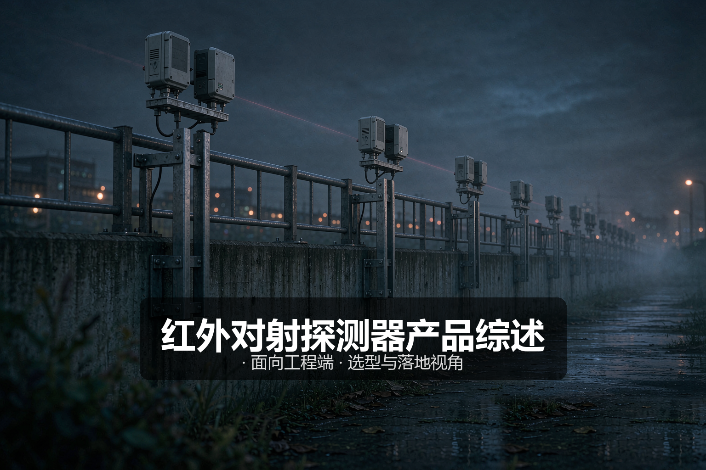
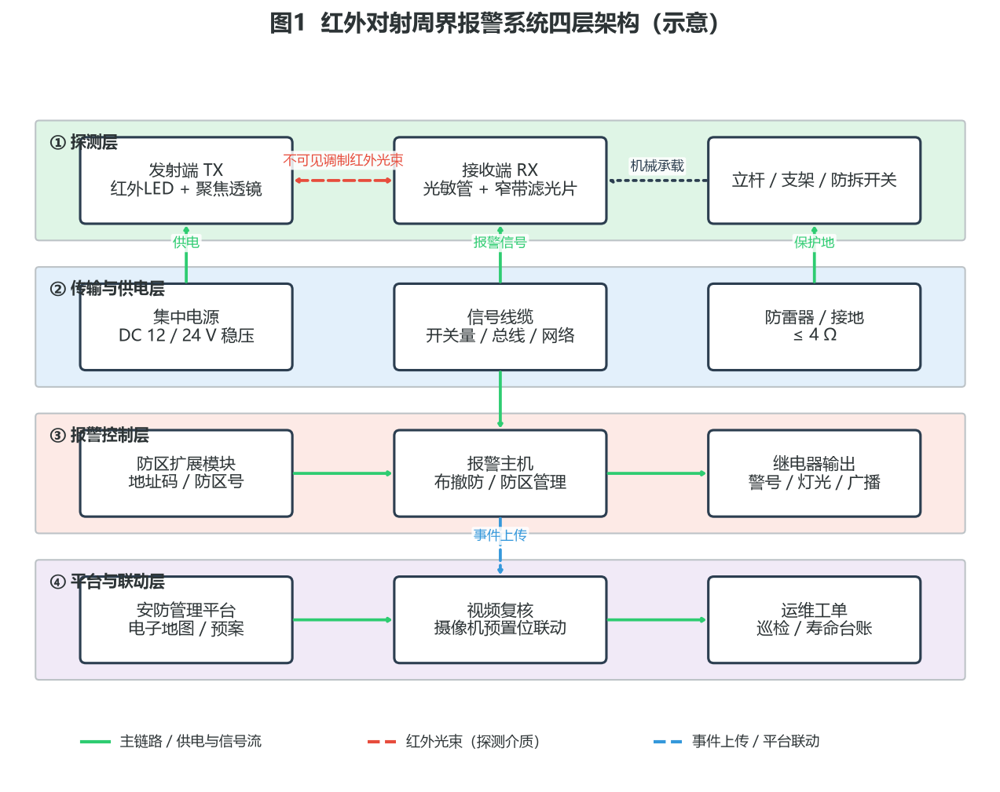
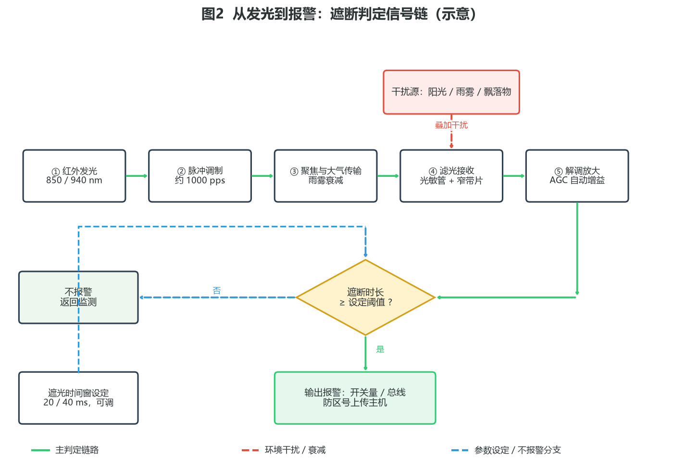
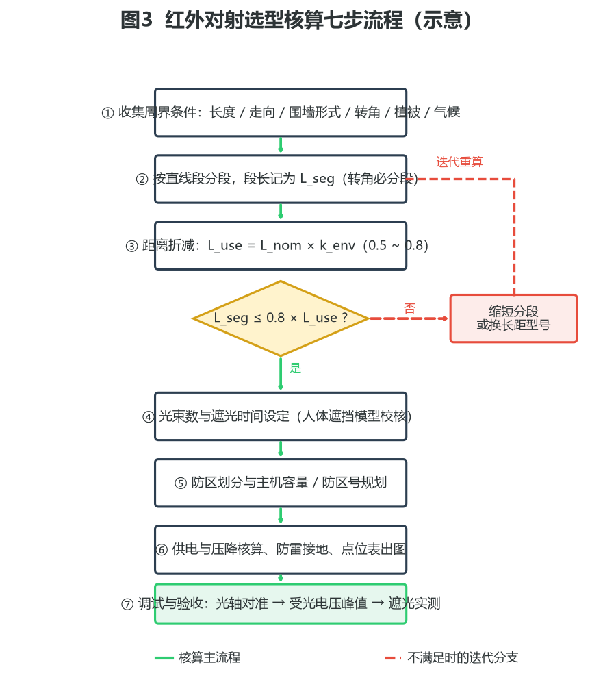
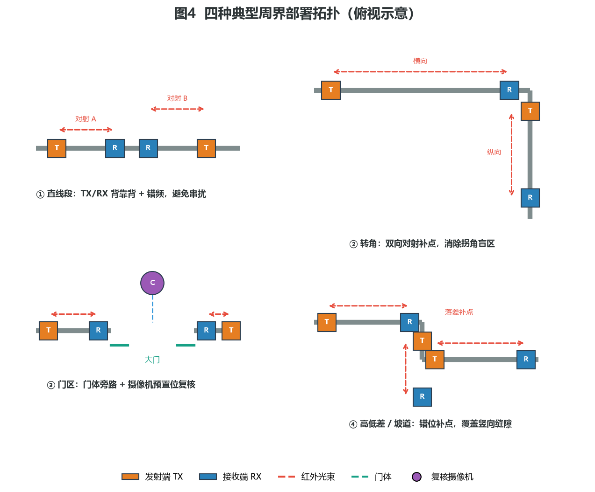

# 红外对射探测器产品综述：一道不可见光束，划出周界第一道警戒线

> 面向工程端 · 选型与落地视角

---

## 〇、一句话定位

**红外对射探测器（主动红外入侵探测器）用一对肉眼不可见的调制红外光束，在围墙、栅栏、门洞之间拉出一条无形的警戒线，光束被遮断即报警。** 它是周界安防里最经典、最便宜、也最「看人下菜」的线型探测方案：装对了地方，误报率可以做到极低、常年无感运行；装错了地方，一片树叶、一场大雾都能让值班室夜夜灯火通明。

工程端看红外对射，核心不是数它有几束光，而是**先把周界长度、分段方式、环境折减、光束数、防区划分、供电压降这六笔账算清楚**，再决定买什么距离档、什么光束数、装在墙顶还是墙侧。本文面向工程 / 实施端，覆盖产品设计方案、核心参数与选型、技术原理、产品功能与差异化、应用场景、落地案例与配置核算、市场背景与竞争格局、商业模式与趋势共八章。除明确标注来源的引用外，文中参数均按**行业通用基准 / 工程估算**给出，用于方案评估与教学，不作为某一具体型号的宣称指标。

---

## 一、产品设计方案

### 1.1 系统定位与四层架构

红外对射从来不是一台孤立的「盒子」，它在工程里交付的是一条完整的探测—传输—判定—联动链路。按工程视角拆开，一套红外对射周界报警系统分为四层：**探测层 → 传输与供电层 → 报警控制层 → 平台与联动层**。

四层分工：

- **探测层**：回答「光束怎么形成、谁来守护」。发射端 TX 内置红外发光二极管（典型波长 850 nm 或 940 nm，属近红外波段，人眼不可见）与聚焦透镜，把点光源收束成平行度较高的定向光束；接收端 RX 用光敏管加窄带滤光片还原光强信号；两者的机械基准由立杆、支架与防拆开关共同保证——光轴再准，支架一晃全白搭。
- **传输与供电层**：回答「电从哪来、信号往哪去」。探测器普遍采用 DC 12 V / 24 V 低压直流供电，多对设备由集中电源经 RVV 电源线供电；报警输出走 RVVP 屏蔽线的开关量（常开 / 常闭触点）或总线制地址码模块；室外布线必须配套防雷器与接地（接地电阻通常要求 ≤ 4 Ω，工程基准）。
- **报警控制层**：回答「谁来判定与处警」。报警主机按防区管理每一个对射，负责布撤防、防区旁路、报警确认与继电器输出；防区扩展模块把开关量信号转成地址码，接入总线。
- **平台与联动层**：回答「报了警之后干什么」。安防管理平台在电子地图上弹出防区位置，联动对应摄像机预置位做视频复核，并生成运维工单闭环。

这套架构里有一个工程上极容易被低估的点：**红外对射的探测性能有一半不在设备本身，而在机械与电气基础**。支架刚度、基础沉降、线缆压降、防雷接地，任何一环不达标，都会把一颗合格的探测器拖成一颗天天误报的探测器。

### 1.2 产品形态分类

红外对射的产品线按四个维度切分，工程选型时四个维度各选一个坐标，就能锁定品类：

**按光束数**：

| 类型 | 常见标称距离档（工程基准） | 典型用途 |
|---|---|---|
| 单光束 | 5 ~ 20 m | 室内门洞、仓库通道、临时警戒 |
| 双光束 | 20 ~ 100 m | 住宅小区矮围墙、别墅周界（主流） |
| 三光束 | 50 ~ 150 m | 厂区周界、变电站围栏 |
| 四光束 | 100 ~ 250 m | 园区长直围墙、高防护等级周界 |
| 六 / 八光束（红外栅栏 / 光墙） | 10 ~ 60 m 密集布束 | 重点部位立面封锁、防钻防爬 |

**按探测距离**：短距型（10 ~ 50 m）、中距型（50 ~ 200 m）、长距型（200 ~ 500 m）。注意这是**标称值**，工程使用必须折减（见 2.2 节）。

**按技术等级**：普通模拟型（成本低、抗干扰弱，逐步退出主流）、数字变频型（发射脉冲编码 + 多频点跳频，抗强光与串扰能力强，当前主流）、智能分析型（内置算法区分人体遮断与落叶、小动物的遮断特征，部分型号融合微波构成双鉴）。

**按结构与应用**：标准对射柱（分体两柱）、红外栅栏 / 光墙（多束密集排列成面）、防爆型（满足 GB 3836 系列防爆认证，用于油气化工危险区域）、室内型与室外型（环境适应性指标不同，见 2.1 节）。

### 1.3 关键设计要点

一套能长期稳定运行的红外对射系统，设计时要过五道关：

1. **光路通视关**：发射与接收之间必须全路径通视，光束面上不能有任何植被、飘落物路径与季节性遮挡。设计时按「成年树木未来三年的生长半径」预留净空，灌木区宁可绕开也不硬穿。
2. **光轴稳定关**：光束是「针尖对麦芒」的定向传输，支架必须用方形截面不锈钢或镀锌钢立杆（圆形杆易转动移位），基础埋深与混凝土浇筑按风载核算；安装后的光轴角度偏差一般要求控制在 ±2° 以内（工程基准）。
3. **环境适应关**：室外型必须 IP65 及以上防护等级，宽温工作，具备雨雾自动增益补偿与镜面防凝露设计；沿海、化工区域另加防盐雾防腐蚀要求。
4. **抗干扰关**：接收端避免正对太阳方位；多对并排安装采用「发射对发射、接收对接收」的背靠背布局；三对以上同场部署必须错开工作频率（调频 / 跳频），避免相邻对射串扰互触。
5. **防破坏关**：镜片被喷涂、遮挡、设备被挪位，都必须能主动报出故障或防拆信号，而不是等真正入侵时光路已经瞎了。防拆开关、光强自诊断、防遮挡报警是三条底线。

---

## 二、核心参数与选型

### 2.1 参数速查表

| 参数 | 典型值（工程基准） | 工程含义 |
|---|---|---|
| 工作波长 | 850 nm / 940 nm（近红外） | 940 nm 无红暴更隐蔽；850 nm 发射效率更高 |
| 调制方式 | 脉冲调制，约 1000 pps | 与环境光区分，天然抗阳光直射 |
| 遮断判定 | 遮光 ≥ 40 ms 判报警，≤ 20 ms 不判 | 依据 GB 10408.4-2000 的响应时间框架 |
| 环境光抗性 | ≥ 5000 ~ 100000 Lux 不误报（依型号） | 决定能否面向东 / 西朝阳安装 |
| 工作温度 | 室内型 -10 ~ +55 ℃；室外型 -25 ~ +70 ℃ | 依据 GB 10408.4 对室内 / 室外型的分级要求 |
| 防护等级 | 室外型 IP65 ~ IP66 | 防尘完全 + 防喷水 / 强喷水 |
| 振动 / 冲击 | 10 ~ 55 Hz、振幅 0.75 mm；冲击室内 15 g、室外 30 g | GB 10408.4 环境试验要求量级 |
| 报警输出 | 干接点 NO / NC 可选；总线地址码 | 对接报警主机的通用接口 |
| 供电 | DC 12 ~ 24 V，发射 / 接收端各数十至数百 mW | 低压供电，长距离需核算压降 |
| 光束发散角 | ≤ 3°（工程基准） | 决定远距离对准难度与反射规避距离 |

### 2.2 第一笔账：距离折减

红外对射的标称距离是「理想天气下」的数字，工程使用必须连打三道折：

- **标准裕量**：GB 10408.4-2000 对室外型探测器要求其在恶劣天气下仍能正常工作，行业通行口径是室外型最大探测距离应不低于标称值的数倍能力储备；据此衍生的行业共识是——**实际使用距离 ≤ 标称值的 70%**。例如标称 300 m 的对射，实际用于 ≤ 240 m 的围墙段（按更保守口径 70% 即 210 m）。
- **环境系数**：在 70% 行规之上，再按区域气候乘一个折减系数 k_env（工程估算口径）：室内 0.8、北方干燥 0.7、中部地区 0.6、南方多雨多雾 0.5。
- **分段校核**：每个直线段的段长 L_seg 还应满足 **L_seg ≤ 0.8 × L_use**，其中 L_use = L_nom × k_env，给光轴偏移与镜面污损再留 20% 余量。

三道折算下来的结论很朴素：**标称 100 m 的双光束，在南方多雨地区实际只能守护约 40 m 的围墙段**。选型时永远用折算后的数字排点位，不要用铭牌数字。

### 2.3 第二笔账：光束数与人体遮挡模型

光束数的本质是一个「人体几何能否完全遮断」的问题。正常人体的遮挡截面大致为 500 mm（身宽）× 200 mm（身厚）（工程估算）。由此推出两个关键推论：

- **防漏报**：光束间距必须小于人体厚向截面，否则人侧身可以从两束光之间穿过。四光束设备的上部光束可能高于人体举手高度，单独使用时存在「遮不断全部光束反而漏报」的反直觉风险，因此围墙周界主流选双光束，四光束及以上用于需要更高触发概率的场合，且依赖「同时遮断 N 束才报警」的逻辑设定。
- **防误报的另一个维度——时间窗**：人奔跑速度按 10 m/s 计，身厚 0.2 m，最短遮断时间约 20 ms。GB 10408.4-2000 据此规定 ≤ 20 ms 的遮断不得报警、≥ 40 ms 的遮断应报警：小到 20 ms 内穿过的飞虫、落叶在时间窗内被滤掉，而人体无论快慢都逃不出窗口。部分型号把遮光时间做成 50 ~ 500 ms 可调，用于院子灌木多、鸟多的现场进一步压误报。

### 2.4 光束高度与安装位置设计

光束数定了之后，「装多高、离墙沿多远」是第二个决定成败的几何问题：

- **距墙沿水平间距**：光束面到围墙外侧沿口的水平距离建议 ≤ 30 cm（工程口径）——间距一大，人手脚着地翻越、贴墙慢翻就可能从墙沿与最低光束之间的缝隙钻过，探测线形同虚设。
- **双光束高度布置**：常规双光束垂直间距约 150 ~ 200 mm，整体光束组覆盖翻越姿态的躯干高度区间；下束不宜贴墙顶太近，避免墙面反光与积水飞溅干扰。
- **四光束及以上**：按「下束防钻越、上束防跨越」原则排布，最上一束一般不超过 1.5 m——超过人身能遮断的高度反而制造漏报窗口（呼应 2.3 节人体遮挡模型）。
- **地面 / 矮墙场景**：以人员奔跑 10 m/s 的最短遮断时间要求校核触发逻辑，必要时选支持 ≥ 20 ms 级触发的型号并单独调时间窗。
- **防攀爬附着物**：光束路径避开排水管、空调支架、借力凸缘等「现成梯子」，让探测线与实际入侵路径重合，而不是与设计图重合。

### 2.5 防区划分与主机容量

- 每一对（或每一组）对射占报警主机一个防区。防区划分粒度直接决定值班体验：**按 100 ~ 200 m 一个防区**划分，报警时保安能定位到「东围墙中段」；按整条围墙一个防区，报警时只能满围墙找。
- 主机容量按「实际防区数 × 1.3」预留扩展位；防区号规划建议与电子地图分区一致（如 01x = 东围墙、02x = 南围墙），后续平台配置与工单描述都受益。
- 长围墙直线段用长距对射减少对数，但**转角必须单独成段**——两个方向的墙属于不同光路，转角处不补点就是标准盲区。

### 2.6 供电与压降

低压直流供电最容易被忽视的是线路压降。铜芯线压降按 **ΔU = 2 × ρ × L × I / S** 核算（ρ ≈ 0.0175 Ω·mm²/m 为铜电阻率，L 为供电距离，I 为负载电流，S 为线径）。工程口径：末端设备电压不得低于额定下限（12 V 系统按 ≥ 11 V 核算）；**供电距离超过约 200 m 时应分段加装电源**，或提高供电电压 / 加大线径。

一笔示例核算：12 V 系统、末端一对双光束负载 0.15 A、供电距离 250 m、线径 1.0 mm²，ΔU = 2 × 0.0175 × 250 × 0.15 / 1.0 ≈ 1.31 V，已贴着 1 V 余量的红线——正确做法是改 2 × 0.75 mm² 以上线径并在 150 m 处加一台分段电源，而不是硬拉。

### 2.7 常见踩坑清单

1. **按标称距离排点位**——雨雾一来全线「半盲」，是最常见也最致命的错误。
2. **接收端正对太阳升起 / 落下方向**——清晨黄昏准时误报，每天两趟。
3. **相邻对射同频工作**——一对触发、隔壁跟触，串扰误报查不出来源。
4. **圆形细支架**——风一吹光轴偏移，冬天尤其频繁；要用方形截面杆并打防转定位。
5. **光束贴墙沿过近**——光束经墙面反射进入接收端，晴天墙面升温后误报加剧；对射与反射面保持足够间距（百米级对射工程口径 ≥ 0.75 m，或按发散角核算的 1.5 倍发散距离）。
6. **围墙转角不补点**——转角两侧是两条不同光路，共杆斜跨必然留盲区。
7. **植被不纳入运维**——春天装好秋天树长高了，光路被季节性遮挡，误报查不到头。
8. **电源不做防雷与接地**——一场雷雨烧一片探测器，接地电阻必须 ≤ 4 Ω 并年检。
9. **发射 / 接收端镜头长期不清洁**——鸟粪、灰尘、苔藓让受光电压缓慢下降，最终「隐性失明」。
10. **把遮光时间调到最短图灵敏**——落叶小鸟全进来，值班员第一周就把防区旁路了。
11. **四光束当双光束用**——人体遮不断上部光束导致漏报，逻辑设定必须与安装高度匹配。
12. **只装不调**——凭指示灯判断对准状态是拍脑袋，必须用受光电压 / 光强指示调到峰值再锁紧。

### 2.8 调试与验收规范

安装完成不等于交付完成，红外对射的调试有一套可量化的标准动作：

1. **粗对准**：借助瞄准孔 / 瞄准镜或激光辅助工具，把发射端与接收端视轴大致对齐；
2. **精对准**：观测接收端受光强度指示（LED 档位或万用表测感光电压），分别微调水平、垂直角度至指示峰值，再回退半格锁紧——峰值锁紧可容忍后续微量位移；
3. **全遮实测**：用不透光遮挡板完整遮挡全部光束，实测报警响应时间落在设定时间窗内（秒表 / 主机事件时标），并核对主机防区号、平台地图点位三者一致；
4. **半遮实测**：只遮挡单束，验证多光束逻辑（N 中取 M）符合设计——这一步专抓「四光束按双光束逻辑误配」的错误；
5. **工况复核**：分别在强光时段（东 / 西朝阳段选日出后一小时）、雨雾天各复核一轮受光电压，确认 AGC 补偿后裕度仍满足设计折减值；
6. **资料归档**：把每对对射的初始受光电压、防区号、安装高度、频率码写入点位表——这份表是日后运维「光强衰减趋势判断」的基线数据。

验收口径建议写入合同：**全遮必报（时间窗内）、单束不报（多束逻辑正确）、误报率满足月均指标、光强基线归档齐全**，四项全过才签收。

---

## 三、技术原理

红外对射的全部技术含量，可以拆成四层：物理基础、调制与解调、判定逻辑、环境自适应。逐层拆解如下。

### 3.1 第一层：红外辐射与大气传输（物理基础）

红外对射工作在近红外波段，典型波长 850 nm 与 940 nm——之所以选这两个点，是因为它们接近常用红外 LED 与光敏管的光谱响应峰值，且 940 nm 无可见红暴、隐蔽性更好。光在大气中传播遵循平方反比衰减，同时叠加大气吸收与散射：雨滴、雾滴的粒径与近红外波长同量级，**米氏散射造成的衰减随能见度恶化呈指数级上升**，这就是大雾天红外对射有效距离骤减的物理根源，也是 2.2 节距离折减的技术依据。

光学系统用发射端透镜把 LED 的朗伯型发光收束为发散角约 3° 以内的准平行光束，接收端再以对称透镜汇聚到光敏管。发散角是双刃剑：越小越省能量、越难对准；越大越容易对准、越容易受反射与串扰干扰。远距离型号普遍用大口径双透镜把发散角压到 1° 量级（工程基准）。

### 3.2 第二层：脉冲调制与解调（核心机制）

发射端不是连续发光，而是以约 1000 pps 的脉冲串驱动 LED：占空比低，瞬时峰值电流大、平均功耗小，LED 寿命与作用距离兼得。接收端只对这一特定调制频率做同步检波（解调），**环境光——太阳、灯光、车灯——无论多强，都不携带这个调制特征，解调后被当作直流分量滤除**。再叠加窄带滤光片把 940 nm 之外的波段物理挡掉，双保险之下才敢把「正对阳光安装」从禁区变成「尽量避开」。

抗串扰是同一机制的延伸：不同对射使用不同调制频率（频分），接收端只认自己的频率，隔壁对射的光进不来——这就是 2.6 节「错频」的原理层解释。数字变频型号进一步把固定频率升级为伪随机编码跳频，抗瞄准式干扰（强光手电、激光笔照射接收端）的能力显著增强。

### 3.3 第三层：遮断判定逻辑（核心机制）

接收端解调出的光强信号进入判定引擎，做两维判决：

- **幅度维**：光强跌落超过阈值（如低于基准值一定比例）视为「被遮断」；AGC 会动态调整这个基准，这正是下一层的内容。
- **时间维**：遮断状态必须持续超过设定时间窗才判报警。GB 10408.4-2000 给出的框架是 ≤ 20 ms 不报警、≥ 40 ms 报警，型号实现通常在 40 ms 基准上提供 50 ~ 500 ms 可调。
- **多光束逻辑**：双光束通常「任一束遮断即计时」；四光束及以上常提供「N 中取 M」逻辑（如 4 束需同时遮断 2 束以上才报警），把单束被局部遮挡（鸟站镜片、飘叶贴透镜）的工况排除在外。

时间维与逻辑维叠加后，红外对射才能做到「人过必报、虫过不报」：飞虫截面积小且穿束时间短，双维都过不了；人体无论是翻墙的缓慢跨越还是奔跑穿越，遮断幅度与持续时间都远超双门限。

### 3.4 第四层：环境自适应与自诊断（核心机制）

雨雾天气光强整体衰减，若阈值固定，探测器要么在浓雾里「失明」要么在晴天「过敏」。AGC（自动增益控制）电路按长期光强水平动态调整接收增益与判定阈值：雾天增益抬升维持探测裕度，同时抬高幅度门限避免噪声误触；晴天反之。配合温度补偿电路修正 LED 发射效率与光敏管暗电流随温度的漂移，这就是「雨雾可用」四个字的实现方式。

自诊断则是可靠性的兜底：光强长期缓慢下降（镜面污损趋势）上报「维护预警」；光强骤降为零且供电正常上报「故障 / 防拆」；外壳被打开触发防拆开关独立输出。这三条状态线让运维从「坏了才知道」变成「坏之前就知道」。

### 3.5 演进脉络

红外对射四十年的技术演进是一条「抗干扰能力不断升级」的主线：早期模拟型只有固定频率调制，强光与相邻串扰是常态痛点；数字变频型引入多频点与编码跳频，把误报压低一个数量级；红外栅栏 / 光墙把「线」加密成「面」，解决传统对射防范面低、有盲区死角的先天短板；近年智能分析型在判定引擎里加入遮断特征识别（遮断束数组合、遮断时序、遮断面积曲线），进一步区分人体与小动物；与微波构成的双鉴探测器、与视频智能分析联动的「红外对射触发 + 摄像机确认」复合模式，则把单一探测技术放进多技术互补的系统框架里。

### 3.6 接口与组网形态：开关量、总线与网络化

探测器到主机之间怎么连，是系统设计里决定成本与可扩展性的分岔口：

- **开关量（星型）**：每对对射独立布一根信号线回主机，NO / NC 干接点直连。优点是简单、任何品牌兼容、故障影响面小；缺点是长周界布线量大，防区一多线缆成本反超设备成本。适合防区 ≤ 16 的小型周界。
- **总线制（地址码）**：探测器或防区扩展模块以地址码挂接在两线总线上，一根总线串起上百个防区。优点是省线、易扩展、能回传防拆与故障事件；缺点是总线一处短路影响一段链路，必须配总线隔离器分级隔离。适合中大型园区。
- **网络化**：以 IP 模块或网关把防区事件转网络上传，直接进平台 / 云告警。多用于与视频平台融合的场景，报警与图像走同一张网。

三种形态的选型判据就一条：**防区密度 × 布线距离 × 是否要与视频 / 平台深度融合**。工程常见组合是「总线为主干 + 星型补盲区」，主干用总线省线，末端零散点位用小型地址模块就近接入。

### 3.7 适用边界

红外对射有四个先天短板，工程上必须承认并规避：

1. **线型探测，防范面低**：光束只在一条线上，翻越高度高于最高光束、或从光束下方钻越，都在探测范围之外——所以围墙安装必须配合光束高度设计，重点部位用红外栅栏成面补强。
2. **通视依赖**：任何遮挡物（树、堆料、停放车辆）都会直接废掉一对对射，地形起伏、高低差段需要错位补点。
3. **天气敏感**：浓雾、暴雨、沙尘天气有效距离大幅缩水，靠折减与 AGC 对冲，不能彻底消除。
4. **无阻挡能力**：它只报警不拦截，需要主动阻挡时必须与电子围栏、物理栅栏组合。

因此重要场所（军队、监狱、机场核心区等）的规范导向是多技术复合——红外对射做第一道线，振动光纤、视频周界、泄漏电缆做纵深，而不是指望单一技术包打天下。

---

## 四、产品功能与差异化

### 4.1 功能清单（工程视角）

| 功能 | 说明 | 选型价值 |
|---|---|---|
| 多光束遮断探测 | 2 / 4 / 6 / 8 束可选 | 按防护等级与防钻防爬需求选 |
| 遮光时间可调 | 50 ~ 500 ms（工程基准） | 按现场植被与鸟情精细化压误报 |
| AGC 自动增益 | 雨雾天自动补偿 | 决定全天候可用性 |
| 数字变频 / 跳频 | 多频点编码抗串扰 | 多对同场部署的必要条件 |
| 受光强度指示 | LED 档位 / 电压表 | 光轴调准与日常巡检的量化依据 |
| 防拆报警 | 外壳开启独立输出 | 满足防破坏合规要求 |
| 防遮挡诊断 | 镜片被遮 / 污损预警 | 把「隐性失明」提前暴露 |
| NO / NC 可切换输出 | 干接点直入主机 | 与任何品牌主机兼容 |
| 加热除霜（选配） | 低温高湿防镜面结霜 | 北方冬季必需 |
| 防爆认证（选配） | GB 3836 系列 Ex 认证 | 化工 / 油气危险区域准入条件 |

### 4.2 与周界兄弟技术的差异化对比

| 维度 | 红外对射 | 电子围栏 | 振动光纤 | 视频周界（AI） |
|---|---|---|---|---|
| 探测介质 | 红外光束（有源） | 高压脉冲（有源） | 光纤振动（无源前端） | 图像算法 |
| 阻挡能力 | 无 | 有（高压脉冲威慑 / 阻挡） | 无 | 无 |
| 地形适应性 | 差（需通视） | 中（随栅栏走） | 优（任意曲面敷设） | 中（依赖视角） |
| 天气敏感性 | 浓雾 / 暴雨敏感 | 低 | 低 | 雨 / 雾 / 夜视受限 |
| 误报特征 | 落叶飞虫（时间窗可滤） | 植被触碰 | 临近施工 / 强风 | 光照剧变 / 阴影 |
| 单价量级 | 低（百元级 / 对起） | 中 | 中（需配套解调仪） | 中高（相机 + 算力） |
| 隐蔽性 | 高（不可见光） | 低（明显线体威慑） | 高（完全隐蔽） | 中（相机可见） |

工程组合的通用打法：**红外对射做密而廉的第一道警戒线，电子围栏做需要阻挡的物理段，振动光纤做地形复杂与隐蔽要求高的段，视频复核统一兜底确认**——多技术纵深，而不是单技术内卷。

---

## 五、应用场景

### 5.1 住宅小区周界

- **痛点**：围墙长、转角多、绿化密，物业预算有限，业主对误报零容忍。
- **方案**：双光束中距对射沿围墙顶密布，转角双向补点，绿化段抬高安装高度并避开树冠投影；防区按 150 m 粒度划分并绑定监控预置位。
- **价值**：百元级 / 对的设备价格把整条围墙纳入警戒，配合视频复核把误报处置压到「看一眼」的量级。

### 5.2 厂区与物流园区

- **痛点**：围墙长且直（数百米一段）、夜间堆场遮挡多变、货运大门频繁开启。
- **方案**：长距四光束对射做大段覆盖，错频轮换；堆料区改用红外栅栏立面封锁；大门用旁路布撤防联动门磁与复核摄像机。
- **价值**：用最少的对数覆盖最长周界，长距型号摊薄单米成本；错频设计杜绝多对串扰。

### 5.3 变电站与化工园区

- **痛点**：防爆分区有准入强制要求；电磁环境复杂；无人值守时段长。
- **方案**：危险区段选防爆型（GB 3836 认证）四光束对射，非危险区段常规型号；全系统接地 ≤ 4 Ω 并配防雷器；报警直接上传电力 / 化工综合自动化平台。
- **价值**：满足行业准入的前提下，用红外对射做全天候、免视频算法依赖的确定性警戒线。

### 5.4 文博与机场等高等级场所（复合纵深）

- **痛点**：单技术不允许托底，规范导向多技术复合。
- **方案**：红外对射做外圈第一道线，内侧叠加振动光纤 / 泄漏电缆，摄像机全程复核，多系统在统一平台做融合处置。
- **价值**：红外对射承担「第一道确定性触发」，为纵深系统争取处置时间。

### 5.5 临时工地与活动围挡

- **痛点**：部署快、撤场快、设备要能复用。
- **方案**：立杆移动支架 + 短距双光束对射 + 移动电源，按围挡周长快配；与太阳能供电组合实现无市电部署。
- **价值**：半天内拉起一条可撤可装的警戒线，设备周转率高。

### 5.6 学校与医院园区

- **痛点**：围墙周界长但值守力量薄弱，夜间与假期是防护空窗；对误报的容忍度极低——校园报警动辄惊动师生与家长。
- **方案**：围墙顶双光束对射分段布防，假期 / 夜间自动全布防、上学时段自动旁路（时间计划布防）；报警直连校卫室与属地联网报警中心；绿化密集段用红外栅栏替代普通对射压缩盲区。
- **价值**：以最低成本补齐校园三防体系中的「技防周界」一环，时间计划布防让同一条警戒线在不同时段自动切换工作模式，误报与人流互不干扰。

---

## 六、实际案例与配置核算

以下三个案例的需求背景、方案与核算均按工程教学口径编写，数量与价格为量级参考（工程估算），用于展示核算方法，不构成具体项目报价。

### 6.1 案例一：住宅小区围墙周界改造

- **需求**：某小区围墙总长约 1200 m，矩形布局约 400 m × 200 m，四个转角，一处主大门两处消防门；围墙高 2.2 m，外侧有 1 ~ 2 m 绿化带；此前无周界报警，翻墙侵入案件频发；预算有限且业主对误报零容忍。
- **方案设计**：按南方多雨气候取 k_env = 0.6，选标称 100 m 双光束，L_use = 60 m，段长上限 0.8 × 60 = 48 m。周界按直线段划分：长边 400 m 分 9 段、短边 200 m 分 5 段（段长约 40 ~ 45 m），四个转角双向补点各 1 对（2 对角共 8 段向合计 8 对转角专用），门区旁路单独成防区。对射装于围墙顶内侧立柱，光束高度距墙顶约 0.15 ~ 0.3 m，防钻再辅以墙体检修——按双光束下束 / 上束覆盖翻越姿态。
- **配置核算**：对射约 9 + 5 + 8 + 3（门区）≈ 25 对（含备品 1 对）；防区按每对 1 防区共 25 防区，选 32 防区总线主机 + 2 台 8 防区扩展模块；集中电源 4 台（每台带 6 ~ 7 对，最远供电段 < 150 m，压降核算合格）；RVV 2×1.0 供电线 + RVVP 4×0.5 信号线约 1800 m（含预留）；防雷器 4 套，接地网利用楼栋就近接地极。设备量级投入约 3 ~ 5 万元（含主机与线缆辅材，工程估算）。
- **点位表节选（格式示例）**：

| 防区号 | 位置 | 型式 | 标称距离 | 段长 | k_env | 校核 | 频率码 | 时间窗 |
|---|---|---|---|---|---|---|---|---|
| 011 | 东围墙 1 段 | 双光束 | 100 m | 42 m | 0.6 | 42 ≤ 48 ✓ | F1 | 70 ms |
| 012 | 东围墙 2 段 | 双光束 | 100 m | 45 m | 0.6 | 45 ≤ 48 ✓ | F2 | 70 ms |
| 021 | 东南转角（横向） | 双光束 | 60 m | 24 m | 0.6 | 24 ≤ 28 ✓ | F3 | 70 ms |
| 022 | 东南转角（纵向） | 双光束 | 60 m | 26 m | 0.6 | 26 ≤ 28 ✓ | F3 | 70 ms |

> 点位表是把 2.2 节三道折算落到图纸的最终载体：每一行都要求「段长、折减、校核、频率、时间窗」五项齐全，缺一项就不允许进入采购清单。
- **交付价值**：全周界 25 个防区定位到段，报警联动对应摄像机预置位复核；投运后误报集中在绿植季节性遮挡段，通过季度修剪与遮光时间窗微调至 200 ms 后，月均无效报警下降到个位数（工程回访口径）。

### 6.2 案例二：化工园区防爆区段周界

- **需求**：某化工园区罐区围墙 600 m，其中 250 m 属爆炸危险 2 区，围墙内外均有防爆分区要求；厂区夜间无人值守；报警需直传园区综合自动化平台并联动工业电视。
- **方案设计**：危险区段 250 m 选用防爆型四光束对射（Ex 认证，满足 GB 3836 系列），k_env 取 0.5，标称 200 m 型号 L_use = 100 m，段长 ≤ 80 m，250 m 分 4 段共 4 对；非危险区段 350 m 用常规四光束标称 250 m 型号，k_env = 0.6，L_use = 150 m，段长 ≤ 120 m，分 3 段共 3 对。全系统防雷接地独立核算，接地电阻 ≤ 4 Ω；防爆段线缆穿镀锌钢管并做隔爆密封。
- **配置核算**：防爆四光束 4 对、常规四光束 3 对；7 防区接入防爆安全栅后的总线模块上传平台；供电取自仪表 UPS 双回路；复核摄像机 4 台按预置位绑定。设备量级投入约 8 ~ 12 万元（防爆型号单价为常规 3 ~ 5 倍，工程估算）。
- **交付价值**：防爆准入合规 + 确定性探测双达标；浓雾季 AGC 自动补偿下探测距离仍在折减设计值内，全年零漏报（按投运首年演练测试口径）。

### 6.3 案例三：物流园区 500 m 长直围墙

- **需求**：某物流园区东侧围墙 500 m 完全直线，沿墙堆场半年一挪，堆高 3 m 时会全遮光束；要求堆场满载时周界防护不得中断。
- **方案设计**：常规思路是沿墙装一对长距对射，但堆场遮挡直接否决——改为「双线冗余」：沿围墙顶装一列（标称 250 m 四光束，k_env = 0.6，段长 ≤ 120 m，500 m 分 5 对，错频 F1/F2/F3 轮换），同时在堆场与围墙之间的巡检通道地面立杆装第二列低位红外栅栏（堆场挪位后仍保留通道视通），两列各自成防区互为冗余。供电在 250 m 处分段加装电源，压降核算：末端负载 0.2 A、距离 250 m、线径 2 × 1.5 mm²，ΔU ≈ 1.17 V，满足 ≥ 11 V 下限。
- **配置核算**：四光束 5 对 + 红外栅栏 6 对（每 80 m 一对）+ 立杆 22 根 + 分段电源 2 台 + 主机 16 防区。设备量级投入约 5 ~ 7 万元（工程估算）。
- **交付价值**：堆场任何摆放状态下至少一列探测线完整有效；错频设计下相邻 5 对零串扰；夜间一次真实翻越演练从触发到保安到场 90 秒闭环（含视频确认）。

---

## 七、市场背景与竞争格局

### 7.1 市场背景

红外对射所处的周界安防市场，需求端由三股力量长期驱动：平安城市与雪亮工程沉淀的存量运维需求、园区 / 社区新建与改造的增量需求、以及低空与无人机扩散后「物理周界 + 空域警戒」的新增场景。供给端的红外对射是一个**高度成熟、国标完备、价格透明**的品类：GB 10408.4-2000 对产品分级与环境适应性划了硬杠杠，3C 认证与安防工程资质构成基本门槛，产品同质化程度高，价格竞争充分——双光束常规型号早已进入百元级量级（工程口径），长距四光束与防爆型号维持数倍溢价。

### 7.2 竞争格局

- **国际品牌**：以日本 ALEPH（艾礼富）、OPTEX 为代表，深耕地对射与光墙四十余年，长距稳定性与恶劣环境口碑好，占据高端项目与出口市场。
- **国内品牌**：艾礼安、豪恩、以及众多珠三角厂商构成主力供给，数字变频与智能分析代际跟进快，性价比与渠道下沉能力强，是社区、园区市场的主流选择。
- **替代技术挤压**：电子围栏在「要阻挡」的场景持续蚕食红外对射份额；AI 视频周界在「要可视化」的场景分流预算；但红外对射以**最低的单米防护成本、最高的部署速度、零算法依赖的确定性**守住基本盘，尤其在预算敏感型与防爆准入型市场无可替代。
- **竞争焦点转移**：从「探测得到」转向「不误报 + 可运维」——遮光时间窗、AGC、自诊断、平台化运维能力成为新一轮产品分水岭。

### 7.3 成本结构与价格带

把采购决策拆到价格带上，更容易对齐预算与防护等级（价格均为工程估算量级）：

- **入门双光束（室内 / 短距）**：几十元到百元级 / 对——物业小区、临商铺面的主力档。
- **主流室外双光束 / 四光束**：百元级到数百元级 / 对——社区与园区周界的绝对主力，价格战最激烈的区间。
- **长距四光束（200 ~ 500 m）**：数百元到千元级 / 对——大周界摊薄单米成本后反而经济。
- **红外栅栏 / 光墙**：按束数与高度计价，数百到千元级 / 套。
- **防爆型**：常规同距型号的 3 ~ 5 倍——溢价来自 Ex 认证、腔体工艺与安全栅配套，是认证壁垒型市场。

成本结构上，设备侧大头是光学件（透镜 / 滤光片）与外壳结构件（防水防老化），芯片与电路成本随数字变频普及逐年走低；工程侧大头则是立杆基础、线缆管路与人工调试——**一套红外对射系统，设备费通常只占总投入的一半不到**，这也是「低价中标、高价调不通」乱象的根源：压缩设备预算省下的钱，最后都加倍付给了现场返工。

---

## 八、商业模式与趋势

### 8.1 商业模式

红外对射的生意链条是典型的安防工程生态：**厂商（生产 + 认证）→ 区域渠道（库存 + 价格）→ 工程商 / 集成商（设计 + 安装 + 维保）→ 业主（付费方）**。设备毛利逐年摊薄，利润重心持续后移：工程商赚设计与安装的服务费，厂商赚中高端型号（长距、防爆、智能型）与平台软件的溢价，渠道赚周转与备货。近年两个结构性变化值得关注：一是**报警运营服务**模式把周界从「卖设备」变成「卖值守」，误报率直接决定运营毛利，倒逼厂商把抗误报做成核心卖点；二是**国产替代**在政企集采中持续深化，国内品牌的认证齐套性与本地服务能力成为投标硬指标。

### 8.2 技术与商业趋势

1. **数字变频全面替代模拟**：跳频编码成为中高端标配，串扰与强光干扰从工程问题收敛为产品问题。
2. **双鉴与多传感器融合**：红外对射 + 微波、红外对射 + 智能视频的组合探测器增加，「单技术报警、多技术确认」成为高等级场所的规范默认。
3. **智能化判定引擎**：遮断特征识别（束数组合、时序、面积曲线）把「落叶与人体」的区分从时间窗一刀切升级为特征级判别。
4. **光墙 / 栅栏化**：多束密集化让「线」变「面」，补齐传统对射防范面低的先天短板。
5. **平台化运维**：受光强度、镜面污损趋势、供电健康度全部上行到平台，探测器成为可预测性维护的 IoT 节点。
6. **细分场景专用化**：防爆、防宠物、太阳能独立供电、快速部署移动支架等专用型号细分加深，通用型让位于场景型。

---

## 附录 A：选型核算清单

1. ☐ 周界总长、直线段划分与转角清点完成，段长表已列
2. ☐ 气候分区确定，k_env 折减系数已选定（0.5 ~ 0.8）
3. ☐ 每段 L_use = L_nom × k_env 与 L_seg ≤ 0.8 × L_use 校核通过
4. ☐ 光束数与安装高度确定，光束间距小于人体厚向截面
5. ☐ 遮光时间窗设定值确定（默认 40 ~ 70 ms 起步，按现场微调）
6. ☐ 多对部署的错频方案确定（同场 ≥ 3 对必须错频）
7. ☐ 接收端方位核查：不正对日出 / 日落方向
8. ☐ 与反射面间距核查（百米级对射 ≥ 0.75 m 或按发散角 1.5 倍核算）
9. ☐ 防区划分粒度确定（100 ~ 200 m / 防区），主机容量 × 1.3 预留
10. ☐ 供电压降逐段核算，> 200 m 分段供电方案确定
11. ☐ 防雷器与接地（≤ 4 Ω）配置到位
12. ☐ 调试验收项明确：光轴对准、受光电压峰值、遮断实测（含模拟翻越）

## 附录 B：术语表

| 术语 | 含义 |
|---|---|
| 主动红外入侵探测器 | 由发射端主动发光、接收端受光判定的红外探测装置，即红外对射 |
| pps | 每秒脉冲数，发射端红外脉冲的调制频率单位 |
| AGC | 自动增益控制，按环境光强动态调整接收增益与判定阈值 |
| 红暴 | 近红外光源伴生的微弱可见红光，940 nm 波长基本无红暴 |
| 遮光时间窗 | 判定遮断是否构成报警的持续时间门限 |
| 红外栅栏 / 光墙 | 多束红外光密集排列形成的立面探测屏障 |
| 双鉴探测器 | 融合两种探测技术（如红外 + 微波）并做与逻辑判定的探测器 |
| 干接点 | 无源触点输出（NO 常开 / NC 常闭），报警主机接入的通用形式 |
| 防区 | 报警主机管理的最小报警单元，通常一对对射对应一个防区 |
| k_env | 环境折减系数，按气候与安装环境对标称距离的折减比例 |

## 附录 C：标准与规范索引

| 标准 | 名称 / 内容 | 与本文关联 |
|---|---|---|
| GB 10408.1 | 入侵探测器 第 1 部分：通用要求 | 探测器通用技术要求与试验方法 |
| GB 10408.4-2000 | 入侵探测器 第 4 部分：主动红外入侵探测器 | 遮断响应时间框架、室内 / 室外型环境分级 |
| GB 12663 | 入侵和紧急报警系统 控制指示设备 | 报警主机的要求 |
| GB 16796 | 安全防范报警设备 安全要求和试验方法 | 设备安全要求 |
| GB 50348 | 安全防范工程技术标准 | 工程设计、施工与验收总纲 |
| GB 50394 | 入侵报警系统工程设计规范 | 周界报警系统设计要求 |
| GA/T 368 | 入侵报警系统技术要求 | 系统级技术要求 |
| GB 3836 系列 | 爆炸性环境用电气设备 | 防爆型对射的准入认证依据 |

> 说明：本文为产品综述与工程选型教学内容，参数除标注标准条款来源外均为行业通用基准 / 工程估算，具体项目以所选品牌型号的技术规格书与现行有效标准为准。
