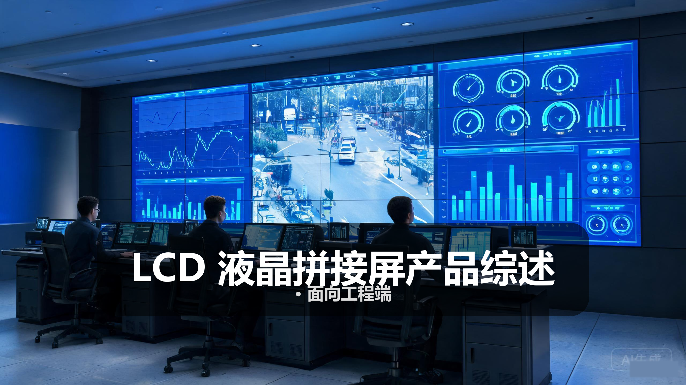
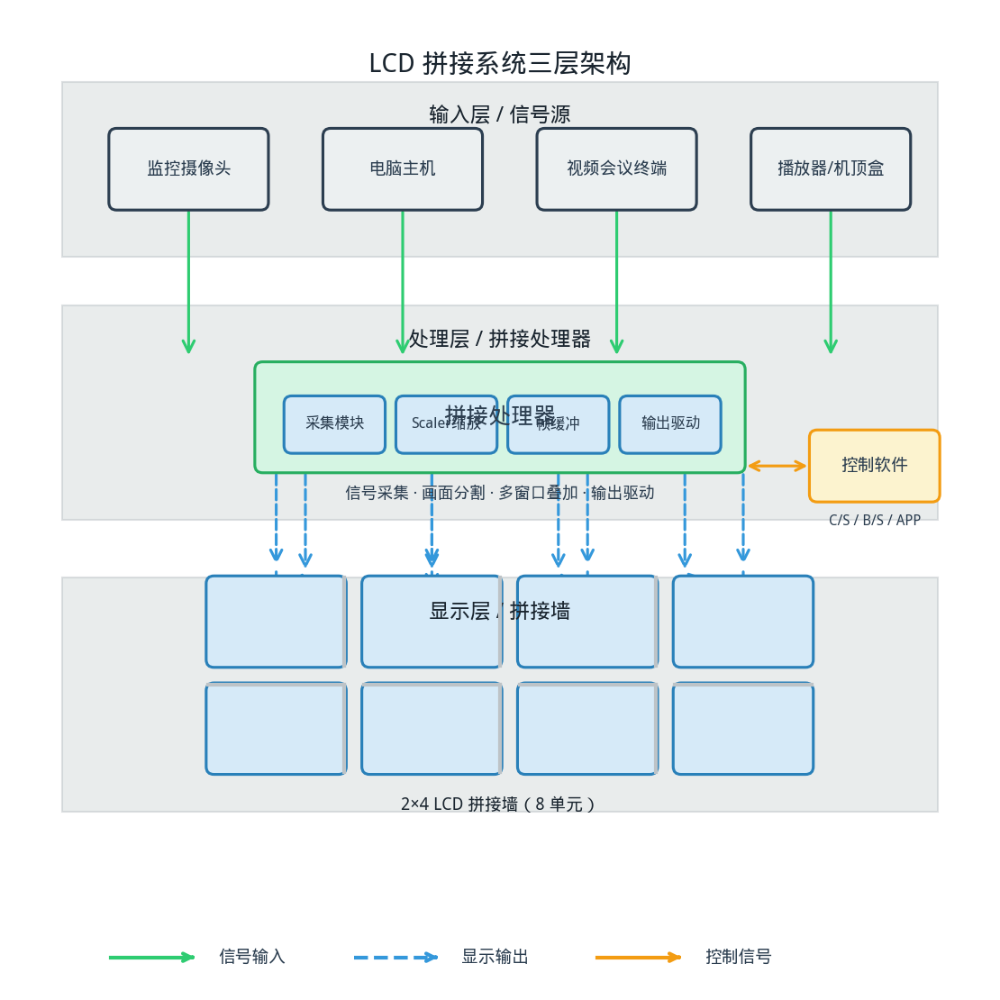
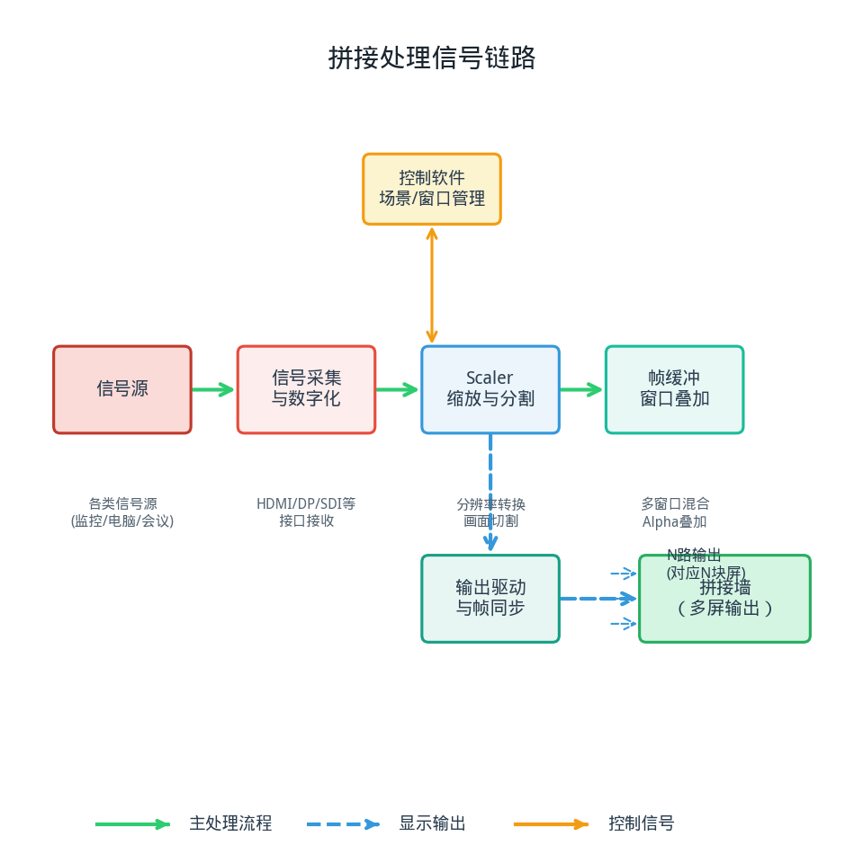
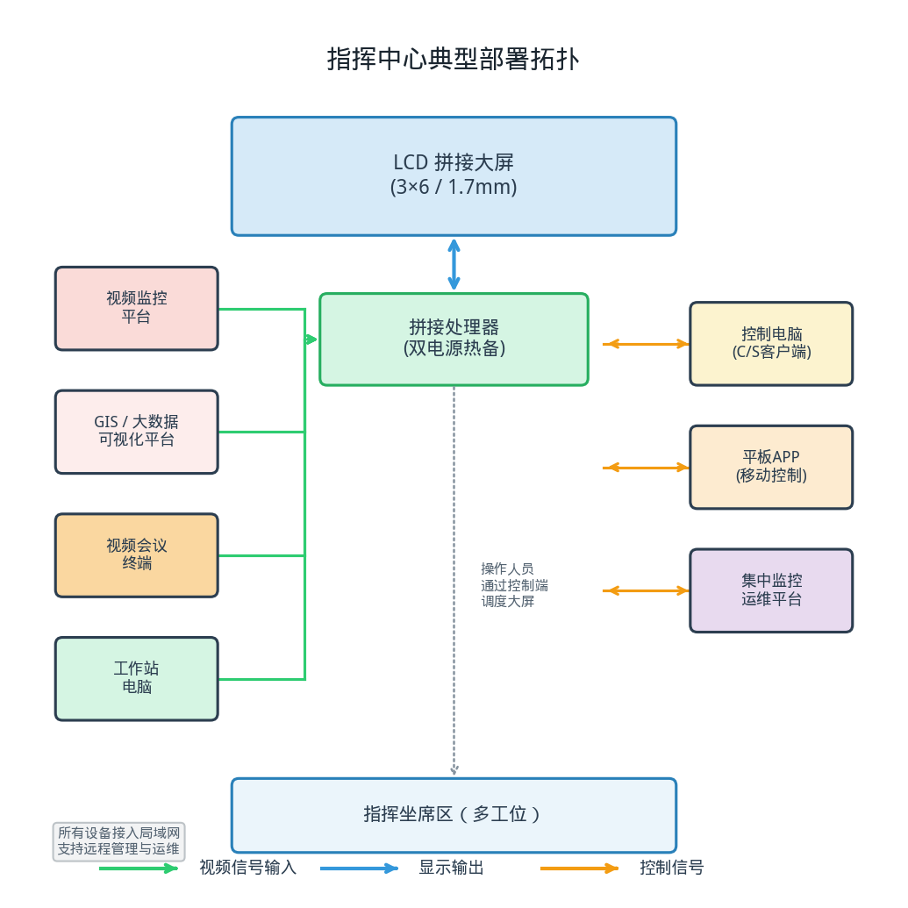

> 
> *概念图：LCD 液晶拼接屏指挥中心应用示意*

# LCD 液晶拼接屏产品综述

## · 面向工程端

---

## 〇 一句话定位

LCD 液晶拼接屏是由多块工业级液晶面板以极窄边拼接而成的大屏显示终端，配合拼接处理器实现整屏显示、任意开窗与信号漫游，是指挥中心、监控室与商业展示场景中最常用的大屏显示方案。

> 简单说，就是把几十块电视屏幕无缝拼在一起，变成一块超大的智能显示屏——既能整屏显示一幅大画面，也能同时显示几十个不同的信号窗口。

---

## 一、产品设计方案

### 1.1 系统组成全景

一套完整的 LCD 拼接显示系统由四层构成：**信号输入层 → 拼接处理层 → 显示输出层 → 控制管理层**。

信号输入层负责汇聚各类信号源，包括监控摄像头、电脑主机、视频会议终端、播放器等；拼接处理层是系统的大脑，负责信号采集、画面分割、窗口管理与输出驱动；显示输出层就是拼接屏墙本身，把处理后的画面呈现出来；控制管理层提供人机交互界面，操作人员通过软件进行场景切换、窗口拖拽、信号调度。

*图 1：LCD 拼接系统三层架构示意（输入层 → 处理层 → 显示层）*

### 1.2 拼接单元形态

拼接单元的安装形态直接决定工程实施方式，常见有四种：

- **壁挂式**：用挂架将屏体固定在墙面，结构简单、成本低，适合屏数较少（≤ 2×3）、墙面承重足够的场景。安装前需确认墙体结构，混凝土墙可直接装，轻质隔墙需做加固处理。
- **落地机柜式**：屏体安装在定制落地机柜上，机柜内部走线、配电、散热一体化设计，适合大屏数（3×4 及以上）的指挥中心、监控室。机柜底部需地面承重满足要求，通常每平米不低于 500kg。
- **前维护式**：屏体可从正面弹出进行维护，背部无需预留维护空间，适合贴墙安装或空间受限的场景。维护机构通常为液压弹簧式，单屏可向前弹出 300~500mm。
- **后维护式**：从屏体背部进行接线和维护，需在屏墙后方预留至少 600mm 的维护通道。结构简单、成本较低，是最常见的安装方式。

### 1.3 面板技术演进

LCD 拼接屏的核心是工业级液晶面板，过去十年经历了三代技术演进：

第一代是 CCFL 背光时代（约 2010 年前后），采用冷阴极荧光管背光，厚度大、功耗高、色彩一般，拼缝普遍在 6.7mm 以上。第二代是 LED 背光时代（约 2013~2018 年），用 LED 灯珠替代 CCFL，厚度降低、功耗下降、亮度提升，拼缝缩小到 3.5mm 和 1.7mm 两档，是当前市场的主流。第三代是窄边化与高刷时代（2019 年至今），拼缝进一步缩小到 0.88mm，部分产品支持 HDR、高刷新率，面板也从 VA 向 IPS 演进，可视角度和色彩表现更好。

接口方面也在不断升级：从早期的 VGA + DVI 组合，到 HDMI + DP 成为标配，再到现在支持 HDMI 2.0（4K@60Hz）、DP 1.2、SDI 广播级接口，以及 RJ45 网络解码直显功能。

### 1.4 拼缝设计与视觉效果

拼缝是 LCD 拼接屏最核心的参数之一，也是用户最直观感受到的特征。这里需要区分两个概念：

- **物理拼缝**：相邻两块屏的物理边框宽度之和，即左屏右边框 + 右屏左边框的总宽度。例如 1.7mm 拼缝通常指物理拼缝约 1.7mm。
- **光学拼缝 / 视觉拼缝**：由于液晶显示区域到面板边缘还有一段距离，实际观看时的黑色缝隙会比物理拼缝更宽，一般比物理拼缝大 0.3~0.5mm。

当前市场主流拼缝档位及适用场景：

| 拼缝档位 | 典型值 | 适用场景 | 价格系数 |
|---------|--------|---------|---------|
| 宽拼缝 | 3.5mm | 监控室、数据展示、预算有限的场景 | 1.0× |
| 窄拼缝 | 1.7mm | 指挥中心、会议室、商业展示 | 1.5~2.0× |
| 超窄拼缝 | 0.88mm | 高端指挥中心、展览馆、演播室 | 2.5~3.5× |

拼缝越小，整屏视觉连贯性越好，但价格也成倍增长。选型时需根据观看距离和内容类型综合决策——如果观看距离较远（5 米以上），3.5mm 拼缝在视觉上已经不明显；如果是近距离观看的会议场景，1.7mm 或更窄的拼缝体验更好。

### 1.5 散热与可靠性设计

LCD 拼接屏大多用于 7×24 小时连续运行的场景，散热和可靠性设计至关重要。

工业级面板与普通消费级电视面板的核心区别在于：工业级面板采用更高规格的 LED 背光珠、优化的散热结构、更稳定的驱动电路，确保长时间连续工作下的亮度衰减和色彩漂移控制在可接受范围内。

散热设计方面，拼接单元通常采用侧入式背光 + 金属散热片 + 智能温控风扇的组合。屏体内部布置温度传感器，当温度超过阈值时自动启动风扇散热；温度降低后风扇自动停转，既保证散热又降低噪音和功耗。部分高端产品采用无风扇全被动散热设计，依靠大面积金属外壳散热，噪音更低，适合对静音要求高的场景。

可靠性指标通常用 **MTBF**（平均无故障时间，Mean Time Between Failures）衡量，工业级拼接屏的 MTBF 标称值一般在 50000~70000 小时区间。按 7×24 运行计算，50000 小时约合 5.7 年，70000 小时约合 8 年。实际使用寿命受环境温度、湿度、粉尘等因素影响，机房环境下通常能达到标称值的 80%~100%。

### 1.6 工程约束条件

LCD 拼接屏的工程实施需要考虑多个约束条件，前期规划不到位会导致后期返工：

- **安装空间**：需确认安装位置的宽度、高度、进深是否满足屏体尺寸和维护通道要求。
- **承重要求**：壁挂安装需确认墙体承重能力，落地安装需确认地面承重。55 寸拼接单元单屏重量约 25~35kg，加上安装结构，每平米承重需不低于 300~500kg。
- **维护通道**：后维护方式需在屏墙后方预留至少 600mm 的检修通道；前维护方式则无需后部空间。
- **供电规划**：单屏功耗约 120~200W（取决于尺寸和亮度），需根据屏数核算总功耗并预留 30% 冗余。
- **散热条件**：安装环境温度应控制在 0~40℃ 之间，最佳工作温度 20~30℃。屏墙周围需留有通风空间，密闭空间需加装空调或通风系统。
- **信号传输距离**：HDMI 铜缆传输距离一般不超过 15 米（1080P）或 10 米（4K），超过距离需使用光纤延长器或网线延长器。

---

## 二、核心参数与选型

### 2.1 选型公式与关键指标

LCD 拼接屏的选型不是凭感觉拍脑袋，而是有一套可量化的计算方法。工程人员掌握以下几个公式，就能快速完成初步选型。

**① 观看距离与屏体高度的关系**

最佳观看距离 ≈ 屏墙高度 × (1.5 ~ 2.5)

这是行业通用的经验公式。观看距离越近，需要的像素密度越高（也就是单屏尺寸越小、拼出来的整墙分辨率越高）；观看距离越远，对像素密度的要求越低。

举个例子：如果观看距离是 8 米，按系数 2.0 计算，屏墙高度约为 4 米。再根据 16:9 的宽高比，屏墙宽度约为 7.1 米。

**② 单屏尺寸与整墙尺寸的换算**

先确定单屏尺寸和行×列数量，再计算整墙尺寸。

以 55 寸 1.7mm 拼缝单元为例：
- 单屏显示区尺寸：约 1209.6mm（宽） × 680.4mm（高）
- 单屏含边框尺寸：约 1211.3mm × 682.1mm（单边边框约 0.85mm）
- 3×6 拼接（3 行 6 列）：
  - 整墙宽度 = 1209.6 × 6 + 1.7 × 5 = 7257.6 + 8.5 = 7266.1mm ≈ 7.27m
  - 整墙高度 = 680.4 × 3 + 1.7 × 2 = 2041.2 + 3.4 = 2044.6mm ≈ 2.04m

> 注意：整墙尺寸计算时，拼缝只算中间的 N-1 条，最外侧的边框不算入显示宽度。

**③ 整墙分辨率计算**

整墙分辨率 = 单屏分辨率 × 行/列数

- 单屏 1920×1080（FHD），3×6 拼接：
  - 整墙分辨率 = (1920×6) × (1080×3) = 11520 × 3240（约 3700 万像素）
- 单屏 3840×2160（4K），2×2 拼接：
  - 整墙分辨率 = (3840×2) × (2160×2) = 7680 × 4320（约 3300 万像素）

**④ PPI（像素密度）与观看体验**

PPI = √(横向像素² + 纵向像素²) / 对角线尺寸（英寸）

PPI 越高，画面越细腻。一般来说：
- PPI < 50：近距离观看颗粒感明显
- PPI 50~80：正常观看距离下效果可接受
- PPI > 80：画面细腻，近看也不觉得粗糙

55 寸 1080P 屏的 PPI 约为 40，单屏近看会有颗粒感，但拼接成大屏后观看距离较远，整体效果可以接受。如果是会议室等近距离观看场景，建议选 4K 单屏或更小尺寸的单元。

### 2.2 核心部件参数表

**面板核心参数**

| 参数项 | 典型值范围 | 工程关注点 |
|-------|-----------|-----------|
| 面板尺寸 | 43" / 46" / 49" / 55" / 65" | 决定整墙尺寸和观看距离 |
| 面板类型 | VA / IPS / PLS | IPS 可视角度好、色彩准，VA 对比度高 |
| 分辨率 | 1920×1080 / 3840×2160 | 4K 面板价格约为 FHD 的 2~3 倍 |
| 亮度 | 450 / 500 / 700 / 1000 cd/m² | 普通环境 500cd/m² 足够，窗边/高亮环境选 700+ |
| 对比度 | 1200:1 / 3000:1 / 4000:1 | VA 面板对比度更高，暗部细节更好 |
| 响应时间 | 6ms / 8ms / 12ms（灰阶） | 显示高速运动画面时选响应时间短的 |
| 可视角度 | 178°/178°（水平/垂直） | IPS 面板侧看色彩偏移更小 |
| 色域 | 72% NTSC / 92% NTSC / sRGB 100% | 对色彩要求高的场景选高色域 |

**拼缝与拼接参数**

| 参数项 | 典型值范围 | 工程关注点 |
|-------|-----------|-----------|
| 物理拼缝 | 3.5mm / 1.7mm / 0.88mm | 核心选型指标，直接影响视觉效果和价格 |
| 拼接方式 | 逐行扫描 / 全局同步 | 高速运动画面是否有撕裂感 |
| 拼接补偿 | 支持 / 不支持 | 画面在拼缝处的像素补偿与拉伸 |
| 拼接方向 | 横向 / 纵向 / 任意角度 | 创意拼接场景需要支持异形拼接 |

**接口参数**

| 接口类型 | 用途 | 典型规格 |
|---------|------|---------|
| HDMI | 高清数字信号输入 | HDMI 1.4（4K@30Hz）/ HDMI 2.0（4K@60Hz） |
| DP | 高清数字信号输入 | DP 1.2（4K@60Hz，支持 MST 多流传输） |
| DVI | 数字信号输入 | 单链路 DVI（1920×1200@60Hz） |
| VGA | 模拟信号输入 | 最高 1920×1080@60Hz，已逐步淘汰 |
| SDI | 广播级信号输入 | 3G-SDI（1080P@60Hz）/ 12G-SDI（4K@60Hz） |
| RJ45（网口） | 网络解码、控制 | 支持 H.264/H.265 解码，ONVIF 协议 |
| RS2332 | 串口控制 | 拼接控制、级联设置 |

**拼接处理器参数**

| 参数项 | 典型值范围 | 工程关注点 |
|-------|-----------|-----------|
| 输入路数 | 4 / 8 / 16 / 32 / 64 | 根据信号源数量选择，预留 20% 余量 |
| 输出路数 | 4 / 8 / 16 / 24 / 32 | 等于拼接屏数量 |
| 开窗数量 | 4 / 8 / 16 / 32 | 同时显示的活动窗口数 |
| 单路最大分辨率 | 1080P / 4K / 8K | 4K 输入需要更高带宽的处理芯片 |
| 漫游功能 | 支持 / 不支持 | 窗口能否跨屏自由移动、缩放 |
| 叠加层数 | 2 层 / 4 层 / 无限制 | 窗口叠加显示的层数 |
| 场景预设 | 8 / 16 / 32 个 | 可保存的场景数量，一键切换 |
| 控制方式 | C/S 客户端 / B/S 网页 / 平板 APP | 不同使用场景选择不同控制方式 |

### 2.3 工程对接踩坑点

以下是工程实施中最容易出问题的环节，提前识别可以避免大量返工。

**坑点 1：拼缝对齐与像素偏差**

LCD 拼接的物理边框和像素位置存在微小偏差，如果安装时拼缝没有精确对齐，会导致画面在拼缝处出现"错位"或"重影"。特别是显示文字或细线时，拼缝处的偏差会非常明显。

应对措施：安装时使用专业的水平仪和塞尺，确保每块屏的横向和纵向拼缝均匀一致；调试阶段使用专用的拼接测试图案（网格、十字线）进行像素级对齐调整。

**坑点 2：色彩一致性问题**

多块屏拼接在一起，即使是同一批次的面板，也可能存在亮度和色彩的差异。这种差异在单屏看时不明显，但拼在一起形成对比后就会很突出，看起来像"打补丁"一样。

应对措施：到货后先进行逐屏亮度和色彩测试，将差异较大的屏挑出不用或放在边角位置；系统调试时使用专业校色仪进行整墙色彩校准（3D LUT 校准）；选择支持逐点亮度校正功能的产品。

**坑点 3：散热与噪音控制**

多块屏密集排布后，热量会在屏墙内部堆积，如果散热不好，会加速光衰、缩短面板寿命。同时，多台风扇同时运转产生的噪音也可能影响使用体验。

应对措施：屏墙顶部和底部预留通风空间，落地机柜式需设计进风出风口和散热通道；选择智能温控风扇的产品，温度低时风扇停转或低速运转；机房配置独立空调，环境温度控制在 25℃ 以下。

**坑点 4：供电规划不足**

拼接屏数量多，单屏功耗看起来不大（150~200W），但几十块屏加起来就是好几千瓦。如果供电回路容量不够，会导致跳闸、电压不稳，甚至损坏设备。

应对措施：按"单屏最大功耗 × 屏数 × 1.3 冗余系数"核算总功耗；多路供电均衡分配，每路不超过 16A；配置 UPS 不间断电源，防止突然断电损坏面板；做好接地保护，避免静电和雷击损坏。

**坑点 5：信号传输距离超限**

HDMI、DVI 等铜缆的传输距离有限，长距离传输会导致信号衰减、画面闪屏甚至无信号。

应对措施：提前测量信号源到屏墙的距离，超过 15 米时选用光纤延长器或网线延长器（HDBaseT 技术，最远 100 米）；关键信号建议使用光纤传输，抗干扰能力强；机房布线时预留备用线缆。

**坑点 6：安装结构承重不足**

拼接屏重量大，特别是落地机柜式，几十块屏加上机柜结构总重量可达数吨。如果地面或墙体承重不够，会有安全隐患。

应对措施：安装前请建筑专业核算承重，或提供结构设计图纸确认；落地安装时优先选择有承重梁的位置；壁挂安装必须是混凝土实心墙，空心砖、加气块墙需做加固处理；结构件需有足够的安全系数（建议 ≥ 3 倍安全系数）。

**坑点 7：维护空间预留不够**

设计阶段只关注屏墙正面效果，忽略了后部维护空间，导致后期检修时人员无法进入，甚至需要拆屏才能接线。

应对措施：后维护方式至少预留 600mm 维护通道，800mm 以上更舒适；空间有限时选择前维护产品；设计时在屏墙两侧或中间预留检修口；设备接线集中在易操作的位置。

---

## 三、技术原理

### 3.1 液晶显示基础

LCD 拼接屏的核心是 **TFT-LCD**（薄膜晶体管液晶显示器）面板。理解它的工作原理，有助于理解拼接屏的各种参数和选型逻辑。

TFT-LCD 面板的结构从后往前依次是：背光模组 → 下偏光片 →  TFT 玻璃基板 → 液晶层 → 彩色滤光片 → 上偏光片。

工作过程是这样的：背光模组发出均匀的白光，经过下偏光片变成偏振光；液晶层中的液晶分子在电场作用下改变排列方向，从而控制光线的偏转角度；光线再经过彩色滤光片（红、绿、蓝三色子像素）变成彩色光；最后经过上偏光片，根据液晶偏转角度的不同，透出的光线强弱不同，从而形成不同的灰阶和色彩。

每一个像素由红（R）、绿（G）、蓝（B）三个子像素组成，通过控制三个子像素的亮度比例，混合出各种不同的颜色。1920×1080 的 FHD 屏就有 1920×1080 个像素，每个像素 3 个子像素，总计约 622 万个子像素。

### 3.2 拼接显示原理

单块屏的显示原理和普通液晶电视一样，拼接的关键在于**多屏之间的像素映射与画面同步**。

拼接显示的核心思想是"分块显示"：把一幅大画面切割成若干个小画面，每个小画面对应一块拼接单元，所有屏同时显示各自的那一块，合在一起就是完整的大画面。

举个例子，3×3 拼接显示一幅 5760×3240 的大画面：
- 第 1 行第 1 块屏显示左上角 1920×1080 的区域
- 第 1 行第 2 块屏显示中上 1920×1080 的区域
- ……
- 第 3 行第 3 块屏显示右下角 1920×1080 的区域

这个切割和分配的工作由**拼接处理器**完成。处理器把输入的大画面按照拼接布局进行分割，然后分别输出到每一块屏。

但是有一个问题：物理拼缝的存在会导致画面在拼缝处"断开"，一条直线经过拼缝时会缺失一小段。为了解决这个问题，拼接处理器通常支持**拼缝补偿**功能——也就是把拼缝对应的那部分像素"去掉"或者"拉伸补偿"，让画面内容在视觉上更连续。

### 3.3 拼接处理器工作机制

拼接处理器是整个系统的"大脑"，它决定了系统能支持多少路信号、多少个窗口、什么样的显示效果。

*图 2：拼接处理信号链路示意（信号源 → 采集 → 处理 → 输出 → 拼接墙）*

拼接处理器的内部工作分为四个阶段：

**第一阶段：信号采集与数字化**
输入接口把各种格式的模拟或数字信号接收进来，转换成统一的数字视频流（通常是 YUV 或 RGB 格式）。不同的接口对应不同的采集芯片，例如 HDMI 输入用 HDMI 接收芯片，SDI 输入用 SDI 解码芯片。

**第二阶段：缩放与画面分割（Scaler）**
采集到的信号分辨率可能和输出分辨率不一致，需要经过缩放处理（Scaler）。缩放芯片把输入画面按照需要的分辨率进行放大或缩小，同时进行画质增强（去隔行、降噪、锐化等）。

对于拼接场景，还要进行**画面分割**：把一整幅大画面按照拼接布局切割成若干小块，每一块对应一块输出屏。高端处理器支持任意位置、任意大小的画面切割，这是实现"任意开窗"和"信号漫游"的基础。

**第三阶段：多窗口叠加与混合**
拼接处理器最核心的功能是多窗口显示。处理器内部有一个**帧缓冲**（Frame Buffer），相当于一块"画布"，各个窗口的画面先画到这块画布上，然后再把整幅画布输出到拼接墙。

窗口叠加的层数取决于处理器的架构和显存大小。嵌入式处理器通常支持 4~16 层叠加，X86 架构的处理器则可以支持更多层。叠加时需要处理透明度（Alpha 混合）、Z 序（窗口前后顺序）等问题。

**第四阶段：输出驱动与帧同步**
最后，处理好的画面通过输出接口送到每一块拼接屏。为了保证所有屏的画面同步刷新（不出现撕裂、错位），所有输出通道必须严格帧同步——同一帧画面在所有屏上同时显示。

帧同步的实现方式通常是所有输出通道共享同一个时钟源，并通过同步信号进行对齐。高端处理器还支持 Genlock（外同步）功能，可以接入外部同步信号，与其他视频设备同步。

### 3.4 色彩校准技术

多屏拼接的色彩一致性是衡量系统质量的重要指标。再好的面板，拼在一起有色差也会显得很廉价。

色彩校准有几个层次：

**基础校准：白平衡校准**
白平衡就是让白色在不同亮度下都呈现纯正的白色，不偏红、不偏蓝、不偏绿。校准方法是调整 R、G、B 三通道的增益和偏移，使不同灰阶下的色温保持一致（通常是 6500K，即 D65 标准白光）。

**进阶校准：亮度均匀性校正**
即使是同一块屏，中心和边角的亮度也可能有差异（通常边角比中心暗 10%~20%）。多屏拼接时，这种不均匀性会更明显，看起来像"田字格"一样。

亮度均匀性校正的方法是把屏面分成若干个区域，逐区域测量亮度，然后通过数字方式降低较亮区域的亮度，使整屏亮度趋于一致。代价是整体亮度会有所下降（因为要向最暗的区域看齐）。

**高级校准：3D LUT 校色**
3D LUT（三维查找表）是一种精确的色彩校准方法。它把整个色彩空间划分成立方体网格（常见的有 17×17×17、33×33×33），每个网格点对应一组输入 RGB 值和校准后的输出 RGB 值。校准时用专业仪器（如爱色丽 i1Display Pro）测量每个点的实际颜色，然后计算出校准用的 3D LUT 表。

3D LUT 校准可以显著提升多屏之间的色彩一致性，是高端拼接系统的标准配置。

### 3.5 冗余与可靠性设计

用于指挥中心、监控室的拼接系统通常要求 7×24 小时不间断运行，因此可靠性设计非常重要。

常见的可靠性设计包括：

- **双电源备份**：关键的拼接处理器配置双电源，一路电源故障时另一路自动接管，不影响系统运行。
- **信号热备份**：重要的信号源通过两路输入（主路 + 备路），主路信号中断时自动切换到备路，切换时间通常在毫秒级，人眼几乎察觉不到。
- **环通输出**：部分产品支持信号环通（Loop Through），信号从一块屏进入、再从另一路输出到下一块屏，形成级联。这种方式在某一块屏断电时，不影响其他屏的信号传输（但故障屏本身会黑屏）。
- **温度监控与保护**：屏内温度传感器实时监测温度，温度过高时自动提高风扇转速或降低亮度，极端情况下自动关机保护，防止面板烧毁。
- **静电防护**：工业级产品都有完善的 ESD（静电放电）防护设计，接口、电源入口都有静电保护器件，避免静电损坏电路。

---

## 四、产品功能与差异化

### 4.1 核心显示功能

**整屏显示**
整屏显示是最基础的功能——把一路信号全屏显示在整个拼接墙上。例如把一台电脑的桌面扩展到整个拼接墙，形成一个超大面积的电脑桌面。整屏显示时，画面分辨率等于各屏分辨率之和，3×6 的 FHD 拼接墙整屏分辨率可达 11520×3240。

**分屏显示**
分屏显示就是把多路信号同时显示在拼接墙上，每路信号占据一定的区域。常见的分屏模式有 1 分屏（全屏）、4 分屏、9 分屏、16 分屏等。分屏显示在监控场景中非常常用，可以同时查看多路监控画面。

**任意开窗**
任意开窗是拼接处理器最有价值的功能之一。操作人员可以在大屏上任意位置打开一个窗口，显示任意一路信号源，窗口大小可以自由调整。窗口数量取决于处理器能力，从 4 个到几十个不等。指挥中心场景下，经常需要同时显示监控画面、GIS 地图、数据可视化等多种内容，任意开窗功能可以灵活组织这些信息。

**信号漫游**
信号漫游是任意开窗的进阶功能——窗口不仅可以任意大小，还可以**跨屏移动**，从一块屏拖到另一块屏，甚至部分在屏内、部分在屏外。漫游功能让大屏使用起来就像一个超大号的电脑桌面，非常直观。

**画面叠加（PIP / POP）**
画中画（Picture-in-Picture，PIP）是指在主画面上叠加一个小窗口，显示另一路信号。画外画（Picture-out-Picture，POP）则是在主画面旁边开小窗口。叠加功能在视频会议、远程培训等场景中很常用，可以一边看材料一边看发言人。

**场景轮巡**
场景轮巡是指系统按照预设的时间间隔，自动在多个场景之间切换。例如监控室可以设置"1 号场景显示 1-16 路摄像头 → 2 号场景显示 17-32 路摄像头 → 循环"，无需人工操作，自动轮巡查看所有监控画面。

### 4.2 增强功能

**4K 超高清输入支持**
随着 4K 信号源越来越多（4K 摄像头、4K 电脑、4K 播放器），拼接处理器的 4K 输入能力成为标配。4K 输入需要更高的带宽处理能力，HDMI 2.0 和 DP 1.2 接口都支持 4K@60Hz 输入。部分高端处理器还支持 8K 输入。

**HDR 高动态范围显示**
HDR（High Dynamic Range）可以显示更宽的亮度范围和更丰富的色彩层次，暗部更暗、亮部更亮，画面更有层次感和立体感。HDR 对拼接屏的亮度和对比度都有较高要求，通常需要 700cd/m² 以上的亮度和较高的色域才能体现出 HDR 效果。

**网络解码直显**
传统的拼接系统需要额外的视频解码器把网络摄像头信号转换成 HDMI 信号，再输入到拼接处理器。新一代的拼接屏和处理器支持**网络解码直显**——直接通过网线接入网络，内置解码芯片可以直接解码 H.264/H.265 格式的网络视频流，省去了额外的解码器。

网络解码直显功能特别适合监控场景，可以节省大量解码器和线缆成本，同时简化系统架构。通常支持 ONVIF 协议，可以对接主流品牌的网络摄像头。

**多屏拼接控制软件**
拼接系统的控制软件有两种架构：C/S 架构（客户端/服务器）和 B/S 架构（浏览器/服务器）。

C/S 架构需要在控制电脑上安装客户端软件，功能更丰富、操作更流畅，但只能在安装了软件的电脑上控制。B/S 架构通过网页浏览器即可控制，不需要安装软件，手机、平板也能访问，使用更灵活，但功能可能比 C/S 略少。

高端产品还提供平板 APP 控制，在 iPad 或安卓平板上就能完成场景切换、窗口拖拽、信号调度等操作，非常方便。

**场景预设与一键切换**
场景预设是指把当前的窗口布局、信号源选择、显示参数等保存为一个"场景"，下次需要时一键调用。例如指挥中心可以预设"日常监控场景""应急指挥场景""汇报演示场景"等，不同场景下的窗口布局和信号源完全不同，切换时只需点一下按钮。

场景数量取决于处理器的存储容量，通常支持 8~32 个场景。部分产品支持场景导出和导入，方便备份和在多套系统之间迁移。

**远程管理与状态监控**
工业级拼接系统支持 SNMP 网络管理协议，可以接入机房的统一监控平台。管理人员可以远程查看每块屏的工作状态（温度、亮度、运行时间、是否故障），进行远程开关机、信号切换、场景调用等操作，无需到现场操作。

部分产品还提供手机 APP 告警功能，当某块屏出现故障（温度过高、信号丢失、电源异常）时，管理员会收到推送通知，及时处理问题。

### 4.3 差异化维度

不同品牌、不同型号的 LCD 拼接屏差异很大，工程选型时主要关注以下几个差异化维度：

**① 拼缝宽度**
拼缝是最直观的差异点，也是价格差异最大的因素。3.5mm 拼缝是入门级，价格亲民；1.7mm 是中高端主流，视觉效果和价格比较平衡；0.88mm 是高端旗舰，视觉上接近无缝，但价格是 3.5mm 的 3 倍以上。

**② 面板类型**
VA 面板和 IPS 面板是两大主流。VA 面板对比度高（通常 3000:1 以上）、黑色更纯、价格相对低，但可视角度稍差，侧看会有色彩偏移。IPS 面板可视角度广（178° 全视角）、色彩准确、响应速度快，但对比度相对较低（通常 1000:1 左右）、价格更高。监控、指挥中心等对可视角度要求高的场景建议选 IPS 面板。

**③ 亮度等级**
普通亮度（450~500cd/m²）适合室内无直射光的环境；高亮度（700~1000cd/m²）适合靠近窗户、有阳光直射的场景，或者环境比较明亮的大厅、展厅。高亮度面板的价格和功耗都会更高，选型时按需选择，不是越亮越好。

**④ 拼接处理器架构**
拼接处理器主要有三种架构：
- **纯硬件嵌入式**：FPGA 芯片架构，启动快（秒级）、稳定性高、无操作系统不会中病毒，但功能相对固定，开窗数量有限。
- **X86 架构**：基于工控机 + 专业显卡，功能强大、开窗数量多、支持复杂特效，但有操作系统、启动慢（分钟级）、稳定性略低于纯硬件。
- **分布式架构**：每块屏对应一个节点，节点之间通过网络连接，系统扩展性好、布线简单，但延迟略高、画质略有压缩。

**⑤ 维护方式**
前维护和后维护的选择取决于安装空间。后维护结构简单、成本低，但需要后部维护空间；前维护节省后部空间，但结构复杂、成本更高。如果屏墙后面是实墙或空间不足，必须选前维护。

---

## 五、应用场景

### 5.1 指挥调度中心

**痛点**
城市应急指挥、公安指挥、交通指挥等场景需要同时查看多路监控视频、GIS 地图、数据可视化大屏、视频会议等多种信息源。信息源数量多、类型杂，需要在一块大屏上灵活组织和切换。系统要求 7×24 小时连续运行，稳定性是第一优先级。

**方案**
大屏采用 LCD 拼接屏（通常 3×6 或更大规格，1.7mm 或更窄拼缝），配高端拼接处理器（支持 16 路以上开窗漫游）。信号源包括：视频监控平台输出、GIS/大数据可视化平台、视频会议终端、多路电脑信号。控制方式采用 C/S 客户端 + 平板 APP 双模式，值班人员日常用客户端操作，领导视察时用平板演示。

系统配置双机热备的拼接处理器，主处理器故障时备机自动接管，确保系统不中断。电源配置 UPS 不间断电源，断电后仍能运行一段时间，保障关键信息不丢失。

**价值**
一屏掌控全局——所有关键信息在一块大屏上呈现，指挥人员不用在多个屏幕之间来回看，决策效率更高。多窗口漫游功能让指挥员可以根据需要灵活调整信息布局，应急场景下快速调出相关画面。7×24 小时高可靠设计确保系统随时可用，不会因为设备故障影响指挥调度。

### 5.2 安防监控室

**痛点**
中小型企业、园区、小区的监控中心通常有十几路到几十路监控摄像头，需要同时显示在大屏上。预算有限，要求性价比高、操作简单、稳定可靠。画面以监控视频为主，对画质要求不是极高，但要求 24 小时连续运行。

**方案**
采用 49 寸或 55 寸 3.5mm 拼缝的 LCD 拼接屏，2×3 或 2×4 布局即可满足大多数中小型监控中心的需求。解码方案选择网络解码矩阵——直接通过网线接入监控网络，内置解码芯片直接解码网络摄像头信号，省去了额外的解码器和大量视频线缆。

控制方式比较简单，通过配套的管理软件进行画面分割、轮巡设置、报警联动等操作。支持报警信号输入——当某个摄像头触发移动侦测或报警时，对应画面自动放大弹出到主屏位置，提醒值班人员关注。

**价值**
性价比高——一套 2×4 的 49 寸拼接系统总价不高，就能满足几十路监控的同时显示需求。安装维护简单——网络解码方案布线简单，一根网线搞定信号和控制。24 小时连续运行稳定可靠——工业级面板和散热设计确保长期稳定运行。

### 5.3 商业展示与零售

**痛点**
商场、品牌专卖店、企业展厅需要大尺寸、高清晰度的展示屏来播放品牌宣传片、产品介绍、促销信息等。要求视觉效果好、画面细腻、色彩鲜艳，能吸引路人注意力。同时需要支持多种播放内容和灵活的画面布局。

**方案**
根据场地大小选择 1.7mm 或 0.88mm 拼缝的拼接屏，通常竖屏 2×2 或横屏 1×4/1×5 的布局比较常见。播放源使用 4K 广告播放盒或媒体服务器，支持定时播放、分屏显示、多素材轮播等功能。

高端展示场景可以增加互动功能——在拼接屏前面加装红外触控框或电容触控膜，让大屏变成可触摸的互动展示屏，顾客可以点选查看产品信息、浏览虚拟展厅等。

**价值**
视觉冲击力强——大尺寸拼接屏的视觉效果是单屏电视无法比拟的，远远就能吸引顾客注意。品牌形象提升——高清大屏展示的品牌宣传片、产品介绍，比纸质海报和易拉宝更有科技感和专业感。内容更新方便——数字内容随时更换，不需要重新制作和安装物料，促销活动切换一键搞定。

### 5.4 会议室与报告厅

**痛点**
大型会议室、报告厅需要显示本地电脑演示、远程视频会议、电子白板等多种内容。参会人数多，需要大屏才能让所有人都看清。会议场景下观看距离较近，对画面质量和拼缝要求较高。同时需要与会议中控系统集成，实现一键启动、场景切换等功能。

**方案**
会议室通常选用 55 寸或 65 寸 1.7mm 拼缝的拼接屏，2×2 或 2×3 布局，整屏尺寸在 2.4m~3.6m 宽，适合 20~50 人的会议室。拼接处理器支持多路信号输入（笔记本电脑、视频会议终端、电子白板等），可以任意开窗和切换。

控制系统与会议室中控系统对接——通过中控触摸屏可以一键切换"会议模式""视频会议模式""休息模式"等场景，同时控制大屏开关、信号切换、灯光、窗帘、音量等设备。

**价值**
提升会议体验——大屏显示让所有参会人员都能看清内容，不用挤在一起看小屏幕。多源信号灵活切换——电脑演示、视频会议、电子白板等内容随时切换，不用插拔线缆。与中控系统集成，操作简单——不用专人操作设备，主持人自己用触摸屏就能控制所有设备。

*图 3：指挥中心典型部署拓扑示意*

---

## 六、实际案例与设计方案

### 案例 A：某城市应急指挥中心大屏系统

**需求**

某市应急管理局新建应急指挥中心，需要建设一套大屏显示系统，主要用于日常应急值守、突发事件指挥调度、多部门联合会议等场景。

具体需求如下：
- 显示面积要求：约 8m 宽 × 3m 高，坐席区距离大屏约 8~10 米
- 信号源：监控视频（约 64 路）、GIS 地理信息系统、数据可视化平台、视频会议终端（2 路）、多台工作电脑
- 使用要求：7×24 小时连续运行，支持多窗口漫游与场景切换，稳定性要求高
- 安装方式：落地机柜式，后维护
- 预算：中高端预算，对显示效果和可靠性要求高

**方案设计**

**① 屏体选型与布局**
选用 55 寸 1.7mm 拼缝 IPS 面板拼接单元，3 行 6 列（3×6）排布，共 18 块屏。

选择依据：
- 尺寸：整墙宽约 7.27m、高约 2.04m，基本满足 8m 宽的要求（两侧可加装饰边框）
- 观看距离：8~10 米的观看距离，对应 2.04m 的屏高，比值约 4~5 倍，在舒适观看范围内
- 拼缝：1.7mm 窄拼缝，整屏视觉连贯性好，适合指挥中心等正式场合
- 面板：IPS 面板可视角度好，指挥中心人员分布较广，侧坐也能看清

**② 拼接处理器选型**
选用纯硬件嵌入式拼接处理器，配置如下：
- 输入：32 路 HDMI 输入 + 16 路网络解码（可扩展）
- 输出：18 路 HDMI 输出（对应 18 块屏）
- 开窗能力：支持 16 路同时开窗漫游
- 冗余配置：双电源备份、双主控热备

选择嵌入式架构的理由：指挥中心要求极高的稳定性，嵌入式系统没有操作系统、不会中病毒、启动快、故障概率低，更适合 7×24 小时关键任务场景。

**③ 安装结构**
定制落地机柜，钢结构框架，模块化设计，现场组装。机柜内部设走线槽、配电单元、散热风扇。机柜底部设调节地脚，可微调高度和水平度。

机柜后方预留 800mm 维护通道，方便检修接线和更换故障屏。

**④ 信号传输**
信号源机房距离大屏机房约 30 米，超过 HDMI 铜缆的传输距离，因此采用光纤传输方案——每路信号配置一对光纤延长器（发射端 + 接收端），通过单模光纤传输，最远支持 2 公里。

**配置核算**

| 设备名称 | 规格 | 数量 | 单价系数 | 小计 |
|---------|------|------|---------|------|
| 55" 1.7mm 拼接单元 | IPS / 500cd/m² / 50000h | 18 台 | 1.0× | 18.0× |
| 拼接处理器 | 32 入 18 出 / 16 开窗 / 双电源 | 1 台 | 2.5× | 2.5× |
| 落地机柜 | 3×6 定制 / 钢结构 / 散热 | 1 套 | 1.5× | 1.5× |
| 控制软件 | C/S 客户端 + 平板 APP | 1 套 | 0.3× | 0.3× |
| 光纤延长器 | HDMI 光纤延长 / 4K / 2km | 20 对 | 0.08× | 1.6× |
| 安装调试 | 含运输、安装、调试、培训 | 1 项 | 1.0× | 1.0× |
| **合计** | | | | **24.9×** |

*注：以上为相对价格系数，以单台 55" 1.7mm 拼接单元价格为基准 1.0×，便于估算总价比例。实际价格因品牌、渠道、项目规模而异。*

**供电与散热核算**：
- 单屏最大功耗约 180W，18 台合计约 3.24kW
- 拼接处理器功耗约 800W
- 其他设备（光纤收发器等）约 200W
- 系统总功耗约 4.24kW
- 按 1.3 倍冗余计算，供电容量需 ≥ 5.5kW，建议配置 6kW 供电回路
- 散热：屏墙背面散热量约等于功耗（电能基本全部转化为热能），约 4.2kW ≈ 3600kcal/h，需配 2P 空调或对应通风量

**交付价值**

整屏视觉效果好——1.7mm 窄拼缝配合 IPS 面板，画面连贯性和色彩表现都达到中高端水平，满足指挥中心的形象要求。

信息展示能力强——16 路开窗漫游可以同时展示监控视频、GIS 地图、数据可视化、视频会议等多种信息，指挥员一屏掌控全局。

系统可靠性高——7×24 工业级面板、双电源处理器、UPS 供电，多重保障确保系统不间断运行。应急指挥最怕关键时刻设备掉链子，高可靠设计是指挥中心场景的核心价值。

扩展性好——处理器预留了扩展槽，未来信号源增加时只需增加输入板卡，不用更换整台处理器，保护投资。

---

### 案例 B：某制造企业监控中心

**需求**

某中型制造企业厂区新建监控中心，需要一套大屏显示系统用于厂区安防监控。全厂约 32 路网络摄像头，分布在大门、围墙、车间、仓库等区域。

具体需求：
- 显示面积：约 4.8m 宽 × 1.8m 高
- 信号源：32 路 1080P 网络摄像头 + 1 路数据大屏（电脑 HDMI 输出）
- 预算有限，要求性价比高，功能满足监控基本需求即可
- 安装方式：壁挂式，后面空间有限
- 使用时间：16 小时/天（白天有人值守，夜间无人值守但大屏保持低亮度运行）

**方案设计**

**① 屏体选型与布局**
选用 49 寸 3.5mm 拼缝 VA 面板拼接单元，2 行 4 列（2×4）排布，共 8 块屏。

选择依据：
- 价格：49 寸 3.5mm 拼缝是性价比最高的配置，适合预算有限的项目
- 尺寸：整墙宽约 4.28m、高约 1.21m，加上装饰边框约 4.8m 宽，基本满足要求
- 观看距离：监控中心值班台距离大屏约 5 米，对应 1.21m 的屏高，比值约 4 倍，观看舒适
- 面板：VA 面板对比度高，监控画面暗部细节更清楚，符合监控场景需求

**② 解码与控制方案**
选用网络解码矩阵一体机——既是解码器又是拼接控制器，一台设备搞定解码和拼接。

配置：
- 解码能力：32 路 1080P 同时解码
- 输出：8 路 HDMI 输出（对应 8 块屏）
- 功能：支持 1/4/9/16 分屏、轮巡、报警联动
- 控制方式：网页 B/S 控制，电脑浏览器即可操作

选择网络解码矩阵的理由：监控场景下，信号源都是网络摄像头，用解码矩阵可以省去大量视频分配器、编码器等设备，系统架构更简单、成本更低、故障点更少。

**③ 安装结构**
选用壁挂式前维护支架。屏墙后面空间不足（只有 300mm），无法做后维护，因此选择前维护方案——屏体可以从正面弹出，检修和接线都在正面完成。

壁挂支架采用冷轧钢板焊接，表面喷塑处理，承重能力 ≥ 80kg/屏，远超 49 寸屏的重量（约 20kg），安全系数高。

**配置核算**

| 设备名称 | 规格 | 数量 | 单价系数 | 小计 |
|---------|------|------|---------|------|
| 49" 3.5mm 拼接单元 | VA / 500cd/m² / 50000h | 8 台 | 0.6× | 4.8× |
| 网络解码矩阵 | 32 路 1080P 解码 / 8 屏输出 | 1 台 | 1.0× | 1.0× |
| 壁挂前维护支架 | 2×4 / 冷轧钢 / 前维护 | 1 套 | 0.4× | 0.4× |
| 网线 / 电源线 / 辅材 | 含线缆、接插件、线槽等 | 1 批 | 0.2× | 0.2× |
| 安装调试 | 含运输、安装、调试、培训 | 1 项 | 0.5× | 0.5× |
| **合计** | | | | **6.9×** |

*注：以 55" 1.7mm 拼接单元价格为基准 1.0×。49 寸 3.5mm 屏单价约为其 60%。*

**供电核算**：
- 单屏功耗约 140W，8 台合计约 1.12kW
- 解码矩阵功耗约 300W
- 系统总功耗约 1.42kW
- 按 1.3 倍冗余计算，供电容量需 ≥ 1.85kW，普通 10A 插座即可满足

**交付价值**

性价比高——总价不到七倍基准价，就能拥有一套 8 屏的拼接显示系统，满足 32 路监控的同时显示需求。对于中小型企业来说，这个预算非常友好。

安装简单——壁挂式安装，不用做大型结构，现场施工量小，半天就能装完。前维护设计解决了空间不足的问题，后期检修也方便。

功能实用——32 路解码、多画面分割、轮巡、报警联动，这些都是监控中心最常用的功能，不多不少刚好够用，没有为用不上的花哨功能付费。

稳定可靠——虽然是入门级配置，但工业级面板 + 嵌入式解码矩阵的组合，稳定性依然远好于普通电视方案，满足 16 小时/天的使用要求。

---

### 工程落地核算检查清单

| 序号 | 检查项 | 检查内容 | 状态 |
|-----|--------|---------|------|
| 1 | 观看距离匹配 | 视距 ≈ 屏高 × (1.5~2.5) 倍，在舒适观看范围内 | ☐ |
| 2 | 安装面承重 | 壁挂：确认墙体结构（混凝土墙 / 实心砖墙）；落地：确认地面承重 ≥ 500kg/m² | ☐ |
| 3 | 维护空间 | 后维护：后部通道 ≥ 600mm；前维护：确认无需后部空间 | ☐ |
| 4 | 供电容量 | 总功耗 = 单屏功耗 × 屏数 + 处理器功耗，按 ×1.3 冗余配置供电回路 | ☐ |
| 5 | 散热条件 | 环境温度 ≤ 35℃，通风良好；密闭空间需配空调（制冷量 = 总功耗 × 1.2） | ☐ |
| 6 | 信号传输 | 测量信号源到屏墙的距离，超过 15m 需用光纤或网线延长器 | ☐ |
| 7 | 拼缝校准 | 安装后用测试图案检查拼缝对齐精度，水平/垂直偏差 ≤ 0.5mm | ☐ |
| 8 | 色彩校准 | 逐屏亮度和色彩一致性检查，必要时做 3D LUT 整墙校色 | ☐ |
| 9 | 接地防雷 | 设备可靠接地（接地电阻 ≤ 4Ω），电源入口装浪涌保护器 | ☐ |
| 10 | 网络带宽 | 网络解码方案需核算带宽：每路 1080P@4Mbps，32 路约需 128Mbps 上行 | ☐ |

---

## 七、市场背景与竞争格局

### 7.1 行业发展背景

LCD 拼接屏经过十几年的发展，已经成为专业大屏显示领域最成熟、应用最广泛的方案之一。推动行业发展的主要因素有以下几个方面：

**智慧城市与指挥中心建设**
各地政府大力推进智慧城市建设，应急指挥中心、公安指挥中心、交通指挥中心、城市运行管理中心等各类指挥中心如雨后春笋般涌现。指挥中心最核心的基础设施就是大屏显示系统，而 LCD 拼接屏凭借适中的价格、成熟的技术和良好的显示效果，成为指挥中心大屏的首选方案之一。

**安防监控市场持续增长**
随着人们安全意识的提高和安防技术的普及，视频监控摄像头的数量持续增长。监控中心作为集中查看和管理监控画面的场所，对大屏显示的需求也同步增长。从大型城市监控中心到小型园区监控室，LCD 拼接屏都能找到对应的产品定位。

**商业显示需求多元化**
商业展示、企业展厅、零售门店、酒店大堂等场景对数字显示的需求越来越旺盛。相比于单屏广告机，拼接屏的尺寸更大、视觉冲击力更强、展示方式更灵活，越来越受到商业客户的青睐。

**技术进步推动产品升级**
面板技术不断进步——拼缝越来越窄（从 6.7mm 到 3.5mm 到 1.7mm 再到 0.88mm）、分辨率越来越高（从 720P 到 1080P 到 4K）、亮度越来越高、色彩越来越好。每一次技术进步都带来新的应用场景和替换需求。

### 7.2 竞争格局

LCD 拼接屏产业链可以分为上游面板厂、中游整机品牌和下游系统集成商三个层次。

**上游面板厂**
LCD 拼接屏的核心部件是工业级液晶面板，面板技术掌握在少数几家大厂手中。主要供应商包括：
- 韩国：三星（Samsung）、LG Display
- 中国大陆：京东方（BOE）、华星光电（CSOT）
- 中国台湾：友达光电（AUO）、群创光电（Innolux）

近年来，国产面板厂商崛起迅速，京东方和华星光电在工业级面板领域的市场份额不断提升，价格也更有竞争力。

**中游整机品牌**
整机品牌商采购面板后，配上驱动板、电源、外壳、结构件，做成完整的拼接单元销售给集成商或终端客户。国内主要品牌包括：
- 安防系：海康威视、大华股份——依托安防业务优势，在监控拼接市场份额大
- 显示系：TCL、创维、海信——消费电子背景，渠道和品牌认知度高
- 专业系：洲明科技、利亚德、艾比森——以 LED 显示起家，逐步拓展 LCD 产品线
- 国际品牌：三星、LG、巴可（Barco）、科视（Christie）——高端市场，价格高、品质好

**拼接处理器厂商**
拼接处理器是一个相对独立的细分市场，主要厂商包括：
- 快捷（CREATOR）、淳中科技——纯硬件嵌入式处理器，稳定性好
- 威创（Vtron）、GQY——X86 架构处理器，功能强大，主打高端指挥中心市场
- 还有大量中小品牌，产品同质化较严重，价格竞争激烈

**价格带分布**
LCD 拼接屏的价格差异很大，从几千元一台到几万元一台都有，主要取决于尺寸、拼缝、面板类型、亮度等参数：

| 档位 | 典型配置 | 单屏价格区间（工程基准） | 适用场景 |
|------|---------|----------------------|---------|
| 入门级 | 46/49 寸 / 3.5mm / VA / 500cd | 4000~7000 元 | 中小型监控室、预算有限项目 |
| 主流级 | 55 寸 / 3.5mm / IPS / 500cd | 7000~10000 元 | 一般监控中心、会议室、商业展示 |
| 中高端 | 55 寸 / 1.7mm / IPS / 500cd | 12000~18000 元 | 指挥中心、高端会议室、品牌展厅 |
| 旗舰级 | 55 寸 / 0.88mm / IPS / 700cd | 20000~30000 元 | 高端指挥中心、演播室、展览馆 |

*注：以上价格为行业工程基准区间，仅供选型估算参考，实际价格因品牌、渠道、项目规模、采购时间而异。*

### 7.3 与 LED 小间距的竞争关系

LCD 拼接屏最大的竞争对手是 LED 小间距显示屏。两者各有优劣，适用于不同的场景，工程人员需要根据具体需求选择。

**LCD 拼接屏的优势**
- **色彩准确**：LCD 面板的色彩还原度好、色准高，适合显示图片、视频、数据可视化等对色彩要求高的内容
- **单价低**：相同显示面积下，LCD 拼接的成本通常低于 LED 小间距，尤其是室内中低亮度场景
- **近距离观看效果好**：LCD 的像素密度高，近距离观看没有颗粒感，适合会议室、控制室等观看距离近的场景
- **维护方便**：单屏故障可单独更换，更换成本低；前维护方案维护简单
- **亮度适中、护眼**：500cd/m² 左右的亮度适合长时间观看，不容易眼睛疲劳

**LED 小间距的优势**
- **无缝拼接**：LED 屏是模组拼接，物理上几乎没有缝隙，整屏显示效果连贯
- **亮度高**：室内 LED 屏亮度可达 1000~2000cd/m²，甚至更高，适合有窗户、光线强的环境
- **尺寸灵活**：LED 屏可以按模组任意拼接，尺寸不受单屏限制，想做多大做多大
- **可做异形**：LED 屏可以做成弧形、球形等各种异形，创意展示效果好
- **户外可用**：LED 屏可以做到很高的亮度（5000cd/m² 以上），户外阳光直射下也能看清

**适用场景对比**

| 场景 | 推荐方案 | 理由 |
|------|---------|------|
| 室内指挥中心（视距 5~10m） | LCD 1.7mm 或 LED P1.5~P2 | 两者都可以，看预算和偏好 |
| 中小型监控室（预算有限） | LCD 3.5mm | 性价比高，满足基本需求 |
| 会议室（视距 3~5m） | LCD 1.7mm / 0.88mm | 近距离观看效果好、色彩准 |
| 大型展厅（视距 10m+） | LED 小间距 P2~P3 | 大屏无缝、视觉冲击力强 |
| 户外大屏 | LED 户外屏 | LCD 亮度不够，户外看不清楚 |
| 弧形屏 / 创意屏 | LED 柔性屏 | LCD 做不了异形 |

总体来说，LCD 拼接屏和 LED 小间距不是谁取代谁的关系，而是各有擅长的应用领域，在很多项目中两者还会配合使用——例如大厅主屏幕用 LED 小间距做展示，旁边的监控区域用 LCD 拼接屏看监控画面。

---

## 八、商业模式与趋势

### 8.1 常见交付形态

**产品销售模式**
最传统的模式——客户采购屏体、处理器、支架等硬件设备，按套报价。供应商负责供货和指导安装，客户自己找人安装调试，或者另外支付安装调试费。这种模式适用于客户有自己的施工团队或长期合作的集成商。

**系统集成模式**
总包服务模式——供应商负责从方案设计、设备供货、安装施工、系统调试到人员培训的全过程。客户只需要对接一个总包方，省心省力。这种模式适用于大型指挥中心、复杂系统项目，项目金额通常较大，利润也更高。

**租赁服务模式**
针对短期使用场景——展会、发布会、演唱会、临时指挥等，按天或按次收取租金。租赁公司备有大量库存设备，负责运输、安装、拆卸，客户用完即走，不用一次性投入大量资金。

租赁模式的特点是单天价格高但总投入少，适合预算有限但偶尔需要大屏的客户。对于供应商来说，租赁业务的设备利用率是关键——设备租出去的时间越多，回本越快。

### 8.2 盈利模式

**硬件销售毛利**
最基础的盈利来源——屏体、处理器、支架、线缆等硬件的销售差价。硬件毛利水平因品牌和渠道而异，大品牌、独家代理的毛利相对高一些，通用品牌、价格透明的产品毛利较低。

**工程服务费**
安装调试、系统集成、项目管理等服务费用。对于复杂项目，工程服务费可以占到项目总额的 10%~20%。技术实力强、服务能力好的集成商可以在服务上获得更高利润。

**维保服务费**
质保期过后的延保服务和年度维护服务。内容包括定期巡检、故障维修、色彩校准、软件升级等。维保服务可以带来持续稳定的现金流，是专业集成商的重要收入来源。

对于客户来说，每年支付一定比例的维保费用（通常为设备总额的 5%~10%），可以确保系统长期稳定运行，出了问题有人及时处理，比出了故障再临时找人更划算。

**软件增值服务**
随着拼接系统越来越智能化，软件增值服务的比重也在增加。例如：
- 高级拼接控制软件的授权费（更多场景、更多用户、高级功能）
- 远程运维平台（多项目集中管理、远程诊断、预测性维护）
- 内容管理平台（商业展示场景下的内容发布、审核、统计）

软件增值服务的毛利率远高于硬件，是行业未来重要的利润增长点。

### 8.3 技术发展趋势

**更窄的拼缝**
拼缝始终是 LCD 拼接屏的核心指标，也是厂商持续投入研发的方向。从早期的 6.7mm 到现在的 0.88mm，拼缝已经缩小了一个数量级。未来拼缝会继续缩小，向"视觉无缝"的目标推进。

但需要注意的是，拼缝越小，技术难度越大、成本越高、良率越低。当拼缝缩小到一定程度后（例如 0.3mm 以下），LCD 方案的成本优势可能就不再明显，客户可能转而选择 LED 小间距方案。

**Mini LED 与 Micro LED 背光**
传统 LCD 面板的背光侧入式或直下式 LED 背光，对比度和 HDR 效果有限。Mini LED 背光把背光灯珠做得更小（直径 0.1~0.3mm），数量更多（几千颗甚至上万颗），可以实现更精细的分区调光（Local Dimming），从而大幅提升对比度和 HDR 效果。

Mini LED 背光已经在高端电视和显示器上应用，未来也会逐步渗透到拼接屏领域。更长远来看，Micro LED 自发光技术可能会颠覆现有 LCD 和 OLED 格局，但目前 Micro LED 成本极高，距离大规模商用还有距离。

**一体化与标准化**
传统拼接屏的安装调试很复杂——需要一块块屏吊装、调整拼缝、校色，一套系统安装调试需要好几天。未来的趋势是出厂预装一体化——屏体和结构件在工厂预装成标准单元，现场只需简单拼装和接线，大大缩短安装时间和对现场工程师的技术要求。

标准化也是一个方向——统一的安装尺寸、统一的接口位置、统一的控制协议，让不同品牌的设备可以互换，降低客户的选型和维护成本。

**智能化**
AI 技术正在渗透到大屏显示领域，主要体现在几个方面：
- **AI 画质增强**：利用 AI 算法对低分辨率画面进行超分辨率重建、降噪、去隔行，提升显示效果
- **自动色彩校准**：内置传感器自动监测每块屏的亮度和色彩变化，自动校准，保持整墙一致性，无需人工定期校色
- **智能运维**：通过大数据分析设备运行数据，预测故障风险，提前预警和维护，减少突发故障
- **内容智能适配**：根据输入内容自动调整显示模式（电影模式、游戏模式、文本模式等），优化显示效果

**触控交互**
传统的拼接屏只能看不能摸。随着电容触控技术的发展，大尺寸触控拼接屏越来越多——在拼接屏前面加一层电容触控膜或红外触控框，大屏就变成了可触摸的互动大屏。

触控交互在教育、会议、企业展厅等场景非常有价值。比如企业展厅里，访客可以在大屏上点选查看产品介绍、浏览虚拟展厅；会议室里，参会人员可以直接在大屏上批注、画图、拖拽文件。

目前触控拼接屏的成本还比较高，触控精度和响应速度也还有提升空间，但随着技术成熟和成本下降，触控交互会成为 LCD 拼接屏的重要功能延伸。
