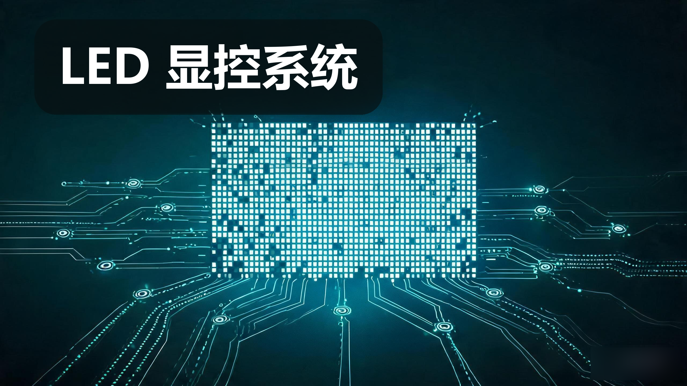
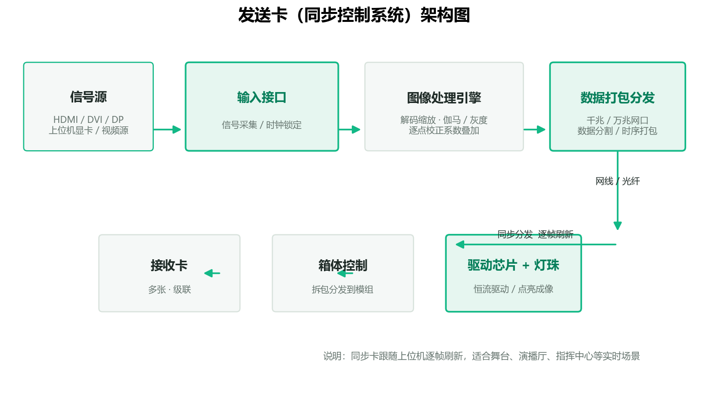
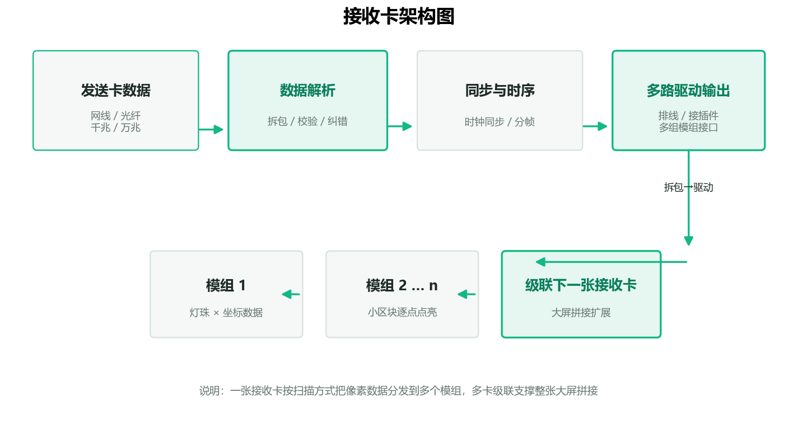
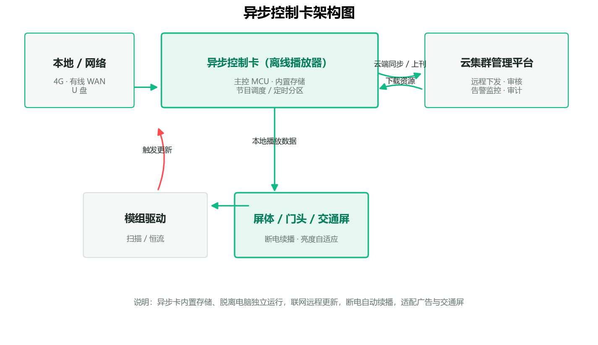
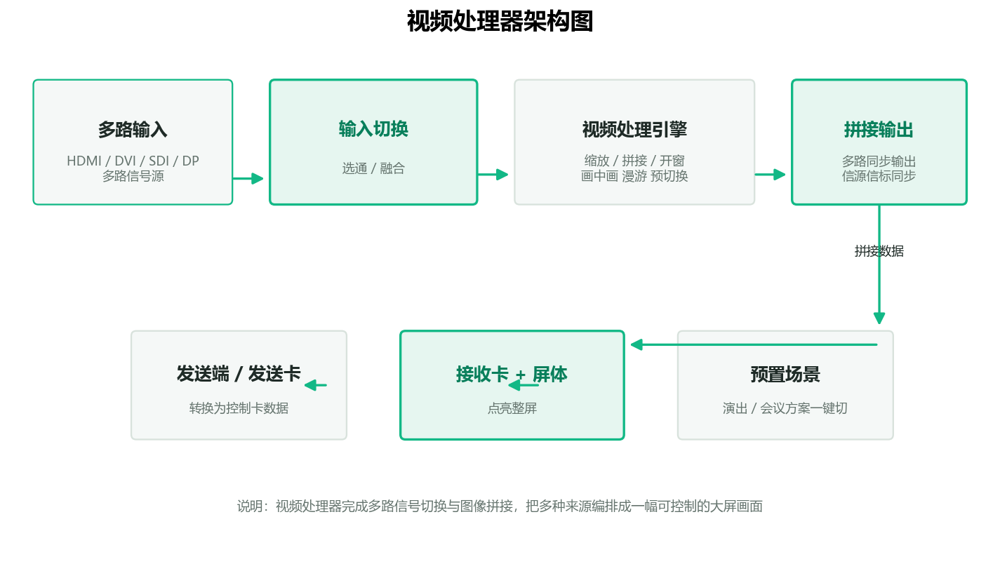
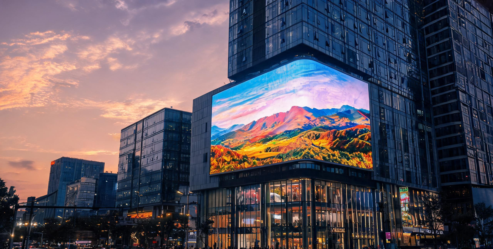
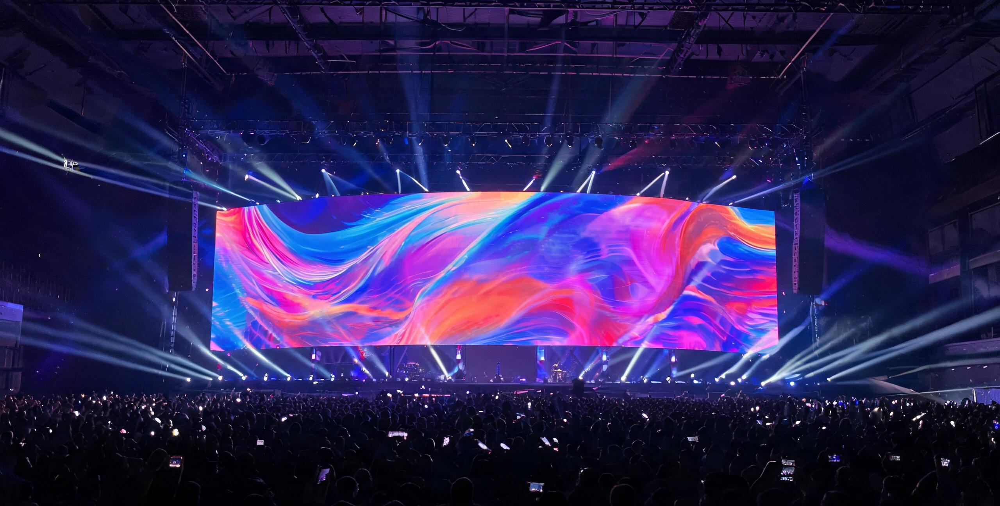
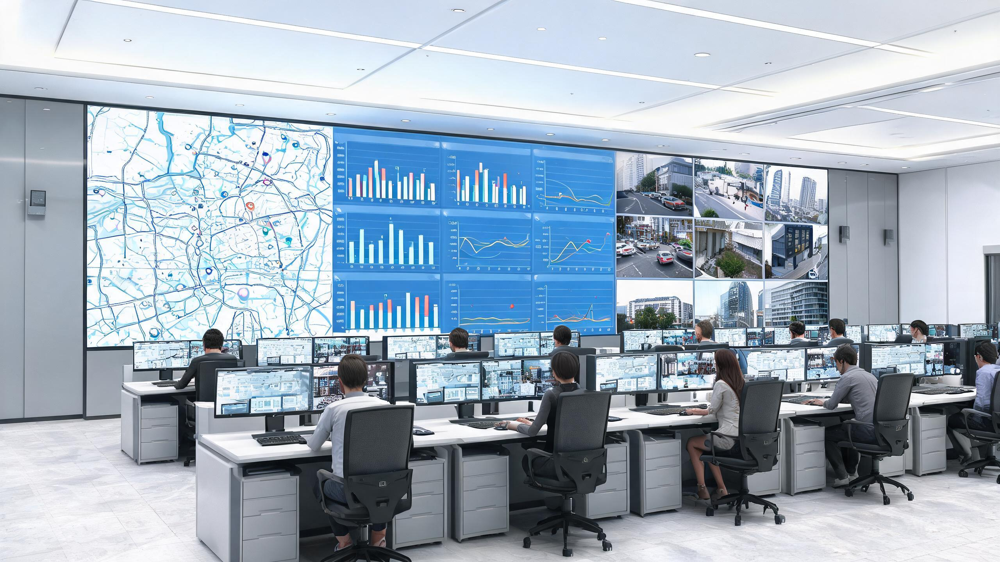
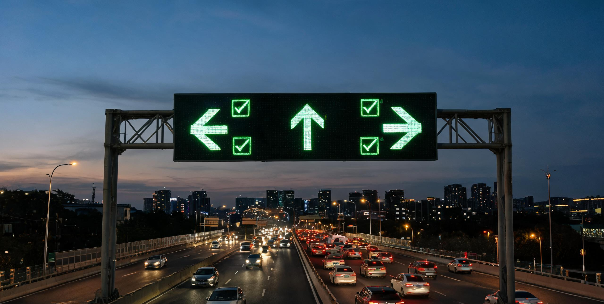

# LED 显示控制系统产品综述

---

##  一句话定位

**LED 显控系统 = 接收内容信号 → 处理 / 分割图像 → 驱动灯珠点亮 → 呈现画面的完整硬件链路**，是决定"显示效果好不好、系统稳不稳、好不好维护"的核心环节。

- 三大构成：信号源侧（发送/控制端）+ 屏体侧（接收端）+ 运行维护侧（后台管理）。

相比普通显示设备，LED 屏由上万颗自发光灯珠拼成，无法像 LCD 那样由一颗处理芯片直接驱动整块屏幕，而必须由显控系统把画面按屏体结构切分、分批驱动到每一颗灯珠。因此显控系统是 LED 工程中含金量最高、也最影响最终交付品质的一环。

---

## 一、产品设计方案

### 1.1 系统架构：三端结构

一套完整的 LED 显控系统由三个功能层构成：信号源侧的**发送端**、屏体侧的**接收端**，以及负责运营的**管理端**。工程选型时通常先定屏体，再据此反推两端设备的规格与数量。

| 层 | 角色 | 典型设备 | 一句话职责 |
| --- | --- | --- | --- |
| 发送端（上位/控制端） | 把信号变成可驱动的数据 | 发送卡、视频处理器、异步控制卡、视频发送盒 | 接收信号，完成图像处理与数据打包分发 |
| 接收端（下位/屏驱） | 把数据拆到每一颗灯珠 | 接收卡、箱体控制系统、驱动芯片协同 | 数据拆包，通过驱动芯片点亮对应灯珠 |
| 管理端（后台） | 让屏幕可运营、可维护、可审计 | 控制软件、集群管理平台 | 取流、排布、播放、监控、远程维护 |

### 1.2 主要产品形态与适用场景

| 形态 | 适用场景 | 关键能力 | 工程要点 |
| --- | --- | --- | --- |
| 同步控制系统 | 舞台、演播厅、指挥控制室 | 逐点实时显示、高刷新 | 跟随上位机逐帧刷新，响应快 |
| 异步控制系统 | 广告屏、门头屏、交通诱导屏 | 离线播放、分区上刊、远程下发 | 内置存储，脱离电脑独立运行 |
| 视频处理器 | 多路信号切换拼接的商用屏 | 图像拼接、缩放、画中画、场景预切 | 决定输入路数与拼接上限 |
| 一体化控制方案 | 商业显示 / 租赁快速部署 | 易维护、热插拔、快速搭拆 | 以箱体为最小维护单元 |

### 1.3 设计要点与差异化卖点

- **高清高刷**：刷新率、灰度等级、色深、色彩一致性（逐点校正）构成画面品质的四梁八柱。
- **低延迟**：信号到点亮的端到端延迟，满足直播、赛事与实时交互。
- **稳定性与冗余**：双备份、回读检测、断点续传、热插拔，保障 7×24 关键业务。
- **大屏拼控**：任意分屏、跨屏漫游、多信号叠加、预编排，服务指挥调度。
- **易用与运维**：可视化排布、远程监控、故障定位到模块，降低专职维护门槛。

### 1.4 设计中的工程约束

> **选型先算再选**：像素间距 P 值与观看距离直接相关，经验上最佳观看距离约为 **P × 1000**（P 为 mm）。间距越小越清晰，但单位面积灯珠越多、成本与驱动难度越高。户外远看用大间距（P6–P10），室内近看用小间距（P0.9–P2.5）。工程上要先把"多远的观众、多高的清晰度"确定下来，再反推屏体与显控规格。

---

## 二、产品核心参数

工程端选型的第一落点是"先算再选"：先定屏体分辨率、亮度、刷新率与灰度要求，再匹配发送卡、接收卡、视频处理器的规格。下面给出**选型公式 + 关键指标 + 三类设备的参数对照**（数值为工程通用区间示例）。

**选型公式速记**

- 屏体分辨率（宽=像素）= 屏宽（m）× 1000 ÷ 像素间距 P（mm）
- 最佳观看距离 ≈ P × 1000（mm）~ P × 3000（mm）
- 控制卡 / 处理器带载预留 ≥20% 余量
- ### 举例

  - **P2.5 屏**：最小观看距离约 **2.5 米**，最佳观看距离约 **2.5～7.5 米**，经验最佳距离约 **3.25 米**。
  - **P4 屏**：最小观看距离约 **4 米**，最佳观看距离约 **4～12 米**。
  - **P6 屏**：最小观看距离约 **6 米**，最佳观看距离约 **6～18 米**。

### 2.1 选型关键指标

| 指标 | 工程含义 | 典型区间 / 基准 |
| --- | --- | --- |
| 分辨率 | 屏体宽高像素数，决定控制卡带载需求 | 宽×高 pixel，由尺寸/间距定 |
| 像素间距 P | 决定清晰度与最小安全观看距离 | 室内 P0.9–2.5，户外 P4–10 |
| 刷新率 | 画面更新频率，拍摄无频闪前提 | 常用 ≥3840Hz，舞台可更高 |
| 灰度等级 | 明暗阶数，决定暗部细节 | 14 / 16 bit 为主流 |
| 亮度 | 发光强度，户外需高亮 | 室内 800–1500，户外 5000–8000 cd/㎡ |
| 色深 / 校正 | 色彩一致性、逐点校正精度 | 逐点亮/色度校正，sRGB/DCI-P3 |

### 2.2 发送卡 / 控制卡参数

| 参数项 | 说明 | 工程关注点 |
| --- | --- | --- |
| 最大带载分辨率 | 单卡可承载像素 | 大屏据此算卡数量与级联 |
| 输入接口 | HDMI / DVI / DP | 与信号源设备匹配 |
| 输出接口能力 | 千兆网口 / 万兆口数量 | 决定带载上限与带宽 |
| 支持刷新率 / 灰度 | 如 3840Hz、14bit | 体现显示上限，需协同接收端 |
| 逐点校正 | 亮色度校正系数回写 | 拼接大屏均匀性关键 |
| 回读 / 报错 | 回读检测、故障上报 | 远程运维友好度指标 |

### 2.3 接收卡参数

| 参数项 | 说明 | 工程关注点 |
| --- | --- | --- |
| 单卡带载像素 | 如 512×512、512×384 | 决定用卡数量与箱体布局 |
| 扫描方式 | 1/8 扫、1/16 扫等 | 须与模组驱动匹配 |
| 驱动芯片兼容 | 恒流 / 通用型 | 与屏体选型一致 |
| 校正 / 数据接口 | 逐点校正、千兆 / 万兆 | 画面均匀性与带宽 |

### 2.4 视频处理器参数

| 参数项 | 说明 | 工程关注点 |
| --- | --- | --- |
| 输入路数 / 接口 | HDMI / DVI / SDI / DP 数量 | 匹配信号源种类与数量 |
| 输出拼接能力 | 单机最大分辨率 / 拼接级数 | 超大规模屏需多机级联 |
| 缩放算法 | 边缘处理、缩放质量 | 影响小间距文字与线条观感 |
| 画中画 / 漫游 | 任意开窗、信号叠加 | 指挥调度多信号上屏能力 |
| 端到端延迟 | 信号到点亮总时延 | 实时交互 / 演出跟播关键 |

> **工程对接易踩坑**：供电与功耗、温湿度、线材规格与最大传输距离先确认；协议一致性（固件/协议与信源兼容）务必验证；控制卡/处理器按满载预留 ≥20% 余量，避免带宽与供电波动。

---

## 三、技术原理

### 3.1 显示根基：RGB 自发光与 PWM 混色

LED 屏每个像素由红（R）、绿（G）、蓝（B）三颗子像素灯珠构成。显控通过**脉宽调制（PWM）**调节每颗子像素在一个显示周期内的点亮占空比来控制亮度，三色按亮度比例叠加混色呈现目标颜色。灰度等级越高，亮度被切分的阶数越多，暗部过渡越细腻。

### 3.2 图像处理链路

从信号接入到灯珠亮起，经过一条流水线，每一步损耗都影响画质与实时性：

1. 信号接入（HDMI / DP）
2. 解码 / 缩放（图像适配）
3. 灰度处理（伽马校正）
4. **逐点校正（亮度均匀性）**
5. 数据打包（串行分发）
6. 灯珠驱动（点亮成像）

**逐点校正**是最影响交付品质的一环：出厂前逐颗采集灯珠亮度与色度，生成系数表回写，用软件补偿灯珠间离散差异，消除整屏亮暗斑块与色偏。校正精度越高（如 16bit 级），拼接大屏均匀性越好，也是衡量显控方案高低的分水岭之一。

### 3.3 驱动与控制机制：同步 vs 异步

- **同步系统**：跟随上位机逐帧刷新，适合实时演出、直播（见 3.4 发送卡架构）。
- **异步系统**：内置存储本地播放、脱离电脑独立运行，适合广告与交通屏（见 3.6 异步卡架构）。
- **扫描方式**：1/2、1/4、1/8、1/16 扫等，扫描数越高，单颗灯珠点亮时间越短，刷新与功耗越需平衡。

### 3.4 发送卡（同步控制系统）架构

发送卡完成"信号接入 → 图像处理 → 打包分发"的实时流水线，通过光纤/网线把帧同步数据分发到多张级联接收卡，逐帧刷新点亮屏体。

*图：发送卡架构——输入接口 → 图像处理引擎 → 数据打包分发 → 网线/光纤 → 接收卡/箱体 → 驱动芯片+灯珠*

### 3.5 接收卡架构

接收卡将收到的数据拆包、校验、同步分帧，再按扫描方式把像素数据分发到多个模组，多卡级联支撑大屏拼接。

*图：接收卡架构——发送卡数据 → 数据解析 → 同步时序 → 多路驱动输出 → 模组/级联扩展*

### 3.6 异步控制卡架构

异步卡内置存储、脱离电脑独立运行，通过 4G/有线/云平台远程上下刊与告警监控，断电自动续播，适配广告、门头、交通诱导屏。

*图：异步控制卡架构——本地/网络 + 云平台 ⇄ 异步卡（内置存储/定时分区）→ 模组驱动 → 屏体*

### 3.7 视频处理器架构

视频处理器完成多路信号切换与图像拼接，把多种来源编排成一幅可控制的大屏画面，并支持预置场景一键切换。

*图：视频处理器架构——多路输入 → 输入切换 → 视频处理引擎（缩放/拼接/开窗/漫游）→ 拼接输出 → 发送端/屏体*

### 3.8 高刷新与高灰的实现原理

高刷新通过**提高数据位宽与驱动时钟**、压低扫描占空比损耗来实现。刷新率不够时，相机/摄像机会拍到**扫描条纹（频闪）**，动态画面边缘也会发虚。因此舞台、演出现场与体育直播对刷新率要求极高，是显控高刷能力最直接的用武之地。

### 3.9 网络安全与可靠性

对公共屏而言，内容安全与长期可靠同样关键：文件**加密传输**、权限分级、防篡改保障播控内容不被入侵；**告警上报、远程运维、心跳检测**等闭环机制把故障从"人跑到现场"转变为"平台提前发现"。

---

## 四、应用场景

同一套显控能力映射到多个行业，按"痛点 → 方案 → 价值"展开。

### 4.1 商业显示与广告传媒

- **痛点**：多屏远程管理难、换刊慢、缺统一排期。
- **方案**：**异步控制 + 集群管理平台**，联网下发、定时播放、分区上刊。
- **价值**：上刊从"天级"降到"分钟级"，广告刊播效率与内容安全同步提升。

*图：户外广告 LED 大屏——异步控制 + 集群平台典型部署*

### 4.2 舞台演艺与租赁

- **痛点**：快速搭拆、多机位同步、直播无频闪、异形屏适配。
- **方案**：**同步控制 + 视频处理器**，多信号拼接、场景一键切换、高刷新免频闪。
- **价值**：创意呈现与现场转播画质双达标。

*图：舞台演艺 LED 屏——高刷免频闪、场景预切*

### 4.3 指挥调度与可视化

- **痛点**：多路监控 / 地图 / 数据同屏调度、跨屏联动、低延迟。
- **方案**：**小间距拼接 + 视频拼接器**，任意分屏、漫游、画中画。
- **价值**：决策信息一屏融合，调度响应提速，双备份保障 7×24 运行。

*图：指挥中心小间距大屏——多信号上屏 + 低延迟*

### 4.4 户外传媒与交通引导

- **痛点**：户外高亮、强光、高温、防潮，远距离维护成本高。
- **方案**：**户外专用控制 + 远程监控与故障定位、亮度自适应**。
- **价值**：硬件 + 软件双保险，户外可靠性有保证、下派维护次数显著减少。

*图：户外交通诱导屏——异地异步、断电续播、亮度自适应*

### 4.5 智慧城市与公众信息发布

- **痛点**：公共信息轮播、多部门协同、内容安全审查。
- **方案**：**一体化发布平台 + 安全管控**，联网统一发布与监管。
- **价值**：信息触达广、发布统一、全程可审计可追溯。

---

## 五、实际案例与设计方案

按"需求 → 方案设计 → 配置核算 → 交付价值"四段式呈现（数值为演示估算）。

### 案例 A · 户外广告屏异步控制（点位分散、统一管理）

- **项目需求**：数十个点位分散部署，需统一排期、远程换刊、定时开关机，内容安全可控。
- **方案设计**：异步控制卡 + 云集群平台（下发 / 审核 / 监控），每屏 4G 或有线联网。
- **配置核算示例**：P10 户外屏 10m × 4m → 分辨率约 1000 × 400；按单卡带载上限核算需 1–2 张异步卡 + 若干接收卡，预留 ≥20% 余量。
- **交付价值**：上刊周期从天级降到分钟级，告警集中收敛，安全事故可回溯。

### 案例 B · 舞台租赁同步显示（快速搭建 + 直播无频闪）

- **项目需求**：演唱会主屏，多机位同步，摄像转播不能有摩尔纹 / 频闪，画面高刷新高灰。
- **方案设计**：同步发送系统 + 视频处理器；接收卡每箱体一张、热插拔预留。
- **配置核算示例**：P3.9 主屏 + 侧屏，核算总像素后确定视频处理器单机输出带载，超限则多机级联。
- **交付价值**：搭建从小时级压缩，场景切换一键完成，转播画面品质稳定。

### 案例 C · 指挥中心小间距拼接（多信号上屏 + 低延迟）

- **项目需求**：监控、地图、业务数据多路信号同屏，跨屏联动，操作员实时决策。
- **方案设计**：小间距（P1.5 级）屏 + 视频拼接处理器，任意开窗、漫游、信号源分组调度。
- **配置核算示例**：以墙面尺寸算输出分辨率，再按 4K 输入路数评估处理器输入卡数量与拼接能力。
- **交付价值**：信息一屏融合、调度响应提速，双备份保障 7×24 连续运行。

### 案例 D · 交通诱导 / 门头屏异步本地播放（离线可靠运行）

- **项目需求**：断电重启自动续播、断网本地轮播、恶劣户外环境长寿命。
- **方案设计**：异步控制卡内置存储 + 断电续播 + 温湿度与亮度自适应，支持分时段分区显示。
- **交付价值**：离线不丢内容，远程批量更新，运维下派次数显著减少。

### 案例设计通用核算清单（工程落地检查表）

- [ ] 屏体分辨率 → 反推控制卡 / 处理器带载与数量（预留 ≥20% 余量）。
- [ ] 信号源格式与接口匹配 → 确认输入卡与线材规格、最大距离。
- [ ] 亮度 / 刷新率 / 灰度 → 匹配接收卡扫描方式与驱动芯片能力。
- [ ] 冗余与热插拔 → 关键 7×24 场合双备份，预算内预留。
- [ ] 网络与内容安全 → 平台权限、加密、审计链路设计。

---

## 六、市场背景与竞争格局

### 6.1 为什么值得做

超高清与 **Mini/Micro LED** 升级推动存量更换，文旅、赛事、数字政府等政策红利持续拉动屏显建设，商业显示与公共传播数字化带来稳定增量。显控作为连接内容与屏幕的核心环节，随屏保有量扩大同步增长，且具备"平台化服务"的溢价空间。

### 6.2 竞争与壁垒

| 竞争维度 | 核心壁垒 / 差异点 |
| --- | --- |
| 图像处理算法 | 缩放、边缘、亮色一致性的算法成熟度 |
| 逐点校正精度 | 校正位宽与均匀性，拼接大屏观感分水岭 |
| 高刷高灰能力 | 刷新率 / 灰度上限，决定高端场景入场券 |
| 集群运维平台 | 远程管控、告警、审计的平台成熟度 |
| 生态兼容性 | 与主流驱动芯片 / 屏体 / 信源兼容广度 |
| 成本与交付 | 标准化产品 + 快速响应的服务网络 |

> 行业内既有诺瓦、卡莱特、灵星雨、仰邦、摩西尔等厂商（示例，供横向分析参考），竞争焦点已从单一硬件参数转向"**算法 + 平台 + 服务**"的综合能力。

### 6.3 商业模式与趋势

- **交付形态**：硬件销售 + 软件授权 / 平台订阅 + 运维服务，服务化带来更高复购。
- **技术趋势**：Mini/Micro LED 高密度化、COB 封装、按内容自适应亮度与健康护眼、国产化替代与国产控制标准。

---

