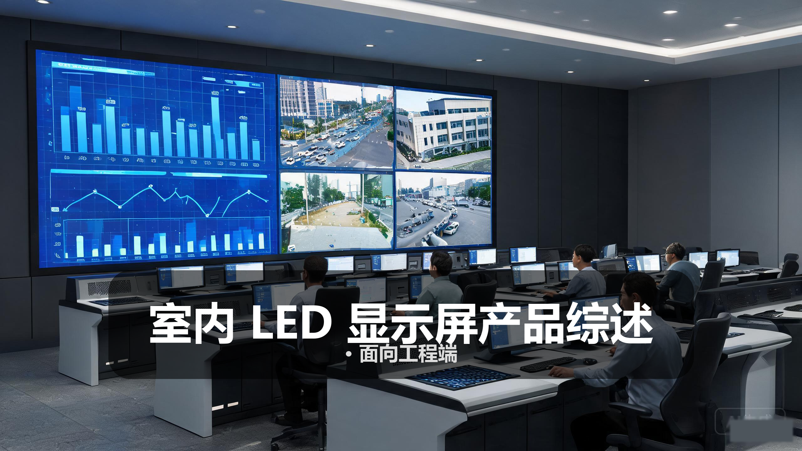
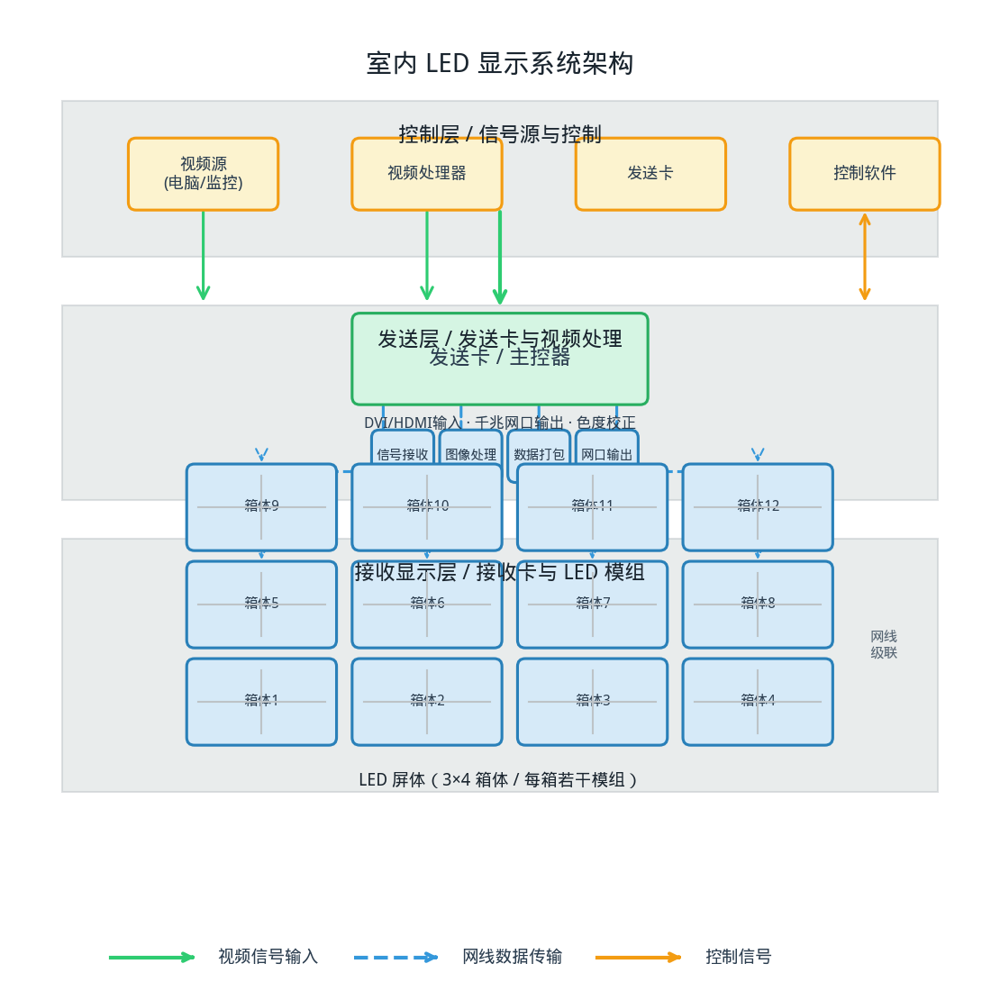
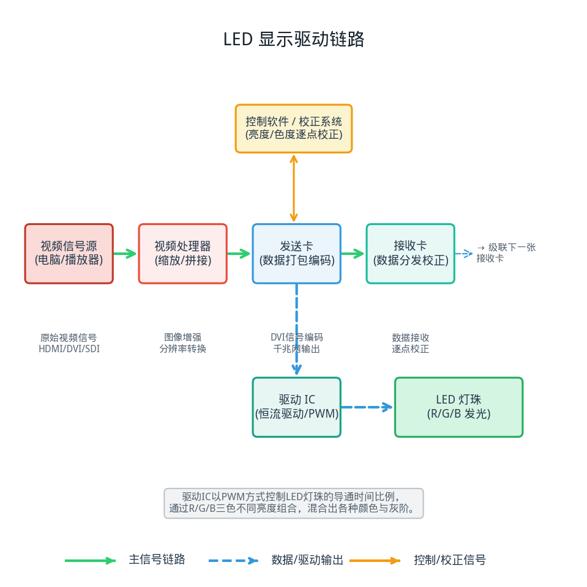
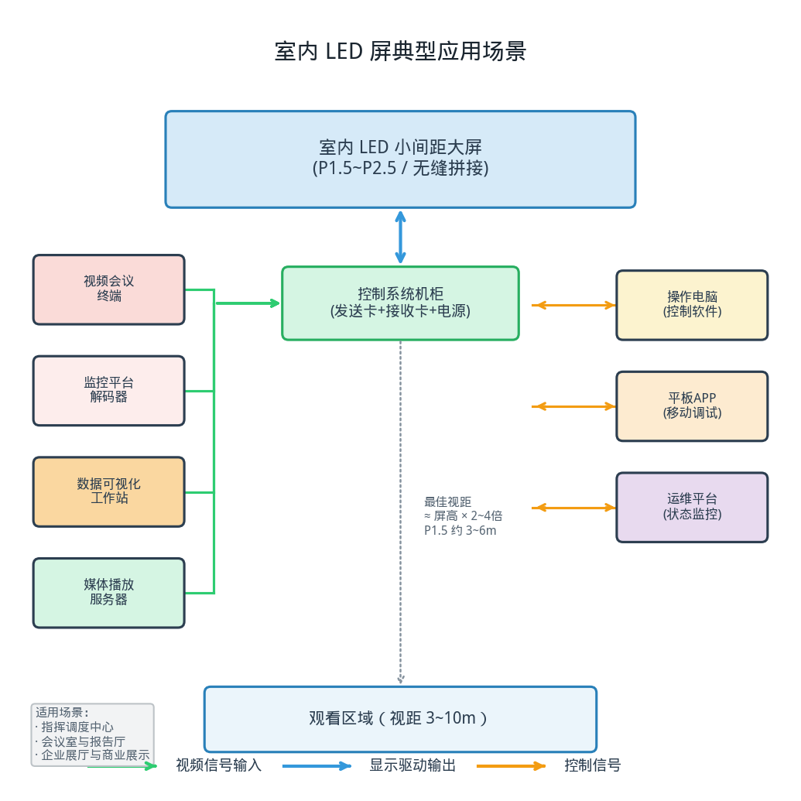

> 
> *概念图：室内 LED 小间距显示屏指挥中心应用示意*

# 室内 LED 显示屏产品综述

## · 面向工程端

---

## 〇 一句话定位

室内 LED 显示屏是以微小间距灯珠为像素单元的无缝拼接大屏，通过 R/G/B 三原色灯珠自发光实现高亮度、高对比度、大尺寸的室内显示，是指挥中心、高端会议室与商业展示场景中追求极致视觉效果的核心显示方案。

> 简单说，就是把成千上万个只有针尖大小的 LED 灯珠，像马赛克一样密密麻麻地排列在模组上，再把一块块模组拼成整面墙——没有边框、没有拼缝、想做多大就做多大，近看是灯珠、远看是一幅完整的高清大画面。

---

## 一、产品设计方案

### 1.1 系统组成全景

一套完整的室内 LED 显示系统由四层构成：**信号源层 → 控制处理层 → 接收驱动层 → 显示模组层**。

信号源层负责提供各种输入信号，包括电脑主机、视频会议终端、监控解码器、媒体播放器等；控制处理层是系统的大脑，由视频处理器和发送卡组成，负责信号采集、图像处理、数据编码和分配输出；接收驱动层由分布在每个箱体上的接收卡和驱动 IC 构成，负责把网口传来的数据转换成驱动灯珠的电流信号；显示模组层就是 LED 灯珠阵列本身，是最终发光成像的载体。

*图 1：室内 LED 显示系统架构示意（控制层 → 发送层 → 接收显示层）*

### 1.2 模组与箱体结构

LED 显示屏的基本组成单元是**模组**（Module），若干个模组拼装在一个箱体上构成**箱体**（Cabinet），多个箱体再拼接成整面大屏。

**模组**是最基础的显示单元，由 PCB 板、LED 灯珠、驱动 IC、面罩等组成。常见模组尺寸有 320×160mm、320×240mm、256×128mm 等，模组尺寸通常是像素间距的整数倍，方便计算分辨率。例如 P1.5 的 320×160mm 模组，分辨率就是 (320/1.5) × (160/1.5) ≈ 213 × 107 点。

**箱体**是模组的安装载体，也是结构和散热单元。室内屏箱体通常采用压铸铝材质，重量轻、精度高、散热好。标准箱体尺寸常见为 640×480mm、640×640mm、480×480mm 等。箱体之间通过定位销和快速锁扣连接，确保拼接精度。

**面罩**是覆盖在灯珠表面的一层黑色塑料罩，作用有三个：一是保护灯珠免受碰撞和灰尘；二是吸收环境光，提高对比度（黑色面罩比白色面罩对比度高很多）；三是让灯珠之间的黑色区域更均匀，提升视觉一致性。

### 1.3 点间距与像素密度

点间距（Pixel Pitch）是 LED 显示屏最核心的参数，指相邻两个像素中心之间的距离，单位为毫米。点间距越小，像素密度越高，画面越细腻，但价格也越贵。

室内 LED 屏的点间距通常在 P0.9 到 P5 之间：

| 点间距 | 像素密度（点/m²） | 最佳视距 | 定位 |
|-------|-----------------|---------|------|
| P0.9 | 约 1,234,568 | 1.5~3m | 超高端 / 近距观看 |
| P1.25 | 约 640,000 | 2~4m | 高端会议室 / 展厅 |
| P1.5 | 约 444,444 | 3~6m | 中高端指挥中心 |
| P1.875 | 约 284,444 | 4~8m | 主流指挥 / 监控 |
| P2 | 约 250,000 | 5~10m | 性价比主流 |
| P2.5 | 约 160,000 | 6~12m | 入门室内 / 大视距 |
| P3 | 约 111,111 | 8~15m | 大空间 / 远距离 |

> 最佳视距经验公式：最佳视距（米）≈ 点间距（mm）× 2000 / 1000 = 点间距 × 2。例如 P1.5 的最佳视距约为 3 米，P2.5 约为 5 米。这是行业通用经验估算，实际还受内容类型、观看习惯等因素影响。

### 1.4 封装技术演进

LED 灯珠的封装方式直接影响显示效果和可靠性，室内小间距屏主要经历了三代封装技术：

**第一代：SMD 表贴封装（约 2010~2018 年）**
SMD（Surface Mount Device）是把 R、G、B 三颗灯珠封装在一个支架里，形成一个 SMD 灯珠。常见规格有 SMD 2121、SMD 1515、SMD 1010 等，数字代表灯珠的长宽尺寸（0.1mm 为单位）。SMD 封装的优点是技术成熟、成本低，缺点是灯珠之间有间隙、对比度不够高、墨色不均匀。

**第二代：IMD 集成封装（约 2018~2022 年）**
IMD（Integrated Mounted Devices）是把 4 组或更多组 R/G/B 灯珠集成封装在一个模组里，形成一个集成封装单元。常见规格有 IMD 4合1、IMD 9合1 等。IMD 的优点是灯珠密度更高、墨色更均匀、对比度更好、防护性更强，是当前 P1.2~P2 间距的主流方案。

**第三代：Micro LED / COB 封装（2022 年至今）**
COB（Chip On Board）是把 LED 芯片直接封装在 PCB 板上，然后再覆盖一层胶层。COB 的优点是像素密度可以做得更高（P0.9 以下）、对比度更高、防护性更好、光效更高。缺点是维修难度大（单灯损坏需整面维修）、色彩一致性难度高。Micro LED 是 COB 的进一步演进，芯片尺寸更小，但目前成本极高，距大规模商用还有距离。

### 1.5 散热与可靠性设计

室内 LED 屏虽然亮度不如户外屏，但单位面积的灯珠数量更多，热量密度并不低。散热设计关系到屏体的寿命和光衰速度。

散热方式主要有两种：
- **被动散热**：依靠大面积金属箱体和 PCB 铜箔自然散热，无风扇、无噪音，适合对静音要求高的场景（如会议室、报告厅）。压铸铝箱体的散热效果较好，是被动散热的首选结构。
- **主动散热**：在箱体内部安装散热风扇，强制对流散热。适合高亮度、长时间连续运行的场景，风扇通常为智能温控，温度低时停转或低速运转。

可靠性指标方面，室内 LED 屏的 MTBF（平均无故障时间）标称值通常在 50000~100000 小时区间。灯珠寿命通常用"半衰期"衡量——亮度衰减到初始亮度的 50% 时的累计工作时间，行业通用基准约为 50000~100000 小时，实际寿命受工作温度、电流大小、使用环境等因素影响。

### 1.6 工程约束条件

室内 LED 屏的工程实施需要提前规划多个约束条件：

- **安装空间**：需确认安装位置的宽度、高度、进深是否满足屏体尺寸和维护通道要求。
- **承重要求**：室内 LED 屏单位面积重量约 25~45kg/m²（取决于箱体材质和结构），整屏面积大时总重量可观。壁挂安装需确认墙体承重，落地安装需确认地面承重 ≥ 500kg/m²。
- **维护通道**：后维护方式需在屏体后方预留至少 600mm 的检修通道；前维护方式则无需后部空间，但屏体可以向前弹出，需要前方有足够空间。
- **供电规划**：室内屏单位面积功耗约 200~600W/m²（平均功耗约为最大功耗的 30%~50%），需根据屏体面积核算总功耗并预留 30% 冗余。
- **散热条件**：安装环境温度应控制在 0~40℃ 之间，最佳工作温度 20~30℃。屏体周围需留有通风空间，密闭空间需加装空调。
- **信号传输距离**：发送卡到接收卡的网线传输距离一般不超过 100 米（超五类/六类网线），超过距离需使用光纤收发器。
- **平整度要求**：LED 屏对安装结构的平整度要求很高，结构误差会导致拼缝不齐、画面错位。箱体拼接精度通常要求 ±0.1mm 以内。

---

## 二、核心参数与选型

### 2.1 选型公式与关键指标

室内 LED 屏的选型有一套可量化的计算方法，工程人员掌握以下公式，就能快速完成初步选型。

**① 最佳视距与点间距的关系**

最佳视距（米）≈ 点间距（mm）× 2

这是最常用的经验公式。反过来，知道观看距离也可以推算所需的点间距：

点间距（mm）≈ 最佳视距（米）/ 2

举个例子：如果观看距离是 5 米，按公式推算点间距约为 P2.5；如果观看距离是 3 米，点间距约为 P1.5。

> 注意：这是"能看出像素颗粒感"的临界距离。如果对画面细腻度要求高，可以选更小一点的间距；如果主要显示视频和大画面，间距稍大也可以接受。

**② 屏体尺寸与箱体数量的换算**

先确定单箱体尺寸和点间距，再根据目标显示面积计算行×列数。

以 P1.5、640×480mm 压铸铝箱体为例：
- 单箱分辨率：(640/1.5) × (480/1.5) ≈ 426 × 320 点
- 目标屏体宽 8m、高 3m：
  - 列数 = 8000mm / 640mm = 12.5 → 取 12 列（宽 7680mm）或 13 列（宽 8320mm）
  - 行数 = 3000mm / 480mm = 6.25 → 取 6 行（高 2880mm）或 7 行（高 3360mm）
- 选 12 列 × 6 行 = 72 个箱体，整屏尺寸 7680 × 2880mm

> 注意：箱体数量必须是整数，实际屏体尺寸不一定刚好等于目标尺寸，需要在设计阶段确认并调整。

**③ 整屏分辨率计算**

整屏分辨率 = 单箱分辨率 × 行/列数

以上述 12 列 × 6 行 P1.5 为例：
- 整屏分辨率 = (426×12) × (320×6) = 5112 × 1920（约 981 万像素）

**④ 功耗与供电核算**

最大功耗 = 单位面积最大功耗 × 屏体面积
平均功耗 ≈ 最大功耗 × 0.3~0.5（取决于显示内容，全白画面功耗最高，全黑最低）

以 P1.5 室内屏为例，单位面积最大功耗约 500W/m²，屏体面积约 22.12m²：
- 最大功耗 ≈ 500 × 22.12 ≈ 11,060W ≈ 11kW
- 平均功耗 ≈ 11 × 0.4 ≈ 4.4kW
- 供电容量需 ≥ 11 × 1.3 ≈ 14.3kW

### 2.2 核心部件参数表

**LED 灯珠核心参数**

| 参数项 | 典型值范围 | 工程关注点 |
|-------|-----------|-----------|
| 点间距 | P0.9 / P1.25 / P1.5 / P1.875 / P2 / P2.5 | 决定像素密度和最佳视距 |
| 封装方式 | SMD / IMD / COB | 影响对比度、墨色、维修方式 |
| 灯珠品牌 | 国星/晶台/兆驰/三安/ Cree/Nichia | 灯珠品质直接影响寿命和光衰 |
| 亮度 | 500 / 800 / 1000 / 1500 cd/m² | 普通室内 500~800 足够，窗边需更高 |
| 刷新率 | 1920Hz / 3840Hz / 7680Hz | 拍摄无频闪的关键，越高越好 |
| 灰度等级 | 14bit / 16bit / 18bit | 灰阶级数越多，色彩过渡越细腻 |
| 视角 | 水平 160°/ 垂直 140°（典型） | 宽视角产品侧看色彩和亮度衰减小 |
| 对比度 | 3000:1 / 5000:1 / 10000:1 | 黑灯 + 黑面罩对比度更高 |

*注：以上为行业通用工程基准范围，具体参数因品牌、型号、配置而异。*

**控制系统参数**

| 参数项 | 典型值范围 | 工程关注点 |
|-------|-----------|-----------|
| 发送卡带载 | 130 万 / 260 万 / 520 万像素 | 根据整屏分辨率计算所需发送卡数量 |
| 接收卡带载 | 256×256 / 512×256 / 512×512 像素 | 根据箱体分辨率计算每箱接收卡数量 |
| 网口数量 | 发送卡 4/8/16 个网口 | 每个网口带载一定像素，计算网口分配 |
| 输入接口 | HDMI / DVI / DP / SDI | 支持的信号源类型 |
| 校正功能 | 亮度校正 / 色度校正 / 逐点校正 | 保证整屏色彩和亮度一致性的关键 |
| 控制方式 | C/S 客户端 / B/S 网页 / 手机 APP | 不同场景选择不同控制方式 |

**箱体与结构参数**

| 参数项 | 典型值范围 | 工程关注点 |
|-------|-----------|-----------|
| 箱体材质 | 压铸铝 / 型材铝 / 钣金 | 压铸铝精度高、散热好，是主流 |
| 箱体尺寸 | 480×480 / 640×480 / 640×640 mm | 需与点间距匹配，分辨率为整数 |
| 箱体重量 | 6~15kg/箱 | 影响安装结构和承重要求 |
| 拼接精度 | ±0.1mm / ±0.2mm | 拼缝越精准，画面越平整 |
| 维护方式 | 前维护 / 后维护 | 前维护节省后部空间，后维护结构简单 |
| 防护等级 | IP30 / IP40 / IP54（室内） | 室内一般 IP30~IP40，防尘要求高可选 IP54 |
| 安装方式 | 壁挂 / 落地 / 吊装 / 镶嵌 | 根据安装环境和结构条件选择 |

### 2.3 工程对接踩坑点

以下是 LED 屏工程实施中最容易出问题的环节，提前识别可以避免大量返工。

**坑点 1：箱体模数与目标尺寸不匹配**

LED 屏的尺寸受箱体尺寸限制，不是任意尺寸都能做。如果前期只告诉客户"做 8 米宽 3 米高"，但实际箱体拼出来是 7.68 米或 8.32 米，就会出现尺寸不符的问题。

应对措施：选型阶段就用箱体模数算出精确尺寸，提前告知客户实际屏体尺寸；如果对尺寸有严格要求，需要定制非标箱体，但成本会增加。

**坑点 2：刷新率不够导致拍摄频闪**

LED 屏是靠 PWM（脉冲宽度调制）调光的，如果刷新率不够高，用手机或相机拍摄时会出现滚动的黑色条纹（水波纹）。在会议室、展厅等经常有人拍照录像的场景，这个问题会非常明显。

应对措施：选择高刷新率产品，拍摄场景建议刷新率 ≥ 3840Hz；重要场合提前用手机和相机测试拍摄效果；有些产品支持"拍照模式"，可以临时提高刷新率或调整相位。

**坑点 3：平整度差导致拼缝明显**

LED 屏虽然没有物理拼缝，但如果箱体拼接不平整，相邻箱体之间有高低差或缝隙，在一定角度观看时会出现"暗线"或"亮线"，影响视觉效果。

应对措施：选择高精度压铸铝箱体；安装结构必须有足够的刚度和平整度；安装后用专用工具逐箱调整平整度，确保拼缝 ≤ 0.2mm。

**坑点 4：供电规划不足导致跳闸或压降**

LED 屏最大功耗出现在全白画面时，虽然实际使用中很少出现全白，但系统设计必须按最大功耗核算。如果供电回路容量不够，会导致跳闸、电压不稳，甚至损坏电源模块。

应对措施：按"单位面积最大功耗 × 面积 × 1.3 冗余系数"核算总功耗；分多路供电，每路电流不超过 16A；配置 UPS 不间断电源，防止突然断电损坏设备；做好接地保护。

**坑点 5：网线距离超限导致信号不稳定**

发送卡到接收卡的网线传输距离受网线规格限制，超五类线一般不超过 100 米。如果距离超限，会出现画面闪烁、丢点、甚至无信号等问题。

应对措施：提前测量走线距离，超过 100 米时使用光纤收发器；网线使用六类以上规格，做好屏蔽和接地；关键链路预留备用网线。

**坑点 6：色彩一致性差导致"花屏"**

不同批次的灯珠可能存在亮度和色度差异，如果整屏使用了不同批次的灯珠，或者后期维修更换了不同批次的模组，就会出现一块亮一块暗、一块偏色的"花屏"现象。

应对措施：采购时要求整屏使用同一批次的灯珠；到货后先逐箱检查亮度和色彩一致性；系统调试时必须做整屏逐点亮度校正和色度校正；维修更换时尽量使用同批次备件，或更换后重新校正。

**坑点 7：维护空间预留不够**

LED 屏的维护方式直接影响空间需求。后维护需要屏后有人能进去的通道，前维护虽然不需要后部空间，但屏体要能向前弹出，需要前方有操作空间。设计阶段如果只看正面效果、忽略维护空间，后期检修会非常麻烦。

应对措施：后维护方式至少预留 600mm 维护通道，800mm 以上更舒适；空间有限时选择前维护产品；前维护方案需确认前方有足够的弹出空间（通常需 400~600mm）；设计时在屏体两侧或底部预留检修口。

---

## 三、技术原理

### 3.1 LED 发光基础

LED（Light Emitting Diode，发光二极管）是一种能将电能转化为光能的半导体器件。LED 的核心是一个 PN 结，当电流通过 PN 结时，电子和空穴复合，能量以光子的形式释放出来，发出特定波长的光。

不同的半导体材料发出不同颜色的光：
- **红色 LED**：通常使用铝镓砷（AlGaAs）或镓磷（GaP）材料，波长约 620~630nm
- **绿色 LED**：通常使用磷化镓（GaP）或铟镓氮（InGaN）材料，波长约 520~530nm
- **蓝色 LED**：通常使用氮化镓（GaN）或铟镓氮（InGaN）材料，波长约 460~470nm

LED 显示屏上的每一个像素由 R（红）、G（绿）、B（蓝）三颗 LED 灯珠组成（SMD 封装是三颗灯珠封装在一起，COB 是三颗芯片直接封装在板上）。通过控制三颗灯珠各自的亮度比例，可以混合出各种不同的颜色——这就是 RGB 加色混色原理。

### 3.2 动态扫描与恒流驱动

LED 显示屏不是每个像素都一直亮着的，而是采用**动态扫描**的方式工作。

动态扫描的原理是：把一整行或一整列的 LED 灯珠快速轮流点亮，利用人眼的视觉暂留效应，让人感觉所有灯珠都在同时发光。扫描方式有 1/8 扫、1/16 扫、1/32 扫等，数字越小，同一时刻点亮的灯珠比例越低，单颗灯珠的瞬间电流越大。

驱动 LED 灯珠需要使用**恒流驱动芯片**（恒流 IC）。为什么必须是恒流而不是恒压？因为 LED 的伏安特性很陡——电压稍微变化一点，电流就会变化很多，而 LED 的亮度与电流正相关。如果用恒压驱动，由于每颗 LED 的正向压降略有不同，亮度就会不均匀。恒流驱动可以保证每颗 LED 的电流一致，从而保证亮度一致。

恒流 IC 的主要功能是：
1. 接收来自接收卡的串行数据
2. 将数据锁存到对应的输出通道
3. 以恒定电流驱动对应的 LED 灯珠
4. 配合 PWM 调光实现灰阶控制

### 3.3 PWM 调光与灰度等级

人眼看到的 LED 亮度不是由电流大小控制的（虽然电流也能调亮度，但会改变色偏），而是由** PWM（脉冲宽度调制）**控制的——简单说就是让 LED 快速闪烁，亮的时间比例越长，人眼感觉越亮。

具体原理是：在一个扫描周期内，让 LED 亮一段时间、灭一段时间，只要闪烁频率足够高（高于人眼的临界融合频率，约 50~60Hz），人眼就感觉不到闪烁，只会感觉到平均亮度。亮的时间占整个周期的比例叫做"占空比"，占空比越大，亮度越高。

灰度等级就是亮度能分出多少级。14bit 灰度意味着有 2¹⁴ = 16384 级亮度，16bit 灰度就是 65536 级。灰阶级数越多，色彩过渡越细腻，暗部细节越丰富。

刷新率和灰度是一对矛盾——刷新率越高，每一帧的时间越短，能分配给 PWM 的时间就越少，灰阶级数就越低。高端驱动 IC 通过 GCLK（全局时钟）倍频、PWM 优化等技术，在保证高刷新率的同时也能维持高灰度。

*图 2：LED 显示驱动链路示意（信号源 → 视频处理 → 发送卡 → 接收卡 → 驱动 IC → LED 灯珠）*

### 3.4 逐点校正技术

由于 LED 灯珠的制造公差，即使是同一批次的灯珠，亮度和波长也会有微小差异。这些差异在单颗看时不明显，但成千上万颗拼在一起形成大屏后，就会出现亮度不均匀、色块、麻点等问题，看起来像"花屏"。

**逐点校正**就是解决这个问题的技术。校正分为两个层次：

**亮度校正**
用专业的相机（或亮度计）拍摄整屏每一颗灯珠的亮度，得到每颗灯珠的实际亮度值。然后以最暗的那颗灯珠为基准（或设定一个目标亮度），让比基准亮的灯珠降低亮度（通过 PWM 调整占空比），从而使整屏所有灯珠的亮度一致。代价是整体亮度会有所下降。

**色度校正**
比亮度校正更进一步，不仅校正亮度，还校正颜色。通过测量每颗 R/G/B 灯珠的实际波长和亮度，计算出每个像素的色彩偏移，然后通过数字方式调整 R/G/B 三路的比例，使整屏的色彩趋于一致。色度校正需要更精密的测量设备（如分光辐射计），效果也更好。

逐点校正是室内小间距 LED 屏的必备工艺——没有做过逐点校正的屏，近看会有明显的颗粒不均和色块，严重影响显示效果。

### 3.5 高刷高灰与低亮高灰

室内 LED 屏有两个关键的显示质量指标，经常被一起提起：**高刷高灰**和**低亮高灰**。

**高刷高灰**
"高刷"指高刷新率，"高灰"指高灰度等级。高刷保证拍摄时无频闪、运动画面流畅无拖影；高灰保证色彩过渡细腻、暗部细节丰富。低端产品为了提高刷新率，会牺牲灰阶；高端产品则通过更高的 GCLK 频率、更先进的驱动 IC 架构，同时做到高刷和高灰。

**低亮高灰**
室内环境光线较暗，LED 屏往往需要降低亮度使用。但亮度降低时，PWM 的占空比变小，低灰阶的有效位数会减少——原本 16bit 的灰度，亮度降到 1/4 时，有效灰度可能就只剩 14bit 了。低亮低灰的表现是：画面暗部出现色块、色阶断裂、细节丢失。

"低亮高灰"就是在低亮度下仍然保持高灰度等级的技术。实现方式主要有：提高驱动 IC 的 PWM 分辨率（如 22bit 以上的 PWM 计数）、使用 GCLK 倍频技术、采用高帧率刷新策略等。低亮高灰是衡量室内 LED 屏画质优劣的重要指标。

### 3.6 冗余与可靠性设计

用于指挥中心、监控室的 LED 显示系统通常要求 7×24 小时不间断运行，因此可靠性设计非常重要。

常见的可靠性设计包括：

- **电源冗余**：关键位置的箱体配置双电源模块，一路电源故障时另一路自动接管，不影响显示。
- **信号双备份**：重要项目采用 A/B 双路信号输入，主路信号中断时自动切换到备路，切换时间通常在毫秒级。
- **模组热插拔**：部分高端产品支持模组热插拔——不需要断电，直接从前面拔出故障模组更换新模组，维修时间短、不影响其他区域显示。
- **温度监控与保护**：箱体内置温度传感器，温度过高时自动降低亮度或触发告警，防止过热损坏。
- **静电防护**：LED 灯珠对静电敏感，工业级产品在接口、电源入口都有 ESD 防护设计。
- **电源缓启动**：整屏同时上电时冲击电流很大，电源缓启动功能可以让屏体逐块、逐行上电，避免冲击电流跳闸。

---

## 四、产品功能与差异化

### 4.1 核心显示功能

**整屏显示**
整屏显示是最基础的功能——把一路信号全屏显示在整个 LED 大屏上。LED 屏的整屏显示有一个天然优势：没有物理拼缝，画面完全连贯。整屏分辨率取决于点间距和屏体面积，P1.5 的 8×3 米屏整屏分辨率可达 5120×1920 以上。

**分屏显示**
分屏显示就是把多路信号同时显示在大屏上，每路信号占据一定区域。常见的分屏模式有 1 分屏、4 分屏、9 分屏、16 分屏等。分屏显示在监控场景非常常用，可以同时查看多路监控画面。

**任意开窗与漫游**
任意开窗是 LED 控制系统最有价值的功能之一。操作人员可以在大屏任意位置打开窗口，显示任意一路信号源，窗口大小可以自由调整，还可以跨屏自由移动（漫游）。窗口数量取决于处理器和发送卡的能力，从 4 个到几十个不等。

**画面叠加（PIP / POP）**
画中画（PIP）是在主画面上叠加一个小窗口显示另一路信号，画外画（POP）是在主画面旁边开小窗口。叠加功能在视频会议、远程培训等场景中很常用。

**场景预设与轮巡**
场景预设是把当前的窗口布局、信号源选择、显示参数等保存为一个"场景"，下次需要时一键调用。场景轮巡则是按照预设的时间间隔，自动在多个场景之间切换，适合监控室自动轮巡查看多路摄像头。

### 4.2 增强功能

**4K / 8K 超高清输入支持**
随着 4K 信号源越来越多，LED 控制系统的 4K 输入能力成为标配。高端产品还支持 8K 输入，配合高像素密度的小间距屏，可以实现超高清大画面显示。

**HDR 高动态范围显示**
HDR 可以显示更宽的亮度范围和更丰富的色彩层次。LED 屏天生具有高对比度和高亮度的优势，是实现 HDR 效果的理想显示载体。HDR 对 LED 屏的亮度、对比度、灰阶都有较高要求，通常需要 1000cd/m² 以上的峰值亮度和 16bit 以上的灰度。

**3D 显示支持**
部分高端室内 LED 屏支持主动式 3D 显示——通过高速切换左右眼画面，配合主动快门式 3D 眼镜，实现立体显示效果。3D LED 屏在科技馆、主题展馆等场所有一定应用。

**触控交互**
在 LED 屏前面加装红外触控框或电容触控膜，大屏就变成了可触摸的互动大屏。触控交互在企业展厅、教育、会议等场景很有价值。LED 触控的难点在于大屏触控的精准度和响应速度，以及触控层对显示效果的影响。

**智能亮度调节**
屏体内置环境光传感器，根据环境光线强度自动调节屏体亮度——环境亮时提高亮度保证可见度，环境暗时降低亮度保护眼睛、节省能源、减少光衰。

**远程管理与状态监控**
工业级 LED 系统支持 SNMP 网络管理协议，可以接入机房统一监控平台。管理人员可以远程查看每一个箱体的工作状态（温度、电压、运行时间、是否故障），进行远程开关机、亮度调节、场景调用等操作。部分产品还提供手机 APP 告警功能，故障时管理员会收到推送通知。

### 4.3 差异化维度

不同品牌、不同型号的室内 LED 屏差异很大，工程选型时主要关注以下几个差异化维度：

**① 点间距与像素密度**
点间距是最核心的差异化因素，也决定了价格档次。P2.5 是入门级室内屏，性价比高；P1.5~P1.875 是中高端主流，视觉效果和价格比较平衡；P1.25 及以下是高端旗舰，近距观看效果极佳，但价格昂贵。

**② 封装方式**
SMD 是传统方案，技术成熟、维修方便、成本较低，但对比度和墨色一般；IMD 是当前小间距主流，综合性能好、性价比高；COB 是高端方案，对比度高、防护性好、可实现更小间距，但维修难度大、价格高。

**③ 控制系统品牌**
控制系统是 LED 屏的"大脑"，直接影响显示效果和功能。国内主流控制系统品牌有诺瓦星云（NovaStar）、卡莱特（Colorlight）、摩西尔（Mooncell）等。不同品牌的控制系统在功能、稳定性、校色效果、软件体验上各有差异，工程选型时需确认是否支持项目所需的特殊功能。

**④ 刷新率与灰阶**
刷新率和灰阶是衡量画质的关键指标。入门产品刷新率 1920Hz、灰阶 14bit；主流产品刷新率 3840Hz、灰阶 16bit；高端产品刷新率 7680Hz 以上、灰阶 16~18bit，且支持低亮高灰。会议室、展厅等经常拍照录像的场景，建议选择高刷新率产品。

**⑤ 维护方式**
前维护和后维护的选择取决于安装空间。后维护结构简单、成本低，但需要后部维护空间；前维护节省后部空间，但结构复杂、成本更高。如果屏体后面是实墙或空间不足，必须选前维护。

**⑥ 箱体材质与精度**
压铸铝箱体精度高、散热好、重量轻，是中高端产品的标配；型材铝箱体精度一般、成本适中；钣金箱体精度差、重量大，多用于低端产品。箱体拼接精度直接影响整屏的平整度和视觉效果。

---

## 五、应用场景

### 5.1 指挥调度中心

**痛点**
城市应急指挥、公安指挥、交通指挥等场景需要同时查看多路监控视频、GIS 地图、数据可视化大屏、视频会议等多种信息源。系统要求 7×24 小时连续运行，稳定性是第一优先级。同时，指挥中心作为"门面"，对显示效果和视觉冲击力要求也很高——不能有明显的拼缝，画面要细腻连贯。

**方案**
大屏采用室内 LED 小间距显示屏（通常 P1.5~P2 间距，整屏面积 20~50m²），配合高端视频处理器和控制系统。信号源包括视频监控平台输出、GIS/大数据可视化平台、视频会议终端、多路电脑信号。控制方式采用 C/S 客户端 + 平板 APP 双模式。

系统配置双电源冗余和信号热备份，确保关键设备故障时不中断显示。配置 UPS 不间断电源，防止突然断电损坏设备。整屏进行逐点亮度和色度校正，确保色彩均匀一致。

**价值**
无缝视觉体验——没有 LCD 拼接屏那样的物理拼缝，整屏画面连贯一体，无论是显示大画面视频还是精细化的数据图表，都不会被拼缝打断。指挥中心的"门面感"显著提升。

信息密度高——LED 大屏可以做得很大，同时容纳更多信息窗口。指挥员一屏掌控全局，决策效率更高。

高可靠性——双电源冗余、信号热备份、工业级设计，多重保障确保 7×24 小时不间断运行。应急指挥最怕关键时刻掉链子，高可靠设计是核心价值。

### 5.2 高端会议室与报告厅

**痛点**
大型会议室、报告厅需要大屏显示电脑演示、视频会议、电子白板等内容。参会人数多，需要大屏才能让所有人都看清。会议场景观看距离较近（3~8 米），对画面细腻度要求高，不能有明显的颗粒感。同时，经常有人拍照录像，对刷新率要求高，不能有频闪水波纹。

**方案**
会议室通常选用 P1.25~P1.875 间距的室内 LED 屏，屏高约 2~3 米（根据会议室大小和观看距离确定）。配合视频处理器和会议中控系统，支持多路信号输入、任意开窗、一键场景切换。

选用高刷新率（≥3840Hz）和低亮高灰产品，保证拍照无频闪、暗部细节丰富。配置环境光传感器自动调节亮度，避免画面过亮刺眼。选用前维护方案，节省后部空间。

**价值**
近距观看效果好——小间距 LED 屏在 3 米以上距离观看已经很难分辨出单个像素，画面细腻度接近 LCD 水平。而无缝拼接的视觉体验是 LCD 拼接屏无法比拟的。

拍照录像无频闪——高刷新率保证手机、相机拍摄时无滚动条纹，会议记录、宣传拍摄都不受影响。

与会议中控深度集成——一键切换"会议模式""视频会议模式""休息模式"等场景，同时控制大屏开关、信号切换、灯光、窗帘、音量等设备，操作简单高效。

### 5.3 企业展厅与商业展示

**痛点**
企业展厅、品牌专卖店、商场大厅需要大尺寸、高视觉冲击力的展示屏来播放品牌宣传片、产品介绍、互动内容等。要求画面震撼、色彩鲜艳、能吸引路人注意力。同时需要支持灵活的内容布局和多种播放方式。

**方案**
根据场地大小和预算选择 P1.5~P2.5 间距的 LED 屏。常见布局有整面墙大屏、异形屏（弧形、圆形、波浪形）、创意拼接等。播放源使用媒体服务器或播放盒，支持定时播放、分屏显示、多素材轮播等功能。

高端展厅可以增加互动功能——触控交互、AR/VR 联动、体感互动等，让参观者从被动观看变成主动参与。还可以配合灯光、音响、机械装置，打造沉浸式展示空间。

**价值**
视觉冲击力强——大尺寸无缝 LED 屏的视觉震撼力是任何单屏电视或 LCD 拼接都无法比拟的，远远就能吸引观众注意力。企业形象和品牌感大幅提升。

创意形态自由——LED 屏可以做成弧形、球形、波浪形、甚至各种异形，创意空间巨大。对于展厅来说，独特的造型本身就是一种品牌表达。

内容更新方便——数字内容随时更换，不需要重新制作和安装物料，新产品发布、促销活动切换一键搞定。

### 5.4 安防监控中心

**痛点**
中小型企业、园区、小区的监控中心通常有十几路到几十路监控摄像头，需要同时显示在大屏上。预算有限，要求性价比高、操作简单、稳定可靠。画面以监控视频为主，对画质要求不是极高，但要求 24 小时连续运行。

**方案**
采用 P2~P2.5 间距的室内 LED 屏，面积根据监控路数确定（通常 10~20m² 即可满足中小型监控中心需求）。解码方案选择网络解码 + 视频处理器——直接通过网线接入监控网络，内置解码芯片直接解码网络摄像头信号。

控制方式比较简单，通过配套的管理软件进行画面分割、轮巡设置、报警联动等操作。支持报警信号输入——当某个摄像头触发移动侦测或报警时，对应画面自动放大弹出。

**价值**
性价比合理——虽然单价比 LCD 拼接屏高，但 LED 屏没有拼缝，整屏显示效果更好，监控画面不会被拼缝切割。对于监控场景来说，完整的画面比细腻的像素更重要。

无缝显示——监控画面在拼缝处不会"断条"，不会出现一个物体被拼缝分成两半的情况，看监控更舒适。

长期使用成本低——LED 屏寿命长（5~10 万小时），维护成本低，不需要像 LCD 拼接屏那样担心单屏故障和色彩一致性衰减。

*图 3：室内 LED 屏典型应用场景示意*

---

## 六、实际案例与设计方案

### 案例 A：某市应急指挥中心 LED 大屏系统

**需求**

某市应急管理局新建应急指挥中心，需要建设一套大屏显示系统，主要用于日常应急值守、突发事件指挥调度、多部门联合会议等场景。

具体需求如下：
- 显示面积要求：约 12m 宽 × 3.5m 高，坐席区距离大屏约 8~12 米
- 信号源：监控视频（约 128 路）、GIS 地理信息系统、数据可视化平台、视频会议终端（4 路）、多台工作电脑
- 使用要求：7×24 小时连续运行，支持多窗口漫游与场景切换，稳定性要求高
- 显示要求：无缝拼接、画质清晰、拍摄无频闪
- 安装方式：落地支架式，前维护（后方空间有限）
- 预算：中高端预算，对显示效果和可靠性要求高

**方案设计**

**① 屏体选型与布局**
选用 P1.875 点间距室内 LED 屏，压铸铝前维护箱体，尺寸 600×337.5mm（640×360mm 模数适配 P1.875），整屏 20 列 × 10 行排布，共 200 个箱体。

选择依据：
- 尺寸：整屏宽约 12m、高约 3.375m，基本满足 12m 宽的要求
- 观看距离：8~12 米的观看距离，P1.875 最佳视距约 4~8 米，在 8 米外观看画面细腻、无颗粒感
- 无缝拼接：LED 屏天然无缝，指挥中心显示效果远优于 LCD 拼接
- 前维护：后方空间有限，前维护方案无需后部通道
- 刷新率：选用 3840Hz 高刷产品，保证手机和相机拍摄无频闪

**② 控制系统选型**
选用诺瓦星云控制系统，配置如下：
- 发送卡：4 张 4 网口发送卡（或 2 张 8 网口发送卡），总带载能力满足整屏约 6400×1800 = 1152 万像素
- 接收卡：每箱 1 张接收卡，共 200 张
- 视频处理器：1 台 4K 多画面视频处理器，支持 16 路信号输入、8 路开窗漫游
- 控制软件：C/S 客户端 + 平板 APP + B/S 网页三模式
- 校正：整屏逐点亮度校正 + 色度校正

选择诺瓦系统的理由：诺瓦在指挥中心高端市场占有率高，稳定性好，校色效果优秀，功能丰富。

**③ 安装结构**
定制落地钢结构支架，模块化设计，现场组装。支架底部设调节地脚，可微调高度和水平度。屏体采用前维护方式——模组可从正面磁吸式拆卸，维修时只需将故障模组向前拔出更换。

**④ 信号传输与供电**
信号源机房距离大屏机房约 40 米，采用光纤传输方案——重要信号配置光纤收发器，通过单模光纤传输，最远支持 2 公里。监控信号通过网线直接接入视频处理器的网络解码端口。

供电配置：三路独立供电回路，每路负载均衡分配；配置 20kVA UPS 不间断电源，断电后可维持 30 分钟以上运行；做好接地保护和防雷措施。

**配置核算**

| 设备名称 | 规格 | 数量 | 单价系数 | 小计 |
|---------|------|------|---------|------|
| P1.875 LED 屏体 | 压铸铝前维护 / 3840Hz 高刷 | 约 40.5 m² | 1.0×/m² | 40.5× |
| 发送卡 | 4 网口主控 | 4 张 | 0.08× | 0.32× |
| 接收卡 | 每箱 1 张 | 200 张 | 0.015× | 3.0× |
| 视频处理器 | 4K 多画面 / 16 输入 | 1 台 | 1.5× | 1.5× |
| 钢结构支架 | 落地式 / 前维护 | 1 套 | 3.0× | 3.0× |
| 控制软件 | 客户端 + APP + 网页 | 1 套 | 0.5× | 0.5× |
| 光纤收发器 | 4K HDMI 光纤 / 2km | 8 对 | 0.06× | 0.48× |
| UPS 电源 | 20kVA / 30min | 1 台 | 1.2× | 1.2× |
| 安装调试 | 含运输、安装、校正、培训 | 1 项 | 4.0× | 4.0× |
| **合计** | | | | **54.5×** |

*注：以上为相对价格系数，以 P1.875 室内 LED 屏每平方米价格为基准 1.0×，便于估算总价比例。实际价格因品牌、配置、项目规模而异。*

**供电与散热核算**：
- 屏体最大功耗约 500W/m²，40.5m² 合计约 20.25kW
- 控制系统及其他设备约 2kW
- 系统总最大功耗约 22.25kW
- 平均功耗约 22.25 × 0.4 ≈ 8.9kW
- 按 1.3 倍冗余计算，供电容量需 ≥ 28.9kW，建议配置 30kW 以上供电回路
- 散热：屏体正面散热为主，机房配置空调，环境温度控制在 25℃ 以下

**交付价值**

无缝大画面视觉震撼——整面墙 12 米宽的无缝大屏，无论是显示 GIS 地图、数据可视化还是监控视频，画面都完整连贯，没有任何拼缝干扰。指挥中心的形象和专业感大幅提升。

信息展示能力强——视频处理器支持 16 路开窗漫游，可以同时展示监控视频、GIS 地图、数据可视化、视频会议等多种信息，指挥员一屏掌控全局。

系统可靠性高——7×24 工业级设计、双电源冗余、UPS 供电，多重保障确保系统不间断运行。应急指挥场景下，可靠性比什么都重要。

前维护方便——后方空间有限的情况下，前维护方案完美解决了检修问题。模组磁吸式拆卸，更换故障模组只需几十秒，维护效率极高。

---

### 案例 B：某企业展厅互动 LED 大屏

**需求**

某科技企业新建企业展厅，需要建设一套互动 LED 大屏系统，用于展示企业形象、产品介绍、技术实力等内容。访客可以通过触摸与大屏互动，点选查看产品信息、浏览虚拟展厅、观看宣传视频。

具体需求：
- 显示面积：约 6m 宽 × 2.5m 高
- 功能要求：支持触控交互、多窗口显示、视频播放、图片展示
- 显示要求：画质细腻、色彩鲜艳、近距观看效果好
- 互动要求：支持多人同时触控，响应速度快
- 安装方式：壁挂镶嵌式，与墙面齐平
- 预算：中高端预算，重视展示效果和互动体验

**方案设计**

**① 屏体选型**
选用 P1.5 点间距室内 LED 屏，COB 封装，压铸铝箱体，整屏 10 列 × 5 行排布。

选择依据：
- 观看距离：展厅观看距离较近（2~5 米），P1.5 近看效果好，几乎无颗粒感
- COB 封装：对比度高、墨色均匀、防护性好，适合近距离观看的展厅场景
- 色彩表现：COB 产品色彩饱和度和均匀性更好，展示产品图片和视频效果更佳
- 镶嵌安装：与墙面齐平，整体感强，展厅效果好

**② 触控系统**
选用红外触控框方案，加装在 LED 屏前方。支持 10 点以上触控，响应时间 < 10ms。

选择红外触控的理由：红外触控不受屏体尺寸限制，可定制任意大小；支持多人同时触控；精度满足展厅互动需求；安装相对简单，不影响屏体本身。

**③ 互动内容系统**
配置一台高性能工控机作为互动内容服务器，运行定制开发的互动展示软件。功能模块包括：企业介绍、产品展示、技术实力、虚拟展厅、宣传视频等。支持手势操作、拖拽缩放、3D 模型展示等。

**配置核算**

| 设备名称 | 规格 | 数量 | 单价系数 | 小计 |
|---------|------|------|---------|------|
| P1.5 LED 屏体（COB） | 压铸铝 / 高刷高灰 | 约 15 m² | 1.5×/m² | 22.5× |
| 控制系统 | 发送卡 + 接收卡 + 处理器 | 1 套 | 2.0× | 2.0× |
| 红外触控框 | 6m × 2.5m / 10 点触控 | 1 套 | 1.5× | 1.5× |
| 互动内容服务器 | 高性能工控机 | 1 台 | 0.8× | 0.8× |
| 互动软件开发 | 定制开发 / 多模块 | 1 套 | 3.0× | 3.0× |
| 镶嵌结构 | 墙面齐平 / 定制 | 1 套 | 1.5× | 1.5× |
| 安装调试 | 含运输、安装、校正、培训 | 1 项 | 1.5× | 1.5× |
| **合计** | | | | **32.8×** |

*注：以 P1.875 SMD 屏每平方米价格为基准 1.0×。P1.5 COB 单价系数约为 1.5×。*

**交付价值**

视觉效果惊艳——P1.5 COB 屏近距观看效果极佳，画面细腻、色彩鲜艳、对比度高，企业宣传片和产品图片展示效果远超普通显示方案。

互动体验提升——从"被动看"变成"主动玩"，访客可以自己点选感兴趣的内容，参与感和记忆点更强。对于科技企业展厅来说，互动大屏本身就是技术实力的展示。

展厅整体感强——镶嵌式安装与墙面齐平，配合灯光设计，整体感和高级感十足。访客进入展厅第一眼就会被大屏吸引。

内容更新灵活——数字内容随时更新，新产品发布、企业动态变化都可以快速更新到互动系统中，不需要像传统展板那样重新制作物料。

---

### 工程落地核算检查清单

| 序号 | 检查项 | 检查内容 | 状态 |
|-----|--------|---------|------|
| 1 | 点间距与视距匹配 | 最佳视距 ≈ 点间距 × 2，实际观看距离在合理范围内 | ☐ |
| 2 | 箱体模数匹配 | 目标尺寸与箱体模数匹配，确认实际屏体尺寸（非任意尺寸） | ☐ |
| 3 | 安装面承重 | 壁挂：确认墙体结构；落地：确认地面承重 ≥ 500kg/m² | ☐ |
| 4 | 维护空间 | 后维护：后部通道 ≥ 600mm；前维护：前方弹出空间 ≥ 500mm | ☐ |
| 5 | 供电容量 | 总功耗 = 单位面积最大功耗 × 面积 × 1.3 冗余 | ☐ |
| 6 | 散热条件 | 环境温度 ≤ 35℃，通风良好；密闭空间需配空调 | ☐ |
| 7 | 信号传输 | 测量发送卡到最远接收卡的网线距离，超过 100m 需用光纤 | ☐ |
| 8 | 平整度与拼缝 | 安装后检查箱体拼接平整度，高低差 ≤ 0.2mm | ☐ |
| 9 | 逐点校正 | 整屏逐点亮度校正 + 色度校正，确保色彩均匀一致 | ☐ |
| 10 | 刷新率测试 | 用手机和相机测试拍摄效果，确认无频闪水波纹 | ☐ |
| 11 | 接地防雷 | 设备可靠接地（接地电阻 ≤ 4Ω），电源入口装浪涌保护器 | ☐ |
| 12 | 备品备件 | 确认模组、接收卡、电源等易损件的备件数量 | ☐ |

---

## 七、市场背景与竞争格局

### 7.1 行业发展背景

室内 LED 小间距显示屏是近年来 LED 显示行业增长最快的细分领域之一。推动行业发展的主要因素有以下几个方面：

**智慧城市与指挥中心建设**
各地政府大力推进智慧城市建设，应急指挥中心、公安指挥中心、交通指挥中心、城市运行管理中心等各类指挥中心大量兴建。指挥中心对大屏显示的需求持续增长，而 LED 小间距屏凭借无缝拼接、大尺寸、高亮度的优势，正在逐步替代 LCD 拼接屏成为指挥中心大屏的首选方案。

**商业显示与展厅需求升级**
随着消费升级和品牌竞争加剧，企业对展厅和商业展示的投入越来越大。LED 屏凭借大尺寸、高视觉冲击力、创意形态自由等优势，成为高端展厅和商业空间的标配显示方案。

**技术进步推动成本下降**
LED 灯珠技术不断进步，小间距灯珠的良率持续提升，成本不断下降。几年前 P2 还是高端产品，现在 P1.5 已经进入主流市场，P1.2 也开始逐步普及。每一次点间距的缩小和成本的下降，都会打开新的应用场景。

**Mini / Micro LED 概念催化**
Mini LED 和 Micro LED 是行业的热门方向，虽然大规模商用还有距离，但概念催化推动了行业关注度和资本投入。COB 封装技术作为 Mini/Micro LED 的过渡方案，正在快速发展，进一步提升了室内 LED 屏的显示效果。

### 7.2 竞争格局

室内 LED 显示屏产业链可以分为上游芯片/灯珠厂、中游封装与显示屏厂商、下游系统集成商三个层次。

**上游芯片与封装厂**
LED 芯片是最上游的核心器件，主要供应商包括：
- 中国大陆：三安光电、华灿光电、兆驰股份、乾照光电
- 中国台湾：晶元光电、新世纪光电
- 国外：Cree（科锐）、Nichia（日亚化学）、Osram（欧司朗）

封装环节的主要供应商包括：
- 国星光电、晶台股份、兆驰晶芯、鸿利智汇、瑞丰光电等

近年来，国产芯片和封装厂商崛起迅速，在中高端市场的份额不断提升，价格也更有竞争力。

**中游显示屏品牌商**
室内 LED 显示屏品牌众多，主要分为几类：
- **LED 显示专业品牌**：利亚德、洲明科技、艾比森、雷曼光电、奥拓电子、联建光电等——以 LED 显示为主业，技术积累深、产品线全
- **安防系品牌**：海康威视、大华股份——依托安防业务优势，在监控显示市场份额大
- **消费电子系品牌**：TCL、海信——有面板和显示技术背景，逐步布局 LED 显示
- **国际品牌**：三星、LG、索尼——主打高端 Micro LED / COB 产品，价格昂贵

其中，利亚德、洲明科技、艾比森是国内 LED 显示行业的第一梯队，在全球市场也有较高的知名度和市场份额。

**控制系统厂商**
LED 控制系统是一个相对独立但至关重要的细分市场，主要厂商包括：
- 诺瓦星云（NovaStar）——高端市场占有率高，功能强、校色效果好
- 卡莱特（Colorlight）——性价比高，中低端市场份额大
- 摩西尔（Mooncell）——产品稳定，租赁市场份额高
- 灵星雨（Linsn）——老牌厂商，市场占有率曾较高

控制系统决定了 LED 屏的显示效果、功能和稳定性，是系统选型中不可忽视的重要环节。

**价格带分布**
室内 LED 屏的价格差异很大，主要取决于点间距、封装方式、灯珠品牌、控制系统品牌等因素：

| 档位 | 典型配置 | 每平米价格区间（工程基准） | 适用场景 |
|------|---------|----------------------|---------|
| 入门级 | P2.5 / SMD / 普通灯珠 | 3000~6000 元 | 中小型监控室、预算有限项目 |
| 主流级 | P2 / SMD / 品牌灯珠 | 6000~10000 元 | 一般监控中心、会议室、商业展示 |
| 中高端 | P1.5~P1.875 / IMD / 高端灯珠 | 10000~20000 元 | 指挥中心、高端会议室、企业展厅 |
| 旗舰级 | P1.25 及以下 / COB / 高端配置 | 20000~50000+ 元 | 高端指挥中心、演播室、顶级展厅 |

*注：以上价格为行业工程基准区间，仅供选型估算参考，实际价格因品牌、配置、项目规模、采购时间而异。*

### 7.3 与 LCD 拼接屏的竞争关系

室内 LED 屏最大的竞争对手是 LCD 液晶拼接屏。两者各有优劣，适用于不同的场景。

**室内 LED 屏的优势**
- **无缝拼接**：LED 屏是模组拼接，物理上几乎没有缝隙，整屏显示效果连贯——这是 LED 最大的优势
- **尺寸灵活**：LED 屏可以按箱体任意拼接，想做多大做多大，不受单屏尺寸限制
- **亮度高、对比度高**：LED 自发光，亮度可达 1000cd/m² 以上，对比度也远高于 LCD
- **可做异形**：LED 屏可以做成弧形、球形、波浪形等各种异形，创意展示效果好
- **寿命长、维护成本低**：LED 灯珠寿命 5~10 万小时，模组级维修，更换成本低
- **视角大**：LED 屏视角通常在 160° 以上，侧看亮度和色彩衰减小

**LCD 拼接屏的优势**
- **近距离画质好**：LCD 像素密度高，PPI 可达 40 以上，1 米内近看也细腻；LED 近看有颗粒感
- **色彩准确**：LCD 面板的色彩还原度好、色准高，适合对色彩要求极高的专业场景
- **单价低**：相同显示面积下，LCD 拼接（尤其是 3.5mm 拼缝）的成本通常低于 LED 小间距
- **技术成熟稳定**：LCD 技术发展几十年，非常成熟，产品一致性好
- **维修方便**：整屏更换，不需要逐点校正

**适用场景对比**

| 场景 | 推荐方案 | 理由 |
|------|---------|------|
| 室内指挥中心（视距 5~10m） | LED P1.5~P2 或 LCD 1.7mm | 预算充足选 LED（无缝），预算有限选 LCD |
| 中小型监控室（预算有限） | LCD 3.5mm 或 LED P2.5 | 两者都可以，看预算和偏好 |
| 会议室（视距 3~5m） | LCD 0.88mm 或 LED P1.25~P1.5 | 近距离 LCD 画质好，LED 无缝效果好 |
| 大型展厅（视距 5m+） | LED 小间距 P1.5~P2 | 大屏无缝、视觉冲击力强 |
| 弧形屏 / 创意屏 | LED 柔性屏 | LCD 做不了异形 |
| 超近距观看（<2m） | LCD 拼接或单屏 | LED 像素密度不够，近看有颗粒感 |

总体来说，室内 LED 屏和 LCD 拼接屏不是谁取代谁的关系，而是各有擅长的应用领域。LED 屏在大尺寸、无缝、异形、高亮度等方面有优势，LCD 在近距离画质、色彩准确度、成本方面有优势。在很多项目中两者还会配合使用——例如大厅主屏幕用 LED 做展示，旁边的监控区域用 LCD 拼接屏看监控画面。

---

## 八、商业模式与趋势

### 8.1 常见交付形态

**产品销售模式**
最传统的模式——客户采购屏体、控制系统、结构、电源等硬件设备，按面积或套数报价。供应商负责供货和指导安装，客户自己找人安装调试，或者另外支付安装调试费。这种模式适用于客户有自己的施工团队或长期合作的集成商。

**系统集成模式**
总包服务模式——供应商负责从方案设计、设备供货、安装施工、系统调试、校色培训到售后维保的全过程。客户只需要对接一个总包方，省心省力。这种模式适用于大型指挥中心、复杂系统项目，项目金额通常较大，利润也更高。

**租赁服务模式**
针对短期使用场景——展会、发布会、演唱会、临时指挥、活动庆典等，按天或按次收取租金。租赁公司备有大量库存设备，负责运输、安装、拆卸、现场值守，客户用完即走，不用一次性投入大量资金。

LED 屏的租赁市场非常大，尤其是户外广告和活动租赁。室内小间距屏的租赁业务也在增长，主要是高端会议、发布会、展览等场景。

**商业运营模式**
在商业显示领域，还有一种"设备 + 运营"的模式——供应商提供设备和内容运营服务，按广告播放量、时间或效果收费。这种模式在零售、交通、医疗等公共空间比较常见。

### 8.2 盈利模式

**硬件销售毛利**
最基础的盈利来源——屏体、控制系统、结构、电源、线缆等硬件的销售差价。硬件毛利水平因品牌和渠道而异，大品牌、独家代理的毛利相对高一些，通用品牌、价格透明的产品毛利较低。

**工程服务费**
安装调试、结构设计、系统集成、项目管理等服务费用。对于复杂项目，工程服务费可以占到项目总额的 10%~20%。技术实力强、服务能力好的集成商可以在服务上获得更高利润。

**维保服务费**
质保期过后的延保服务和年度维护服务。内容包括定期巡检、故障维修、校正维护、软件升级等。维保服务可以带来持续稳定的现金流，是专业集成商的重要收入来源。LED 屏的维保费用通常为设备总额的 5%~10%/年。

**软件增值服务**
随着 LED 显示系统越来越智能化，软件增值服务的比重也在增加。例如：
- 高级控制软件的授权费（更多场景、更多用户、高级功能）
- 远程运维平台（多项目集中管理、远程诊断、预测性维护）
- 内容管理平台（商业展示场景的内容发布、审核、统计）
- 互动内容开发（展厅互动、教育互动等定制内容）

软件增值服务的毛利率远高于硬件，是行业未来重要的利润增长点。

### 8.3 技术发展趋势

**更小的点间距**
点间距始终是室内 LED 屏的核心指标，也是厂商持续投入研发的方向。从 P5 到 P2.5 到 P1.5 再到 P1.0，点间距已经缩小了一个数量级。未来会继续向 P0.7、P0.5 甚至更小间距推进，逐步逼近"近距观看也无颗粒感"的目标。

但需要注意的是，点间距越小，技术难度越大、成本越高、良率越低。当间距小到一定程度后，制造和维修成本都会急剧上升。

**COB 与 Mini / Micro LED**
COB 封装是当前的技术热点和发展方向。相比 SMD 和 IMD，COB 在对比度、防护性、像素密度等方面都有优势，是实现更小间距的必经之路。目前 COB 产品的价格还比较高，但随着良率提升和成本下降，会逐步渗透到主流市场。

更长远来看，Micro LED 自发光技术被认为是下一代显示技术的终极方向——芯片尺寸更小（<50μm）、亮度更高、寿命更长、功耗更低。但 Micro LED 目前还面临巨量转移、全彩化、成本等技术难题，距离大规模商用还有 3~5 年甚至更长时间。

**更高的刷新率和灰阶**
刷新率和灰阶是衡量 LED 显示画质的核心指标。随着驱动 IC 技术的进步，刷新率从 1920Hz 提升到 3840Hz、7680Hz 甚至更高，灰阶从 14bit 提升到 16bit、18bit。低亮高灰技术也在不断进步，让室内环境下的显示效果越来越好。

**智能化与 AI**
AI 技术正在渗透到 LED 显示领域，主要体现在几个方面：
- **AI 画质增强**：利用 AI 算法对低分辨率画面进行超分辨率重建、降噪、去隔行，提升显示效果
- **自动色彩校准**：内置传感器自动监测每颗灯珠的亮度和色彩变化，自动校正，保持整屏一致性
- **智能运维**：通过大数据分析设备运行数据，预测故障风险，提前预警和维护
- **内容智能适配**：根据输入内容自动调整显示模式（电影模式、文本模式、监控模式等）

**一体机化与标准化**
传统 LED 屏的安装调试很复杂——需要一块块箱体吊装、调整平整度、逐点校正，一套系统安装调试需要好几天。未来的趋势是出厂预装一体化——箱体和结构在工厂预装成标准单元，现场只需简单拼装和接线，大大缩短安装时间和对现场工程师的技术要求。

标准化也是一个方向——统一的箱体尺寸、统一的接口位置、统一的控制协议，让不同品牌的设备可以互换，降低客户的选型和维护成本。

**触控与交互**
触控交互正在从 LCD 向 LED 屏延伸。随着红外触控和电容触控技术的进步，大尺寸 LED 触控屏的精度和响应速度不断提升，成本也在下降。触控交互在企业展厅、教育、会议等场景有很大的应用空间。未来，随着手势识别、体感交互、AR/VR 等技术的融入，LED 大屏将从"显示终端"进化为"交互终端"。
