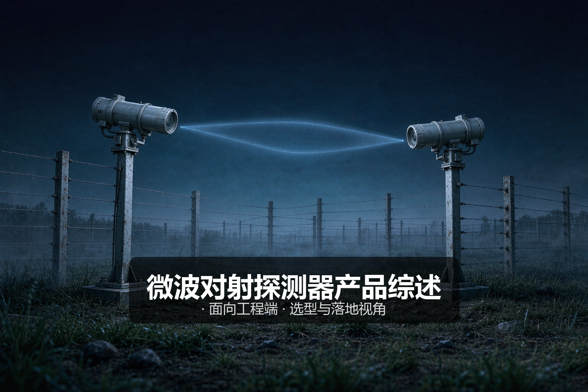
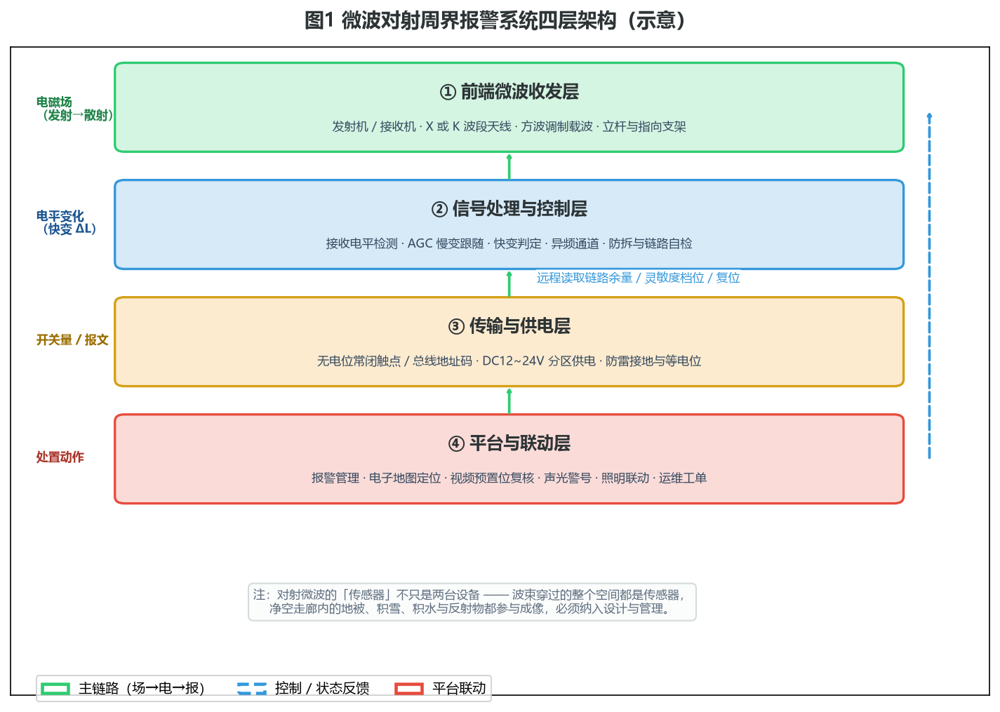
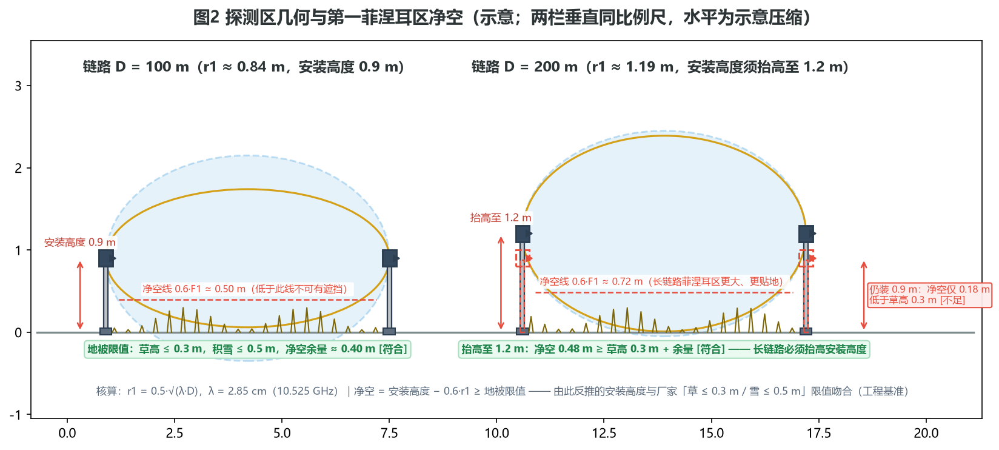
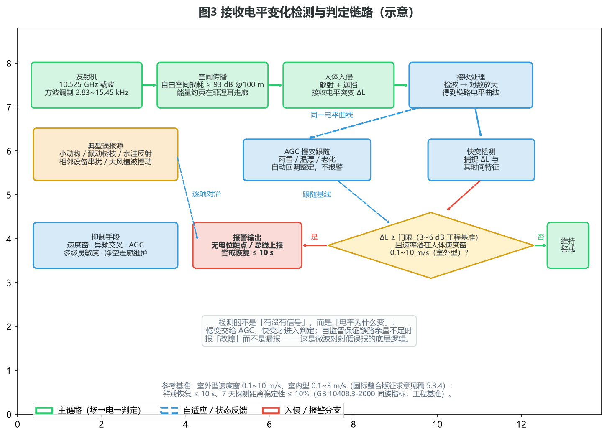
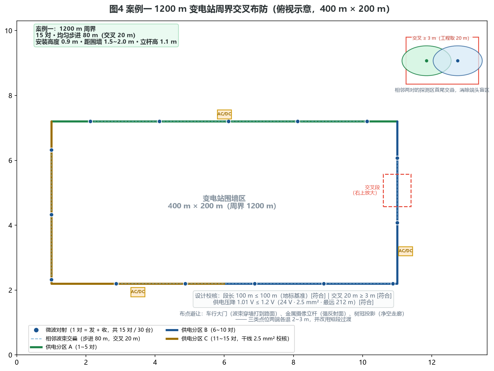

# 微波对射探测器产品综述：一道纺锤形电磁墙，替周界挡住雨雾与黑夜

> 本文面向工程实施与选型人员。文中所有厂商具体指标均以「厂家标称 / 国外同类产品规格」或「工程基准 / 工程估算」标注来源属性；涉及标准条文处只引用稳定可查的公开文本。数据锚点汇总见文末附录。

## 〇、一句话定位

微波对射探测器（ microwave barrier / microwave link，业内也叫「微波墙」「雷达对射」）由一台发射机与一台接收机成对组成：发射机沿链路持续辐射一束 10.525 GHz 级（X 波段）的调制微波，接收机持续监测这束波的接收电平。人或物体穿入链路之间的空间时，会对微波产生散射与遮挡，接收电平出现一个与人体运动特征相关的突变——设备捕捉这个「变化」，而不是简单地测「信号有没有」，从而判定入侵并输出报警。

它与红外对射最大的分野在于：红外是一道**线**，微波对射是一片**立体空间**。波束在两端之间自然扩散成一个纺锤形的三维探测区，中段宽度可达数米、高度可达两米以上——入侵者从上面翻、下面钻、中间穿过，都在探测区之内。加上微波对雨、雾、雪、沙尘的穿透力远强于红外光，它成为开阔、恶劣、无人值守环境下周界探测的主力技术之一。

对工程端而言，选型与施工要算的是六笔账：

| 笔账 | 核心问题 | 关键依据 |
|------|---------|---------|
| 第一笔 | 频段与链路长度怎么定 | FSPL 链路预算 + 防区 ≤ 100 m（监管地标基准） |
| 第二笔 | 安装多高、净空留多少 | 0.6·F1 菲涅耳区准则（本文推导，2.3 节） |
| 第三笔 | 交叉布防怎么消除端头盲区 | 交叉 ≥ 3 m（地标），工程取覆盖长度 10%~20% |
| 第四笔 | 供电怎么分区、压降算不算 | ΔU = 2ρLI/S，24 V · 2.5 mm² 干线算例 |
| 第五笔 | 杆件与基础抗不抗风 | 30 m/s 风载 ≈ 106 N 的倾覆核算 |
| 第六笔 | 误报源怎么管 | AGC 慢变跟随 + 速度窗 + 净空走廊运维 |

这六笔账贯穿全文，第二、三节逐笔展开，第六节用三个真实形态的案例算完整。

## 一、产品设计方案

### 1.1 系统定位与四层架构

一套完整的微波对射周界报警系统分四层：

**① 前端微波收发层**。发射机与接收机各装于链路一端的立杆或支架上，内部核心是微波振荡源（X 波段常见耿氏二极管或 FET 振荡器，新产品多用 PLL 合成）与口径天线（喇叭、透镜或阵列天线）。载波频率主流为 10.525 GHz（λ ≈ 2.85 cm），部分产品提供 24.125 GHz（K 波段，λ ≈ 1.24 cm）。载波被低频方波调制（典型通道 2.83 / 4.21 / 5.56 / 15.45 kHz，国外同类产品规格），调制既是接收端「认亲」的凭证，也是多对设备异频共存、防相互串扰的手段。

**② 信号处理与控制层**。接收机把收到的微波信号检波、对数放大，得到一条随时间变化的链路电平曲线。处理层在这条曲线上做两件事：用自动增益控制（AGC）跟随雨、雪、温度、元件老化造成的慢变；用快变检测捕捉人体穿过引起的电平突变，并按「幅度门限 + 速度窗」双条件判定。这一层还承担防拆检测与链路自诊断——接收电平长期异常偏低时上报「故障」而非保持沉默。

**③ 传输与供电层**。报警输出以无电位常闭触点（NC）为主流，断线即报警，符合入侵报警系统「常闭 + 断线报警」的惯例；带总线地址码的产品可上 RS-485 等总线，把防区号、链路余量、灵敏度档位一起上报。供电为 DC 10.2~30 VDC 宽压（12 / 24 V 常见），单台工作电流 Tx 约 25~30 mA、Rx 约 30~35 mA（12 V，厂家标称），功耗低到可以用小型蓄电池 + 太阳能板离网供电。立杆顶端的室外设备必须做防雷接地与等电位联结。

**④ 平台与联动层**。报警管理平台接收防区信号，在电子地图上定位，联动视频系统转到预置位复核，触发声光警号、照明与广播。微波对射的防区是「点对点」的线状防区，定位精度到防区级，比泄漏电缆、振动光纤的连续定位粗，但比单防区大围墙细得多——这正是它通常与视频复核成对出现的原因。

一个容易被忽略的工程事实：**微波对射的「传感器」不只是那两台设备**。波束穿过的整个空间都是传感器的组成部分——净空走廊里的草、雪、积水、临时堆料、停进的车辆，都参与构成这个「空间探测器」。图 1 的注释强调的正是这一点：前端层的设计边界不是设备外壳，而是纺锤形探测区的外包络。

### 1.2 产品形态分类

微波对射产品可以沿四个维度分类，选型时先定位再比参数：

**按频段分**。X 波段 10.525 GHz 是绝对主流：波长 2.85 cm，雨衰小（大雨约 1 dB/km 量级，百米链路可忽略），适合长链路与恶劣天气；K 波段 24.125 GHz 波长短（1.24 cm），同口径天线波束更窄、探测区分辨率更好，但雨衰与雾滴散射更大，多用于中短链路或需要更「细」探测区的场合。国外同类产品常以 X + K 双波段堆叠成多层探测面，用两个独立链路降低同时漏报的概率。国内主流产品单波段为主，部分高端型号提供双频。

**按探测机理分**。纯遮挡式：只看接收电平的变化量，人体进入 → 电平下降/扰动 → 报警，这是周界产品的主流形态；遮挡 + 多普勒复合式：在电平检测之外同时检测回波频移，用于确认目标运动方向与速度，抗干扰更好但成本更高。要注意**遮挡式对射与室内微波多普勒探测器是两类东西**——后者靠多普勒频移探测整个房间内的移动目标（GB 10408.3-2000 规范的正是这一类），前者规范的对象是「遮挡式微波对射」，出现在入侵探测器国标整合版的征求意见稿中（5.3.4 条，探测速度范围室内型 0.1~3 m/s、室外型 0.1~10 m/s）。把室内多普勒的指标张冠李戴到室外对射上，是选型文件里最常见的错误之一。

**按使用环境分**。室外型必须满足 IP65 及以上防护（常见 IP66）、-40~+65 ℃ 工作温度、98% 湿度、防雨 30 mm/h（厂家标称量级），外壳与罩体材料要对 2.85 cm 波长的微波低损耗透过——这是为什么不能用普通塑料罩随意替换原厂罩体的原因；室内型则缩小体积、降低防护等级、价格减半，但不能互换上岗。

**按通道与组网分**。单机对（一收一发）是基本单元；同频段多对共存时必须设置不同调制通道（异频），否则相邻链路互相「借光」造成同时误报；带总线地址码的产品可以数十台上总线，由报警主机统一读余量、调灵敏度、远程复位，这对大型周界的运维价值极大。

### 1.3 关键设计要点

微波对射的五道设计关，每一道都有明确的工程判据：

**第一关：净空走廊**。链路之间必须留出一条无遮挡、无强反射的走廊——不只地面以上看得见的部分，还包括第一菲涅耳区（3.1 节给出计算）。这条走廊的宽度随链路长度增长，是微波对射区别于红外对射的最大场地要求。

**第二关：交叉布防**。单对探测区两端收窄成尖点，端头附近存在弱探测区；相邻两对的首尾必须交叠（交叉长度 ≥ 3 m 为监管地标下限，工程上取覆盖长度的 10%~20%），让前一对的「尾巴」被后一对的「头」盖住。

**第三关：反射面避让**。金属是微波的强反射体。摄像立杆、水箱、彩钢板房、平行的高墙都会把波束「折」出多径，使探测区形状变形、出现探测异常点。布点时两端设备与大型金属物保持距离（工程上建议 2~3 m 起步，具体以厂家多径测试为准），无法避让时改短链路绕开。

**第四关：供电分区**。整条周界几十台设备的供电要做压降分区核算，干线截面积与分区长度按第四笔账（2.5 节）算，不能一根电源线从头串到尾。

**第五关：防雷接地**。立杆顶端设备直击雷概率低但感应雷不可忽视：电源端装电源防雷器，馈线金属外皮两端接地，立杆基础与等电位端子连接，接地电阻按系统设计要求（工程上常按 ≤ 4 Ω 控制，与所在场所防雷等级挂钩）。

## 二、核心参数与选型

### 2.1 参数速查表

| 参数 | 典型值 | 来源属性 |
|------|--------|---------|
| 工作频率 | X 波段 10.525 GHz（λ ≈ 2.85 cm）；K 波段 24.125 GHz | 厂家标称 |
| 频率下限 | ≥ 1 GHz | GB 10408.3-2000（室内微波类通用要求） |
| 探测距离 | 单对 100~250 m，常见 150 / 200 m 档 | 厂家标称 |
| 探测区几何 | 中段宽约 5 m、高约 2.5 m（100~150 m 链路中段） | 厂家标称 |
| 速度窗 | 室外 0.1~10 m/s；室内 0.1~3 m/s | 国标整合版征求意见稿 5.3.4 |
| 目标特征 | 35 kg 级人体（走、跑、爬行、翻滚均可探测），探测概率 ≥ 0.99 | 国外同类产品规格 |
| 发射功率 | 常见 ≤ 35 mW；国外 K 波段产品峰值 6 mW / 平均 3 mW | 厂家标称 |
| 接收灵敏度与余量 | 灵敏度约 -80 dBm 量级，典型链路余量 35 dB 量级 | 工程估算 |
| AGC 范围 | 54 dB（适应雨雪慢变） | 国外同类产品规格 |
| 判定门限 | ΔL 3~6 dB + 速度窗双条件 | 工程基准 |
| 报警响应 | ≤ 3 s（设备级）；系统级 ≤ 2 s（监管场所地标） | 产品规格 / 地标 |
| 警戒恢复 | 报警后 ≤ 10 s 恢复警戒；7 天探测距离漂移 ≤ 10% | GB 10408.3 同族指标 |
| 供电 | DC 10.2~30 VDC；Tx 25~30 mA、Rx 30~35 mA @ 12 V | 厂家标称 |
| 环境适应 | -40~+65 ℃、湿度 ≤ 98%、IP65 / IP66、防雨 30 mm/h、风速 ≤ 30 m/s | 厂家标称 |
| 地被限值 | 草高 ≤ 0.3 m、积雪 ≤ 0.5 m | 厂家标称 |
| 报警输出 | 无电位常闭触点（NC）或总线地址码；防拆触点常备 | 厂家标称 |
| 安装高度 | 厂家基准 0.75~1.0 m；监管场所地标 1.2~1.5 m；距围栏 1.5~2.0 m | 厂家标称 / 地标 |

两点提醒：其一，「探测距离」是厂家按理想净空标定的，工程上要按本项目净空条件打折使用（2.2 节）；其二，「探测区宽 5 m、高 2.5 m」是链路中段的最宽处，不是全链路均匀厚度——纺锤形几何在 2.4 节展开。

### 2.2 第一笔账：链路预算与防区划分

**链路预算**回答「这段距离传不传得动、余量够不够」。自由空间路径损耗：

FSPL(dB) = 32.44 + 20·lg(f_MHz) + 20·lg(d_km)

以 10.525 GHz、100 m 链路代入：FSPL = 32.44 + 80.4 − 20 ≈ 93 dB。取发射功率 35 mW ≈ 15.4 dBm、收发天线增益各 18 dBi（工程估算）、罩体与接头损耗 2 dB、接收灵敏度 −80 dBm（工程估算），则链路余量：

15.4 + 18 + 18 − 93 − 2 − (−80) ≈ 36 dB

这个余量远大于人体遮挡造成的电平变化（10~20 dB，工程估算），也大于雨衰（10 GHz 大雨约 1 dB/km，百米链路不足 0.2 dB）。**这个大余量不是浪费，而是设计的前提**：设备检测的从来不是「信号够不够强」，而是「电平变了多少」，余量保证在各种衰减条件下电平曲线仍然工作在接收机的线性区，ΔL 的测量才是可信的。长链路每翻一倍距离 FSPL 增加 6 dB，200 m 链路约 99 dB，余量仍有 30 dB 量级，这也是厂家敢标 250 m 档的底气。

**防区划分**回答「一段切多长」。监管场所地方标准对遮挡式微波的配置要求是：探测器间隔 ≤ 100 m、交叉安装、交叉距离 ≥ 3 m（浙江省监狱安防地标，配置表原文），单一防区长度 ≤ 100 m。工程上把 100 m 当作标称段长的设计上限，再按净空条件收紧：

- 净空好（硬化地面、无植被、场地平整）：按 100 m 段长设计；
- 净空中等（草坪定期修剪、积雪会清理）：按 80~100 m；
- 净空差（灌木、起伏地形、堆料风险）：按 50~60 m 甚至更短——段长缩短后菲涅耳区半径变小，净空要求随之放松（2.3 节算给你看）。

段长缩短的代价是设备数量近似反比增加，这正是第三笔账与案例三要权衡的事。

### 2.3 第二笔账：安装高度与净空走廊

这是微波对射选型里**最容易算错、也最能体现工程水平**的一笔账。

**为什么有净空这回事**。收发两端之间，电磁波能量并不是走一条细线，而是分布在一个以两端为焦点的椭球区域内，其中能量最集中的核心区叫第一菲涅耳区。第一菲涅耳区在中点处的半径：

r1 = 0.5·√(λ·D)

代入 λ = 2.85 cm（10.525 GHz）：

| 链路长度 D | r1（中点） | 0.6·F1 净空线（低于安装轴心） |
|-----------|-----------|------------------------------|
| 60 m | 0.65 m | 0.39 m |
| 80 m | 0.75 m | 0.45 m |
| 100 m | 0.84 m | 0.50 m |
| 200 m | 1.19 m | 0.72 m |

无线电工程通行的判据是 **0.6·F1 准则**：障碍物侵入第一菲涅耳区的 60% 以内，传输损耗开始显著增加。对微波对射而言，这条准则反过来用就是净空要求——**地面物（草、雪、堆料）不得高于安装轴心以下 0.6·r1 的那条线**，即：

净空余量 = 安装高度 − 0.6·r1 ≥ 地被限值

**反推安装高度**。取厂家标称的地被限值（草 ≤ 0.3 m）反推：

- 100 m 链路：安装高度 ≥ 0.50 + 0.30 = 0.80 m —— 厂家基准「0.75~1.0 m」正好落在这一区间；按 0.9 m 安装，净空余量 0.40 m，与厂家「积雪 ≤ 0.5 m、草 ≤ 0.3 m」的限值带完全吻合（雪是松散介质，对微波衰减小，允许比草高）。
- 200 m 链路：安装高度 ≥ 0.72 + 0.30 = 1.02 m —— 仍按 0.9 m 安装时净空只剩 0.18 m，连草高都兜不住，**长链路必须抬高安装高度**，工程上取 1.1~1.2 m。
- 监管场所把安装高度定在 1.2~1.5 m，除了净空考虑，更主要是让约 2.5 m 高的纺锤形探测区完整罩住人梯、攀爬的全身轨迹——高度首先是探测功能问题，其次才是净空问题。

图 2 把这笔账画成两栏：左栏 100 m 链路、0.9 m 安装高度，净空余量 0.40 m；右栏 200 m 链路，同样的 0.9 m 只剩 0.18 m（红框 [不足]），抬高到 1.2 m 后净空 0.48 m [符合]。两栏垂直同比例尺，可以直观看到长链路的菲涅耳区「又大又贴地」。

**一个推论**：探测区下缘本来会伸到地面以下（0.9 m 轴心 − 1.25 m 竖向半径 ≈ −0.35 m），实际上被地面截断，近地探测靠地面反射与绕射补足——这解释了两个现象：一是地被状态对近地探测能力影响极大（草一高，低姿爬行的漏报概率立刻上升）；二是安装高度不能为了「多探测」一味降低，低于净空线之后，靠近地面的那部分探测能力是虚假的、随季节漂移的。

### 2.4 第三笔账：探测区几何与交叉布防

**纺锤形是怎么来的**。天线波束在水平面内约 3°~6°、垂直面内更窄（由厂家标称的探测区尺寸反推，工程估算），能量随距离扩散，到链路中点最宽；超过中点向对端收拢，形成纺锤。厂家标称「中段宽 5 m、高 2.5 m」是 100~150 m 链路的典型值；150 m 链路中段按 5.7° 水平波束角反推约 7.5 m，与标称 5 m 的差异来自能量门限——波束边缘能量弱，能稳定触发判定的区域比几何波束窄。工程上不必纠结精确值，记住两条即可：

1. 探测区**中段最宽、两端最窄**，端头 5~10 m 是全链路探测能力最弱的部位；
2. 探测区**边界是渐变的**，没有红外光束那种物理上的「线」，灵敏度档位决定了边界的实际位置。

**交叉布防**正是针对第 1 条：相邻两对的首尾交叠，用后一对的强探测区盖住前一对的弱端头。交叉长度的下限来自监管地标（≥ 3 m），但 3 m 只够覆盖端头尖点，工程上按覆盖长度的 10%~20% 取值——100 m 段长交叉 10~20 m，对应步进 80~90 m。交叉还有第二个作用：任何人从两对设备的结合部穿过，都会同时进入两对探测区，输出两个相关性极高的报警，平台可以据此过滤单点干扰。

**异频防串扰**是交叉布防的伴生要求：交叉区内两对波束在空间上重叠，若同频同码，接收机会把对方的载波当成自己的信号，造成「两对设备互相看见」的连锁误报。同一频段的相邻对射必须配置不同的调制通道（2.83 / 4.21 / 5.56 / 15.45 kHz 一类的频分），并按厂家建议的间隔排布通道顺序。

### 2.5 第四笔账：供电与压降

单台功耗很小（12 V 下 25~35 mA），但一条几公里的周界动辄几十台，供电方式与线径必须按分区核算，不能「一根线串到底」。

压降公式（铜芯，ρ = 0.0175 Ω·mm²/m）：

ΔU = 2·ρ·L·I / S

**算例**：1200 m 周界、30 台设备，按 5 对一区设 3 个电源箱。每对（Tx + Rx）取 70 mA（按厂家上限 35 mA/台），每区 5 对 ≈ 0.35 A。电源箱放在分区中点，最远端距离 2.5 对 × 80 m 步进 = 200 m，计入引出取 212 m：

- 若 24 V 供电、干线 2.5 mm²：ΔU = 0.035 × 212 × 0.35 / 2.5 ≈ 1.0 V，占 24 V 的 4.3%，低于 5% 的工程限值 [符合]；
- 若误用 12 V 供电：同样 2.5 mm² 的 1.0 V 已占 8.6%，超过 12 V 系统允许的 0.6 V 限值 [不符合]，必须把干线加到 4 mm² 以上或把分区切短。

结论很直接：**室外周界的微波对射一律优先 24 V 供电、分区供电、干线 2.5~4 mm²**；离网场景（案例三）还要叠加蓄电池与光伏板的容量核算。

### 2.6 第五笔账：杆件与基础

设备装在立杆上，立杆的强度-基础问题在沿海、高原风口不可省略。按抗风 30 m/s（厂家标称的风速上限）核算：

设备迎风面积 A ≈ 0.16 m²（典型 0.4 m × 0.4 m 含支架，工程估算），阻力系数 Cd 取 1.2：

F = 0.5·ρ·v²·A·Cd = 0.5 × 1.225 × 30² × 0.16 × 1.2 ≈ 106 N

力臂（设备形心到基础顶面）约 1.0 m，倾覆弯矩 ≈ 106 N·m。采用 60×60×3 mm 方管钢杆、C25 混凝土基础 400×400×600 mm：基础自重 0.4 × 0.4 × 0.6 × 24 kN/m³ ≈ 2.3 kN，抗倾覆力矩按自重 × 半边长 = 2.3 × 0.2 ≈ 460 N·m，与 1.5 倍安全系数下的设计弯矩 159 N·m 之比约 2.9 [符合]。

配套要求：设备中心离地按第二笔账定（0.9~1.2 m），杆顶再留 0.1~0.2 m；杆件垂直度与两端的**指向对准**是微波对射施工的独门工序——对准完成后读接收机对准电压（国外产品提供 0.5~5 VDC 对准电平监测点），锁定云台螺栓并做防松标记，验收时复核一次。

### 2.7 十二条踩坑清单

1. **把微波对射当红外对射用**——贴着围墙装，探测区一半打进墙内、一半穿墙打到墙外道路上，既漏报又扰民。微波对射要离开反射面，独立成栏或在墙内留出 1.5~2.0 m 走廊。
2. **净空走廊不做验收**——交付时草地尚矮，入夏草过 0.5 m，入冬积雪盖住 0.6·F1 线，误报与漏报同时爆发。净空是场地条件，要在验收单里量化（草高、积雪、堆料距离）。
3. **端头不交叉**——两对设备首尾「精确相接」，端头尖点弱探测区正好留出 1~2 m 的可穿越缝。交叉 10%~20% 是起步值。
4. **相邻对射同频同码**——交叉区内互相「借光」，一辆卡车经过两对同时报警。按通道表排频，验收时做联动测试。
5. **正对金属反射面**——摄像立杆、水箱、彩钢棚的多径反射让探测区「变形」，出现固定点的异常报警。布点避开 2~3 m，或用短段绕行。
6. **长链路不抬安装高度**——200 m 链路仍装 0.9 m，净空只剩 0.18 m，春天开始「鬼报警」。记住 1.02 m 这条线（2.3 节）。
7. **供电不做压降核算**——12 V 串联供电末端掉到 10 V 以下，设备复位循环，白天误报夜间离线。24 V + 分区 + 2.5~4 mm² 是标准答案。
8. **防雷只保电源不保馈线**——立杆顶端设备的总线/触点线缆感应雷击穿光耦。信号线入端加信号防雷器，金属外皮两端接地。
9. **拿室内多普勒指标选室外对射**——把 GB 10408.3 的 0.3~3 m/s 速度范围写进室外标书，导致爬行（< 0.3 m/s）漏检争议。室外型速度窗是 0.1~10 m/s。
10. **灵敏度一律拉满**——短链路 + 高灵敏度，雨滴、鸟、猫都能触发。灵敏度档位与段长、净空联动设定，宁可标定多花半小时。
11. **植被维护不进运维合同**——设备是终身质保，草是甲方自己的，两年后净空走廊变成青纱帐。割草频次、雪后巡查写入维保条款。
12. **验收只测「走一遍」**——正常人步速通过就签字。验收应包含爬行（下限速度）、快跑（上限速度）、双人并排（遮挡叠加）、端头穿越（交叉有效性）四个规定动作。

## 三、技术原理

### 3.1 物理基础：散射、遮挡与菲涅耳区

微波对射的物理基础是电磁波与人体目标的两种相互作用：

**遮挡（吸收 + 反射）**。人体对 2.85 cm 波长的微波有显著的后向散射截面（RCS 约 0.2~0.8 m² 量级，与姿态和频率相关，工程估算），站在链路上的人相当于在接收机视野里插入一个吸收体加散射体，接收电平下降十分之几到数十分贝——下降多少取决于人体在波束中的位置：中段波束最宽，人体只挡住一部分能量，ΔL 较小但持续时间长；端头波束窄，人体几乎全遮挡，ΔL 大但变化尖锐。

**多径扰动**。人体贴近地面运动时，还改变直达波与地面反射波的叠加关系，造成电平的快速起伏。这个分量对低姿爬行目标尤其敏感——纯遮挡模型里爬行人挡住不多，但多径扰动足以在电平曲线上留下特征。这也是为什么厂家敢把「30 cm 直径金属球」和「匍匐爬行的人」一起写进目标规格（国外同类产品规格）。

**第一菲涅耳区**是理解空间分布的钥匙。收发两端之间的能量主要分布在以两点为焦点的椭球壳层内，第一菲涅耳区是其中能量贡献最大的核心，中点半径 r1 = 0.5·√(λD)。0.6·F1 准则（2.3 节）决定了净空走廊的宽度；反过来，入侵者从菲涅耳区中心通过时的电平扰动最大、从边缘通过时最小——这解释了同一对不同灵敏度档位下「中间敏感、边缘迟钝」的实测现象。

**频率选择的物理逻辑**：波长越短（K 波段），同口径天线波束越窄、人体 RCS 越大，探测区越「细」；但雨滴尺寸与 1.24 cm 波长更接近，雨衰与湿雾散射显著。10.525 GHz 的 2.85 cm 波长与雨滴直径错开两个数量级，雨衰可以忽略——**「全天候」三个字在物理上主要归功于频段选择，而不是算法**。

### 3.2 传感机制：电平变化检测，不是多普勒

再次强调分野：**室外微波对射的主流机制是「遮挡式电平变化检测」**，不是室内微波多普勒的「频移检测」。

接收机的信号链是：天线 → 微波检波 → 对数放大器 → 链路电平曲线 → 特征提取。对数放大器的作用是把几十个 dB 的动态范围压缩到线性处理区间，使「远端的小 ΔL」与「近端的大 ΔL」都能被等精度地度量——AGC 的 54 dB 范围（国外同类产品规格）配合对数放大，共同覆盖从「晴天满电平」到「暴雨 + 罩体污损」的全部工况。

发射端载波的方波调制是这套机制的「防伪水印」：接收机只认自己通道的调制包络，别的同频信号（相邻对射、雷达、通信设备）即使混进来，也因调制不匹配而被当作噪声滤除。国外产品在接收机上专门设「干扰指示灯」与「错码指示灯」，把这两类异常可视化。

带多普勒复合的产品在检波之外再做一路频移检测，用来回答「目标朝哪边动、动多快」，主要价值是方向判别（区分「进」与「出」，对内外隔离的场合适用）与野值抑制。

### 3.3 判定逻辑：慢变跟随与快变检测

图 3 是判定链路的全景。核心思想一句话：**检测的不是「有没有信号」，而是「电平为什么变」**。

**慢变跟随（AGC）**。雨雪累积、温度漂移、罩体污损、元件老化都会让链路电平整体缓慢漂移，时间尺度是分钟到月。AGC 以数十秒级的时间常数跟随基线，把工作点拉回线性区——这个时间常数的选择本身就是一道工程权衡：常数太短，一个快速走过的行人都可能被「跟随」掉（漏报）；太长，慢雨累积的电平跌落来不及补偿（灵敏度劣化）。量级取法：人体穿越探测区的典型持续时间是 0.2~2 s（0.1~10 m/s 速度窗反推），AGC 时间常数取其百倍以上（数十秒）即可把「人」与「天」干净地分开。

**快变检测（判定）**。电平曲线去掉慢变基线后，对快变分量做双条件判定：ΔL 幅度达到门限（工程基准 3~6 dB）**且** 变化速率落在人体速度窗内（室外 0.1~10 m/s）。速度窗是误报治理的主闸门——飘过的塑料布（等效速度高但不持续）、猫（速度在窗内但 ΔL 小）、树枝摆动（速率慢）、水洼反光突变（无速度特征），都会在「幅度 + 速率」的二维平面上被人形目标分开。判定通过后输出报警，报警持续时间 > 1 s（防瞬时毛刺），警戒恢复 ≤ 10 s（GB 10408.3 同族指标）。

**自监督**。接收电平持续低于整定值（罩体被泥糊住、立杆被撞歪、发射机故障）时，设备上报「故障」而不是保持「正常」——这是防漏报的底线机制，也是微波对射相对红外对射在自诊断上的显著优势：光束遮挡式产品对镜头污损的检测手段远不如电平式直接。

### 3.4 环境自适应与自诊断

把 3.3 节的机制拆成运维视角的四件套：

1. **AGC 慢变补偿**：雨、雪、温漂、老化自动跟随，54 dB 范围覆盖绝大多数天气工况（国外同类产品规格），小雨中雪不降灵敏度。
2. **多级灵敏度档位**：与段长、净空、场所等级联动设定（2.7 节第 10 条），部分产品支持按日程表分时段切换——白天施工多、夜间布防严。
3. **异频通道 + 干扰指示**：从产品层面消除串扰，接收机面板的干扰 / 错码指示灯把电磁环境质量可视化，调试时一眼判位。
4. **链路自诊断与防拆**：余量、电平、防拆触点全部上报，总线型产品可远程读值——运维从「定期巡检」变成「按需处置」。

### 3.5 演进脉络

- **反射式微波探测器**（最早形态）：单机收发一体，靠多普勒探测房间内移动目标，即 GB 10408.3 规范的室内品类，至今仍是室内双鉴探测器的组成之一。
- **遮挡式微波对射**（室外化）：把收发拆成两台、链路拉到百米级，用电平遮挡检测替代频移检测，解决室外周界的全天候探测问题。模拟电路时代误报偏高，应用局限在高等级场所。
- **数字化与异频组网**：方波调制通道化、对数放大 + 数字特征提取、多级灵敏度，误报水平降到可工程化的区间，交叉布防成为标准打法，应用从监狱、油库扩展到变电站、机场、物流园。
- **阵列天线与数字变频**：多点收发、阵列波束使探测区几何更规整、速度谱特征更丰富，产品开始输出目标速度、位置等特征量而不只是开关量。
- **与雷达 / 视频融合**：周界雷达接管「面」级搜索与跟踪，微波对射以点线级「确认」补位，视频做目标分类——三者按「雷达发现、对射确认、视频识别」分层组网，是当前高等级周界的主流架构。

### 3.6 适用边界

微波对射不是万能周界，四条硬边界要写进方案评审清单：

1. **穿透性是双刃剑**。微波穿薄墙、穿灌木、穿围栏——好处是不怕遮挡，坏处是探测区不受「物理边界」约束：贴墙安装会把探测区打到墙外道路上（2.7 节第 1 条），围墙外有市政道路、有停车场的场地慎用或改向。
2. **金属反射改变探测区**。大量金属构筑物（料棚、罐体、彩钢厂房）环绕的场地，多径反射使探测区形状不可控，需要现场多径测试确认，方案阶段就要识别。
3. **净空走廊是持续成本**。0.6·F1 的走廊要求意味着土地、植被、物流动线的长期让渡——这在土地紧张、绿化考核严格的场所是隐性成本，比设备本身贵。
4. **边界模糊与定位精度**。防区定位到「对」而不是「米」，长周界仍要靠多防区切分 + 视频复核弥补。需要米级定位的场合，周界雷达或定位型振动光纤更合适。

## 四、产品功能与差异化

### 4.1 功能清单

| 功能 | 工程价值 |
|------|---------|
| 立体纺锤形探测区 | 防翻越、防钻越、防中部穿越，一条链路顶多道红外 |
| 全天候穿透探测 | 雨雾雪沙尘下探测性能不塌方，误报不随天气跳变 |
| 多级灵敏度 + 速度窗 | 按场所与净空定制判定边界，误报可治理 |
| 异频通道组网 | 多对同场共存，交叉布防无串扰 |
| AGC 自动补偿 | 天气与季节慢变免维护，长期灵敏度稳定 |
| 链路自诊断 + 余量上报 | 污损、歪斜、故障主动上报告，防漏报 |
| 防拆触点 | 外壳开启即报警，符合入侵探测器通用要求 |
| 无电位常闭输出 / 总线 | 兼容一切报警主机；总线型可远程读值调参 |
| 对准电平监测 | 施工指向量化，验收可复核 |
| 低功耗宽压供电 | 24 V 干线供电或太阳能离网，部署自由 |

### 4.2 与相邻技术的六维对比

| 维度 | 微波对射 | 主动红外对射 | 脉冲电子围栏 | 张力围栏 | 振动光纤 | 泄漏电缆 |
|------|---------|-------------|-------------|---------|---------|---------|
| 探测形态 | 立体纺锤区（面体） | 线状光束（线） | 栅栏 + 电击（面体） | 机械索张力（线体） | 贴网/埋地（面带） | 地下电磁带（体） |
| 天气适应性 | 优（穿透雨雾） | 弱（雾雨衰减、雨雪误报） | 优 | 优 | 优 | 优 |
| 误报水平 | 中（净空可管理后偏低） | 中高 | 中 | 低 | 中 | 中高 |
| 安装与场地要求 | 高（净空走廊 + 立杆 + 避反射面） | 低（围墙顶直接安装） | 中（围墙/落地杆） | 高（基础刚度） | 低（贴网即可） | 中（需开挖） |
| 威慑 / 阻滞 | 无 | 无 | 强（电击威慑） | 无电但物理阻滞 | 无 | 无 |
| 单位长度成本 | 中高（对 + 杆 + 净空） | 低 | 中 | 中高 | 中 | 高 |

选型逻辑一句话：**天气恶劣、场地开阔、净空可管理 → 微波对射；围墙已建、预算有限 → 红外对射；要威慑阻滞 → 脉冲/张力围栏；围墙异形、贴装方便 → 振动光纤；地表以下纵深 → 泄漏电缆**。高等级场所按「双技术异构」组合（第六节案例二），让两种原理的误报源互不重叠。

### 4.3 差异化要点

同一价位段的微波对射产品，拉开差距的是五个点，验收与选型时逐项问：

1. **链路余量的标定方式**——是按理想净空实验室标定，还是给出不同净空条件下的推荐段长表？后者才是工程友好的厂家。
2. **速度窗与门限的可配置深度**——只有「高/中/低」三档的产品，在复杂场地上限明显；能按段长自动推荐参数的产品施工效率高一截。
3. **自诊断的覆盖面**——只报「故障/正常」与能报「余量 dB 数 + 罩体污损趋势」的产品，运维成本差一个量级。
4. **异频通道数量与规划工具**——通道越多，长周界频率复用越从容；有通道规划表的产品减少调试翻车。
5. **对准与验收工具**——对准电平引出、手持校准器、远程读值 App，直接决定施工与交付速度。

## 五、应用场景

### 5.1 变电站与电力设施

**痛点**：无人值守变电站的周界长、地处开阔郊野，夜间无照明，雨雾天视频失效；电力治安事件要求「事前预警」而不是「事后取证」。

**方案**：围墙内退 1.5~2.0 m 设微波对射线，段长 100 m、交叉 20 m，与视频预置位联动；主控楼侧辅以室内红外。安装高度按净空核算取 0.9~1.2 m。

**价值**：雨雾黑夜探测性能不衰减，全周界误报收敛到可值守水平；探测区立体成面，翻越者无法从红外「线」的上下空隙钻过。

### 5.2 石化、油库与危化品仓储

**痛点**：防爆区禁电禁火，周界常有酸雾、水汽、扬尘，光学设备镜头维护成本高；罐区防火堤与围墙之间的巡查通道需要无死角覆盖。

**方案**：防爆认证或本安处理的前端设备（按场所防爆等级选型），微波对射沿防火堤顶或围栏布设，探测区覆盖堤顶翻越轨迹；信号经安全栅后入报警总线。

**价值**：非接触、低功耗、无高压电瓶环节（相比脉冲围栏的本质安全优势），酸雾扬尘环境免擦镜维护。

### 5.3 监狱、看守所与监管场所

**痛点**：监管场所对漏报零容忍，规范要求多技术融合、系统级响应 ≤ 2 s、防区 ≤ 100 m、交叉 ≥ 3 m（浙江省监狱安防地标类要求）。

**方案**：微波对射（安装高度 1.2~1.5 m，覆盖攀爬全身轨迹）+ 振动光纤（贴隔离网，感知剪网爬网）双技术异构，同防区双触发为高置信报警、单触发转视频复核；报警直达武警哨位与指挥中心分级推送。

**价值**：两套原理的误报源几乎不重叠（一个是空间电磁场、一个是界面机械振动），漏报与误报同时下降；逐条满足地标验收条款。

### 5.4 机场、物流园区与开放式仓库

**痛点**：围界长（数公里级）、地形开阔、夜间货运作业频繁，入侵路径以驾车冲卡与步行翻越并存。

**方案**：微波对射沿围栏内侧走廊布设，与围界雷达、视频智能跟踪分层组网——雷达负责面搜索与航迹跟踪，对射负责点线确认，视频负责目标分类；车行道口用短段 + 硬化隔离过渡。

**价值**：分层架构里对射把「疑似航迹」变成「确认入侵」，压低视频智能分析的无效告警量；低功耗特性支持长距离供电薄弱段使用太阳能补电。

### 5.5 光伏电站、风电场与水源地

**痛点**：新基建场站多在山地、滩涂、戈壁，无市电、无围墙（铁丝围栏）、植被与积雪随季节剧烈变化。

**方案**：按净空条件分段的微波对射 + 太阳能离网供电（案例三完整核算），段长 50~80 m 动态取值，净空维护写入运维合同。

**价值**：无市电条件下的全天候周界探测成为可能；把「场地条件」转化为「运维条款」，避免交付两年后性能滑坡。

## 六、实际案例与设计方案

### 案例一：400 m × 200 m 变电站，周界 1200 m，交叉布防 15 对

**需求**：城郊 110 kV 无人值守变电站，围墙高 2.5 m，墙外是农田与乡道；要求雨雾夜间误报 ≤ 每周 2 次（整站），入侵报警到平台带视频复核，预算内尽量少动土。

**方案设计**：

- **段长与对数**：场地开阔、草坪可修剪，净空条件评为「中等偏好」，按标称 100 m 段设计。15 对均匀步进 80 m（交叉 20 m，为地标下限的 6 倍余量），30 台设备沿围墙内侧 1.5~2.0 m 走廊布设，立杆高 1.1 m，安装高度 0.9 m。
- **净空核算**：100 m 链路 r1 = 0.84 m，0.6·F1 = 0.50 m，净空余量 = 0.9 − 0.50 = 0.40 m ≥ 草高限值 0.3 m [符合]，积雪按厂家限值 0.5 m 管理（雪松散允许略高）。
- **供电**：24 V 分三区（每区 5 对），电源箱置于分区中点，最远端 212 m，干线 2.5 mm²，压降 ≈ 1.0 V ≤ 1.2 V [符合]；每区电源端加电源防雷器。
- **杆件与基础**：30 m/s 风载 106 N、弯矩 106 N·m，60×60×3 方管杆 + 400×400×600 C25 基础，抗倾覆裕度 2.9 [符合]（2.6 节）。
- **布点避让**：车行大门两侧各退 3 m 改 40 m 短段过渡（门柱是金属体）；两处拐角立杆外移避开墙角反射；摄像立杆与对射立杆间距 ≥ 2.5 m。
- **联动**：报警总线上收防区号与链路余量，平台电子地图 + 视频预置位，夜间报警联动探照灯。

**交付价值**：交付验收按四个规定动作（爬行、快跑、双人并排、端头穿越）全部通过；首年雨季实测误报 0.5 次/周（含树木修剪期扰动），达到甲方指标。总设备量 30 台对 1200 m 周界，单位密度约 1 对 / 80 m，与红外对射方案（1 对 / 60 m）相比设备数相近，但换取了雨雾夜间的性能不塌方与立体防翻越。

### 案例二：监狱 800 m 高等级周界，双技术融合

**需求**：监管改造项目，围墙 + 隔离网双 barrier，地标要求：遮挡式微波安装高度 1.2~1.5 m、间隔 ≤ 100 m、交叉 ≥ 3 m；单一防区 ≤ 100 m；系统报警响应 ≤ 2 s；周界宜采用两种以上探测技术。甲方明确要求验收逐条对标。

**方案设计**：

- **微波对射线**：9 对（步进 90 m、交叉 10 m ≥ 3 m [符合]，段长 100 m ≤ 100 m [符合]），安装高度取中值 1.4 m——净空核算：r1 = 0.84 m、0.6·F1 = 0.50 m，净空余量 0.90 m，监管区地面硬化无植被，裕量充足；探测区顶缘约 1.4 + 1.25 = 2.65 m，完整覆盖人梯 + 攀爬全身轨迹。
- **振动光纤**：贴隔离网 8 个防区（每区 ≤ 100 m [符合]），感知剪网、爬网、踩踏。
- **双判逻辑**：同一防区「微波 + 光纤」双触发 → 高置信入侵，直接触发声光 + 哨位推送；单触发 → 视频预置位自动复核，10 s 内人工确认；系统链路全部采用报警专线 + 触点闭环，响应链实测 1.4 s ≤ 2 s [符合]。
- **工程细节**：全部立杆做等电位联结；微波通道按 9 对排异频表并做联动测试；对准电平写入验收资料。

**交付价值**：验收会上地标条款逐条打勾通过；运行一年双技术融合把误报压到每月 3 次以内（单技术方案通常的误报水平是其数倍），漏报侧因双技术互备获得冗余。该项目成为区域内同类工程的样板标段。

### 案例三：山地光伏电站 1800 m，离网供电 + 分段降段长

**需求**：山地光伏电站，围栏为 1.8 m 铁丝网，周界 1800 m；场地起伏 ±1.5 m，灌木丛生（雨季 0.4~0.6 m），无市电；业主要求周界报警与电站 SCADA 分控平台对接，运维按季度托管。

**方案设计**：

- **分段策略**：净空条件差是主要矛盾。若按 100 m 段长，0.6·F1 = 0.50 m，起伏地形下大量链路段净空不足。改为 **80 m 标称段长**：r1 = 0.75 m、0.6·F1 = 0.45 m，配合立杆抬高至 1.0 m，净空余量 0.55 m，覆盖灌木修剪后 ≤ 0.3 m 的地被 + 0.25 m 起伏余量 [符合]。起伏段用水准仪放坡，逐段校核两端安装高度差，高差大时短段化处理。
- **对数与交叉**：步进 68 m（交叉 12 m，覆盖长度的 15%），27 对 = 54 台覆盖 1800 m。
- **离网供电**：总负载 54 台 × 35 mA ≈ 1.9 A @ 24 V ≈ 45 W。分 4 个供电区（7/7/7/6 对），区内最远 238 m，干线 4 mm²，压降 ≈ 1.0 V ≤ 1.2 V [符合]。每区太阳能板按日耗 1.08 kWh、峰值日照 4 h、综合效率 0.75 反推 ≈ 360 W，取 400~500 W；蓄电池按连续阴雨 5 天、放电深度 0.8 反推 ≈ 6.8 kWh，配 24 V / 300 Ah 磷酸铁锂 ×2 组（工程估算）。
- **运维条款**：季度割草（灌木 ≤ 0.3 m）、雪后 48 h 巡查、链路余量季度读值归档——全部写入托管合同 KPI。

**交付价值**：无市电周界实现全天候探测，与 SCADA 对接后告警直达值班端；段长缩短带来的设备增量（27 对 vs 理想净空下的 19 对）是可控的代价，换来的是不随季节滑坡的稳定性能——这正是微波对射「场地条件换设备投资」的典型权衡。

## 七、市场背景与竞争格局

### 7.1 需求侧：两股力量在驱动

**无人值守化**。变电站、油库、水厂、光伏电站的「少人化 / 无人化」改造把周界从「人巡 + 围墙」推向「技防为主」，且这些场站大多位于市郊开阔地——正是微波对射的优势场景。电力与能源行业对「雨雾夜间性能不塌方」的刚性要求，把红外对射挡在门外。

**高等级场所的合规驱动**。监狱、看守所、机场的安防标准对周界提出多技术融合、响应时间、防区长度的量化条款，双技术异构成为验收标配，微波对射作为「全天候立体探测」的那一极稳定进入标书。国标整合版（征求意见稿）把「遮挡式微波对射」单列成条（5.3.4），产品有了更清晰的合格判定锚点，利于规范竞争。

### 7.2 供给侧：分散市场里的分层

国内市场呈三层结构：进口专业品牌（如美国同类高可靠产品，24~183 m 链路、AGC 54 dB、探测概率 ≥ 0.99 一类的硬指标）占据监狱、机场、核电等最高等级项目；国产中坚品牌以 10.525 GHz 数字化产品覆盖电力、石化、园区主流市场，价格约为进口的 1/2~1/3；白牌组装产品在低端项目以价格竞争，参数表光鲜但净空标定、通道规划、自诊断能力缺失——这类产品正是市场上「微波对射误报大」口碑的主要来源。

### 7.3 竞争技术的挤压与反挤压

微波对射同时面对三个方向的挤压：**红外对射**以三分之一的价格争夺中低端项目（靠围墙安装省掉立杆与净空成本）；**周界雷达**以「面搜索 + 航迹跟踪 + 米级定位」的体验优势向上蚕食高等级项目；**振动光纤 / 泄漏电缆**以「不占走廊、贴装即用」争夺土地紧张的场地。微波对射的守擂逻辑是：在「恶劣天气 + 开阔净空 + 预算中等」的交集区间，它的性能价格比仍然无可替代——全年候性能是红外的短板，走廊成本是光纤的短板，单价是雷达的短板。趋势是与雷达、视频走向分层组网而不是零和替代（3.5 节）。

## 八、商业模式与趋势

### 8.1 商业模式

- **设备 + 净空工程捆绑**：头部厂家与集成商把「净空走廊整治」（割草、清障、地面硬化）打包进项目报价，把最大的误报根源变成收入项。
- **运维托管**：链路余量季度读值、灵敏度标定复核、雪后巡查、植被管理按年计费——微波对射「性能随场地漂移」的特性天然适合订阅式维保。
- **双技术方案溢价**：融合方案（对射 + 光纤 / 对射 + 雷达）以「合规验收 + 误报治理」为卖点，客单价与毛利高于单品竞争。
- **行业准入门槛**：监管场所与电力行业有业绩门槛与检测报告要求，反向推动厂家把产品送检（探测速度范围、稳定性、环境适应性按公开标准方法），白牌产品被挡在门外。

### 8.2 趋势判断

1. **参数数字化与远程运维**：总线 / IP 化产品输出余量、电平、温度等遥测，灵敏度远程标定，运维从巡检制转向状态制。
2. **特征量输出**：从开关量走向「速度 + 位置 + 尺寸」的特征级输出，与平台的目标融合引擎对接，支撑「雷达发现、对射确认、视频识别」的分层架构。
3. **低功耗与离网化**：新能源场站的增长把太阳能离网供电从「特殊方案」变成「标准配置包」，厂家直接提供板 + 电池 + 设备的整套 SKU。
4. **标准细化**：国标整合版落地后，遮挡式微波对射有了独立的探测速度与性能判定条文，招投标参数从「厂家自说自话」走向「条文对标」。
5. **与 AI 视频的分工固化**：视觉 AI 强于分类、弱于全天候，微波对射强于全天候、弱于分类——两者的接口（对射触发 → 视频抓拍 → 分类复核）会进一步标准化。

## 附录 A：十二项选型核算清单

| # | 核算项 | 公式 / 判据 | 本文算例 |
|---|--------|------------|---------|
| 1 | 链路损耗 | FSPL = 32.44 + 20lg f(MHz) + 20lg d(km) | 93 dB @ 10.525 GHz / 100 m |
| 2 | 链路余量 | Pt + Gt + Gr − FSPL − 损耗 − 灵敏度 | ≈ 36 dB（工程估算） |
| 3 | 菲涅耳半径 | r1 = 0.5·√(λD) | 0.84 m @ 100 m |
| 4 | 净空走廊 | 安装高度 − 0.6·r1 ≥ 地被限值 | 0.9 − 0.50 = 0.40 m ≥ 0.3 m |
| 5 | 长链路高度 | 安装高度 ≥ 0.6·r1 + 0.3 m | ≥ 1.02 m @ 200 m |
| 6 | 防区长度 | ≤ 100 m（监管地标基准），净空差时 50~80 m | 100 m / 80 m |
| 7 | 交叉长度 | ≥ 3 m 下限；工程取覆盖长度 10%~20% | 20 m（步进 80 m） |
| 8 | 对数 | N ≥ 周界长 / 步进，四角避让偏移 | 1200/80 → 15 对 |
| 9 | 供电压降 | ΔU = 2ρLI/S ≤ 5% Un | 1.0 V ≤ 1.2 V（24 V/2.5 mm²） |
| 10 | 风载弯矩 | F = 0.5ρv²ACd，M = F·h | 106 N / 106 N·m |
| 11 | 基础抗倾覆 | 自重 × 半边长 ≥ 1.5 × M | 460 ≥ 159 N·m |
| 12 | 离网容量 | 板 ≥ 日耗/(峰值日照 × 0.75)；电池 ≥ 日耗 × 天数 / DOD | 400~500 W / 6.8 kWh |

## 附录 B：术语表

- **遮挡式微波对射**：以收发链路电平变化判定入侵的室外周界探测器，与室内微波多普勒探测器为两类产品。
- **X / K 波段**：10.525 GHz / 24.125 GHz 附近 ISM 频段的行业称呼，波长分别约 2.85 cm 与 1.24 cm。
- **第一菲涅耳区（F1）**：收发两端之间能量最集中的椭球核心区，中点半径 r1 = 0.5·√(λD)。
- **0.6·F1 准则**：障碍物侵入菲涅耳区 60% 以内时传输显著劣化的工程判据，本文反用为净空要求。
- **FSPL**：自由空间路径损耗，链路预算的基准项。
- **AGC**：自动增益控制，以慢时间常数跟随电平基线，把天气与老化漂移从入侵特征中剥离。
- **速度窗**：判定入侵目标的等效速度区间，室外型 0.1~10 m/s，是误报治理的主闸门。
- **RCS（雷达散射截面）**：目标对电磁波散射能力的等效面积，人体约 0.2~0.8 m²（工程估算）。
- **多径反射**：微波经金属面 / 地面反射后与直达波叠加，造成电平起伏与探测区变形。
- **交叉安装**：相邻两对探测区首尾交叠的布防方式，消除端头弱探测区。
- **异频通道**：相邻对射使用不同的低频调制频率，避免交叉区串扰。
- **对准电平**：接收机输出的链路质量电压指示（如 0.5~5 VDC），用于施工指向标定与验收复核。
- **无电位常闭触点**：报警输出形式之一，静态闭合、报警断开，断线即报警。

## 附录 C：标准索引

- **GB 10408.3-2000**《入侵探测器 第 3 部分：室内用微波多普勒探测器》——室内微波类探测器的功能与性能要求（频率下限、探测边界超差、速度范围、恢复时间、稳定性等），其多项通用指标被室外微波类产品沿用为工程基准。
- **《入侵和紧急报警系统 入侵探测器》国标整合版（征求意见稿）**——拟整合替代 GB 10408 系列多个部分，其中 5.3.4「遮挡式微波对射入侵探测器」给出探测距离、探测宽度与速度范围（室内 0.1~3 m/s、室外 0.1~10 m/s）的判定框架；引用时注意其为征求意见稿状态。
- **GB 50394-2007**《入侵报警系统工程设计规范》——防区划分、传输、供电与系统联动的总体设计要求。
- **GB 50348-2018**《安全防范工程技术标准》——周界安防工程的设计、施工、检验与验收总体框架。
- **省级监管场所安防地方标准**（如浙江省监狱安全防范信息系统建设规范类文件）——遮挡式微波的安装高度（1.2~1.5 m）、间隔（≤ 100 m）、交叉距离（≥ 3 m）、防区长度（≤ 100 m）与系统响应（≤ 2 s）等条款的常见出处；项目所在省份有对应地标的以地标为准。
- **FCC Rules Part 15**（美国）——国外同类产品射频辐射特性的合规依据，国内项目参考其杂散抑制指标（≥ 50 dB）。

---

*本文为「周界安防产品拆解」系列之一，同系列已发布红外对射探测器、张力围栏、脉冲电子围栏、振动光纤等篇目。文中所有工程算例均为方法论演示，实施前应以现场勘测与现行有效标准为准。*
