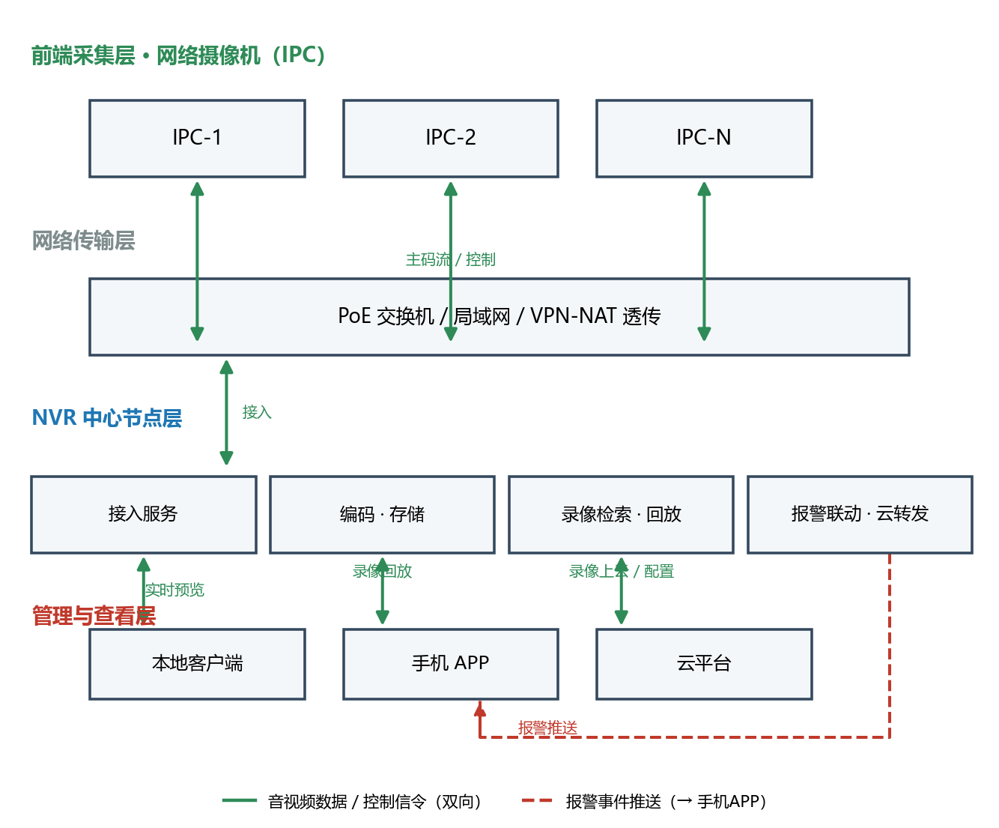
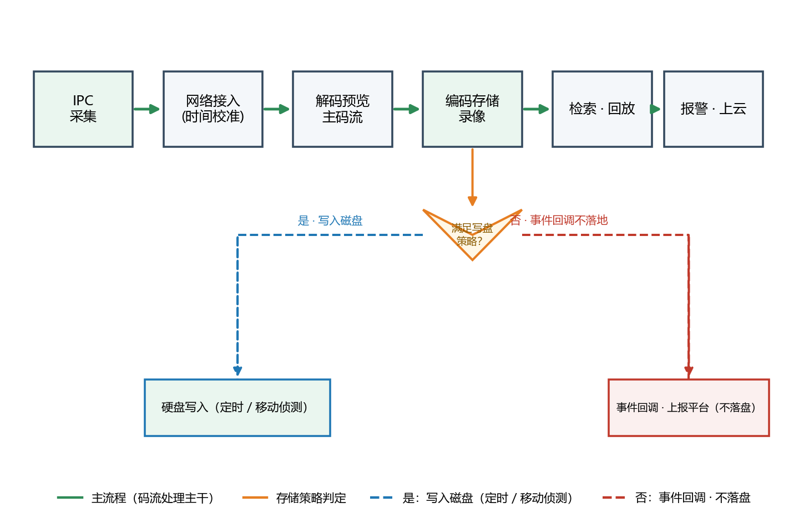

# 网络硬盘录像机（NVR）产品综述

> 副标题：· 面向工程端 ｜ 选型与落地视角
> 定位主线：**接入所有 IPC、管好每一路录像、交给任何一个查看端**——NVR 是视频监控系统的"中心节点"。

---

## 〇 一句话定位

**网络硬盘录像机（Network Video Recorder，NVR）是视频监控系统里负责"接入网络摄像机、编码存储、集中管理与回放"的中心节点**：一端通过局域网/PoE 收起前端所有 IP 摄像机（IPC）的码流，另一端把实时预览、录像检索、报警联动交给本地客户端、手机 APP 与云平台。

它的价值不在设备本身那几个框，而在把一路路互不相干的高清码流"接得进、存得住、找得回、看得着"。对工程端而言，选型 NVR 就是给整个监控项目定"吞吐与存储的大脑"。

---

## 〇·科普角：先搞懂这三件事

这一节写给刚入行、或纯属好奇的读者。三件事各配一个生活化类比，看完再看正文会顺很多。

### 1. 硬盘录像机怎么把"录像"存下来（存储科普）

可以作如下类比：**摄像头持续输出压缩后的画面数据，录像机则按时间顺序将其写入硬盘，如同管家按时把存储条收进保险柜。**

- 摄像头把画面压缩成一串数字"码流"，录像机再按时间一段段写进硬盘。它不是最后才合成一个"大视频文件"，而是**一直持续写很多小片段**，因此"能否长时间连续写入、突然断电是否丢数据"是工程关注点。
- "码率"可以理解为摄像头每秒输出的数据量——码率越高，画质越好，占用磁盘也越大，这是估算存储盘容量的首要因素。
- 从体量上直观感受：**1 路 1080P（高清）摄像头全天录像，约占 20–40 GB 硬盘**；一个 4 路的便利店录一个月，大约 2–4 TB。若改用更新的 H.265 压缩，同样时长可明显节省空间（详见正文 3.1 的表格）。
- 节省存储主要有两种方式：一是**Smart/移动侦测录像**——画面无变化则不写盘，静态场景可省 1/3 到一半；二是改用更省空间的压缩格式。
- 部分机型配备**多块硬盘**，其组成为 RAID：通俗理解是"多份记录互为备份，坏其一仍可恢复"，工程上称为冗余，以避免单盘故障导致整段录像丢失。

### 2. 硬盘录像机能用在哪（应用科普）

一句话概括：**凡是"需要看得见、需要留证据"的场合均适用。**

- 小区、楼道口：查看人员进出，纠纷时回查。
- 超市、小店铺：防盗窃、统计客流、处理退换货纠纷。
- 工地：监督施工进度，留存证据以明责任归属。
- 学校、幼儿园、医院：保障安全，关键区域可清晰查看。
- 经营者更关注**远程看店**：人在外地也能通过手机查看店内画面、回看历史录像，这正是 NVR 接入云平台带来的便利。

### 3. 摄像头怎么"接"进录像机（设备接入科普）

一句话概括：**一台录像机能够识别并管理多台摄像头，前提是它们接入同一张网络。**

- **有线接入（最常见）**：用网线把摄像头与录像机接入同一台路由器/交换机，录像机通过每台摄像头的 IP 地址识别并纳入管理。设备间的互通协议有通用标准（ONVIF），也有各厂商的私有协议。
- **数据传输与供电合一（PoE）**：多数网线可同时传输数据与供电，一根网线即可同时解决画面与电源，布线更为省事。
- **无线接入**：部分摄像头支持 Wi-Fi，配网后无需拉网线，但画面稳定性通常略逊于有线方式。
- **远程查看**：录像机可"上云"——在手机上安装厂商对应 APP，经云端中转，人在异地也能实时查看与检索录像（对应正文架构图中的"手机 APP / 云平台"）。
- 只要设备均处于同一局域网内，摄像头与录像机便彼此可寻址、可识别。正因如此，项目中"摄像头与录像机是否同品牌生态"会直接影响多项高级功能的可用性（详见正文 3.3 踩坑点）。

---

## 一、产品定位与系统形态

NVR 在安防体系中是典型的"中心节点 + 三端结构"：

| 端 | 角色 | 与 NVR 的关系 |
| --- | --- | --- |
| 前端采集层 | 网络摄像机（IPC / IP Camera） | 推码流给 NVR，接收 NVR 下发的控制（PTZ、校时） |
| NVR（本设备） | 接入、编码存储、检索回放、报警联动 | 系统的数据与逻辑中心 |
| 管理与查看层 | 本地客户端、手机 APP、云平台 | 通过 NVR 获取实时/录像，向 NVR 下发配置 |

系统全景见下图——绿色双向箭头表示音视频数据与控制信令，红色虚线表示报警事件推送到移动端。


*图 1  NVR 三端系统架构：前端 IPC → 传输层 → NVR 中心节点 → 管理与查看层。*

---

## 二、技术原理：一路码流怎么"进得来、存得住、找得回"

工程选型前先理解录像机的处理链路，它决定大多数参数的取舍。


*图 2  录像处理链路：IPC 采集 → 接入/校时 → 解码预览 → 编码存储 → 检索回放 → 报警上云。主流程为绿色实线，存储策略判定为橙色，是否入盘为蓝色虚线输出、不落地事件回调为红色虚线。*

一条视频从镜头到屏幕/硬盘，经历这样几步：

1. **接入与校时**：NVR 接入服务按 ONVIF / 厂商私有协议（海康 SDK、大华 SDK 等）纳管每台 IPC，并统一对时——**时间不同步是日后"取证对不上"的根因**，校时是硬要求。
2. **解码预览**：需要实时查看的路数，NVR 用解码能力把网络码流还原为可预览画面（主码流高清、子码流低码率用以多画面轮巡）。
3. **编码存储**：对需留存的录像做二次编码（或透传前端码流）写入硬盘。编码格式（H.264 / H.265 / Smart 编码）与码率直接决定单路占用的磁盘空间。
4. **存储策略判定**：录像机按策略决定"写不写盘"——定时录像全天落地，移动侦测（MD）/事件录像只在画面有变化或触发报警时落地。**运动侦测能省 1/3 到一半的存储，但也可能漏录，取决于阈值和补光环境（工程权衡）。**
5. **检索回放**：按通道、时间段、事件标签定位录像，回放或导出。
6. **报警联动与上云**：报警触发后录像机本地联动（声光、快照，PIR/移动侦测/越界等），再看策略把事件推给手机 APP 或上传到云平台。

**原理兑现到工程语言**：面对一台 NVR，你真正要在意的是它"同一时刻能接入多少路、编码要花多少存储、回放是否卡顿、能否无缝上云"。

---

## 三、核心参数与选型（工程向重点章节）

### 3.1 先算再选：三个公式

**① 接入路数与码流上限**（决定选"几路 NVR"）

```
NVR 需接入通道数 = 现场 IPC 总数（含冗余预留 10%~20%）
接入带宽(Gbps 口径) = 通道数 × 该通道主码率 / 1000
```
千兆接入口的 NVR 通常可承载 8–32 路 1080P≈4 Mbps 的接入；超过 32 路 4K 或码流密集时，需核对设备标称"最大接入带宽"，不足则上交换机分流或分机。

**② 单路每天存储量（工程基准公式）**

```
单路单天(TB) ≈ 码率(Mbps) × 10.8 / 1000
```
推导：`码率(Mbps) × 86400 秒 ÷ 8 ÷ 1000` ≈ `码率 × 10.8`(GB)，再 /1000 换算为 TB。把各编码档位代进去：

| 分辨率 / 编码 | 推荐主码率（工程基准） | 单路单天≈ |
| --- | --- | --- |
| 720P H.264 | 1 Mbps | 约 11 GB |
| 1080P H.264 | 4 Mbps | 约 43 GB |
| 1080P H.265 | 2.5 Mbps | 约 27 GB |
| 4MP H.264 | 6 Mbps | 约 65 GB |
| 4MP H.265 | 3 Mbps | 约 32 GB |
| 4K H.265 | 8 Mbps | 约 86 GB |

> 说明：H.265 相比 H.264 在同清晰度下码率约降 30%–50%；Smart 编码（H.265+/H.264+）在静态场景按区域/时间动态调码率，典型可再降 20%–40%。上表为**工程基准/演示估算**，实际以厂商"码流 vs 画质"实测为准。

**③ 总存储与盘位核算**

```
总容量(TB) = 通道数 × 单路单天(TB) × 要求保留天数 ÷ 可用率
可用率：单盘≈0.9；RAID5≈(n-1)/n；RAID6≈(n-2)/n
```
示例：16 路 1080P H.265（按 2.5 Mbps≈27 GB/天）保留 30 天：
`16 × 0.027 × 30 ≈ 12.96 TB`，RAID5 用 4 盘取可用率 3/4，则需 `12.96 / 0.75 ≈ 17.3 TB`，即 **4×8TB（RAID5）** 起，留 1 块热备更稳。

### 3.2 关键部件参数表（选型勾兑项）

| 部件/能力 | 关键指标（工程关注点） | 常见区间（工程基准） |
| --- | --- | --- |
| 接入路数 | 最大 IP 通道数 | 8 / 16 / 32 / 64 路 |
| 接入带宽 | 标称最大接入/转发带宽（Mbps） | 100–400 Mbps 视机型 |
| 编码格式 | H.264 / H.265 / H.265+（需与前端同款生态） | 双编码更利于兼容 |
| 解码能力 | 同时预览/回放的路数上限（如 4 路 4K 或 16 路 1080P） | 4–36 路不等 |
| 盘位/容量 | SATA 盘位 × 单盘最大支持（如 8×8TB=64TB） | 1–8 盘位 |
| RAID | RAID0/1/5/10（6 可选），工程建议 RAID5+热备 | 高机型支持 |
| PoE 供电 | 802.3af/at/bt 端口、整机 PoE 功率预算 | 20–48W/口，整机 128–400W |
| 网络接口 | 千兆/双千兆/万兆上联 | 千兆标配，双口可汇聚 |
| 音视频输出 | HDMI/VGA，本地直连显示 | — |
| 报警 | 报警 I/O（输入/输出路数）、移动侦测、区域入侵等 | — |
| 云接入 | 厂商云 / ONVIF 标准 / GB28181 对接国标平台 | 项目刚性要求 |

### 3.3 工程对接踩坑点

- **前后端协议必须同生态或兼容**：不同厂商的 IPC 用 ONVIF 也能入网，但 Smart 编码、双向语音、智能分析往往只在同品牌闭环下可用。混搭项目先把"哪些私有能力必须保留"写进需求。
- **编码格式要对齐**：前端全转 H.265，录像机却不支持解码 H.265，会退回预览能力受限或转码占满算力。选型时"前端编码 × NVR 解码"一起定。
- **PoE 功率预算常算错**：PoE 端口数量 ≠ 可接的满载摄像机数量，要核对**整机 PoE 预算**。4K 红外球机峰值功率可达 15W+，口数够但总功率不够就把部分设备改由本地供电。
- **带宽留量**：多画面回放比实时预览更吃带宽，若干路同时回放会迅速打满千兆口。凡"集中回放、取证导出"多的项目，优先双千兆或千兆+万兆上联。
- **时间同步不能省**：开启 NTP，否则事后调取"某某点发生的录像"会因时差错过关键片段。
- **盘位规划留余量**：RAID 后空间按可用率折算；规约 30 天的项目按 35 天算更稳妥（节假日/事件高峰期码流上涨）。

---

## 四、产品功能与差异化

把"参数"翻译成"你会用到的能力"：

- **统一接入与多路管控**：一间房一台机管住成百路摄像头，给每路设独立码流、录像策略、命名与权限，改一个通道不用重复逐台配。
- **智能录像策略**：定时 / 移动侦测 / 报警预录延时录并存，按需落地，省盘且取证更聚焦。
- **跨端实时与回溯**：本地客户端、手机 APP、Web 均能实时预览与录像检索回放，出差在外也能查关键片段。
- **事件联动与告警**：越界、区域入侵、移动侦测触发后，自动快照、本地声光、推送到手机 APP，形成"发现→通知→取证"闭环。
- **云与国标对接**：支持厂商云、ONVIF 标准接入，以及 GB28181 对接上级国标平台——政府、园区类项目能否上联国标是**硬门槛**。
- **可靠性**：RAID 冗余、关键录像加锁防覆盖、UPS 掉电保护与异常断电自恢复。

**差异化不在于单点多厉害，而在于"一套协议栈 + 一个管理界面 + 一层云"把前端和服务端粘成一个整体**——这决定了项目是"装一堆盒子"还是"一个可维护的系统"。

---

## 五、应用场景（痛点 → 方案 → 价值）

| 场景 | 痛点 | NVR 方案 | 工程价值 |
| --- | --- | --- | --- |
| 园区 / 厂区周界 | 点位分散、24H 巡逻成本高 | 多路 IPC 统一入 NVR + 越界/入侵报警 + 手机推送 | 少上人、把握住关键事件、取证快 |
| 连锁门店 / 商超 | 门店多、收敛难、总部要抽查 | 云接入 + 分级权限，总部 Web/APP 集中回放 | 一个平台管全国门店，节人效控损耗 |
| 学校 / 医院 | 场景分区多、隐私与证据并重 | 分区录像策略 + 权限隔离 + 关键区高帧率 | 合规留证与公开场景清晰双平衡 |
| 社区 / 物业 | 秩序事件多、回放难找 | 事件标签 + 快速检索回放 | 纠纷处理平均时长显著下降 |
| 工地远程监管 | 现场变化快、要留痕预防纠纷 | 定时+移动侦测混合录像 + 上云归档 | 责任可追溯，监管可信 |

---

## 六、实际案例与设计方案（需求 → 方案 → 核算 → 交付）

### 案例 A：24 路厂区周界 + 仓库监控

- **需求**：24 路 4MP（H.265，主码率 3 Mbps≈32 GB/天/路），保留 45 天；周界要越界报警推手机。
- **方案设计**：选 32 路 NVR；周界 6 路开启移动侦测/越界报警 + 高帧率主码流，仓库 18 路定时录像；接入 PoE 交换机，周界球机用本地供电避免 PoE 功率不足。
- **配置核算**：总容量 = 24 × 0.032 × 45 ≈ 34.6 TB；每盘取 8TB，可用率按 RAID5（4 盘 + 1 热备=5 盘）3/4：需 `34.6 / 0.75 ≈ 46 TB` → **6×8TB（RAID5，留热备）**；千兆接入带宽 =24×3=72 Mbps，单台千兆口富余。
- **交付价值**：一处平台管全厂，周界报警秒级推手机，45 天留痕满足主管单位核查。

### 案例 B：85 家连锁门店总部集中监管

- **需求**：单店 6 路 1080P，85 家，总部每日抽查、涉纠纷导出录像。
- **方案设计**：门店端 8 路 NVR + 厂商云接入；总部开总账号分店分权；重点店开移动侦测省存储。
- **配置核算**（单店）：6 × 0.027 × 30 ≈ 4.9 TB＋余量 → 2×4TB（RAID1）或 1×8TB；85 店统一模板批量下发配置。
- **交付价值**：总部一屏看 85 店，风险事件早发现，盘位/录像周期模板化便于规模化复制。

### 工程落地核算检查清单（交付前逐项勾）

- [ ] 接入路数 > 实际 + 冗余，带载不过 80%
- [ ] 接入带宽、转发/回放带宽均核对，千兆口留 20% 余量
- [ ] 编码格式与前端对齐；Smart 码率按现场调
- [ ] 存储 = 通道 × 单路单天 × 天数 ÷ 可用率，已含 RAID 开销
- [ ] PoE 口数 ≤ 需求，且整机 PoE 功率预算 ≥ 各接入设备峰值和
- [ ] NTP 校时已开启；UPS/掉电自恢复已配置
- [ ] 报警策略、推送通道、云/国标对接已验证
- [ ] 盘位规划留热备与节假日码流上涨余量

---

## 七、市场背景与竞争格局

- **行业背景**：视频监控从"看得见"走向"看得清、看得懂"，前端高清化/智能化持续推进，高清化直接拉高码流与存储需求，NVR 作为落地点稳定受益。安防数字化已从单纯治安延伸向园区运营、零售管理、工地监管等泛场景。凡涉及上述产业规模与增速的具体数字，需以权威机构当期报告为来源，本综述不作臆造。
- **竞争格局**：海康威视、大华、宇视等头部厂商以"前端摄像机 + 中端 NVR + 云端/平台"整体生态竞争，强在协议闭环、智能与云联动；中腰部与集成商品牌靠开放（ONVIF/GB28181）、性价比与本地化服务打差异。选型的真正分水岭是**生态适配与售后支撑**，而非参数表上的单点数值。
- **趋势**：NVR 正向 **更高解码、更大盘位、Smart 编码省存储、一键云接入、AI 事件（越界/人脸/行为）前置**演进；长期看，云存储与边缘 AI 会分流部分本地存储，但本地 NVR 在"低时延、大容量留证、断网可用、数据主权"上仍不可替代。

---

## 八、商业模式与趋势

- **交付形态**：主流为"硬件 NVR + 盘位自配"，高阶以"软硬一体"或"纯软件 / VMS 平台 + 通用服务器"交付；云接入按设备/账号/存储订阅。
- **盈利模式**：一次性硬件销售 + 扩容盘位赚毛利，增值点在云存储年费、AI 智能算法授权、行业定制（连锁、工地、教育）整体方案。
- **走向**：产品从"录像盒子"演进为"**边缘数智节点**"——本地存得下、AI 跑得动、云上能闭环。对工程方而言，选一台好 NVR，等于同时拿到了存储、智能与云三个增长点。

---

## 附：术语速查（第一次出现的工程含义）

- **IPC（IP Camera）**：网络摄像机，通过以太网传数字码流，区别于模拟摄像头。
- **码率（bitrate）**：单位时间传输的视频数据量，直接决定清晰度与磁盘占用。
- **移动侦测（MD / Motion Detection）**：画面变化才录像/报警的事件触发机制，省存储但依赖环境。
- **RAID**：多硬盘冗余/加速技术，RAID5 用一块盘做校验，可容忍坏一块盘。
- **ONVIF**：摄像机/录像机间的标准化接入协议，跨厂商互通的基础。
- **GB28181**：国内视频监控联网国家标准，用于对接上级国标平台。

> 数据口径说明：本综述中的码率、单路存储量、RAID 可用率等为**工程基准线/演示估算**，用于指导选型核算；涉及行业规模、增速的具体数字如引用，均须以权威机构当期报告为来源，文中未臆造市场数字。