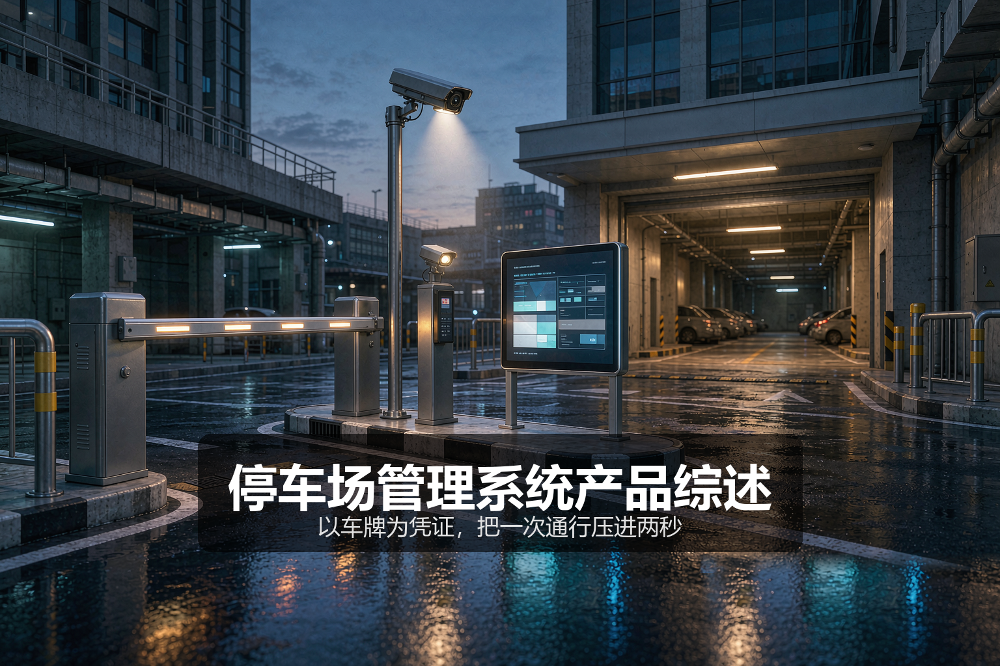
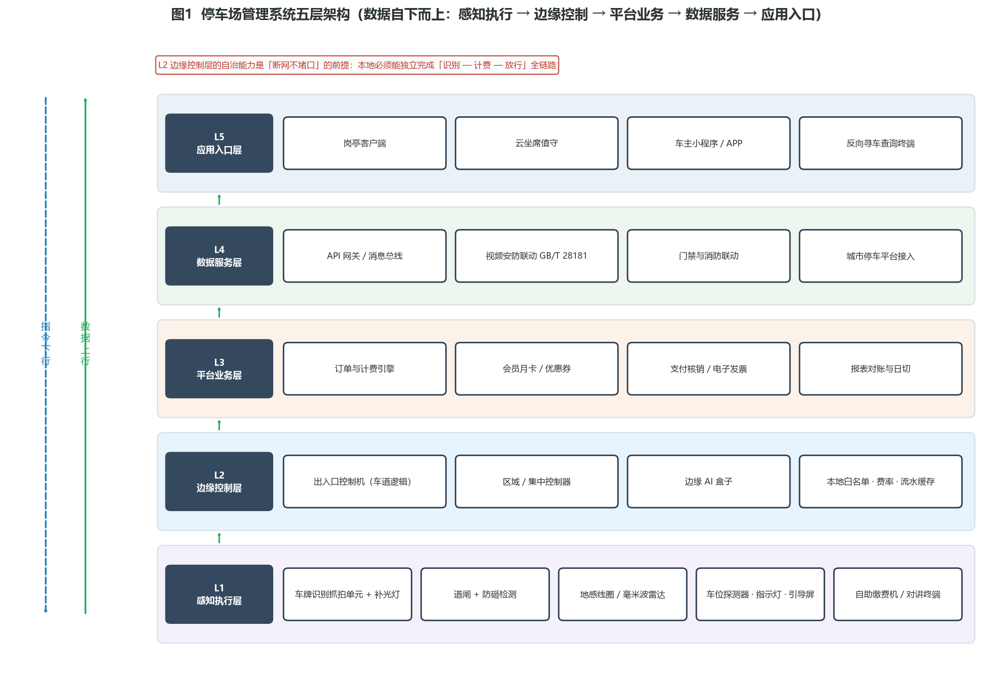
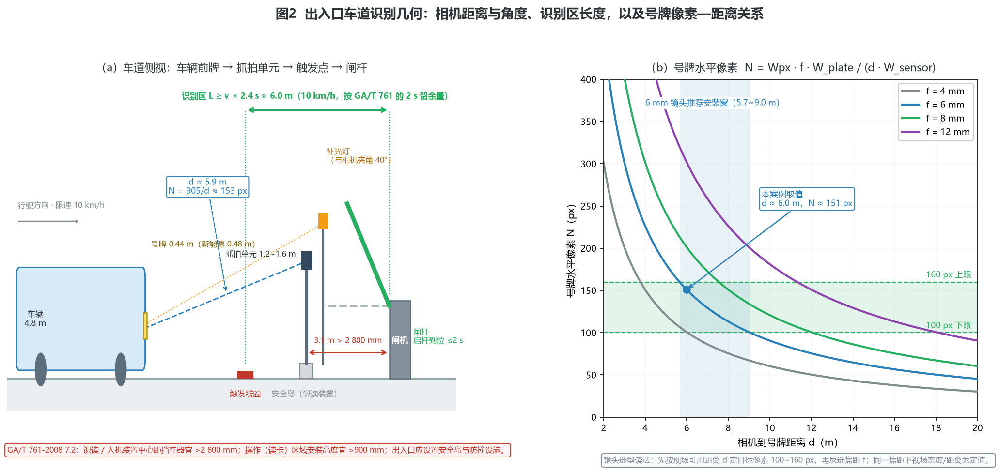
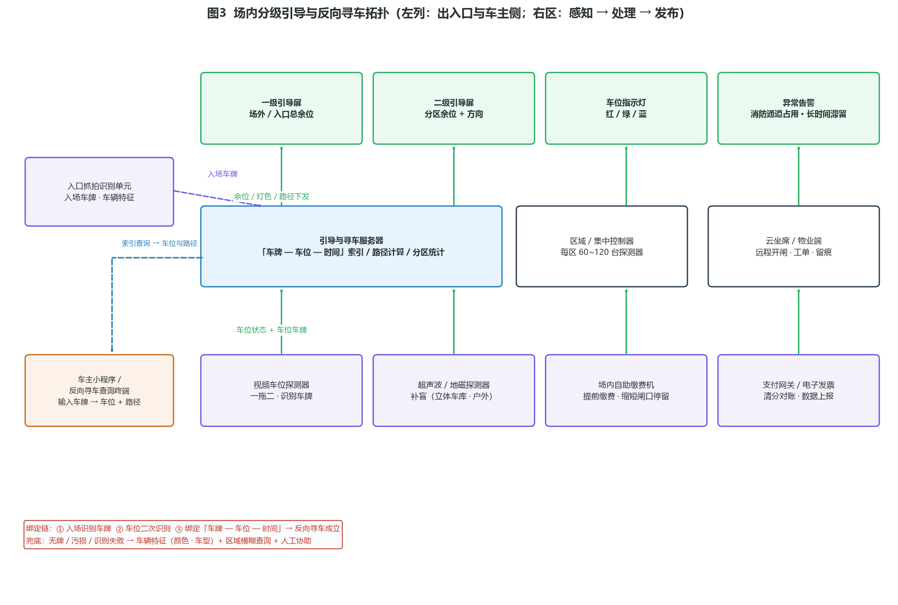
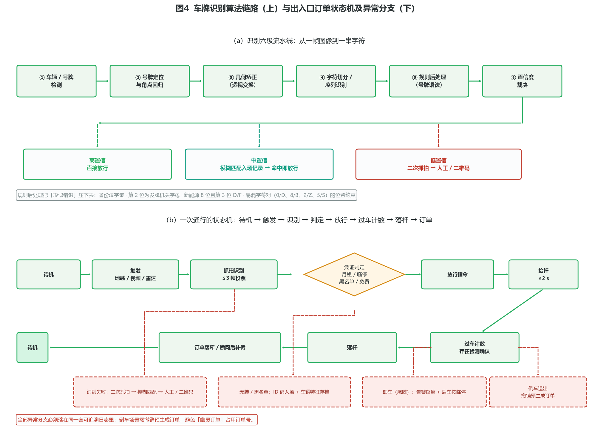

# 停车场管理系统产品综述：以车牌为凭证，把一次通行压进两秒

> **面向读者**：弱电/安防集成商、物业与园区工程岗、停车场运营方、以及要做选型与验收的甲方技术口。
> **数据口径**：文中标注「工程基准」的数值来自公开标准或行业通行做法，标注「工程估算」的数值为可复算的推算示例，不构成任何厂商的承诺指标。



*封面为概念示意图，非真实项目照片。*

---

## 〇、一句话定位

**停车场管理系统以车牌识别为核心凭证，把入口放行、场内引导、计费缴费、出口核销串成一条闭环，用一套系统同时回答三个问题：这辆车是谁、它在哪、它该付多少钱。**

这句话里藏着这门生意最难的三件事，也是全文的主线：

| 问题 | 技术手段 | 失败后果 | 度量口径 |
|---|---|---|---|
| 这辆车是谁 | 车牌识别（+ 卡/票/ETC/人脸兜底） | 识别不出 → 人工介入 → 堵口 | 号牌识别准确率（GA/T 833-2016） |
| 它在哪 | 车位状态感知 + 跨镜追踪 | 引导错、寻车错 | 车位状态准确率、反向寻车命中率 |
| 它该付多少钱 | 订单 + 计费规则 + 支付核销 | 漏收/错收/纠纷 | 对账差异率、订单幂等性 |

停车场的工程价值，几乎全部压在**出入口闸口的通行能力**上。一个 800 车位的商业车库，周末晚高峰两小时内要吐出近千辆车，如果单条出口车道处理一辆车要 12 秒，排队会在二十分钟内溢出到市政道路——这时再漂亮的车位引导大屏也救不了场。所以本文的第一笔账就从「一次通行要几秒」算起。

**六个数字先放在这里，后面每一笔账都会回到它们：**

1. **2 s**——GA/T 761-2008 要求：从车辆身份信息确认放行到挡车器开启，响应时间不大于 2 s；按取卡键到出卡机出卡同样不大于 2 s。
2. **1.5 s / 2.5 s**——GA/T 1132-2014 按栏杆长度分档的单程运行时间门槛，短杆（≤3 m）可做到 1.5 s 级。
3. **95% / 90%**——GA/T 833-2016 的号牌号码识别准确率底限：日间不小于 95%，夜间不小于 90%。
4. **2 800 mm**——GA/T 761-2008 安装要求：读卡机（或等效识读/人机交互装置）中心距挡车器的安装距离宜大于 2 800 mm。
5. **30 天 / 1 年**——GA/T 761-2008 保存时间：出入口与场区图像不少于 30 天；系统管理软件事件信息不少于 1 年。
6. **IP54 / IP52**——室外设备外壳防护不低于 IP54，室内不低于 IP52（GA/T 761-2008，参照 GB 4208）。

---

## 一、产品设计方案

### 1.1 系统定位与五层架构

停车场管理系统不是一个「设备」，而是一条**跨机电、跨软件、跨运营的链路**。工程上习惯把它拆成五层，每一层的故障模式完全不同，验收时也应该分层验：


*图1 五层架构：感知执行 → 边缘控制 → 平台业务 → 数据服务 → 应用入口（工程示意）*

| 层 | 主要设备 | 关键职责 | 典型故障与后果 | 冗余设计要点 |
|---|---|---|---|---|
| L1 感知执行 | 车牌识别抓拍单元 + 补光灯、道闸（直杆/栅栏杆/广告杆）、车辆检测器（地感线圈/毫米波雷达/视频）、防砸装置、取票机/缴费机、对讲终端、车位探测器（视频/超声波/地磁）、车位指示灯、引导屏 | 取得凭证、判断车辆存在、执行放行 | 相机污损/逆光失效、地感误判、闸杆不落 | 双检测器互校、离线白名单 |
| L2 边缘控制 | 出入口控制机/车道控制器、区域控制器、车位引导管理器、边缘 AI 盒子 | 车道逻辑自治、脱机放行、设备联动 | 断网即堵口 | **本地必须能独立完成识别—计费—放行全链路** |
| L3 平台业务 | 收费与订单服务、会员月卡、优惠券与商家核验、报表对账、支付网关、电子发票 | 算钱、记账、稽核 | 重复扣款、跨时段计费错 | 订单幂等、对账日切 |
| L4 数据服务 | API 网关、消息总线、与视频安防（GB/T 28181）、门禁、消防、城市停车平台对接 | 打通与外溢 | 数据孤岛、接口耦合 | 契约化接口、版本管理 |
| L5 应用入口 | 岗亭客户端、云坐席、车主小程序/APP、物业端、反向寻车查询终端 | 人机交互 | 异常处置慢 | 云坐席兜底、一键开闸留痕 |

**为什么强调 L2 的自治能力**：停车场是所有弱电系统里**断网代价最即时**的——网络一断，车就堵在门口，而堵车会立刻变成投诉与舆情。因此合格的出入口控制机应当具备：本地白名单（月租车辆）≥ 数万条量级、本地费率表、本地流水缓存、以及恢复网络后的自动补传与对账。这条要求在招标技术条款里常被写成「断网脱机可正常收费放行，联网后自动上传」。

**与安防系统的联动**：GA/T 761-2008 的 6.1.3.3 明确，系统宜具有接收与其相连的视频安防监控系统、紧急报警系统发出的信号并执行的能力，也可向这些系统发出控制信号。这条在工程上常被翻译成两件具体事：一是车牌识别抓拍单元要能按 GB/T 28181 向安防平台注册与推送；二是消防联动时（如火警信号），出入口道闸应能自动切换到放行状态。

### 1.2 产品形态分类

#### 表 1-1 按业务形态划分

| 形态 | 典型场景 | 建设重点 | 常见误区 |
|---|---|---|---|
| 出入口收费型 | 住宅小区、单位大院、园区 | 闸口通行能力、月租/临停分流 | 只算车位数不算峰值流量 |
| 场内引导型 | 商业综合体、医院、交通枢纽 | 车位引导、反向寻车、缴费分流 | 上了引导却不做分区与灯色策略 |
| 城市路内型 | 路侧占道、公共停车场联网 | 地磁/PDA 取证、城市平台对接 | 计费边界与争议处理机制缺失 |
| 平台运营型 | 连锁物业、城市级平台 | 多场接入、清分结算、运营看板 | 只做数据汇聚不做清分对账 |

#### 表 1-2 按车辆凭证（识别方式）划分

| 凭证 | 工作频段/介质 | 通行速度 | 适用车辆 | 主要短板 |
|---|---|---|---|---|
| 车牌识别 | 可见光成像 + 算法 | 5~15 km/h 减速通过 | 全部（含无牌兜底） | 逆光、污损、无牌车、套牌 |
| IC/ID 卡 + 票券 | 13.56 MHz / 125 kHz、条码纸票 | 需停车取卡，最慢 | 临时车 | 耗材、卡丢失、无法无人值守 |
| 蓝牙远距离 | 2.4 GHz BLE 或 433 MHz | 10~20 km/h | 固定月租车 | 临时车体验差、需发卡管理 |
| UHF RFID | 900 MHz 频段无源标签 | 10~20 km/h | 单位/园区固定车、物流车辆 | 标签易被屏蔽（金属膜、手撕） |
| ETC | 5.8 GHz DSRC | 20~40 km/h 不停车 | 已装 OBU 车辆 | 覆盖有限、需清分结算通道 |
| 二维码 + 人脸 | 扫码/生物特征 | 需停车或低速 | 无牌车、非机动车、行人 | 依赖网络与手机 |

> 工程现实：**主流做法是「车牌识别为主 + 二维码/ETC 为增补 + 人工兜底」**。车牌识别的优势在于凭证天然属于车辆本身（不需要发卡、不需要用户装设备），且可无人值守；它的短板则集中在成像条件与特殊车辆上，需要用规则与流程补，而不是靠堆算法。

#### 表 1-3 按部署架构划分

| 架构 | 数据落地 | 优势 | 风险 | 适用 |
|---|---|---|---|---|
| 本地部署 | 场内服务器 | 断网可用、数据自主 | 运维靠人、升级慢 | 单场、涉密/园区 |
| 私有云 | 集团机房 | 多场统一、数据可控 | 专线成本 | 连锁物业 |
| 公有云 SaaS | 云 | 上线快、迭代快 | 断网依赖边缘自治 | 长尾小场 |
| 混合 | 边缘 + 云 | 兼顾自治与统一运营 | 架构复杂度最高 | 大型商业/城市平台 |

### 1.3 关键设计要点：八道关

做任何停车项目，方案评审时逐条过这八关，基本能挡住八成返工：

1. **通行能力关**：先算峰值流量，再定车道数与凭证组合（见 2.2）。车道数不足是后期最难补救的设计缺陷——土建已经定型。
2. **识别可靠性关**：相机安装几何（距离、高度、偏角）、补光方式、车牌像素密度三者必须一起定（见 2.3）。
3. **支付闭环关**：订单必须幂等。同一辆车重复识别进出、断网期间重复缴费、支付回调迟到，这三种情况都要有确定行为。
4. **防砸与安全关**：闸杆下方必须有存在检测（地感/雷达/红外），且要「检测优先于落杆」；遇阻反弹是最后一道机械防线。
5. **计费规则关**：跨时段阶梯、会员免费时长、商家券、节假日规则（GA/T 761-2008 也把节假日计费作为常见功能）、免费车牌（军警、救护）都要能在边缘侧执行。
6. **断网降级关**：脱机放行策略、白名单容量、流水缓存天数、恢复后的补传与对账，缺一不可。
7. **数据与合规关**：车牌属于个人信息，采集目的、留存期限、加密存储、查询审计要有明确策略；对外接口（城市平台、商家券核销）要做最小必要原则。
8. **土建机电关**：安全岛、排水坡度、管线预埋、供电容量、防雷接地、设备防护等级——这些一旦浇筑完成就改不动了。

---

## 二、核心参数与选型

### 2.1 参数速查表

| 类别 | 参数 | 工程基准 / 典型值 | 出处或口径 |
|---|---|---|---|
| 识别 | 号牌号码识别准确率（日/夜） | ≥95% / ≥90% | GA/T 833-2016 |
| 识别 | 号牌颜色识别准确率（日/夜） | ≥90% / ≥80% | GA/T 833-2016 |
| 识别 | 号牌种类识别准确率 / 未悬挂号牌识别率 | ≥95% / ≥80% | GA/T 833-2016 |
| 识别 | 抓拍图像分辨率 | ≥1 600×1 200 或 1 920×1 080 | GA/T 833-2016 图像要求 |
| 识别 | 号牌水平像素（招标常见口径） | ≥100 像素点，且不宜超过 160 | 工程基准（招标文件普遍采用） |
| 识别 | 识别输出时延 | 亚秒级（工程基准 0.2~0.6 s） | 工程估算 |
| 通行 | 身份确认放行 → 挡车器开启 | ≤2 s | GA/T 761-2008 6.3.1 |
| 通行 | 取卡键 → 出卡机出卡 | ≤2 s | GA/T 761-2008 6.3.1 |
| 通行 | 栏杆机单程运行时间 | ≤1.5 s / 1.5~2.5 s / >2.5 s 分档（与杆长匹配） | GA/T 1132-2014 |
| 通行 | 识读控制响应 / 启杆到位 | ≤1 s / ≤2 s（栅栏型 3 m 杆 ≤3 s、4 m 杆 ≤5 s） | 上海智能安防检测技术要求（地标，作为工程基准参考） |
| 通行 | 运行噪声 | ≤75 dB(A) | GA/T 1132-2014 |
| 通行 | 状态转换寿命 | 放行/禁行不间断转换 500 次后功耗与转换速率无明显变化 | GA/T 1132-2014 |
| 通行 | 遥控距离 | ≥30 m（地标口径） | 上海地标 |
| 通行 | 电源适应性 | AC 220 V ±15%；DC 额定 ±10% | GA/T 1132-2014 |
| 声像 | 出入口声提示声压 | ≥55 dB(A)（距音源正前方 0.5 m） | GA/T 761-2008 6.3.4 |
| 声像 | 图像比对显示分辨率 | 彩色 ≥220 TVL / 灰度 ≥7 级；黑白 ≥320 TVL / 灰度 ≥8 级 | GA/T 761-2008 6.3.4 |
| 计时 | 计时精度 | 非网络型 ≥5 s/d；网络型中央主机 ≥5 s/d，其他计时部件 ≥10 s/d | GA/T 761-2008 6.3.2 |
| 存储 | 事件信息 / 图像 | 事件 ≥1 年；出入口与场区图像 ≥30 天 | GA/T 761-2008 6.3.3 |
| 防护 | 外壳防护等级 | 室外 ≥IP54；室内 ≥IP52 | GA/T 761-2008 7.1（参照 GB 4208） |
| 安装 | 识读/人机装置中心距挡车器 | 宜 >2 800 mm | GA/T 761-2008 7.2 |
| 安装 | 读卡（操作）区域安装高度 | 宜 >900 mm | GA/T 761-2008 7.2 |
| 安装 | 出入口安全措施 | 应设置安全岛、防撞设施 | GA/T 761-2008 7.2 |
| 建筑 | 小型车外廓尺寸 | 4.8 m（长）× 1.8 m（宽）× 2.0 m（高） | JGJ 100-2015 |
| 建筑 | 垂直式后退停车最小车位 | 5.3 m（毗邻墙/连续分隔物）或 5.1 m（车位毗邻）× 2.4 m | JGJ 100-2015 表 4.3.4 |
| 建筑 | 垂直式后退停车通车道最小宽度 | 5.5 m（前进停车为 9.0 m）；库内通车道 ≥3.0 m | JGJ 100-2015 |
| 建筑 | 停车区域净高 | ≥2.2 m | JGJ 100-2015 |
| 建筑 | 机动车与墙/柱等构筑物净距 | 纵向 0.5 m、横向 0.6 m | JGJ 100-2015 |
| 环境 | 设备环境类别 | I 类室内（含地下车库）/ II 类室外有遮蔽（含车库出入口）/ III 类完全露天 | GA/T 1132-2014 |
| 车位探测 | 视频车位探测器覆盖 | 常见 1 台覆盖 2~3 个车位（单侧或双侧） | 工程基准 |
| 车位探测 | 超声波/地磁 | 超声波成熟、成本低；地磁适用于户外与路内 | 工程基准 |

> **参数使用提醒**：上表中「识别准确率」是**实验室图库口径**（按 GA/T 833 的试验方法，在规定像素与成像条件下取得），与现场实际识别率不是一回事。招标时若把 ≥99% 直接写进现场验收条款，几乎必然扯皮——正确做法是把**成像条件（像素密度、补光、车速、车道几何）写成可验收的前置条件**，再谈准确率。

### 2.2 第一笔账：通行能力，别只看车位数

#### 2.2.1 单车服务时间怎么拆

一次完整的「闸口服务」由四段构成：

$$t_s = t_{识别} + t_{抬杆} + t_{通过} + t_{间隔}$$

| 段 | 月租自动放行 | 临停取卡（旧式） | 出口无感支付 | 出口扫码支付 |
|---|---|---|---|---|
| 识别/凭证 | 0.4 s（识别+比对） | 0.4 s | 0.4 s | 0.4 s |
| 抬杆 | 1.2 s（≤3 m 直杆） | 1.2 s | 1.2 s | 1.2 s |
| 车辆通过闸口 | 2.5 s（4.8 m 车长 / 2.8 m·s⁻¹） | 2.5 s | 2.5 s | 2.5 s |
| **人工操作/支付** | 0 | +6.0 s（取卡+起步） | +1.0 s（扣费回调） | +8.0 s（掏手机、扫码、确认） |
| 安全间隔 | 1.0 s | 1.0 s | 1.0 s | 1.0 s |
| **合计 $t_s$** | **≈5.1 s** | **≈11.1 s** | **≈6.1 s** | **≈13.1 s** |
| 理论能力 $C=3600/t_s$ | **≈706 辆/h** | **≈324 辆/h** | **≈590 辆/h** | **≈275 辆/h** |

（工程估算：通过速度取 10 km/h ≈ 2.78 m/s，车长按小型车 4.8 m；人工操作时长为现场观测的常见区间中值。）

#### 2.2.2 峰值流量从哪来

在没有历史数据的改造项目里，用**车位数 × 高峰周转系数**估算单向峰值流量（工程估算，需在试运行期用实测校准）：

| 业态 | 高峰方向 | 高峰系数 $k$（辆/h ÷ 车位数） | 说明 |
|---|---|---|---|
| 住宅小区 | 早高峰出场 / 晚高峰入场 | 0.35~0.55 | 通勤集中，双峰极陡 |
| 写字楼 | 早高峰入场 / 晚高峰出场 | 0.45~0.70 | 早高峰最陡 |
| 商业综合体 | 周末与节假日傍晚出场 | 0.40~0.60 | 散场瞬时叠加 |
| 三甲医院 | 上午入场（门诊） | 0.30~0.50 | 持续时间长、尾段重叠 |
| 交通枢纽 | 班次驱动 | 由班次表推算 | 不能用系数法 |

单向需求 $\lambda = P \times k$。若单向车道数为 $n$ 且均衡分配，则单车道 $\lambda_{lane}=\lambda/n$。

#### 2.2.3 排队是否发散：一个够用的 M/M/1 判据

把单车道看作一个服务台，服务率 $\mu = 3600/t_s$（辆/h），利用率 $\rho = \lambda_{lane}/\mu$。在 M/M/1 近似下：

$$L_q=\frac{\rho^2}{1-\rho},\qquad W_q=\frac{L_q}{\lambda_{lane}}$$

- **ρ < 0.7**：排队 $<1.6$ 辆，可直接放行设计；
- **0.7 ≤ ρ < 0.9**：排队 1.6~8.1 辆，必须在闸口前留出排队车位，并考虑潮汐车道；
- **ρ ≥ 1**：排队随时间发散，设计不合格。

**算例**：某住宅小区 480 车位，晚高峰入场 $\lambda = 480 \times 0.45 = 216$ 辆/h，入口 1 条车道：$t_s = 5.1\ \text{s} \Rightarrow \mu = 706$，$\rho = 0.31$，$L_q = 0.14$ 辆——入口没问题。
早高峰出场 $\lambda = 480 \times 0.55 = 264$ 辆/h。若出口 1 条车道且**无感支付渗透率 60%**：

$$t_s = 0.6 \times 6.1 + 0.4 \times 13.1 = 8.9\ \text{s} \Rightarrow \mu = 404,\ \rho = 0.65,\ L_q = 1.22\ \text{辆},\ W_q \approx 17\ \text{s}$$

若渗透率跌到 20%（老年业主多、优惠券必须现场扫码）：

$$t_s = 0.2 \times 6.1 + 0.8 \times 13.1 = 11.7\ \text{s} \Rightarrow \mu = 308,\ \rho = 0.86,\ L_q = 5.2\ \text{辆},\ W_q \approx 71\ \text{s}$$

**结论**：同一个停车场、同样的设备，支付方式的渗透率可以把等待时间从 17 秒推到 71 秒。**推行无感支付/提前缴费，等价于花钱新开一条车道**，而且成本低一个数量级。这就是为什么现代停车项目的第一优先级不是加车道，而是把支付动作从闸口前移到「离场之前」。

#### 2.2.4 车道数配置的工程规则

- 单向 $\lambda \le 0.6\mu$ 时，1 条车道够用；
- $\lambda$ 超过单车道能力 60% 即应拆分（月租专用道 / 临停道 / 无感支付专用道）；
- **通道冗余**：承担主要流量的方向至少 2 条车道，按「N-1 故障仍不发散」校核（见案例二）；
- **潮汐车道**：早晚高峰方向相反的场景（住宅、写字楼），可共用中间车道 + 双向闸口，节省土建。

### 2.3 第二笔账：车牌识别相机的安装几何

识别不准，八成不是算法问题，是**装的位置不对**。核心只有一个可验收量：**号牌在图像里占多少像素**。

#### 2.3.1 从像素要求反推安装距离

设相机水平像素 $W_{px}$、靶面宽 $W_{sensor}$、镜头焦距 $f$、相机到号牌距离 $d$，则视场宽度与号牌水平像素数为：

$$W_{fov}=d\cdot\frac{W_{sensor}}{f},\qquad N_{px}=\frac{W_{px}}{W_{fov}}\cdot W_{plate}=\frac{W_{px}\cdot f}{d\cdot W_{sensor}}\cdot W_{plate}$$

取常见配置 $W_{px}=1920$、$W_{sensor}=5.6\ \text{mm}$（1/2.8" 靶面）、$W_{plate}=0.44\ \text{m}$（普通小型车号牌宽度；新能源号牌 0.48 m）：

| 焦距 | 号牌水平像素 $N_{px}$ 与距离 $d$ 的关系 | 推荐 $d$（目标 100~160 px） | 该距离下视场宽度 |
|---|---|---|---|
| 4 mm | $N=604/d$ | 3.8~6.0 m | 5.3~8.4 m |
| 6 mm | $N=905/d$ | 5.7~9.0 m | 5.3~8.4 m |
| 8 mm | $N=1207/d$ | 7.5~12.0 m | 5.3~8.4 m |
| 12 mm | $N=1811/d$ | 11.3~18.0 m | 5.3~8.4 m |

（工程估算：$W_{fov}=d\cdot W_{sensor}/f$，可见同一焦距下「视场宽度/距离」是定值，改变距离只是把号牌在画面里放大或缩小。）

指导意义很直接：

- **4~6 mm 变焦头适合近距离车道（3~8 m）**，这是最常见的小区/园区闸口；
- **8~12 mm 适合收费站式长车道或需要远距离预识别的场景**；
- 把 4 mm 头装到 12 m 外，号牌只剩 50 px，再好的算法也回天乏力——这类「装完才发现」的错误占现场返工的大头。

#### 2.3.2 三条几何约束

| 约束 | 工程基准 | 失效表现 |
|---|---|---|
| 水平偏角（相机光轴与车道方向夹角） | ≤25°（尽量 ≤15°） | 号牌透视变形、字符宽度不足 |
| 俯角（光轴下倾角） | ≤20°（相机安装高度 1.2~1.6 m，距号牌 4~8 m） | 号牌被压缩，垂直像素不足（号牌高 0.14 m，宽度像素 120 px 时高度仅约 38 px） |
| 横向偏移（相机距车道中心线） | 1.5~3.0 m（立在安全岛上） | 偏角超标或过路车遮挡 |


*图2 车道侧视几何与号牌像素—距离关系（工程示意，含推荐安装窗口与识别区长度约束）*

#### 2.3.3 识别区长度与车速的硬约束

车辆从触发到车头抵达闸杆，必须走完「识别 + 抬杆」。设识别区长度为 $L$（触发线圈/视频触发线到闸杆的距离）：

$$L \ge v \cdot (t_{识别} + t_{抬杆})$$

按 GA/T 761 的 2 s 上限留安全余量，取 $(0.4 + 2.0) = 2.4\ \text{s}$：

| 通行速度 | 需要的最小识别区长度 $L$ | 结论 |
|---|---|---|
| 5 km/h（1.39 m/s） | 3.3 m | 普通闸口轻松满足 |
| 10 km/h（2.78 m/s） | 6.7 m | 常规设计取值（读卡机距闸 ≥2.8 m 之外还需纵深） |
| 15 km/h（4.17 m/s） | 10.0 m | 需专用长车道 |
| 20 km/h（5.56 m/s） | 13.3 m | 需预识别 + 快速杆（≤1.5 s）或 ETC |

（工程估算。若现场实测抬杆稳定 1.2 s，则系数可降为 1.6 s，$L$ 相应缩短约 1/3。）

**常见的坑**：把识别触发做在闸杆正前方 3 m 处，却要求 20 km/h 通行——物理上不可能，结果是「车到了杆还没起来」，司机急刹、闸杆被撞。

#### 2.3.4 补光的三条纪律

1. **补光灯与相机分离且成夹角**：同轴补光会在号牌反光膜上形成「猫眼回射」过曝；工程上常取补光灯与相机夹角 30°~45°，灯与车牌距离 3~5 m。
2. **外场一律避免强白光直射驾驶员**：采用低色温暖光、限制功率并加格栅遮光，既保证成像又避免眩光投诉；同时避免与交通信号灯、监控补光互相干扰。
3. **夜间与逆光要分开验证**：验收时至少取三个时段（正午顶光、黄昏逆光、夜间无环境光）各拍 100 车次，分别统计准确率，而不是只测白天。

### 2.4 第三笔账：道闸选型与防砸

#### 2.4.1 杆型与速度匹配

按 GA/T 1132-2014，栏杆机单程运行时间与栏杆长度相匹配，制造商应在说明书中明确。结合上海地标口径，形成如下选型参照：

| 杆型 | 杆长 | 单程运行时间（工程基准） | 适用 |
|---|---|---|---|
| 直杆 | ≤3 m | ≤1.5 s（启杆到位 ≤2 s） | 小区、园区标准车道 |
| 直杆/折臂 | 3.5~4.5 m | 1.5~2.5 s（4 m 杆启杆到位 ≤5 s） | 宽车道、限高处 |
| 栅栏杆 | 3~4 m | 2.5~5 s | 需防人员穿越的封闭管理口 |
| 广告杆/重型杆 | 4~6 m | 更慢，需按厂家标称核算 | 商业出入口（注意风载） |

**风载提示**：广告杆受风面积大，露天安装必须核算风压与基础，并确认厂家给出的抗风等级；台风多发地区优先短杆 + 落地支撑。

#### 2.4.2 防砸的四层防线

| 防线 | 手段 | 作用时机 | 失效兜底 |
|---|---|---|---|
| 1 存在检测 | 闸下地感线圈 / 毫米波雷达 / 红外对射 | 落杆前持续检测 | 需与主控独立供电与信号 |
| 2 逻辑互锁 | 「过车计数未完成」→ 禁止落杆 | 软件层 | 依赖计数正确 |
| 3 遇阻反弹 | 电机电流/力矩检测或机械离合 | 接触瞬间 | 最后电气防线 |
| 4 机械/警示 | 杆底胶条、黄黑警示、减速带、限速标识 | 被动 | 降低伤害与责任 |

> **验收动作**：防砸测试不能只做「人手挡一下」。正确做法是：用真实车辆停在杆下不动 → 触发落杆 → 杆必须停在半空或反弹；再让车辆缓慢通过，验证「车未完全通过不落杆」。

#### 2.4.3 车道几何与土建

| 项目 | 工程基准 | 依据/说明 |
|---|---|---|
| 识读/人机装置中心距挡车器 | 宜 >2 800 mm | GA/T 761-2008 7.2 |
| 操作区域安装高度 | 宜 >900 mm（人机工效常取 1.0~1.3 m） | GA/T 761-2008 7.2 |
| 安全岛 | 必须设置；高出路面 150~200 mm，宽 400~600 mm | GA/T 761-2008 7.2 + 工程基准 |
| 单车道宽度 | 净宽 ≥3.0 m（库内通车道最小）；混合车道 3.5~4.0 m | JGJ 100-2015 |
| 双向车道 | ≥6.0 m（两条 3.0 m）+ 中央分隔 | 工程基准 |
| 排队纵深 | 按 $L_q$ 峰值 × 6.0 m/辆 预留 | 2.2 节结论 |
| 排水 | 车道向排水侧找坡，避免积水淹没线圈与岛内管线 | 工程基准 |
| 防雷接地 | 室外杆件与设备接地，弱电与强电分开走管 | 参照 GB 50348 相关要求 |

### 2.5 第四笔账：场内引导与反向寻车的设备量

#### 2.5.1 车位状态感知的三种技术

| 技术 | 原理 | 准确率/成熟度 | 安装 | 额外能力 | 成本 |
|---|---|---|---|---|---|
| 视频车位探测器 | 车位上方相机 + 车位/车牌识别 | 高，且可反向寻车 | 桥架/吊装，一拖 2~3 | 车牌绑定、取证、跨镜追踪 | 高 |
| 超声波探测器 | 超声测距判断有无车 | 成熟、稳定 | 前置吊装或地贴 | 仅状态，无车牌 | 低 |
| 地磁探测器 | 检测车辆对地磁扰动 | 户外/路内成熟 | 地面开孔埋设 | 无车牌，受邻位影响 | 低（无线） |
| 视频 + 超声融合 | 双模互校 | 最高 | 综合 | 覆盖盲区（立体车库、恶劣光照） | 最高 |

**选型逻辑**：若项目**需要反向寻车**或要与车位级运营（充电桩位、专属车位占用告警）打通，就必须上视频探测器；若只是「空位指示」，超声波/地磁的性价比更高。

#### 2.5.2 设备量核算（以 800 车位地下车库为例）

| 项目 | 算法 | 数量 |
|---|---|---|
| 视频车位探测器 | 800 ÷ 2（一拖二） | 400 台 |
| 区域/集中控制器 | 每台管理 60~120 台探测器（工程基准），6 个防火分区 | 6~8 台 |
| 车位指示灯 | 每个车位 1 只（或两车位共用 1 只，方案需明确） | 800 只（或 400 只） |
| 一级引导屏（场外/入口总余位） | 1~2 | 2 块 |
| 二级引导屏（各层/各区岔路口） | 每防火分区入口 1 块 | 6~8 块 |
| 反向寻车查询终端 | 每部客梯厅 + 主要人行出入口 | 6~10 台 |
| 网络 | 每 24 口接入交换机带 20~24 台探测器 | 约 18~20 台接入交换机 |

**反向寻车的两条技术路线**：

- **车牌绑定路线**（视频）：车位探测器识别车牌 → 服务器建立「车牌—车位—时间」索引 → 查询终端输入车牌 → 给出车位号与路径。优点是无感、体验好；缺点是依赖识别率，无牌/污损车需兜底。
- **刷卡/扫码定位路线**：车主在车位附近刷卡或扫码定位。优点是确定性强；缺点是依赖用户动作，实际使用率低，已逐步被视频路线取代。


*图3 场内分级引导（总余位 → 分区 → 车位灯）与反向寻车的数据链路（工程示意）*

**兜底设计必须写进方案**：无牌车、车牌污损、识别失败时的寻车路径——常见做法是「车辆特征（颜色/车型）+ 大致区域 + 模糊查询」，并在查询终端给出「可能车位」列表。

### 2.6 第五笔账：存储、网络与断网降级

#### 2.6.1 存多少：图片路线 vs 录像路线

GA/T 761-2008 要求：**事件信息 ≥1 年，出入口与场区图像 ≥30 天**。

| 方案 | 单通道日增量 | 30 天总量 | 说明 |
|---|---|---|---|
| 抓拍图片（每车 2~3 张，JPEG 约 250~350 KB） | 约 0.9~1.6 GB/日（600 车次） | **约 30~50 GB** | 满足 30 天合规，成本极低 |
| 全时录像（1080p / 4 Mbps） | 约 42 GB/日 | **约 1.3 TB/路** | 4 路即超 5 TB |

（工程估算：4 Mbps ÷ 8 = 0.5 MB/s × 86 400 s = 43.2 GB/日。）

**结论**：出入口以**结构化流水 + 抓拍图**满足合规与稽核为主；录像只在争议高发位（收费岗亭、闸口全景、场内地库坡道）按需配置，避免为「感觉更安全」付出十倍存储成本。

#### 2.6.2 网络与边缘自治

| 项 | 工程基准 |
|---|---|
| 传输 | 每台抓拍/探测器独享千兆接入，上行汇聚 ≥1 Gbps；车牌识别单元建议独立 VLAN |
| 脱机能力 | 出入口控制机本地保存白名单、费率表、流水；断网期间正常识别—计费—放行 |
| 白名单容量 | ≥5 万条（大型社区/园区按车位数的 3~5 倍设计） |
| 流水缓存 | ≥30 天本地留存，恢复后自动补传并标记补传来源 |
| 校时 | 全网 NTP 校时，中央主机计时精度 ≥5 s/d、其他计时部件 ≥10 s/d（GA/T 761-2008 6.3.2），并按天自动校时 |
| 联动接口 | 视频安防（GB/T 28181）、门禁、消防、城市停车平台；接口契约化并留版本 |

#### 2.6.3 供电与防护

- 抓拍单元 + 补光灯峰值功率常超过 PoE（802.3af，12.95 W）预算，应采用 **PoE+（30 W）或本地 12 V/2 A 供电**，并在图纸上标注；
- 出入口控制机、岗亭设备配 UPS，保证停电时可完成「抬杆放行 + 数据落盘」（工程基准 ≥30 min）；
- 室外设备外壳防护 ≥IP54（GA/T 761-2008），车道内埋地设备（地磁、线圈）需考虑积水与重载碾压；
- 栏杆机电源适应性：AC 220 V ±15%、DC ±10%（GA/T 1132-2014），配电设计按此留裕量。

### 2.7 十二条踩坑清单

| # | 坑 | 后果 | 预防 |
|---|---|---|---|
| 1 | 只按车位数定车道数，不算峰值流量 | 高峰溢出到市政路 | 用 2.2 的 $\lambda$ 与 $\rho$ 校核 |
| 2 | 相机装太远/焦距不对 | 号牌像素不足，夜间崩 | 用 2.3 公式定 $d$ 与 $f$ |
| 3 | 识别触发点距闸杆过近却要求高速通行 | 车到杆未起、撞杆 | $L \ge v \times 2.4\ \text{s}$ |
| 4 | 补光与相机同轴 | 反光膜过曝 | 夹角 30°~45° |
| 5 | 无牌/污损车无流程 | 人工介入堵口 | 二维码 ID 入场 + 人工辅助（GA/T 761 亦将「无牌处理」列为常见功能要求） |
| 6 | 出口只做现场扫码支付 | 排队发散 | 无感支付 + 提前缴费 + 场内缴费机 |
| 7 | 订单不幂等 | 重复扣款、投诉 | 订单号唯一 + 回调去重 + 日切对账 |
| 8 | 断网即堵口 | 舆情 | 边缘自治三件套：白名单、费率、流水 |
| 9 | 防砸只靠软件 | 砸车伤人 | 独立存在检测 + 遇阻反弹 |
| 10 | 引导屏只显示总数无分区 | 引导失效 | 分级引导 + 灯色策略 + 分区余位 |
| 11 | 反向寻车无兜底 | 找不到车 | 特征模糊查询 + 人工协助 |
| 12 | 土建与管线未预留 | 后期无法加车道 | 预埋冗余管、安全岛一次成型 |

---

## 三、技术原理

### 3.1 成像基础：车牌为什么难拍，难在哪

车牌识别的本质是一次**在受控条件下的机器读字任务**。它难，是因为四个物理因素同时作用：

#### （1）回归反射与动态范围

机动车号牌使用反光膜，具有**回归反射（retro-reflection）**特性：入射光沿原路返回。这带来两个极端——

- 有补光且同轴时，号牌区域可能比车身亮几个数量级，造成**局部过曝、字符连成一片**；
- 无补光时（尤其夜间），号牌反而比车身暗，成为画面中的低亮区域。

因此抓拍单元需要宽动态（WDR）处理，并在工程上把补光与相机错开角度，让回归反射的光大部分不回到镜头。

#### （2）运动模糊：一个可以算清楚的账

车辆在曝光时间内的位移会造成图像模糊，位移量：

$$\delta = v \cdot t_{exp}$$

取号牌字符笔画宽度约 12 mm（工程基准），要求模糊量不超过笔画的 1/6（约 2 mm）才不影响切分：

| 车速 | 曝光 1/500 s | 曝光 1/1000 s | 曝光 1/2000 s | 结论 |
|---|---|---|---|---|
| 5 km/h（1.39 m/s） | 2.78 mm | 1.39 mm | 0.70 mm | 1/1000 s 即可 |
| 10 km/h（2.78 m/s） | 5.56 mm ⚠ | 2.78 mm | 1.39 mm ✓ | 需 ≤1/1000 s |
| 20 km/h（5.56 m/s） | 11.1 mm ✗ | 5.56 mm ⚠ | 2.78 mm | 需 ≤1/2000 s |

**这条推导解释了一个现场常识**：夜间识别率下降，往往被归咎于「算法不行」，实际根因是——照度不足 → 相机自动延长曝光到 1/200 s 甚至更长 → 运动模糊超过字符笔画 → 字符粘连 → 切分失败。解决办法不是换算法，而是**用补光把照度提上去，把快门锁在 1/1000 s 以内**。这就是为什么补光灯功率、角度、灯距这三个看似「施工细节」的参数，直接决定了夜间准确率。

#### （3）逆光与低角度阳光

黄昏时段出入口正对西向时，太阳高度角低，前挡风与号牌处形成强眩光。工程对策：出入口尽量避开正东西向；无法避开时加遮阳棚/格栅，并采用可调亮度的补光灯抵消背景光。

#### （4）车牌本身的多样性

普通小型车蓝牌（440 mm × 140 mm，7 位）、新能源小型车渐变绿牌（480 mm × 140 mm，8 位）、大型车黄牌、警牌、军牌、使领馆牌、港澳入境双牌、以及临时号牌——版式、字符数、颜色各不相同，识别引擎必须覆盖全版式，且**号牌种类识别准确率 ≥95%、未悬挂号牌识别率 ≥80%**（GA/T 833-2016）。

### 3.2 识别算法链路：从一帧图到一串字符


*图4 上：识别算法六级流水线；下：出入口订单状态机与异常分支（工程示意）*

**识别侧六级流水线：**

1. **车辆/号牌检测**：定位图像中的车辆与号牌候选区（深度学习的单阶段检测为主流）；
2. **号牌定位与角点回归**：输出号牌四角，用于后续矫正；
3. **几何矫正**：透视变换把倾斜号牌「拉正」，消除水平偏角与俯角带来的形变；
4. **字符切分 / 端到端序列识别**：传统做法是切分后单字识别，主流做法是 CNN + RNN/Transformer 的序列识别直接输出字符串；
5. **规则后处理（工程价值常被低估）**：用号牌语法规则校正输出——
   - 第 1 位必须是省份简称（31 个汉字集合）；
   - 第 2 位必须是发牌机关字母；
   - 新能源小型车第 3 位为 D/F，总长 8 位；
   - 易混字符对（0/D、8/B、2/Z、5/S、1/I、6/G）在固定位置上的取值约束；
   - 这一步把「形似错识」压缩掉相当比例，是把 95% 推到 99% 的关键；
6. **置信度裁决**：
   - **高置信** → 直接放行；
   - **中置信** → 与入场记录做模糊比对（允许 1 位差异 + 车型/颜色辅助），命中即放行；
   - **低置信** → 二次抓拍（同一辆车多帧投票）→ 仍失败则转人工/二维码入场。

> **工程提示**：真正决定现场体验的，往往不是「识别率 99%」这个数字，而是**低置信样本的处理流程是否顺滑**。同样 1% 的失败率，一个用二次抓拍 + 模糊比对自动消化掉 80%，另一个全部转人工，现场表现差出一个数量级。

### 3.3 一次通行的状态机：把闸口逻辑写成可验收的图

出入口控制不是「识别成功就抬杆」这么简单，它是一条带异常分支的状态机：

```
待机 → 触发（地感/视频/雷达）
     → 抓拍识别（≤3 帧投票）
     → 凭证判定：白名单月租 / 临停 / 黑名单 / 特殊免费
     → 放行指令 → 抬杆（≤2 s）
     → 过车计数（存在检测确认车辆完全通过）
     → 落杆 → 订单落库/补传
```

**四个必须设计的异常分支：**

| 异常 | 触发条件 | 正确处理 | 错误做法 |
|---|---|---|---|
| 识别失败 | 连续 3 帧低置信 | 二次抓拍 → 模糊匹配 → 二维码/ID 入场 → 人工 | 直接开闸放行（形成无记录车辆） |
| 跟车（尾随） | 过车计数 > 识别数 | 报警留痕 + 后车按临停处理 | 静默放行（为逃费留口） |
| 倒车/退出 | 车辆通过触发区后倒回 | 撤销预生成订单，避免「幽灵订单」 | 订单悬挂 → 出口异常 |
| 无牌/污损 | 号牌种类识别为无牌 | 二维码/ID 码入场 + 车辆特征存档 | 拒绝入场 |

> 招标与验收时，把这张状态机图写进技术条款，比写「识别率 ≥99%」有用得多——**流程是可验收的，准确率数字不是**。

### 3.4 场内：车位状态与「车牌—车位」绑定

- **状态判定**：视频探测器在车位正前上方抓拍，用图像分类/检测判断占用，同时识别车牌；超声波用回波距离；地磁用磁场扰动。
- **跨镜追踪**：车辆在车道被识别 → 进入车位被二次识别 → 系统把两次结果绑定。绑定成功才有反向寻车。
- **冲突消解**：视频判定空、地磁/超声判定占用时，触发二次复核（多帧 + 邻位状态），避免指示灯误导。
- **车位级运营延伸**：同一套感知还能支撑「消防通道占用告警」「充电桩位被燃油车占用」「专属车位占用」「长时间滞留预警」——这些是视频方案相对超声波方案的**增量价值**，也是它贵的理由。

### 3.5 演进脉络

| 代际 | 凭证 | 通行方式 | 痛点 |
|---|---|---|---|
| 第一代 | 纸票 + IC 卡 | 停车取卡/交卡 | 耗材、丢卡、无法无人值守 |
| 第二代 | 车牌识别 + 取卡兜底 | 减速识别通行 | 夜间/污损识别、出口排队 |
| 第三代 | 车牌 + 无感支付 + ETC | 不停车通行 | 支付渗透率决定体验 |
| 第四代 | 车位级视频 + 云坐席 + 城市互联 | 全链路无人化 | 数据合规、跨域清分 |

### 3.6 适用边界：哪些事车牌识别做不了

1. **不能解决「车是谁的」**：识别只认牌不认人，套牌、租借车无法用视频解决，需要与门禁/身份系统联动；
2. **不能在恶劣成像条件下保证体验**：暴雪、泥浆覆盖、强逆光下必然退化，流程兜底比堆算法更有效；
3. **不能替代支付与清分**：识别只提供凭证，钱怎么算、怎么分、怎么开票是另一套系统；
4. **不是安防系统**：车牌识别抓拍是出入口管理的证据链，与视频安防监控（GB/T 28181）是协作关系而非替代关系；
5. **个人隐私边界**：车牌属于个人信息，采集、存储、使用、对外共享都应有明确规则（目的限定、最小必要、留存期限、访问审计；可参考 GB/T 35273《个人信息安全规范》的工程实践）。

---

## 四、产品功能与差异化

### 4.1 功能清单（十二项，按验收优先级排序）

| # | 功能 | 说明 | 验收要点 |
|---|---|---|---|
| 1 | 车牌识别通行 | 入口自动识别放行、出口自动核销 | 分时段（正午/黄昏/夜间）各 100 车次统计准确率 |
| 2 | 白名单月租管理 | 批量导入、有效期、多位多车、续费 | 白名单 ≥5 万条时本地比对时延 |
| 3 | 计费规则引擎 | 分时阶梯、日封顶、会员免费时长、节假日规则 | 跨零点、跨时段、跨免费时长三类用例 |
| 4 | 支付与核销 | 无感支付、扫码、现金/岗亭、商家券 | **订单幂等**：重复回调不重复扣款 |
| 5 | 断网脱机自治 | 本地白名单/费率/流水，恢复后补传 | 拔网线实测 30 min |
| 6 | 防砸与通行安全 | 存在检测 + 逻辑互锁 + 遇阻反弹 | 实车停在杆下测试 |
| 7 | 车位引导 | 分区余位、分级屏、车位指示灯 | 空位指示与实际一致性抽检 |
| 8 | 反向寻车 | 车牌查询、路径生成、终端/小程序 | 无牌车兜底用例 |
| 9 | 云坐席/远程值守 | 远程对讲、远程开闸、工单留痕 | 开闸操作 100% 留痕可追溯 |
| 10 | 报表与对账 | 车流、收入、优惠、差异、日切 | 日切结果与支付渠道对账一致 |
| 11 | 电子发票 | 支付后开票 | 金额与订单一致 |
| 12 | 对外联动 | 视频安防、消防、门禁、城市平台 | 接口契约与版本管理 |

### 4.2 六维对比：凭证技术怎么选

| 维度 | 车牌识别 | IC 卡 + 票 | 蓝牙远距离 | UHF RFID | ETC | 二维码 |
|---|---|---|---|---|---|---|
| 通行速度 | 5~15 km/h | 需停车 | 10~20 km/h | 10~20 km/h | 20~40 km/h | 需停车 |
| 用户侧成本 | 0 | 卡/票 | 30~80 元 | 20~50 元 | 100~200 元（OBU） | 0 |
| 固定车体验 | 好 | 一般 | 好 | 好 | 很好 | 一般 |
| 临时车体验 | 好 | 差 | 差 | 差 | 一般 | 好 |
| 无人值守 | 支持 | 不支持 | 支持 | 支持 | 支持 | 支持 |
| 抗环境干扰 | 中（成像依赖） | 强 | 强 | 中（金属/贴膜屏蔽） | 强 | 依赖网络 |
| 一进一出设备成本（工程估算） | 0.8~1.5 万元 | 0.5~1.0 万元 | 0.6~1.2 万元 | 0.8~1.5 万元 | 1.5~3.0 万元 | 0.3~0.8 万元 |
| 综合评价 | **通用首选** | 逐步淘汰 | 纯固定车场景 | 园区/物流 | 高频与高速口 | 兜底/无牌车 |

> 成本区间为工程估算，仅用于方案比选的量级判断，实际价格随配置、杆型、识别单元档次差异很大。

### 4.3 差异化的三个锚点

做选型或写方案时，真正能把系统分出高下的不是功能多寡，而是三件事：

1. **识别能力是否可验证**：能否提供分时段、分天气、分车型的实测统计，而不是一句「99%」；
2. **闸口的秒数是否可控**：能否给出识别时延、抬杆时间、订单回调时延的分解，并承诺端到端 ≤2 s（GA/T 761 口径）；
3. **异常与对账是否闭合**：识别失败、跟车、断网、重复支付——这四个异常的处理是否在同一套日志里可追溯。

**把这三件事写成验收条款，方案的后期争议会减少一大半。**

---

## 五、应用场景

### 5.1 住宅小区与公寓

- **痛点**：早晚高峰双峰极陡；业主/租户/访客三类车混行；临停车辆占固定车位；改造项目车道数受限。
- **方案**：车牌识别为主 + 月租白名单 + 访客预约（业主小程序下发临时授权）+ 场内缴费机 + 无感支付；访客车位分区固定，配合车位指示灯防止占用。
- **价值**：岗亭无人化；固定车位被占可实时告警；临停收入透明化；**关键是把支付渗透率做上去**（2.2 节证明这等价于加车道）。

### 5.2 商业综合体与购物中心

- **痛点**：周末与节假日散场瞬时流量叠加；顾客找不到车位、找不到车；消费停车优惠核销复杂。
- **方案**：分级车位引导 + 视频反向寻车 + 商家券小程序核销 + 提前缴费/无感支付 + 会员分层（VIP 专区、充电专区）。
- **价值**：寻位时间下降（行业口径常见 30%~70%，具体取决于基线）；出口通行效率提升；券核销与消费数据打通可反向支撑运营。

### 5.3 医院与公共服务机构

- **痛点**：就诊高峰长；急诊/救护车必须优先；职工与患者抢位；老年用户不会用手机支付。
- **方案**：车牌识别 + 分时共享（职工区日间释放给患者）+ 急诊绿色通道（白名单强制放行 + 全程留痕）+ 场内人工缴费机 + 云坐席兜底。
- **价值**：急诊通道不被收费流程阻塞；车位分时复用提升周转；人工通道保留照顾数字弱势群体。

### 5.4 产业园区与物流园区

- **痛点**：货车与客车混行；月台预约；门禁与停车需一体化；访客车辆需审批。
- **方案**：车牌 + UHF RFID 双凭证（固定车发标签）+ 货车专用道（加宽车道、加长识别区）+ 与门禁/访客系统联动 + 称重/装卸区预约。
- **价值**：货车通行效率与客车解耦；访客全流程线上化；园区车辆数据统一。

### 5.5 城市路内与公共停车场联网

- **痛点**：车位边界依赖人工巡查；计费取证争议多；多运营方清分复杂。
- **方案**：地磁/PDA/高位视频 + 统一城市平台接入 + 电子发票 + 争议处理流程（图片证据链）。
- **价值**：路内资源可视化；欠费追缴有据；城市级停车一张图。

---

## 六、实际案例与设计方案

### 案例一：住宅小区改造，480 车位，1 进 1 出 → 支付渗透率才是真瓶颈

**需求**：某 2000 年代初建成的住宅小区，地下 + 地面共 480 个车位，原系统为取卡 + 人工收费，1 进 1 出。业主要求取消岗亭收费员（保留 1 个人工应急岗），早高峰出口排队不得超过 2 辆车。

**现状测量**：早高峰（7:00-9:00）出场实测 2 小时 528 车次，即 $\lambda = 264$ 辆/h，与系数法 $480 \times 0.55$ 吻合。原系统临停需现场缴费，$t_s \approx 13$ s。

**方案**：
- 入口：车牌识别 + 月租白名单自动放行，保留访客预约二维码入场；
- 出口：拆除原收费岗亭主线，改为「无感支付专用道 + 混合车道（含 1 台场内提前缴费逻辑 + 云坐席）」的**两车道**布置；
- 室内加 4 台自助缴费机 / 小程序提前缴费，把支付动作前移；
- 应急兜底：保留 1 个人工应急岗 + 云坐席，处理无牌车、识别失败与纠纷；

**配置核算：**

| 项 | 计算 | 取值 |
|---|---|---|
| 识别相机距离 | $N=905/d$，目标 150 px → $d=905/150=6.0$ m | 相机立柱距触发点 **6.0 m**，6 mm 变焦，水平偏角 12°，俯角 18° |
| 号牌像素校核 | $N=905/6.0=151$ px | 落在 100~160 区间 ✓ |
| 识别区长度 | $L \ge v(0.4+1.2)=2.78 \times 1.6=4.5$ m；按 GA/T 761 上限 2 s 校核取 6.7 m | 设计 **6.0 m**，配套限速 10 km/h 标识与减速带 |
| 曝光/补光 | 10 km/h 需快门 ≤1/1000 s | 补光灯 20 W 暖光，与相机夹角 40°，保证夜间快门仍 ≤1/1000 s |
| 出口单车道能力 | 无感渗透率 70% → $t_s=0.7\times6.1+0.3\times13.1=8.0$ s → $\mu=450$ | $\rho=264/450=0.59$ |
| 排队 | $L_q=\rho^2/(1-\rho)=0.34$ 辆 | **满足「不超过 2 辆」要求** ✓ |
| 存储 | 日均 900 车次 × 3 张 × 300 KB ≈ 0.81 GB/日 | 30 天 ≈ **24 GB**（图片路线）；仅闸口全景 2 路录像 |
| 供电 | 相机 15 W + 补光峰值 20 W > PoE af 预算 | 采用 **PoE+（30 W）**，控制机 UPS 续航 ≥30 min |

**交付价值**：

- 早高峰出口平均等待由现场缴费时代的约 70 s 降至 **11 s**（与 2.2 节推算一致）；
- 收费岗亭由 3 班 3 人压缩为 1 白班应急岗，按 5 万元/人·年计（工程估算），年节省人力约 10 万元；
- 固定车位被占、临停欠费等原来「靠人盯」的事变成系统告警；
- **复盘要点**：本案例真正起作用的不是多开了一条出口车道，而是把支付动作从闸口前移到手机与自助缴费机——渗透率每提升 10 个百分点，出口平均等待下降约 4~5 秒。

### 案例二：商业综合体，1200 车位，引导 + 反向寻车 + N-1 冗余

**需求**：某城市商业综合体，地下 3 层共 1200 车位，周末 18:00-20:00 散场集中出场；业主方要求「任一出口设备故障不得导致地库溢出」。

**流量核算**：

| 项 | 计算 | 结果 |
|---|---|---|
| 散场出场峰值 | $\lambda = 1200 \times 0.50 = 600$ 辆/h | — |
| 主出口 2 条均分 | $\lambda_{lane}=300$ 辆/h | — |
| 单车道（无感渗透率 80%） | $t_s=0.8\times6.1+0.2\times13.1=7.5$ s → $\mu=480$ 辆/h | $\rho=0.63$ |
| 常态排队 | $L_q=0.63^2/0.37=1.05$ 辆，$W_q\approx12.6$ s | ✓ |
| **N-1 校核** | 单出口承担 600 辆/h：$t_s$ 即使优化到 6.45 s（渗透率 95%），$\mu=558$，$\rho=1.08>1$ | **发散 ✗** |

**这就是本案例的核心结论**：靠设备性能扛不住 N-1。最终采用三条措施组合——

1. **潮汐切换**：中间共用车道在出场高峰切换为出口（双向闸口 + 可变指示），有效出口由 2 条变 3 条 → $\lambda_{lane}=200$，$\rho=0.36$ ✓；
2. **提前缴费推送**：场内散场前 15 分钟通过小程序与引导屏推送「提前缴、闸口直达」，把无感渗透率顶到 90% 以上；
3. **出口兜底**：异常车道自动降级为「只出不进，且只放行已缴费车辆」，避免混流拖慢整条通道。

**设备量核算：**

| 设备 | 算法 | 数量 |
|---|---|---|
| 视频车位探测器（一拖二） | 1200 ÷ 2 | 600 台 |
| 分区控制器 | 按 8 个防火/诱导分区，每区管理 75 台 | 8 台 |
| 车位指示灯 | 每车位 1 只 | 1200 只 |
| 一级引导屏（场外/入口总余位） | — | 2 块 |
| 二级引导屏（各层岔路口） | 每分区 1 块 | 8 块 |
| 反向寻车终端 | 每部客梯厅 1 台 | 8 台 |
| 接入交换机 | 每台带 24 路 PoE | 约 26 台 |
| 抓拍存储 | 3 600 车次/日 × 3 张 × 300 KB ≈ 3.24 GB/日 | 30 天 ≈ **97 GB** |

**交付价值**：顾客「找位—离场」全链路自助；运营侧得到分区周转率、峰谷曲线、车型/新能源占比等数据，用于调整消费停车券策略；出口在 N-1 工况下不发散，这一条被写进验收条款并实测通过。

### 案例三：三甲医院，860 车位，分时共享 + 急诊优先 + 断网自治

**需求**：某三甲医院，860 车位（地面 340 + 地下 520），门诊早高峰入场集中，急诊通道不得被收费流程阻塞，且医院网络割接频繁，要求断网不堵口。

**方案要点：**

| 需求 | 方案 | 核算/验证 |
|---|---|---|
| 门诊早高峰 | 入场 $\lambda=860\times0.45=387$ 辆/h，配 2 条入口 → 194 辆/h/条 | $t_s=5.1$ s → $\mu=706$，$\rho=0.27$，$L_q=0.10$ 辆 |
| 分时共享 | 地面 120 个职工车位 08:00 后释放给门诊；17:30 后反向释放 | 有效供给提升约 **18%**（工程估算，按调研基线车位周转 2.6 次/日计） |
| 急诊优先 | 独立急诊车道 + 白名单强制放行 + 消防/急救信号联动抬闸 | 放行时延 ≤2 s（GA/T 761 口径），全程留痕 |
| 数字弱势群体 | 保留 4 台场内/出口人工核销终端 + 2 席云坐席 | 人工通道能力校核：$t_s\approx13$ s，$\mu=277$ 辆/h，专门承担不会用手机的车主 |
| 断网自治 | 本地白名单容量 5 万条（实际在用 1.2 万条）、本地费率、流水缓存 30 天、UPS ≥30 min | **实测拔网 60 min**，识别—计费—放行全链路正常，恢复后自动补传并完成对账 |
| 隐私合规 | 车牌展示默认脱敏（如「京 A***23」）、查询留审计日志、留存到期自动清理 | 与医院信息安全制度对齐 |

**交付价值**：门诊早高峰入口平均等待 **≤8 s**；急诊通道零阻塞；职工与患者车位错峰复用使有效车位供给提升近两成；断网割接不再安排专人现场值守。

---

## 七、市场背景与竞争格局

### 7.1 需求侧：四股力量

1. **存量改造成为主力**：新建停车场增量放缓，老旧小区、老旧商业体的「取卡换识别、人工换无人值守」改造是主要工程量，其特点是**土建受限**（车道数往往加不了），因此通行能力优化只能从流程与支付渗透率里挤。
2. **运营成本刚性**：岗亭人力成本逐年上升，无人值守 + 云坐席的替代经济性越来越明确，回收周期通常在一到三年（工程估算，取决于原值守班制）。
3. **城市级平台推进**：各地推进停车一张图与公共停车信息联网，停车场从「单场设备」变成「城市节点」，接口、数据口径、清分结算成为新的采购条款。
4. **车后服务延伸**：充电桩运维、共享停车、车后服务券，都依托同一套「车牌—订单—车位」数据链。

### 7.2 供给侧：四层玩家

| 层级 | 代表能力 | 竞争壁垒 | 被替代风险 |
|---|---|---|---|
| 设备制造（道闸、识别单元、探测器） | 硬件可靠性、成本 | 供应链与规模 | 中（同质化） |
| 算法与软件 | 识别准确率、异常处置流程 | 数据与迭代 | 中（通用视觉能力外溢） |
| 系统集成与工程交付 | 现场适配、土建协调 | 本地服务网络 | 低（不可远程替代） |
| 运营与平台 | 城市接入、支付清分、增值运营 | 牌照、资金、流量 | 低 |

### 7.3 挤压与反挤压

- **ETC 与无感支付**在挤压专用卡类方案，同时也抬高用户对「不停车」的预期；
- **城市平台统建**压缩了单场项目的软件利差，但也把「能不能被城市平台接纳」变成新的准入条件；
- **自动驾驶代客泊车（AVP）**目前只在少量新建高端项目试点，短期不改变主流方案，但它要求车场具备高精地图与车位级定位能力——这恰好是视频车位方案的延伸方向；
- **纯视觉通用模型的进步**让识别算法本身快速贬值，价值向「流程、数据、运营」迁移。**谁掌握了异常处置与交易闭环，谁才有定价权。**

---

## 八、商业模式与趋势

### 8.1 商业模式

| 模式 | 收入来源 | 现金流特征 | 适用玩家 |
|---|---|---|---|
| 设备销售 + 工程 | 一次性 | 项目制、波动大 | 设备商、集成商 |
| 运维服务（SaaS/年费） | 年费 | 稳定、可预测 | 软件商、平台方 |
| 运营分成 | 停车费/增值收入分成 | 与运营强绑定 | 运营商 |
| 车位资产运营 | 错峰共享、长租、广告 | 类资产收益 | 物业与资产方 |
| 数据与增值 | 车后服务、充电、券核销佣金 | 边际成本低 | 平台方 |

对工程方而言最现实的变化是：**从一次性交付转向「设备 + 运维 + 分成」的组合报价**。这要求交付时就把数据质量、设备在线率、异常处置 SLA 写进合同——因为这些直接决定后续能否收到运维与分成。

### 8.2 五条趋势判断

1. **无人值守 + 云坐席常态化**：现场岗亭继续减少，但「人」不会完全消失，而是集中到云坐席处理异常，1 个人可覆盖数十个车场。
2. **支付动作持续前移**：从出口扫码 → 场内自助缴费 → 提前缴费推送 → 无感支付，闸口只保留「核销」动作。这条主线的终点是闸口「零停留」。
3. **从场级到车位级**：车位车位状态数据开始支撑消防通道占用、充电桩占位、专属车位管理等新场景，视频方案的价值从「引导」迁移到「运营」。
4. **城市互联与清分标准化**：多运营方、多渠道支付的清分规则会成为平台的硬门槛，接口契约与对账能力是新的技术分水岭。
5. **合规与隐私内生化**：车牌作为个人信息，采集目的、留存期限、脱敏展示、审计日志会从「加分项」变成「投标资格项」。

---

## 附录 A：十四项选型核算清单

交付前逐条打勾，每一条都要有可复算的数字：

- [ ] 1. 峰值单向流量 $\lambda$（实测或系数法，写明系数来源）
- [ ] 2. 单车道服务时间 $t_s$ 分解（识别 / 抬杆 / 通过 / 支付 / 间隔）
- [ ] 3. 单车道能力 $\mu=3600/t_s$ 与利用率 $\rho$（目标 <0.7）
- [ ] 4. 排队长度 $L_q$ 与等待时间 $W_q$，并核对闸口前排队纵深
- [ ] 5. N-1 工况校核（是否有潮汐/提前缴费兜底）
- [ ] 6. 相机焦距与安装距离（号牌像素落在 100~160 px）
- [ ] 7. 水平偏角 ≤25°、俯角 ≤20°、安装高度 1.2~1.6 m
- [ ] 8. 夜间快门校核（10 km/h 对应 ≤1/1000 s）与补光功率/角度
- [ ] 9. 识别区长度 $L \ge v \times 2.4$ s，配套限速措施
- [ ] 10. 识读/人机交互装置中心距挡车器 >2 800 mm、操作高度 >900 mm、设安全岛与防撞设施
- [ ] 11. 栏杆机型与杆长匹配，启杆到位时间满足场景，防砸四层防线齐备
- [ ] 12. 存储：事件 ≥1 年、图像 ≥30 天；图片与录像路线分别核算容量
- [ ] 13. 断网自治：白名单容量、费率本地化、流水缓存、UPS 时长
- [ ] 14. 异常与合规：无牌车、跟车、倒车、重复支付的处置流程；车牌脱敏与审计

## 附录 B：术语表

| 术语 | 含义 |
|---|---|
| 车牌识别（LPR/ANPR） | 通过图像识别获取机动号牌号码（含颜色、种类）并用于出入管理的技术 |
| 白名单 | 预先授权可自动放行的车牌集合（月租、职工、免费车） |
| 无感支付 | 车牌与支付账户绑定，出场自动扣费，无需现场操作 |
| 地感线圈 | 埋设于路面的电感线圈（常配 4~5 匝），用于车辆存在与通过检测 |
| 车辆检测器 | 判断车道车辆存在的装置，含线圈、雷达、红外、视频等形态 |
| 存在检测 | 闸杆下方区域是否有车/人的持续检测，是防砸的第一道防线 |
| 反向寻车 | 依据车牌或车辆特征查询车辆所在车位并给出取车路线 |
| 跨镜追踪 | 同一辆车在不同摄像机之间的轨迹关联，是车位级视频的基础能力 |
| 订单幂等 | 同一笔业务重复发起只产生一次结果，防止重复扣款 |
| 日切 | 按自然日对交易流水结账并与支付渠道对账的过程 |
| 云坐席 | 远程集中处理车场异常（呼叫、开闸、工单）的值守席位 |
| 电动栏杆机 | 以栏杆旋转方式控制车辆通行的机电设备，GA/T 1132-2014 规范对象 |
| 第一类 ~ 第三类环境 | GA/T 1132-2014 对设备使用环境的分类：室内/有遮蔽室外/完全露天 |
| 潮汐车道 | 按高峰方向切换通行方向的共用车道 |

## 附录 C：标准索引

| 标准 | 名称 | 本文引用点 |
|---|---|---|
| GA/T 761-2008 | 停车库（场）安全管理系统技术要求 | 响应时间 ≤2 s、计时精度、保存时间（事件 ≥1 年 / 图像 ≥30 天）、声压 ≥55 dB(A)、图像比对分辨率、IP54/IP52、识读装置距闸 >2 800 mm、操作高度 >900 mm、设安全岛、与视频安防/紧急报警联动 |
| GA/T 1132-2014 | 车辆出入口电动栏杆机技术要求 | 单程运行时间分档、运行噪声 ≤75 dB(A)、500 次转换稳定性、电源适应性（AC ±15% / DC ±10%）、环境分类 I/II/III |
| GA/T 833-2016 | 机动车号牌图像自动识别技术规范 | 号牌号码识别准确率日间 ≥95% / 夜间 ≥90%，颜色、种类、未悬挂号牌识别率，图像分辨率要求 |
| GA/T 992-2012 | 停车库（场）出入口控制设备技术要求 | 出入口控制设备的通用技术要求（与 GA/T 761 配套使用） |
| JGJ 100-2015 | 车库建筑设计规范 | 小型车外廓 4.8×1.8×2.0 m、垂直式后退停车最小车位 5.3/5.1×2.4 m、通车道 ≥5.5 m（库内 ≥3.0 m）、净高 ≥2.2 m、净距纵向 0.5 m / 横向 0.6 m |
| GB/T 28181 | 公共安全视频监控联网系统信息传输、交换、控制技术要求 | 抓拍资源向安防平台注册与推送、与视频安防子系统联动 |
| GB 50348 | 安全防范工程技术标准 | 设备安装、管线与接地的通用工程要求（GA/T 761 亦引用其安装条款） |
| GB 4208 | 外壳防护等级（IP 代码） | GA/T 761 判定 IP54 / IP52 的依据 |
| GB/T 35273 | 个人信息安全规范 | 车牌作为个人信息的采集目的、最小化、留存与审计实践参考 |

> 标准以现行有效版本为准；引用时应核对是否已发布替代版本。
