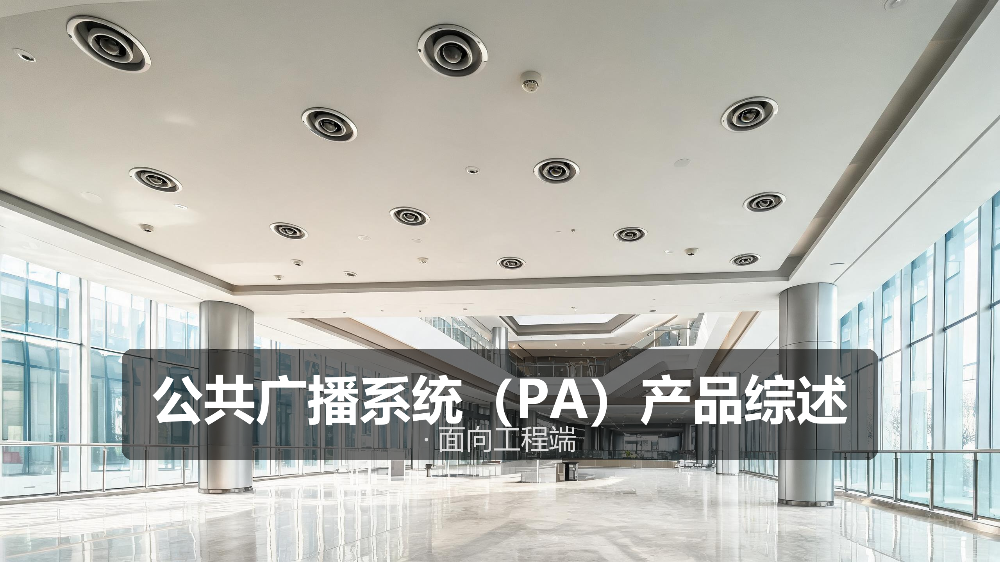
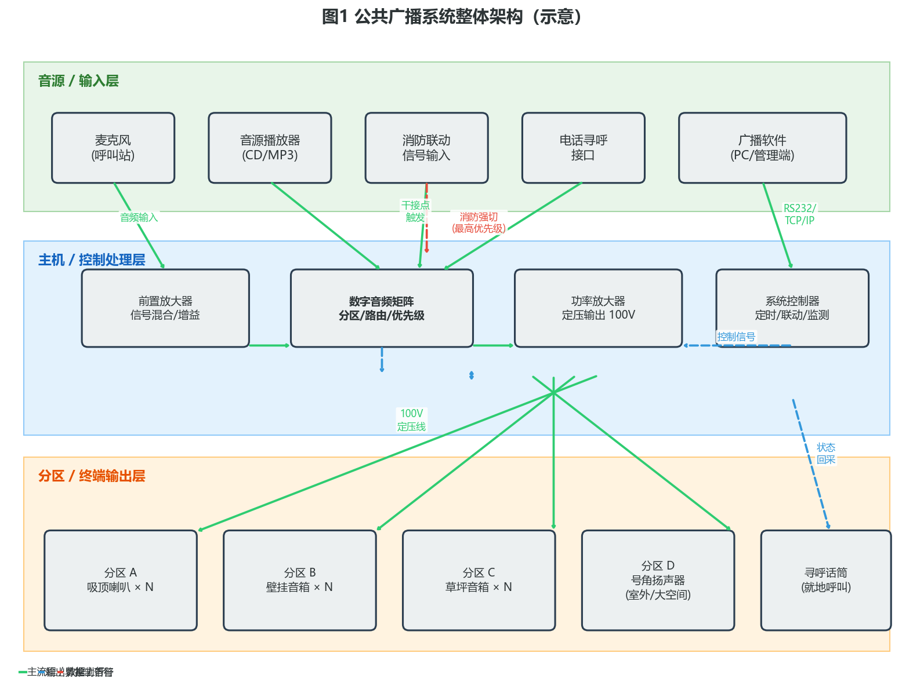
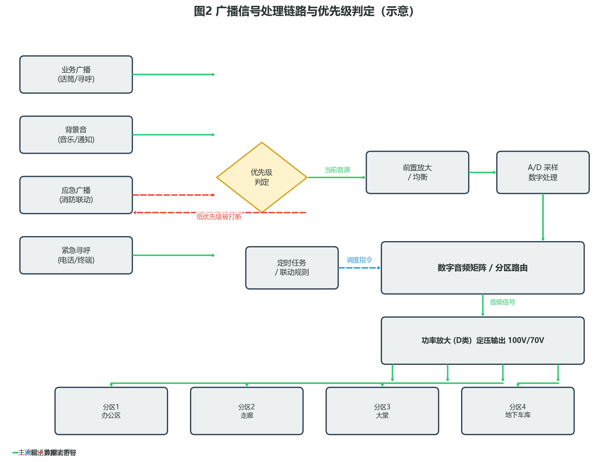
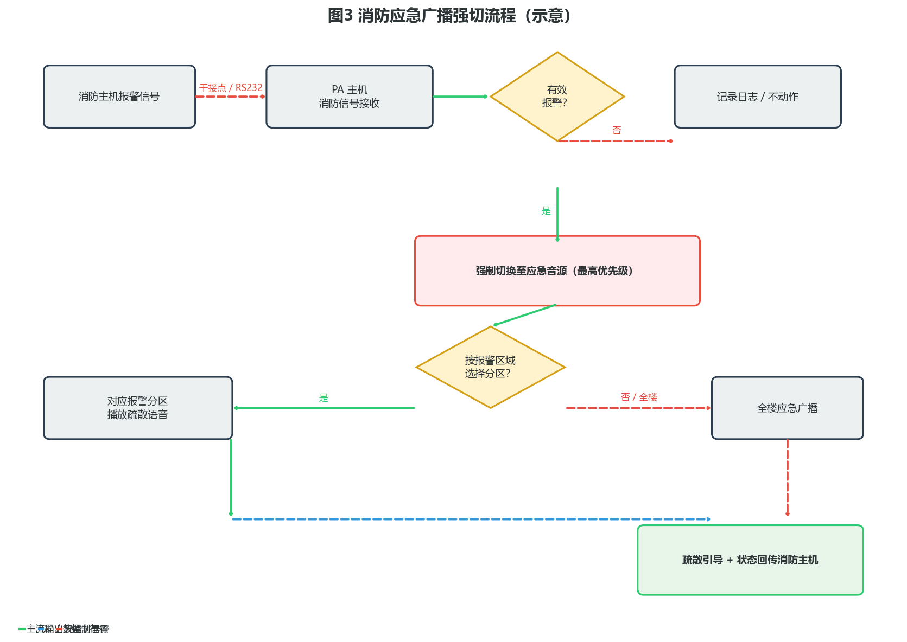

# 公共广播系统（PA）产品综述

> 面向工程端 · 选型与落地视角

---

## 〇、一句话定位

**公共广播系统（Public Address，简称 PA）集业务广播、背景音与消防应急广播于一体，是建筑内信息传递与紧急疏散的重要基础设施。** 它把多音源、多分区、多优先级的音频信号，通过「音源输入 → 矩阵路由 → 功率放大 → 分区输出」的完整链路，精确送达每一个需要发声的角落——平时播送背景音乐和业务通知，急时强制切换到最高优先级的消防应急疏散广播，是弱电系统中「平时服务、急时应急」的典型代表。

工程端看 PA 系统，核心不是选某一只喇叭或某一台功放，而是**先把分区策略、功率容量、优先级关系和消防联动方式算清楚**，再倒推设备选型与布线方案。本文面向工程 / 实施端，覆盖产品设计方案、核心参数与选型、技术原理、产品功能与差异化、应用场景、落地案例与核算清单、市场背景与竞争格局、商业模式与趋势共八章。除特别标注来源的行业基准外，参数均按**行业通用基准 / 工程估算**给出，用于方案评估，不作为某一具体型号的宣称指标。

---

## 一、产品设计方案

### 1.1 系统整体架构

公共广播交付的不是单台设备，而是「音源输入层 → 主机控制层 → 分区终端层」的三层系统。多类音源汇入主机，经前置放大、矩阵路由、功率放大后，按分区策略送达各类扬声器终端；消防联动信号以最高优先级接入，可在毫秒级强制切断正常广播并切换到应急疏散语音。

三层分工清晰：

- **音源 / 输入层**：提供音频内容来源，包括呼叫站话筒、CD/MP3 播放器、消防联动干接点信号、电话寻呼接口、PC 端广播管理软件等。不同音源有不同的优先级，是系统调度的基础。
- **主机 / 控制处理层**：系统的「大脑与心脏」。前置放大器负责信号混合与增益调节；数字音频矩阵负责分区路由、优先级判定和 DSP 处理；功率放大器把小信号放大到 100V/70V 定压输出；系统控制器负责定时任务、联动逻辑和状态监测。
- **分区 / 终端输出层**：声音最终落地的地方。吸顶喇叭用于室内吊顶区、壁挂音箱用于走廊和墙面、草坪音箱用于园区绿化、号角扬声器用于室外大空间或高噪声环境，就地寻呼话筒用于分区现场喊话。

工程实施要点：

- **分区是第一设计变量**：分多少区、按什么原则分区，决定了主机选型和功放数量，必须在方案阶段先定。
- **消防联动是硬约束**：无论项目大小，只要有消防要求，就必须保证应急广播的最高优先级和强切可靠性，这是验收红线。
- **功率要留余量**：扬声器总功率之和不能贴着功放额定功率选，要留 30%~50% 的冗余，避免动态峰值削波失真。

### 1.2 典型形态分类

按传输方式和技术路线，PA 系统大致分为三类：

| 类型 | 技术路线 | 适用场景 | 工程关注点 |
| --- | --- | --- | --- |
| 模拟定压广播 | 100V/70V 定压传输，喇叭并联 | 中小型项目、传统改造项目 | 线径核算、极性一致性、分区切换可靠性 |
| 数字矩阵广播 | 模拟前端 + 数字矩阵 DSP 处理 + 定压输出 | 中大型项目、多分区多音源场景 | 矩阵容量、优先级级数、联动接口 |
| IP 网络广播 | 全数字编码 + TCP/IP 网络传输 + 终端解码功放 | 大型园区、多建筑分布式、跨区域项目 | 带宽估算、网络 QoS、终端供电、延迟控制 |

选型上不存在「越先进越好」，关键看项目规模和预算：
- 几千平的小型办公楼，一台合并式功放 + 几只吸顶喇叭就够了，没必要上 IP 系统；
- 十几万平的商业综合体，分区多、音源多、联动复杂，数字矩阵或 IP 网络广播才够用。

### 1.3 设计要点与工程约束

**分区设计原则**：分区要与建筑功能区和消防防火分区对齐，常见分区依据包括：
- 按楼层分（每层一个或多个分区）
- 按功能区分（办公区、走廊、大堂、车库各为独立分区）
- 按防火分区（与消防报警分区一致，便于应急广播精准定位）

**功率冗余设计**：
- 单分区：扬声器总额定功率 × 1.3~1.5 = 该分区所需功放功率
- 全系统：同时广播的最大分区功率之和 × 1.2 = 总功放容量
- 冗余的意义：音乐信号的峰值功率远高于平均功率，余量不够会导致削波失真甚至烧喇叭

**布线要求**：
- 定压系统喇叭并联，注意正负极性一致（接反会导致相邻喇叭声短路、音量骤降）
- 长距离传输要核算线径，保证线路损耗 ≤ 3dB（通常 100V 线路 1mm² 铜线可传输约 60W / 100m）
- 广播线宜与强电分管敷设，避免干扰

**消防联动接口**：
- 干接点（最常用，消防主机输出开关量信号触发）
- RS232 / RS485 串口协议
- 网络协议（IP 系统常用）
- 无论哪种接口，**应急广播的优先级必须最高**，任何时候都不能被业务广播打断。

---

## 二、核心参数与选型

> 工程端第一步不是选型号，而是**先算清楚分区数、总功率、传输距离和联动方式**，再对照参数表挑选机型。

### 2.1 选型公式与关键指标

选型围绕五个核心指标展开，把每一项算清楚，选型就不会偏：

| 关键指标 | 工程含义 | 核算公式 / 评估口径 |
| --- | --- | --- |
| **分区数量** | 系统能独立控制的广播区域数 | 按功能区 + 防火分区取并集，预留 10%~20% 扩展分区 |
| **功放总功率** | 所有功放额定功率之和 | Σ(单分区扬声器总功率 × 1.3~1.5 冗余系数) |
| **声压级** | 听音位置的音量大小 | Lp = Lw + 10lg(Q / 4πr²) + DI；工程简化：距离加倍衰减 6dB |
| **线路损耗** | 传输线上的功率损失 | 损耗 ≤ 3dB（约损失一半功率为可接受上限）；线径越粗、距离越短，损耗越小 |
| **优先级级数** | 音源抢占优先级的层级数 | 消防应急 ≥ 紧急寻呼 > 业务广播 > 背景音，至少 4 级 |

几个常用工程估算：

- **声压级经验值**：普通办公区背景音约 60~65dB，业务广播约 70~75dB，应急广播 ≥ 80dB；环境噪声每增加 10dB，广播声压级也要相应提高才能保证清晰度。
- **喇叭覆盖估算**：吸顶喇叭（6W）在 3m 层高下，覆盖半径约 4~5m；号角扬声器（50W）在室外可覆盖 30~50m。具体需按厂家指向性图核算。
- **线径选型速算**：100V 定压系统，1mm² 铜线在 100m 距离下可承载约 60W 功率且损耗在 3dB 以内；功率翻倍或距离翻倍，线径都要相应加大。

### 2.2 各部件参数表（工程关注点）

下表为**行业通用基准范围**，供方案评估，具体以厂商选型规格书为准。

| 部件 | 关键参数 | 典型范围（工程基准） | 工程关注点 |
| --- | --- | --- | --- |
| **呼叫站 / 话筒** | 拾音类型、灵敏度、指向性 | 动圈 / 电容，灵敏度 -50~-60dBV | 会议室用电容，嘈杂环境用动圈 + 近讲效应 |
| **前置放大器** | 输入路数、增益范围、信噪比 | 4~16 路输入，增益 0~60dB，SNR ≥ 80dB | 输入路数要留余量；信噪比直接影响背景噪声 |
| **音频矩阵** | 分区数、输入路数、优先级级数、DSP 能力 | 8~128 分区，4~32 路输入，4~8 级优先级 | 分区数是核心选型指标；优先级必须含消防最高级 |
| **功率放大器** | 额定功率、输出电压、THD、效率 | 60W~2000W，100V/70V，THD < 1%，D 类效率 ≥ 90% | 功率按分区需求选，留 30% 余量；D 类比 AB 类节能 |
| **吸顶喇叭** | 额定功率、灵敏度、覆盖角 | 3W~15W，灵敏度 88~92dB，覆盖角 90°~120° | 功率决定音量，灵敏度决定同等功率下的声压级 |
| **壁挂音箱** | 额定功率、频响、防护等级 | 10W~60W，IP44~IP65 | 室外 / 潮湿环境要选高 IP 等级 |
| **号角扬声器** | 额定功率、声压级、指向角 | 50W~500W，声压级 105~120dB，指向角 30°~90° | 大空间 / 高噪声场景用；指向角越窄传输越远 |
| **草坪音箱** | 额定功率、防护等级、外观 | 10W~40W，IP65，仿石 / 仿树桩 | 景观类项目关注外观与隐蔽性 |
| **系统控制器** | 定时任务数、联动接口、监测功能 | 几十至上百条定时任务，干接点/串口/网络 | 无人值守场景的核心设备 |

### 2.3 工程对接踩坑点

- **极性接反是隐形坑**：定压喇叭并联时正负极性接反，相邻喇叭声波反相抵消，会出现「声音发闷、音量小」的现象，排查起来很费时间。施工时务必统一线色、统一端子。
- **功放超载导致削波**：分区喇叭总功率贴着功放额定功率选，遇到音乐峰值就会削波失真，听感刺耳，长期还会烧高音单元。功率冗余必须留足。
- **消防联动优先级配置错误**：有些项目图省事，把消防信号接到普通输入口，没有走专用的最高优先级通道，结果应急广播被业务广播打断，验收通不过。必须确认消防信号走的是**最高优先级硬触发通道**。
- **长距离线径不足**：地下车库、园区广播等长距离场景，线径选细了末端音量明显不足。核算时按「最远点 + 最大负载」算，而不是按平均。
- **环境噪声未预估**：厂房、食堂、交通枢纽等噪声环境，按普通办公区配置会导致听不清。应先测环境噪声，再按「广播声压级 = 环境噪声 + 10~15dB」倒推功率。
- **接地不良产生电流声**：多个设备接地电位不一致，会产生 50Hz 交流哼声。解决办法是单点接地、使用隔离变压器或音频隔离器。
- **UPS 容量不足**：应急广播要求断电后仍能工作 ≥ 30 分钟（消防规范要求），UPS 容量必须按功放总功率 + 主机功耗核算，并考虑功率因数和逆变效率。

---

## 三、技术原理

### 3.1 定压传输原理

公共广播系统最基础的技术决策，就是为什么用「定压」而不是「定阻」。

家用音响是定阻输出（4Ω、8Ω），功放和喇叭阻抗直接匹配，适合短距离、单喇叭的场景。但公共广播要驱动几十甚至上百只喇叭，分布在整栋楼里，传输距离几十到几百米，如果用定阻方式，传输线上的电流大、损耗高，末端喇叭根本响不起来。

**定压传输的核心思路**：在功放输出端用升压变压器把音频信号升到高压（常用 100V 或 70V），电流变小，线路损耗就降低了；到每只喇叭端再用降压变压器把电压降下来，匹配喇叭音圈。根据 P = UI，同样的功率，电压越高电流越小，线损 I²R 也就越小。

工程上需要理解两个参数：
- **额定输出电压**：常见 100V（国内标准）和 70V（美标 / 小功率场景），指的是音频信号的有效值电压。
- **喇叭功率抽头**：定压喇叭上通常有多个功率抽头（如 3W / 6W / 10W），通过选择不同的变压器初级匝数来调节接入功率，工程上按所需音量选抽头即可。

### 3.2 音频信号处理链路

从音源输入到喇叭出声，信号经过一条完整的处理链路：

链路各环节的作用：

1. **音源输入**：多路音频信号同时进入系统，每路携带自己的优先级标识。
2. **优先级判定**：系统实时比较当前各音源的优先级，输出最高优先级的信号——这是广播系统「忙时不打架、急时能强切」的核心机制。
3. **前置放大与均衡**：对选中的信号做增益调节和音调均衡，补偿音源差异和声学环境。
4. **A/D 采样与数字处理**：现代数字矩阵会把模拟信号转成数字，做 DSP 处理（均衡、压缩、限幅、反馈抑制等），再转回模拟。
5. **分区路由矩阵**：根据调度指令，把音频信号分配到指定的一个或多个分区。
6. **功率放大**：D 类功放将信号放大到 100V 定压输出，效率高、发热小。
7. **分区输出**：定压信号经传输线送到各分区的并联喇叭阵列。

工程上要注意的细节：
- **D 类功放的效率优势**：传统 AB 类功放效率约 50%，D 类可达 90% 以上，大型项目用 D 类能明显减少供电和散热压力。
- **限幅器的作用**：功放内置的限幅器能防止信号过载削波，保护喇叭，工程上不要为了「音量更大」就把限幅器关掉。

### 3.3 优先级与强切机制

广播系统的「灵魂」不是能播音乐，而是**在紧急情况下能打断一切、强制发出最关键的声音**。

优先级等级通常分为四级（从高到低）：

| 优先级 | 音源类型 | 触发方式 | 说明 |
| --- | --- | --- | --- |
| 1（最高） | 消防应急广播 | 消防主机干接点 / 协议触发 | 强制切换，所有分区或指定分区播放疏散语音 |
| 2 | 紧急寻呼 | 人工按下紧急呼叫键 | 用于突发事件的人工播报 |
| 3 | 业务广播 | 话筒 / 呼叫站 | 日常通知、找人、业务播报 |
| 4（最低） | 背景音乐 | 播放器 / 定时任务 | 营造氛围，可随时被高优先级打断 |

**强切原理**：当高优先级信号到来时，系统通过继电器或数字开关快速切断低优先级信号的通路，把高优先级信号接入。模拟系统用继电器矩阵实现，动作时间在毫秒级；数字矩阵通过内部 DSP 路由切换，速度更快、更灵活。

消防强切的标准流程：
1. 消防主机发出报警信号（干接点闭合或协议指令）
2. PA 主机的消防信号接收模块检测到有效报警
3. 系统立即切换到应急音源（预录的疏散语音或人工指挥）
4. 根据报警区域，选择对应分区或全楼播放应急广播
5. 播放状态回传消防主机，形成闭环

工程红线：**消防应急广播的强切功能必须 100% 可靠**，这是消防验收的必查项，也是人命关天的安全功能。

### 3.4 IP 网络广播的技术演进

传统模拟广播的信号是模拟音频，传输介质是专用广播线。IP 网络广播则把音频信号数字化（MP3 / AAC / Opus 编码），通过标准 TCP/IP 网络传输，每个分区的终端自带解码和功放。

相比模拟广播，IP 广播的优势：
- **传输距离不受限**：只要有网络就能播，跨楼、跨园区甚至跨城市都没问题
- **分区灵活**：分区可以软件定义，随时调整，不需要改线
- **音质更好**：数字传输无损耗，信噪比更高
- **功能丰富**：双向对讲、终端监测、远程升级、云管理
- **布线简化**：与数据网络共用，减少单独布广播线的成本

局限与挑战：
- **延迟问题**：编码 + 网络传输 + 解码有延迟（通常 100~500ms），实时对讲场景要考虑
- **网络依赖**：网络断了广播就断了，需要本地缓存和断网预案
- **终端供电**：每个终端需要单独供电（PoE 或本地电源），模拟系统则是集中供电
- **成本**：终端数量多时，单终端成本可能高于模拟喇叭

---

## 四、产品功能与差异化

### 4.1 核心功能

- **分区广播**：可以选择一个、多个或全部分区进行广播，是最基础也最常用的功能。
- **全区广播**：一键对所有分区同时广播，用于紧急通知或全体大会。
- **选区广播**：根据需要临时组合分区，灵活性高。
- **定时广播**：预设时间表，自动播放上下课铃、作息号、背景音乐等，无人值守场景必备。
- **消防联动强切**：收到消防信号后，自动切换到最高优先级应急广播，是安全合规的核心功能。
- **紧急寻呼**：通过呼叫站话筒或电话，对指定分区进行人工紧急播报。
- **多音源切换**：不同分区可以同时播放不同的音源内容（如办公区播轻音乐、超市播促销信息）。
- **背景音播放**：支持 CD、MP3、FM 等多种音源，营造环境氛围。

### 4.2 差异化卖点

不同品牌、不同档次的 PA 系统，差异主要体现在以下几个方面：

**智能分区与联动**：
- 高端系统能根据消防报警的具体区域，自动选择对应分区播放应急广播，而非简单全楼广播，减少对非火灾区域的干扰。
- 支持与门禁、视频监控、楼宇自控等系统联动，形成完整的弱电智能化体系。

**状态监测与运维**：
- 在线监测每只喇叭的线路状态（开路 / 短路）和功放工作状态，故障自动报警。
- 支持远程诊断和固件升级，降低现场维护成本。

**音频处理能力**：
- 内置反馈抑制器，减少话筒啸叫。
- 自动增益控制（AGC），保持输出音量稳定。
- 噪声门 / 环境噪声自适应，根据背景噪声自动调节广播音量。

**系统扩展性**：
- 模块化设计，分区不够可以插卡扩展。
- 支持多主机级联，适应超大型项目。

### 4.3 增强能力

- **双向对讲**：IP 广播系统支持终端与管理中心双向对讲，可用于求助、问询。
- **语音识别与 AI 交互**：新一代智能广播支持语音控制、智能问答，与语音助手联动。
- **云平台管理**：多站点统一管理、远程配置、数据统计分析，适合连锁商业、集团园区。
- **多系统融合**：与消防系统深度联动（精确到防火分区）、与视频监控联动（报警自动语音提示）、与信息发布系统联动（声音 + 画面同步）。

---

## 五、应用场景

公共广播的应用场景非常广泛，几乎所有有人活动的建筑和公共空间都需要。每个场景的痛点不同，方案侧重点也不同。

### 5.1 商业综合体 / 购物中心

- **痛点**：面积大（几万到十几万平）、分区多（几十到上百个）、业态杂（零售、餐饮、影院、停车场各有不同需求），既要营造舒适的购物氛围，又要在紧急情况下快速疏散。
- **方案**：数字矩阵或 IP 网络广播主机，按楼层 + 业态精细分区；室内吸顶喇叭 + 地下车库号角 + 室外草坪音箱组合；与消防系统深度联动，按防火分区精准应急广播。
- **价值**：背景音乐提升购物体验，业务广播促进营销，应急广播保障人员安全，一套系统三重价值。

### 5.2 学校 / 教育园区

- **痛点**：作息铃声、上下课广播、眼保健操、运动会广播、消防演练、校园通知，场景多、时段固定、对定时功能要求高。
- **方案**：IP 网络广播系统，教学楼、操场、食堂、宿舍分别分区；定时任务实现全自动作息管理；操场配置大功率号角满足大空间需求；教室终端带音量调节和本地寻呼。
- **价值**：教学管理自动化，减少人工操作；应急演练一键启动，提升校园安全管理水平。

### 5.3 酒店 / 写字楼

- **痛点**：公共区域需要背景音乐提升品质，客房 / 办公室需要可调节音量甚至可关闭，同时消防应急广播必须覆盖所有区域且不可关闭。
- **方案**：公共区域定压广播全覆盖；客房 / 办公室设音量控制器或带开关的面板；消防应急广播通过强切继电器绕过音量控制，强制以最大音量播出。
- **价值**：提升入住 / 办公体验的同时，满足消防规范要求，兼顾舒适与安全。

### 5.4 工业园区 / 厂房

- **痛点**：空间开阔、机器噪声大，广播清晰度要求高；需要生产调度、寻人通知、应急疏散等多种功能。
- **方案**：大功率号角扬声器 + 高功率功放，按车间分区；噪声环境下选高声压级号角，保证语音清晰度；与生产调度系统联动，实现班次播报、安全提醒。
- **价值**：生产调度效率提升，应急疏散保障员工安全，一套系统兼顾生产与安全。

### 5.5 住宅小区

- **痛点**：地下车库、园区道路、电梯厅、楼道、单元大堂等多区域全覆盖，物业通知、背景音乐、消防应急都需要。
- **方案**：吸顶喇叭用于楼道和大堂，壁挂音箱用于电梯厅，草坪音箱用于园区绿化区，号角用于地下车库；按楼栋或区域分区；与消防系统联动。
- **价值**：提升小区品质感，方便物业管理，保障消防安全。

---

## 六、实际案例与设计方案

### 案例 A：中型商业综合体（5 万㎡）

**需求**：
- 建筑规模：地下 2 层（车库 + 设备用房），地上 5 层（商业 + 餐饮 + 影院）
- 分区需求：约 30 个广播分区，按楼层 + 业态 + 防火分区划分
- 功能需求：背景音乐、业务广播、消防应急广播、定时播放
- 联动需求：与消防主机联动，按报警分区精准应急广播

**方案设计**：
- 主机：数字广播矩阵主机（32 分区，16 路输入，8 级优先级）
- 功放：8 台定压功放（总功率约 4000W，按分区需求配置不同功率等级）
- 扬声器：
  - 商铺 / 走廊：6W 吸顶喇叭（约 400 只）
  - 大堂 / 中庭：30W 壁挂音箱 + 吸顶组合
  - 地下车库：50W 号角扬声器（约 60 只）
  - 室外广场：30W 草坪音箱（约 20 只）
- 联动：消防主机干接点接入，走最高优先级通道
- 备用：UPS 电源（支持应急广播 ≥ 30 分钟）

**配置核算**：

| 分区类型 | 分区数 | 单分区喇叭数 | 单只功率 | 分区总功率 | 冗余后功率 |
| --- | --- | --- | --- | --- | --- |
| 商铺 / 走廊 | 20 | 15~25 只 | 6W | 90~150W | 135~225W |
| 大堂 / 中庭 | 3 | 20 只 | 15W | 300W | 450W |
| 地下车库 | 5 | 10~15 只 | 50W | 500~750W | 750~1125W |
| 室外广场 | 2 | 10 只 | 30W | 300W | 450W |
| **合计** | **30** | — | — | **约 3500W** | **约 5000W** |

功放配置：按「最大同时广播功率 + 30% 余量」配置，实际配置 8 台功放合计约 6000W，满足全负荷 + 冗余需求。

**交付价值**：
- 背景音乐营造舒适购物环境，提升商业氛围
- 分区业务广播支持营销播报、寻人寻物等日常运营需求
- 消防应急广播按分区精准播放，既保障安全又减少对正常营业的干扰
- 数字矩阵灵活扩展，后续业态调整无需更换主机

### 案例 B：学校园区（100 亩）

**需求**：
- 建筑规模：教学楼 3 栋、宿舍楼 2 栋、食堂 1 座、操场 1 个、行政楼 1 栋
- 功能需求：作息铃声、上下课广播、眼保健操、运动会广播、紧急通知、消防演练
- 管理需求：教务处可管理教学广播，德育处可管理通知广播，保安室可管理应急广播

**方案设计**：
- 系统：IP 网络广播系统（全数字，共 50+ 个终端）
- 主机：IP 广播服务器 + 管理软件（多用户权限分级）
- 终端：
  - 教室：IP 网络壁挂终端（带本地寻呼 + 音量调节）
  - 走廊 / 楼道：IP 网络吸顶喇叭
  - 操场：大功率 IP 网络号角（2 只，200W）
  - 食堂 / 宿舍：IP 网络壁挂音箱
- 呼叫站：教务处、德育处、保安室各设 1 台寻呼话筒
- 联动：与消防系统对接，支持应急演练

**配置核算**：
- 终端数量：约 80 个 IP 终端（教室 40 + 走廊 20 + 操场 2 + 食堂 5 + 宿舍 10 + 其他 3）
- 网络带宽：单终端编码码率约 128kbps，同时广播时总带宽约 10Mbps（百兆网络轻松承载）
- 供电：PoE 交换机供电，减少电源布线

**交付价值**：
- 定时任务全自动，作息管理零人工操作
- 多部门分级管理，互不干扰
- IP 系统灵活扩展，新建建筑直接接入网络即可
- 远程维护方便，故障终端自动报警

### 工程落地核算检查清单

- [ ] 分区划分是否与防火分区对齐？
- [ ] 单分区扬声器总功率是否在功放容量内（留 30% 余量）？
- [ ] 最远点声压级是否满足要求（≥ 背景噪声 + 10dB）？
- [ ] 传输线径是否按距离核算（线路损耗 ≤ 3dB）？
- [ ] 消防联动接口类型与优先级是否与消防主机确认？
- [ ] UPS / 备用电源是否满足应急广播 ≥ 30 分钟？
- [ ] 喇叭极性是否统一（避免声短路）？
- [ ] 接地系统是否单点接地（避免交流哼声）？
- [ ] 广播线与强电是否分管敷设（避免电磁干扰）？
- [ ] 应急广播强切功能是否实测通过？

---

## 七、市场背景与竞争格局

### 7.1 市场规模与驱动

公共广播是建筑弱电系统的标配品类，几乎所有新建建筑都需要配置。从行业发展来看，有几个持续的驱动因素：

- **城镇化与基建投资**：城镇化进程持续推进，新建商业、住宅、公共设施带来稳定的新增需求。
- **消防安全法规趋严**：《建筑设计防火规范》（GB 50016）等标准对应急广播有明确要求，推动存量建筑改造和新建项目标配化。
- **消费升级与体验经济**：商业综合体、酒店、文旅项目对背景音乐品质的要求提升，从「能响就行」转向「好听、智能」。
- **智能化与数字化**：IP 网络广播、智能联动、云管理等新技术推动产品升级换代，存量替换需求逐步释放。

> 说明：具体市场规模与增速数据因统计口径不同差异较大，本文不引用具体数字。有需要可参考中国演艺设备技术协会、信通院等机构发布的行业报告。

### 7.2 竞争格局

公共广播市场品牌众多，大致分为三个梯队：

**第一梯队：国际品牌**
- 代表：博世（Bosch）、霍尼韦尔（Honeywell）、TOA（东亚）
- 特点：品牌知名度高、产品可靠性强、系统方案完整、价格高
- 市场定位：高端商业、机场、地铁、地标建筑等对可靠性要求极高的项目

**第二梯队：国内一线品牌**
- 代表：迪士普（DSPPA）、ITC、惠威（HiVi）、声艺等
- 特点：产品线齐全、性价比高、本地化服务好、工程渠道完善
- 市场定位：中端商业、学校、酒店、工业园区等主流市场，是国内工程市场的主力

**第三梯队：国内中小品牌**
- 数量众多，价格竞争激烈
- 特点：价格低、产品功能基本满足、质量参差不齐
- 市场定位：小型项目、低端市场、预算有限的改造项目

**新进入者与跨界者**：
- IP 网络广播厂商：利用网络技术优势切入，推动行业数字化转型
- 音视频一体化厂商：把广播与会议、显示、信息发布整合，提供整体解决方案
- 安防厂商：把广播作为安防系统的子系统打包销售

### 7.3 核心竞争要素

- **可靠性**：尤其是消防应急场景，一旦掉链子就是人命关天的大事。品牌口碑很大程度上建立在可靠性上。
- **系统能力**：不是卖单只喇叭，而是卖整套系统方案。分区能力、联动能力、扩展能力是关键。
- **工程服务**：方案设计、现场调试、售后响应速度，直接影响工程商的合作意愿。
- **性价比**：中端市场的核心竞争要素，在满足功能和可靠性的前提下，价格越有优势越能拿项目。
- **渠道覆盖**：公共广播项目分散、量级不一，完善的经销 / 工程商渠道是销量的基础。

---

## 八、商业模式与趋势

### 8.1 交付形态

- **设备销售**：喇叭、功放、主机、话筒等硬件产品，是最基础的交付形态。
- **系统集成**：方案设计 + 设备供应 + 安装调试 + 验收，面向工程总包或甲方直接交付。
- **运维服务**：定期检测、维修保养、系统升级、应急响应，按年度签订维保合同。
- **整体解决方案**：把广播与消防、安防、楼宇自控等系统整合，提供一站式智能化解决方案。

### 8.2 盈利模式

- **硬件毛利**：主设备（主机、功放、喇叭）的销售毛利，是行业最基础的收入来源。
- **工程利润**：安装调试费用，通常按设备总价的 15%~30% 计取。
- **维保收入**：年度维保合同，费用约为系统总价的 5%~10% / 年。
- **增值服务**：智能化升级、云管理平台订阅、定制化开发等。
- **替换与改造**：存量系统的数字化升级、设备更新换代，是未来几年的增长方向。

### 8.3 发展趋势

**IP 化与数字化**：从模拟定压向 IP 网络广播演进是明确的大趋势。随着网络基础设施的普及和成本下降，IP 广播的性价比越来越高，尤其在新建项目中渗透率快速提升。但模拟广播因其简单可靠、成本低廉，在小型项目中仍会长期存在。

**智能化升级**：AI 技术正在进入广播领域——
- 智能噪声自适应：根据环境噪声自动调节广播音量，既保证清晰度又避免扰民
- 语音交互：通过语音控制广播系统，提升操作便捷性
- 智能故障诊断：AI 分析系统状态，预测性维护
- 智能分区调度：根据人流密度自动调整广播分区和音量

**融合化发展**：广播系统不再是孤立的「发声设备」，而是越来越深地融入建筑智能化整体——
- 与消防系统深度联动（精确到防火分区、疏散路径引导）
- 与视频监控联动（报警触发语音提示 + 画面弹窗）
- 与信息发布系统联动（声音 + 画面同步播报）
- 与楼宇自控系统联动（纳入统一的 BMS 平台管理）

**云边协同**：
- 云端统一管理平台：多站点、多建筑集中管控、远程运维
- 边缘节点本地自治：断网时本地仍能正常广播和联动，不依赖云端在线
- 数据汇聚与分析：使用数据、故障数据、播放统计等，助力运营决策

**高清化与品质化**：
- 从「能响」到「好听」，用户对音质的要求越来越高
- 从语音级（300~3400Hz）向宽频带（20Hz~20kHz）演进
- 立体声 / 环绕声广播在高端场景开始出现

总体而言，公共广播是一个成熟但持续进化的品类——它的基本功能（让人听到声音）早已实现，但在**智能化、融合化、IP 化、品质化**的方向上，仍有很大的演进空间。对工程端来说，理解清楚系统架构、选型逻辑和踩坑点，就能在各种项目中做出合理的方案选择。
