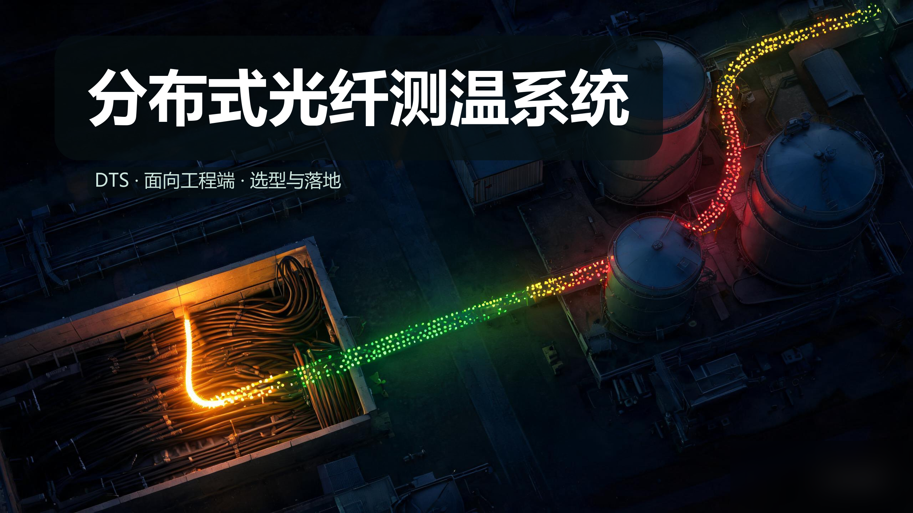
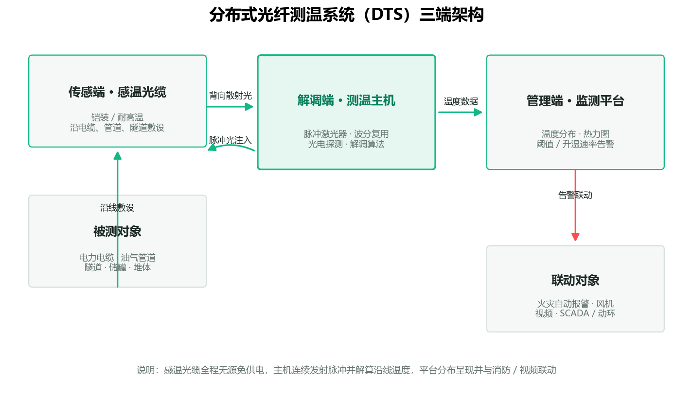
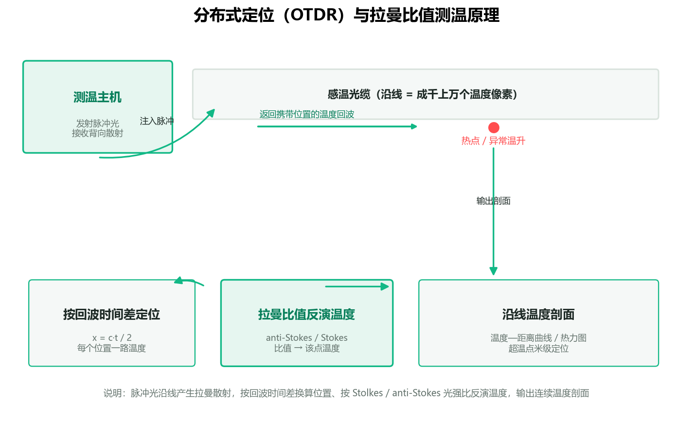
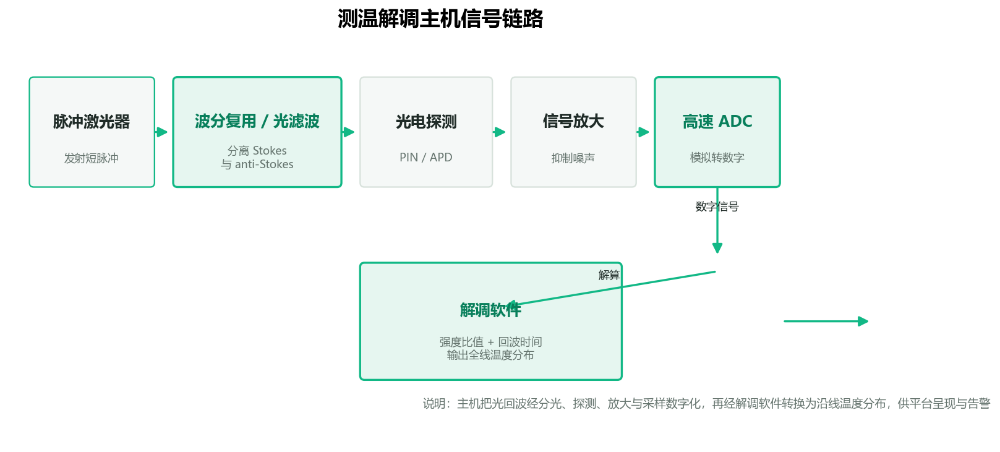
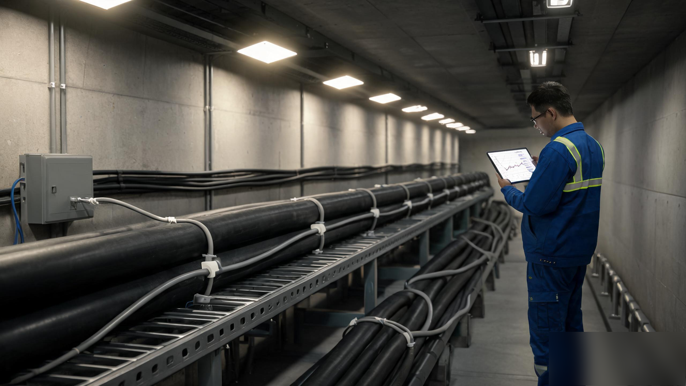

# 分布式光纤测温系统（DTS）产品综述

> **产品**：分布式光纤测温系统（DTS, Distributed Temperature Sensing） ｜ **日期**：2026 年 9 月 ｜ **角度**：面向工程端 · 选型与落地视角

分布式光纤测温把"沿线每一米的温度"持续、实时地读出来——一根感温光缆既是传感器又是传输通道，测温主机沿线连续解算，监测平台定位到点。这篇文章从产品设计方案、核心参数与选型、技术原理、应用场景、实际案例到市场与竞争，完整拆解这套智能测温系统为什么值得投入，以及工程上怎么选、怎么铺、怎么验收。

**一句话结论：** DTS 不是把若干只温度传感器接一根总线，而是让整条光缆本身成为连续成千上万个"温度像素"的传感介质——长距离、全程无源、抗电磁干扰，把温度从"点测"变成"线测"，是电缆、管道、隧道、堆体等线性/大面积对象测温的高性价比底座。

> 文章封面：感温光缆延伸进电力隧道与储罐区，隐喻"沿线每一米都被持续感知"。示意图。

---

## 〇 一句话定位

**分布式光纤测温系统 = 一根感温光缆沿线连续测温 → 解调主机实时解算 → 监测平台呈现与告警的完整链路**，输出的是"整条线每一米的温度分布"，而不是若干离散位点的读数。

系统由三端构成，各自独立承担物理感知、信号解算与智能呈现，又紧密协作：

- **传感光缆**：沿被测对象敷设，作为分布式测温介质，全程无源、免供电。
- **测温解调主机**：向光缆连续发射脉冲光并接收背向散射，实时解算沿线各点温度。
- **温度监测平台**：呈现温度分布曲线与热力图，按阈值与升温速率告警，联动消防或视频。

相比在关键点位上布点式测温探头，DTS 的价值在于把覆盖从"点"扩展到"线"：哪里有温度、升到多少、在那个位置升温多快，一条连接线即可一次看清。

---

## 一、产品设计方案

### 1.1 系统架构：三端结构

工程选型时通常先定"测的对象和总长度"，再据此反推光缆敷设形态、主机通道数与监测平台能力。

| 层 | 角色 | 典型设备 | 一句话职责 |
| --- | --- | --- | --- |
| 传感端 | 沿线连续感知 | 铠装测温光缆 / 耐高温感温光缆 | 无源、连续地感知沿线温度 |
| 解调端 | 把光回波变成温度 | 测温主机（拉曼 DTS 为主） | 发射脉冲、解算沿线温度分布 |
| 管理端 | 呈现与处置 | 温度监测平台 | 温度分布、阈值告警、联动消防/视频 |

*图：DTS 三端架构——感温光缆沿线敷设，测温主机连续解算，监测平台分布呈现与告警。*

### 1.2 主要产品形态：拉曼测温 vs 布里渊测温

DTS 按散射体制分为两类，选型先在此分叉：

| 体制 | 能测什么 | 响应速度 | 成本 | 典型场景 |
| --- | --- | --- | --- | --- |
| 拉曼 DTS | 温度 | 秒级 | 中 | 电缆、管道、隧道、消防感温 |
| 布里渊 BOTDR/BOTDA | 温度＋应变 | 分钟级 | 中高 | 结构健康、管线力学、覆冰舞动 |

纯测温和火灾预警场景选拉曼体制；需要同时感知温度与结构应变（如大坝、桥梁、覆冰线路）才考虑布里渊体系。

### 1.3 设计要点与差异化卖点

- **长距离连续**：单端典型覆盖 10–50 km，大幅减少布点与中继。
- **全程无源**：感温光缆不沿途供电，本征防爆，适配煤矿、储罐等防爆场所。
- **抗电磁干扰**：光信号天然不受雷击、强电磁场与线路冲击的影响。
- **高温度分辨率**：常见 0.1°C 级，高端方案可达 0.01°C。

### 1.4 设计中的工程约束

- 空间分辨率随测距增大而劣化（脉冲展宽与衰减），必须先把"测多远、要分辨多细"定下来再选主机。
- 探测光缆的弯曲半径、固定方式与余量段预留要服从施工验收标准。
- 隧道、管廊、煤矿等消防场景必须满足线型感温火灾探测器规范，标准报警长度与安装间距不能踩线。

---

## 二、核心参数与选型

工程端选型的第一落点是"先算再选"：先回答测的对象、全长、要分辨多细、升温多快需报警，再匹配主机通道数、测距、空间分辨率、精度与响应时间。下面给出快捷口径与参数对照（数值为工程通用区间示例、行业通用基准）。

**选型核算速记**

- 所需通道 × 单通道测距 ≥ 待测回路总长 ×（1 + ≥20% 余量）
- 空间分辨率（m）≈ 由脉冲宽度决定，且随测距劣化——别用长测距机型的标称分辨率硬套全段
- 火灾 / 快速温升场景选拉曼（秒级）；需同时测温＋应变再选布里渊

### 2.1 选型关键指标

| 指标 | 工程含义 | 典型区间 / 基准 |
| --- | --- | --- |
| 测量距离 | 单端可覆盖长度 | 10–50 km |
| 空间分辨率 | 温度定位的最小分段 | 常见 0.5–2 m |
| 温度分辨率 | 可分辨的最小温差 | 0.01–0.1°C |
| 温度精度 / 准确度 | 与真值的偏差 | ±0.1–1°C（近端、标定后）|
| 响应时间 | 温度事件到上报 | 拉曼秒级、BOTDA 分钟级 |
| 采样间隔 | 相邻两次全剖面的间隔 | 1–10 s |
| 通道数 | 可接多路光纤 | 1 / 2 / 4 / 8 |
| 测温范围 | 光缆与主机的可测温度带 | -60~350°C 依型号 |

> 说明：以上区间综合多家厂商公开资料（长飞、武汉长盈通、Fjinno 等）给出的工程基准汇总，具体数值以厂商规格书与现场实测为准。

### 2.2 测温主机参数

| 参数项 | 说明 | 工程关注点 |
| --- | --- | --- |
| 通道数 | 1/2/4/8 | 多回路摊薄单通道造价 |
| 最大测距 | 单端 km | 覆盖是否够、是否要双端 |
| 空间分辨率 | 0.5–2 m | 分辨到多细 |
| 温度精度 / 分辨率 | ±0.1–1°C / 0.01–0.1°C | 报警可信度 |
| 响应时间 | 秒级 | 火灾场景关键 |
| 采样间隔 | 1–10 s | 追踪趋势而非单点 |
| 光纤类型 | 单模 / 多模 | 匹配光缆与测距 |
| 接口 / 协议 | 网络 / 串口 / 平台对接 | 并入现有消防 / SCADA |

### 2.3 探测光缆参数

| 参数项 | 说明 | 工程关注点 |
| --- | --- | --- |
| 结构 | 铠装 / 非铠装、阻燃外护 | 敷设环境耐受 |
| 外径 | 约 3 mm 级 | 贴敷 / 过孔孔径 |
| 测温范围 / 耐温 | 依型号 | 高温 / 低温场景 |
| 弯曲半径 | 长期 / 短期 | 敷设不超限 |
| 保护与抗拉 | 不锈钢保护管、抗拉钢丝 | 埋地 / 架空的力学要求 |

### 2.4 工程对接踩坑点

- **空间分辨率 ≠ 精度**是两类指标：选型时分别向厂商问清，别被单个数字带偏。
- 精度是"测试条件"下的标称值（单端、近端、标定后），长距离远端精度会下降，验收要按实际敷设实测。
- 探测光缆弯曲半径与接头损耗直接影响信噪比，敷设工艺决定长期稳定性和寿命。
- 消防场合须满足线型感温探测器标准报警长度——分布式光纤线型感温探测器标准报警长度不应大于 3 m。
- 与现有平台（火灾自动报警、SCADA、综合监控）的协议对接要在选型阶段确认，避免到货后二次开发。

---

## 三、技术原理

讲清楚原理是为了证明功能"是真的、靠得住"。DTS 的根基，是让一段普通光缆同时充当传感器与信号通道。

### 3.1 物理基础：拉曼散射测温度

光在光纤中传播会产生散射，其中拉曼散射对温度敏感：入射脉冲激发出波长更长的**斯托克斯光**（Stokes）与波长更短的**反斯托克斯光**（anti-Stokes），前者光强与温度无关、后者随温度变化，取两者强度之比即可反演出该处温度。比值法天然抵消了大部分光源波动与光纤损耗的影响，是工程上最常用的 DTS 体制，响应可达秒级，应用最广。

相对的，**布里渊散射**通过布里渊频移量反演温度与应变，可同时测温和测应变，但 BOTDA 需扫频、响应在分钟级、成本更高，多用于结构健康监测；BOTDR 为单向反射式，测距长但精度通常低一档。

| 维度 | 拉曼 DTS | 布里渊 BOTDA | 布里渊 BOTDR |
| --- | --- | --- | --- |
| 温度分辨率 | 0.01–0.1°C | 0.1°C | 1°C 级 |
| 测温速度 | 秒级 | 分钟级 | 分钟级 |
| 能否测应变 | 否 | 是 | 是 |
| 典型监测距离 | 10–50 km | 100+ km | 100+ km |
| 成本 | 中等 | 高 | 中等 |

### 3.2 分布式定位：怎么知道热点在哪一档

主机向光缆注入一束脉冲光，脉冲沿光纤前进，在每个位置产生背向散射返回。设光在光纤中的传播速度为 c'，测回波返回时间 t，则散射点距端面的位置 x = c'·t / 2。于是整条光缆被连续划分为成千上万个"温度像素"，任意一处的温度都被实时解算——这就是"一缆到底、逐点定位"的基础（光时域反射，OTDR）。

空间分辨率理论上由脉冲宽度决定：例如 50 ns 脉冲约对应 5 m，压缩脉冲并配合算法可到米级；工程上通常以温度阶跃曲线 10%–90% 的距离定义空间分辨率，且随测距增大而劣化。

*图：脉冲光沿线产生拉曼背向散射，按回波时间差换算位置、按 Stokes/anti-Stokes 比值反演温度。*

> **一句话理解：** 脉冲光像沿光缆跑的一辆"回声测温车"，每经过一处返回一路带着位置和时间戳的温度回波；频繁发射脉冲，就得到沿线一条连续"温度剖面"。

### 3.3 测温解调主机的工作流程

*图：解调主机链路——脉冲激光器 → 波分复用/光滤波 → 光电探测 → 放大 → 高速采样 → 解调软件输出温度分布。*

1. 脉冲激光器注入固定波长的短脉冲光。
2. 波分复用 / 光滤波器把斯托克斯光与反斯托克斯光分离。
3. 光电探测器（PIN 或雪崩光电二极管 APD）完成光电转换。
4. 信号放大模块放大微弱回波。
5. 高速 ADC 采样把模拟信号数字化。
6. 解调软件按光强比值与回波时间，输出光纤全程连续温度分布。

### 3.4 精度与长距离稳定性的提升机制

动态标定、衰减差自补偿、脉冲编码调制等手段提升信噪比与长距离稳定性，让远端温度精度尽可能接近标称值。公开工程案例中，2022 年北京冬奥会冰壶赛场在中科大团队支持下，于冰面下敷设约 200 m 通信光纤、部署 2 套 DTS，对冰体温度连续监测，精度达到 0.1°C——这说明了 DTS 在"高均匀场、高精度"监测场景的落地能力。

### 3.5 技术演进脉络

- 点式传感器：布点测温，覆盖有限、有盲区。
- 分布式光纤测温：一根光缆连续感知，覆盖距离跃升。
- 多参数融合：布里渊测温＋应变、DAS 声学传感。
- AI + 大数据：温度趋势研判、告警语义化，向资产数字化监管延伸。
- 国产化替代：特种光纤、泵浦激光器、APD 探测器自给率持续提升。

---

## 四、应用场景

一套"长距离、连续、无源、抗干扰"的测温能力，价值随场景被反复放大。以下每个场景遵循"痛点 → 方案 → 价值"。

### 4.1 电力电缆 / 隧道

- **痛点**：高压电缆过载、局部过热、绝缘老化，传统点式测温覆盖有限。
- **方案**：沿电缆隧道、沟槽、桥架、竖井连续敷设，结合导体温度与动态载流量做趋势预警。
- **价值**：长距离连续测温 + 过热点米级定位，防早期火灾。

*图：高压电缆隧道内感温光缆沿线敷设，配合测温主机持续监测。示意图。*

### 4.2 油气与石化（管道 / 储罐 / LNG）

- **痛点**：输油输气管线、储罐存在局部温升、泄漏与火灾风险。
- **方案**：管线沿程敷设 + 储罐内壁 / 关键部位贴敷。
- **价值**：连续温升与泄漏预警，联动消防。

*图：储罐与管道的分布式温度监测部署示意。示意图。*

### 4.3 煤矿（采空区 / 胶带火灾）

- **痛点**：煤自燃、胶带火灾，防爆区域不宜带电传感。
- **方案**：沿工作面、采空区、输送区布设感温光纤，用无源本征防爆优势。
- **价值**：连续监测 + 本征防爆，符合矿用分布式光纤测温装置与线型感温探测器相关标准。

### 4.4 隧道与轨道交通火灾报警

- **痛点**：狭长空间 + 密集电缆，传统火灾报警覆盖与定位难。
- **方案**：隧道顶部距顶棚 100–200 mm 敷设线型感温探测器，光栅间距与保护车道数服从火灾自动报警设计、施工及验收规范。
- **价值**：早期感温、定位报警、车道级保护。

### 4.5 数据中心

- **痛点**：电池组、电缆竖井、动力机房局部过热。
- **方案**：电池组、竖井沿缆 / 贴敷布设。
- **价值**：机房重点部位连续测温与火灾预警。

### 4.6 仓储 / 粮仓 / 煤堆

- **痛点**：堆积物自燃，面积大、点式监测费用高。
- **方案**：仓内沿层、沿堆体连续敷设。
- **价值**：大面积堆积物连续温度覆盖，棉花仓库有专门技术规范支撑。

### 4.7 桥梁 / 大坝结构健康

- **痛点**：大坝混凝土温升、渗漏、结构变形。
- **方案**：坝体内部、混凝土面板埋设，布里渊体制兼顾温度与应变。
- **价值**：长距离埋设连续监测，辅助安全评估。

### 4.8 文物保护

- **痛点**：古建筑火灾与结构变形，不宜装带电 / 明火设备。
- **方案**：线型感温光纤沿内部空间敷设 + 地基 / 土壤铺设监测沉降与含水量。
- **价值**：非接触、本征安全、长距离覆盖。布达拉宫火灾自动报警系统敷设线型感温光纤 8710 m；长城光纤沉降与含水量变形监测同样采用此法。

---

## 五、实际案例与设计方案

工程端最关心这套方案怎么落地、主机怎么配、报警准不准。以下按"需求 → 方案设计 → 配置核算 → 交付价值"四段式呈现（数值为演示估算，供核算思路参考）。

### 案例 A · 高压电力电缆隧道连续测温

- **项目需求**：一条全长约 8 km 的高压电缆隧道，需全线连续测温、过热点米级定位，并联动风机与火灾自动报警。
- **方案设计**：沿隧道电缆桥架敷设铠装测温光缆；配置单台 4 通道测温主机，2 通道用于 2 条回路、预留通道扩展；监测平台接入调度中心。
- **配置核算示例**：待测回路总长约 12 km（含双回路与接头段），单通道测距需 ≥15 km（含 ≥20% 余量）；按 50 ns 级脉冲主机选空间分辨率 ≤1 m、精度 ±1°C 档。
- **交付价值**：过热点定位到米，动态载流量趋势预警，接线端子温升早于事故被发现。

### 案例 B · 煤矿胶带 / 采空区自燃监测

- **项目需求**：主运胶带机沿线多点发热、采空区煤自燃隐患，防爆区域严禁带电传感。
- **方案设计**：沿胶带输送线、采空区回风隅角布设矿用感温光缆，光缆本征无源；主机置于变电硐室内。
- **配置核算示例**：按 GB 16280 要求校验标准报警长度 ≤3 m，核算采空区到主机的最远敷设距离与通道覆盖；采无源本征防爆设计，符合矿用分布式光纤测温装置标准。
- **交付价值**：连续感温 + 无源防爆，煤自燃隐患在升温初期即被预警。

### 案例 C · 公路 / 地铁隧道火灾报警

- **项目需求**：双向隧道火灾报警覆盖，狭长空间 + 密集电缆，要求早期感温与车道级定位。
- **方案设计**：隧道顶部距顶棚 100–200 mm 敷设分布式线型光纤感温探测器；光栅间距与保护车道数按规范核算。
- **配置核算示例**：隧道全长 L，核算感温探测器保护车道数（每根保护车道数不超过规范上限）、光栅间距 ≤10 m、安装余量段预留；与火灾自动报警主机协议对接。
- **交付价值**：早期感温报警、平均升温速率研判，支持联动消防与排烟。

### 案例 D · 数据中心电池组 / 竖井测温

- **项目需求**：电池组、电缆竖井、动力机房重点部位温度监测，局部过热早发现。
- **方案设计**：电池仓与竖井沿缆 / 贴敷布设感温光缆，主机接入动环监控平台。
- **配置核算示例**：按监测点与回路核算通道数与测距，预留扩展通道；对接动环协议。
- **交付价值**：关键部位连续测温，电池热失控与电缆过热在初期被捕捉。

### 案例设计通用核算清单（工程落地检查表）

- [ ] 待测回路总长 → 通道数 × 单通道测距（预留 ≥20% 余量）。
- [ ] 空间分辨率与测温精度双指标确认，别混用一个数字。
- [ ] 敷设弯曲半径、固定、余量段符合施工验收规范，控制接头损耗。
- [ ] 消防场合标准报警长度 ≤3 m，与火灾自动报警平台协议对接确认。
- [ ] 长距离远端精度按实际敷设实测验收，不认远端标称值直取。

---

## 六、市场背景与竞争格局

### 6.1 为什么值得做

全球 DTS 市场处于稳定上行通道。Grand View Research 口径下，市场规模由 2024 年的 7.104 亿美元增长到 2030 年的预计 11.602 亿美元，2025–2030 年复合增速约 8.4%；Mordor Intelligence 口径略保守，2025 年 0.75 亿美元、2030 年 1.04 亿美元、CAGR 约 6.8%——两家机构口径不同，但"持续增长"方向一致。中国市场公开发二手行业报告给出的 2024–2025 年规模约 15–18 亿元级，口径有出入，仅作趋势参考，不作为权威统计。

需求侧的拉动主要来自几个方向：能源安全与双碳推动电网、油气、煤炭基础设施安全监测升级；国家能源局提出到 2030 年初步构筑能源系统智能感知与智能调控体系；隧道、地铁、管廊、数据中心、石化储罐对早期火灾与泄漏预警的需求；以及文物保护数字化带来的非接触监测增量。

### 6.2 竞争与壁垒

国内已上市的主要玩家包括理工光科、苏州光格科技、长飞（长飞光系统）、烽火通信、青岛鼎信通讯，以及上海波汇科技（至纯科技旗下）等（示例，供横向分析）。国际厂商以 Luna/Silixa、Omnisens（布里渊路线）、Bandweaver、Yokogawa、AP Sensing 为代表，在海底资产、长距管线与工业过程测温等细分深耕。

| 竞争维度 | 核心壁垒 / 差异点 |
| --- | --- |
| 解调算法 | 动态标定、衰减差自补偿、脉冲编码等信噪比与稳定性手段 |
| 测温精度 / 空间分辨率 | 两者协同优化的成熟度，决定报警可信度 |
| 工程化与可部署性 | 特种感温光缆、敷设工艺与现场验收能力 |
| 产业链自主化 | 特种光纤、泵浦激光器、APD 探测器、高速采集卡 |

竞争力集中在算法、精度分辨率和工程化三项。国产化方面，特种光纤自给率已较高（长飞、长进光子、烽火、武汉睿芯等）；APD/SPAD 光探测器自给相对偏低，窄线宽激光器进口依赖由约 78% 降至约 42%（第三方产业报告口径），核心器件仍是国产化攻坚重点。

### 6.3 商业模式与趋势

- **交付形态**：整机 + 光缆方案交付、平台软件、长期运维订阅，从一次性买卖转向生命周期经营。
- **技术趋势**：多参数融合（测温＋应变＋声学）、AI 温度趋势与告警研判、向电缆动态载流量与资产数字化监管延伸、关键器件国产化替代。

**写在最后：** DTS 的核心机会，在于把"看起来普通的一根光缆"变成沿线连续成千上万个温度像素的感知层。对电缆、管道、隧道、堆体这些"线长了就测不过来"的对象而言，这层连续的温度感知不仅是更省的测温方案，更是从"点位监控"走向"全线感知"的基础设施能力。

---

## 参考资料

1. 测温原理与体制：《分布式光学纤维传感拉曼与布里渊散射应用》，Frontiers in Physics；Raman/布里渊散射综述。
2. 关键性能指标区间：长飞 [分布式光纤测温系统](https://www.yofc.com/wcs/Upload/201806/5b20d6ef0bea9.pdf)、武汉长盈通 [分布式光纤温度监测系统](https://www.yoec.com.cn/view/229.html)、Fjinno [DTS 厂商与指标梳理](https://www.fjinno.net/distributed-fiber-optic-temperature-sensing-technique)。
3. 分布式定位：Silixa [Principles of Distributed Temperature Sensing](https://silixa.com/principles-of-distributed-temperature-sensing/)。
4. 冬奥冰壶场案例：中国科学报 [“冰立方”用上光纤温度计](https://www.cas.cn/cm/202202/t20220228_4826401.shtml)。
5. 标准：GB 16280-2014《线型感温火灾探测器》、GB 50116-2013《火灾自动报警系统设计规范》、GB 50166-2019《火灾自动报警系统施工及验收标准》、IEC 61757-2-2:2016。
6. 市场数据：Grand View Research [Distributed Temperature Sensing Market](https://www.grandviewresearch.com/industry-analysis/distributed-temperature-sensing-market)；Mordor Intelligence [Distributed Temperature Sensing Market](https://www.mordorintelligence.com/industry-reports/distributed-temperature-sensing-market)。
7. 竞争格局：各厂商官网及公开资料（理工光科、光格科技、长飞、烽火、鼎信、波汇等）。
8. 国产化：第三方产业报告口径（特种光纤、激光器、APD 自给率）。