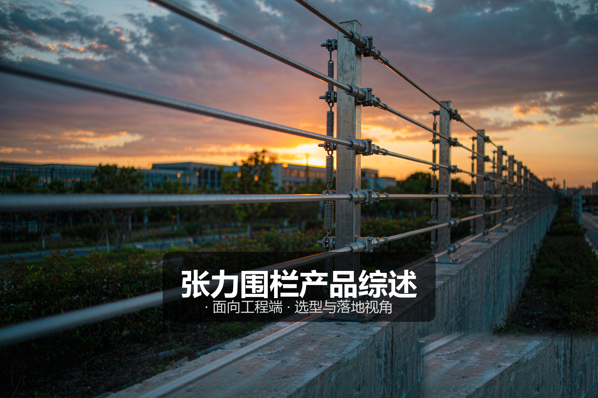
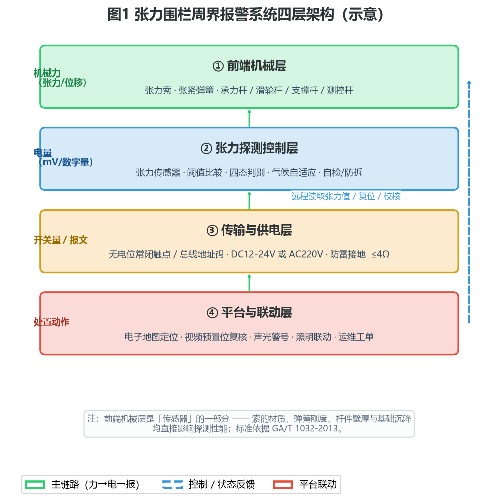
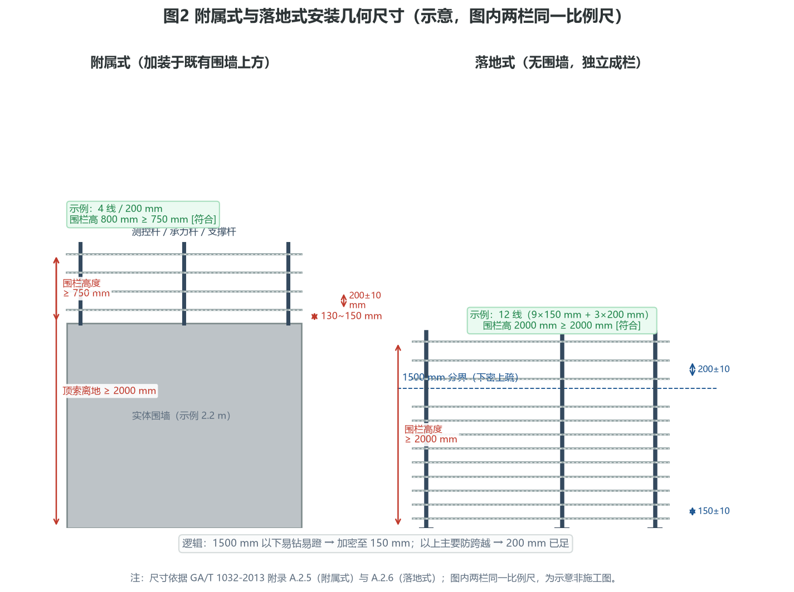
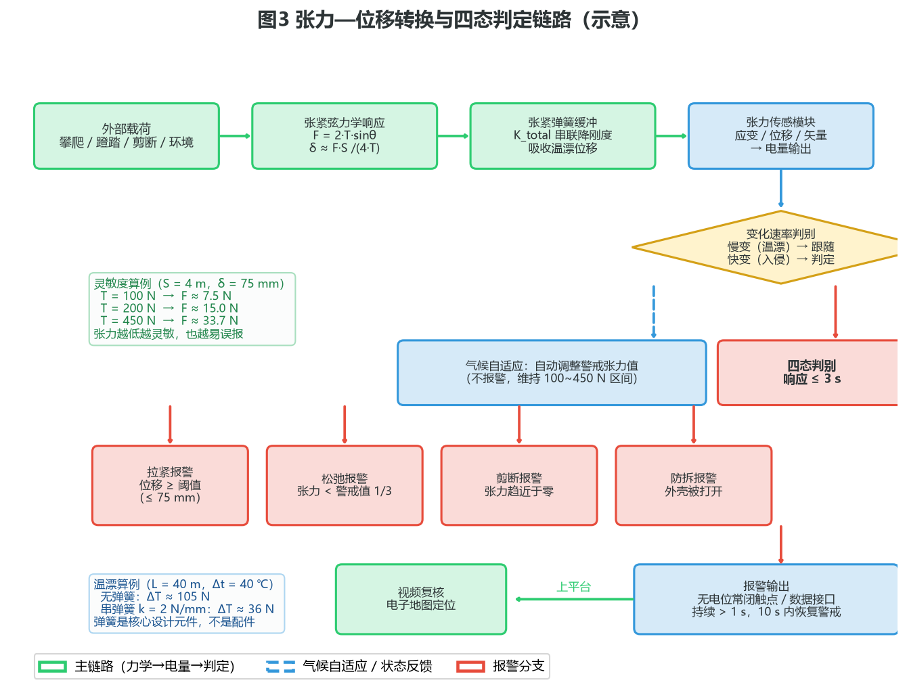
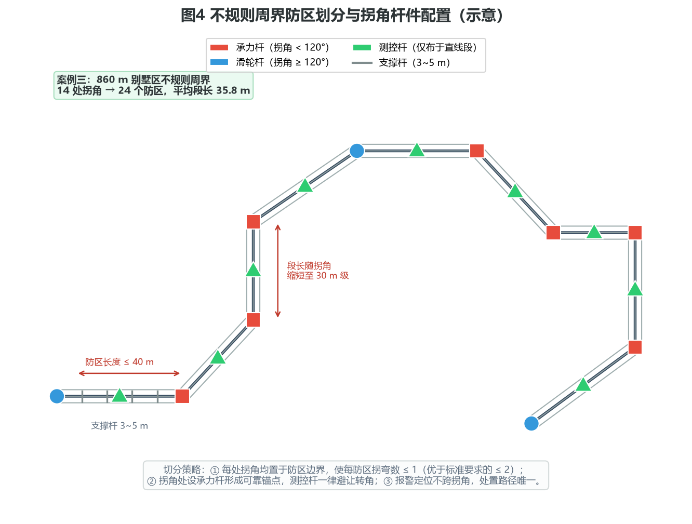

# 张力围栏产品综述：不带电的周界，靠一根钢索的拉力说话

> 面向工程端 · 选型与落地视角



---

## 〇、一句话定位

**张力围栏（张力式电子围栏）把不锈钢张力索预紧到设定拉力，靠感知这根索上的拉力变化来判定攀爬、拉扯、剪断与破坏，前端全程不带电、不产生电火花。** 它是周界安防里唯一能在「实体阻挡 + 主动探测」两个维度同时站住、又在人员密集与易燃易爆场景里被法规点名推荐的方案：学校、幼儿园、托育机构、油库、化工罐区这些地方，脉冲高压围栏天然有合规顾虑，张力围栏则天然踩中合规路径。

工程端看张力围栏，核心不是数它有几道索，而是**先把防区划分、警戒张力值、安装几何、杆件规格、接地防雷、供电压降这六笔账算清楚**。张力围栏的探测性能有一大半不在传感器里，而在机械基础与安装精度上——这一点和红外对射极其相似，但后果更严重：红外对射装歪了是误报，张力围栏基础沉降了是漏报。

本文面向工程 / 实施端，覆盖产品设计方案、核心参数与选型、技术原理、产品功能与差异化、应用场景、落地案例与配置核算、市场背景与竞争格局、商业模式与趋势共八章。除明确标注来源的引用外，文中参数均按**行业通用基准 / 工程估算**给出，用于方案评估与教学，不作为某一具体型号的宣称指标。

---

## 一、产品设计方案

### 1.1 系统定位与四层架构

张力围栏交付的不是一台「箱子」，而是一条**机械感知 → 电量转换 → 逻辑判定 → 平台联动**的完整链路。按工程视角拆开，一套张力式电子围栏周界报警系统分为四层：**前端机械层 → 张力探测控制层 → 传输与供电层 → 平台与联动层**。



四层分工：

- **前端机械层**：回答「力从哪里来、怎么传出去」。由张力索（不锈钢钢丝绳，直径不小于 1.2 mm，材质不低于 SUS304）、张紧弹簧、测控杆、承力杆、滑轮杆、支撑杆及各类紧固件构成有形周界。这一层的本质是**一根被预紧的弦**：任何外力都会改变弦的张力与形状，而杆件的刚度决定了这根弦的边界条件是否稳定。
- **张力探测控制层**：回答「力怎么变成电信号」。测控杆内的张力探测模块（应变式、位移式或矢量位移式）把张力索的拉力转换为电量，控制板完成阈值比较、状态判别与报警输出；同时负责上电自检、气候自适应调张力、防拆检测与失电报警。
- **传输与供电层**：回答「电从哪来、报警往哪去」。报警输出为**无电位常闭触点或数据接口**（GA/T 1032-2013 5.3.9），可直连报警主机防区，也可经总线地址模块汇入；供电可采用 AC 220 V 或 DC 12 V / 24 V（GA/T 1032-2013 5.4.1）。长距离集中供电必须核算压降。
- **平台与联动层**：回答「报了警之后干什么」。平台在电子地图上定位防区、联动摄像机预置位复核、驱动声光警号与照明，并生成运维工单闭环。

这套架构里最容易被低估的一点：**张力围栏的「传感器」实际上是整段围栏，而不只是测控杆里那块板子**。钢索的材质、弹簧的刚度、杆件的壁厚与埋深、基础的沉降量，全都是传感器的一部分。前端机械层做得糙，再好的电路板也救不回来。

### 1.2 产品形态分类

张力围栏的产品线按四个维度切分，工程选型时四个维度各选一个坐标，即可锁定品类：

**按安装方式**（这是第一位的分类，直接决定后续所有几何尺寸）：

| 类型 | 适用条件 | 围栏高度要求 | 间距要求 |
|---|---|---|---|
| 附属式 | 已有实体围墙 / 栅栏，加装于其上方 | 不低于 750 mm | 相邻索 200 mm ± 10 mm |
| 落地式 | 无实体围墙，独立成栏 | 不低于 2000 mm | 1500 mm 以下 150 mm ± 10 mm；1500 mm 以上 200 mm ± 10 mm |

**按线制（张力索道数）**：4 线、6 线、8 线、12 线不等。附属式常见 4~6 线，落地式因需覆盖 2 m 以上高度且下部要防钻，常见 10~12 线。线数越多，防钻与防跨越能力越强，但钢索用量、杆件受力与施工工时同步上升。

**按传感原理**：应变电桥式（应变片贴于弹性体，成本低、温漂需补偿）、位移—弹簧—微动式（机械位移触发，结构直观）、矢量位移 / 数字张力传感器式（直接输出数字量，可总线组网，当前主流方向）。

**按结构与应用**：标准型（常规室外周界）、数字总线型（每根测控杆带地址码，可远程读取张力值与状态）、防爆型（用于油气化工危险区域，需按 GB 3836 系列取得防爆合格证）、景观型（用于别墅与高档住宅，杆件与索具做外观处理）。

### 1.3 关键设计要点

一套能长期稳定运行的张力围栏系统，设计时要过五道关：

1. **封闭无盲区关**：GA/T 1032-2013 附录 A.2.1 明确要求张力围栏不应有盲区，形成的警戒区域应沿周界屏障**封闭**。这意味着门洞、排水沟、与相邻建筑的搭接处都必须有交圈处理，而不是「差不多围起来」。
2. **防区几何关**：防区长度不大于 40 m（A.2.2），且一个防区内的拐弯角数量应不大于 2 个（A.2.4）。小于 120° 的拐弯处必须装承力杆，大于或等于 120° 的拐弯处可采用滑轮杆——这条直接决定复杂地形的防区切分策略。
3. **杆件刚度关**：圆形承力杆、支撑杆壁厚均应不小于 3 mm，承力杆直径不小于 30 mm，支撑杆直径不小于 20 mm（A.2.8）。且**不得以栏杆、水管或者电力、通信线路的立杆作为承力杆、支撑杆**（A.2.10）——这一条在现场被违反的频率高得惊人。
4. **气候自适应关**：钢索的热胀冷缩量在 40 m 段长上相当可观（见 3.1 节核算），系统必须能根据外界环境、气候等变化自动调整警戒张力值，否则季节交替时不是误报就是漏报。
5. **防雷接地关**：测控杆都应具有独立的可靠接地装置，接地电阻应不大于 4 Ω；前端部分应有良好的防雷接地措施。张力围栏前端虽不带电，但内含电子模块，且金属索具本身就是一根长长的引雷导体，接地做不好，雷雨季会集中损毁测控杆。

---

## 二、核心参数与选型

### 2.1 参数速查表

| 参数 | 典型值 / 要求 | 依据与工程含义 |
|---|---|---|
| 警戒张力值 | 100 N ~ 450 N | GA/T 1032-2013 5.3.1；选型的核心变量 |
| 拉紧报警位移量 | 不大于 75 mm | 5.3.2；决定灵敏度上限 |
| 松弛报警阈值 | 小于正常运行张力警戒值的 1/3 | 5.3.3；与警戒值联动，不可独立设定 |
| 报警触发响应时间 | 不大于 3 s | 5.3.4 |
| 报警状态持续时间 | 大于 1 s | 5.3.5；常见产品 1~60 s 可调 |
| 报警恢复时间 | 10 s 内恢复到警戒状态 | 5.3.6 |
| 张力索抗拉断力 | 不小于 600 N，且不大于 1000 N | 5.3.7；上限是为了保证「人能被阻挡但索不伤人」 |
| 张力探测模块可承受最大张力 | 不小于 1000 N | 5.3.8 |
| 报警接口 | 无电位常闭触点或数据接口 | 5.3.9 |
| 供电方式 | AC 220 V 或 DC 12 V / 24 V | 5.4.1 |
| 电源电压适应性 | 标称电压 85% ~ 110% 范围内正常工作 | 5.4.2；这是压降核算的判据 |
| 防护等级 | 外露部件常见 IP55 及以上（工程基准） | 室外长期运行的基本要求 |
| 防区长度 | 不大于 40 m | 附录 A.2.2 |
| 支撑杆间距 | 3 m ~ 5 m | 附录 A.2.3 |
| 接地电阻 | 不大于 4 Ω | 附录 A.2.9 |

需要特别说明的一点是**张力索抗拉断力上限 1000 N**。标准不是只给下限、还给了上限，这是一个典型的「安全设计」条款：索要足够强，强到能阻挡与迟滞入侵；又不能太强，强到在人被绊住或缠住时造成伤害。工程选型时如果看到某款产品的钢索抗拉断力远超 1000 N，那反而不是优点——它可能已经偏离了这个品类的安全设计初衷。

### 2.2 第一笔账：防区划分

防区划分是张力围栏设计的第一笔账，它同时决定了三件事：报警定位精度、测控杆数量、主机容量。

- **长度约束**：防区长度不大于 40 m（GA/T 1032-2013 附录 A.2.2）。注意这是**上限而非推荐值**，工程上通常按 30 ~ 40 m 取，环境复杂、植被贴近、风载大的区段取下限。
- **拐角约束**：一个防区内的拐弯角数量不大于 2 个（A.2.4）。在拐角密集的不规则周界上，这条约束往往比 40 m 更「卡脖子」——因为它逼着你在每个拐角附近切断防区。
- **杆件配置**：小于 120° 的拐弯处装承力杆，大于或等于 120° 的拐弯处可用滑轮杆（A.2.4）。滑轮杆的底座须稳定，滑轮应采用含油轴承或金属陶瓷等摩擦系数较小的材质，并与系统其他部件具有相同的高低温与耐腐蚀特性。
- **支撑杆**：每个防区中间每隔 3 ~ 5 m 装一根支撑杆（A.2.3）。

于是防区数可以按下面这个口径估算：

```
N_zone = ceil(L_total / L_zone_max)  且需在每个拐角处校验「防区内拐弯 ≤ 2」
N_zone 实际取值 = max(长度约束结果, 拐角约束结果)
```

举例：周界 860 m、含 14 个拐角，若每个防区最多容纳 1 个拐角以保证定位精度，则拐角约束要求至少 14 个防区；长度约束要求 ceil(860/40) = 22 个防区。取大者 22，再按拐点位置微调即可（详见案例三）。

### 2.3 第二笔账：警戒张力值怎么取

标准给了 100 ~ 450 N 的区间，但没说取多少。这个值必须由**检出能力**与**抗环境扰动**两项共同决定，下面用工程估算把它量化。

**检出能力侧**——张紧弦中点受横向力的平衡关系（小垂度近似）：

```
F = 2 · T · sinθ ,  tanθ = δ / (S/2)
```

其中 S 为相邻支撑杆间距（自由段长度），δ 为中点垂度，T 为张力。取 S = 4 m、S/2 = 2 m、δ = 75 mm（拉紧报警位移上限）：

```
tanθ = 75 / 2000 = 0.0375  →  sinθ ≈ 0.0375
F = 2 × T × 0.0375 = 0.075 T
```

代入不同的警戒张力值：

| 警戒张力 T | 触发 75 mm 位移所需中点横向力 F |
|---|---|
| 100 N（下限） | 约 7.5 N |
| 200 N | 约 15.0 N |
| 300 N | 约 22.5 N |
| 450 N（上限） | 约 33.7 N |

这组数字揭示了两件事。第一，张力围栏的灵敏度其实非常高——15 N 约等于 1.5 kg 的力，一个成年人攀爬时的附加载荷远超此值，所以「能不能检出」通常不是问题。第二，**张力取低值意味着连一只猫、一堆积雪、一根被风压过来的树枝都可能触发**，这就是为什么张力值不能一味取低。

**环境扰动侧**——季节温差引起的张力漂移。取不锈钢热膨胀系数 α ≈ 17.3 × 10⁻⁶ /℃（SUS304 量级，工程估算）、钢索有效金属截面积 A ≈ 0.79 mm²（⌀1.2 mm 多股索按 0.7 填充系数估算）、弹性模量 E ≈ 193 GPa、防区长度 L = 40 m、年温差 Δt = 40 ℃：

自由伸长量：
```
ΔL = α · L · Δt = 17.3e-6 × 40000 mm × 40 ≈ 27.7 mm
```

若两端刚性固定（无弹簧缓冲），由此产生的张力变化：
```
ΔT = E · A · α · Δt = 193000 N/mm² × 0.79 mm² × 17.3e-6 × 40 ≈ 105 N
```

**105 N 的漂移已经超过了 100 N 的全量程下限。** 这就是为什么前端必须串接张紧弹簧：弹簧刚度远低于钢索轴向刚度，把位移主要吸收在弹簧上。钢索轴向刚度：

```
K_cable = E · A / L = 193000 × 0.79 / 40000 ≈ 3.81 N/mm
```

若串联刚度 k = 2.0 N/mm 的弹簧，串联总刚度：

```
K_total = (K_cable × k) / (K_cable + k) = (3.81 × 2.0) / (3.81 + 2.0) ≈ 1.31 N/mm
```

则同样 27.7 mm 温漂引起的张力变化：

```
ΔT' = K_total × ΔL = 1.31 × 27.7 ≈ 36 N
```

**弹簧把 105 N 的温漂压到了 36 N。** 这说明张紧弹簧不是配件，而是张力围栏的核心设计元件——弹簧刚度选型直接决定季节稳定性。也正因如此，GA/T 1032-2013 把「能根据外界环境、气候等变化自动调整警戒张力值」列为必备功能，这不是营销卖点，是物理上的刚需。

**工程取值建议（工程基准）**：

| 场景 | 建议初始警戒张力 | 理由 |
|---|---|---|
| 中小学、幼儿园、托育机构 | 150 ~ 200 N | 灵敏度优先，需可靠检出儿童攀爬 |
| 住宅小区、别墅 | 200 ~ 250 N | 兼顾检出与抗植被、小动物扰动 |
| 厂区、物流园区 | 250 ~ 300 N | 风载与机械振动较强，取中上值 |
| 化工罐区、油库、空旷地带 | 300 ~ 400 N | 空旷风载大，抗扰动优先 |

无论取哪个值，**松弛报警阈值随之确定为该值的 1/3 以下**（5.3.3），不可脱离警戒值独立设定。

### 2.4 第三笔账：安装几何

附属式与落地式的几何要求完全不同，这是现场最容易搞混、也最容易被监理挑出来的一组数字。



**附属式（加装于既有围墙 / 栅栏上方）**：

- 围栏高度（最上一根索至围墙柱或围墙 / 栅栏的垂直距离，取高者）**不小于 750 mm**
- 最上一根张力索与地面的距离**不小于 2000 mm**
- 相邻两根索间距 **200 mm ± 10 mm**
- 最下一根索与围墙 / 栅栏顶端的距离、以及与围墙 / 栅栏外侧的距离，均为 **130 mm ~ 150 mm**（取低者校核）

最后一条「外侧距离 130 ~ 150 mm」是个精妙的规定：它让最下一根索既不能贴着墙面（贴墙则手指无处扣入、也无法形成有效攀爬阻挡），又不能离墙太远（太远则可容人侧身钻入）。现场施工时这一条最常被忽略，结果就是围栏底下留出一条可钻的缝。

**落地式（无围墙，独立成栏）**：

- 围栏高度**不低于 2000 mm**
- 测控杆、承力杆、支撑杆均须采取加固措施
- 1500 mm 以下的张力索，相邻间距 **150 mm ± 10 mm**（下密，防钻）
- 1500 mm 以上的张力索，相邻间距 **200 mm ± 10 mm**（上疏，控成本）

「下密上疏」是这个几何规定的内在逻辑：1500 mm 以下是人最容易钻、最容易蹬踏的区域，必须加密；1500 mm 以上主要防跨越，200 mm 间距已足够形成阻挡，再密就是浪费。

由此可推出一个常见的落地式 12 线布置（工程基准）：

```
200, 350, 500, 650, 800, 950, 1100, 1250, 1400 mm   （9 道，间距 150 mm，全在 1500 mm 以下）
1600, 1800, 2000 mm                                  （3 道，间距 200 mm，全在 1500 mm 以上）
```

合计 12 道，顶索离地 2000 mm，围栏高度 2000 mm，正好满足「不低于 2000 mm」的下限。若项目要求更高的实体阻挡，可加至 13 ~ 14 道并把顶索抬到 2200 mm。

### 2.5 第四笔账：杆件与材料

| 构件 | 要求 | 依据 |
|---|---|---|
| 张力索 | 不锈钢索或等效材料；多股细钢丝组成，直径不小于 1.2 mm；材质不低于 SUS304 | 附录 A.2.7；工程基准 |
| 承力杆（圆） | 壁厚 ≥ 3 mm，直径 ≥ 30 mm | 附录 A.2.8 |
| 支撑杆（圆） | 壁厚 ≥ 3 mm，直径 ≥ 20 mm | 附录 A.2.8 |
| 承力杆（方） | 壁厚 ≥ 3 mm，长宽均 ≥ 30 mm | 附录 A.2.8 |
| 支撑杆（方） | 壁厚 ≥ 3 mm，长宽均 ≥ 20 mm | 附录 A.2.8 |
| 安装底座 | 应采用可调式结构 | 附录 A.2.9 |
| 禁用 | 不得以栏杆、水管或电力、通信线路立杆作为承力杆、支撑杆 | 附录 A.2.10 |
| 接地 | 测控杆独立可靠接地，接地电阻 ≤ 4 Ω | 附录 A.2.9 |
| 其他 | 安装应符合消防安全要求 | 附录 A.2.11 |

钢索材料要求「SUS304 以上」不仅是防腐问题。沿海与化工区域，304 在氯离子环境下仍有点蚀风险，工程上通常升级到 316；这一点属于**工程判断**，应在设计说明中写明并留痕。

### 2.6 第五笔账：供电压降

张力围栏测控杆分布在整个周界上，最远端往往离机房数百米。DC 集中供电必须核算压降，判据是 GA/T 1032-2013 5.4.2：**电源电压在标称电压的 85% ~ 110% 范围内变化时设备应能正常工作**。

双线回路压降：

```
ΔU = 2 · ρ · L · I / S
```

其中铜电阻率 ρ ≈ 0.0175 Ω·mm²/m，L 为单程距离（m），I 为电流（A），S 为线芯截面积（mm²）。

**算例**：DC 24 V 供电，最远测控杆距机房 320 m，单杆工作电流 0.25 A。

| 线芯截面 | 压降 ΔU | 末端电压 | 占标称比例 | 结论 |
|---|---|---|---|---|
| 1.0 mm² | 2.80 V | 21.20 V | 88.3% | 勉强合格，余量偏紧 |
| 1.5 mm² | 1.87 V | 22.13 V | 92.2% | 合格，推荐 |
| 2.5 mm² | 1.12 V | 22.88 V | 95.3% | 合格，成本较高 |

1.0 mm² 虽然落在 85% 以上，但只剩 3.3 个百分点的余量——考虑到接头氧化、端子压接不良、后续增挂设备等现实因素，工程上应选 1.5 mm²。**压降核算不是「算出来合格就行」，而是要给劣质施工留余量。**

### 2.7 十二条踩坑清单

1. **把张力围栏当「不带电的脉冲围栏」直接照搬设计** —— 两者防区逻辑、杆件受力、几何要求都不同，照搬必错。
2. **防区按 40 m 一刀切，不校验拐角** —— 拐角密集段会出现「一个防区三个弯」，钢索在滑轮处受力异常，误报率陡增。
3. **测控杆装在转角处** —— 多个厂家施工说明明确标注「张力控制杆不能安装在转角处」，转角应设承力杆。
4. **借用水管、栏杆、电力立杆做承力杆** —— 标准明令禁止（A.2.10），且这些杆件沉降与晃动不可控。
5. **忽视弹簧刚度** —— 只关心「有没有弹簧」，不关心刚度匹配，季节交替时张力漂移可达上百牛。
6. **警戒张力一律取 100 N 求灵敏** —— 换来的是猫、鸟、积雪、树枝全员报警。
7. **张力值不与松弛阈值联动** —— 松弛阈值必须小于警戒值的 1/3，孤立设定会导致剪断不报警。
8. **附属式最下索离墙过远** —— 超过 150 mm 就成了可钻的缝；过近则失去阻挡意义。
9. **落地式上下一个间距到底** —— 1500 mm 上下是两套间距，混淆即不合规。
10. **接地只做机房一端** —— 要求每根测控杆独立可靠接地且 ≤ 4 Ω，长周界上这是笔不小的工作量与材料量，报价时常漏算。
11. **不做消防合规核对** —— 附录 A.2.11 要求安装符合消防安全要求，围栏不得阻塞疏散通道与消防登高面。
12. **交付后不再复紧** —— 钢索在初期运行会有塑性伸长，投运 1 ~ 3 个月后必须复紧一次并重新校准，否则张力缓慢跌破松弛阈值引发持续误报。

---

## 三、技术原理

### 3.1 物理基础：一根预紧弦的力学

张力围栏的全部物理基础，可以归结为一句话：**一根两端张紧的弦，其张力对外部载荷极度敏感，而对准静态的环境变化应当不敏感。** 前半句是检出能力的来源，后半句是抗误报的难点。



**张紧弦的静力学**：设自由段长度 S（相邻两支撑杆间距），张力 T，中点受横向力 F，产生垂度 δ。由中点竖向力平衡：

```
F = 2 · T · sinθ ,  tanθ = δ / (S/2)
```

小垂度下 sinθ ≈ tanθ，于是：

```
δ ≈ F · S / (4 · T)
```

这条式子是整个品类的灵魂，它说明三件事：

- **垂度 δ 与张力 T 成反比** —— 张力越高越「硬」，越不容易被拉动，因此灵敏度随张力升高而下降（与 2.3 节表格一致）。
- **垂度 δ 与自由段 S 成正比** —— 这就是支撑杆间距被限定在 3 ~ 5 m 的原因。间距放大一倍，同样载荷下的位移也放大一倍，段长失控会让围栏变成一根「软绳」。
- **位移量是可测的物理量** —— 标准把「拉紧报警位移量不大于 75 mm」定为硬指标（5.3.2），本质上是在约束这个力学链路的灵敏度下限。

**温度与风：两个准静态扰动源**

温度引起的自由伸长与张力变化已在 2.3 节核算（40 m 段、40 ℃ 温差下无缓冲时约 105 N，串弹簧后约 36 N）。风载则小得多——取 4 m 自由段、⌀1.2 mm 索，迎风面积约 4 m × 0.0012 m = 0.0048 m²；风速 20 m/s 时动压 q = 0.5 × 1.225 × 20² ≈ 245 Pa，取阻力系数 1.2，单段风载：

```
F_w ≈ 245 × 0.0048 × 1.2 ≈ 1.4 N
```

**1.4 N 远低于 15 N 的触发阈值。** 这说明一个反直觉的结论：**风对钢索本身几乎不构成误报源**。张力围栏的风致误报主要来自另外两条路径——一是风吹动贴近围栏的树枝、藤蔓压触钢索；二是风荷载作用在面积大得多的杆件与围墙上，引起杆件挠曲与基础微动，间接改变钢索边界条件。所以抗风误报的正确做法是**修剪贴近植被 + 加固杆件基础**，而不是把张力一味调高。

### 3.2 传感机制：三条技术路线

把钢索的力学量转成电量，工程上有三条主流路线：

**应变电桥式**：在测控杆内的弹性体上粘贴电阻应变片组成惠斯通电桥，钢索拉力使弹性体产生微应变，电桥输出毫伏级差分信号，经放大与 AD 转换后送入 MCU。优点是分辨率高、可输出连续张力值便于远程监测；缺点是温漂显著，必须在电路与算法双重补偿，且弹性体长期受力存在蠕变。

**位移—弹簧—微动式**：钢索通过张紧弹簧拉动一个可动机构，位移量超过设定行程时触发微动开关或霍尔元件。优点是结构直观、抗电磁干扰强、成本可控；缺点是只能给出开关量，无法获知张力连续值，调试依赖现场手感，且机械磨损带来寿命问题。

**矢量位移 / 数字张力传感器式**：直接测量张力索在多维方向上的位移矢量，输出数字量，每根测控杆带地址码可总线组网。优点是可远程读取每道索的实时张力值、支持逐索诊断、便于平台化运维；缺点是成本高、对安装对中要求高。这是当前主流演进方向，也是「数字化张力围栏」的主要含义。

### 3.3 判定逻辑：四态判别

张力围栏之所以能区分「有人翻越」和「钢索松了」，靠的是对四种状态分别设定判据：

| 状态 | 物理表现 | 判据（工程基准） | 典型原因 |
|---|---|---|---|
| **拉紧报警** | 张力快速上升，位移量超过阈值 | 位移量达到拉紧报警位移（≤ 75 mm） | 攀爬、蹬踏、向上提拉、外力挤压 |
| **松弛报警** | 张力下降到警戒值的 1/3 以下 | 张力 < T_normal / 3 | 钢索被剪断、连接件脱落、弹簧失效 |
| **剪断报警** | 张力骤降至接近零 | 张力趋近 0 且持续时间达标 | 人为剪断、长期腐蚀断裂 |
| **防拆报警** | 测控杆外壳被打开 | 防拆开关动作 | 设备被破坏、非法开箱 |

判别的关键不在阈值本身，而在**时间维度上的区分**：

- **慢变跟随**：温度、季节、材料蠕变引起的张力变化速率极慢（分钟至小时级），系统应以极低带宽跟踪并自动调整警戒张力值，而不是报警。
- **快变触发**：攀爬、剪断引起的张力变化在秒级以内（GA/T 1032-2013 要求报警触发响应时间不大于 3 s），系统应立即判定并输出。
- **持续确认**：报警状态持续时间应大于 1 s（5.3.1 ~ 5.3.5），避免瞬时抖动直接上报；报警后应在 10 s 内恢复到警戒状态（5.3.6），保证防区不会因一次报警长期失效。

这套「慢变跟随、快变触发、持续确认」的三段式逻辑，是张力围栏能做到误报率显著低于红外对射与振动光纤的根本原因——它天然对环境慢变量免疫，只对机械快变量敏感。

### 3.4 环境自适应与自诊断

按 GA/T 1032-2013 及工程实践，一台合格的张力围栏控制设备应具备：

- **上电自检与自诊断**：上电后逐路检测传感器状态，断线、松弛、过紧分别指示。
- **气候自适应调张力**：根据外界环境、气候等变化自动调整警戒张力值（这是必备功能，见 2.3 节）。
- **失电报警**：主电源失电时发出断电报警信号，避免「被断电后周界形同虚设」。
- **防拆报警**：主机箱体或测控杆外壳被打开时报警。
- **通信接口**：能与计算机直接通信，支持远程读取张力值与状态。
- **后备电源**：校园等场景的属地标准常要求断电后备用电源支撑不小于 8 h（如上海地标 DB31/T 329.6-2019 的相关要求，属地方规定，跨省项目须按当地标准核对）。

### 3.5 演进脉络

张力围栏的技术演进大致经历了四代：

1. **机械微动阶段**：纯机械位移触发微动开关，无电子判定，功能单一、误报高。
2. **应变片阶段**：引入应变电桥，可输出连续张力值，具备基本的温漂补偿，误报显著下降。
3. **数字传感阶段**：矢量位移 / 数字张力传感器普及，逐索数字化，可远程诊断，气候自适应成为标配。
4. **总线化与平台融合阶段**：测控杆带地址码组网，张力数据上平台，与视频复核、电子地图、运维工单打通，从「报警装置」升级为「可运维的周界子系统」。

当前市场主流处于第三代向第四代过渡期。判断一款产品处于哪一代，最实用的问题是：**能不能在平台上直接看到每根测控杆每道索的实时张力值？** 能看到的属于第三代以上，看不到的基本还停留在第二代。

### 3.6 适用边界

张力围栏不是万能方案，它有几条清晰的边界：

- **威慑力弱于脉冲围栏**。脉冲电子围栏按 GB/T 7946-2015 输出 5 ~ 10 kV 峰值脉冲（单脉冲能量不大于 5 J，持续时间小于 0.1 s，脉冲间隔不小于 1 s），触碰即有强烈电击感；张力围栏前端不带电，只有物理阻挡与报警，对「试试看」型的入侵者威慑有限。
- **对安装基础要求高**。杆件刚度、基础埋深、沉降量直接决定探测性能，软基、回填土、临时围挡上不建议采用。
- **需要周期性维护**。钢索初期塑性伸长要求投运后复紧，弹簧与索具属易损件，需要纳入运维计划。
- **不适合临时周界**。施工工地的临时围挡、需频繁拆改的场地，张力围栏的施工与校准成本难以摊薄。
- **对「跨越不接触」无效**。若入侵者使用梯子、垫板等工具完全不接触钢索跨越，张力围栏不会报警——这类场景需要叠加视频智能分析或红外对射补盲。

---

## 四、产品功能与差异化

### 4.1 功能清单

按 GA/T 1032-2013 与主流产品实践，一套完整的张力围栏系统应具备以下能力：

1. 张力索拉紧报警
2. 张力索松弛报警
3. 张力索断开（剪断）报警
4. 测控杆 / 主机箱体防拆报警
5. 主电源失电报警
6. 上电自检与自诊断
7. 根据外界环境、气候等变化自动调整警戒张力值
8. 通信接口，可与计算机直接通信
9. 报警输出：无电位常闭触点或数据接口
10. 防攀爬报警（部分产品需配合振动传感器实现）
11. 报警持续时间可调（常见 1 ~ 60 s）
12. 报警后 10 s 内自动恢复警戒状态

### 4.2 与相邻技术的六维对比

| 维度 | 张力围栏 | 脉冲电子围栏 | 红外对射 | 振动光纤 | 泄漏电缆 |
|---|---|---|---|---|---|
| 探测媒介 | 不锈钢索的机械张力 | 高压脉冲回路 | 调制红外光束 | 光纤中的光相位 | 空间电磁场扰动 |
| 前端是否带电 | 否 | 是（5 ~ 10 kV 脉冲） | 低压直流 | 否 | 低压 |
| 实体阻挡能力 | 强 | 强 | 无 | 弱（需依附栅栏） | 无 |
| 威慑力 | 中 | 强 | 弱 | 弱 | 无 |
| 人员密集场景合规 | 优（法规推荐） | 受限 | 优 | 优 | 优 |
| 易燃易爆场景 | 优（无火花） | 不适用 | 需防爆型 | 优 | 优 |
| 主要误报源 | 植被压触、杆件松动 | 天气、绝缘劣化 | 雾雨雪、小动物、通视破坏 | 风雨、车辆震动 | 电磁干扰、金属物 |
| 对通视 / 依附要求 | 依附实体围墙或独立成栏 | 依附实体围墙或独立成栏 | 严格通视 | 需紧固于栅栏 | 可埋地隐蔽 |
| 防区定位精度 | 高（≤ 40 m） | 高 | 高 | 中（依赖算法） | 中 |
| 维护工作量 | 中（需复紧） | 中 | 中（需清洁镜面） | 低 | 低 |

一句话总结选型倾向：**要威慑、要拒止，选脉冲；要合规、要零电击风险，选张力；要低成本长距离线型封锁且通视良好，选红外对射；要长距离、隐蔽、免维护且已有栅栏，选振动光纤。**

### 4.3 差异化要点

在同质化严重的周界市场里，真正构成差异化的通常是四点：

- **张力值是否可见**：能否在平台或控制键盘上读出每道索的实时张力值，直接决定了调试效率与运维成本。只能看「报警 / 正常」两态的产品，后期排查全靠现场挨个摸。
- **气候自适应的实现方式**：真正按温度与时段连续调整，还是简单地放宽阈值。前者保持灵敏度，后者牺牲灵敏度换不误报。
- **总线化与远程运维**：测控杆是否带地址码、能否远程读取状态与复位，决定了大周界项目的人力投入。
- **机械件品质**：壁厚、材质、表面处理、弹簧疲劳寿命。这一项在投标时最容易被价格战压掉，也是三年后现场问题最多的部分。

---

## 五、应用场景

### 5.1 中小学、幼儿园、托育机构

- **痛点**：周界长、学生活动密集、社会关注度极高；脉冲高压围栏存在学生误触与电击的合规与舆情风险；红外对射在操场绿化与树木区域误报频繁。
- **方案**：附属式张力围栏，警戒张力取 150 ~ 200 N（灵敏度优先），防区 30 ~ 40 m，周界报警不可撤防，联动视频复核并在电子地图显示防区。
- **价值**：前端不带电、无电火花，本质安全；不受绿化、小动物影响；报警可精确定位到防区，值班人员响应快。部分属地标准（如上海 DB31/T 329.6-2019）在周界入侵探测条款中明确列举张力式电子围栏前端的测控杆、承力杆、轴承杆应具有攀爬报警功能并能自动调整警戒张力值，采用张力方案可显著降低验收解释成本。**属地方标准，跨省项目须核对当地规定。**

### 5.2 油气化工、油库、军工厂

- **痛点**：爆炸性环境，任何电火花都是重大风险；脉冲围栏在此类场所基本不可用；周界空旷、风载大。
- **方案**：落地式张力围栏，高度 2000 mm 以上，10 ~ 12 线；警戒张力取 300 ~ 400 N（抗风扰优先）；接地与等电位按防爆要求设计；**测控杆内含电子模块，需按 GB 3836 系列取得相应防爆型式（隔爆 Ex d / 本安 Ex ia）或布置于危险区之外，此项须由设计院与防爆专业共同确认（工程判断）**。
- **价值**：前端纯机械、无电火花，是少数能在爆炸性环境合规使用的实体阻挡 + 探测方案。

### 5.3 住宅小区、别墅

- **痛点**：围墙矮、景观要求高、业主对误报与扰民零容忍；频繁误报会导致物业直接旁路防区。
- **方案**：附属式张力围栏，4 ~ 6 线，围栏高度取 750 ~ 800 mm 下限以压低视觉压迫感；警戒张力 200 ~ 250 N；配合定期修剪贴近植被。
- **价值**：兼顾景观与防护，误报率显著低于红外对射，避免「装了就被旁路」的结局。

### 5.4 变电站、水厂、能源场站

- **痛点**：强电磁环境；多有既有围栏但防护等级不足；无人值守，要求远程可诊断。
- **方案**：附属式或落地式依现状选择；优先选用数字总线型产品，实现远程读取张力值与状态；接地与防雷严格按 ≤ 4 Ω 执行。
- **价值**：前端为机械量传感，天然抗电磁干扰；总线化后可远程判断是「真报警」还是「钢索松了」，减少无效出车。

### 5.5 文博、机场、重点单位纵深防护

- **痛点**：要求多级纵深，单一技术难以覆盖；对外观与文物保护有要求。
- **方案**：外层实体围栏用张力围栏做第一级接触报警，中层用视频智能分析做行为识别，内层用振动或红外做重点部位封锁；三级报警在平台内做时空关联。
- **价值**：张力围栏提供确定性的「接触即报警」物理层证据，避免纯视频方案在雨雾夜间的漏报争议。

---

## 六、实际案例与设计方案

### 案例一：1400 m 小学周界，附属式 6 线

**需求**：某市实验小学新校区，实体围墙周长 1400 m，墙高 2.2 m，含 4 处直角拐角。属地教育主管部门要求周界入侵探测装置设为不可撤防模式，报警须联动视频、在电子地图显示防区、记录保存不少于 30 天、断电后备用电源支撑不少于 8 h。明确不采用高压脉冲方案。

**方案设计**：

- **安装方式**：附属式（围墙已存在且高度充足）
- **线制**：6 线，相邻间距 200 mm，围栏高度 = 5 × 200 = 1000 mm ≥ 750 mm ✓
- **几何校核**：最下索距墙顶取 140 mm（130 ~ 150 mm 区间内）；顶索离地 = 2200 + 140 + 1000 = 3340 mm ≥ 2000 mm ✓
- **防区划分**：长度约束 ceil(1400 / 40) = 35 个；4 处拐角按每防区最多 1 个拐角布置，拐角约束不构成额外压力。考虑 4 处拐角处需缩短段长以避让承力杆，最终取 **36 个防区**，平均段长 38.9 m。
- **杆件配置**：测控杆 36 根（每防区 1 根，均布置于直线段，避让转角）；承力杆 72 根（每防区两端各 1 根）+ 4 处拐角专用承力杆；支撑杆按 4 m 间距，每防区约 9 根，合计约 324 根。
- **张力设定**：取 **180 N**（儿童攀爬场景，灵敏度优先）；松弛报警阈值 = 180 / 3 = 60 N 以下（按小于 1/3 取 55 N）。
- **钢索用量**：6 道 × 1400 m = 8400 m，加 5% 施工与接头余量 → **约 8.8 km**（⌀1.2 mm，SUS304）。
- **供电**：DC 24 V 集中供电，最远测控杆距机房 320 m，单杆 0.25 A，选 **1.5 mm²** 线芯（压降 1.87 V，末端 92.2%，优于 85% 下限且留有余量 —— 见 2.6 节）。
- **接地**：36 根测控杆独立接地，接地电阻 ≤ 4 Ω。
- **主机与联动**：64 防区总线报警主机（36 防区占用，留 28 防区余量）；每 2 个防区配置 1 台摄像机预置位，共 18 台；录像保存 ≥ 30 天；后备电源 ≥ 8 h。

**交付价值**：前端全程不带电，消除学生误触电击风险与舆情风险；防区定位精度 38.9 m，出警可直接锁定围墙区段；相比原计划的红外对射方案，规避了操场绿化带季节性生长导致的通视破坏问题，后期维护从「每季度清光路」变为「每年复紧一次」。

### 案例二：620 m 化工罐区，落地式 12 线

**需求**：某化工企业罐区周界 620 m，无实体围墙，属爆炸性气体环境危险区域。业主要求周界具备实体阻挡能力，且前端不得产生电火花。区域空旷，常年风载较大。

**方案设计**：

- **安装方式**：落地式（无围墙）
- **线制与几何**：12 线，按「下密上疏」布置：

| 区段 | 道数 | 标高（mm） | 间距 |
|---|---|---|---|
| 1500 mm 以下 | 9 | 200 / 350 / 500 / 650 / 800 / 950 / 1100 / 1250 / 1400 | 150 ± 10 mm |
| 1500 mm 以上 | 3 | 1600 / 1800 / 2000 | 200 ± 10 mm |

顶索离地 2000 mm，围栏高度 2000 mm ≥ 2000 mm ✓

- **防区划分**：ceil(620 / 40) = 16 个防区，平均段长 38.75 m。
- **杆件配置**：测控杆 16 根；承力杆每防区两端各 1 根 = 32 根（另加拐角处）；支撑杆按 4 m 间距，合计约 144 根；所有杆件壁厚 ≥ 3 mm，承力杆直径 ≥ 30 mm，落地式须做加固基础。
- **张力设定**：空旷风载大，取 **320 N**（中上值，抗扰动优先）；松弛阈值 < 106 N。
- **钢索用量**：12 道 × 620 m = 7440 m，加 5% 余量 → **约 7.8 km**；沿海化工环境，材质升级至 **SUS316**（工程判断，需在设计说明中留痕）。
- **防爆与接地（关键）**：前端张力索与杆件为纯机械件、不带电、无火花，是本方案成立的前提；但**测控杆内含电子模块与接线，必须按 GB 3836 系列取得相应防爆型式（Ex d 隔爆或 Ex ia 本安），或将测控杆布置于危险区域边界之外**。此项须由设计院与防爆专业共同确认，不得以「前端不带电」笼统带过——这是此类项目最常见的技术交底漏洞。接地电阻 ≤ 4 Ω，并与罐区接地系统做等电位协调（需评估杂散电流影响，工程判断）。
- **供电**：DC 24 V，最远 280 m，单杆 0.30 A（12 道索传感器数量多），选 **2.5 mm²**，压降 1.18 V，末端 95.1% ✓
- **主机**：32 防区主机（16 防区占用，留一倍余量）。

**交付价值**：在爆炸性环境中实现了合规的实体阻挡 + 入侵探测，这是脉冲围栏与常规电子方案无法覆盖的场景；12 线 2000 mm 落地式提供了真实的物理迟滞能力，为应急处置争取时间；数字总线型配置使运维人员可在控制室判断「钢索松弛」与「真实攀爬」，减少无效进场次数。

### 案例三：860 m 别墅区不规则周界，拐角处理

**需求**：某低密度别墅区周界 860 m，围墙为景观矮墙，高 1.6 m，含 **14 处拐角**（其中小于 120° 的锐角 8 处，大于或等于 120° 的钝角 6 处），地形有起伏。业主要求围栏视觉压迫感低、误报不得扰民。



**方案设计**：

- **安装方式**：附属式（景观矮墙）
- **线制与几何**：5 线，相邻间距 200 mm，围栏高度 = 4 × 200 = 800 mm ≥ 750 mm ✓；最下索距墙顶 140 mm；顶索离地 = 1600 + 140 + 800 = 2540 mm ≥ 2000 mm ✓。围栏仅 800 mm，视觉压迫感低，满足景观要求。
- **防区划分（本案例核心）**：

```
长度约束：ceil(860 / 40) = 22 个防区
拐角约束：14 处拐角，若按「每防区最多容 1 个拐角」的保守口径 → ≥ 14 个防区
取大者 = 22 个防区，平均段长 39.1 m
再按拐点位置微调：将 14 处拐角均置于防区边界，最终定为 24 个防区，平均段长 35.8 m
```

关键在于**每处拐角都放在防区边界上**，而不是让拐角落在一个防区中间。这样做有三个好处：拐角处设承力杆形成可靠锚点；每个防区内拐弯数不超过 1 个，远优于「不大于 2 个」的标准要求；报警定位时不会跨越拐角，保安沿围墙直行即可到达，不会被拐角误导方向。

- **杆件配置**：小于 120° 的 8 处锐角拐弯装**承力杆**；大于或等于 120° 的 6 处钝角拐弯采用**滑轮杆**（底座稳定，滑轮用含油轴承或金属陶瓷材质）。**测控杆一律布置在直线段，不设在转角处。** 支撑杆按 3.5 m 间距（地形起伏段加密），合计约 246 根。
- **张力设定**：取 **220 N**；松弛阈值 < 73 N。此处刻意不取低值：别墅区绿化贴近围栏，植被压触是主要误报源，宁可牺牲一点灵敏度换取零扰民。同时在设计交底中明确物业需每季度修剪贴近围栏的枝叶。
- **钢索用量**：5 道 × 860 m = 4300 m，加 5% 余量 → **约 4.5 km**。
- **供电**：DC 24 V 分区供电，最远 180 m，单杆 0.20 A，1.5 mm²，压降 0.84 V，末端 96.5% ✓
- **主机**：32 防区主机（24 防区占用）。

**交付价值**：在景观矮墙上以 800 mm 围栏高度达成合规（≥ 750 mm），兼顾防护与观感；通过「拐角即防区边界」的切分策略，把地形复杂的劣势转化为定位精度优势；配合 220 N 的中位张力与定期修剪，实现低误报运行，避免物业因扰民而旁路防区这一常见失败模式。

---

## 七、市场背景与竞争格局

### 7.1 需求侧：两股力量在驱动

张力围栏的需求增长，主要由两股力量驱动，而这两股力量都带有明显的**合规属性**：

**第一股是校园安全。** 中小学、幼儿园、托育机构的周界安防在近年被持续强化，多地通过地方标准把技术路线写入条文。以上海 DB31/T 329.6-2019《重点单位重要部位安全技术防范系统要求 第 6 部分：中小学、幼儿园、托育机构》为例，其在周界入侵探测条款中明确要求周界入侵探测装置应设置为不可撤防模式，并列明张力式电子围栏前端的测控杆、承力杆、轴承杆应具有攀爬报警功能，并能根据外界环境、气候等变化自动调整警戒张力值；同时规定了防区划分、周界报警必须联动视频、报警在电子地图显示、记录保存不少于 30 天、断电后备用电源支撑不少于 8 h 等配套要求。这类条款的直接效果是：**在属地范围内，技术方案的选择从「比选」变成了「合规核对」**，张力围栏由此获得了脉冲围栏无法企及的准入优势。

**第二股是易燃易爆场所的刚性约束。** 油气化工、油库、军工厂等场所对电火花零容忍，脉冲围栏在此类场景基本出局，张力围栏成为少数能同时满足实体阻挡与探测的方案之一。

### 7.2 供给侧：一个高度分散的市场

张力围栏市场呈现典型的「门槛不高、分化明显」格局：

- **上游**：不锈钢索、弹簧、金属杆件的加工门槛低，长三角与珠三角有大量配套产能，这是价格战的物质基础。
- **中游**：整机厂商数量多、集中度低。产品同质化严重，多数厂商的差异集中在机械件做工与调试便利性上，而非原理层面。
- **准入**：进入校园、化工等项目，通常需要提供国家安全防范报警系统产品质量监督检验中心出具的检测报告，依据标准为 **GA/T 1032-2013《张力式电子围栏通用技术要求》** 与 **GB/T 32581-2016《入侵和紧急报警系统技术要求》**。这份检测报告是实际的准入门槛，也是中小厂商最难跨越的一环。
- **区域化**：地方标准的差异使得全国性铺货难度较大，区域厂商凭借属地关系与验收经验形成局部优势。

### 7.3 竞争技术的挤压

张力围栏面临来自两个方向的替代压力：

- **下方挤压**：红外对射在成本上仍具优势，在通视良好、环境简单的长直周界上性价比更高。
- **上方挤压**：振动光纤与视频智能分析在「长距离、低维护、可识别行为」维度上更具想象力，尤其在已有栅栏的场景，振动光纤的施工便利性与免维护特性对张力围栏形成替代。

张力围栏的应对逻辑不是在这些维度上硬拼，而是**守住自身不可替代的两块阵地**：一是「实体阻挡 + 探测」二合一，这是纯探测技术无法提供的；二是「人员密集与易燃易爆场景的合规性」，这是脉冲围栏无法提供的。这两块阵地决定了张力围栏在相当长时间内不会消失，但也决定了它很难成为爆发性增长品类。

---

## 八、商业模式与趋势

### 8.1 商业模式

- **项目制销售为主**：通过集成商与弱电总包进入项目，厂商很少直接面对最终业主。这决定了渠道关系与项目报备机制比产品参数更影响成交。
- **检测报告即资产**：在校园与化工场景，一份符合 GA/T 1032-2013 与 GB/T 32581-2016 的检测报告，其商业价值往往超过产品本身的若干项功能改进。新进入者的首要投入应放在这里。
- **运维服务化起步**：张力围栏需要周期性复紧与校准，这一特性天然适合转化为年度运维合同。目前多数项目仍把运维交给物业或集成商免费承担，但随着周界规模扩大与人力成本上升，**「张力值远程监测 + 年度复紧校准」有明确的付费服务化空间**。
- **租赁与报警运营**：在部分工业园区已出现周界报警运营服务模式，但张力围栏因前期施工投入重、迁移成本高，在这一模式中的适配度低于无线探测类设备。

### 8.2 趋势判断

1. **数字化与总线化成为分水岭**。能否远程读取每道索的实时张力值，正在从「加分项」变成「入围项」。大周界项目的业主越来越明确地要求这一点，因为它直接决定了后期运维的人力投入。
2. **合规驱动强于技术驱动**。短期内，地方标准与检测要求的演进对市场格局的影响，将大于产品技术本身的进步。厂商的区域合规能力（谁的报告全、谁熟悉属地验收口径）会成为核心竞争力。
3. **与视频复核深度绑定**。周界报警联动视频已从「加分」变为多地标准的强制要求。张力围栏提供确定性的接触报警触发，视频提供可视化确认，二者在平台层的时空关联会成为标准交付形态。
4. **机械件品质回归**。价格战把壁厚、材质、弹簧寿命压到极限后，三年期集中爆发的质量问题正在反向教育市场。具备自建产能与机械件品控能力的厂商会获得溢价空间。
5. **绿色周界的叙事价值**。张力围栏运行时不锈钢索不带电、不产生电弧火花、不发射电磁波，这一「绿色电子围栏」的属性在校园、医院、居民区等场景中具有超出技术本身的沟通价值，值得在项目汇报中显性化。
6. **与振动、视频的多技术融合**。单一技术在复杂周界上的盲区难以回避，张力 + 视频、张力 + 振动的组合方案会在高等级防护场景中更常见，平台层的多源融合判定能力成为新的竞争维度。

---

## 附录 A：十二项选型核算清单

发布方案前，逐项打勾：

1. ☐ 安装方式已确定（附属式 / 落地式），并已核实现场围墙高度与结构
2. ☐ 线制与几何尺寸已按标准核对（附属式 750 mm / 200±10 mm / 130~150 mm / 顶索离地 ≥ 2000 mm；落地式 2000 mm / 150±10 与 200±10 分段）
3. ☐ 防区数已按长度约束（≤ 40 m）与拐角约束（防区内拐弯 ≤ 2）双校验
4. ☐ 拐角已分类：小于 120° 用承力杆，≥ 120° 可用滑轮杆；测控杆已避让所有转角
5. ☐ 支撑杆间距已定（3 ~ 5 m），且已核算自由段长度对灵敏度的影响
6. ☐ 警戒张力值已按场景选取，松弛阈值已按 1/3 联动设定
7. ☐ 张紧弹簧刚度已与钢索轴向刚度匹配，温漂已估算
8. ☐ 杆件规格已核对（壁厚 ≥ 3 mm、承力杆 ≥ 30 mm、支撑杆 ≥ 20 mm、禁用借用杆件）
9. ☐ 钢索规格已定（⌀ ≥ 1.2 mm，SUS304 以上；沿海化工考虑 316）
10. ☐ 供电压降已核算，末端电压不低于标称 85%，且留有施工余量
11. ☐ 接地与防雷已设计（测控杆独立接地 ≤ 4 Ω，前端防雷）
12. ☐ 消防合规与属地标准已核对（含联动视频、记录保存、后备电源时长等属地要求）

## 附录 B：术语表

| 术语 | 说明 |
|---|---|
| 张力索 | 构成张力围栏前端的不锈钢钢丝绳，是力的感知介质 |
| 测控杆 | 内含张力探测与控制模块、负责感知与判别的立杆 |
| 承力杆 | 承受张力索拉力的端部或转角立杆，需具备足够刚度与埋深 |
| 滑轮杆 | 用于较大角度拐弯处、内含滑轮以改变索向的立杆 |
| 支撑杆 | 防区中间按 3 ~ 5 m 间距设置的中间支撑，用于限定自由段长度 |
| 警戒张力值 | 系统正常运行时张力索上维持的拉力，GA/T 1032-2013 规定 100 ~ 450 N |
| 松弛报警阈值 | 判定张力索松弛的门槛，应小于正常警戒张力值的 1/3 |
| 拉紧报警位移量 | 触发拉紧报警所对应的张力索位移量，应不大于 75 mm |
| 自由段 | 相邻两根支撑杆之间的钢索长度，决定灵敏度与垂度响应 |
| 气候自适应 | 系统根据环境气候变化自动调整警戒张力值的能力 |
| 附属式安装 | 在既有围墙或栅栏上方加装张力围栏 |
| 落地式安装 | 无实体围墙时，张力围栏独立落地成栏 |

## 附录 C：标准索引

| 标准号 | 名称 | 本文引用要点 |
|---|---|---|
| GA/T 1032-2013 | 张力式电子围栏通用技术要求 | 警戒张力 100~450 N；位移 ≤75 mm；松弛阈值 <1/3；响应 ≤3 s；持续 >1 s；恢复 ≤10 s；抗拉断 600~1000 N；模块 ≥1000 N；常闭触点；供电与电压适应；附录 A 安装要求 |
| GB/T 32581-2016 | 入侵和紧急报警系统技术要求 | 入侵报警系统的通用技术要求，检测依据之一 |
| GB/T 7946-2015 | 脉冲电子围栏及其安装和安全运行 | 对照技术：5~10 kV 峰值、单脉冲能量 ≤5 J、持续 <0.1 s、间隔 ≥1 s |
| GB 50348 | 安全防范工程技术标准 | 安防工程建设的通用框架性要求 |
| GB 50394 | 入侵报警系统工程设计规范 | 入侵报警系统设计与验收的工程依据 |
| DB31/T 329.6-2019 | 重点单位重要部位安全技术防范系统要求 第 6 部分：中小学、幼儿园、托育机构 | 上海地方标准；周界不可撤防、张力围栏功能要求、联动视频、记录 ≥30 天、备电 ≥8 h。**属地标准，跨省项目须核对当地规定** |
| GB 3836 系列 | 爆炸性环境用设备 | 化工防爆场景中测控杆等电子部件的防爆型式依据 |

> 说明：本文所引标准的条款数值以现行有效版本为准，工程实施前请核对标准是否已更新，并以项目所在地的属地标准与设计要求为最终依据。文中除标注依据的计算外，均为工程估算，用于方案评估与教学，不构成任何具体型号的宣称指标。
