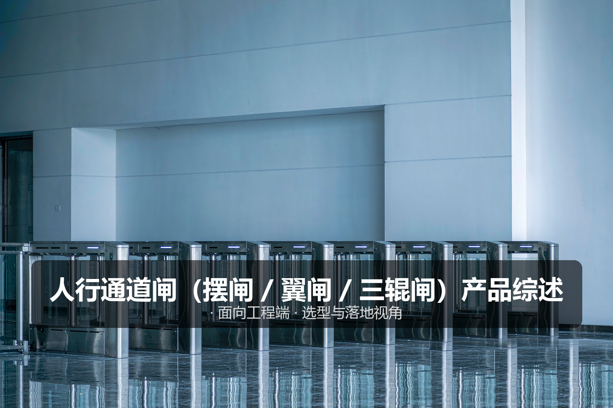
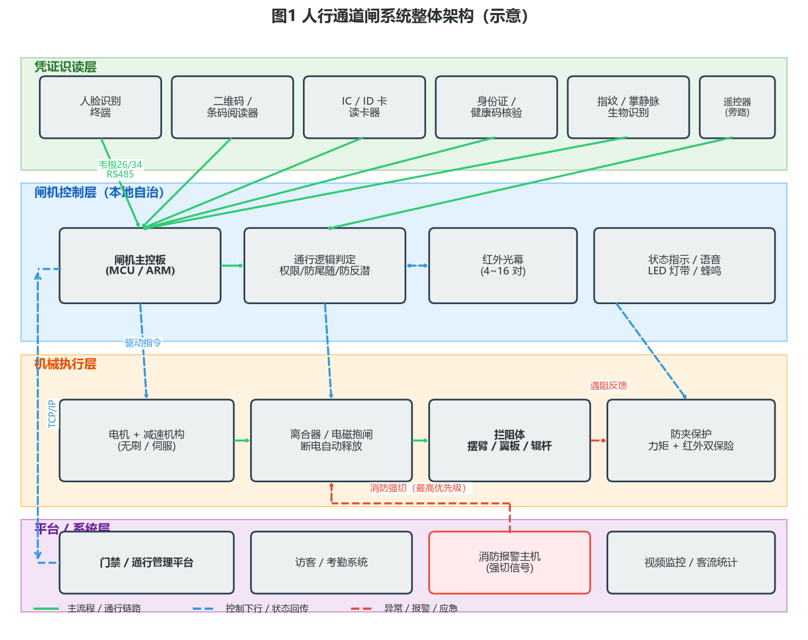
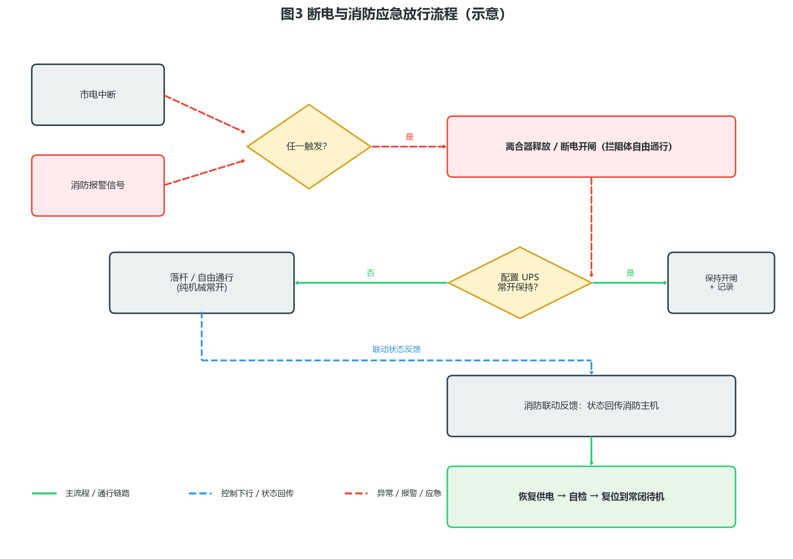
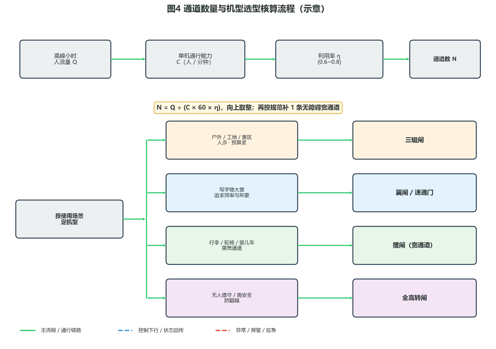
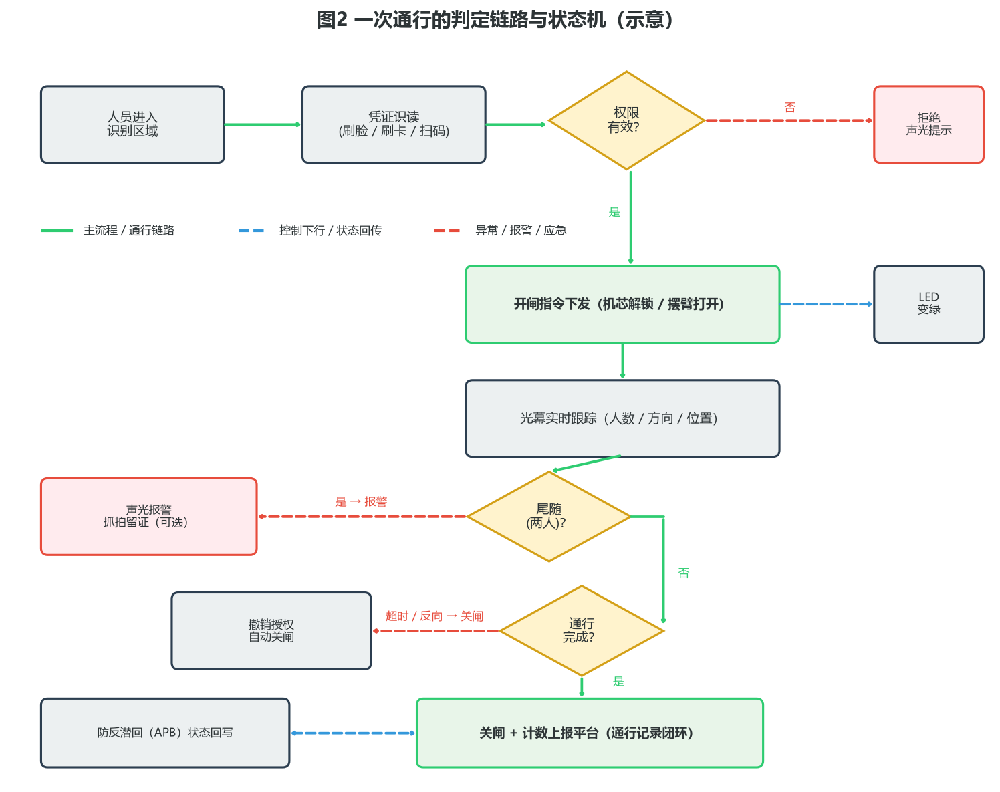

# 人行通道闸（摆闸 / 翼闸 / 三辊闸）产品综述

> 面向工程端 · 选型与落地视角



---

## 〇、一句话定位

**人行通道闸是人员出入口的物理屏障与通行管理终端，配合身份凭证实现一人一闸、有序通行。** 它把「识读身份 → 判定权限 → 开闸放行 → 检测通行 → 关闸留痕」这条链路压缩进不到一秒的时间里，把原本靠保安肉眼盯着的出入口，变成可授权、可计量、可追溯的自动化节点。

工程端看通道闸，核心不是挑一台机箱好看的闸机，而是**先把高峰人流量、通行效率、拦阻强度、断电应急和防夹安全这五件事算清楚**，再倒推机型、通道数与接口方案。本文面向工程 / 实施端，覆盖产品设计方案、核心参数与选型、技术原理、产品功能与差异化、应用场景、落地案例与核算清单、市场背景与竞争格局、商业模式与趋势共八章。除特别标注来源的行业基准外，参数均按**行业通用基准 / 工程估算**给出，用于方案评估，不作为某一具体型号的宣称指标。

---

## 一、产品设计方案

### 1.1 系统整体架构

通道闸交付的不是一台设备，而是「凭证识读层 → 闸机控制层 → 机械执行层 → 平台系统层」的四层系统。识读终端把身份交给闸机主控板，主控板结合红外光幕的实时状态判定是否放行，再驱动机芯打开拦阻体；平台层负责权限下发、记录归集与跨系统联动，消防报警主机则以最高优先级介入。



四层分工清晰：

- **凭证识读层**：回答「你是谁」。人脸终端、二维码阅读器、IC/ID 读卡器、身份证核验模块、指纹与掌静脉模块都属于这一层，它们与闸机之间通过韦根、RS485 或 TCP/IP 传递一个「通过 / 拒绝」的判定结果。
- **闸机控制层（本地自治）**：回答「放不放」。闸机主控板是整机的中枢，负责权限校验、通行状态机、防尾随判定、防反潜回、光幕信号采集与声光提示。**关键点在于本地自治**——平台断网时，闸机必须仍能凭本地权限库正常放行，不能把通行能力绑死在网络上。
- **机械执行层**：回答「怎么挡」。电机与减速机构提供动力，离合器负责断电释放，拦阻体（摆臂 / 翼板 / 辊杆）形成物理屏障，防夹保护则保证任何情况下不伤人。
- **平台 / 系统层**：回答「记给谁看」。通行管理平台、访客与考勤系统、消防主机、视频监控共同构成上层生态，闸机只是其中一个执行末梢。

工程实施要点：

- **通道数是第一设计变量**：通道数量直接决定投资额与大堂空间占用，必须在方案阶段按高峰人流量算出来，而不是拍脑袋定「一边一个」。
- **断电开闸是硬约束**：只要通道位于疏散路径上，断电必须自动形成自由通道，这是消防验收的红线，任何「断电落闸锁死」的设计都是错的。
- **防夹是安全底线**：拦阻体是运动部件，力矩限制与红外探测必须双保险，只有其中一项的方案不应进入人员密集场所。

### 1.2 典型形态分类

按拦阻体结构与拦阻强度，人行通道闸大致分为六类。这张表是选型的起点：

| 类型 | 拦阻体与结构 | 通道宽度（工程基准） | 通行能力（工程基准） | 适用场景 | 工程关注点 |
| --- | --- | --- | --- | --- | --- |
| **三辊闸** | 三根 120° 分布的水平辊杆，旋转放行 | 550~600mm | 20~30 人 / 分钟 | 工地、工厂、景区、体育场 | 机械防尾随强、成本低；行李与轮椅通行困难 |
| **摆闸** | 单侧或双侧摆臂（亚克力 / 不锈钢）水平摆动 | 600~900mm，宽通道可达 1100mm | 30~40 人 / 分钟 | 写字楼、政务大厅、医院 | 通道可做得很宽；拦阻强度弱于辊杆，防尾随靠算法 |
| **翼闸** | 两侧翼板收进箱体 / 伸出拦截 | 550~900mm | 35~50 人 / 分钟 | 写字楼大堂、地铁、园区 | 速度快、外形简洁；翼板行程短，防夹设计更关键 |
| **速通门（摆闸高配）** | 伺服机芯 + 钢化玻璃门翼，摆幅大 | 600~900mm | 40~60 人 / 分钟 | 高端写字楼、总部、金融 | 单机价格高；对地面平整度与安装精度要求高 |
| **全高转闸** | 全高栅栏旋转体，高度 2m 以上 | 600~700mm | 15~25 人 / 分钟 | 监狱、封闭厂区、无人值守 | 防翻越等级最高；通行慢、体量大、需预留安装空间 |
| **平移闸** | 门翼水平侧向平移 | 550~900mm | 30~45 人 / 分钟 | 高端场馆、机场 | 结构占用箱体长度大；维护复杂度较高 |

选型上不存在「越贵越好」，关键看人流量与拦阻诉求：

- 一个每天 3000 人次进出的施工工地，三辊闸 + 人脸识别就能把实名制和防尾随都解决，上速通门是浪费；
- 一个早高峰 15 分钟要过 800 人的写字楼大堂，三辊闸会排长队，必须上翼闸或多通道速通门；
- 一个有无障碍通行诉求的政务大厅，至少留一条 900mm 以上的宽通道摆闸，这是规范诉求，不是可选项。

### 1.3 设计要点与工程约束

**断电与消防应急（红线）**。通道闸位于人员疏散路径上时，断电必须自动开闸。实现方式有两种：一是机芯内置**断电释放离合器**（电磁离合器失电脱开，摆臂 / 翼板可徒手推开）；二是配置 UPS 让闸机在断电后仍保持开闸状态并维持计数。工程上更稳妥的做法是**离合器机械释放 + 消防干接点强切**双路并行——机械释放不依赖任何电子部件，消防信号则保证联动的可追溯性。



**通道宽度与无障碍**。标准通道 550~600mm 能满足绝大多数成年人通行；携带行李、推婴儿车、坐轮椅的场景需要 900mm 以上。**工程上常见的做法是「N 条标准通道 + 1 条宽通道」**，宽通道平时也可作为大件物品与访客通道使用。

**防夹设计**。运动拦阻体必须同时具备：
- **力矩 / 电流检测**：电机驱动电流异常升高即判定遇阻，立即反转或停止；
- **防夹红外**：在拦阻体运动范围内布设独立探测光束，检测到遮挡立即停止动作；
- **机械圆角与软边**：翼板边缘倒圆、摆臂加装柔性条，降低夹伤风险。

**室外防护**。半室外与纯室外场景要按 IP65 选型，同时关注：机箱排水孔与底部防水台、低温环境下电机与润滑脂的适用温度、夏季箱体内部散热与凝露处理、不锈钢材质选用 304 及以上（沿海或化工环境建议 316）。

**地面与布线**。闸机自重通常在 60~120kg（整机，工程基准），安装面要平整、承重可靠；预埋管线一般预留：强电 220V、网络（超五类及以上）、消防联动线（RVVP 屏蔽线）、以及与其他闸机级联的 RS485 总线。通道间距要保证相邻闸机之间留有检修空间，一般不小于 100mm。

---

## 二、核心参数与选型

> 工程端第一步不是选型号，而是**先算清楚高峰人流量、所需通道数、通道宽度与应急方式**，再对照参数表挑机型。

### 2.1 选型公式与关键指标

选型围绕六个核心指标展开，把每一项算清楚，选型就不会偏：

| 关键指标 | 工程含义 | 核算公式 / 评估口径 |
| --- | --- | --- |
| **高峰小时人流量 Q** | 最繁忙时段（通常 15~30 分钟峰值折算）的通过人数 | 按实测或同类项目经验取值，取早高峰与晚高峰的较大者 |
| **单机通行能力 C** | 单通道每分钟可通过人数 | 由机型决定：三辊闸 20~30、翼闸 35~50、速通门 40~60（工程基准） |
| **利用率 η** | 实际通行效率相对理论值的折扣 | 0.6~0.8；识读方式慢（如刷卡找卡）取低值，人脸识别取高值 |
| **所需通道数 N** | 满足峰值需要的通道数量 | **N = Q ÷ (C × 60 × η)**，向上取整 |
| **通道净宽 W** | 拦阻体打开后的实际通过宽度 | 标准 550~600mm；无障碍 ≥ 900mm |
| **开 / 关闸时间** | 拦阻体动作响应时长 | 工程基准 0.3~0.8s（摆闸）／0.2~0.6s（翼闸），直接影响 C |

一个速算示例：某写字楼早高峰 30 分钟通过 900 人，折算 Q ≈ 1800 人 / 小时，选翼闸 C = 40 人 / 分钟，人脸识读取 η = 0.75：

```
N = 1800 ÷ (40 × 60 × 0.75) = 1800 ÷ 1800 = 1.0
```

理论 1 条通道即可，但工程上必须 **+1 条冗余**（应对设备故障、访客通行与高峰波动），再 **+1 条无障碍宽通道**，最终配置为 **2 条标准翼闸 + 1 条宽通道摆闸**。这也是大堂项目最常见的配置形态。



几个常用工程估算：

- **排队长度反推**：若单通道前排队超过 6~8 人，说明通道数不足或识读方式太慢，优先优化识读（刷脸替代刷卡）而不是盲目加通道。
- **识读时间占比**：一次通行的总耗时中，识读（0.3~1.5s）往往比开闸（0.3~0.6s）更占时间。提升通行效率的首选手段是换更快的识读方式。
- **双向通行**：同一条通道双向使用时，方向切换会增加冲突判定，实际通行能力约为单向的 60%~80%。人流双向且都大的场景，建议按方向分设通道。

### 2.2 各部件参数表（工程关注点）

下表为**行业通用基准范围**，供方案评估，具体以厂商选型规格书为准。

| 部件 | 关键参数 | 典型范围（工程基准） | 工程关注点 |
| --- | --- | --- | --- |
| **主控板** | 处理器、本地权限容量、离线记录容量 | ARM Cortex-M / A 系列；权限 1 万~10 万条；离线记录 10 万~100 万条 | 断网自治是选型硬指标；记录容量决定断网可撑多久 |
| **驱动电机** | 类型、功率、寿命 | 直流无刷（主流）/ 伺服（高端）；20~100W；寿命 300 万~500 万次（工程基准） | 无刷已是标配，有刷电机不建议用于高频场景 |
| **减速机构** | 形式、减速比、噪音 | 蜗轮蜗杆 / 行星齿轮；噪音 ≤ 60dB | 噪音在大堂场景是硬指标，现场要实测 |
| **离合器** | 释放方式、响应时间 | 电磁离合，断电 < 1s 释放 | 必须现场断电实测，不能只看说明书 |
| **红外光幕** | 对数、探测方式、响应时间 | 4~16 对；对射式为主；响应 ≤ 20ms | 对数越多，防尾随与身高判定越准 |
| **拦阻体** | 材质、厚度、行程 | 亚克力 8~12mm / 钢化玻璃 / 304 不锈钢管 | 户外与高频场景优先金属，亚克力易划伤 |
| **机箱** | 材质、厚度、防护等级 | 304 不锈钢 1.2~1.5mm；室内 IP42~IP54，室外 IP65 | 板材厚度直接影响抗撞与长期使用变形 |
| **通行速度** | 开 / 关闸时间 | 0.2~0.8s | 与 C 强相关，投标时要求实测 |
| **通信接口** | 上行、下行、联动 | TCP/IP、RS485、韦根 26/34、干接点、消防强切 | 接口种类决定能否并入既有门禁平台 |
| **供电** | 电压、功耗、UPS | AC 220V；待机 20~50W，动作峰值 100~200W | 一个通道的电源要单独回路，避免多台共回路跳闸 |
| **工作环境** | 温度、湿度 | -20℃~60℃（常温型），低温型可至 -40℃ | 北方室外项目必须确认低温型 |
| **MCBF** | 平均无故障工作次数 | 300 万~500 万次（主流厂商宣称，工程基准） | 属于厂商宣称值，合同里要写清质保与响应时效 |

### 2.3 工程对接踩坑点

- **断电开闸没实测就验收**：不少项目调试时只测了通电状态，交付后第一次停电才发现离合器没动作，人被困在闸机里。调试清单里必须有「断电实测」这一项，且要逐台测。
- **通道数与识读方式不匹配**：配了 4 条速通门，却用刷卡 + 密码的慢速识读，瓶颈全在识读环节，通道再多也没用。识读方式要与通道能力一起设计。
- **光幕对数不足导致误判**：光幕只有 4 对时，儿童、行李与贴身尾随很难区分，误报与漏报都高。人员构成复杂的场景（含儿童、行李）建议 8 对以上，或引入视觉辅助判定。
- **地面不平导致门翼刮擦**：速通门对安装面的平整度敏感，地面不平会造成门翼摆动时与地面或箱体刮擦，长期磨损并产生异响。安装前要校平，必要时做基础找平。
- **与消防联动只接了信号没接反馈**：只把消防主机的干接点接到闸机，却没把闸机状态回传，消防验收时无法证明「已形成疏散通道」。双向都要接通并做联动测试。
- **室外没做排水与散热**：半室外闸机底部积水、夏季箱内凝露，是故障率最高的两类问题。箱体底部要留排水孔，顶部要有遮阳与通风。
- **多台闸机共用一条电源回路**：动作峰值叠加会导致断路器跳闸，尤其早高峰多台同时动作。建议每台独立回路或按 2~3 台一组分回路。

---

## 三、技术原理

> 通道闸的技术含量不在「挡住人」，而在「用不到一秒的时间，判断出是一次合法通行还是一次尾随」。下面按感知、决策、执行、通信四层拆解，每层讲清物理基础、核心机制、演进脉络与适用边界。

### 3.1 感知层：红外光幕如何「看见」一个人

**物理基础**。红外对射由发射端与接收端构成，发射管发出调制红外光（通常为 38kHz 载波调制，用以抗环境光干扰），接收端收到光束时输出一种电平，被遮挡时输出另一种电平。闸机在通道两侧按高度与纵深布置多对光束，形成一张**光幕**。

**核心机制**。光幕的作用不是「检测有没有人」，而是**按时间序列记录遮挡图案**。一个人正常通行时，遮挡的对数、顺序、持续时间都落在可预期的范围内：先遮进入侧、再遮中间、最后遮离开侧，遮挡宽度对应一个人体厚度，持续时间对应通行速度。两个人贴身尾随时，遮挡持续时间变长、遮挡宽度变大、且中间光束的断开次数不符合「一人」的模式——算法据此判定为尾随。

**演进脉络**。第一代闸机只用 2~4 对光束，做最简单的「有没有人」判断；第二代增加到 6~12 对并引入方向判定与身高估计；第三代在光幕基础上叠加**毫米波雷达或视觉传感器**，用渡越时间（ToF）或图像分割直接估计人体轮廓与人数，把「行李 vs 人」「儿童 vs 成人」「贴身尾随 vs 正常并列」区分开。

**适用边界**。纯红外方案在以下情况会失效或误判：深色衣物对特定波长吸收强导致接收裕量下降；强阳光直射接收管造成饱和；人员并排紧贴通过（间距小于光束间距）；携带超大件行李；通道内逗留、折返。这也是高端场景引入视觉辅助的根本原因。工程上可验收的指标是**尾随检出率与误报率**，应在现场用真实人群做不少于 100 次的通行测试，而不是只看厂商宣传。

### 3.2 决策层：一次通行的状态机

**物理基础**。闸机主控板运行一个有限状态机（FSM），输入是识读结果与光幕状态，输出是驱动指令与声光提示。状态机必须严格，否则会出现「刷一次过两人」这类安全漏洞。

**核心机制**。完整链路如下：



几个关键判定：

- **权限判定**：识读终端返回的凭证交给主控板，与本地权限库比对（人—通道—时段三元组），命中则进入放行流程。**这一步必须在本地完成**，不能依赖平台实时返回，否则断网即瘫痪。
- **防尾随（Tailgating）**：开闸后持续跟踪光幕，若检出人数 > 1 或遮挡模式异常，立即触发报警并可联动抓拍。高端机型会在检出尾随时**保持开闸而非夹人**——安全优先于拦阻。
- **防反潜回（APB，Anti-Passback）**：记录每个人的「进 / 出」状态，进入后未出场前不允许再次进入，出场后未进入不允许再次出场。这一机制杜绝了「把卡递给别人重复使用」，在园区与工地场景是刚需。
- **超时与反向撤销**：开闸后规定时间内未通行（工程基准 5~15s 可配），自动撤销授权并关闸；检测到反向进入也立即撤销。

**演进脉络**。早期闸机是「刷卡即开、延时即关」的简单逻辑，防尾随靠机械结构（三辊闸天然一人一杆）；后来的闸机引入光幕做人数判定；现在的智能闸机把状态机与视觉算法结合，支持「尾随报警 + 抓拍留证 + 平台联动」，并能在云端更新判定策略。

**适用边界**。算法再好也不能突破物理限制：**通道越宽，防尾随越难**。900mm 以上的宽通道在物理上完全容得下两人并行，此时防尾随只能靠「开闸时间窗口 + 视觉辅助 + 管理制度」共同保障，不能承诺 100% 拦截。方案沟通时这一点必须说清楚，否则验收时会扯皮。

### 3.3 执行层：机芯里的三件事

**物理基础**。机芯 = 电机 + 减速机构 + 离合器 + 位置反馈。电机提供扭矩，减速机构把高转速小扭矩转换为低转速大扭矩，离合器负责动力通断，编码器或霍尔传感器提供位置闭环。

**核心机制**。

- **电机**：主流为直流无刷（BLDC），通过电子换向避免电刷磨损，寿命与静音表现都显著优于有刷电机；高端速通门用伺服电机，可实现**力矩闭环**——遇阻时不是等电流升高再判断，而是直接感知反作用力变化，响应更快、防夹更可靠。
- **离合器**：电磁离合器在通电时吸合传递动力，断电时靠弹簧或重力脱开，使拦阻体变为自由状态。这是「断电开闸」的物理实现，也是消防合规的关键部件。
- **位置反馈**：霍尔或编码器给出拦阻体角度，主控板据此做减速曲线控制——接近全开 / 全闭时降速，既减少撞击噪音，也延长机械寿命。

**演进脉络**。从「有刷电机 + 机械限位撞击」到「无刷 + 霍尔闭环 + S 曲线加减速」，再到「伺服 + 力矩闭环 + 自适应速度」，执行层的演进主轴始终是**更快、更静、更安全**。

**适用边界**。机芯寿命与动作频次强相关，宣称的 300 万~500 万次属于厂商在理想工况下的测试值（工程基准）。实际项目中，户外高低温、灰尘、安装精度偏差都会显著缩短寿命。工程上的可验收指标是**现场连续运行 72 小时无故障 + 噪音实测 ≤ 60dB（大堂场景）**。

### 3.4 通信层：接口决定能否并入既有系统

**物理基础**。闸机与外界的接口分三类：识读上行（韦根 / RS485 / TCP）、平台管理（TCP/IP）、联动控制（干接点 / 串口 / 网络）。

**核心机制**。

- **韦根 26/34**：最传统的识读接口，单向、短距离（≤ 100m 工程基准）、无加密，胜在兼容性极好，几乎所有读卡器与人脸终端都支持。
- **RS485**：用于闸机级联与远距离（≤ 1200m 工程基准）传输，需手拉手布线并加终端电阻。
- **TCP/IP**：现代闸机的标配，支持平台远程管理、固件升级与记录实时上报，是本地自治之外的主要通道。
- **干接点**：消防强切与紧急按钮的标准接口，**无源、无协议、最可靠**——越是关键的安全联动，越要用最简单的接口。

**演进脉络**。从纯韦根到本地 TCP/IP，再到支持 MQTT / HTTP API 对接云平台，通信层的演进让闸机从「独立设备」变成「系统末梢」。

**适用边界**。接口越多不等于越好用。**消防强切必须走独立的硬接线干接点**，绝不能只依赖网络指令——网络断了消防联动也必须生效，这是设计的底线。

---

## 四、产品功能与差异化

落到用户真实收益，通道闸的能力可以分成基础能力、通行体验、安全能力与管理能力四组。

**基础通行能力**

- **多凭证融合**：同一台闸机同时支持人脸、卡、二维码、身份证，不同人群用不同凭证，一套硬件覆盖员工、访客与临时人员。
- **双向可控**：进 / 出分别授权，支持单向常开、双向受控、自由通行等多种模式，可按时段自动切换（如上班高峰双向常开、夜间受控）。
- **记忆通行**：连续识别多人后依次放行，减少排队等待，适合大堂高峰。

**通行体验**

- **快速识读联动**：人脸识别把单次通行压缩到 1 秒以内，人流高峰不明显排队。
- **静音机芯**：S 曲线加减速把开关闸噪音控制在可接受范围，大堂场景不会打扰办公。
- **声光引导**：LED 灯带与语音提示明确告诉用户「可以过 / 不能过 / 请退出」，减少犹豫造成的拥堵。

**安全能力**

- **防夹双保险**：力矩检测 + 防夹红外，任何一路触发立即停止或反转。
- **尾随检测与报警**：检出尾随后声光报警并上报平台，可联动抓拍留证。
- **断电 / 消防强制放行**：机械释放 + 消防强切，保证疏散通道畅通。
- **防反潜回**：杜绝凭证传递复用，在封闭管理场景是刚需。

**管理能力**

- **离线自治**：断网时凭本地权限库正常放行，联网后补传记录，网络故障不阻断通行。
- **计数与客流统计**：每一次通行都是一条带时间戳的记录，直接产出客流数据。
- **跨系统联动**：与门禁、访客、考勤、消费、视频监控打通，一次通行同步完成多项业务。

差异化上，真正拉开档次的是三件事：**机芯的静音与寿命、通行判定的准确率（尾随检出率与误报率）、以及断网与断电下的可靠降级能力**。外观与屏幕尺寸是最容易被模仿的部分，也是最不值得作为主要选型依据的部分。

---

## 五、应用场景

### 场景一：写字楼与企业总部大堂

- **痛点**：早高峰 15~30 分钟集中涌入上千人，刷卡找卡慢导致排队；外来人员混入办公区，访客管理靠登记本，出了事追溯不到人。
- **方案**：多通道翼闸或速通门 + 人脸识别，员工刷脸无感通行；访客通过访客系统预约后生成二维码，闸机扫码限时通行；配置 1 条宽通道供大件与无障碍使用。
- **价值**：通行效率从每人 2~3 秒压缩到 1 秒以内，高峰排队基本消失；每一次通行都有记录，访客轨迹可追溯；前台人力从登记核验转向接待服务。

### 场景二：施工现场与工厂厂区

- **痛点**：建筑工人实名制是政策硬性要求，人工点名效率低且数据不可信；工地出入口环境差，设备要扛得住粉尘、雨水与碰撞。
- **方案**：三辊闸或户外型摆闸 + 人脸识别（可结合安全帽识别），闸机数据与实名制平台对接，自动生成考勤与在场人数；按 IP65 与低温/高温型选型。
- **价值**：实名制数据自动生成，无需人工统计；在场人数实时可查，应急疏散时可快速核点；机械拦阻强度高，能扛住现场粗暴使用。

### 场景三：园区与校园

- **痛点**：出入口多、人员构成复杂（员工、学生、访客、施工人员），凭证类型不统一；存在凭证借用与代刷现象。
- **方案**：按出入口分级配置，主出入口用翼闸 + 人脸，次出入口用摆闸 + 卡 / 二维码；开启防反潜回，杜绝凭证传递；与车辆道闸、访客系统统一管理。
- **价值**：一套平台管住所有出入口，人员流动可查；防反潜回机制从技术上堵住代刷漏洞。

### 场景四：交通枢纽与景区

- **痛点**：人流量极大且波动明显，节假日峰值是平日的数倍；票种多（成人 / 儿童 / 优惠票），需要按票种放行并精确计数。
- **方案**：多通道翼闸或三辊闸 + 二维码 / 身份证核验，与票务系统实时对接；预留可开启的备用通道应对峰值；配置宽通道服务行李旅客。
- **价值**：检票效率大幅提升，票种校验自动化；通行数据直接服务于客流分析与运力调度。

### 场景五：医院与政务大厅

- **痛点**：轮椅、婴儿车、推车通行频繁，标准通道过不去；人流量大且以老年人为主，防夹与通行引导要求高。
- **方案**：宽通道摆闸为主，配合标准通道分流；强化防夹与声光引导；开启常开模式降低通行阻力，异常时才拦截。
- **价值**：无障碍通行落到实处，不再靠人工开侧门；常开模式兼顾通行效率与异常管控。

---

## 六、实际案例与设计方案

### 案例一：科技企业总部大堂（效率与安全并重）

**需求梳理**。某科技企业总部新址，办公人员约 2200 人，另需容纳日常访客与施工人员。早高峰 8:30—9:00 实测通过约 950 人；大堂装修风格现代，要求设备外观简洁、运行安静；企业要求访客全流程线上化，通行记录可追溯。

**方案设计**。

- 通道配置：按 Q ≈ 1900 人 / 小时、翼闸 C = 40、η = 0.75 计算，N = 1900 ÷ (40 × 60 × 0.75) ≈ 1.06，取 2 条标准通道加冗余，另设 1 条 900mm 宽通道，**最终 2 条翼闸 + 1 条宽通道摆闸**。
- 识读方式：员工人脸识别，访客二维码（访客系统预约后下发，限时段限区域），施工人员 IC 卡。
- 联动设计：与门禁平台、访客系统、考勤系统打通，员工一次刷脸同时完成门禁放行与考勤打卡；消防干接点接入，断电自动开闸。

**配置核算**。

| 项目 | 数量 | 说明 |
| --- | --- | --- |
| 翼闸（标准通道 600mm） | 2 台 | 双向受控，高峰可切常开 |
| 摆闸（宽通道 900mm） | 1 台 | 无障碍 + 大件物品通道 |
| 人脸识别终端 | 4 台 | 每通道双向各 1 台 |
| 二维码阅读器 | 2 台 | 访客通道 |
| 通行管理平台 | 1 套 | 权限下发、记录归集、报表 |
| 消防联动模块 | 1 套 | 干接点强切 + 状态回传 |
| UPS（可选） | 1 套 | 断电后维持开闸与计数约 30 分钟 |

**安装要点**。安装面找平（平整度 ≤ 2mm/m，宽通道门翼摆动范围内不得有高差）；每台独立电源回路并与照明回路分离；网络与消防线分管敷设；通道间预留 ≥ 100mm 检修间隙；设备进场前完成地面石材铺装，避免后期污染。

**配置与调试**。断电实测逐台进行，确认离合器释放与自由通行；尾随测试用真实人群做不少于 100 次，记录检出率与误报率；防夹测试用标准测试棒在拦阻体多个位置触发；消防联动与消防主机联合测试，确认信号与反馈双向有效；常开 / 常闭模式按时段切换策略配置并验证。

**交付价值**。早高峰排队从改造前的 5~8 人缩短到基本无排队；访客从纸质登记转为线上预约 + 扫码通行，前台工作量明显下降；通行记录为考勤、安保与空间利用率分析提供一手数据。

### 案例二：市政工程施工现场（实名制与恶劣环境）

**需求梳理**。某市政工程施工期 18 个月，高峰期在场工人约 600 人，分包单位多、人员流动频繁；按建筑工人实名制管理要求，需实现进场人员身份核验与考勤数据上报；现场粉尘大、有雨水冲刷，设备需户外部署。

**方案设计**。

- 机型选择：户外型三辊闸（IP65，304 不锈钢 1.5mm），机械拦阻强度高、抗粗暴使用、成本可控。
- 识读方式：人脸识别 + 安全帽识别联动，未佩戴安全帽者不放行（安全管控与通行管控合并）。
- 数据对接：闸机通行记录通过 4G / 有线网络上传至实名制管理平台，自动生成班组考勤与在场人数。
- 辅助配置：遮阳防雨棚、底部防水台与排水孔、低温型润滑与电机（当地冬季最低约 -15℃）。

**配置核算**。

| 项目 | 数量 | 说明 |
| --- | --- | --- |
| 户外三辊闸（IP65） | 3 台 | 2 进 1 出，满足 600 人早高峰（Q ≈ 600，C = 25，η = 0.7，N ≈ 0.57，取 2 + 1 冗余） |
| 人脸识别终端（户外） | 6 台 | 每通道双向各 1 台，带补光 |
| 安全帽识别联动 | 1 套 | 与识别终端联动控制放行 |
| 遮阳防雨棚 | 3 套 | 降低箱内温度与凝露 |
| 实名制对接接口 | 1 套 | 记录上报平台 |

**安装要点**。设备基础做混凝土墩台并高出地面 100mm 以上防积水；接地与等电位联结到位；网络优先有线，条件不具备时用 4G 并保证信号强度；箱体底部排水孔保持通畅并定期清理。

**交付价值**。实名制考勤数据自动生成并上报，满足监管要求且省去人工统计；在场人数实时可查，应急情况下可快速核点；安全帽联动把安全管控前置到入口，违规进入显著减少。

---

## 七、市场背景与竞争格局

> 说明：本章为定性判断，不引用未经核实的市场规模数字。

**需求驱动**。人行通道闸的需求来自三条主线：一是**出入口管理的自动化替代**，人力值守成本上升与精细化管理诉求共同推动闸机取代人工查验；二是**实名制与合规要求**，建筑施工等领域的实名制政策直接创造了刚性需求；三是**识读技术成熟带来的体验升级**，人脸识别与二维码的普及让「无感通行」成为可交付的现实方案，从而反过来拓展了闸机的适用边界。

**痛点与升级方向**。传统闸机方案的痛点集中在：尾随与代刷难以根治、断网断电时的降级行为不可靠、室外环境故障率高、多系统各自为政导致重复建设。这些痛点也正是近几年产品升级的主要方向。

**竞争格局（按玩家类型划分，定性）**。

| 玩家类型 | 特点 | 典型优势 | 工程选型注意 |
| --- | --- | --- | --- |
| 国际专业通道控制品牌 | 主打高端速通门与机场 / 金融场景 | 机芯寿命、静音与通行判定算法领先 | 价格高、交付周期长、备件与服务成本高 |
| 国内专业通道闸厂商 | 产品线覆盖三辊到速通门 | 性价比高、交付快、定制化能力强 | 同价位段品质差异大，需看机芯与实测数据 |
| 门禁 / 一卡通厂商延伸 | 闸机作为门禁系统的执行末梢 | 与自有门禁平台无缝集成 | 机械与机芯能力参差，部分为贴牌代工 |
| 安防生态厂商 | 闸机纳入整体安防解决方案 | 与视频、访客、报警系统打通 | 更看重生态整合，单机性能未必最优 |

**核心壁垒**。这个行业的技术壁垒不在外观，而在三处：**机芯的长期可靠性**（寿命、静音、力矩控制）、**通行判定算法的准确率**（尾随检出率与误报率的平衡）、以及**极端工况下的降级可靠性**（断电、断网、高低温）。这三点都是需要长期现场数据沉淀才能做好的，也是招投标时应重点核验的部分。

---

## 八、商业模式与趋势

**交付形态**。通道闸的交付通常有三种：一是**纯设备供货**，由集成商自行安装调试，适用于有实施能力的大型集成项目；二是**设备 + 实施交付**，厂商或集成商负责安装、调试与培训，是主流形态；三是**解决方案交付**，闸机作为出入口管理方案的一部分，与访客、考勤、视频等打包交付。

**盈利模式**。硬件一次性销售仍是主要收入来源，但服务性收入的占比在上升：质保期外的维保服务、备件供应、平台订阅（通行管理 SaaS）、以及基于通行数据的增值服务。工程端客户应特别注意**质保条款与备件可得性**——闸机是高频运动部件，五年后的备件供应能力直接决定全生命周期成本。

**技术趋势**。

- **识读视觉化**：人脸与掌静脉逐步替代刷卡，二维码在访客场景成为标配，识读环节的时间继续压缩。
- **判定智能化**：光幕 + 视觉 / 毫米波的多传感器融合，把「尾随」「行李」「儿童」分得更清楚，误报率持续下降。
- **无感通行**：在授权充分、风险可控的场景（如已实名员工通道），从「停下刷脸」走向「走过即通行」，闸机常开、异常才拦截。
- **一体化融合**：闸机与访客、考勤、消费、测温、安检等功能合并为一体化通道，减少重复建设与空间占用。
- **室外与极端环境适配**：伴随园区与市政场景扩张，IP65、宽温、防腐蚀等环境适应性成为常规要求而非选配。

对工程端而言，这些趋势的落点是一致的：**选型时要为未来留出接口与算力余量**。一台支持固件升级、具备本地算力、接口开放的闸机，五年后仍可接入新系统；而一台功能固化的闸机，很可能因为一次平台升级就变成孤岛。

---

## 小结

人行通道闸是把「人」这一最不确定的变量，变成可授权、可计量、可追溯数据的第一道闸门。工程落地的关键不在选一台参数漂亮的闸机，而在于把**高峰人流量 → 通道数 → 机型 → 识读方式 → 应急与安全**这条链路逐环算清、逐项实测。断电开闸要断电实测，防夹要现场触发测试，尾随判定要真人跑够一百次——这三件事做到位，项目就稳了一大半。

> 本文参数除标注来源外均为行业通用基准或工程估算，用于方案评估，不作为具体型号的宣称指标；实际选型请以厂商规格书与现场实测为准。
