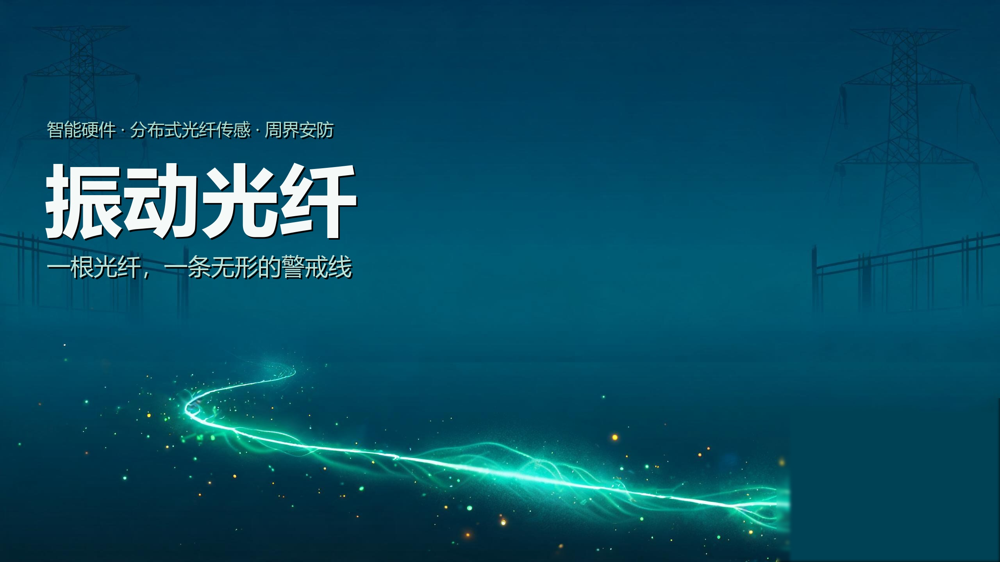
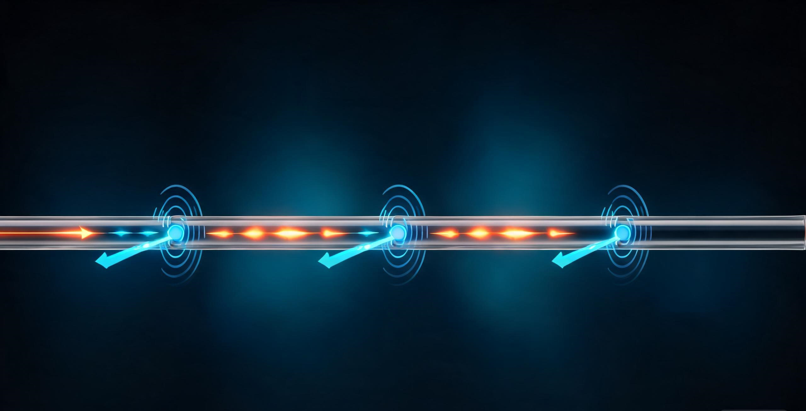

# 振动光纤周界安防系统：一根光纤，一条无形的警戒线

>  **产品**：振动光纤周界安防系统 ｜ **日期**：2026 年 9 月16日

振动光纤凭借分布式传感、全程无源与超远感知距离，正在把周界安防从"布防"推向"感知"。让我们通过这篇文章，从市场背景、技术原理、产品功能、应用领域、竞争格局到商业模式，完整拆解这类智能硬件产品为什么值得投入，以及它如何落地。

**一句话结论：** 振动光纤不是取代某一类安防设备，而是把"识别威胁"这件事从逐点传感器升级为整条光纤的分布式感知——误报更低、距离更长、维护成本更省，是未来大尺度周界防护的高性价比底座。

> 文章封面：一根发光的光纤贯穿地表，隐喻分布式振动感知构成的无形警戒线。

> 概念示意图：传感光缆沿防护边界延伸，末端连接光纤检测主机，常规走线方式为，光纤（单根光缆中，一根芯占用一个主机通道）一端接入主机后，沿围栏方向进行随形铺设，光纤尾端无需再接入主机（注意：根据振动光纤原理，采用瑞利散射的无需形成回路）。

---

## 1 开篇与产品定位

深夜，一条穿越山野的油气长输管道旁，一辆挖掘机缓缓靠近地表。传统安防系统里，靠摄像机可能"看不见、看太晚"，靠电子围栏则可能"被雨打湿导电、或被人为剪断后，无法精准定位"。振动光纤给出的答案是截然不同的：整条沿着管道铺设的光缆，本身就是一只连续铺了几十公里的"顺风耳"——地表任何一处扰动，都能被精确定位到米，并判断出是自然振动、车辆碾压还是蓄意挖掘。

这是分布式光纤传感技术的一种典型形态。用一个短句概括其定位：**振动光纤是一根光纤即一条无形警戒线的智能周界感知终端**。它的价值主张清晰明确——感知距离长、全程无源、抗电磁干扰、对腐蚀与恶劣气候环境天然耐受。

从系统构成看，一套完整的振动光纤产品由三端组成，三者既独立承担物理采集、信号处理与智能决策，又紧密协作：

- **传感光缆**：沿防护边界铺设，作为分布式"听觉"介质，无源、免供电。
- **检测主机**：连续向光缆发射与接收光信号，实时解调各点的振动事件，主机内置振动过滤算法，自动分析事件内容，并上报到平台。
- **智能安防平台**：将各种信号分类识别，经由事件规则设定，产生有效告警，并且联动视频或其他设备。

---

## 2 市场背景与痛点

把周界安防当成一套"卖设备"的生意，会低估它的规模。随着智慧园区、重点能源设施与城市生命线工程的监管要求不断收紧，安防由"事后取证"明显转向"事前感知"，这正是振动光纤的机会窗口。[1]

### 2.1 政策与需求驱动的上行周期

平安建设、危化品与长输管道的安全监管、国家应急体系对重点基础设施的防护要求，共同抬高了"主动感知型"周界产品的采购比重。相比单点传感器，能够覆盖长距离、连续感知的方案在工程项目竞标中具有天然的结构性优势。

### 2.2 传统方案的痛点

| 既有方案 | 核心痛点 |
| --- | --- |
| **电子围栏** | 天气与植被易引发误报；人为触碰即触发，无法辨别意图；金属带电部件维护成本高；以防区为单元，无法实现精准定位。 |
| **视频监控** | 依赖可视与光照，雨雾夜间失效；只能"看"，无力感知墙外与埋地区域的细微扰动。 |
| **微波/红外对射** | 视距受限、易受遮挡；大面积防护需密集布点，造价高。 |

这些痛点的共同指向是一个清晰的市场诉求：需要一种**低误报、抗环境、覆盖超长距离、几乎免维护**的感知方案。振动光纤恰好命中这组需求，这也是它近年在周界与管线市场快速渗透的根本原因。

---

## 3 技术原理

讲清楚原理，是为了证明功能"是真的、靠得住"。振动光纤的核心，是让一段普通的光缆同时充当传感器与信号传输通道。

### 3.1 物理基础：光的散射

光在光纤中传播时，会与纤芯的微观结构发生作用并产生散射。其中 `瑞利散射` 是分布式传感最常用的信号来源——当光纤某一段受到扰动（振动、压力、形变），该处的散射光相位会发生可探测的改变。对这种扰动回波做探测与解调的体制，被称为 `相位敏感光时域反射（Φ-OTDR）` ，也是分布式声学传感 DAS 的核心。

### 3.2 分布式定位：怎么知道扰动在哪

主机向光缆注入一束脉冲光。脉冲沿光纤前进，在每一个位置都会产生背向散射，通过测量"返回信号相对入射的时间差"，就能换算出每个事件对应的光纤长度位置。于是整条光缆被连续划分为成千上万个"感知像素"，任何一个像素处的微扰都被实时监测——这就是"一缆到底、逐点定位"的原理，定位精度可到米级甚至亚米级。

> **一句话理解：** 脉冲光像沿光缆跑的一辆"回声车"，每撞到一个扰动就发回一个带着位置和时间戳的回声；频繁发射脉冲，就得到了沿线的一条连续"听觉图谱"。

### 3.3 技术演进脉络

- **点式传感**：单点传感器布点，覆盖有限，无法覆盖整条线路。
- **分布式光纤传感**：一段光缆即一条连续感知线，覆盖距离大幅跃升。
- **AI 事件识别**：将振动波形分类为挖掘/碾压/自然噪声，降低误报。

从"点"到"线"再到"智能识别"，本质上是一步步把**感知能力做广、把判别能力做准**。理解这一步，也就可以自然衔接下一章的产品功能。

---

## 4 产品功能与差异化

功能是把原理翻译成用户可感知的价值。振动光纤产品的功能可以归为三层。

### 4.1 核心能力

- **连续定位：** 对整条防护线做米级精度的振动定位，精确告诉安防人员事件发生在哪个位置。
- **事件识别：** 通过振动特征将事件分类为攀爬、破拆、挖掘、车辆碾压或自然噪声，减少无效告警。
- **实时告警联动：** 告警即刻推送至命令中心，并联动邻近摄像设备复核现场。

### 4.2 差异化卖点

| 卖点 | 说明 |
| --- | --- |
| **超长距离** | 单端即可感知数十公里防护范围，减少中继与布点。 |
| **全程无源** | 传感光缆无需供电，适用无电无网、地形复杂的荒野与埋地场景。 |
| **抗电磁干扰** | 光信号天然不受雷击、强磁场与电磁干扰影响。 |
| **适应复杂环境** | 可埋地、可依附围栏，耐腐蚀、耐风雨，寿命长、免维护。 |

### 4.3 增强能力

在产品成熟部署后，核心系统会叠加**视频联动复核**与**误报率持续优化**两项能力：前者用图像确认、降低处置成本，后者通过部署期数据迭代识别模型，让告警质量随运行天数不断上升。

---

## 5 应用领域

一套"长距离、无源、抗干扰"的感知能力，价值会随应用场景被反复放大。以下每个场景都遵循"场景痛点 → 方案 → 价值"的结构。

| 场景 | 应用说明 |
| --- | --- |
| **周界安防** | 园区、仓储、军营、监狱等场所的围墙与周界，采用振动传感防攀爬与破拆，联动视频复核。 |
| **能源设施** | 油气长输管道、电力设施沿途防第三方开挖破坏，实现"打草惊蛇"式的提前预警。 |
| **智慧交通** | 公路、轨道交通与机场跑道沿线监测路基与侵入事件，支撑运营安全。 |
| **关键基础设施** | 数据中心、核设施、重要管线等高风险区域，提供高可靠性入侵与扰动感知。 |

从单一"防盗"延伸到"状态监测"，振动光纤的应用边界还在拓宽——它正从安防传感器进化成一种通用的"线状感知基础设施"。

> 示意图：贯穿荒野的油气长输管道，振动光纤沿管线部署实施远程监测。

---

## 6 竞争格局

横向对比能更直观地说明振动光纤的位置。下表在四类主流周界/监测方案之间做结构化比较。

| 维度 | 振动光纤 | 电子围栏 | 视频监控 |
| --- | --- | --- | --- |
| **覆盖距离** | 近百公里 | 单点/分段 | 视距有限 |
| **误报水平** | 低（可 AI 识别、平台联动过滤） | 高 | 中 |
| **天候适应性** | 强 | 中 | 弱 |
| **部署维护** | 免维护、耐腐蚀、单主机放置在机房 | 需供电、常维护、主机群安装在户外 | 需供电、需清洁 |

### 竞争壁垒

竞争力集中在**解调算法、事件识别准确率与工程化适配能力**三项。算法决定"能不能分清挖掘与卡车"，准确率决定"报警是否可信"，工程能力决定"能否在复杂地形顺利落地"——这也是后来者最难快速追赶的部分。

### 成本与交付优势

光纤本身价格低廉、无需沿途供电，配合免维护特性，使整套方案的安装与生命周期成本都低于同规模的传统布点方案。[2]

---

## 7 商业模式与未来趋势

### 交付与盈利形态

振动光纤产品通常以**整套方案交付 + 长期运维**的模式销售：一次性的传感光缆与主机硬件构成主体，平台软件承载监测与分析，再以长期运维订阅形成可持续收入。这种"硬件 + 软件 + 服务"的组合，让厂商摆脱一次性买卖、转向生命周期经营。

| 收入来源 | 说明 |
| --- | --- |
| **硬件** | 传感光缆、检测主机等初期交付资产。 |
| **平台软件** | 监测大屏、告警与分析平台的使用与授权。 |
| **运维订阅** | 长期值守、巡检、算法迭代的持续性服务费。 |

### 未来路线图

- **AI 大模型赋能：** 用更通用的模型提升事件分类与告警语义化能力。
- **多传感融合：** 振动 + 声音 + 温度 + 图像复合判断，进一步降低误报。
- **从感知走向决策：** 在识别入侵之外，提供处置建议与应急联动，让系统从"报警器"升级为"安防大脑"。

> **写在最后：** 振动光纤的核心机会，在于它把"看起来普通的一根光缆"变成了覆盖近百公里的连续感知层。对重要设施而言，这层"无形的警戒线"不仅是更省钱的安防方案，更是一种向主动感知转型的基础设施能力。

---

## 参考资料

1. 周界安防与重点设施监管政策背景。涉及"智能安防""主动感知"趋势的公开行业资料，供背景参考。
2. 分布式光纤传感方案生命周期成本对比。行业公开资料的定性比较，具体数值以厂商实测为准。