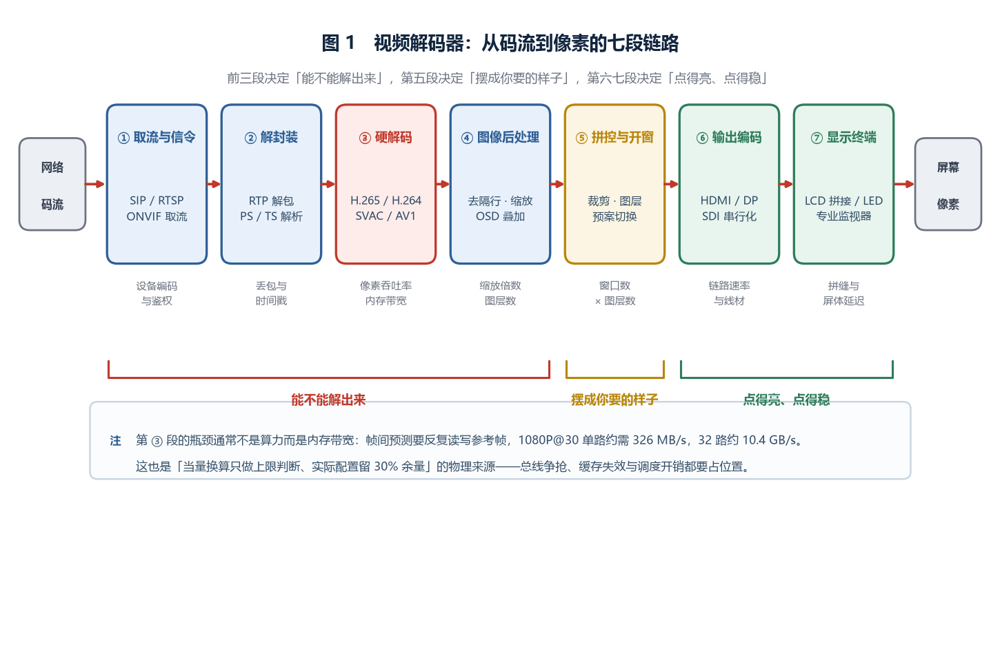
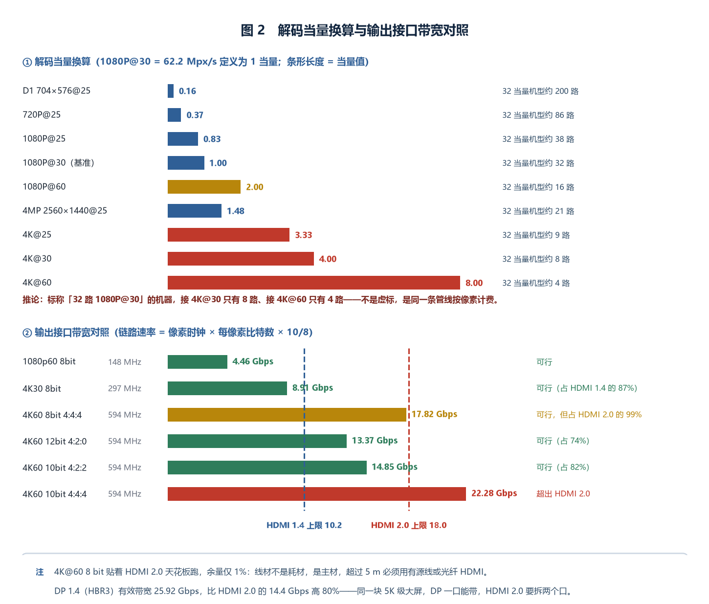
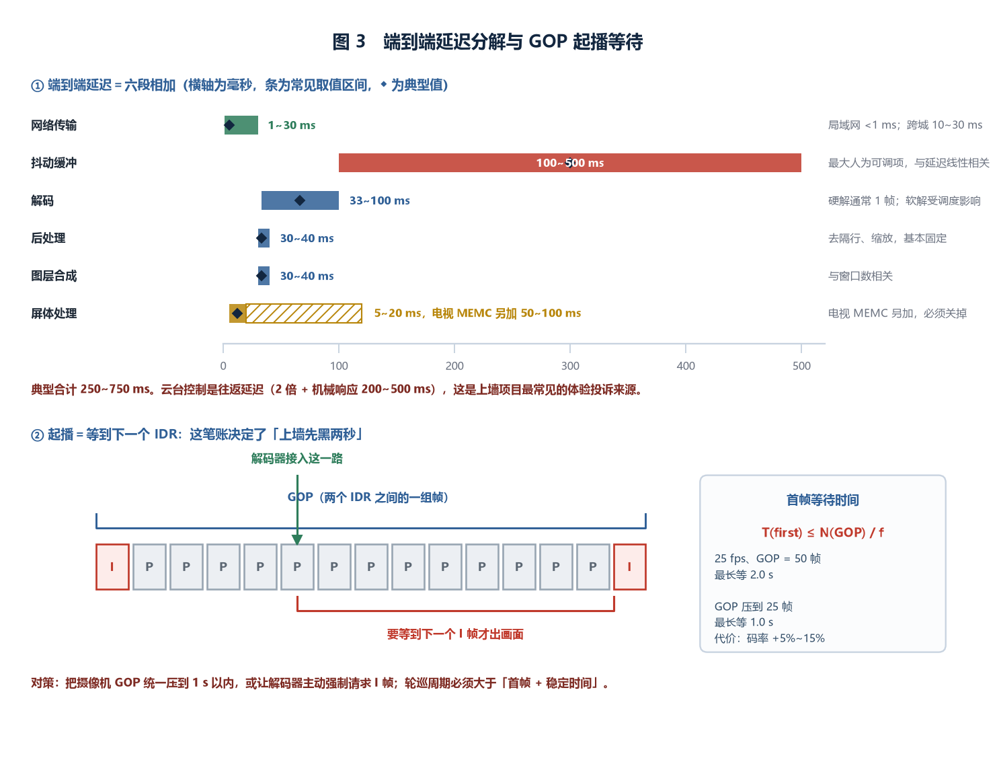
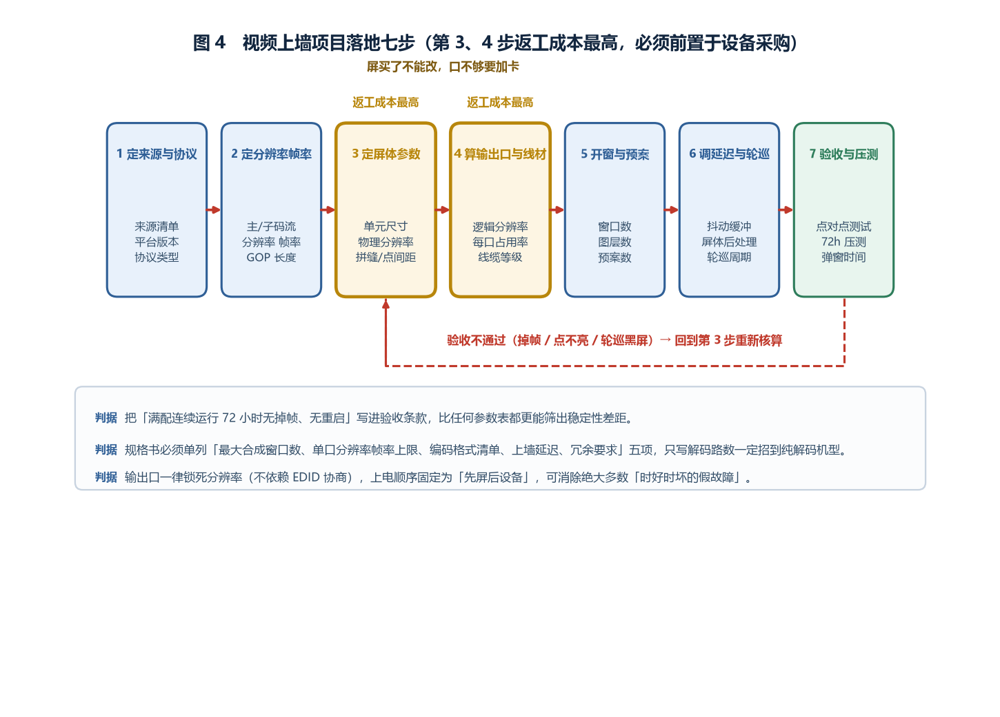

# 视频解码器产品综述：从码流到大屏，解码能力这笔账到底怎么算

> **面向读者**：安防与弱电集成商、监控中心 / 指挥中心的设计与实施岗、园区与城市级视频平台的甲方技术口、值机与运维人员。
> **数据口径**：标注「工程基准」的数值来自公开标准条款（GB 50395-2007、GB/T 28181-2022 等）、接口规范（HDMI 2.0 / DisplayPort 1.4）或行业通行配置经验；标注「工程估算」的为可复算的推算示例，只用于说明数量级与权衡方向，**不构成任何厂商的承诺指标**。文中码率取 H.265 主流档、25 fps 条件下的常见区间。

*封面为概念示意图，非真实设备照片。*

---

## 〇、一句话定位

**视频解码器是把网络上那些压缩过的码流，实时还原成一块大屏能点对点点亮的画面——它是视频监控系统里「最后一公里」的设备，前面所有环节的成果（探测、传输、存储、平台），最终都要通过它变成人眼能看的东西。**

这句话里藏着这个品类最反直觉的一点：**你买的不是「路数」，而是「每秒能还原多少个像素」。** 路数只是这个吞吐率在某个特定分辨率、特定帧率下的一个切片。一台标称「32 路 1080P@30」的解码器，接 4K@30 只能带 8 路，接 4K@60 只能带 4 路——不是厂商虚标，是同一块硅片的解码管线在按像素计费。反过来，接 720P@25 它能带 80 多路。

所以选型时真正要分配的稀缺资源不是「支持多少路」这五个字，而是三样东西：**总像素吞吐率、输出接口的链路带宽、以及端到端的延迟预算**。这三样各自都有明确的算法，也各自都有明确的失败模式。

**先把六个数字摆在这里，后面每一笔账都会回到它们：**

1. **1080P@30 = 62.2 Mpx/s**——本文把它定义为 **1 个解码当量**，后面所有路数换算都回到这个基准
2. **4K@30 = 248.8 Mpx/s = 4.0 当量**；**4K@60 = 497.7 Mpx/s = 8.0 当量**
3. **1080p60 像素时钟 = 2200 × 1125 × 60 = 148.5 MHz** → TMDS 链路速率 **4.455 Gbps**
4. **4K60 像素时钟 = 4400 × 2250 × 60 = 594 MHz** → 链路速率 **17.82 Gbps**，而 HDMI 2.0 的上限是 **18 Gbps**（余量 1%）
5. **25 fps、GOP = 50 帧时，起播最长要等 2 s**——这是「上墙先黑两秒」的真正原因
6. **GB 50395-2007 第 6.0.9 条**：操作者与显示设备屏幕之间的距离宜为屏幕对角线的 **4~6 倍**；第 5.0.4 条第 4 款：联动响应时间 **不大于 4 s**

---

## 一、产品设计方案

### 1.1 架构：从码流到像素的七段链路

一台视频解码器内部做的事情，可以拆成七个串联的环节。这七段里任何一段成为瓶颈，表现出来都是「画面卡 / 上墙慢 / 点不亮」，但成因完全不同。

*图 1　从网络码流到屏幕像素的七段链路。前四段决定「能不能解出来」，第五段决定「能不能摆成你要的样子」，第六、七段决定「能不能点亮、点得稳」。*

| 段 | 名称 | 关键动作 | 典型瓶颈 |
|---|---|---|---|
| ① | 取流与信令 | SIP 注册/ invites（GB/T 28181）、RTSP DESCRIBE/PLAY、ONVIF 取流地址 | 设备编码规则、鉴权、级联层级 |
| ② | 解封装 | RTP 解包、PS/TS 流解析、时间戳重建 | 丢包乱序、时间戳跳变 |
| ③ | 硬解码 | H.264 / H.265 / SVAC / AV1 的熵解码、反变换、帧间重建 | **解码像素吞吐率与内存带宽** |
| ④ | 图像后处理 | 去隔行、缩放、去噪、OSD 叠加、色彩空间转换 | 缩放倍数与图层数量 |
| ⑤ | 拼控与开窗 | 窗口坐标映射、裁剪、图层合成、预案切换 | 窗口数 × 图层数 |
| ⑥ | 输出编码 | TMDS/HDMI、DP Main Link、SDI 串行化、HDCP | **链路速率与线材质量** |
| ⑦ | 显示终端 | LCD 拼接单元、LED 发送卡、监视器 | 屏体处理延迟、物理拼缝 |

一个容易被忽略的事实：**第 ③ 段的瓶颈通常不是算力，而是内存带宽。** 帧间预测要反复读写参考帧，1080P@30 的 YUV 4:2:0 数据一份约 3 MB，双向预测要同时挂着前后两个参考帧，32 路并发时解码核与内存之间的读写量是几十 GB/s 量级。这就是为什么「多堆几路」在某些机型上会出现非线性劣化——超过某个路数后，每加一路的代价明显高于前一路。

### 1.2 形态谱系：四个正交维度

选型时不要只比「几路」，先把形态定下来。这四个维度互相正交，任何一个选错，后面的参数对比都是白比。

**维度一：部署形态**

| 形态 | 结构 | 适用 | 代价 |
|---|---|---|---|
| 机架式一体化 | 1U~4U，解码+拼控+输出全内置 | 单个监控中心，屏数 ≤ 几十块 | 单点故障影响面大，扩容靠换机 |
| 盒式单路/少路 | 1~4 路，HDMI 直出 | 小型值班室、门店、分布式末端 | 无拼控能力，多路需额外矩阵 |
| 板卡插箱式 | 机箱 + 解码卡 + 输出卡 | 大型指挥中心，按需插槽 | 机箱与背板带宽要先算清楚 |
| 分布式节点 | 编码节点 + 解码节点 + 交换机 | 跨楼层/跨楼、坐席协作 | 依赖网络质量，需独立 VLAN 与组播 |

**维度二：输出接口**

- **HDMI 2.0**：TMDS 上限 18 Gbps，单口最大 4K@60 8 bit（余量 1%，见 2.3）
- **DisplayPort 1.4（HBR3）**：4 lane × 8.1 Gbps = 32.4 Gbps 原始、有效 25.92 Gbps，单口可带 5K 级
- **12G-SDI**：广电链路，单根同轴 12 Gbps，长距离（100 m 级）优势明显，适合演播与大型指挥
- **DVI / VGA**：存量项目兼容，DVI 单链路上限约 4.95 Gbps（165 MHz 像素时钟）
- **IP 化输出（NDI / SRT / 组播）**：屏端再解一次，牺牲一跳延迟换取布线自由

**维度三：解码方式**

- **硬解（ASIC / SoC 固定管线）**：功耗路数比极高，1U 机器能跑几十路；**格式是硅片定死的**，今天不支持 AV1 的机器，固件升级也变不出来
- **软解（CPU / GPU）**：格式灵活、升级快，但 1080P@30 一路约占一个通用核的 30%~60%（工程估算），路数上不去、功耗下不来
- 监控场景几乎全是硬解，软解只用于临时接入特殊格式或做转码

**维度四：拼控深度**

- **纯解码**：只负责把码流变成一路 HDMI/DP 输出，拼接靠屏体自身（LCD 拼接单元内置环通拼接）或外置矩阵
- **解码 + 拼控一体**：开窗、漫游、跨屏、图层叠加、预案轮巡都在设备内完成
- 这一维直接决定价格区间，也是「同样是 16 路解码，为什么价格差三倍」的主因

### 1.3 九道设计关

一个上墙项目从需求到验收，要过九道关。每一道都有对应的可验收判据：

| 关 | 要定死的事 | 验收判据 |
|---|---|---|
| ① 协议 | 平台信令（GB/T 28181 级联 / 厂商 SDK / ONVIF）、传输（RTP over UDP/TCP） | 全部点位能注册、能取流 |
| ② 分辨率与帧率 | 主码流分辨率、帧率、GOP 长度 | 与摄像机实际配置一致 |
| ③ 解码资源 | 总当量需求 vs 设备吞吐率，留 30% 余量 | 满配轮巡无掉帧 |
| ④ 输出接口与线材 | 接口版本、线缆长度与等级、是否需光纤延长 | EDID 正确、无闪屏黑屏 |
| ⑤ 屏体参数 | 单元尺寸、物理分辨率、拼缝、亮度、色域 | 点对点不拉伸 |
| ⑥ 开窗与图层 | 最大同时开窗数、单屏最大窗口数、预案数 | 预案切换无残影 |
| ⑦ 延迟 | 上墙延迟、云台往返延迟 | 上墙 ≤ 500 ms（工程估算）、云台操作跟手 |
| ⑧ 冗余与供电 | 双电源、N+1 解码节点、UPS | 单机断电不影响整墙 |
| ⑨ 可观测 | 通道状态、丢包率、解码失败告警 | 有日志、有告警出口 |

---

## 二、核心参数与选型（六笔账）

### 2.1 参数速查表

| 参数 | 常见取值（工程基准 / 估算） | 说明 |
|---|---|---|
| 解码格式 | H.264（ISO/IEC 14496-10）、H.265/HEVC（ISO/IEC 23008-2）、SVAC（GB/T 25724-2017）、部分支持 AV1 | 格式由硅片决定，不可升级 |
| 解码能力 | 8 / 16 / 32 路 1080P@30 当量级 | **必须换算成像素吞吐率再比** |
| 单路最大分辨率 | 4K（3840×2160）@30/60、部分 4:4:4 支持 | 与输出接口版本绑定 |
| 输出接口 | HDMI 2.0（18 Gbps）/ DP 1.4（25.92 Gbps 有效）/ 12G-SDI | 见 2.3 的带宽核算 |
| 输出路数 | 4 / 8 / 12 / 16 口 | 决定可带屏数与冗余粒度 |
| 开窗能力 | 单屏 1/4/9/16 分割，整墙 16~64 窗 | 窗口数受解码通道 + 合成图层双限制 |
| 上墙延迟 | 250~750 ms（工程估算，含 jitter buffer） | 见 2.6 分解 |
| 网络接口 | 2 × 千兆（部分 万兆） | 见 2.5 并发核算 |
| 功耗 | 盒式 15~40 W，机架式满配 200~500 W（工程估算） | 与解码路数强相关 |
| 工作温度 | 0~40 ℃（工程基准，机房环境） | 机架风道要留 |

### 2.2 第一笔账：解码能力的真实单位是像素/秒，不是路数

解码器还原画面的工作量，正比于「每秒要还原多少个像素」：

$$P = \sum_i N_i \times W_i \times H_i \times f_i$$

其中 $N_i$ 是第 $i$ 类画面的路数，$W_i \times H_i$ 是分辨率，$f_i$ 是帧率。把 **1080P@30**（$1920 \times 1080 \times 30 = 62.2\ \mathrm{Mpx/s}$）定义为 **1 个解码当量**，其余格式换算如下：

| 格式 | 计算 | 像素率 | 当量 |
|---|---|---|---|
| D1 704×576@25 | $704\times576\times25$ | 10.1 Mpx/s | 0.16 |
| 720P@25 | $1280\times720\times25$ | 23.0 Mpx/s | 0.37 |
| 720P@30 | $1280\times720\times30$ | 27.6 Mpx/s | 0.44 |
| 1080P@25 | $1920\times1080\times25$ | 51.8 Mpx/s | 0.83 |
| **1080P@30** | $1920\times1080\times30$ | **62.2 Mpx/s** | **1.00** |
| 1080P@60 | $1920\times1080\times60$ | 124.4 Mpx/s | 2.00 |
| 4MP 2560×1440@25 | $2560\times1440\times25$ | 92.2 Mpx/s | 1.48 |
| 4MP@30 | $2560\times1440\times30$ | 110.6 Mpx/s | 1.78 |
| 4K 3840×2160@25 | $3840\times2160\times25$ | 207.4 Mpx/s | 3.33 |
| **4K@30** | $3840\times2160\times30$ | **248.8 Mpx/s** | **4.00** |
| 4K@60 | $3840\times2160\times60$ | 497.7 Mpx/s | 8.00 |

**推论一**：标称「32 路 1080P@30」的机器，总吞吐约 32 当量 ≈ 1990 Mpx/s。拿它接 4K@30，只有 $32 / 4.0 = 8$ 路；接 4K@60，只有 4 路。这不是虚标，是同一条管线的两种切法。

**推论二**：同一台机器接 720P@25，理论上能带 $32 / 0.37 \approx 86$ 路——但**大概率带不到**，因为并发取流连接数、内存带宽、合成图层数会在像素率耗尽之前先到顶。所以「当量换算」只用来做**上限判断**，实际配置要再留 30% 余量。

**推论三**：**帧率的权重和分辨率完全对称。** 1080P@60 是 1080P@30 的两倍当量。很多项目上墙卡顿，根因是摄像机被默认设成 60 fps 或 50 fps，白白吃掉一倍解码资源，而人眼看静态监控画面根本用不到。上墙场景下把主码流帧率压到 25 fps 是性价比最高的一刀。

*图 2　上半部分：常见格式的解码当量换算（以 1080P@30 = 1 当量）。下半部分：同一批分辨率在 HDMI 2.0 与 DP 1.4 上的链路速率对照，4K60 8 bit 已经贴到 HDMI 2.0 上限的 99%。*

### 2.3 第二笔账：输出口带宽，4K60 为什么刚好卡在 HDMI 2.0 的天花板

这一笔账是所有上墙项目最容易翻车的地方，因为它涉及三个不同的「率」，很多人把它们混为一谈：

**第一个是像素时钟**（单位 Hz），它是包含消隐区在内的总像素率：

$$f_{pix} = H_{total} \times V_{total} \times f_{frame}$$

以 CTA-861 时序为例，1080p60 的 $H_{total}=2200$、$V_{total}=1125$，所以 $f_{pix} = 2200 \times 1125 \times 60 = 148.5\ \mathrm{MHz}$。4K60 的 $H_{total}=4400$、$V_{total}=2250$，所以 $f_{pix} = 4400 \times 2250 \times 60 = 594\ \mathrm{MHz}$。

**第二个是链路速率**（单位 bps），物理线上真实跑的比特率。HDMI 的 TMDS 用 8b/10b 编码，有 25% 开销，且三条数据通道并行：

$$R_{link} = f_{pix} \times b_{pp} \times \frac{10}{8}$$

其中 $b_{pp}$ 是**编码前**每像素的比特数：8 bit 4:4:4 是 24，10 bit 4:4:4 是 30，10 bit 4:2:2 是 20，12 bit 4:2:0 是 18。

**第三个是有效视频数据率**，即真正承载图像的那一部，等于 $f_{pix} \times b_{pp}$，比链路速率小 20%。

代进去算：

| 时序 | 像素时钟 | 每像素比特 | 链路速率 | HDMI 1.4（10.2 Gbps） | HDMI 2.0（18 Gbps） |
|---|---|---|---|---|---|
| 1080p60 8bit | 148.5 MHz | 24 | 4.455 Gbps | ✓ | ✓ |
| 4K30 8bit | 297 MHz | 24 | 8.91 Gbps | ✓（87%） | ✓ |
| **4K60 8bit** | **594 MHz** | **24** | **17.82 Gbps** | ✗ | **✓（99%）** |
| 4K60 10bit 4:4:4 | 594 MHz | 30 | 22.28 Gbps | ✗ | ✗ |
| 4K60 10bit 4:2:2 | 594 MHz | 20 | 14.85 Gbps | ✗ | ✓（82%） |
| 4K60 12bit 4:2:0 | 594 MHz | 18 | 13.37 Gbps | ✗ | ✓（74%） |

**四条工程结论：**

1. **4K@60 8 bit 贴着 HDMI 2.0 的天花板跑，余量只有 1%。** 这意味着线材、连接器、PCB 走线的任何一点质量折扣都会直接表现为闪屏、掉信号、甚至点不亮。**4K60 上墙项目里，线材不是耗材，是主材**——超过 5 m 要用有源线或光纤 HDMI，不要用便宜的无源铜线赌余量。
2. **4K@60 10 bit 4:4:4 在 HDMI 2.0 上跑不了**（22.28 > 18）。要上 HDR / 10 bit，必须降到 4:2:2 或 4:2:0，或者换 DP 1.4 / HDMI 2.1。
3. **监控上墙用 8 bit 完全够。** 监控画面看的是「有没有人、是什么车、往哪走」，不是色彩过渡的细腻度。省下来的 20% 链路余量，换的是稳定。
4. **DisplayPort 1.4 的价值在单口带宽**：HBR3 模式下 4 lane × 8.1 Gbps = 32.4 Gbps 原始速率，8b/10b 后**有效 25.92 Gbps**，比 HDMI 2.0 的有效 14.4 Gbps 高出 80%。同样一块 5K 级的大屏，DP 1.4 一口能带，HDMI 2.0 要拆两个口（见案例二）。

**补充一个实际项目里最常遇到的麻烦：EDID 与热插拔。** HDMI/DP 接口在连接时会读取显示设备的 EDID（扩展显示标识数据）来确定该输出什么分辨率。上墙项目里 EDID 出问题的典型症状有三种：

- **屏体先上电、解码器后上电**：解码器读不到 EDID，默认输出 1024×768 或 720P，画面被拉得又糊又变形。**对策：上电顺序固定为「先屏后设备」，或在解码器上强制锁定输出分辨率（不依赖 EDID 协商）。**
- **中间串了切换器/延长器/分配器**：EDID 会被中间设备「代答」，可能返回一个它自己支持但屏不支持的分辨率。**对策：采购带有 EDID 直通或 EDID 学习功能的中间设备，或者干脆用 EDID 仿真器把正确的值写死在解码器输出口上。**
- **某个屏体固件升级后 EDID 变了**：表现为「升级完就点不亮了」。**对策：输出口一律锁死分辨率，不自动协商。**

这一条看起来琐碎，但在真实的交付现场，EDID 问题是「上墙点不亮」这一类故障里占比极高的一类，而且排查起来特别费时——因为它时好时坏，重启一下可能就好了，直到下一次断电。

### 2.4 第三笔账：拼接墙的逻辑分辨率决定要几个输出口

解码器的输出口不是随便分配的，它受两件事同时约束：**总逻辑分辨率**与**单口链路速率**。

以最常见的 3×3 的 55 英寸 LCD 拼接墙为例，单屏物理分辨率 1920×1080，整墙逻辑分辨率：

$$5760 \times 3240 = 1865\ \text{万像素}$$

按 60 Hz 刷新，需要的像素吞吐是 $5760 \times 3240 \times 60 = 1119.7\ \mathrm{Mpx/s}$。而单个 HDMI 2.0 口的上限是 4K60 = 497.7 Mpx/s。**所以一个口绝对带不动整墙，至少要 3 个口**（每口带一列，即 1920×3240）。

再按链路速率校核每口带一列的方案：$H_{total}$ 按同比例消隐估算约 2200，$V_{total} \approx 3285$，像素时钟 $= 2200 \times 3285 \times 60 = 433.6\ \mathrm{MHz}$，链路速率 $= 433.6 \times 10^6 \times 24 \times 10/8 = 13.0\ \mathrm{Gbps} < 18$，可行。

**这个账引出三个工程判断：**

- **一个口带几块屏，是可靠性与成本的兑换。** 带得越多，用的输出卡越少、造价越低，但单个输出口故障影响面越大。工程上常见的是一个口带 1~4 块屏；重点部位（如主画面所在屏）建议独占一口。
- **必须点对点。** 解码器输出的分辨率要等于屏体的物理分辨率。如果输出 1920×1080 而屏是 3840×2160，屏体内部会做一次放大，文字边缘必然发虚；如果反过来输出过大被压缩，细节直接丢失。验收时用一张像素级测试图（1 px 网格）一看便知。
- **拼缝不显示像素。** LCD 拼接单元的拼缝（常见 3.5 mm / 1.7 mm / 0.88 mm）处没有任何像素，一整面墙被切成九个不连续的画面。跨屏显示一个完整画面时，人会感觉到画面被「断开」——这是 LCD 拼接的固有代价，也是 LED 小间距在指挥中心场景持续替代 LCD 的核心原因（案例二）。

### 2.5 第四笔账：码流带宽与并发连接

**单路码率参考（工程基准，25 fps、中等运动量场景）：**

| 分辨率 | H.265 主码流 | H.264 主码流 | 子码流（H.265） |
|---|---|---|---|
| 720P | 1~2 Mbps | 2~4 Mbps | 0.3~0.5 Mbps |
| 1080P | 2~4 Mbps | 4~6 Mbps | 0.5~1 Mbps |
| 4MP（2560×1440） | 4~6 Mbps | 6~10 Mbps | 0.8~1.5 Mbps |
| 4K（3840×2160） | 8~12 Mbps | 12~20 Mbps | 1.5~2.5 Mbps |

H.265 相对 H.264 在同等主观质量下通常省 40%~50%（工程经验值，取决于场景运动量与编码参数）。**换编码格式的收益等于换带宽，但代价是解码端必须支持 H.265**——2016 年前的老解码器只能解 H.264，这是很多存量项目升级时踩的第一个坑。

**总带宽算起来往往很宽裕，真正的瓶颈在别处。** 48 路 1080P @ 3 Mbps = 144 Mbps，一个千兆口绰绰有余。但问题在于：

- **并发连接数**：48 路意味着 48 条并发的 RTP/SIP 会话，对平台流媒体转发来说是 48 路并发分发。很多平台的单台流媒体服务器并发上限在 100~400 路（工程估算），一旦上墙取流把并发占满，录像回放和客户端预览就会抢不到资源。
- **转发还是直取**：解码器直取摄像机（直连取流）绕开了平台，转发压力小，但失去了平台统一管理与权限控制；走平台转发则相反。大型项目建议**上墙单独部署一台流媒体转发**，与录像/回放集群隔离。
- **轮巡用子码流**：多画面轮巡时人眼看的是「有没有异常」，用 0.5~1 Mbps 的子码流即可。只有在人工锁定某一路、放大到全屏时，才切到主码流。这一条能把整墙的带宽与解码当量同时降一个数量级。

### 2.6 第五笔账：端到端延迟预算

延迟不是一个数，是六段相加：

$$T_{end} = T_{net} + T_{buf} + T_{dec} + T_{proc} + T_{comp} + T_{panel}$$

| 段 | 典型值（工程估算） | 可调性 |
|---|---|---|
| $T_{net}$ 网络传输 | 局域网 <1 ms；跨城专线 10~30 ms | 取决于链路 |
| $T_{buf}$ 抖动缓冲 | 100~500 ms | **最大可调项** |
| $T_{dec}$ 解码 | 1~3 帧 = 33~100 ms @30fps | 硬解通常 1 帧 |
| $T_{proc}$ 后处理（缩放/去隔行） | 1 帧 = 33 ms | 基本固定 |
| $T_{comp}$ 图层合成 | 1 帧 = 33 ms | 与窗口数相关 |
| $T_{panel}$ 屏体处理 | LCD 拼接 5~20 ms | **电视类屏另加 50~100 ms** |
| **合计** | **约 250~750 ms** | |

**三条工程结论：**

1. **抖动缓冲是最大的人为延迟源。** 缓冲区开得越大越抗丢包，代价是延迟线性上升。局域网内丢包率极低时，把缓冲压到 100~200 ms 能显著改善「跟手感」；跨城或无线链路则必须开大。
2. **电视的「运动补偿 / 降噪」必须关掉。** 消费级电视为了画面流畅会做插帧（MEMC），这一道工序额外加 50~100 ms 延迟，而且会把监控画面的时间戳关系打乱。上墙用的显示设备一定要进工程模式关掉所有后处理，或者干脆用专业监视器 / 商用拼接屏。
3. **云台控制是往返延迟，要按两倍算。** 操作员推杆 → 指令上行 → 云台转动 → 画面回传 → 上墙显示，全程是 $2 \times T_{end}$ 加云台机械响应（常见 200~500 ms）。这一项超标时，操作员的直接感受是「推不动、推过了」——**这是上墙项目最常见的体验投诉，而其根因往往只是抖动缓冲调大了 300 ms**。

作为对照，GB 50395-2007 第 5.0.4 条第 4 款要求报警联动响应时间不大于 4 s，所以报警图像自动上墙这一场景对延迟极其宽容；真正吃延迟的是人工操作与人机协同。

### 2.7 第六笔账：功耗、噪声与机房

这一笔最不重要，但最容易在交付时出问题：

- **解码能力约等于功耗。** 盒式单路解码器 15~40 W；满配 4K 解码的机架式一体机 200~500 W（工程估算）。一个 4U 满配机柜加上屏体，整柜功耗轻松上千瓦。
- **1U 高度里塞 500 W，风扇噪声会很明显。** 监控中心是有人长期值守的场所，设备间与值机区要做物理隔离，否则噪声投诉会持续到项目验收之后。
- **进风方向与风道**：机架式设备多为前进后出或侧进后出，机柜背板要留出风空间，柜内堆叠时不要贴着上一台设备的出风口。
- **温度**：标称工作温度多为 0~40 ℃（工程基准），但这是进风口温度。柜内热点超过 45 ℃ 时，硬解芯片会降频，表现为「白天卡、夜里好」。

---

## 三、技术原理

### 3.1 码流是怎么变回像素的，以及 GOP 那笔账

**压缩的本质是「找不同」。** 编码器不会每帧都存一整幅图，而是选一些关键帧（IDR 帧）完整存储，中间的帧只存「相对参考帧变了什么」：

- **帧内预测**：用同一帧内已编码的相邻像素推测当前块，只存残差
- **帧间预测（运动估计/补偿）**：在参考帧里找最像的块，只存运动矢量 + 残差
- **变换与量化**：把残差转到频域，按人眼不敏感的程度丢弃高频
- **熵编码**：对剩下的符号做统计压缩

解码端做的是完全对称的逆过程，但有一个关键约束：**要解出当前帧，必须先有参考帧。** 这就是 GOP（Group of Pictures）结构出现的原因——两个 IDR 帧之间的一组帧，只能按顺序依赖着解。

**这笔账直接决定了上墙的首帧时间：**

$$T_{first} \le t_{GOP} = \frac{N_{GOP}}{f}$$

如果一个摄像机的 GOP 设为 50 帧、帧率 25 fps，那么 $t_{GOP} = 50/25 = 2\ \mathrm{s}$。解码器接入这一路时，**必须等到下一个 IDR 帧才能真正出画面**——最坏情况就是干等 2 秒。这就是「上墙先黑两秒」「轮巡切一次黑一下」的真正原因，跟网络、跟解码性能一点关系都没有。

**工程上的三条对策：**

1. **把摄像机的 GOP 压到 1~2 秒**（25~50 帧 @25fps 是常见默认值，可以调到 25 帧甚至 12 帧）。代价是码率上升约 5%~15%（工程估算），收益是首帧从 2 s 降到 0.5 s 以下。
2. **解码器主动强制请求 I 帧**：通过 RTSP 的 `PLAY` 或 GB/T 28181 的强制关键帧指令让前端立刻发一个 IDR。前提是前端支持且响应及时。
3. **轮巡间隔要大于「首帧 + 稳定时间」**：轮巡周期设 10 s、一路要等 2 s 才出画，等于 20% 的时间在看黑屏。要么缩短 GOP，要么延长轮巡周期。

*图 3　上半部分：端到端延迟的六段分解与典型取值范围，抖动缓冲是最大的人为可调项。下半部分：GOP 结构决定了起播最多要等多久——25 fps / GOP=50 帧时最长 2 s。*

### 3.2 硬解 vs 软解：为什么监控场景一定是硬解

| 维度 | 硬解（ASIC / SoC 固定管线） | 软解（CPU / GPU） |
|---|---|---|
| 路数密度 | 高，1U 可跑几十路 1080P | 低，一路 1080P@30 约占 1 核 30%~60%（工程估算） |
| 功耗路数比 | 优，每路几瓦 | 差，每路十几到几十瓦 |
| 格式灵活性 | **格式硅片定死，不可升级** | 任意格式，装解码器即可 |
| 延迟 | 稳定，1~2 帧 | 受系统调度影响，抖动大 |
| 适用场景 | 监控上墙、大路数常态运行 | 特殊格式接入、转码、临时预览 |

**最关键的一句话：硬解核的数量是硅片定死的。** 今天买的不支持 AV1 的解码器，明天 AV1 摄像机铺开时也变不出 AV1 解码能力——这不是固件问题，是硅片里没有那条电路。所以选型时**格式兼容性要往前看三年**，而不是只看眼前的摄像机型号。

同理，一台机器标称「最大 4K 解码 8 路」，就是硬解核的物理上限，加内存、换固件、升级软件都不可能突破。**买的时候就要按三年后的路数规划买。**

### 3.3 缩放与拼接：像素不是随便拉伸的

**缩放的三种结果与代价：**

- **1:1 点对点**：输出分辨率 = 屏体物理分辨率，每个源像素对应一个屏体像素，最清晰。这是设计的目标状态。
- **整数倍放大**（如 960×540 放大到 1920×1080，2 倍）：最近邻或双线性后，边缘仍然是硬的，观感尚可。
- **非整数倍放大**（如 1280×720 放大到 1920×1080，1.5 倍）：必然经过插值，文字边缘发虚、细节糊。这是「为什么 720P 摄像机上 1080P 屏看起来不够清楚」的直接原因——**问题不在摄像机，在缩放比**。

**开窗数量的双重约束：** 一个窗口要同时占用一路解码通道和一个合成图层。所以「最大开窗数」不是单独由解码能力决定的，也不是单独由合成能力决定的，而是两者的交集。选设备时要问清楚两个数：**最大解码路数**与**最大合成窗口数**，取小者。

**拼缝的代价不止是难看：** LCD 拼接屏的拼缝（3.5 mm / 1.7 mm / 0.88 mm 三档）意味着一整面墙被物理分割成若干不连续区域。跨屏显示一幅完整地图或一张全景画面时，画面在拼缝处被切断——这不是可以通过调试消除的，是物理事实。对需要跨屏看整体的指挥类场景，这一条足以否掉 LCD 拼接方案。

### 3.4 硬解核的总线账：为什么满配会「非线性劣化」

前面说解码的瓶颈通常不是算力而是内存带宽，这里把这笔账算出来。

一帧 1080P 的 YUV 4:2:0 数据，大小是：

$$1920 \times 1080 \times 1.5 = 3.11\ \mathrm{MB}$$

（4:2:0 每像素平均 12 bit = 1.5 字节。）双向帧间预测时，解码核要同时挂着前向与后向两个参考帧，再加当前正在重建的帧，一路至少常驻 3 帧 ≈ **9.3 MB**。解码一帧的动作包括：从参考帧里读取若干搜索窗（读放大系数常见 2~3 倍）、写入当前帧、再把结果送去做后处理。粗算单路带宽：

$$B_{ch} \approx 3.11\ \mathrm{MB} \times 30\ \mathrm{fps} \times (1 + 2.5) \approx 326\ \mathrm{MB/s}$$

那么：

| 配置 | 当量 | 内存带宽需求 |
|---|---|---|
| 32 路 1080P@30 | 32 | **10.4 GB/s** |
| 8 路 4K@30 | 32 | **10.4 GB/s** |
| 4 路 4K@60 | 32 | **10.4 GB/s** |
| 86 路 720P@25 | 32 | **10.4 GB/s** |

**这张表说明一件事：当量换算在内存带宽这个维度上是自洽的。** 同样 32 当量，无论怎么切分辨率，内存带宽需求基本一致。这也反过来验证了 2.2 的当量换算不是拍脑袋。

**那为什么满配还是会非线性劣化？** 三个原因：

1. **寻址效率随分辨率变化。** 4K 帧的搜索窗更大、跨度更宽，缓存命中率低于 1080P，实际带宽会高于理论值。
2. **并发路数增加带来调度开销。** 每多一路，就多一套参考帧队列、多一次上下文切换、多一份 DMA 描述符。
3. **合成与输出段争夺同一条总线。** 解码写完的帧要被合成模块读走，两者共用内存带宽。窗口数越多，争抢越严重。

**工程含义**：这正是 2.2 里说的「当量换算是上限判断，实际配置要留 30% 余量」的物理来源。留余量不是保守，是在给总线争抢、缓存失效、调度开销留位置。

### 3.5 色度采样与位深：4:2:0 的码流上墙为什么会「边缘发糊」

**色度采样**说的是亮度（Y）与色度（Cb/Cr）的采样比例：

- **4:4:4**：每个像素都有完整色度，无损失
- **4:2:2**：水平方向色度减半，垂直不变
- **4:2:0**：水平与垂直方向色度都减半，色度信息只有亮度的 1/4

绝大多数监控码流是 4:2:0——在编码端这是划算的（人眼对色度分辨率不敏感），但在解码上墙时它会带来一个具体后果：**彩色边缘的清晰度只有亮度的一半。** 表现为红蓝相间的物体边缘（如红色车灯、蓝色标识牌）看起来比同位置的黑白细节更糊。这是编码格式的固有属性，不是解码器的问题，任何解码器都解不出来不存在的色度信息。

**位深**的账是另一笔：

- 摄像机输出 10 bit（宽动态 / HDR 机型常见）→ 码流 10 bit → 解码器输出 8 bit（HDMI 2.0 4K60 带宽不够，见 2.3）→ **灰阶从 1024 级降到 256 级**
- 在明暗过渡平缓的场景（如夜间的天空、隧道内壁）会出现**灰阶断层**（banding），表现为一圈一圈的色带
- 对策：一是接受（监控场景多数可接受），二是降低输出分辨率换 10 bit 输出，三是改用 DP 1.4 或 HDMI 2.1 接口

**这三条（色度、位深、缩放）共同构成了「为什么同一台摄像机，在客户端看很清楚、上墙就一般」的完整解释**：客户端看的是原始分辨率 1:1 的 8 bit 4:2:0 画面，上墙看的是被非整数倍放大、再经过屏体处理的同一份数据。

---

## 四、产品功能与差异化

### 4.1 能力清单（八项）

| # | 能力 | 工程含义 | 常见坑 |
|---|---|---|---|
| 1 | 多格式解码 | H.264 / H.265 / SVAC / AV1 | 格式是硅片定死，须向前看三年 |
| 2 | 多画面分割 | 单屏 1/4/9/16 分割 | 分割数受解码通道与合成图层双限 |
| 3 | 开窗与漫游 | 窗口任意位置、任意大小、跨屏 | 跨屏窗口在 LCD 拼缝处会断开 |
| 4 | 预案与轮巡 | 预存布局，定时或手动切换 | **轮巡切换每次都要等 IDR**（见 3.1） |
| 5 | 报警联动上墙 | 报警触发指定画面弹到指定屏 | GB 50395-2007 要求响应 ≤4 s |
| 6 | 字符叠加（OSD） | 叠加通道名、时间、报警信息 | 叠加位置要在缩放前算，否则随缩放漂移 |
| 7 | 多平台接入 | GB/T 28181 级联、厂商 SDK、ONVIF | 平台兼容性是隐性成本大头 |
| 8 | 冗余与热备 | 双电源、N+1 节点、输出口备份 | 单点故障影响面决定方案层级 |

**规格书里最容易漏写的五项（以及漏写的后果）：**

| 漏写的项 | 后果 |
|---|---|
| 最大合成窗口数（而非只写解码路数） | 招到纯解码机型，做不了开窗，实施阶段返工 |
| 单口输出分辨率与帧率上限（而非只写接口类型） | 招到 HDMI 1.4 机型，4K 只能 30 Hz |
| 支持的具体编码格式清单（H.265 / SVAC / AV1 逐项列） | 接不进 2022 版 GB/T 28181 平台或 SVAC 前端 |
| 上墙延迟与轮巡首帧时间 | 交付后被投诉「切一次黑两秒」，无法追责 |
| 冗余要求（双电源 / N+1 / 输出口备份） | 招到单机方案，指挥中心场景不达标 |

**一个实操建议**：把「满配连续运行 72 小时无掉帧、无重启」写进验收条款。这一条比任何参数都能筛出稳定性差距——参数表可以写得很漂亮，但连续跑三天是骗不了人的。

### 4.2 横向对比：什么时候不该用硬件解码器

| 方案 | 优势 | 劣势 | 该用 / 不该用 |
|---|---|---|---|
| **硬件解码器（本文）** | 稳定、7×24、路数密度高、延迟可控 | 格式固定、扩容靠换机 | **该用**：固定监控中心、需要长期稳定上墙 |
| PC + 软解客户端上墙 | 便宜、灵活、格式随便装 | 稳定性差、死机/系统更新会中断、路数上不去 | 不该用于值班主屏；可用于临时与辅助屏 |
| 分布式节点（编解码节点） | 扩容线性、跨楼跨层、坐席协作 | 依赖网络、需独立 VLAN 与组播、造价高 | **该用**：跨建筑、多坐席、需要频繁扩容 |
| 云平台解码 + 浏览器上墙 | 零客户端、随时随地 | 延迟大（数百 ms 到秒级）、依赖广域网 | 不该用于主值班；适合移动查看与领导汇报 |
| 带解码的大屏一体机 | 接线少、调试快 | 解码与屏体绑定，任一坏则整体换 | 适合小型值班室；不适合中大型指挥中心 |
| 纯拼接器 / 矩阵（无解码） | 便宜、延迟极低 | 不解码，只能切换已有的基带信号 | 该用于「已经有一堆 HDMI 源」的场景 |

**三句话选型判据：**

1. **要 7×24 稳定值班，且路数 >8 路 → 硬件解码器。**
2. **要跨楼、跨层、坐席协作，或未来会持续扩容 → 分布式节点。**
3. **只是临时看几路、或预算极紧 → 软解客户端可以，但别放在主值班位。**

### 4.3 三条差异化判断

**第一，拼控深度比解码路数更值钱。** 同样 16 路解码，纯解码机器与带开窗漫游的拼控一体机价差可以到三倍。差别不在解码（都一样），在合成与调度。招标时如果只写「解码 16 路」，一定会招到最便宜的纯解码机器，然后在实施阶段发现做不了开窗——**技术规格书里必须单列「最大开窗数」「单屏最大窗口数」「预案数量」三项。**

**第二，协议兼容是隐性成本，且往往超过硬件本身。** 一个上墙项目要接的来源可能是：本级平台（GB/T 28181）、上级平台（GB/T 28181 级联）、几家的摄像机（厂商私有 SDK）、少量 ONVIF 设备、再加一两台会议终端。每接一种协议都要联调，联调成本常常是设备价格的数倍。**选型第一问应该是「我们项目里有哪些来源」，而不是「这台机器支持多少路」。**

**第三，稳定上墙靠冗余，不靠峰值参数。** 中标参数表上的「32 路 4K」在满载下跑一周不重启，和「16 路 4K」留一半余量长期跑，后者的可用性高得多。工程上建议：**常态运行的当量负载不超过设备能力的 60%~70%**，把剩下的留给报警弹窗、临时调阅、以及未来的点位增加。

---

## 五、应用场景

一个上墙项目从需求到验收，走完这七步基本不会出大问题。流程图里把「定屏体参数」和「算输出口」两步高亮，是因为这两步一旦错了，后面全部返工——屏买了不能改，口不够要加卡。

*图 4　从需求到验收的七步主线。第 3 步（定屏体参数）与第 4 步（算输出口与线材）是返工成本最高的两步，必须前置于设备采购。*

### 5.1 监控中心电视墙（园区、楼宇、厂区）

- **痛点**：点位从几十到几百，值班员要同时「看得全」和「看得清」，但人眼的注意力带宽有限
- **方案**：整墙分区——固定区（重点部位常驻，1:1 点对点）+ 轮巡区（一般点位多画面轮巡，用子码流）+ 报警区（报警时自动弹出到指定屏）
- **价值**：把「几百路」压缩成「一屏能看过来的信息量」；报警自动上墙把响应时间从「人去找」变成「自己跳出来」
- **关键配置**：GOP 压到 1 s 以内（否则轮巡黑屏）、轮巡用子码流、报警弹窗预留解码余量

### 5.2 应急指挥中心（政府、公安、交通、能源）

- **痛点**：来源复杂（视频监控、会议系统、单兵图传、无人机、GIS、业务系统），且要在几分钟内完成一次「指挥布局」切换
- **方案**：解码 + 拼控一体机，支持多预案一键切换；重点屏独占输出口；双机热备
- **价值**：预案切换从「人工拖十几分钟」变成「一键 3 秒」
- **关键配置**：LED 小间距（无拼缝，跨屏看整体）、N+1 冗余、双电源、双链路

### 5.3 交通与城市（卡口、电子警察、路况监测）

- **痛点**：点位极多且分散，单点价值密度低，但事件关联性强（一辆车经过多个卡口）
- **方案**：区域轮巡 + 事件触发上墙；用子码流轮巡、事件发生时切主码流放大
- **价值**：值班员从「盯屏幕」变成「看事件」
- **关键配置**：与卡口平台的事件接口打通（报警联动上墙）、轮巡周期与 GOP 对齐

### 5.4 工业与能源（生产调度、无人巡检）

- **痛点**：现场环境恶劣（高温、粉尘、腐蚀），监控中心往往远离现场；工艺画面要求高实时性
- **方案**：工业级解码设备（宽温、无风扇或长寿命风扇）+ 光纤传输；关键工艺位独占屏
- **价值**：工艺异常的发现时间从「巡检周期」缩短到「实时」
- **关键配置**：宽温机型（0~40 ℃ 是机房值，现场柜内要按 50 ℃+ 选型）、光纤链路、防尘

### 5.5 商业显示与信息发布（与纯拼接器的边界）

- **痛点**：展厅、营业厅需要多源画面拼接，但**画面来源是本地 HDMI（播放器、电脑、会议终端），不是网络码流**
- **方案**：这种情况**不需要解码器**，用纯拼接器或带拼接的矩阵即可，成本更低、延迟更小
- **边界判据**：**只要画面来源已经是 HDMI/DP 基带信号，就不需要解码器。** 解码器的价值只在于「把网络码流变成基带信号」这一件事
- 混合场景（既有网络码流又有本地 HDMI）用「解码器 + 矩阵/拼接器」两级，或用带本地 HDMI 输入的拼控一体机

---

## 六、实际案例与设计方案（三个，均标注工程估算）

### 6.1 案例一：园区监控中心 3×3 LCD 拼接墙

**需求**：某制造园区，48 路 1080P 摄像机（H.265，2~4 Mbps，25 fps）。要求 9 路重点部位常驻固定显示，其余 39 路按 3 组轮巡，报警时自动弹窗。

**方案设计**：

- 屏体：3×3 的 55 英寸 LCD 拼接单元，单屏 1920×1080，拼缝 1.7 mm
- 解码器：机架式解码拼控一体机
- 布局：9 屏中，中间一列 3 屏做轮巡区（每屏 9 分割，共 27 路），左右两列 6 屏固定显示 9 路重点（部分屏做 4 分割）

**配置核算（工程估算）**：

| 项 | 计算 | 结果 |
|---|---|---|
| 固定区当量 | 9 路 1080P@25 × 0.83 | 7.5 当量 |
| 轮巡区当量 | 27 路 子码流 720P@25（0.37 当量） | 10.0 当量 |
| 报警弹窗预留 | 4 路 1080P@25 | 3.3 当量 |
| **合计需求** | | **20.8 当量** |
| 选型 | 32 路 1080P@30 当量机型，负载率 | 65%（留 35% 余量） |
| 整墙逻辑分辨率 | $5760 \times 3240$ | 1865 万像素 |
| 输出口需求 | 1119.7 Mpx/s ÷ 497.7 Mpx/s（单口 4K60 上限） | **≥ 3 个 HDMI 2.0 口**（实配 4 口，每口带 2~3 屏） |
| 单口链路核算 | 一列 1920×3240@60，像素时钟 433.6 MHz | 13.0 Gbps < 18 ✓ |
| 网络带宽 | 39 路子码流 @0.5 + 9 路主码流 @3 | 46.5 Mbps（千兆口余量充足） |
| 观看距离 | GB 50395-2007 6.0.9：55" 对角线 1397 mm × 4~6 | **5.6~8.4 m** |
| 水平视角 | 墙宽 3.64 m，距离 6 m：$2\arctan(1.82/6)$ | 33.8°（舒适区） |

**踩坑与对策**：

- **轮巡黑屏**：原摄像机 GOP = 50 帧（2 s），轮巡周期 10 s 时约 20% 时间在等 IDR。**对策：把 39 路轮巡摄像机的 GOP 统一改为 25 帧（1 s），实测首帧降到 0.4 s 以内**，代价是码率上升约 8%。
- **跨屏画面被拼缝切断**：中间列用于轮巡（每屏独立 9 分割），不跨屏，规避了拼缝问题。
- **值机区噪声**：解码一体机满配约 320 W，风扇噪声明显。**对策：设备独立机柜放在隔壁设备间，HDMI 走光纤延长器（4K60 用光纤 HDMI，避免 13 Gbps 在铜线上的余量问题）。**

**交付价值**：值班岗位从 3 人减到 1 人；报警事件平均发现时间从 4~6 分钟（人工翻查）降到 20 秒以内（自动弹窗）。

### 6.2 案例二：智慧城市指挥中心 LED 小间距墙

**需求**：某区级指挥中心，屏体 6.4 m × 3.6 m，点间距 P1.25。要求支持 32 路 1080P 开窗 + 4 路 4K 主画面同时上墙，并支持 8 套预案一键切换。

**方案设计**：

- 屏体：P1.25 LED，物理像素 $6.4\ \mathrm{m} / 1.25\ \mathrm{mm} = 5120$ 列，$3.6\ \mathrm{m} / 1.25\ \mathrm{mm} = 2880$ 行
- 整墙逻辑分辨率 **5120×2880 = 1475 万像素**
- 解码：分布式解码节点，N+1 冗余

**这一节的核心核算：这块屏到底要几个输出口？**

先算像素时钟。按 CTA-861 的消隐比例（4K60 的 $H_{total}/H_{active} = 4400/3840 = 1.146$，$V_{total}/V_{active} = 2250/2160 = 1.042$）外推：

$$H_{total} \approx 5120 \times 1.146 = 5867,\quad V_{total} \approx 2880 \times 1.042 = 3000$$

$$f_{pix} = 5867 \times 3000 \times 60 = 1054.8\ \mathrm{MHz}$$

各方案对照：

| 方案 | 链路速率计算 | 结果 | 判定 |
|---|---|---|---|
| HDMI 2.0 单口带整墙 | $1054.8\ \mathrm{MHz} \times 24 \times 10/8$ | **31.6 Gbps** | ✗ 远超 18 Gbps |
| **DP 1.4 单口带整墙** | 有效 $1054.8 \times 24 = 25.3\ \mathrm{Gbps}$ vs 有效上限 25.92 | **余量仅 2.4%** | ⚠ 理论可行，**工程上不可接受** |
| HDMI 2.0 × 2 口（各带 2560×2880） | 每口 $H_{total}\approx2934$，$f_{pix}=527.2\ \mathrm{MHz}$，链路 15.8 Gbps | 88% 占用 | ⚠ 余量偏紧 |
| **HDMI 2.0 × 4 口（各带 2560×1440）** | 每口 $H_{total}\approx2934$、$V_{total}\approx1500$，$f_{pix}=263.9\ \mathrm{MHz}$，链路 **7.9 Gbps** | **44% 占用** | ✓ **推荐** |

**结论（本篇最重要的一条工程判断）**：DP 1.4 单口「能跑」这块屏，但余量只有 2.4%——**在工程上「能跑」不等于「能交付」**。LED 发送卡的时钟恢复、线缆批次差异、现场温漂，任何一项吃掉 3% 就会掉信号。**最终方案选 4 个 HDMI 2.0 口，每口带 2560×1440，占用率 44%，这才是可以交付的余量。**

**其余核算**：

| 项 | 计算 | 结果 |
|---|---|---|
| 解码当量 | 32 路 1080P@25 × 0.83 + 4 路 4K@25 × 3.33 | **39.9 当量** |
| 选型 | 2 个解码节点各 24 当量 + 1 个备用（N+1） | 常态负载 83%，单节点故障时备用接管 |
| 开窗图层 | 36 窗 + 背景图层 | 需合成能力 ≥ 40 图层 |
| 网络 | 32×3 + 4×8 = 128 Mbps | 万兆核心，千兆接入 |
| 冗余 | 双电源 + N+1 解码节点 + 双上行 | 单节点故障不影响整墙 |
| 拼缝 | LED 无拼缝 | 跨屏显示完整地图 ✓ |

**交付价值**：预案切换从人工 15 分钟降到一键 3 秒；跨屏 GIS 地图可完整显示（LCD 拼缝方案做不到）；8 套预案覆盖日常、重大活动、应急三类场景。

### 6.3 案例三：跨楼分布式坐席与视频上墙

**需求**：某集团总部，监控中心在 A 楼 3 层，领导决策室在 B 楼 12 层，安保值班在 A 楼 1 层。三处需要共享同一批画面，且坐席之间要能互相推送画面。

**方案设计**：

- 分布式架构：编码节点（靠近摄像机侧或平台侧）+ 解码节点（每处 1~2 台）+ 核心交换机
- **浅压缩**（区别于监控的深压缩）：码率 20~50 Mbps/路（1080P@60），换取极低延迟
- 独立 VLAN + 组播，与办公网物理或逻辑隔离

**配置核算（工程估算）**：

| 项 | 计算 | 结果 |
|---|---|---|
| 并发路数 | 24 路 1080P@60 浅压缩 @40 Mbps | 960 Mbps |
| 网络 | 万兆核心 + 千兆接入，**组播 VLAN 独占** | 占用核心 9.6% ✓ |
| 延迟 | 浅压缩编解码 <1 帧 + 交换 <1 ms | **< 40 ms**（远优于深压缩的 250~750 ms） |
| 解码节点 | A 楼 3 层 2 台（各 12 路）、B 楼 1 台、A 楼 1 层 1 台 | 4 台，可线性扩容 |
| 与 GB/T 28181 的关系 | 分布式走浅压缩，不适合广域 | **广域级联仍走 GB/T 28181 深压缩** |

**关键边界**：分布式浅压缩的代价是**码率高一个数量级**（40 Mbps vs 3 Mbps），所以只能在局域网内用。跨城、跨广域的场景必须回到 GB/T 28181 的深压缩链路——**这两套不是替代关系，是分层关系**：局域网内用分布式保证体验，广域用 GB/T 28181 保证互通。

**交付价值**：三处共享同一批画面，避免了三套独立系统的重复投资；坐席协作（一键推送画面给任意一处）替代了原来的电话沟通 + 手动调阅。

---

## 七、市场背景与竞争格局

### 7.1 标准与政策：四条主线

**主线一：GB/T 28181 完成换代（2023-07-01 起实施 2022 版）**

GB/T 28181-2022《公共安全视频监控联网系统信息传输、交换、控制技术要求》于 2022-12-30 发布、**2023-07-01 实施，全部代替 GB/T 28181-2016**。对解码器直接相关的变化是**媒体流通道增加了 H.265、G.722.1、AAC 等编码格式**。这意味着：

- 新项目的解码器必须支持 H.265 才能接入 2022 版平台
- 存量 2016 版平台升级后，老解码器（仅 H.264）会变成孤岛
- **选型判据：问清楚平台是 2016 版还是 2022 版，再定解码格式清单**

**主线二：SVAC 2.0 与自主可控（GB/T 25724-2017）**

GB/T 25724-2017《公共安全视频监控数字视音频编解码技术要求》（SVAC 2.0）于 2017-06-01 实施，代替 GB/T 25724-2010。相比 H.265 之外，SVAC 2.0 的几个监控专属特性对上墙有实际价值：

- **支持 8~12 bit 高精度视频数据**，保留更多图像细节
- **ROI 变质量编码**：重点区域高画质、非重点低码率，上墙放大时重点区域仍然清楚
- **SVC 可伸缩编码**：一套码流同时服务上墙（高层）与移动查看（低层）
- **监控专用信息**：绝对时间参考、智能分析信息随码流传输，上墙时可直接叠加
- **数据安全**：加强国密算法支持，支持加密与认证

**工程含义**：涉及公共安全与关键信息基础设施的项目，招标文件可能明确要求 SVAC。这时「支持 H.265」不够，必须「支持 SVAC」——**同样是硬解硅片定死的事，选型时要提前确认。**

**主线三：信息安全（GB 35114-2017）**

GB 35114-2017《公共安全视频监控联网信息安全技术要求》要求视频数据的签名与加密。对解码器的含义是：解码端要能完成验签与解密，否则拿到的是解不开或不可信的码流。

**主线四：工程设计与验收（GB 50395-2007、GB 50348-2018）**

- **GB 50395-2007**《视频安防监控系统工程设计规范》：第 4.0.2 条给出四种系统构成模式（简单对应、时序切换、矩阵切换、**数字视频网络虚拟交换/切换**——最后一种就是今天的解码上墙）；第 6.0.9 条给出显示设备选型与设置要求（清晰度不低于摄像机、宜高出 100 TVL；观看距离 4~6 倍对角线；屏幕尺寸宜 230~635 mm；数量由摄像机数量与管理要求确定；可多画面显示；宜装在电视墙内）；第 5.0.4 条要求联动响应 ≤4 s；第 2.0.16 条把「帧率不低于 25 fps」定义为实时
- **GB 50348-2018**《安全防范工程技术标准》：系统级的安全、可靠、电磁兼容与环境适应性要求

### 7.2 竞争维度：六个方向

| 维度 | 说明 | 客户怎么看 |
|---|---|---|
| 解码密度 | 1U 能跑多少当量 | 参数表第一眼 |
| 格式齐全度 | H.264 / H.265 / SVAC / AV1 | 决定能不能投标 |
| 拼控深度 | 开窗、漫游、预案、图层 | 决定能不能用 |
| 协议兼容 | GB/T 28181 级联、厂商 SDK、ONVIF | 决定联调成本 |
| 稳定性 | 7×24 长期运行、故障恢复 | 决定口碑与复购 |
| 冗余设计 | 双电源、N+1、热备 | 决定能不能进指挥中心 |

**一个观察**：参数表上的「解码路数」是最容易被比下去、也最不值钱的维度。真正拉开差距的是**拼控深度**与**协议兼容**——前者决定用户体验，后者决定项目成本。这也是为什么同路数的机型价差可以到三倍。

### 7.3 三个结构性变化

**变化一：国产化从「加分项」变成「准入项」。** SVAC 2.0 + 国密算法 + 国产芯片的组合，在公共安全与关键信息基础设施领域正在从推荐变成要求。对集成商的含义是：**选型清单里必须至少有一款支持 SVAC 的解码器**，否则某些项目连投标资格都没有。

**变化二：分布式正在替代集中式。** 传统机架式一体机的问题是扩容靠换机、单点影响面大；分布式节点可以线性扩容、按需加节点。在跨楼、跨层、需要持续扩容的场景，分布式的总体拥有成本正在低于集中式。**但集中式在单一大监控中心的场景下仍然更经济**——两种会长期并存。

**变化三：解码与 AI 结构化正在融合。** 过去的链条是「摄像机编码 → 传输 → 解码上墙 → 人眼看」+「摄像机编码 → 传输 → 后端 AI 分析」两条并行。现在的趋势是解码器在解码的同时做结构化（人脸识别、车辆识别、行为分析），把结果直接叠加到上墙画面上。**这一条对解码器的算力提出了新要求**——不只是解码，还要有余量跑推理。

---

## 八、商业模式与趋势

### 8.1 三类模式

| 模式 | 收入结构 | 毛利 | 适配玩家 |
|---|---|---|---|
| 硬件设备销售 | 一次性 | 中等，随路数密度竞争而下降 | 传统安防厂商 |
| 平台 + 硬件整体方案 | 一次性 + 年维保 | 较高，靠软件与集成 | 平台型厂商、集成商 |
| 订阅制（云解码 + 运维） | 按路数/月 | 现金流稳定，但需要规模 | 云服务商、运营商 |

**一个结构性事实**：纯硬件的毛利在持续下降，因为解码密度这个维度太容易被参数化对比。**价值正在向两端迁移**——向上是拼控软件与平台（决定体验），向下是运维服务（决定长期可用性）。硬件正在变成「承载软件与服务的载体」。

### 8.2 五条趋势判断

1. **8K 与 H.266/VVC 是下一个门槛。** 8K@60 的像素率是 4K@60 的 4 倍（约 1990 Mpx/s），现有 HDMI 2.0 完全无法承载，必须上 HDMI 2.1（48 Gbps）或 DP 2.0。**接口换代会先于解码换代成为瓶颈。**
2. **IP 化输出会继续侵蚀基带接口。** HDMI 线的物理限制（长度、余量、成本）在大型项目里越来越难以接受，用 IP 组播把画面送到屏端、屏端再解一次的方案正在普及。代价是多一跳延迟，收益是布线自由与线性扩容。
3. **延迟会从「够用」变成「指标」。** 当上墙从「看录像式监视」转向「实时指挥与远程操作」（远程操控无人机、远程控制云台追踪），延迟就从体验问题变成安全问题。
4. **AI 与解码的融合会重塑参数表。** 未来的解码器参数不会只写「32 路 1080P」，而是「32 路 1080P 解码 + 8 路结构化分析」——**选型时要问的不是「能解多少路」，而是「解的同时还能做什么」。**
5. **标准化会继续挤压私有协议的生存空间。** GB/T 28181-2022 的落地、SVAC 的推广、ONVIF 的普及，都在降低多厂商互联的成本。对集成商是长期利好，对靠私有协议锁定客户的厂商是长期利空。

---

## 附录 A：选型与核算清单（14 项）

- [ ] 1. **来源清单已列全**：本级平台 / 上级级联 / 厂商 SDK / ONVIF / 会议终端 / 本地 HDMI
- [ ] 2. **平台版本已确认**：GB/T 28181-2016 还是 2022 版（决定是否必须 H.265）
- [ ] 3. **是否要求 SVAC**：涉及公共安全 / 关键信息基础设施的项目需确认（GB/T 25724-2017）
- [ ] 4. **分辨率与帧率已定死**：主码流、子码流各自的分辨率与帧率
- [ ] 5. **GOP 长度已规划**：建议 ≤1 s（决定轮巡首帧，见 3.1）
- [ ] 6. **总解码当量已核算**：$P=\sum NWHf$，负载率 ≤70%
- [ ] 7. **屏体参数已定**：单元尺寸、物理分辨率、拼缝（LCD）、点间距（LED）
- [ ] 8. **整墙逻辑分辨率已算**：$W_{total} \times H_{total}$
- [ ] 9. **输出口数量与分配已核算**：按 2.4 的算法，**每口占用率建议 ≤70%**
- [ ] 10. **线材方案已定**：长度 >5 m 的 4K60 必须用有源线或光纤 HDMI（余量只有 1%）
- [ ] 11. **网络与并发已核算**：带宽 + 并发连接数（后者往往是真瓶颈）
- [ ] 12. **延迟预算已分解**：抖动缓冲调到多少，屏体后处理是否已关
- [ ] 13. **冗余方案已定**：双电源？N+1 节点？输出口备份？
- [ ] 14. **验收判据已写清**：点对点测试图、满配轮巡时长、预案切换时间、报警弹窗时间

## 附录 B：术语表（15 条）

| 术语 | 含义 |
|---|---|
| 解码当量 | 本文定义的换算单位，1080P@30 = 62.2 Mpx/s = 1 当量 |
| 像素吞吐率 | 解码器每秒能还原的像素总数，$P=\sum NWHf$ |
| GOP | Group of Pictures，两个 IDR 关键帧之间的一组帧 |
| IDR 帧 | 即时解码刷新帧，可独立解码、清空参考帧队列的关键帧 |
| 硬解 / 软解 | 固定管线（ASIC/SoC）解码 / 通用处理器解码 |
| 抖动缓冲 | 为吸收网络抖动而设的接收缓冲，越大越稳、延迟越高 |
| TMDS | HDMI 使用的差分信号传输方式，8b/10b 编码 |
| 像素时钟 | 含消隐区的总像素率，$f_{pix}=H_{total}V_{total}f$ |
| 链路速率 | 物理线上真实速率，$R_{link}=f_{pix}\times b_{pp}\times 10/8$ |
| 点对点 | 输出分辨率 = 屏体物理分辨率，无缩放 |
| 色度采样 | 4:4:4 / 4:2:2 / 4:2:0，色度相对亮度的采样比例 |
| 位深 | 每通道表示灰阶的比特数，8 bit = 256 级，10 bit = 1024 级 |
| 开窗 / 漫游 | 在大屏上任意位置放置任意大小窗口 / 窗口可跨屏移动 |
| 预案 | 预存的整墙布局配置，可一键切换 |
| 浅压缩 | 低压缩比、高码率、极低延迟的编码方式（区别于监控深压缩） |

## 附录 C：标准与依据索引（10 项）

| 标准 | 名称 | 本文用途 |
|---|---|---|
| GB/T 28181-2022 | 公共安全视频监控联网系统信息传输、交换、控制技术要求 | 取流协议与媒体流格式（2023-07-01 实施，增加 H.265/AAC） |
| GB/T 25724-2017 | 公共安全视频监控数字视音频编解码技术要求（SVAC 2.0） | 自主可控编码格式与监控专属特性 |
| GB 35114-2017 | 公共安全视频监控联网信息安全技术要求 | 签名、加密与验签要求 |
| GB 50395-2007 | 视频安防监控系统工程设计规范 | 系统构成模式、显示设备选型、联动响应时间 ≤4 s |
| GB 50348-2018 | 安全防范工程技术标准 | 系统级安全、可靠、环境适应性 |
| GA/T 367 | 视频安防监控系统技术要求 | 系统功能与性能要求 |
| ISO/IEC 14496-10 | H.264 / AVC 编码标准 | 编码格式基础 |
| ISO/IEC 23008-2 | H.265 / HEVC 编码标准 | 编码格式基础 |
| HDMI 2.0 / CTA-861 | HDMI 接口规范与视频时序 | 像素时钟、TMDS 链路速率核算 |
| VESA DisplayPort 1.4 | DP 接口规范（HBR3） | 25.92 Gbps 有效带宽对照 |

---

*本文所有标注「工程估算」的数值均为可复算的推算示例，用于说明数量级与权衡方向；标准条款内容以现行有效版本为准。*

