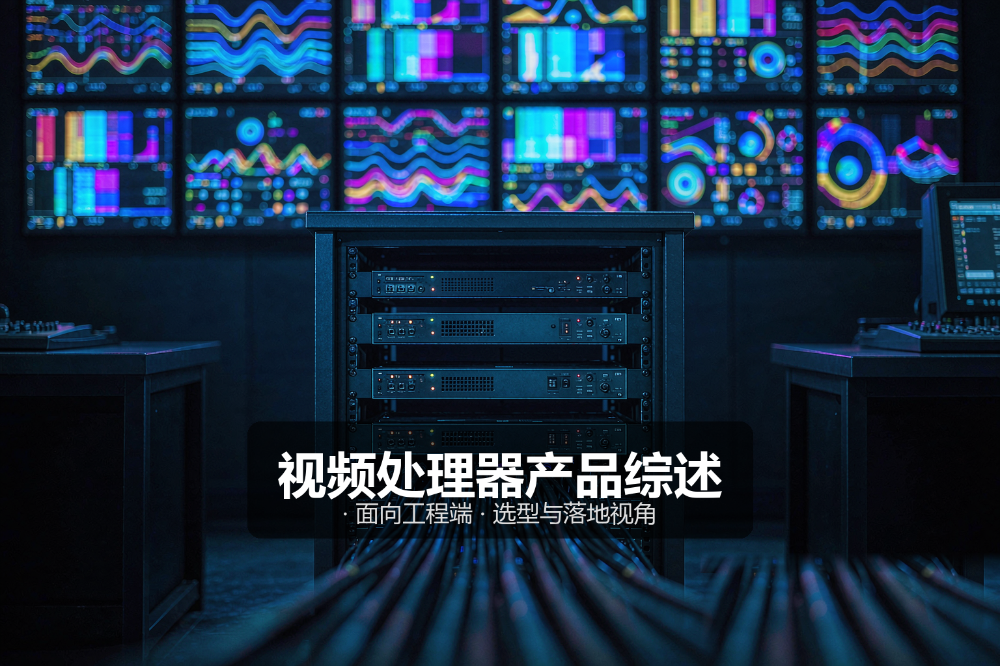
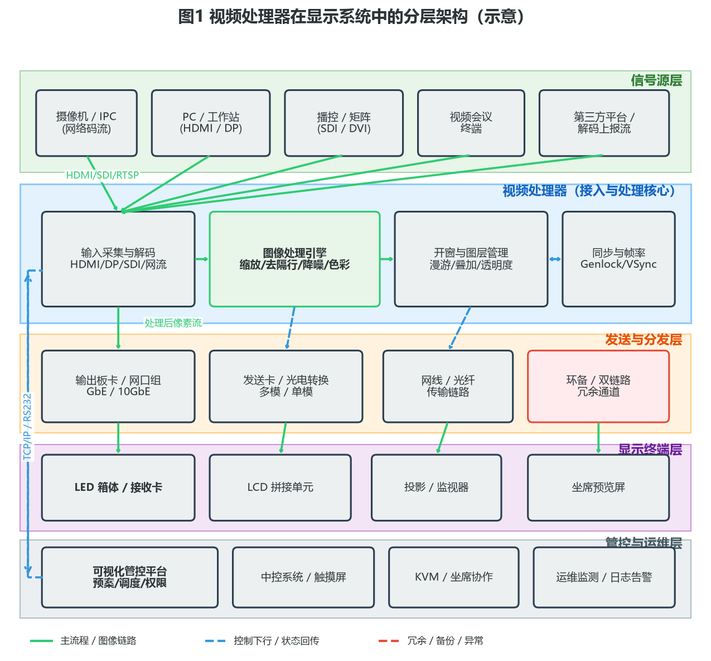
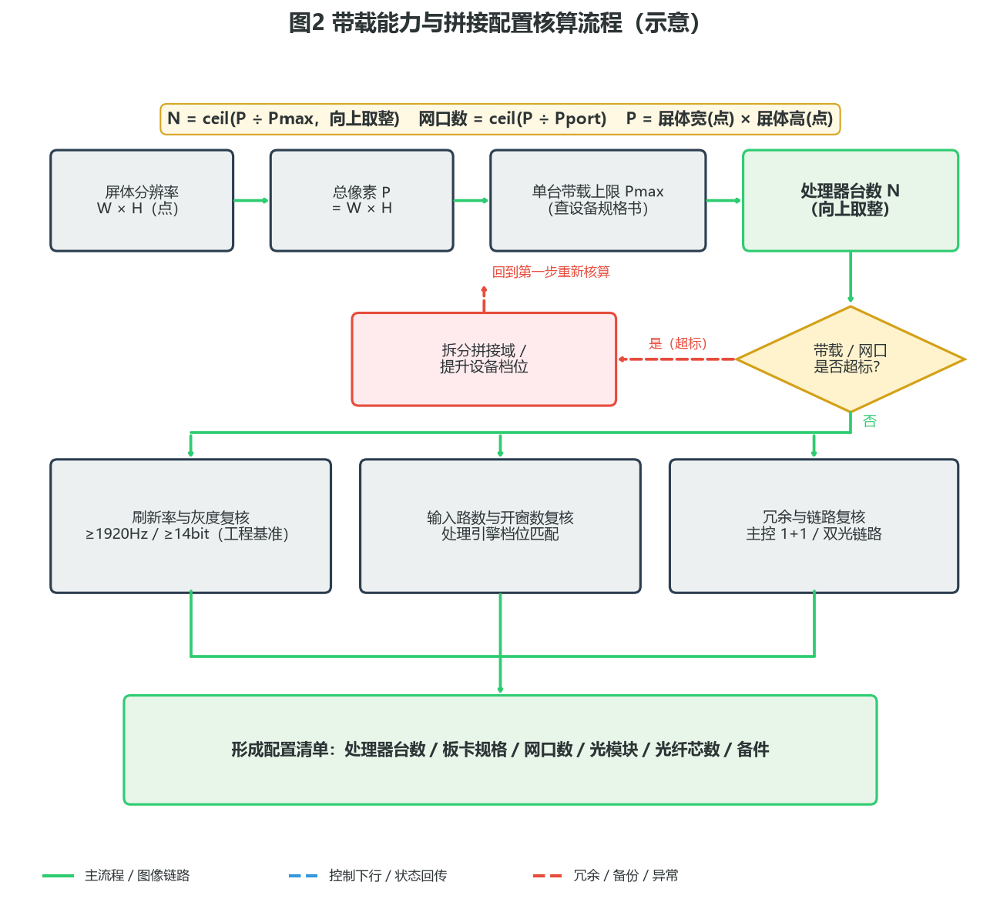
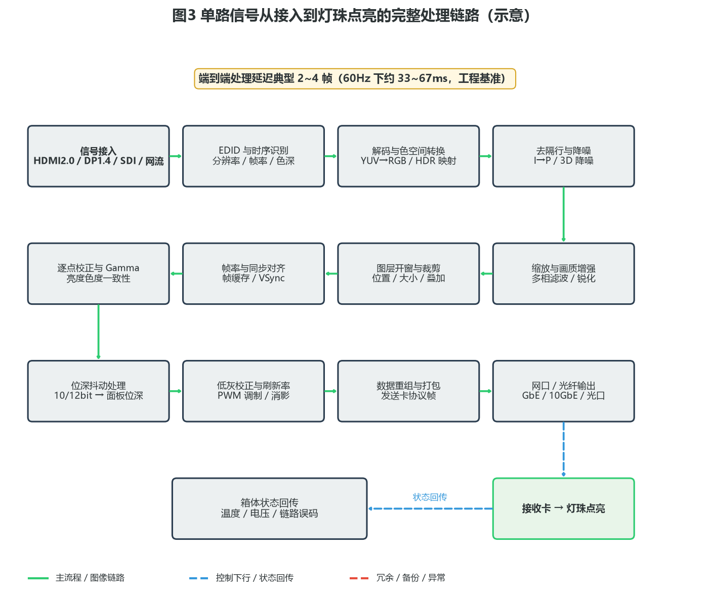
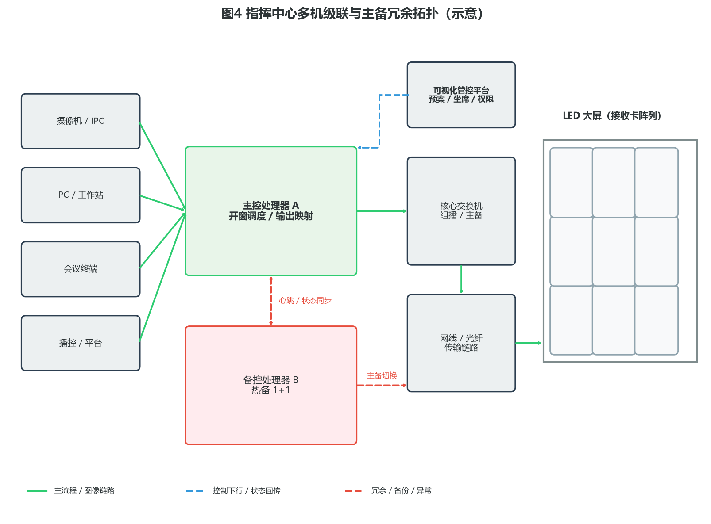

# 视频处理器产品综述

> 面向工程端 · 选型与落地视角



---

## 〇、一句话定位

**视频处理器是 LED 显示系统的信号处理中枢，负责多源接入、图像缩放、画面拼接与特效切换。** 它站在信号源与大屏之间，把来自摄像机、电脑、会议终端、播控平台的各种格式的「素材」，统一翻译成大屏能听懂的「语言」，再按调度意图决定哪路信号上屏、上在哪个位置、多大、叠几层。

工程端看视频处理器，核心不是数它有几个输入口，而是**先把屏体点数、输入路数、开窗与叠加需求、延迟与同步要求、冗余等级这五件事算清楚**，再倒推处理引擎档位、板卡配置、带载台数与链路方案。本文面向工程 / 实施端，覆盖产品设计方案、核心参数与选型、技术原理、产品功能与差异化、应用场景、落地案例与配置核算、市场背景与竞争格局、商业模式与趋势共八章。除明确标注来源的引用外，文中参数均按**行业通用基准 / 工程估算**给出，用于方案评估与教学，不作为某一具体型号的宣称指标。

---

## 一、产品设计方案

### 1.1 系统定位与整体架构

视频处理器交付的不是一台孤立的盒子，而是「信号源层 → 处理器层 → 发送与分发层 → 显示终端层 → 管控与运维层」的五层系统。信号源把画面交给处理器，处理器完成解码、缩放、开窗、校正与打包，再经发送卡或网口把数据流送到大屏箱体的接收卡，最终由灯珠把电信号变成光；管控平台则负责预案调度、权限管理与运行监测。



五层分工：

- **信号源层**：回答「素材从哪来」。摄像机与 IPC 的网络码流、PC 与工作站的 HDMI/DP 信号、播控机与视频矩阵的 SDI/DVI 信号、视频会议终端的编解码输出、第三方平台的上报流，都属于这一层。
- **视频处理器（接入与处理核心）**：回答「怎么变成大屏要的像素」。这一层包含输入采集与解码、图像处理引擎、开窗与图层管理、同步与帧率管理四个功能块，是整机的价值主体。
- **发送与分发层**：回答「怎么把像素送过去」。输出板卡与网口组负责协议打包，发送卡与光电转换模块把电信号变成光信号，网线与光纤构成物理链路，环备通道提供冗余。
- **显示终端层**：回答「怎么点亮」。LED 箱体内的接收卡接收协议帧、驱动灯珠；LCD 拼接单元、投影与监视器则接收标准视频信号；坐席预览屏用于操作员本地监看。
- **管控与运维层**：回答「谁来指挥、怎么维护」。可视化管控平台负责预案与调度，中控系统与触摸屏负责现场操作，KVM 与坐席协作解决多机人机交互，运维监测负责温度、电源、链路误码等健康度数据。

工程实施要点：

- **处理器是显示系统的单点核心**，一旦宕机整屏黑屏，因此关键场景必须配置 1+1 主备或至少预留快速更换备件。
- **带载能力决定台数与投资**：屏体总像素 ÷ 单台带载上限 = 处理器台数，这个算式必须在方案阶段算出来，不能等进场后「加一台凑合」。
- **输入路数与开窗数是两个独立维度**：20 路输入不等于能开 20 个窗口，也不等于能同时叠加 20 层，必须按「输入路数 / 单屏最大开窗数 / 最大叠加层数 / 最大漫游路数」四个指标分别核对。
- **延迟与同步是隐蔽指标**：会议与演播场景对端到端延迟敏感（通常要求 2~4 帧以内），多机级联场景对帧同步敏感（否则拼接缝两侧会撕裂）。

### 1.2 产品形态分类

按架构与定位，市场上的视频处理类设备大致分为六类。这张表是选型的起点：

| 类型 | 典型架构 | 主要能力（工程基准） | 带载规模（工程基准） | 适用场景 | 工程关注点 |
| --- | --- | --- | --- | --- | --- |
| **LED 专用视频处理器** | 一体机 / 插卡机箱，含输入板卡与输出网口 | 多源接入、缩放、开窗、逐点校正、预监 | 单机 130 万 ~ 2600 万像素 | 指挥中心、会议室、商场大屏 | 与大屏接收卡生态强绑定；输出协议兼容性要实测 |
| **纯视频处理器（无输出网口）** | 一体机，输出 DVI/HDMI | 缩放、切换、叠加，输出给发送卡 | 受后端发送卡限制 | 通用 LED 系统、存量改造 | 需搭配发送卡；多一级故障点与延迟 |
| **拼接处理器** | 插卡式机箱，输入/输出板卡分离 | 多路任意开窗、漫游、预案 | 按板卡槽位扩展，可达数千路输入 | 大型指挥中心、广电总控 | 背板带宽是瓶颈；扩容需停机插卡 |
| **多画面分割器** | 紧凑型一体机 | 把多路信号合成一路输出 | 通常 4~16 路输入合成 1 路 | 监看、预监、单一屏体 | 不做拼接，只做合成；常作预监设备 |
| **KVM 坐席 / 分布式节点** | 分布式编码器 + 交换机 | 信号在网络上任意调度、坐席接管 | 理论上无上限，受交换网限制 | 指挥中心、数据中心运维 | 依赖网络与组播设计；延迟略高于集中式 |
| **视频会议 / 播控一体机** | 软件+专用硬件 | 编解码、导播、录制 | 受编解码能力限制 | 会议室、演播室 | 偏业务功能，图像处理能力通常弱于专用处理器 |

选型上没有「越贵越好」，关键看屏体点数与调度复杂度：

- 一块 6m×3.4m 的 P1.5 小间距屏（约 4000×2258 点，折合约 900 万像素），一台中端插卡式处理器加两组输出网口就能覆盖，上大型拼接处理器是浪费；
- 一个需要 40 路信号随时调度、任意开窗、按预案一键切换的应急指挥中心，一体机必不够用，必须上插卡式或分布式架构；
- 一个只需要「电脑、会议、摄像机三路切换上屏」的会议室，多画面分割器或入门 LED 处理器就够了，开窗能力是冗余性能。

### 1.3 设计要点与工程约束

**带载能力与拼接域划分（第一约束）**。处理器的带载上限通常表述为「单机 N 万像素」或「单口带载 N 万像素」。工程上要区分三个层次：

- **单网口带载**：单根网线（GbE）可驱动的像素总数，常见工程基准为 65 万像素；超出后必须拆网口或改用 10GbE 光口。
- **单机带载**：机箱所有输出口可驱动的像素总和，受背板带宽与处理引擎吞吐限制。
- **拼接域**：逻辑上属于同一块大屏、由同一套同步时钟驱动的输出口集合。**一个拼接域内的输出口必须共享帧同步**，否则跨网口边界会出现撕裂或错帧。

折算方法见第三章 3.5 节与第六章核算示例。

**输入接口与信号格式匹配**。方案阶段必须逐路核对「源的分辨率 / 帧率 / 色深 / 接口类型」与「处理器输入口的支持范围」。工程上最容易出问题的三种情况：

1. **EDID 协商失败**：源设备按照错误的分辨率输出，导致画面被裁切或黑屏。解决方式是处理器提供 EDID 管理（自定义 EDID 表 / 强制输出指定时序）；
2. **长距离 HDMI 衰减**：HDMI 2.0 在普通铜缆上超过 10~15m 就容易丢包闪屏，超过该长度应改用光纤 HDMI 或转 SDI/网络方案；
3. **HDCP 保护内容**：笔记本播放受版权保护内容时，处理器若不支持 HDCP 透传会出现黑屏或花屏，这是现场最常见的「玄学故障」之一。

**同步与帧率一致性**。多机级联、或处理器输出同时驱动 LED 屏与其他显示设备时，必须处理帧同步：

- **Genlock / 外同步**：处理器接入外部参考信号（黑场或专用同步源），使输出帧与参考锁定；
- **帧锁相（Frame Lock）**：多台处理器之间通过同步信号或内部主从关系锁定，保证级联画面无撕裂；
- **帧率转换策略**：50Hz 源上 60Hz 屏时必须做帧率转换（FRC），策略（整帧重复 / 插帧 / 丢帧）直接影响运动画面的流畅度与抖动。

**冗余与可用性**。指挥中心、广电、机场等关键场景要按「不可中断」设计：

- **主控 1+1 热备**：主处理器故障时备机接管，切换时间通常要求 < 1 帧或无感切换；
- **双链路**：同一块屏由两个网口（或两条光纤）分别驱动不同箱体，单链路故障时只黑一部分而非全屏；
- **双电源**：机箱内双电源模块并联均流，单路市电或单模块故障不中断；
- **断电保护**：处理器与发送卡应纳入 UPS 回路，避免市电波动导致后端整体重启。

**散热与机房环境**。插卡式处理器功耗与发热量都不低，工程上要关注：机柜前后风道净空（一般前后各预留 ≥ 100mm）、机柜内温度（建议 ≤ 35 ℃，超温会触发降频或保护关机）、粉尘环境下需加装防尘网并纳入巡检，沿海或化工环境注意板卡镀层与防腐蚀处理。

**布线与预留**。处理器到屏体的链路是工程量的主要来源。以 10GbE 光口方案为例，每路输出对应一芯单模/多模光纤，加上备纤与环备通道，实际芯数通常是逻辑路数的 1.5~2 倍。机柜侧要预留：强电（按整机额定功率的 1.5 倍）、网络与控制线（TCP/IP、RS232/RS485）、以及级联同步线（若采用 Genlock 方案）。

---

## 二、核心参数与选型

> 工程端第一步不是挑型号，而是**先算屏体点数、再算输入与开窗需求、最后核同步与冗余**，再对照参数表挑设备。

### 2.1 选型四步法

```
① 屏体侧：屏体分辨率 W×H → 总像素 P → 单口/单机带载 → 处理器台数与网口数
② 信号侧：输入路数 × 接口类型 × 分辨率/帧率 → 输入板卡配置（含 10%~20% 预留）
③ 调度侧：最大开窗数 / 最大叠加层数 / 最大漫游路数 → 处理引擎档位
④ 可靠侧：是否需要主备、双链路、Genlock → 选插卡式还是分布式
```

**关键指标速查（工程基准，非型号宣称）**：

| 指标 | 入门级 | 中端 | 高端 / 插卡式 |
| --- | --- | --- | --- |
| 输入路数 | 2~4 路 | 4~12 路 | 16~144 路（按槽位扩展） |
| 单机带载 | 130 万 ~ 260 万像素 | 260 万 ~ 650 万像素 | 650 万 ~ 2600 万像素 |
| 单口带载（GbE 网口） | 65 万像素 | 65 万像素 | 65 万像素（10GbE 光口约为其 4~8 倍） |
| 最大开窗数 | 1~2 个 | 4~8 个 | 16~64 个（按引擎档位） |
| 最大叠加层数 | 1 层 | 2~4 层 | 4~16 层 |
| 处理位深 | 8bit | 10bit | 10~12bit 内部处理 |
| 输出帧率 | 50/60Hz | 50/60Hz | 50/60/120Hz |
| 端到端延迟 | 2~4 帧 | 2~4 帧 | 1~3 帧（视算法） |
| 冗余能力 | 无 | 双电源 | 主控 1+1、双链路、双电源 |

### 2.2 输入接口参数对照

| 接口 | 常见版本 | 带宽（工程基准） | 典型可承载 | 工程备注 |
| --- | --- | --- | --- | --- |
| HDMI | 1.4 / 2.0 / 2.1 | 10.2 / 18 / 48 Gbps | 1080p60 / 4K60 / 8K60 | 2.0 起支持 4K60；>15m 建议光纤 HDMI |
| DisplayPort | 1.2 / 1.4 / 2.0 | 21.6 / 32.4 / 80 Gbps | 4K60 / 4K120 / 8K60 | 支持菊花链与 MST，工程上谨慎使用 |
| DVI | Dual-Link | 9.9 Gbps | 2560×1600@60 | 存量设备多；不带音频 |
| SDI | 3G / 6G / 12G | 3 / 6 / 12 Gbps | 1080p60 / 4K30 / 4K60 | 广电标准，长距离同轴可达 100m 级 |
| VGA | 模拟 | — | 1920×1080@60 | 仅存量兼容；建议尽早替换 |
| 复合视频 CVBS | PAL/NTSC | — | 720×576 | 老旧监控兼容 |
| 网络码流 | RTSP / RTMP / GB/T 28181 | 受码率限制 | 1080p ~ 4K（H.264/H.265） | 需确认解码路数与并发能力 |

网络流输入是近年增量最大的方向，但有两个易被忽略的约束：**解码路数与分辨率强相关**（宣传「支持 16 路 1080p」的机型，在接 4K 流时可能只能解 4 路）；**解码延迟通常高于基带输入**（H.265 解码加抖动缓冲，单跳常增加 1~2 帧）。

### 2.3 带载与网口核算

**核心公式（工程基准）**：

```
屏体总像素       P = W(点) × H(点)
处理器台数       N = ceil( P ÷ Pmax )        Pmax = 单机带载上限
输出网口数       M = ceil( P ÷ Pport )       Pport = 单口带载上限
输入板卡路数     K = ceil( 实际输入路数 × 1.2 )   预留 20%
```

**示例**：一块 P1.25 小间距屏，屏体尺寸 9.6m × 5.4m。
- 单箱体 600×337.5mm，分辨率 480×270 点；
- 横向箱体数 = 9600 ÷ 600 = 16，纵向 = 5400 ÷ 337.5 = 16；
- 屏体分辨率 = 16×480 × 16×270 = **7680 × 4320 点**，总像素 P ≈ **3318 万像素**；
- 按单机带载 650 万像素估算：N = ceil(3318 ÷ 650) ≈ **6 台**；
- 按单 GbE 网口 65 万像素估算：M = ceil(3318 ÷ 65) ≈ **52 个网口**——显然不现实，实际工程会改用 10GbE 光口方案，网口数降至 **7~13 路光口**（按单光口约 260 万~520 万像素估算）。

这个例子说明一个工程常识：**大屏方案的分水岭在「用不用光口」**。当屏体总像素超过约 500 万时，GbE 网口的网线数量会迅速失控，此时应直接进入 10GbE 光口方案，把链路数量压到可维护的规模。



### 2.4 参数陷阱与踩坑点

| 陷阱 | 表象 | 根因 | 应对话术 / 做法 |
| --- | --- | --- | --- |
| **带载口径不统一** | 厂家说「带载 260 万」，现场却只能带 130 万 | 宣传值按最有利条件（低刷新率、8bit、单色）标定 | 要求在书面方案中确认「刷新率 + 位深 + 灰度」条件下的实际带载 |
| **开窗数 ≠ 输入路数** | 20 路输入只能开 8 窗 | 开窗数受引擎图层资源限制 | 按「最大同时开窗数」而非输入路数选型 |
| **4K 输入降为 1080p** | 源是 4K，上屏后画面模糊 | 输入口或引擎按 1080p 处理 | 逐级核对「输入口带宽 → 引擎吞吐 → 输出带宽」三段均 ≥ 4K |
| **HDCP 黑屏** | 接笔记本播放视频时黑屏 | 处理器不支持 HDCP 透传 | 明确要求 HDCP 1.4/2.2 透传能力，并在现场用受保护片源实测 |
| **刷新率与拍摄冲突** | 用手机/摄像机拍屏出现横向条纹 | 刷新率过低（< 1920Hz） | 有拍摄需求的场景要求刷新率 ≥ 1920Hz，演播场景 ≥ 3840Hz |
| **多机不同步撕裂** | 级联大屏在拼接缝出现错帧 | 未做帧同步 | 采用 Genlock 或主从帧锁相，联调阶段用高速摄像机验证 |
| **延迟超预期** | 会议场景唇音不同步 | 链路含解码 + 缩放 + FRC 多级缓存 | 要求端到端延迟 ≤ 4 帧，并在实测阶段用同步测试片源验证 |
| **散热降频** | 夏季高温时偶发花屏 | 机柜风道不良触发过热保护 | 机柜前后预留净空，机柜内温度控制在 35 ℃ 以下 |

---

## 三、技术原理

### 3.1 信号链路总览

单路信号从接入到点亮，要经过 12 个处理环节。理解这条链路，就能定位 90% 的现场画质问题。



链路分三段理解：

- **接入段（环节 1~4）**：解决「把信号正确读进来」。信号接入、EDID 与时序识别、解码与色空间转换、去隔行与降噪。
- **处理段（环节 5~8）**：解决「把画面变对」。缩放与画质增强、图层开窗与裁剪、帧率与同步对齐、逐点校正与 Gamma。
- **输出段（环节 9~12）**：解决「把像素送出去」。位深抖动、低灰校正与刷新率调制、数据重组与打包、网口/光纤输出。

整链典型端到端延迟为 **2~4 帧**（60Hz 下约 33~67ms，工程基准）。延迟主要来自三处缓存：解码缓存、缩放滤波器行缓存、帧率转换的帧缓存。

### 3.2 接入段：接口、EDID 与时序

**接口与通道编码**。基带接口（HDMI/DP/DVI/SDI）承载的是 TMDS 或类似的高速串行差分信号，接收端要做均衡、时钟恢复（CDR）与通道对齐。这一层出问题通常表现为「闪屏、丢帧、雪花点」，与信号完整性直接相关——线材质量、接口镀金层、插拔次数都会影响。

**EDID 协商机制**。EDID 是显示器写给源设备的「能力清单」，源设备读取后选择双方都支持的最佳时序。处理器的难点在于：它是中间设备，既要向上冒充「显示器」问源设备要信号，又要向下输出自己想要的时序。工程上必须支持三种 EDID 策略：

1. **透传**：直接读取下游屏体的 EDID 上报给源；
2. **自定义**：由工程人员写入固定 EDID（例如强制 3840×2160@60）；
3. **学习/固化**：现场采集一次后固化保存。

当源设备「不听话」时（比如老笔记本固执输出 1366×768），自定义 EDID 是唯一解。

**色空间与位深**。信号进入后要先判断色空间（RGB / YCbCr 4:4:4 / 4:2:2 / 4:2:0）与量化范围（Limited 16~235 / Full 0~255），再做转换。**工程上常见的「画面发灰」或「黑色不纯」，十之八九是量化范围判断错误**——Limited 范围的信号被当 Full 处理，黑电平会被抬到 16/255 左右的灰。

### 3.3 处理段：缩放、去隔行与降噪

**缩放算法与其代价**。缩放是所有处理器都要做的事，算法档次直接决定画质与成本：

| 算法 | 原理 | 画质 | 资源开销 | 适用 |
| --- | --- | --- | --- | --- |
| 最近邻 | 直接取最近像素 | 差，边缘锯齿明显 | 极低 | 仅用于点对点直通 |
| 双线性 | 2×2 邻域加权 | 一般，偏软 | 低 | 入门机型 |
| 双三次 | 4×4 邻域 | 较好 | 中 | 中端机型 |
| 多相 / Lanczos | 更大卷积核 + 相位补偿 | 好，锐度与伪影平衡 | 高 | 高端机型 |
| AI 超分 | 神经网络推断 | 最好（但可能引入纹理失真） | 极高 | 特殊场景，需评估延迟 |

选型要点：**点对点映射（源分辨率 = 屏体分辨率）时不应做任何缩放**，此时应支持「直通模式」，既省资源又保真。如果屏体分辨率与常用源分辨率存在整数倍关系（如 2 倍），优先用整数倍缩放，可避免摩尔纹。

**去隔行（De-interlacing）**。广播源（1080i、576i）是隔行扫描，处理不当会出现「梳齿」或「拉丝」。三种策略：

- **Bob**：单场插值成整帧，实现简单，垂直分辨率减半，静态画面会上下抖动；
- **Weave**：两场直接拼合，静态画面清晰但运动画面有梳齿；
- **运动自适应 / 运动补偿**：按像素判断运动状态分别处理，效果最好、代价最高。**广电与演播场景必须选运动自适应或以上**。

**降噪与画质增强**。3D 降噪（时域 + 空域联合）可有效压制低照度监控画面的噪点，但会引入轻微拖影；锐化的关键在于「适度」——过锐会产生白边与振铃。工程验收时建议用「运动中的细密纹理」（如人群、草地）作为测试素材，兼顾降噪与锐化的平衡。

### 3.4 画质段：色彩、HDR 与逐点校正

**色彩空间转换与 HDR 映射**。当源是 HDR（PQ 或 HLG 曲线、Rec.2020 色域）而屏体是标准 SDR 时，必须做色调映射（Tone Mapping）。映射策略直接决定观感：

- **硬裁剪**：简单但高光全白，细节丢失严重；
- **全局曲线压缩**：整幅画面用同一条曲线，实现简单，暗部会发灰；
- **动态色调映射**：按场景（甚至按帧）计算映射曲线，效果最好，需要实时统计与较高算力。

工程上要明确要求：「HDR 源接入时，高光不过曝、暗部不糊成一团」，并在现场用标准 HDR 测试片源验证。

**Gamma 与低灰表现**。LED 屏的 Gamma 通常按 2.2~2.8 标定（不同厂商、不同使用环境有差异）。Gamma 曲线设置不当，会导致暗部层次丢失或画面整体发灰。**测试方法**：播放标准灰阶渐变图，观察暗部（1%~10% 灰阶）是否出现明显断层（banding）。

**逐点校正（Point-by-Point Correction）**。这是 LED 显示特有的关键环节。同一批次灯珠的亮度与色度存在离散性，整屏拼在一起会出现明显的「马赛克块」——即箱体之间亮度不一致形成的网格感。逐点校正的做法是：

1. 用校准相机逐箱体拍摄，测量每个像素的亮度与色坐标；
2. 生成校正系数矩阵（亮度系数 + 三色系数）；
3. 把系数写入接收卡，由驱动 IC 在点亮时实时相乘。

校正分**亮度校正**与**色度校正**，后者成本更高但能统一整屏色温。工程上要关注：校正是在出厂完成还是现场完成（现场完成才能覆盖安装后的环境差异）、校正文件是否随备件箱体一同提供（更换箱体后必须导入对应校正文件，否则立即出现「补丁块」）。

### 3.5 输出段：同步、刷新率与位深

**帧同步与 Genlock**。多台处理器、或多个输出口共同驱动一块大屏时，必须保证所有输出端在同一时刻点亮同一帧。实现机制有三种：

- **内部主从**：一台设为主机，其余跟随主机时钟，实现简单，适用于同品牌同型号级联；
- **Genlock 外同步**：所有设备接入同一路参考信号（黑场同步或专用时钟），跨品牌可用，是广电与大型指挥中心的标准做法；
- **网络 PTP（IEEE 1588）**：在分布式架构中通过网络授时实现微秒级同步，是分布式节点方案的主流。

**刷新率与拍摄兼容**。LED 屏的刷新率不是指「每秒换多少帧画面」（那是帧率），而是指「灯珠每秒被驱动点亮多少次」（PWM 频率）。刷新率低于摄像机快门频率时，拍摄画面会出现横向黑条纹（扫描线）或滚动条。工程基准：

| 刷新率 | 视觉表现 | 适用场景 |
| --- | --- | --- |
| 1920Hz | 肉眼无感，手机拍摄基本可用 | 一般室内大屏、会议室 |
| 2880Hz | 拍摄稳定 | 需要拍照/直播的展示场景 |
| ≥ 3840Hz | 专业摄像机拍摄无条纹 | 广电演播、赛事直播、高规格舞台 |

**位深与抖动（Dithering）**。处理引擎内部常用 10~12bit 运算，而面板/驱动 IC 常为 8bit 或更低。位深压缩会产生「断层」（渐变色带）。解决办法是**时域抖动**：在相邻帧之间让像素在相邻两个灰阶间交替，人眼积分后得到中间值。代价是低灰区域可能出现轻微闪烁，且高刷新率下抖动效果更好——这也是高刷新率的第二个价值。

**数据重组与打包**。处理完的像素不能直接送出去，要按发送卡协议重新组织成数据帧（含行场同步信息、包序号、CRC 校验），再通过 GbE 或光口下发。接收卡解包后按坐标把数据分发到对应箱体与灯珠驱动。**这一层的链路质量直接决定画面是否出现「局部雪花」或「箱体错位」**——工程上出现单箱体异常时，优先排查该链路的网线/光纤与水晶头压接质量。

---

## 四、产品功能与差异化

### 4.1 核心功能清单

以工程视角，视频处理器的功能可归为六组：

| 功能组 | 具体能力 | 工程价值 |
| --- | --- | --- |
| **多源接入** | 基带（HDMI/DP/SDI/DVI）+ 网络流（RTSP/GB28181）混合接入 | 兼容存量与新建设备，减少转换器 |
| **画面处理** | 缩放、去隔行、降噪、锐化、色彩空间转换、HDR 映射 | 保证画质一致性与观感 |
| **拼接与开窗** | 任意开窗、漫游、缩放、画中画、叠加、透明度、裁剪、边框补偿 | 支撑指挥调度的核心能力 |
| **校正与画质** | 逐点亮度/色度校正、Gamma、色温、白平衡、低灰校正 | 消除箱体色差，保证整屏一致性 |
| **同步与输出** | Genlock、帧锁相、帧率转换、高刷新率输出、位深抖动 | 消除撕裂与拍摄条纹 |
| **管控与运维** | 预案管理、预监回显、权限分级、温度/电源/链路监测 | 降低运维成本，提升可用性 |

### 4.2 开窗、预案与预监

**开窗与图层**。开窗的本质是为每一路信号分配一块「画布区域」与一个「图层序号」。图层序号决定遮挡关系（后开的在上或按序号排序），透明度决定叠加观感。工程上要核实三个数：单屏最大同时开窗数、最大叠加层数、单窗口最大缩放倍数。**注意「最大开窗数」常与「输入分辨率」联动**——开 4K 窗口比开 1080p 窗口更耗图层资源。

**预案（Preset）**。预案是把「哪路信号、在哪个位置、多大、叠几层」保存成一条可一键调用的配置。指挥中心通常需要 10~30 套预案（日常值守、重大活动、应急指挥、会议模式等）。选型要关注：预案数量上限、调用切换时间（无缝或淡入淡出）、是否支持定时轮巡、是否支持预案嵌套。

**预监与回显（Preview）**。预监让操作员在切换前先在本地小屏确认画面内容，避免「误切黑屏上大屏」的直播事故。实现方式分两种：处理器自带预监输出口（成本高、延迟低）、通过网络回显到软件客户端（成本低、延迟略高）。**广电与应急场景建议硬预监**。

### 4.3 冗余与可靠性设计

| 冗余层级 | 实现方式 | 切换时间（工程基准） | 适用 |
| --- | --- | --- | --- |
| 电源冗余 | 双电源模块均流 | 无中断 | 所有关键场景 |
| 主控冗余 | 主备处理器 1+1 热备 | < 1 帧 ~ 数秒 | 指挥中心、广电 |
| 链路冗余 | 双网线/双光纤驱动不同箱体 | 局部黑屏，无需切换 | 大屏普遍适用 |
| 环网备份 | 箱体接收卡环网连接，单点断开自动绕行 | 无中断 | 大型户外屏、高可用场景 |
| 输入冗余 | 关键信号双路上送（不同接口/不同路径） | 手动或自动切换 | 广电、应急 |



上图是一个典型的多机级联 + 主备 1+1 拓扑：信号源汇聚到主控处理器 A，经核心交换机与光链路驱动 LED 大屏；备控处理器 B 通过心跳与状态同步保持热备，主控故障时接管输出；可视化管控平台作为调度入口，挂在同一网络之上。

**可靠性设计的关键判断**：冗余不是越多越好，而是「按业务中断的代价」配置。一块商场广告屏停机 2 小时的损失，和一块应急指挥大屏停机 2 分钟的代价完全不同，前者配双电源足矣，后者必须主备 + 双链路 + 环网。

### 4.4 管控生态与差异化

处理器本身的图像处理能力正在趋同，差异化越来越体现在**生态与开放性**上：

- **与屏体生态的兼容性**：输出协议是否兼容主流接收卡（不同厂商的发送卡协议存在私有扩展），决定现场能否混用；
- **中控对接能力**：是否提供 TCP/IP 指令集、RS232/RS485 控制口、以及主流中控（如 Crestron、AMX、国内中控品牌）的驱动库；
- **平台对接能力**：是否支持 GB/T 28181 接入、是否提供开放 API/SDK 供第三方平台调用；
- **分布式与集中式的可演进性**：是否支持从集中式平滑演进到分布式坐席架构，避免未来推倒重来；
- **运维友好度**：是否支持远程升级、配置备份/恢复、日志导出、故障自诊断。

---

## 五、应用场景

### 5.1 应急指挥中心

**痛点**：需要同时接入数十路视频会议、监控、业务系统信号，按事件类型频繁切换布局，任何中断都不可接受。

**方案**：插卡式拼接处理器（或分布式节点）+ 主备 1+1 + 双链路 + 光口输出。按「日常值守 / 值班调度 / 应急指挥 / 领导视察」四套预案组配置，每套含 5~10 条预案；配置硬预监输出，操作员在本地确认后再上大屏。

**价值**：信号调度从「人工插拔 + 手工切换」变为「一键预案」，事件响应时间从分钟级压缩到秒级；主备架构把单点故障风险降到可接受区间。

### 5.2 会议室与报告厅

**痛点**：接入设备杂（笔记本、视频会议终端、无线投屏、摄像机），非专业人员操作，切换要求快且不出错。

**方案**：入门或中端 LED 视频处理器（4~8 路输入，含无线投屏与网络流接入）+ 中控触摸屏。EDID 学习固化，避免不同笔记本分辨率协商失败；配置「会议 / 演示 / 视频会议 / 播放」四套预案，一键调用。

**价值**：把「找线、插线、切信号」这些事交给触摸屏，会议开场时间缩短；EDID 固化把「投不上屏」这个最高频故障从根上消除。

### 5.3 商业显示与展厅

**痛点**：需要创意异形拼接、多窗口轮播、与内容播控系统联动，同时要求拍摄效果好（便于二次传播）。

**方案**：支持任意开窗与创意拼接的高端处理器（刷新率 ≥ 2880Hz 以解决拍摄条纹）+ 播控系统联动 + 定时预案轮巡。

**价值**：创意布局成为营销亮点；高刷新率让观众随手拍摄的照片与视频没有条纹，等于免费二次传播。

### 5.4 广电演播与赛事直播

**痛点**：对延迟、同步、画质要求极高，需与切换台、导播系统、监看系统协同。

**方案**：Genlock 外同步 + SDI 输入 + 运动自适应去隔行 + 刷新率 ≥ 3840Hz + 硬预监；所有设备统一接入参考同步源，保证摄像机拍摄时无行场不同步。

**价值**：画面可用于正式播出；多机同步保证多屏、多机位画面一致。

### 5.5 体育场馆与舞台

**痛点**：超大屏体（数千平米）、超长链路、户外环境、需要多机级联且同步。

**方案**：多台处理器级联 + 帧锁相 + 10GbE 光口 + 环网备份接收卡 + IP65 户外箱体。按分区（东南西北四面）划分拼接域，每域独立同步，域间通过 Genlock 统一。

**价值**：超大屏体在可维护的链路规模下落地；环网备份把单点断线的影响限制在极小范围。

---

## 六、实际案例与设计方案

> 以下案例为**典型工程方案推演**，用于演示配置核算方法。具体项目需按现场条件与设备规格书复核。

### 6.1 案例 A：某市应急指挥中心大屏（P1.25 小间距）

**需求**：
- 屏体净显示尺寸 9.6m × 5.4m，P1.25 小间距 LED；
- 接入信号：监控 IPC 32 路（GB/T 28181）、视频会议 2 路、业务系统 PC 6 路、播控 1 路，合计 41 路；
- 调度要求：最大同时开窗 12 个，最多叠加 3 层，支持预案 20 套；
- 可靠性：主备 1+1，双链路，双电源；
- 拍摄要求：领导视察需拍照，刷新率 ≥ 2880Hz。

**方案设计**：

1. **屏体核算**
   - 箱体 600mm × 337.5mm，分辨率 480 × 270 点；
   - 横向 9600 ÷ 600 = 16 箱，纵向 5400 ÷ 337.5 = 16 箱，共 256 箱；
   - 屏体分辨率 7680 × 4320 = **3318 万像素**（约 4K×2 的规模）。

2. **带载与链路核算**
   - 单机带载按 650 万像素（工程基准）→ 3318 ÷ 650 ≈ 5.1，向上取整 **6 台**；
   - 若用 GbE 网口（65 万像素/口）→ 52 口，网线数量不可接受；
   - 改用 10GbE 光口（按 260 万像素/口保守估算）→ 3318 ÷ 260 ≈ 12.8，取 **13 路光口**；
   - 结合主备 1+1，实际配置 **主处理器 6 台 + 备处理器 6 台 ÷ 或按「主控全载、备控全载」的热备策略合并为 12 台**，具体依厂商热备实现方式确定。

3. **输入板卡配置**
   - 监控流 32 路走网络解码板（按 1080p 估算，需 32 路解码能力 + 20% 预留 = 39 路，取 40 路）；
   - 会议 2 路 + PC 6 路 + 播控 1 路 = 9 路基带输入，加 20% 预留 → **12 路 HDMI/SDI 输入板**；
   - 合计输入板卡按 12 路基带 + 40 路网络解码配置。

4. **同步与校正**
   - 全屏划为 2 个拼接域（左右各 3840 × 4320），域内帧同步，域间 Genlock 锁定；
   - 采用外部同步源（专用黑场发生器）作为参考；
   - 现场逐点校正（亮度 + 色度），校正文件备份并随备件箱体归档；
   - 刷新率设为 2880Hz，满足拍照需求。

5. **验收测试（关键项）**
   - 灰阶测试图：暗部 1%~10% 无断层；
   - 运动测试片：去隔行无梳齿、降噪无拖影；
   - 同步测试：高速摄像机拍摄拼接缝，无撕裂；
   - 延迟测试：同步测试片源，端到端 ≤ 4 帧；
   - 故障演练：拔主处理器电源，备机接管时间记录；断开单条光纤，观察影响范围。

**交付价值**：41 路信号从「人工切换」变为「预案一键调度」；主备 + 双链路把计划外停屏风险降到极低；现场校正保证 256 个箱体整屏色温一致，避免「网格感」。

### 6.2 案例 B：企业总部智能会议室（P1.5 小间距）

**需求**：
- 屏体 4.8m × 2.7m，P1.5；
- 接入：笔记本 HDMI 2 路、无线投屏 1 路、视频会议终端 1 路、摄像机 1 路，共 5 路；
- 要求：一键切换、EDID 稳定、支持视频会议双流（人物 + 内容并排显示）。

**方案设计**：

1. **屏体核算**：箱体 480mm × 270mm，分辨率 320 × 180 点 → 横向 10 箱、纵向 10 箱 → 屏体 3200 × 1800 = **576 万像素**；
2. **设备选型**：中端一体式 LED 视频处理器，4 路窗口、2 层叠加、单机带载 ≥ 650 万像素即可覆盖；输出用 GbE 网口，576 ÷ 65 ≈ 8.9 → **9 个网口**；
3. **功能配置**：EDID 学习固化（解决不同笔记本投屏失败）；「会议 / 演示 / 视频会议 / 播放」四套预案；视频会议场景采用「人物 + 内容」左右双窗布局；
4. **验收测试**：分别用 3 台不同品牌笔记本测试 EDID 协商；测试双流布局的窗口边界是否对齐。

**交付价值**：会议开场无需专业人员到场，触摸屏一键切换；EDID 固化消除了「投不上屏」这一最高频报障。

### 6.3 案例 C：演播室背景大屏（P1.9，广电场景）

**需求**：
- 屏体 6.4m × 3.6m，P1.9；
- 需与导播切换台协同，摄像机拍摄无扫描线；
- 延迟要求 ≤ 3 帧。

**方案设计**：

1. **屏体核算**：箱体 640mm × 360mm，分辨率 336 × 189 点 → 10 × 10 箱 → 3360 × 1890 = **635 万像素**；
2. **设备选型**：高端处理器，SDI 输入（3G-SDI × 4），运动自适应去隔行，刷新率 ≥ 3840Hz，端到端延迟 ≤ 3 帧；
3. **同步方案**：Genlock 接入演播室统一参考（黑场同步），确保与摄像机、切换台同源锁定；
4. **验收测试**：用演播室主摄像机（快门 1/1000s）拍摄屏体，检查有无扫描线条纹；用标准唇音同步测试片源测延迟。

**交付价值**：屏体画面可直接入镜，无需在后期做去条纹处理；画面与摄像机同步，抠像与背景融合无错帧。

---

## 七、市场背景与竞争格局

### 7.1 需求侧：从「能显示」到「能调度」

视频处理器的需求增长由三条曲线驱动：

1. **屏体点数的持续膨胀**。小间距 LED 的像素密度从 P2.5 一路推进到 P0.9 以下，同样物理面积的屏体像素数年增 3~7 倍，直接推高对带载能力与链路带宽的需求。
2. **信号源数量的爆炸**。一个现代指挥中心同时在线 40~200 路信号已成常态，源的数量增长快于屏体面积增长，使「多源接入 + 任意调度」成为刚需。
3. **画质与拍摄要求提升**。4K/HDR 内容普及、社交传播带来的「拍屏需求」，把刷新率、色调映射、低灰表现从「高端选项」变成「验收项」。

### 7.2 竞争格局：三个层面的玩家

| 层面 | 典型玩家类型 | 核心优势 | 主要短板 |
| --- | --- | --- | --- |
| **屏体厂商配套** | LED 屏厂自有处理器品牌 | 与自家接收卡深度适配、整套交付、售后统一 | 开放性弱，跨品牌混用受限 |
| **专业处理器厂商** | 专注视频处理的独立品牌 | 处理引擎强、开窗与校正能力突出、生态开放 | 与屏体适配需现场调试 |
| **分布式 / 网络化厂商** | 分布式节点、KVM 坐席品牌 | 布线极简、扩展性强、坐席体验好 | 依赖网络设计，延迟略高 |

国内市场的显著特征是**「屏体厂商配套」占据中低端主流**，而高端指挥中心与广电市场由专业处理器与分布式方案分食。工程端选型时的实际考量，往往不是「谁的处理能力最强」，而是「谁能把 256 个箱体在现场调到色温一致、并且三年后换备件还能买到同样的板卡」。

### 7.3 采购与招标中的常见变量

- **带载口径**：招标文件应明确「在 X Hz 刷新率、Y bit 位深条件下的单机带载像素数」，避免验收争议；
- **同步要求**：多机级联项目应写明同步方式（Genlock / 帧锁相 / PTP）与同步误差指标；
- **校正责任**：明确逐点校正由哪一方完成、是否含在合同内、校正文件是否交付；
- **生态开放**：明确是否提供开放 API、是否支持主流中控对接，避免后期被单一厂商锁定；
- **备件与年限**：明确备件供应年限（一般要求 5 年以上）与关键板卡的可替换性。

---

## 八、商业模式与趋势

### 8.1 商业模式：硬件为入口，服务为利润

视频处理器品类的商业模式正在从「卖盒子」向「卖能力 + 卖服务」迁移：

| 模式 | 收入构成 | 特点 |
| --- | --- | --- |
| 硬件销售 | 处理器 + 板卡 + 光模块 | 传统模式，价格竞争激烈 |
| 硬件 + 校正服务 | 硬件 + 现场逐点校正 | 校正服务毛利率高，且形成技术壁垒 |
| 硬件 + 平台软件 | 硬件 + 可视化管控平台 License | 平台绑定客户，续费与扩容稳定 |
| 整体解决方案 | 处理器 + 屏体 + 播控 + 运维 | 客单价高，交付周期长，毛利结构最优 |
| 分布式订阅 | 节点硬件 + 软件订阅 | 面向运维型客户，收入更平滑 |

### 8.2 技术趋势

1. **光口取代网线成为默认选项**。当屏体总像素超过约 500 万，GbE 网线的数量会失控，10GbE 光口方案从「高端配置」变为「标准配置」，推动光模块与光纤预端接工艺在项目中的标准化。
2. **分布式架构下探**。原本用于指挥中心的分布式节点架构，正在向会议室、展厅下探——布线极简、扩展灵活、坐席体验好，代价是需要更专业的网络设计（组播、QoS、带宽规划）。
3. **处理能力边界外移**。部分原本由处理器承担的图像处理（缩放、色彩管理、HDR 映射），正在被源端（PC/服务器）与屏端（接收卡）分担。处理器的价值向「调度」「同步」「校正」「可靠性」四件事集中。
4. **AI 与画质处理的结合**。AI 超分辨率、AI 降噪、动态色调映射开始进入高端机型，但需权衡延迟与资源开销——在指挥与广电场景，延迟往往比画质峰值更重要。
5. **标准化与开放化**。GB/T 28181 等标准让网络流接入趋于统一；开放 API 与中控驱动标准化，正在把「封闭生态」这一行业痼疾逐步推开。
6. **能耗与低碳**。大屏系统整体功耗中，处理器占比不高，但处理器通过低灰校正、动态亮度调节、休眠策略，可显著降低屏体侧功耗——节能能力正成为招标加分项。

### 8.3 工程端的长期判断

对工程端而言，判断一台视频处理器值不值得选，可以回到三个问题：

- **带载算得清吗**？按实际刷新率与位深算出的带载，能否覆盖屏体点数并留出扩容余量。
- **调度扛得住吗**？输入路数、开窗数、叠加层数三个指标是否都有 30% 以上余量。
- **三年后还活着吗**？备件供应、板卡兼容、软件升级、生态开放，决定这套系统是全生命周期资产还是一次性消耗品。

---

## 附录 A：配置核算清单（可直接用于方案评审）

```
【屏体侧】
□ 屏体净显示尺寸（宽 × 高，mm）
□ 箱体尺寸与分辨率（宽 × 高，点）
□ 箱体数量（横 × 纵）与总数
□ 屏体分辨率 W × H（点）与总像素 P
□ 刷新率要求（是否需拍摄：≥1920 / ≥2880 / ≥3840Hz）
□ 位深与灰度要求

【处理侧】
□ 输入路数与接口类型清单（含分辨率、帧率、色深）
□ 输入板卡路数（含 20% 预留）
□ 最大同时开窗数 / 最大叠加层数 / 最大漫游路数
□ 单机带载 Pmax（注明刷新率与位深条件）
□ 处理器台数 N = ceil(P ÷ Pmax)
□ 输出网口数 M = ceil(P ÷ Pport)（注明 GbE 或 10GbE 光口）

【同步侧】
□ 拼接域划分方式
□ 同步机制（Genlock / 帧锁相 / PTP）
□ 参考同步源与布线
□ 帧率转换策略（50→60Hz 等）

【可靠侧】
□ 主控冗余方式与切换时间指标
□ 链路冗余（双链路 / 环网）
□ 电源冗余
□ 是否纳入 UPS 回路

【交付侧】
□ 逐点校正责任方与验收方式
□ 校正文件交付与归档
□ 备件清单与供应年限
□ 验收测试项（灰阶 / 运动 / 同步 / 延迟 / 故障演练）
```

## 附录 B：核心术语表

| 术语 | 全称 / 含义 | 工程意义 |
| --- | --- | --- |
| EDID | Extended Display Identification Data | 设备间协商分辨率的「能力清单」 |
| HDCP | High-bandwidth Digital Content Protection | 版权保护协议，不透传会黑屏 |
| Genlock | Generator Locking | 外同步锁相，多设备统一帧时序 |
| FRC | Frame Rate Conversion | 帧率转换，50→60Hz 等场景 |
| De-interlacing | 去隔行 | 把隔行信号还原为逐行 |
| 3D LUT | 3D Look-Up Table | 三维色彩查找表，用于色彩管理 |
| Tone Mapping | 色调映射 | HDR → SDR 的亮度映射 |
| Dithering | 抖动 | 用时间平均补偿低位深，抑制断层 |
| PWM | Pulse Width Modulation | 脉宽调制，决定 LED 刷新率与灰度 |
| PTP | Precision Time Protocol（IEEE 1588） | 网络精密授时，分布式同步基础 |
| 拼接域 | Splicing Domain | 共享同步时钟的输出口逻辑集合 |
| 逐点校正 | Point-by-Point Correction | 逐像素亮度/色度校正，消除色差 |
| 预监 | Preview | 切换前本地确认画面，防止误切 |

## 附录 C：相关标准与资料（工程引用索引）

> 以下为工程设计中常引用的标准，具体版本以现行有效版本为准，条款适用性需按项目类型确认。

| 标准号 | 名称 | 主要用途 |
| --- | --- | --- |
| SJ/T 11141 | LED 显示屏通用规范 | LED 屏体与系统的通用技术要求 |
| SJ/T 11281 | LED 显示屏测试方法 | 亮度、色度、刷新率、灰度等测试方法 |
| GB/T 28181 | 公共安全视频监控联网系统信息传输、交换、控制技术要求 | 网络视频流接入与平台对接 |
| GB 50395 | 视频安防监控系统工程设计规范 | 监控系统与大屏显示的设计依据 |
| GB 50348 | 安全防范工程技术标准 | 安防系统整体设计与验收 |
| GB 50314 | 智能建筑设计标准 | 智能化系统（含显示与会议）设计 |
| GB 4943.1 | 音视频、信息技术和通信技术设备 第 1 部分：安全要求 | 设备安全（含安规） |
| GB/T 9254.1 | 信息技术设备、多媒体设备和接收机 电磁兼容 第 1 部分：发射要求 | 电磁兼容（EMC）发射限值 |

---

*本文为面向工程端的**产品综述与选型参考**，文中的参数区间、带载口径与案例核算均按**行业通用基准 / 工程估算**给出，用于方案评估与教学，不构成对任何具体型号的指标承诺。实际项目请以设备规格书、现场实测与现行标准为准。*
