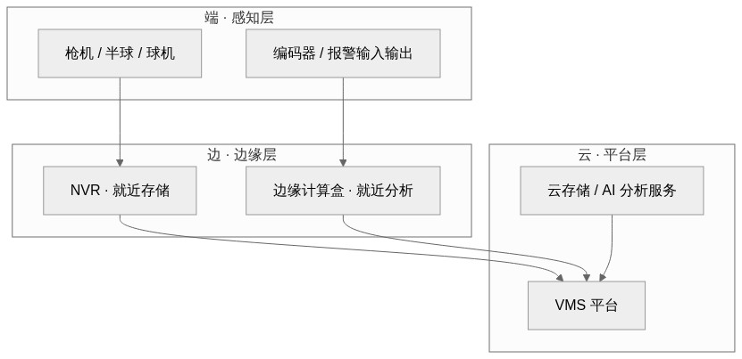
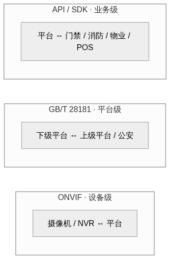
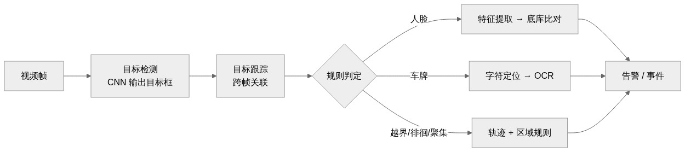
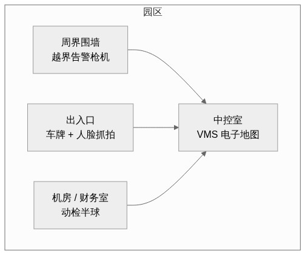
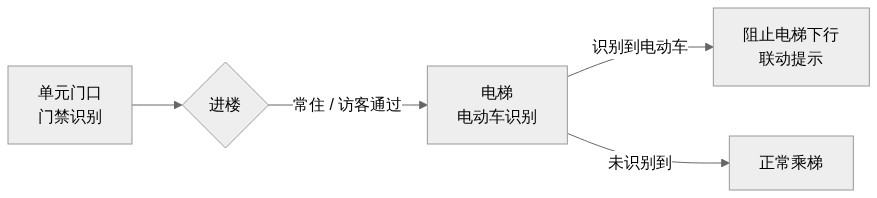

# 视频监控系统（泛视频监控）技术分析

> 本报告**聚焦产品系统本身**：系统架构、技术路径与原理、核心功能、方案设计与落地案例。
> 不含市场规模、行业增速与多厂商横向对比。读者对象：安防 / 智能硬件从业者、方案集成商、实施工程师。
> 与《门禁设备系统技术分析》同系列：门禁管"准入"，视频管"留痕"，两文互为对照。

---

## 一、系统总览：视频监控在管一条"看得见的证据链"

一句话定位：**视频监控系统是以摄像机为感知末梢、以平台为中枢，串联采集—传输—存储—分析—调阅全链路的视觉基础设施**。

视频监控的价值不在"看见"，而在"留痕"。门禁回答"谁进来了"，视频回答"进来之后发生了什么"；前者是信任闭环，后者是证据链。两者最典型的联动是**门禁事件触发视频复核**——门被刷开的一瞬间，画面已经把现场定格，通行记录与影像一一对应。

这条链部署在物理上互相独立的三层：前端摄像机与编码器负责采集，网络负责送流，平台与存储负责管理画面。技术原理章节沿链路的四个环节逐层拆开：**采集层先"把画面拍清楚"，传输层再"把画面送到该去的地方"，存储层保证"证据存得住、调得出"，分析层实现"从看得见到看得懂"**。

---

## 二、系统架构：画面是怎么送到该去的地方

把几十路摄像机接进一个平台，架构上要回答三件事：画面从哪来、存在哪、谁来管。答案是云—边—端三层，外加一条贯穿的传输链路。

### 2.1 总体架构：云—边—端三层

- **端（感知层）**：摄像机、编码器、报警输入输出，负责抓帧与信号接入。
- **边（边缘层）**：NVR 就近存储、边缘计算盒就近分析，是整张网"断网不断档"的兜底。
- **云（平台层）**：VMS 平台、云存储、AI 分析服务，负责统一管理、跨网点汇聚与模型迭代。

三层协同的逻辑与门禁的"离线决策"同一思路：联网时数据上云、策略下发；断网时边缘续录，恢复后自动补传。把"能不能录"的底线放在本地，而不是押在链路的稳定性上。

### 2.2 感知层：摄像机怎么选

选摄像机先定形态，再抠参数。形态决定安装方式与视野，参数决定画面质量与成本。

| 形态 | 结构特点 | 适用场景 |
| --- | --- | --- |
| 枪机 | 固定机身、可换镜头，视角与焦距灵活 | 周界、通道、大范围固定场景 |
| 半球 | 吸顶隐藏式，外壳防破坏 | 室内公共区域、电梯厅 |
| 球机 / PTZ | 云台旋转 + 变焦，可设巡航路线 | 开阔区域、需要追踪目标时 |
| 全景 | 多传感器拼接，单机覆盖无死角 | 大厅、路口、仓库 |
| 热成像 | 温度成像，不依赖可见光 | 夜间周界、火点与测温场景 |

参数与场景的对应关系，是选型争议的集中地：

| 参数 | 关注点 | 场景对应 |
| --- | --- | --- |
| 分辨率 | 2MP / 4MP / 8MP；决定细节还原与存储成本 | 出入口抓拍、人脸用 4MP 以上；周界 2MP 够用 |
| 帧率 | 25fps 才流畅；运动细节由帧率 × 快门决定 | 抓拍场景要用高速快门，靠帧率补足 |
| 低照度 | 星光级可达 0.001lux 级 | 无补光的夜间点位 |
| 宽动态 WDR | 逆光下明暗同清，看动态范围 dB 值 | 门口、窗边、出入口等逆光位 |
| 红外距离 | 补光覆盖范围 | 夜间周界、无灯通道 |
| 防护等级 | IP66、防爆、防腐蚀 | 室外、化工、海边点位 |

**智能摄像机**把 AI 塞进前端，人脸、车牌、行为分析在机内完成，只上送事件与抓拍图。好处是省带宽、低延迟、隐私可控；代价是算力固定，模型升级只能换机。分析放在哪一层，见 2.5 的三级权衡。

### 2.3 传输层：画面怎么传

传输层走的是"介质—供电—协议—组网"四件事。

**介质演进**：同轴电缆是模拟时代的选择，DVR 集中录像；网络化之后是 IPC + 交换机 + NVR 的 IP 架构，布线用网线；超过 500 米或跨楼宇时改用单模光纤；取电困难的偏远点位用 4G/5G 无线回传。

**供电方式**：PoE 用一根网线同时传数据和电，施工成本最低，但注意 PoE 每口 15.4W、PoE+ 每口 30W 的功率上限——带红外补光的摄像机夜间峰值功率可能逼近 PoE 上限，超出就用 PoE+ 或就近供电；野外点位常用太阳能 + 电池组合。

**协议与标准**：**ONVIF** 解决设备互联（Profile S 覆盖视频、G 覆盖录像回放、T 覆盖云台）；**GB/T 28181** 是国标对接的基石——公安联网、平台级联都走它，信令用 SIP、媒体用 RTP，支持目录、实时预览、录像回放、云台控制。选型时"支持 GB28181 接入"应写进验收条款，否则后续联网改造要返工。

**组网要点**：带宽按"主码流 + 子码流 × 路数"估算，交换机带宽预留 30% 以上。实例：单路 2MP H.265 主码流 2Mbps + 子码流 0.5Mbps ≈ 2.5Mbps，32 路约 80Mbps——千兆交换机有余量，百兆口只宜接 8 路以内。网络安全三条底线：改掉默认口令、关闭用不到的端口（尤其公网映射）、业务网与办公网 VLAN 隔离。

### 2.4 存储层：证据怎么存

存储回答"证据存得住、调得出"，是证据链的核心。存储形态与录像策略决定容量与成本。

**存储形态**：NVR 就近存储是主流（部署简单、断网兜底）；CVR 集中存储适合多网点汇聚与统一管理；云存储随取随扩但依赖带宽；摄像机内置 SD 卡做最后一道断网兜底。

**录像策略**是容量管理的第一杠杆：

- **定时录像**：全时段，最费容量。
- **动检录像**：画面变化才录，静止场景（走廊、仓库、夜间无人区）可省 60%–80% 容量。
- **事件录像**：报警或联动触发（门禁开门、入侵告警），证据价值最高。
- 混合策略：重点区域定时 + 一般区域动检。事件录像务必配**预录**（事件前 3–10 秒），否则联动抓不到"开门瞬间"。

**容量计算**：单路每天容量(GB) ≈ 码流(Mbps) × 10.5。

| 码流 | 单路每天 | 典型对应 |
| --- | --- | --- |
| 1Mbps | ≈ 10.5GB | 子码流 / 低清 |
| 2Mbps | ≈ 21GB | 2MP H.265 典型 |
| 4Mbps | ≈ 42GB | 4MP H.265 或 2MP H.264 |
| 8Mbps | ≈ 84GB | 4MP 高码流 / 8MP |

实例：30 路 2MP、H.265、平均 2Mbps、存 30 天，裸容量约 18.5TB；考虑 RAID5 冗余损耗（可用空间约为标称的 90% 以下），需约 22TB 可用，对应 7 块 4TB 或 5 块 6TB 硬盘。把非重点区域改动检策略，容量需求还能再降四成以上——先算容量再定策略，是方案设计里最容易被跳过的一步。

**可靠性**：RAID5/RAID6 防单盘故障；监控级硬盘按 7×24 设计；录像加密与防篡改保证证据在法庭上可用；断网续录由边缘 NVR 或 SD 卡完成，恢复后补传。

### 2.5 分析层：从"看得见"到"看得懂"

智能分析把录像从"被动留证"变成"主动发现"。按输出分类：

| 分析类型 | 输出 | 典型场景 |
| --- | --- | --- |
| 目标检测 | 人 / 车 / 物检测框 | 计数、密度、区域入侵 |
| 人脸识别 | 身份匹配或陌生人告警 | 出入口、黑名单布控 |
| 车牌识别 | 车牌号与抓拍图 | 出入口、违停 |
| 行为分析 | 越界 / 徘徊 / 聚集 / 烟火 | 周界、重点区域 |
| 客流统计 | 进出人数 | 零售、场馆 |

分析引擎放哪一层，是三选一的权衡：

| 位置 | 优势 | 代价 |
| --- | --- | --- |
| 前端（摄像机内） | 实时、省带宽、只上送事件 | 算力固定、模型升级难 |
| 边缘（盒子 / NVR） | 算力可升级、批量接入存量设备 | 单点故障、统一管理成本 |
| 云端 | 算力大、模型迭代快 | 带宽与延迟成本、隐私风险 |

合规红线与门禁文档一脉相承：人脸采集须有告示、遵循最小必要；能用人数统计解决的，就不要上人脸识别。分析层越智能，越要先把"采什么、存多久、给谁用"写清楚。

### 2.6 平台层：一张图管起整张网

平台（VMS）是证据链的收口。核心能力：实时预览、录像回放（按时间/事件检索）、电子地图、报警中心、电视墙、多级用户权限。联动能力是平台的增值点——与门禁（开门事件触发抓拍）、消防（火警联动弹窗复核）、梯控、广播、声光报警对接，把视频从"孤立的录像"变成"其他系统的眼睛"。开放能力决定可集成性：GB28181 级联、ONVIF 接入、API/SDK 对接第三方——三个接口的分工、接口内容与选型见 2.7。

一个容易被忽视的点：**平台自身的操作也要留痕**——谁、在什么时间、调阅了哪段录像，审计日志本身就是证据链的一部分。

### 2.7 开放接口：ONVIF、GB28181 与 API/SDK 各管一段

视频监控的互联互通分三个层面，三个接口各管一段、互不替代：**ONVIF 管设备级接入，GB/T 28181 管平台级联网，API/SDK 管业务级集成**。

#### 2.7.1 ONVIF：设备级"即插即用"

**ONVIF**（Open Network Video Interface Forum）是国际行业标准，2008 年由安讯士、博世、索尼等厂商发起，用 Web Service（SOAP/XML）定义接口。设备发现走 WS-Discovery 组播，接入流程是"发现 → GetCapabilities 查询能力 → 按 Profile 调用服务"。核心服务模块：Device（设备信息与能力查询）、Media（码流与媒体配置）、PTZ（云台控制）、Event（事件订阅与通知）、Recording（录像与回放）。互操作能力按 **Profile** 分级认证：

| Profile | 覆盖能力 | 说明 |
| --- | --- | --- |
| S | 实时视频、音频、PTZ | 流媒体基础，2011 年发布 |
| G | 录像、回放、导出 | 存储互操作 |
| T | H.265、4K、元数据 | 增强流媒体，2018 年发布 |
| M | 分析元数据与事件 | 智能分析接口，2019 年发布 |

特点与边界：**优点**是厂商中立——摄像机换品牌、平台不用改，Profile 认证保证基础互操作；**局限**是智能分析各家私有，Profile M 虽定义了分析元数据但厂商实现参差，人脸、行为这类高级能力仍靠私有接口；且只解决"接入"，不解决业务。

#### 2.7.2 GB/T 28181：平台级"国标联网"

**GB/T 28181**（现行 2022 版）是公共安全视频监控联网的国家标准，面向公安联网与跨平台级联。协议架构为 **SIP 信令 + RTP 媒体**：信令用 SIP 扩展，消息体为 XML（MANSCDP），以 CmdType 区分操作类型；媒体用 H.264/H.265 编码、PS 封装走 RTP，SDP 的 s 字段区分实时（Play）与回放（Playback）。主要交互：

| 操作 | 信令 / 消息 | 作用 |
| --- | --- | --- |
| 注册 / 注销 | REGISTER | 下级向上级注册 |
| 心跳 | MESSAGE Keepalive | 设备状态保活 |
| 目录查询 | MESSAGE Catalog | 下级上报设备目录 |
| 实时取流 | INVITE（SDP） | 建立 RTP 实时流 |
| 录像回放 | INVITE Playback | 回放与录像下载 |
| 云台控制 | MESSAGE PTZ | 远程操控 |
| 报警上报 | MESSAGE Alarm | 事件上联 |

级联模式下多级平台（省—市—县）逐级注册，公安联网、雪亮工程类项目把"支持 GB28181"列为硬性验收项。

特点与边界：**优点**是国标强制、跨厂商平台互通，覆盖"信令 + 媒体 + 设备管理 + 报警上报"的完整闭环；**局限**是实现复杂度高，厂商兼容性参差——目录不全、取流不稳定是联调高频坑；RTP 媒体穿 NAT/防火墙要专门规划端口映射。

#### 2.7.3 API / SDK：业务级"能力开放"

**API/SDK** 是平台对外开放的 HTTP REST 接口、WebSocket 推送与各语言 SDK，把视频能力嵌入门禁、消防、物业工单、零售 POS 等业务系统。接口按用途分六类：

| 类别 | 典型接口 | 用途 |
| --- | --- | --- |
| 设备管理 | 添加 / 删除 / 查询设备 | 批量纳管 |
| 取流 | 预览 URL（RTSP / WebRTC / HLS） | 嵌入业务页面实时查看 |
| 录像 | 检索 / 回放 / 下载 | 证据调取 |
| 事件 | Webhook 回调、报警查询 | 实时联动 |
| 智能 | 底库管理、布控任务下发 | 复用平台 AI 能力 |
| 控制 | 云台、报警输出 | 远程处置 |

鉴权常见三种：AK/SK 签名、Token、OAuth2。事件推送两种模式：**Webhook** 由平台主动推给第三方（实时，但第三方要提供可接收的回调端点）；**轮询**由第三方定时拉取（实现简单，有延迟）。案例 C 的 POS 联动、案例 E 的门禁事件复核，本质都是 API 对接。

特点与边界：**优点**是灵活、按业务定制，是三个接口里唯一能把视频能力"长进"业务系统的；**局限**是厂商私有、无统一标准，接口文档与版本管理差异大，集成需要开发投入。

#### 2.7.4 三个接口怎么选

| 维度 | ONVIF | GB/T 28181 | API / SDK |
| --- | --- | --- | --- |
| 定位 | 设备级互联 | 平台级联网 | 业务级集成 |
| 解决什么 | 异构设备接入、换品牌不换平台 | 跨平台级联、公安上报 | 视频能力嵌入业务系统 |
| 协议基础 | Web Service（SOAP/XML） | SIP + RTP + XML | HTTP REST / WebSocket / SDK |
| 标准程度 | 国际行业标准 | 国家标准（强制） | 厂商私有 |
| 主要局限 | 智能分析私有 | 实现复杂、兼容性参差 | 无统一标准、需开发投入 |

选型不是三选一：项目内异构设备接入用 ONVIF；公安联网、多级平台级联用 GB28181（写进验收条款）；与业务系统打通用 API/SDK。大型项目三者叠加——ONVIF 接设备、GB28181 上联、API/SDK 对接业务，是常态。

判断一套平台的开放能力，先问三个问题：能不能接异构设备（ONVIF）、能不能对外级联（GB28181）、能不能让业务系统用起来（API/SDK）。

---

## 三、技术原理：一帧画面怎么变成可用的证据

架构讲"怎么部署"，原理讲"凭什么可信"。本节沿成像、编码、分析三个环节展开，最后落到可验收的指标。

### 3.1 成像：从光子到像素

CMOS 传感器把光子转成电子：每个像素覆盖一层 Bayer 滤色阵列，只记录红、绿、蓝中的一种分量，再经去马赛克算法插值还原彩色图像。决定低照度能力的关键不是分辨率，而是**单像元进光量**——同样 200 万像素，传感器靶面从 1/2.7" 做到 1/1.8"，单像元面积增加约六成，夜间画质随之拉开差距。

两个常被误解的指标：

- **宽动态（WDR）**：逆光场景（门口、窗口）明暗反差大，单次曝光顾此失彼。多帧合成（DOL-HDR）连续拍不同曝光的帧再合成一张，明暗都清晰。评价看动态范围，120dB 以上才算有实际意义。
- **低照度**：光线不足时靠大靶面 + 大光圈 + 慢快门。慢快门会拖影，运动场景慎用；镜头前的 IRCUT 滤镜切换决定彩色/黑白模式，星光级（0.001lux 级）在无补光环境也能出可用画面。

红外补光两个波长：850nm 看得远但有红曝（人眼可见微红光），940nm 无红曝但距离短。住宅与写字楼场景优先 940nm，避免扰民。

### 3.2 编码压缩：H.264 / H.265 与码流换算

编码决定码流，码流决定存储与带宽。H.265（HEVC）比 H.264 同画质省码率 30%–50%；H.265+ / Smart 编码在此基础上加场景自适应——静止区域自动降码率，实际省量取决于场景动静比例，静态场景更省。编码层面一个实用配置是**双码流**：主码流高清用于存储与回放，子码流低清用于实时预览与移动端，互不抢占带宽。

码流与存储的换算见 2.4 的公式与速算表——方案阶段先估码流，再定分辨率与存储策略，避免"装完发现 30 天存不下"。

### 3.3 智能分析：深度学习怎么做检测与识别

一条智能分析流水线，从视频帧到告警事件：

- **检测**：卷积网络在每帧输出目标框与类别（人、车、物）。
- **跟踪**：按位置与外观特征把跨帧的检测框关联成轨迹，行为分析依赖轨迹而非单帧。
- **识别**：人脸与车牌走"特征提取 → 底库比对 → 阈值判定"。人脸比对用特征向量相似度，阈值高低在 FAR（认错人）与 FRR（漏认人）之间取舍——与门禁文档 2.1 同一对跷跷板。

评价一套智能分析，看两组指标：检出率与误报率（告警可信度），FAR 与 FRR（识别准确度）。厂商宣传的"准确率 99%"如果不说清场景与阈值，参考价值有限。

### 3.4 端到端可验收指标

技术讲解最后落在可量化、可验收的指标上：

| 指标 | 参考基准 | 意义 |
| --- | --- | --- |
| 实时预览延迟 | 局域网 < 1s | 监控实时性 |
| 录像完整性 | 事件录像不丢帧、可回查 | 证据有效性 |
| 断网续录 | 断网期间本地完整、恢复补传 | 弱网现场可用性 |
| 存储达标率 | 计划天数内无覆盖 | 合规留痕 |
| 智能识别 | 检出率 / 误报率按场景调优 | 告警可信度 |

---

## 四、核心功能清单

- **实时预览 / 录像回放 / 云台控制**：回放支持按时间、事件、智能检索。
- **智能分析**：人脸、车牌、行为（越界/徘徊/聚集/烟火）、客流统计。
- **报警联动**：门禁、消防、梯控、声光、广播，电子地图弹窗定位。
- **电子地图 / 多级权限 / 审计留痕**：操作与调阅全程可查。
- **开放接口**：ONVIF、GB28181、API/SDK 对接第三方系统（接口内容与选型详见 2.7）。

---

## 五、场景方案与落地：从图纸到交付

本节面向集成商与实施工程师，以现实案例讲解"怎么把系统装进一栋真实的建筑"。核心是一个主流程，再加五个贴近生活的案例。

### 5.0 通用设计流程

无论多复杂的视频监控，落地都遵循同一条主流程：

点位勘察先回答两个问题：管什么（周界、出入口还是重点区域）、留什么证据（24 小时全录还是事件录像）；同时勘察走线与取电条件。方案设计阶段把点位图画出来，带宽与存储按 2.3、2.4 的公式算清楚，再出设备清单。安装调试阶段调整角度与补光、配置平台与联动。验收按 3.4 的指标逐项实测。

### 案例 A · 园区 / 企业：周界 + 出入口 + 重点区域

**场景痛点**：周界围墙长、翻墙难防；出入口车辆与人员无留痕，出事查不到；机房、财务室等重点区域处于监控盲区。

**方案设计**：三个区域三类点位——周界布越界告警枪机，配红外补光夜间布防；出入口布车牌抓拍枪机 + 人脸抓拍半球，所有进出留痕；机房、财务室布 4MP 动检半球，下班后布防。全部汇入中控室 VMS 电子地图。

**选型要点**：周界枪机带越界/入侵智能分析，防护等级 IP66，夜间靠红外补光；出入口抓拍机要高速快门（1/500s 以上）配合补光，应对逆光与车灯；重点区域半球选 4MP 以上，动检灵敏度可调。

**安装要点**：周界机位对准围墙内侧、预留 1–2 米防翻越盲区，规避逆光；出入口抓拍角度与车行方向夹角小于 30°，避免车牌反光误读；室外线缆穿管、做防雷接地，接头用防水处理。

**配置调试**：周界布防按时段设置（夜间布防、白天撤防，减少行人误报）；车牌白名单用于内部车辆快速通行联动；重点区域动检灵敏度按现场调优，避免空调、灯光触发误录。

**验收**：越界告警准确率达标、告警可追溯；出入口抓拍与门禁通行记录能一一关联；重点区域录像按计划天数完整留存。

### 案例 B · 老旧社区改造：高空抛物 + 电动车入梯 + 消防通道占用

**场景痛点**：高空抛物取证难，没有证据无法追责；电动车进楼充电引发火灾；消防通道常被占用，火灾时救援受阻。

**方案设计**：加三道防线——每栋楼装仰角高空抛物摄像机，24 小时定时录像留证；电梯内装电动车识别，识别到电动车即阻止电梯下行并联动提示（呼应门禁案例 B 的入梯管控）；消防通道口布区域入侵检测，占用即告警并联动声光。

**选型要点**：高空抛物摄像机要 4MP 以上、宽动态强（对天空逆光），安装时校准覆盖楼层范围；电梯内用广角摄像机 + 补光，识别算法要覆盖常见车型与反光干扰；消防通道用带区域规则的枪机或半球。

**安装要点**：抛物机位贴墙朝上，只拍抛物轨迹、不拍住户室内——这条是隐私合规底线，镜头角度要现场实测校准；电梯内机位避开正对轿门反光；消防通道机位对准通道口，避免被堆物遮挡。

**配置调试**：抛物录像建议保留 30 天以上，满足取证周期；电动车识别联动梯控输出，识别到即阻止关门下行；消防通道占用布防 24 小时，占用超时（如 3 分钟）才告警，减少误报。

**验收**：抛物事件能回查到坠落轨迹与精确时间；电动车进梯触发告警且联动成立；消防通道占用告警可复核、可追溯。

### 案例 C · 连锁零售：客流统计 + 防损

**场景痛点**：客流量靠人工数、不准确；内盗与偷盗损耗难定位；收银纠纷没有证据。

**方案设计**：入口布双目客流统计摄像机（进出双向计数）；货架区与仓库布动检监控做防损；收银台监控与 POS 流水联动——交易异常（高退货率、频繁取消）可回查对应时段画面。

**选型要点**：客流统计要双向计数、抗遮挡；收银台机位角度要同时覆盖扫码枪与现金区。

**配置调试**：客流统计装完先人工计数校准一天，误差控制在 5% 以内再投入使用；POS 对接小票流水，按店、按时段生成转化率报表（成交单数 ÷ 进店人数）。

**价值**：进店转化率与损耗率变成可量化指标——客流动线指导陈列调整，防损监控让损耗定位到具体时段与点位。这套数据的价值，往往超过监控本身。

### 案例 D · 工地 / 工厂：AI 施工安全 + 生产安全

**场景痛点**：未戴安全帽、未穿反光衣的违规频发；塔吊、基坑、配电房等危险区域有人闯入；动火作业区存在明火隐患。

**方案设计**：出入口与作业面布 AI 摄像机，识别安全帽与反光衣，违规即联动声光柱与广播提醒；危险区域布区域入侵检测；动火区布烟火检测。

**选型要点**：AI 识别可做在前端摄像机或边缘盒子（复用存量枪机，成本更低）；反光衣识别对夜间与红外成像有要求，选型时确认夜间可用性。

**安装要点**：作业面机位覆盖主要通道与作业点，避开强逆光；工地环境选 IP66 防尘防水款，支架考虑抗风。

**配置调试**：识别阈值按现场调优，戴帽/未戴帽边界要实测；告警联动闭环——识别 → 声光提醒 → 值班室弹窗确认，值班室可在平台复核后处置。

**验收**：三类告警（安全帽、区域入侵、烟火）检出率达标、误报可接受；联动闭环成立，告警事件全程可追溯。

### 案例 E · 数据中心 / 高安全区：与门禁联动视频复核

**场景痛点**：单靠门禁只有通行记录、没有视觉证据；双人授权区域缺乏全程留痕；消防联动需要视频画面复核现场。

**方案设计**：门禁事件联动抓拍与预录——刷卡或开门瞬间，对应点位摄像机抓拍并保留前后 5 秒预录；双人授权区域全程定时录像；消防火警触发平台弹窗，值班员远程复核画面（呼应门禁案例 C 的应急联动）。

**选型要点**：联动依赖平台的事件对接能力，选型时确认门禁与视频平台支持事件级联动；全程录像区域按定时策略配置。

**配置调试**：联动规则逐条配置（开门事件 → 指定点位抓拍 + 预录）；录像策略分级——机密区 90 天、一般区 30 天；门禁事件与视频画面建立关联检索，按"人—门—时间"回溯。

**验收**：门禁事件与视频画面一一对应、可一键调阅；模拟火警验证联动弹窗复核成立；录像留存天数实测达标。

---

## 六、应用场景速览

一套能力映射多个场景，本质是同一份"证据链"在不同场所的复刻：

| 场景 | 核心诉求 | 对应方案 / 技术点 |
| --- | --- | --- |
| 园区 / 企业 | 周界、出入口、重点区域 | 案例 A；越界分析、车牌与抓拍留痕 |
| 社区 / 住宅 | 高空抛物、电动车、消防通道 | 案例 B；仰角机位、AI 识别、隐私合规 |
| 连锁零售 | 客流、防损 | 案例 C；客流统计、POS 联动 |
| 工地 / 工厂 | 施工与生产安全 | 案例 D；安全帽 / 烟火检测、声光联动 |
| 数据中心 / 高安全区 | 视频复核、全程留痕 | 案例 E；门禁事件联动、分级录像策略 |
| 学校 / 医院 | 重点区域分级监控、合规适配 | 平台多级权限 + 人脸采集合规（2.5、2.6） |
| 交通 / 出入口 | 车牌识别、违停抓拍 | 分析层 2.5；高速快门与补光 |

---

## 七、结语：评价一套视频监控，看三条

沿本篇的脉络收敛，判断一套视频监控系统是否靠谱，不看它堆了多少路数与像素，而看三件事：

1. **证据链是否闭环**：采集 → 传输 → 存储 → 分析 → 调阅全程可追溯，录像按验收指标可回查——链路任何一环断掉，整套系统的价值都归零。
2. **断网与合规是否兜底**：断网时边缘能续录、恢复后能补传；人脸采集有告示、遵循最小必要。这两条决定现场真实可用与可验收。
3. **能否变成数据资产**：与门禁、消防联动，让视频成为其他系统的"眼睛"；智能分析把录像变成客流、安全、运营数据——这时候监控不再是成本，而是资产。

把这三个问题答清楚，比任何一张参数表都能更快说明"这套系统到底行不行"。
